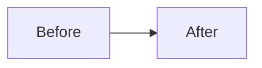

## The problem

What goes wrong without it.

## How it works

```mermaid
flowchart LR
  A[Before] --> B[After]
```

## When to use it

- The shape of system it suits, and the one it does not.

## Trade-offs

- What it costs.
