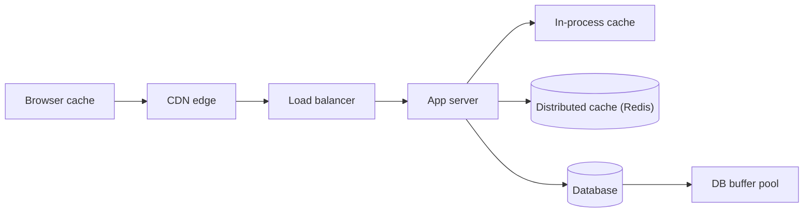
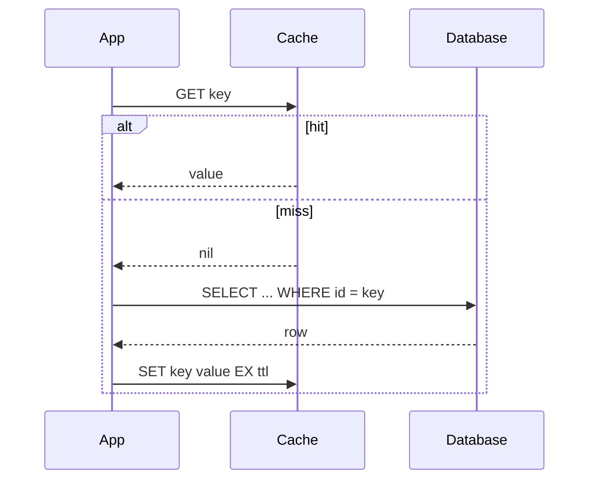

## The problem

A database round trip costs milliseconds and a lock; a memory lookup costs microseconds and nothing. Most read traffic is concentrated on a small fraction of keys. Serving the hot fraction from memory is the single cheapest way to take an order of magnitude off both latency and database load.

The catch is that a cache is a second copy of the truth, and every second copy can drift.

## Where a cache can sit

Each layer is closer to the reader and further from the writer. The further from the writer, the longer it takes for an update to become visible.

## Read patterns

### Cache-aside

The application owns the cache. On a miss it reads the database, then writes the value into the cache with a TTL.

Simple, and the cache can fail without taking reads down. The cost is the thundering herd: when a hot key expires, every reader misses at once and stampedes the database. Fix with a short lock around the refill, or by refreshing slightly before expiry.

### Read-through

The cache itself fetches on a miss. Same semantics as cache-aside with the loader moved into the cache library. Fewer lines of application code, less control.

## Write patterns

| Pattern | On write | Consistency | Risk |
| --- | --- | --- | --- |
| Write-around | Update DB, invalidate cache key | Next read refills | Cheap; brief miss spike |
| Write-through | Update DB and cache together | Cache always fresh | Every write pays twice |
| Write-back | Update cache, flush to DB later | Fast writes | Data loss if the cache dies |

**Invalidate, do not update.** Updating the cache on write races with a concurrent cache-aside refill: the refill can read the old row and write it *after* your update. Deleting the key has no such race, only a miss.

## Eviction

Memory is finite. When it fills, something has to go.

- **LRU**: evict the least recently used. Default choice; cheap and matches most access patterns.
- **LFU**: evict the least frequently used. Better when a few keys are hot for a long time and one-off scans would otherwise flush them.
- **TTL**: every entry expires. Bounds staleness regardless of eviction and is the only knob that guarantees an upper limit on how wrong a read can be.

## When to use it

- Read-heavy workloads with a skewed key distribution: feeds, profiles, product pages, config.
- Anything computed from several tables that changes far less often than it is read.

## When not to

- Write-heavy, uniformly accessed data. The hit rate will be low and every write still pays for invalidation.
- Anything where a stale read is a correctness bug, such as an account balance or an inventory count, unless the write path is transactional with the cache.

## Trade-offs

- **Latency for staleness.** The TTL is the contract; say it out loud in an interview.
- **Operational surface.** A cache cluster is another thing to size, monitor and fail over. A cold cache after a restart looks like a database outage.
- **Hot keys.** One key served from one cache node is a single point of load. Replicate hot keys or add a small in-process layer in front.
