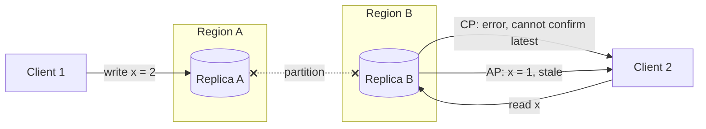
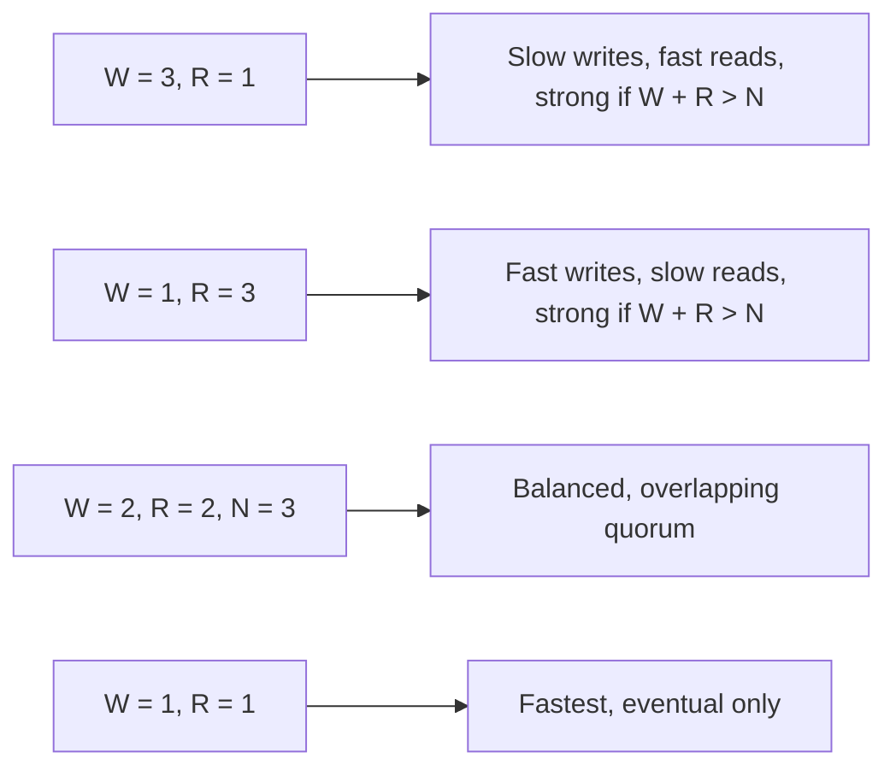

## The theorem, precisely

A distributed system with replicated data cannot simultaneously guarantee all three of:

- **Consistency**: every read returns the most recent write, or an error.
- **Availability**: every request to a non-failed node gets a non-error response.
- **Partition tolerance**: the system keeps operating when the network drops messages between nodes.

Partitions are not optional in a real network, so P is always chosen. The real decision is what to do *while* a partition is in progress: stay consistent and reject some requests, or stay available and let replicas diverge.

## CP versus AP in practice

| | CP | AP |
| --- | --- | --- |
| During a partition | Minority side refuses writes, maybe reads | Both sides accept, reconcile later |
| Examples | ZooKeeper, etcd, Spanner, single-leader SQL with sync replication | Dynamo, Cassandra, Riak, DNS, most caches |
| Suits | Locks, leader election, config, money | Feeds, carts, counters, presence |
| Cost | Unavailability, cross-node latency on every write | Conflict resolution code, stale reads |

Most systems are not one or the other. A product is usually CP for the account ledger and AP for the activity feed, and the design conversation is about drawing that line.

## Beyond the partition: PACELC

CAP only speaks about partitions. The rest of the time there is still a trade: **Else**, when the network is fine, a system chooses between **Latency** and **Consistency**. Synchronous replication to three replicas gives strong consistency and adds a round trip to every write; asynchronous replication is fast and lets a reader see the past.

## Consistency models, strongest to weakest

- **Linearizable**: every operation appears to happen atomically at some instant between its start and end, in one global order. What people mean by "strongly consistent". Requires coordination on every write.
- **Sequential**: one global order, but not tied to real time.
- **Causal**: writes that could have influenced each other are seen in order everywhere; concurrent writes may be seen in different orders. What a comment thread needs: nobody sees the reply before the post.
- **Read-your-writes**: a client always sees its own writes. Cheap to provide by routing a user to the replica they wrote to, and the one users actually notice when it is missing.
- **Eventual**: with no new writes, all replicas converge. Says nothing about when.

## Tunable quorums

Dynamo-style stores let each request choose. With N replicas, a write waits for W acknowledgements and a read queries R replicas.

`W + R > N` guarantees that a read quorum overlaps a write quorum, so at least one replica in every read has the latest value. Below that, reads can be stale, and the system is trading consistency for latency per request rather than globally.

## Resolving divergence

When an AP system accepts writes on both sides of a partition, something has to merge them afterwards.

- **Last write wins** by timestamp. Simple, loses data silently, and clocks are not synchronised.
- **Vector clocks** detect that two versions are concurrent, and hand both to the application to merge, as the original Dynamo did with shopping carts.
- **CRDTs**: data types whose merges are commutative by construction, such as a grow-only counter or an add-wins set. The merge is always automatic and always the same, at the cost of restricting what operations exist.

## Trade-offs

- Strong consistency is a **latency and availability cost paid on every operation**, not just during outages. Pay it where a stale answer would be a bug.
- Eventual consistency is a **complexity cost paid in application code**: every reader has to be written knowing the value may be old.
- The interview answer is never "AP" or "CP". It is "this table is CP because it holds money; this one is AP because it holds likes."
