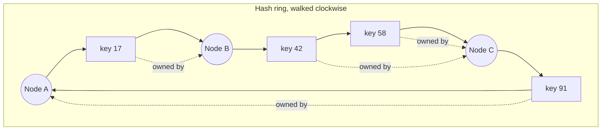
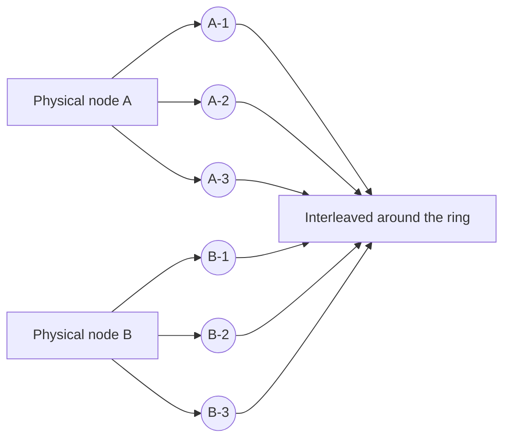

## The problem

The obvious way to spread keys over N servers is `server = hash(key) mod N`. It works until N changes. Go from 4 servers to 5 and `hash(key) mod 5` disagrees with `hash(key) mod 4` for roughly 80% of keys. Every one of those keys is now on the wrong node: a cache empties itself, a datastore has to move most of its data during the exact moment it is under pressure.

## The ring

Hash both keys and nodes into the same space, and picture the space as a ring. A key belongs to the first node found walking clockwise from the key's position.

Add a node D between B and C, and only the keys between B and D change owner, from C to D. Remove C, and only C's keys move, to the next node clockwise. On average a change touches `K / N` keys, which is the minimum possible.

## Virtual nodes

With one point per node the ring is lumpy: a node placed just after another owns almost nothing. The fix is to hash each physical node to many points, typically 100 to 200, called virtual nodes or vnodes.

- Load evens out statistically across the ring.
- A removed node's keys spread across *all* remaining nodes rather than dumping onto one neighbour.
- Heterogeneous hardware gets proportionally more vnodes.

## Lookup

Keep the vnode positions in a sorted array. A lookup is a hash plus a binary search: `O(log V)` where V is the number of vnodes. Membership changes rebuild the array, which is rare and cheap.

## Replication

Store each key on the next R distinct physical nodes clockwise. That is how Dynamo-style stores get durability: the owner and its R minus 1 successors all hold the value, and a failed owner's data is already on the next node in line.

## When to use it

- Distributed caches: a memcached or Redis pool where node churn must not flush the cache.
- Partitioned storage: DynamoDB, Cassandra, Riak, and the key-value store design here.
- Sticky routing: mapping a user or session to the one server that already holds their state, such as a WebSocket connection.

## Trade-offs

- **Still hash-based.** A single enormously hot key still lands on one node. Consistent hashing balances *keys*, not *load*; hot keys need replication or a cache in front.
- **Range queries are gone.** Adjacent keys live on unrelated nodes. If you need "all orders for a customer, in order", partition by a range or a composite key instead.
- **Membership must be agreed.** Every client needs the same view of the ring. In practice that means a coordinator, gossip, or a config service, and a window during changes where two clients disagree.
