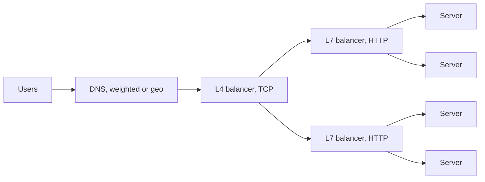
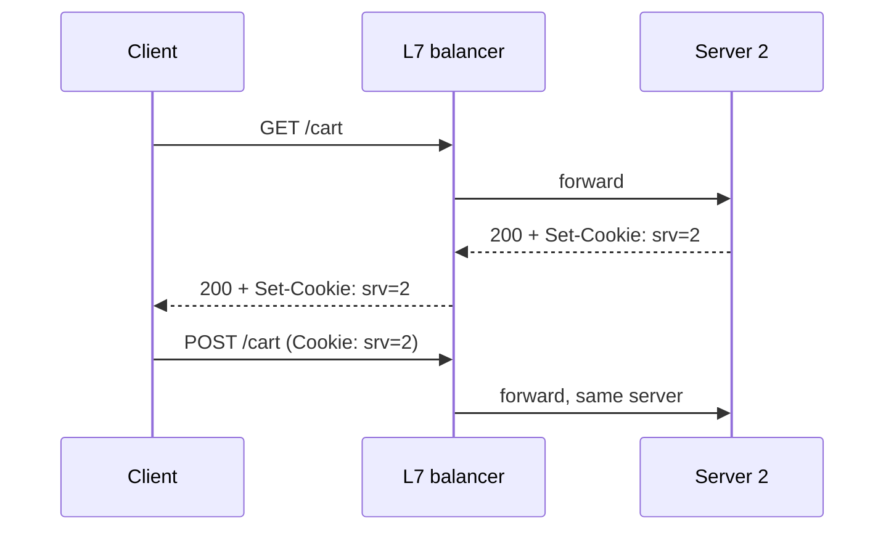

## The problem

One server has a ceiling on connections, CPU and memory, and it will eventually be restarted. A load balancer puts a stable address in front of a pool of servers, forwards each request to a healthy one, and lets the pool grow, shrink and roll out deploys without clients noticing.

## Layers

- **DNS** balances coarsely by handing different IPs to different resolvers. Slow to react, since resolvers cache, but it is how traffic reaches the right region.
- **Layer 4** balances TCP connections by IP and port. Very fast, sees no HTTP, cannot route by path.
- **Layer 7** terminates HTTP and can route by host, path, header or cookie, retry idempotent requests, and terminate TLS. This is where most application routing lives.

## Algorithms

| Algorithm | Picks | Use when |
| --- | --- | --- |
| Round robin | next in the list | Servers are identical, requests are uniform |
| Weighted round robin | proportional to weight | Mixed instance sizes |
| Least connections | fewest in-flight requests | Requests vary in duration |
| Least response time | fastest recent server | Latency is the metric that matters |
| IP hash | `hash(client IP)` | Cheap stickiness without cookies |
| Consistent hash | ring on a key | Route a user to the server holding their cache or socket |

Least connections is the safe default for APIs. Round robin sends the same number of requests to a server that is stuck on a slow one and a server that is idle.

## Health checks

The balancer only helps if it stops sending traffic to dead servers. Active checks poll an endpoint like `/healthz` every few seconds and remove a server after a few failures. Passive checks watch real responses and eject a server that returns errors or times out.

Make the health endpoint cheap and honest: it should fail when the server cannot serve, such as when the database connection pool is exhausted, and nothing else.

## Stickiness

Some applications keep per-user state in server memory, such as a WebSocket connection or a shopping cart in a session object. Then the same user must reach the same server every time.

Stickiness fights the whole point of a pool: a hot server cannot shed load, and a restart loses state. Prefer stateless servers with state in a shared store, and reserve stickiness for connections that are inherently long-lived.

## Availability of the balancer itself

The balancer is now the single point of failure. Run a pair in active-passive with a floating virtual IP, or let a cloud provider run a managed one that is already replicated. Either way, the thing in front of everything has to be more reliable than everything.

## Trade-offs

- **Another hop.** L7 termination adds under a millisecond, but it is a place where TLS, buffering and timeouts all have to be configured correctly.
- **Retries can amplify.** A balancer that retries a slow request on a second server doubles load exactly when the system is already struggling. Retry only idempotent requests, with a budget.
- **Uniform servers are an assumption.** The moment servers differ in what they hold, you are doing routing, not balancing, and consistent hashing is the tool.
