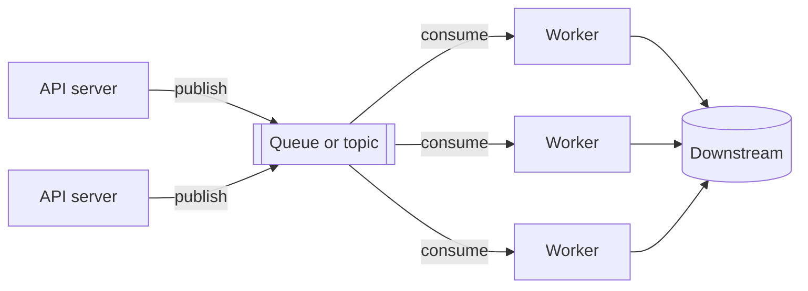
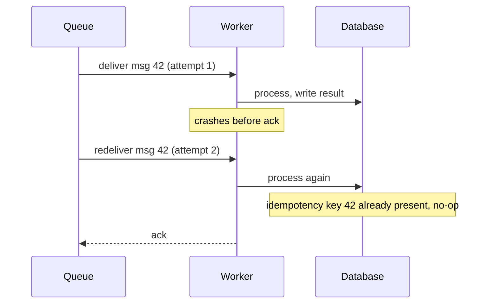

## The problem

A request that sends an email, resizes an image, updates three search indexes and notifies two other services is slow, and fails if any one of those is down. Doing all of that inline couples the request's latency and availability to every downstream system.

A queue turns "do this now" into "record that this should happen". The request finishes as soon as the message is durable; workers do the rest at their own pace.

## Shape

Producers and consumers scale independently. A traffic spike becomes a longer queue, not a pile of errors, and the queue depth is the single most useful graph in the system.

## Queue versus log

| | Queue (SQS, RabbitMQ) | Log (Kafka, Pulsar) |
| --- | --- | --- |
| Message after consumption | Deleted | Retained for a period |
| Multiple consumers | Compete for messages | Each group reads the whole log |
| Ordering | Best effort, or FIFO with limits | Strict within a partition |
| Replay | No | Yes, rewind an offset |
| Fits | Task distribution | Event streams, fan-out, audit |

Use a queue when each message is a job that exactly one worker should do. Use a log when several systems each need every event, or when being able to replay history matters.

## Delivery guarantees

- **At most once**: fire and forget. Fast, and messages vanish on failure. Metrics, maybe.
- **At least once**: the consumer acknowledges after processing; an un-acked message is redelivered. The default, and it means duplicates happen.
- **Exactly once**: at-least-once delivery plus idempotent processing. The queue cannot do this alone; the consumer has to make a repeat harmless.

**Idempotency** is the whole game. Give every message a key, store the key alongside the effect in the same transaction, and skip any message whose key is already there.

## Failure handling

- **Visibility timeout**: a delivered message is hidden from other workers until acked or the timeout passes. Set it longer than the slowest legitimate job.
- **Retries with backoff**: a message that fails repeatedly should wait longer each time, so a downstream outage does not turn into a retry storm.
- **Dead-letter queue**: after N failures, move the message aside instead of retrying forever. Someone looks at the DLQ; it is where the bugs are.

## Ordering

Ordering across a whole queue does not scale, because it serialises consumption. Order within a **partition key** instead: all events for one user go to one partition, processed by one consumer in sequence, while other users proceed in parallel. That is exactly the guarantee a chat conversation or an account ledger needs.

## Backpressure

A queue that only ever grows is a slow-motion outage. Watch the age of the oldest message, alert on it, and either scale consumers on that signal or shed load at the producer. An unbounded queue is not a buffer; it is a place where work goes to be forgotten.

## Trade-offs

- **Eventual, by definition.** The caller gets "accepted", not "done". The UI has to be designed for that.
- **Duplicates and reordering** are normal, not exceptional. Every consumer must tolerate both.
- **Another stateful system** to run, with its own replication and retention story. Managed offerings are worth it here.
