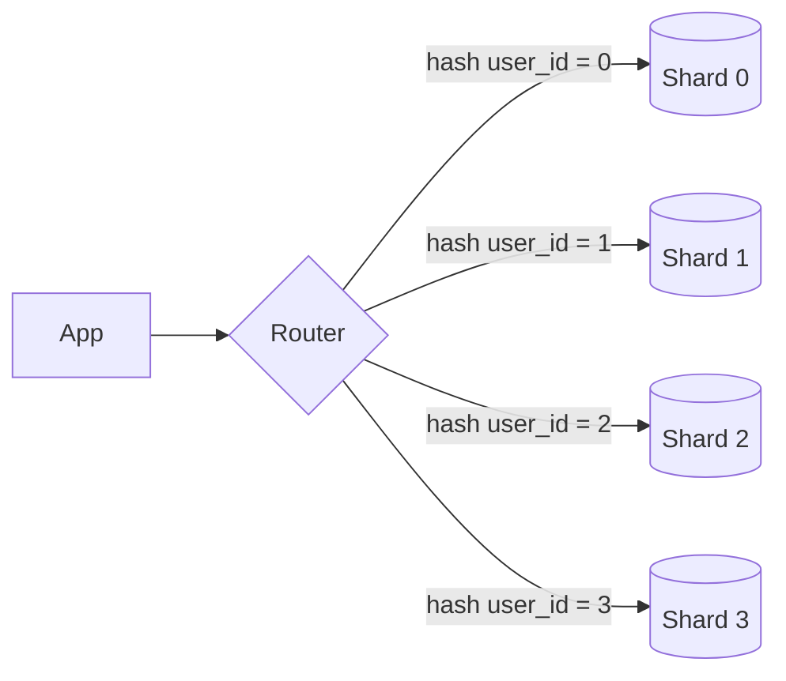
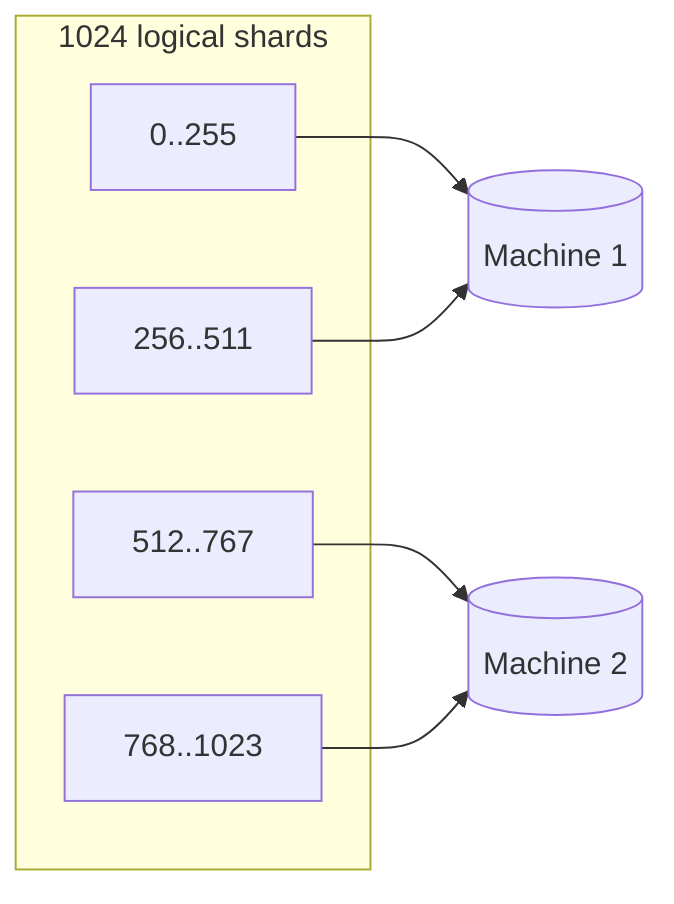

## The problem

Read replicas multiply read capacity, but every write still lands on one primary, and every index still has to fit on one machine. Past a few terabytes or tens of thousands of writes per second, there is no bigger box to buy. The only move left is to make the dataset smaller by splitting it.

## Shard keys

The shard key decides which shard a row lives on, and it is the one decision that is nearly impossible to reverse. Every query that does not include the shard key has to fan out to all shards.

| Strategy | How | Good for | Fails when |
| --- | --- | --- | --- |
| Hash | `hash(key) mod N` or a ring | Even spread, point lookups | Range scans, resharding by `mod` |
| Range | key ranges, like A to F | Range scans, time series | Hot ranges, such as "today" |
| Directory | a lookup table maps key to shard | Full control, easy moves | The directory is a single point of failure |
| Geographic | region column | Data residency, latency | Cross-region joins |

Choose the key that appears in the most queries. For a social product that is almost always `user_id`; for a multi-tenant SaaS it is `tenant_id`.

## What you lose

- **Cross-shard joins.** A join between two rows on different shards happens in the application, one query per shard. Denormalise so that the rows you join live together.
- **Cross-shard transactions.** Two-phase commit is possible and slow. Design so that one user action touches one shard, or accept eventual consistency with an outbox.
- **Auto-increment IDs.** Each shard would generate the same numbers. Use a global ID service or an ID that embeds the shard, see the key-value store and URL shortener designs.
- **Uniqueness constraints** across shards, such as a unique email, need a separate lookup shard keyed by that column.

## Hot shards

Even spread of keys is not even spread of load. One celebrity user's shard takes every read of their profile. Mitigations, in increasing order of effort:

1. A cache in front of the shard takes the reads.
2. Split the hot key itself: append a random suffix, write to `key-0..key-9`, read all ten and merge.
3. Move the hot tenant to a dedicated shard via a directory.

## Resharding

Going from N to 2N shards with `mod` hashing moves half the data. Two ways to avoid that:

- Start with far more logical shards than physical machines, say 1024, and map logical to physical. Moving a logical shard moves one bucket, not a fraction of every bucket.
- Use [consistent hashing](../consistent-hashing/) so that a new node takes only its own slice.

Adding a third machine moves two logical ranges and nothing else.

## Trade-offs

- **Operational cost.** Backups, schema migrations and monitoring are all multiplied by N.
- **Application complexity.** Routing lives in the app or in a proxy such as Vitess or Citus, and every engineer now has to know the shard key.
- **Do it last.** Vertical scaling, read replicas, caching and archiving cold data all come first. Sharding is the step you take when the others have run out.
