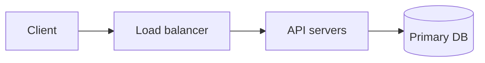

## Requirements

**Functional**

- What the system must do, as bullets.

**Non-functional**

- Latency, availability, consistency, scale. Numbers, not adjectives.

## Estimates

| Quantity | Value | How |
| --- | --- | --- |
| Writes / s | 1,000 | 86M / day ÷ 86,400 |

## High-level design

Walk the diagram: what each box owns, and the request path for the main use case.

## Deep dive: the hard part

The one component the interviewer will push on. Alternatives, and why this one.

## Trade-offs

- What was given up, and what it bought.

## Pitfalls

- The mistake that is easy to make in the room.
