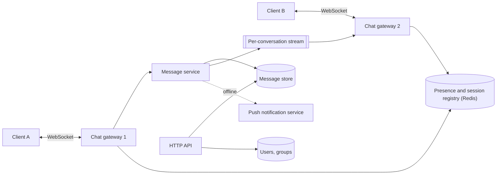
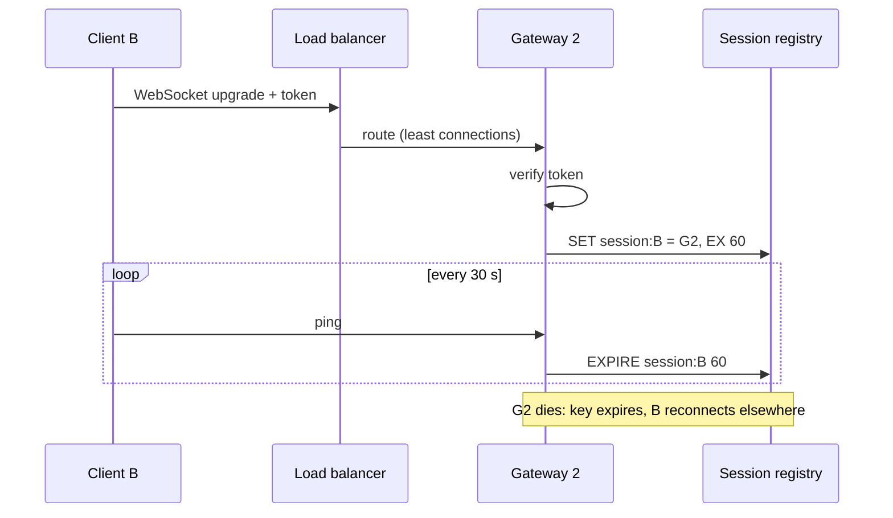
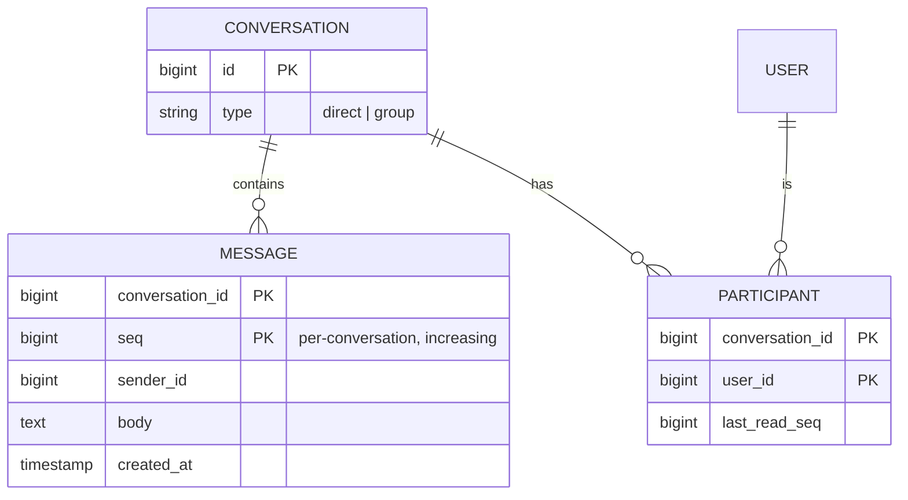

## Requirements

**Functional**

- Send a text message to a person or a group of up to a few hundred.
- Receive messages in real time while online; fetch what was missed when reconnecting.
- Message history, synced across a user's devices, in order.
- Delivery and read receipts. Presence: who is online.

**Non-functional**

- Delivery latency under 500 ms to an online recipient.
- No lost messages, ever. Duplicates are tolerable if the client can dedup.
- Ordering within a conversation must be consistent for all participants.
- 100M concurrent connections; 50M DAU sending 40 messages a day each.

## Estimates

| Quantity | Value | How |
| --- | --- | --- |
| Messages / day | 2B | 50M × 40 |
| Messages / s | ~23,000 avg, ~100,000 peak | 2B ÷ 86,400, peak ×4 |
| Storage / day | ~200 GB | 2B × ~100 bytes |
| Storage / 5 years | ~365 TB | 200 GB × 1,825 |
| Concurrent connections | 100M | given |
| Connections / gateway server | ~500k | tuned Linux, modest memory per socket |
| Gateway servers | ~200 | 100M ÷ 500k |

Two very different workloads: a fleet of stateful servers holding sockets, and a write-heavy, append-only message store. They are separate tiers.

## High-level design

**Connect.** A client opens a WebSocket to a gateway through a load balancer. The gateway authenticates it and records `user_id -> gateway_id` in the session registry.

**Send.** A sends a message over the socket. The gateway forwards it to the message service, which assigns an ID, persists it, and publishes it to the conversation's stream. It acks to A once the write is durable.

**Deliver.** The gateway holding B's socket is subscribed to streams for the conversations of the users it holds, receives the message, and pushes it down B's socket. If B has no socket anywhere, the message service hands it to the push notification service instead.

## Deep dive: the connection tier

A WebSocket is the right transport: full duplex, one TCP connection, tiny frames. Long polling is the fallback for networks that block it.

The gateway's job is narrow: hold sockets, authenticate, forward inbound frames, and write outbound frames. It holds no message state, so a gateway can be killed at any time and its clients reconnect to another. What must survive a gateway death is the mapping of user to gateway, which lives in the registry with a TTL refreshed by heartbeats.

Routing a message to B means asking the registry which gateway has B, then delivering to that gateway. Two ways to do the last hop:

- **Direct**: the message service opens a connection to that gateway and pushes. Simple; a lookup per message.
- **Streams**: gateways subscribe to the conversation streams of their users. The message service publishes once, without knowing who is where. This is what scales to groups, so it is the design.

## Deep dive: ordering and IDs

Two clients in one conversation must see the same order. Sender timestamps cannot do it: clocks differ and messages can arrive out of order. The message service assigns the ID, and the ID is the order.

- A **per-conversation sequence number** is the strongest: strictly increasing, gap-free, and a client can detect a missed message by a gap. It needs one counter per conversation, which is a single `INCR` on a Redis key or a row lock. At 100,000 messages per second spread across millions of conversations, no single counter is hot.
- A **Snowflake ID** from the message service is time-ordered across the whole system with no coordination. Ordering within a conversation is then "as the message service received them", which is consistent for everyone even if not gap-free.

Choose the per-conversation sequence. Gap detection is what makes "fetch what I missed" trivial: the client sends the last sequence it has, the server returns everything after it.

## Data model

The message store is partitioned by `conversation_id` and clustered by `seq`. Every read is "messages in conversation C after sequence S", which is a single-partition range scan. A wide-column store such as Cassandra or ScyllaDB fits this exactly; Discord runs on ScyllaDB with this shape. A one-to-one conversation gets a deterministic ID from the two user IDs so it is never created twice.

Very large conversations grow a partition without bound. Bucket by time: the partition key becomes `(conversation_id, month)`, and a history fetch walks back one bucket at a time.

## Sync across devices

Every device keeps the last `seq` it has for each conversation. On connect it sends those, and the server replies with everything newer. Since the sequence is gap-free, the client can also notice a hole in real-time delivery and ask for the range. This one mechanism handles reconnects, new devices, and lost pushes.

## Group messages

A group of 200 means one persist and one publish; the stream fan-out delivers to every subscribed gateway. The message is stored once, under the conversation, not once per recipient. Receipts are stored per participant as `last_read_seq`, one small update rather than one row per message per reader.

## Presence

Online means "has a live session key". The gateway sets it on connect and the TTL clears it on disconnect or death. Presence updates fan out to friends who are online, throttled: a flapping mobile connection should not broadcast ten times a minute, so publish a change only after it has held for a few seconds.

## Trade-offs

- **Streams over direct delivery** cost a subscription per gateway per active conversation, and buy a single publish for any group size and no lookup on the hot path.
- **Per-conversation sequence** costs one atomic increment per message and buys gap detection and trivial sync. Snowflake is the fallback if that counter ever becomes a problem.
- **Stateless gateways with a registry** mean a reconnect on every gateway deploy. That is the price of being able to deploy at all.
- **Storing once per conversation** rather than per recipient makes history cheap and means deleting for one participant is a per-user tombstone, not a delete.

## Pitfalls

- Ordering by client timestamp.
- Making the gateway smart, so it cannot be restarted without losing state.
- One global message counter.
- Acking to the sender before the write is durable, then losing the message on a crash.
- Unbounded partitions for busy group chats.
