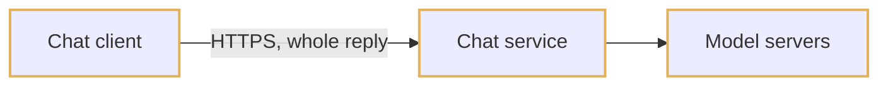
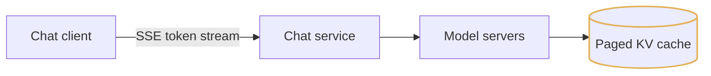
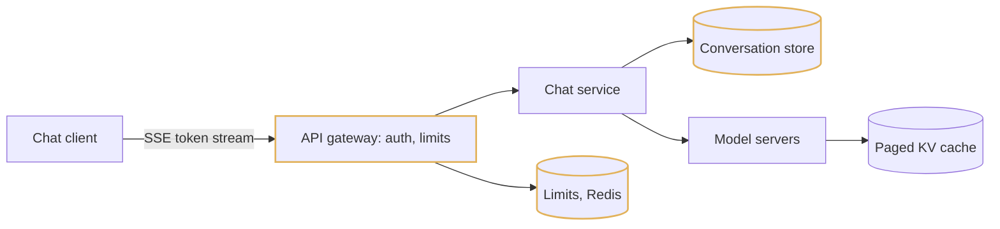
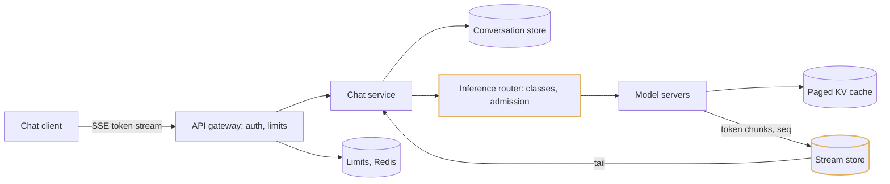
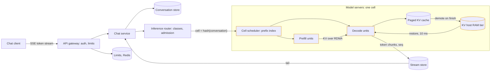
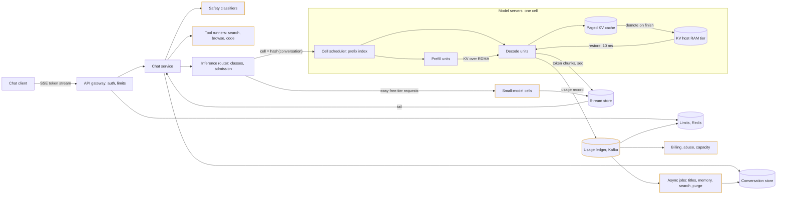
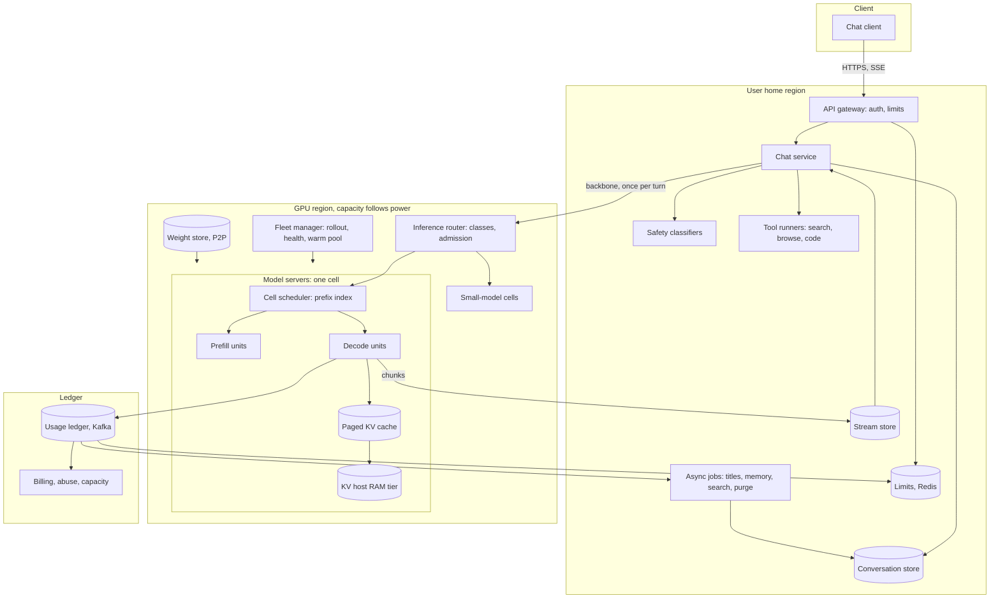
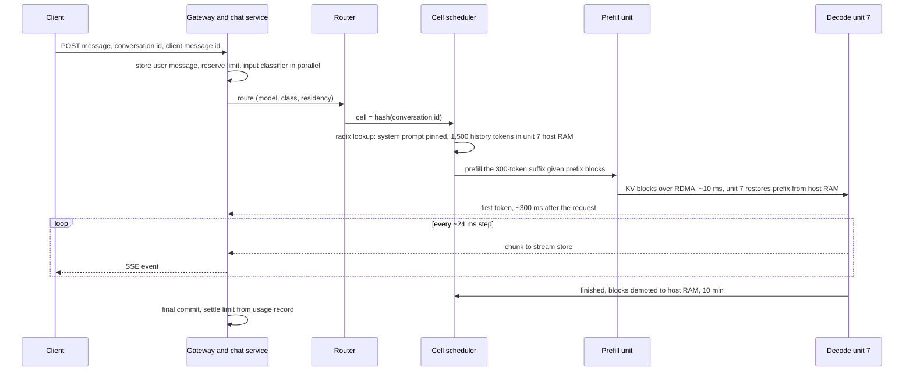
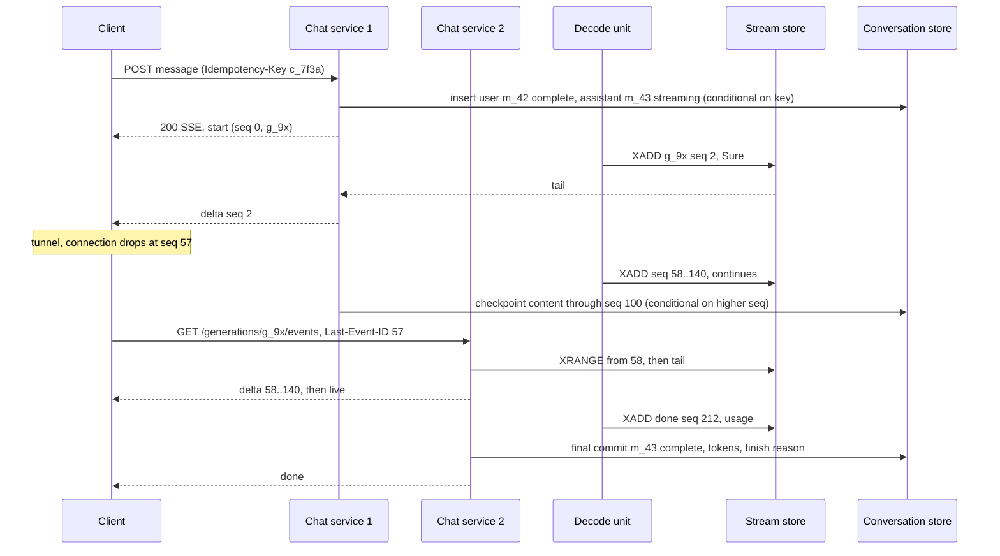
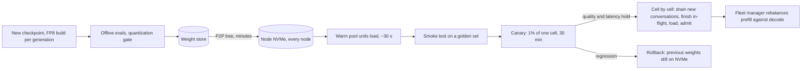

## Requirements

The premise is that inference works: a trained model runs on one GPU box and answers one question. Everything between that box and 300M people a day is the design.

**Functional**

- Chat: send a message in a conversation and receive the reply as a stream of tokens; stop it mid-way; regenerate it; edit an earlier message and continue from there. Both keep the old branch, so a conversation is a tree, not a list.
- Conversations persist: a sidebar with generated titles, sync across devices, rename, delete, search over your own history, export, and read-only shared links.
- Several models behind one product: a flagship, a small fast model, and a thinking mode that spends extra tokens before answering. Paid users pick; free users get the flagship within limits.
- Tiers: Free, Plus, Team, Enterprise, and a public API with the same models plus a batch endpoint with relaxed latency. Each tier has different limits, different priority when the fleet is full, and for the API, per-token billing.
- Tools: web search, browsing and code execution called by the model mid-answer. Memory: facts learned about the user across conversations, visible and editable.
- Safety: classify every input and output; refuse or cut off flagged content. Abuse controls on accounts and traffic.
- Out of scope: training, fine-tuning, the model itself, image generation, voice internals.

**Non-functional**

- Time to first token (TTFT) p50 under 1 s and p95 under 3 s for paid users on a warm conversation. Free users may queue at peak but must see a queue state, never a bare spinner. This is the number the product lives on.
- Streaming at 30 tokens/s or more for paid, 15 for free, and steady. People read at 5 to 10 tokens/s; a stall is worse than a slower constant rate.
- Send-message path 99.9%: GPUs are scarce and the model is the risk. Reading history 99.99%, and it must work when the fleet is at capacity.
- A user message, once acknowledged, is never lost. A completed reply is never lost. A partial reply from an interrupted generation is kept and visible. A dropped stream is resumable, not restarted.
- API usage metered within 0.01% of what the engine generated, never double-billed on a retry.
- 800M weekly and 300M daily users, several billion messages a day, global. Mobile-first: flaky networks and app kills mid-answer are normal.
- Transcripts stay at rest in the user's home region. Deleted conversations leave serving stores within 30 days. GPU cost dominates: nothing may re-prefill text that is already cached or leave a GPU idle waiting for a batch to fill.

## Estimates

| Quantity | Value | How |
| --- | --- | --- |
| DAU / consumer messages per day | 300M / 3B | 10 messages per daily user; median user sends 3, power users 100+ |
| API requests per day | 1B | Fewer requests, more tokens each |
| Requests / s | 46k avg, 80k global peak | 4B ÷ 86,400; US afternoon over European evening is 3× locally, ~1.7× globally once cross-region spill flattens it |
| Tokens per request | 3,000 context, 400 output | ~1,200 system prompt and tool schemas, ~1,500 history re-sent every turn, ~300 new; output 800 for API |
| Output tokens / s | 23M avg, 40M peak | 2T a day; the number the decode fleet is sized on |
| Prefix-cache hit on context | 65% | System prompt always (~40 points); history when the turn lands where its KV lives (~25) |
| Fresh prefill tokens / s | 49M avg, 83M peak | 4B × 3,000 × 35%; without the cache this is 3× larger |
| Concurrent generations at peak | ~1M | 80k/s × ~10 s of streaming, long tail from thinking mode |
| Model | ~1T-parameter MoE, 40B active, FP8 | 1 TB of weights; a dense 70B to 400B changes the constants, not the shape |
| KV cache per token | 160 KB | 2 × 8 KV heads × 128 dims × 80 layers × 1 byte; a 3,000-token conversation is 480 MB |
| Decode per H100 | ~1,500 tokens/s sustained | 2,600 ceiling from HBM bandwidth at a batch of 2,000 on a 32-GPU unit; derived in the first deep dive |
| Prefill per H100 | ~8,000 tokens/s | 80 GFLOP per token at ~650 TFLOPS achieved FP8 |
| Serving fleet | ~27k decode + ~10k prefill, ~50k H100-class | 40M ÷ 1,500 and 83M ÷ 8,000, ÷ 0.72 for partial batches, + 10% rollout and failure headroom |
| KV to keep every conversation warm 5 min | ~12 PB | 80k/s × 300 s × 480 MB; equals the fleet's host RAM, 20× its free HBM |
| Serving cost | ~$2.4M / day | 50k × $2 per GPU-hour all-in; ~$0.90 per million output tokens realised, ~$0.0005 per consumer message |
| Open streaming connections at peak | ~5M | 1M generating plus idle tabs holding an event channel; 200 gateway nodes at 25k each |
| Stream-store appends / s | ~8M peak | One chunk per 100 ms per generating stream |
| Message rows / s | 70k avg finals, 120k peak, + 200k/s checkpoints | User and assistant per exchange; a checkpoint every 5 s per active stream |
| Transcript bytes | 12 TB / day raw, ~1.5 PB / year compressed | ~2 KB per exchange |

Three conclusions shape the design. Decode is memory-bandwidth bound, so the fleet size is set by how many sequences share each read of the weights: the batch is the product, and everything that keeps it full and measured in tokens is a multiplier on the GPU count. Keeping conversations warm between turns needs 12 PB, which fits in host RAM and not in HBM, so a tiered KV store and routing that finds the prefix are the difference between 50k GPUs and 80k. And the fleet cannot grow in under a quarter, so demand will exceed supply for hours on any launch day; admission control, not autoscaling, is the availability story.

## High-level design

### Step 1: The simplest thing that works

There is no previous step, so the problem is the product itself: type a message, get an answer from the model. One API process in front of the model on one 8-GPU node; the API calls the model's generate function and returns the whole reply. Each later step names what this one could not do and adds the smallest thing that fixes it; nodes added in a step are outlined in gold, and ids and labels stay fixed so the diagram grows rather than changes.



1. Client posts the message and the history it has kept in memory.
2. The service concatenates them into a prompt and calls the model.
3. Ten seconds later the whole reply comes back; the client appends it to its local list.

This works for a demo and fails in four ways in the order they bite. The first user waits ten seconds staring at a spinner and long answers hit the request timeout. The fifth concurrent user waits fifty seconds, because the model serves one request at a time and the GPU sits at 5% busy. A restart loses every conversation, because nothing is stored. And nothing checks who is asking, so the first script that finds the endpoint triples the bill overnight.

### Step 2: Stream, and batch on the GPU

Step 1 makes one user wait for the whole reply and makes every other user wait for that one. Generate token by token and send each as a Server-Sent Event as it is produced; the client renders text at the model's pace, and every later step inherits the contract. Then batch: a decode step reads all the weights from HBM to produce one token, and reading them once produces a token for one sequence or for two thousand at nearly the same cost. Replace the generate call with an inference engine that runs continuous batching (sequences join and leave the batch at every step) over a paged KV cache (attention state allocated in 16-token blocks, so admission is a count of free blocks, not a guess). One node goes from 0.1 to about 7 messages per second.



1. The service opens a `text/event-stream` response before any GPU work and forwards each token as an event with a sequence number.
2. The engine admits the request if it has KV blocks for the prompt plus a reserved output allowance; otherwise it queues.
3. Prefill runs the whole prompt in one compute-bound pass and writes the KV blocks; decode then produces one token per step for every resident sequence, and a finished sequence's slot is reused at the next step.
4. Caps on context, output tokens and wall clock stop one long conversation from evicting the rest.

### Step 3: Persist and authenticate

Step 2 serves seventy users a second from one box and forgets all of them on restart, and anyone can call it. Put a gateway in front that verifies a session token locally and checks a per-user limit in Redis, and give the chat service a conversation store: a wide-column table of messages partitioned by conversation id, each row pointing at its parent so regenerate and edit become siblings, plus a per-user partition for the sidebar. The user message is written before any GPU work, and the client sends a message id it generated so a retry finds the existing generation instead of starting a second one.



1. `POST /conversations/{id}/messages` carries the parent message id, the text, the model, and a client-generated message id.
2. The gateway verifies the JWT signature with no network call, reserves budget in the limiter with one Redis Lua call, and forwards.
3. The service does a conditional insert on the client message id, writes the user message and an empty assistant row with status `streaming`, loads the path from root to parent, and assembles the prompt.
4. On completion the assistant row is written once with the full text, token counts and finish reason; the sidebar row is updated; only then does the terminal event go out.

### Step 4: Many servers, and a stream that outlives the socket

Step 3 saturates one node at about 20k daily users and that node is also the only failure domain. The moment there are two model servers three things become true: the process holding the client's socket is not the process producing tokens, a client can reconnect to a different service instance mid-answer, and a server can die under a running generation. One decision covers all three: the server writes token chunks to a stream store, Redis Streams keyed by the generation id with a sequence number per entry, and any chat service instance tails it and relays. In front of the servers goes an inference router with in-memory queues per model and per class, bounded by wait time, that admits by KV blocks reported in per-second heartbeats.



1. The router places the request in its class queue; if it cannot admit within a second the client gets a `queued` event with a position.
2. A server with free blocks takes it, prefills, and appends a chunk every 100 ms to the stream keyed by generation id.
3. The chat service instance holding the socket tails the stream and forwards events; on a disconnect the client reconnects to any instance with the last sequence it saw and gets a replay, then the live tail. Generation never depended on the socket.
4. Stop is a flag in Redis the engine checks every step. A server that misses three heartbeats is removed from routing and a reaper marks its generations interrupted.

### Step 5: Split prefill from decode, and keep the KV between turns

Step 4 scales out, and two costs now dominate the bill. A 30k-token prefill on a server freezes every stream on it for hundreds of milliseconds, and every follow-up turn re-prefills the whole history because the prefix lives in one server's HBM and the router may not send the turn there. Group servers into cells of 512 to 2,048 GPUs, one model version and one hardware generation each, with a cell scheduler that owns a prefix index for the whole cell. Inside the cell, prefill units compute the uncached suffix and hand KV blocks to decode units over RDMA; decode units run batches of ~2,000 sequences. When a generation finishes its blocks demote from HBM to the node's host RAM for ten minutes, and the global router hashes the conversation id to a cell so the next turn arrives where the prefix is.



1. The scheduler walks its radix index for the longest cached prefix: the system prompt is pinned on every decode unit; the history is in some unit's host RAM if the last turn was under ten minutes ago.
2. It places the request on the unit that holds the prefix if that unit's estimated TTFT is within 1.5× of the cell's best; otherwise on the best unit, which pulls the blocks over RDMA from the holder.
3. A prefill unit computes only the ~300-token suffix and hands the new blocks to the decode unit in about 10 ms.
4. Decode admits the sequence against a token budget per unit, not a sequence count, so a 50k-token conversation is charged sixteen normal ones.

### Step 6: Safety, tools, a small model, and the ledger

Step 5 serves the flagship efficiently to whoever asks, checks nothing about what was asked, cannot browse or run code, and has no record of what it served. Add classifiers that run on the input in parallel with prompt assembly and on the output every 64 tokens; tool runners the chat service calls between model turns, each result persisted as a tool message and resubmitted to the same cell; cells for a small model that a difficulty classifier routes free-tier traffic to; and a usage ledger written by the engine on every completion, which is the truth for billing, for settling the reservation the limiter made, for capacity planning, and for abuse scoring. Async jobs off the same log write titles, extract memory, index search, and purge deletions.



1. The input classifier (~20 ms) runs beside prompt assembly and cancels before prefill on a hard hit; the client gets a `refusal` event and the row is flagged.
2. The model streams a tool call; the service emits a `tool` event, runs it under a timeout and a sandbox, appends the result as a `role=tool` message, and resubmits to the same cell so only the appended result is prefilled.
3. On completion the engine emits one usage record keyed by request id; the billing consumer upserts it, the limiter settles the reservation, the abuse job scores the account.
4. The output classifier reads the stream on a 64-token window; a hit sets the stop flag and replaces the content with a refusal.

### Step 7: The final picture

The same components grouped by where they run. Three kinds of location do not line up: user-facing regions hold the gateway, chat service, stream store and conversation store, and every user has a home region set by residency; GPU regions are five to eight sites chosen by megawatts, and a cell persists nothing; a thin global plane holds accounts, billing and the capacity controller's class weights. A turn crosses the backbone once, in memory, and the tokens come back to the home region's stream store. The fleet manager and weight store, which roll models out cell by cell, are drawn in the last deep dive.



| Component | Owns | Scales by | Fails how |
| --- | --- | --- | --- |
| Chat client | Message tree, resume cursor per generation, outbox with client message ids, local draft | One per device | Reconnects with the last sequence seen; replays unacknowledged sends by id |
| API gateway | JWT verification, limit reserve, SSE fan-out, abuse score lookup | Stateless; 200 nodes at 25k open streams | A lost node drops sockets; clients resume on any other node from the stream store |
| Chat service | Idempotency, prompt assembly, checkpoints, final commit, tool loop | Stateless, autoscaled | In-flight generations continue; a crash loses at most 5 s of checkpoint |
| Limits | Sliding-window counters per user, token buckets per API org, reservations with 10-minute expiry | Redis cluster sharded by user | Fail open for paid, fail closed for free; unsettled reservations expire |
| Conversation store | Messages by conversation id with parent id, sidebar by user id, shares, memory | Wide-column, RF3 in home region, async sibling replica | Seconds of lag on regional failover; the client re-sends by id |
| Stream store | 100 ms chunks per generation, 10-minute retention, stop flags | Redis Streams, ~200 shards, ~200 GB | A lost shard interrupts its streams; checkpoints hold the text |
| Inference router | Class queues bounded by wait, weighted fair queuing, cell choice by conversation hash and residency pin | Per GPU region and model | Requests re-enqueue from the chat service; nothing is lost because the user message is stored |
| Cell scheduler | Radix prefix index for the cell, token-budget admission, preemption, unit health | One per cell of 512 to 2,048 GPUs | A cell drains; the router rehashes its conversations elsewhere at the cost of a cold prefill |
| Prefill units | Uncached suffix, chunked for long prompts | 16 GPUs, TP-8; ~10k GPUs | Retry on another unit; nothing streamed yet |
| Decode units | Batches of ~2,000 sequences, 24 ms steps, speculative decoding for paid | 32 GPUs, EP-32 and TP-8; ~27k GPUs | ~2,000 sequences stall 1 to 2 s and continue elsewhere from the tokens already streamed |
| KV tiers | HBM for in-flight, host RAM 10 min, NVMe for long-context and pinned tenants | 2 PB HBM, 12 PB RAM | A miss is a recompute of 0.375 GPU-s, not an error |
| Small-model cells | Easy free-tier traffic, titles, summaries, classifiers' big sibling | Older hardware generation | Free traffic queues for the flagship instead |
| Usage ledger | One record per completion keyed by request id; billing, settle, capacity, abuse consumers | Kafka by org id | Delivery is at least once; the billing upsert makes replays safe |
| Fleet manager | Cell-by-cell rollout, canary, drain, warm pool, straggler detection | One per GPU region | Rollout pauses; serving continues on the previous weights |

## Deep dive: the inference engine and the capacity model

### 1. The problem

40M output tokens per second at peak, each one a full forward pass, from a model whose weights are 1 TB. TTFT under a second and 30 tokens/s per stream while a million streams run at once. And a bill that has to sit under $0.001 per message when a single GPU-hour costs $2. Everything downstream rests on how many tokens one GPU produces, so that number has to be derived, not quoted.

### 2. The obvious approach

Run the model's generate function behind an HTTP server. To use the GPU better, batch: wait for N requests, pad the prompts to the longest, run until the longest output finishes, return them all. Add servers behind a load balancer as users grow.

### 3. Why it breaks

At batch 1 the GPU is a few percent busy: each decode step reads every weight it touches from HBM to produce one token, and the read costs the same whether it serves one sequence or two thousand. Static batching fixes that badly. The fill wait lands in TTFT. Every sequence runs at the pace of the longest, so a 50-token answer holds a slot for 4,000 steps. The batch shape is fixed when it starts, so nobody joins until it ends. And the first long conversation in a full batch exhausts the KV memory that was reserved contiguously for a maximum context nobody uses, and the process dies with every stream on it. The load balancer in front makes it worse, as the second deep dive shows.

### 4. Continuous batching over a paged KV cache

The engine runs a scheduler loop. Each iteration decodes one token for every running sequence; finished sequences leave immediately and waiting ones join at the next iteration, so the batch stays full and a short answer leaves as soon as it is done. This is the largest multiplier over a naive server, 10× to 50×, and everything else assumes it. KV for a sequence is allocated in fixed blocks of 16 tokens through a block table rather than one contiguous reservation: fragmentation drops from half of HBM to under 5%, admission becomes a count of free blocks, and a block becomes an immutable, content-addressed unit that sequences with the same prefix can share and that can live in HBM, host RAM or on NVMe.

**The decode step.** A decode unit is 32 H100s across four NVLink nodes holding one copy of the weights: 256 experts placed 8 per GPU with expert parallelism, attention sharded 8 ways inside each node. Per step, per GPU, at 3.35 TB/s of HBM:

| Term | Bytes read per GPU per step | Time |
| --- | --- | --- |
| Weights, batch 1 | ~1.25 GB, only the experts this token routes to | 0.4 ms |
| Weights, batch 2,000 | ~32 GB: every expert is hit, the whole 1 TB is read once, sharded 32 ways | 9.5 ms |
| KV, 2,000 sequences × 3,000 tokens | 2,000 × 3,000 × 160 KB ÷ 32 = 30 GB | 9 ms |
| Expert all-to-all, attention all-reduce | | ~5 ms |
| Step, batch 2,000 | | ~24 ms |

The unit produces 2,000 tokens every 24 ms, ~83k tokens/s, ~2,600 per GPU, with every user seeing ~40 tokens/s. That is the ceiling with a full, balanced batch; the plan is 1,500 per GPU sustained, and the gap is the peak efficiency of 0.72 in the estimates. The MoE point has to be said out loud: at batch 1 the model reads 40 GB per step and at batch 2,000 it reads 1 TB, so sparse activation only pays when the batch is large enough to amortise reading every expert. MoE and large-batch continuous batching are one decision, not two. **Memory budget:** 80 GB minus 32 GB of weights minus 8 GB of workspace leaves 40 GB per GPU for KV, 1.28 TB per unit, ~2,700 sequences at 3,000 tokens, which is why the unit is 32 GPUs: 16 would fit the weights and starve the batch.

**Prefill is a compute problem.** 80 GFLOP per token, ~650 TFLOPS achieved, ~8,000 tokens/s per GPU; a 750-token uncached suffix on a TP-8 node takes ~12 ms of GPU time. TTFT is set by queueing and KV transfer, not by prefill.

### 5. Separate the two, and shrink the bytes

Prefill and decode have opposite profiles: a 12 ms compute-bound burst against a 24 ms memory-bound step repeated hundreds of times. On a shared GPU every new request's prefill stalls the decode batch, and 2,000 streams freeze for the duration of one long document. So prefill units (16 GPUs, TP-8) take the uncached suffix, write KV blocks, and hand them to a decode unit over RDMA; 480 MB at 400 Gbps is ~10 ms, overlapped with the last prefill layers. Each pool is tuned for its own job and the fleet manager moves units between them as the token mix shifts. The gain is 1.3× to 1.5× throughput and, more important, decode steps that do not jitter. Chunked prefill (512 tokens per iteration) stays as the tool inside the prefill pool for 100k-token prompts.

| Lever | What it changes | Effect on the $2.4M-a-day baseline |
| --- | --- | --- |
| FP8 weights and KV | Halves both terms of the step | In baseline; BF16 would need ~1.7× the decode fleet |
| Prefix caching, tiered KV | Removes 65% of prefill | In baseline; without it ~20k more prefill GPUs |
| Disaggregation | No prefill stalls; pools tuned separately | +30 to 50% throughput, in baseline |
| Speculative decoding | A draft head proposes 3 to 5 tokens, the model verifies in one step | ~1.2× at full batch, 2× per-user speed; an SLO tool for paid streams, off for free |
| Small-model routing | ~40% of free-tier messages to a model ~8× cheaper per token | About -25% of the flagship fleet |
| Batch tier in the trough | Fills the 40% of the day the fleet is idle with half-price work | Lifts utilisation from 60% to 80% |
| Next hardware generation | ~2× HBM bandwidth, FP4 weights | ~-30% cost per token after the price premium |

Batching, FP8 and caching are foundations; without them nothing else registers. A quantized build ships only through the same eval gate as a new checkpoint, because a 1% regression across 4B requests a day is a product incident.

### 6. Where it lands

- Continuous batching over 16-token paged KV blocks, admission by free blocks; a 32-GPU decode unit holds one FP8 copy of a 1T MoE and steps a batch of ~2,000 in 24 ms; ~1,500 tokens/s per GPU sustained, ~40 tokens/s per user.
- Prefill units compute only the uncached suffix and hand KV to decode over RDMA in ~10 ms; ~27k decode and ~10k prefill GPUs at peak, ~50k with headroom, ~$0.90 per million output tokens.
- Speculative decoding per class for the 30 tokens/s SLO, small-model routing and the batch tier as the levers that move the bill after the foundations.

## Deep dive: the KV cache, routing and admission

### 1. The problem

Every turn re-sends the whole conversation, and the attention state for it, 480 MB for a typical conversation, is needed continuously for ten seconds of generation, then sits idle while the person reads and types, then is needed again in full. Requests differ by a thousand times in cost and live for twenty seconds. The fleet is fixed for a quarter and demand exceeds it for hours on any launch day. Something has to decide where each turn runs and who waits, ~80k times a second.

### 2. The obvious approach

Put a standard L7 load balancer in front of the model servers with least-connections. Recompute the prefix from tokens on every turn; it is just prefill. When the fleet is full, let requests queue in the balancer until they time out.

### 3. Why it breaks

Least-connections is wrong for this traffic in four ways. A connection is not a unit of work: the server with the fewest connections may be mid-way through a 100k-token prefill that stalls every stream on it for half a second. Decode speed per stream degrades with resident sequences, and a connection count says nothing about KV memory. Turn six re-sends turns one to five, and the balancer scatters the conversation across the pool so the prefix cache never hits; that is a third of the prefill fleet thrown away. And requests live for twenty seconds, so a burst that arrives before counts update piles onto one server. Recomputing the prefix costs 0.375 GPU-seconds per turn and ~50 ms of TTFT. And a queue with no classes slows everyone equally, which is how paid users churn during a free-tier surge.

### 4. Reload beats recompute

Reloading 480 MB costs ~10 ms from host RAM over PCIe, ~20 ms from a peer's RAM over RDMA, ~70 ms from local NVMe; recomputing costs ~50 ms plus queueing and a GPU-second that is 100× the price of the DRAM bandwidth it replaces. So finished conversations are kept, not recomputed, and recompute is the fallback.

| Tier | Where | Fleet capacity | Restore, 480 MB | Retention | Holds |
| --- | --- | --- | --- | --- | --- |
| HBM | Decode unit | ~2 PB free | 0 | Seconds after generation ends | In-flight batches, just-finished turns, pinned system prompts |
| Host RAM | Same node, 2 TB | ~12 PB | ~10 ms | 5 to 10 min LRU, biased to paid and active conversations | Conversations likely to continue; covers the median 45 s think time many times over |
| NVMe | Cell-local | Budget ~100 PB | ~70 ms local, ~20 ms over RDMA | Hours | Long-context cell, residency-pinned enterprise sessions |
| Recompute | Prefill pool | n/a | ~50 ms plus queue, 0.375 GPU-s | Forever, from the conversation store | Anything colder, and anything after a unit failure |

Blocks are immutable and content-addressed by the hash of the token ids up to and including the block, so a block can be in several tiers at once and demotion is a copy. The system prompt and tool schemas, ~1,200 tokens and ~190 MB, are pinned on every decode unit, so a cold conversation always hits the first 40% of its context.

### 5. Two-level routing that finds the prefix without creating hot units

The global router hashes the conversation id to a cell with consistent hashing, respecting a residency pin first, so a conversation stays in one cell across turns unless the cell drains; cells are big enough that a viral shared link, which is many conversations, does not make one hot. Inside the cell the scheduler keeps one radix index for the whole cell, tagged with which unit holds which blocks in which tier. It places a turn on the unit holding the longest prefix if that unit's estimated TTFT (queued prefill tokens over prefill rate, plus a check that decode is not saturated) is within 1.5× of the cell's best; otherwise on the best unit, which pulls the blocks over RDMA from the holder's host RAM. Strict stickiness would be simpler and would create hot units; the 1.5× tolerance is what keeps the hit rate near 65% instead of chasing the last 10 ms and paying 500 ms of prefill. Every unit's batch is a token budget (~6M resident tokens), not a sequence count; above 32k tokens a conversation goes to a long-context cell with fewer, larger batches and its own price.



### 6. Classes, a shed order, and preemption

Demand exceeds the fleet for a few hours a day in every launch week. Scheduling decides who waits, who is slowed, and who is turned away, and it is explicit.

| Class | Share of tokens | TTFT target | Tokens/s | Preemptible | Shed order |
| --- | --- | --- | --- | --- | --- |
| Batch API | 15% | Hours | n/a | Always | 1st: pause the queue |
| Free | 40% | p50 1 s, p95 3 s | 15 | By KV swap to host RAM | 2nd: easy requests to the small model, then queue with a position, then cap output at 1,000 tokens |
| API standard | 15% | p50 500 ms | 30 | Rarely | 3rd: 429 with retry-after above quota, within 10 s |
| Plus, Team | 25% | p50 500 ms, p95 1.5 s | 30 | No | 4th: queue with position |
| Enterprise, provisioned API | 5% | p50 300 ms | 50 | Never | Last |

The router runs weighted fair queuing between classes at roughly 50/30/15/5 rather than strict priority, so free never fully starves and Plus does not sit behind an enterprise burst, and deficit round-robin over per-user queues inside a class, so one user with three long requests does not push out a hundred with one each. A request is admitted when the cell has decode token headroom for its context plus expected output (from a per-model histogram) and its class deadline is achievable given prefill queue depth. When a paid request arrives and the unit is full, a free or batch sequence is swapped to host RAM in ~10 ms and its stream pauses; the free user sees a pause, the paid user sees no queue. What the user sees under overload: nothing but a slower TTFT under 5 s of expected wait; a position over the already-open stream past that; the small model with a visible note when a free request's expected wait passes 60 s; a static at-capacity page past a 5-minute estimate. Each step of the shed order is a config value in the scheduler with an alert, never a code change. A request the system cannot start within its class deadline is refused immediately, because thirty seconds in a queue followed by an error costs more goodwill than an honest "try again".

### 7. Where it lands

- Finished conversations demote to host RAM for 5 to 10 minutes; reload at 10 ms beats recompute at 50 ms and 100× the cost; NVMe only for long-context and residency-pinned sessions; the system prompt pinned everywhere.
- Conversation hashed to a cell; inside it, a cell-wide radix index places on the prefix holder within a 1.5× TTFT tolerance, else the best unit pulls the blocks over RDMA; batches are token budgets; long contexts get their own cell.
- Five classes under weighted fair queuing with per-user round-robin, a fixed shed order as config, preemption of free and batch by KV swap, and an at-capacity page instead of a timeout.

## Deep dive: the streaming contract and conversation state

### 1. The problem

A million answers in flight at once, each an open socket for ten seconds, from phones that change cell towers, get killed mid-answer, and retry whatever timed out. A user message, once acknowledged, is never lost; a completed reply is never lost; a partial reply is kept. Conversations are trees edited from several devices, re-sent to the model every turn, and 12 TB a day of them.

### 2. The obvious approach

The model server holds the client's socket and writes tokens to it. Each token is also written to the database as it arrives so nothing is lost. A conversation is a list of messages; regenerate replaces the last one. Retry is the client posting again.

### 3. Why it breaks

The first server restart under a running answer, or the first phone that changes networks, loses the answer with no way to resume, because the socket was the only record of it. Writing every token is 40M database writes per second for no product benefit; writing only at the end loses 4,000 tokens on a crash and shows nothing to a reload mid-answer. A list cannot hold an edit: replacing the last message destroys the branch, the share snapshot and the audit trail at once. And a retried post starts a second generation and charges twice.

### 4. Events with a sequence number, and a stream that outlives the socket

```text
POST /v1/conversations/{conv_id}/messages
Idempotency-Key: c_7f3a            (the client-generated message id, minted on send, not per retry)
{ "parent_message_id": "m_41", "content": [...], "model": "flagship" }
-> 200 text/event-stream

event: start   {"seq":0, "user_message_id":"m_42", "assistant_message_id":"m_43", "generation_id":"g_9x"}
event: queued  {"seq":1, "position":120, "eta_s":8}
event: delta   {"seq":2, "text":"Sure, "}
event: tool    {"seq":40, "name":"web_search", "state":"running"}
event: done    {"seq":212, "finish_reason":"stop", "usage":{"prompt":1900, "completion":402}}
```

Every event carries a monotonic sequence within the generation, and that is the whole resume story. The model server never writes to the socket. It appends a chunk every 100 ms or 16 tokens to a Redis stream keyed by the generation id; the chat service instance holding the socket tails it and forwards. On any disconnect the client reconnects to any instance with `Last-Event-ID`, gets a range read from the next sequence, then the live tail. Generation continues for 60 s with no subscriber, then is cancelled and committed as interrupted, because a million streams of GPU time for closed tabs is real money and mobile disconnects are under ten seconds. The stream is kept for 10 minutes after `done`; past that the client loads the committed message. A second device opening the conversation finds the placeholder row with its generation id and attaches from sequence 0. SSE over HTTP/2 rather than WebSocket: one direction is all a response needs, every proxy and CDN passes it, and the resume cursor is built in; WebSocket is kept for voice.



**Idempotency and stop.** The client generates the message id once when the user presses send and keeps it in an outbox until the terminal event. The chat service does a conditional insert on (conversation id, client message id); a hit returns the existing generation id and the client attaches to that stream. The worst case on a flaky link is seeing the same reply from the start, never two replies and never a duplicate user message in the tree. Stop is a flag in Redis keyed by generation id that the engine checks every step; it is idempotent and safe to spam. **A unit dies mid-answer.** The chat service holds the socket, the router retries with the same request id, and the prompt plus the tokens already streamed becomes the new prefix, so the answer continues rather than restarts. The continuation is not byte-identical to what the dead unit would have produced, but nothing the user has read is replaced; they see a stall of one to two seconds.

### 5. A tree, written three times per reply

```text
conversations      partition user_id, cluster updated_at desc, conv_id
                   title, model, current_leaf_id, archived, deleted_at, share_id, retention_class
messages           partition conv_id, cluster msg_id (time-ordered ULID)
                   parent_id, role {system, user, assistant, tool}, content parts,
                   status {streaming, complete, interrupted, cancelled, flagged}, finish_reason,
                   model_version, tokens_in, tokens_out, cached_tokens, client_message_id, generation_id
shares             partition share_id      immutable snapshot of the visible path, revoked_at
memory             partition user_id       list of {fact, source_conv_id, created_at}, capped ~100
```

Regenerate is a post with the same parent and no content: a new assistant sibling, and the current leaf moves to it. Edit is a post with the edited message's parent and new content: a new user sibling, then a fresh assistant child. The old branch stays and the client shows `< 2/3 >` on any message with siblings; nothing is ever mutated in place. A typical conversation is 20 to 30 messages and one partition read; the client renders the path from the root to the stored current leaf, so every device opens the same branch. Two devices sending into one conversation at once is a conflict the server does not merge: the second send carries a stale parent, is rejected with "conversation moved", and the client refreshes. The store is wide-column: 120k final writes a second plus 200k checkpoints, every read a single partition, no cross-partition transactions, native TTL for retention, multi-DC replication, and 1.5 PB a year that would mean continuous resharding on a relational fleet. A team actually at one box would start on Postgres with the same single-partition access patterns.

**The write path for a streamed reply.** On send, one logged batch inserts the user message as complete and the assistant placeholder as streaming with its generation id, and updates the sidebar row; the placeholder is the durable record that a response is in flight. Tokens go to the stream store, not the database. Every 5 s or 500 tokens the chat service checkpoints the accumulated text into the assistant row, conditional on the sequence being higher than what is stored so a delayed checkpoint cannot roll the message backwards. On completion the final write carries the full content, token counts and finish reason, and only then does the terminal event go out, so the client can treat `done` as durable. Three writes per reply instead of four hundred; a crash loses at most 5 s, which the resume path refills from the stream store anyway. A reaper marks generations with stale heartbeats interrupted, and the UI shows the partial with a continue affordance.

### 6. Assembling the prompt so the cache hits

Prompt assembly is a pure function of the system prompt version, the memory block, the tool definitions, the path messages and the model budget, in that order, oldest turn first, new message last. Token counts are stored on each row at write time so assembly is a sum, not a re-tokenisation. The assembled prompt must be byte-identical up to the new message across turns or the prefix cache misses and the fleet pays a full prefill: so the date, the memory block and the tool list sit in a frozen head fixed for the conversation's lifetime, and anything volatile goes at the end of the system prompt, never the top. A system-prompt deploy invalidates every cached prefix once, which is fine on a deploy cadence and a disaster on a per-turn one; a prefix-stability check in CI and a cache-hit alarm per cell guard it. When history exceeds the budget (context minus 8k reserved for output minus ~3k of head): tool outputs older than three turns are dropped first; then, once a conversation passes half its budget, a small model writes a rolling summary asynchronously, stored as a summary message on the branch with the id of the last message it covers, so the next turn assembles head, summary, and the turns after it; only then are the oldest turns hard-truncated. Memory is extracted by a small model when a conversation idles for ten minutes, deduplicated by embedding, capped at ~100 facts, and only from persistent, owned conversations; every fact records its source so deletion cascades. Titles, search indexing, export and purge are async jobs off the message event stream.

### 7. Where it lands

- One send API; every event carries a sequence; the model server writes 100 ms chunks to a Redis stream per generation and any chat service instance relays; resume from any node by cursor; generation outlives the socket by 60 s; a unit death is a continuation from the tokens already shown.
- Client-minted message id as the idempotency key, kept in an outbox; a retry attaches to the existing stream; stop is a flag checked per step.
- Messages as a tree in a wide-column store partitioned by conversation with a per-user sidebar partition; placeholder on start, checkpoint every 5 s conditional on sequence, final write once before `done`; prompt assembly deterministic with a frozen head, rolling summary before truncation.

## Deep dive: limits, metering, safety and running the fleet

### 1. The problem

A 20-token "hi" and a 100k-token pasted document are both one request and differ by four orders of magnitude in cost. API customers are billed per token and a 0.01% error is a wrong invoice. Every input and output has to pass a classifier inside a TTFT budget of a second. And 50k GPUs see 10 to 30 hardware events a day, need a 1 TB checkpoint rolled out every few weeks without dropping a stream, and span three hardware generations.

### 2. The obvious approach

Count requests per user per hour. Bill from what the gateway streamed. Classify the finished response before showing it. Roll a new model out with a rolling restart of the servers, pulling weights from an object store.

### 3. Why it breaks

A request bucket is gamed by asking for essays and lets one user pasting a novel consume a hundred users' worth of GPU. The gateway's count is wrong whenever a stream is cut, and a replayed record double-bills. Classifying the finished response doubles TTFT for everyone. A rolling restart kills every stream on each server and gives users two model versions in one thread; 1 TB through one origin to 6,000 nodes is 6 PB and a day.

### 4. Limits in tokens, reserved then settled

Every limit is a budget of weighted tokens, `uncached input × 1 + cached input × 0.1 + output × 4`, weights that track GPU seconds; the product shows message counts by dividing by the median cost. Consumer tiers use a sliding window because the promise is windowed with a countdown, implemented as two fixed-window counters weighted by overlap for O(1) memory and ~1% boundary error. The API uses a token bucket per org and model for requests and tokens per minute, because API clients expect bursts. At admission the limiter reserves the known prompt tokens plus the per-model median output; at completion the engine's usage record settles the true count. Without the reservation a user with three concurrent streams overshoots by three responses; with it the error is bounded by one. Reservations expire in ten minutes so a crashed generation does not leak budget, and reserved-but-unsettled budget per tier is a paged metric.

### 5. The usage ledger is the truth

The engine emits one record per completion or cancellation: request id, user, org, model, cell, input, cached and output tokens, TTFT, finish reason, safety outcome, tokenizer version. 4B a day onto Kafka partitioned by org. The billing consumer upserts by request id, so a replayed record cannot double-bill and a client retry under one idempotency key is one charge; invoices sum from that table, and a reconciliation against per-cell counters above 0.01% blocks the invoice run. The gateway emits a shadow record from what it relayed and a reconciler compares the two: the engine's is the truth because only it knows the true count, the shadow catches a broken cell. The same records feed the limiter's settle, capacity planning, and a stream job that scores accounts for abuse on prompt diversity and inter-arrival timing rather than volume, pushing limit-table selection to the gateway within seconds.

### 6. Safety inside the latency budget

The input classifier, a small model at ~20 ms, runs in parallel with prompt assembly and prefill and adds nothing to TTFT unless it blocks, in which case the request is cancelled before or during prefill. The output classifier reads the stream on a 64-token window and once at completion, on its own small pool that never waits in the main scheduler's queue; a hit sets the stop flag and replaces the content with a refusal. Up to 64 tokens of a bad response reach the screen before the cut; shrinking the window raises classifier cost linearly and buffering the whole response destroys streaming, so the exposure rate is measured rather than pretended away. Classifiers cost 1 to 2% of the main model's compute and ship on their own cadence.

### 7. Cells, rollouts, and failures

The unit of operations is a cell: 512 to 2,048 GPUs on one fabric, one hardware generation, one model version, its own scheduler and KV store. A new checkpoint is ~1 TB per hardware build; the weight store seeds a peer-to-peer tree over the cluster fabric so every node has it on local NVMe in minutes, and loading NVMe into HBM takes ~30 s per unit.



A conversation stays on the version it started on for the session, so a user never sees two voices in one thread, and in-flight generations are never moved; rollback is the traffic share back to the old cells, a config change. Three to five percent of units per cell sit warm: they absorb failures without a cold load, take the first canary traffic, and become prefill units by restarting the engine in a different parallel configuration when the prefill queue's p95 wait passes 200 ms. **Failures.** One dead GPU kills its 32-GPU unit and ~2,000 in-flight sequences; the continuation from streamed tokens covers the users, the node is fenced and tested, and a warm unit takes its place. Worse than a dead GPU is a slow one, because a tensor-parallel group runs at its slowest rank and a 15% slow rank shows in no hardware counter: per-rank step-time skew over 10% for 60 s drains the unit. Three generations run at once, each model shipped as a build per generation; the router weights cells by measured tokens per second, the oldest generation takes the small models and the batch tier, the newest the flagship and long-context. **Regions.** A GPU region holding 30% of flagship capacity going dark becomes a re-weight within 10 s: in-flight generations continue elsewhere from their streamed tokens, and the shed order turns the 30% shortfall into paused batch, free on the small model, and Plus seeing a position for a few minutes, not errors. A user region failing over to its sibling loses seconds of conversation-store replication, which the client's outbox re-sends by message id.

### 8. Where it lands

- Limits in weighted tokens, sliding window for consumers and token buckets per API org, reserved at admission and settled from the engine's record with a 10-minute expiry.
- One usage record per completion keyed by request id, upserted for billing with a 0.01% reconciliation gate; a gateway shadow record as the auditor; the same log settles limits and scores abuse.
- Input classifier in parallel with prefill, output classifier on a 64-token window off the main queue; cells rolled out by P2P weights, warm-pool canary and drain, conversations pinned to a version; step-time skew as the health signal; a region loss is waits and downgrades.

## Trade-offs

| Decision | Chosen | Alternative | Why |
| --- | --- | --- | --- |
| Batching | Continuous, over 16-token paged KV, admitted by blocks | Static batching by count | Fill wait and pad-to-longest waste both latency and GPU; the batch stays full and short answers leave early |
| Batch unit | Token budget per decode unit | Sequence count | A 50k-token conversation is sixteen normal ones in step time; counting sequences makes step time unpredictable |
| Prefill and decode | Disaggregated pools, KV over RDMA | Co-located with chunked prefill | Stable decode step time and pools tuned separately; costs a ~10 ms transfer and two engine configs |
| KV between turns | Tiered: HBM, host RAM 10 min, NVMe for long-context, recompute fallback | Recompute every turn | Reload is 5× faster and 100× cheaper; costs 12 PB of RAM and a stateful router |
| Routing | Conversation hashed to a cell; prefix holder within 1.5× best TTFT, else best unit pulls over RDMA | Least-connections, or strict replica stickiness | Connections measure neither prefill cost nor KV pressure nor locality; strict stickiness makes hot units |
| Request queue | In-memory per-class queues bounded by wait time | Kafka between service and fleet | A chat request is worthless after a minute; the stored user message and idempotent retry are the durability |
| Scheduling | Weighted fair queuing between classes, per-user round-robin, fixed shed order, free preempted by KV swap | Strict priority, or uniform slowdown | Free never starves, Plus never waits behind enterprise, paid SLOs hold, and degradation is a policy with alerts |
| Small-model routing | Difficulty classifier on free tier at all times, threshold moves with load | Only under overload, or a hard cap on free concurrency | The only lever that scales with demand; the gap is measured against a holdout; the answer names its model |
| Streaming transport | SSE over HTTP/2, sequence per event | WebSocket everywhere | One direction is enough; passes every proxy; resume by cursor is built in; WebSocket kept for voice |
| Socket and generation | Redis stream per generation, chat service tails | Server holds the socket | Resume on any node, second-device attach, deploys without orphaning streams; ~200 GB of Redis |
| Unit death mid-answer | Continue from the streamed tokens as prefix | Restart, or interrupt with a regenerate offer | Nothing the user read is replaced; costs a continuation that is not byte-identical to what would have come |
| Persisting the reply | Placeholder, checkpoint every 5 s conditional on seq, final once | Every chunk, or final only | 3 writes instead of 400; a crash loses 5 s; a reload mid-answer has something to show |
| Conversation store | Wide-column, tree partitioned by conversation, sidebar by user | Sharded Postgres | Native TTL, multi-DC, 1.5 PB a year without resharding; a logged batch covers the one two-partition write |
| Limits | Weighted tokens, reserve then settle | Requests | Requests differ 1,000× in cost; reservation bounds overshoot to one response |
| Billing truth | Engine usage record upserted by request id, gateway shadow as auditor | Gateway count | Only the engine knows the true count; the primary key makes replays safe |
| Model rollout | Cells as pools, P2P weights, canary, conversations pinned to a version | Rolling restart | No dropped streams, no two voices in a thread, rollback is a config change |
| Placement | Data in home region, GPUs where power is, one backbone hop per turn | GPU region per user region | Chat tolerates 150 ms; power does not tolerate wishful siting; residency pins are the exception |

## Pitfalls

- Sizing the fleet on batch-1 numbers. An MoE reads 40 GB per step at batch 1 and 1 TB at batch 2,000; the capacity model is built on the full-batch step where every expert is read.
- Batching by request count. The unit of GPU work is tokens in the KV cache; admit by blocks or the first long conversation in a full batch kills the process and every stream on it.
- A system prompt that changes at the top. One byte of date or user name near the start invalidates the cached prefix for the whole fleet and doubles prefill load without an error anywhere. Keep the head frozen, put volatile text at the end, alarm on hit rate.
- Least-connections in front of the fleet. It scatters conversations, kills the prefix cache, and lands heavy prefills on loaded units. Telemetry-driven placement is a third of the prefill fleet, not an optimisation.
- Holding the client socket on the model server. The first server restart or network change loses the answer. The stream store has to exist before there are two servers.
- Writing tokens to the database as they arrive: 40M writes/s. Checkpoint, then write once.
- Idempotency key per attempt instead of per send. Every network blip becomes two generations and two charges; the key is minted when the user presses send and kept in an outbox.
- Editing messages in place. Regenerate and edit create siblings; an update breaks the tree, the share snapshot and the audit trail at once.
- Trusting the gateway's token count for money. A cut stream miscounts; the engine's record keyed by request id is the truth and the gateway's is the auditor.
- Treating a slow GPU as a healthy one. A rank 15% slow costs the unit 15% and shows in no counter; per-rank step-time skew is the primary health signal.
- Free tier degrading by accident instead of by policy. Without classes and a shed order, overload slows everyone equally and paid users churn.
- Autoscaling GPUs like web servers. Weights take minutes to load; the spike is over before the node is ready. Warm pools and the shed order are the response; capacity is a quarterly decision.
- Regional residency added late. If cells, the router and the store are not built with a residency pin from day one, the first enterprise contract forces a second fleet.

## Design panel notes

Three engineers designed this independently; the full record is in `docs/sessions/chatgpt/REVIEW.md`. What they disagreed on and what won:

- **Fleet size.** All three arrived at 40M output tokens per second at peak; Distinguished sized ~50k H100-class GPUs, Engineer ~160k, Sr Staff ~200k. The spread was FP8 versus BF16 KV and a batch of 80 versus a batch of 2,000. Distinguished's derived model won because it is the batch the tiering and admission design exist to sustain; the gap is the point of the design.
- **Prefill and decode.** Distinguished disaggregated; Engineer co-located with chunked prefill; Sr Staff asked which. Disaggregated won for the flagship because decode step time is the per-user speed; chunked prefill stays inside the prefill pool.
- **Where the KV prefix lives.** Engineer hashed the conversation to three candidate workers; Sr Staff routed to the last replica within 1.5× of the best TTFT; Distinguished demoted blocks to host RAM with a cell-wide index and an RDMA pull. Distinguished's tiers and two-level routing won with Sr Staff's tolerance rule inside the cell; the NVMe tier was cut back to long-context and pinned tenants until the think-time distribution is measured.
- **Who waits.** Engineer wanted a 20-second hard fail for paid; Sr Staff weighted fair queuing with a visible position and a 5-minute reject; Distinguished a fixed shed order with preemption of free by KV swap. The panel took Sr Staff's fairness, Distinguished's shed order and preemption, and rejected the hard fail.
- **Small-model routing.** Distinguished routes 40% of free traffic to the small model always; Sr Staff and Engineer only under overload, and both raised the "silent downgrade" and "hard cap" product questions. Always-on behind an eval gate won, with the model named in the answer.
- **A unit dies mid-answer.** Engineer would interrupt honestly once tokens were shown; Sr Staff retried under 50 tokens; Distinguished continued from the streamed tokens as the prefix. Continuation won, which is what Engineer's own open question asked for.
- **Limits.** Sr Staff's weighted tokens with reserve-then-settle won over Engineer's message buckets plus a daily output budget; the usage ledger upserted by request id was unanimous where designed.
- **Conversation store.** Engineer would start on Postgres and migrate at 20M DAU; Sr Staff and Distinguished chose wide-column from day one. Wide-column for the published design; Engineer's advice stands for a team actually at one box.
- **Stream store capacity.** Engineer worried about 40M Redis appends per second; Sr Staff's 100 ms chunking brings it to ~8M on ~200 shards. Redis Streams won; a purpose-built relay is a later optimisation behind the same contract.
