## Requirements

**Functional**

- Define: a feature view is declared once in Python, in git, keyed by (entity, source, grain, TTL) with 5 to 30 features; CI compiles it into a registry that is the only thing batch, streaming, serving and training execute from. About 400 views: 350 batch, 40 streaming over 12 Kafka topics, 10 on-demand.
- Materialise batch: nightly Spark reads each of about 40 sources once, writes daily tiles for every view on that source, folds windows, validates, and exports to the online store with the export commit time stamped as `available_at`.
- Materialise streaming: Flink keys 2B events a day by entity, aggregates 5-minute and hourly tiles in event time, writes the folded window value online within 2 to 5 s for fraud views, and appends the tile log offline 60 s behind.
- Serve online: a model service asks for a versioned feature service and up to 500 entity rows and gets typed values with a status and `available_at` per view; on-demand transforms run inside the same call under a 3 ms cap.
- Generate training sets: a registered label table of (row_id, entity, prediction_ts, label_known_ts) joined point-in-time against 3 years of history on `available_at`, producing Parquet plus a manifest that reproduces it byte for byte; 1,000 a month.
- Monitor: freshness, drift and skew per view with numeric thresholds, a served-value log for every model, a consistency checker every 15 minutes, and alerts routed to the owner named in the registry.
- Govern: sensitivity inherited from source columns in CI, grants to service identities only, erasure through a tombstone table that survives backfills, lineage from column to feature to training set to model as a side effect of running.
- Out of scope for version one: a second region, a second online store, composite keys online, streaming encoders, retraining models after an erasure, a Python runtime in the serving path.

**Non-functional**

- Latency: fraud feature fetch p99 under 10 ms end to end at 30k requests per second (1.2 ms p50, 6.5 ms p99 measured through the agent); ranking p99 under 25 ms for 500 candidates.
- Scale: 100M users, 20M items, 5,000 features growing 20 percent a year, 200k entity rows read per second at peak, 2B raw events a day, nightly batch scoring over 100M users.
- Freshness: streaming 2 s p99 for card and merchant velocity, 5 s p99 for other fraud-read views, 60 s p99 otherwise; batch online by 06:00 D+1.
- Consistency: one definition, one code path; skew measured as at most 0.1 percent mismatched entities per view per day, 0.01 percent for fraud views, and a breach blocks promotion.
- Availability: 99.95 percent monthly for the fraud tier measured in the SDK, 99.9 percent for others; serving keeps working with the registry, offline store and Spark all down.
- Reproducibility: every training set and materialised partition carries a manifest of pinned snapshots, definition hashes and code; a rerun is identical.
- Cost: about 75k USD a month steady state, 100 to 120k in year one with the coexistence of legacy pipelines, run by a platform team of 8.

## Estimates

| Quantity | Value | How |
| --- | --- | --- |
| Online store | 615 GB data, 1.6 TB provisioned, 24 shards with one replica, about $18k a month | About 2,500 online features at about 6 B encoded per entity row; half of the 5,000 features stay offline-only |
| Online byte budget | user 6 KB, item 4 KB, device 1 KB; 64 views and 4 KB per view max | Enforced by the registry; refuses `online=true` past the budget |
| Read rate, requests | about 30k fraud and 500 ranking requests per second at peak, plus a long tail | Brief: tens of thousands of fraud requests, hundreds of candidates per ranking request |
| Read rate, rows | 200k entity rows per second peak, sized with 3x headroom | 30k x 3 entities plus 500 x 220 candidates |
| Write rate | 20k to 60k streaming writes per second; nightly diff about 600M rows in 35 min | 2B events a day is 23k per second average; 20 percent of 3B view-rows change per day |
| Streaming state | about 150 GB RocksDB across 32 task managers, about $12k a month | 300 streaming features at 5-minute tiles for 24 h per active entity |
| Offline store | about 550 TB over 3 years, $12k to $14k a month | Change log with monthly anchors; 5-min tiles 90 days (180 TB), hourly 1 year (60 TB), daily 3 years (110 TB) |
| Raw archive | up to 1.1 PB, about $22k a month, a lake cost | 2 TB a day if every topic is archived; archive turns on per topic at registration |
| Nightly batch compute | 1,650 core-hours, $2k to $4k a month | Each source read once, tiles for every view on it, windows folded; 800x cheaper than one job per feature |
| Training set, 50M rows x 300 features | 16 min, about $8; $8k to $10k a month for 1,000 | 256 shared entity buckets, 31-day scan bounded by monthly anchors, no shuffle |
| Backfill of one view, 3 years | 10k core-hours, $400, 3 h | Tiles from the archive; approval above 200 core-hours |
| Fraud latency budget | 8 ms client deadline inside a 10 ms SLO; hop 0.3 ms, store 2.5 ms, hedge 3 ms, decode and on-demand 0.8 ms, GC 1 ms at p99 | Sums to 6.5 ms p99 with 3.5 ms headroom |
| Ranking latency budget | 25 ms p99 at 500 candidates | 8.3 ms measured at 200 candidates scales to about 15 ms with one vectorised on-demand view |
| Served log | 150 B per record, about 650 GB a day | Keys, view versions and per-view `available_at` at 50k requests per second average; values for a 1 percent sample |
| Monthly total | about 75k USD steady state; 100 to 120k year one; 60 to 80k after migration | Redis 18, offline 13, Spark 3, Flink 12, training sets 10, serving 3, quality 12, registry and monitoring 2.5, plus 30k coexistence in year one |

Three conclusions shape the design. Redis is 2,000x the price of S3 per gigabyte-month, so the online store must be a cache with a byte budget and a TTL on every row, not the place features live. Reading raw once per night per source and materialising mergeable tiles is what makes 5,000 features cost $66 a night instead of $50k, and the same tiles are what let a streaming window and a batch window share one arithmetic. And a training set over 3 years costs $8 only if the join never scans more than 31 days per label and never shuffles, which means the label table and every view share one bucketing of the entity id.

## High-level design

### Step 1: A team's ad-hoc pipeline

There is no previous step, so the problem is what every team has today: a Spark job that reads the lake, writes a table of per-user aggregates, a model service that reads the latest row, and a notebook that joins the same table onto a label set by user id. Each later step names what this one cannot do and adds the smallest thing that fixes it; nodes added in a step are outlined in gold, and ids stay fixed so the diagram grows rather than changes.

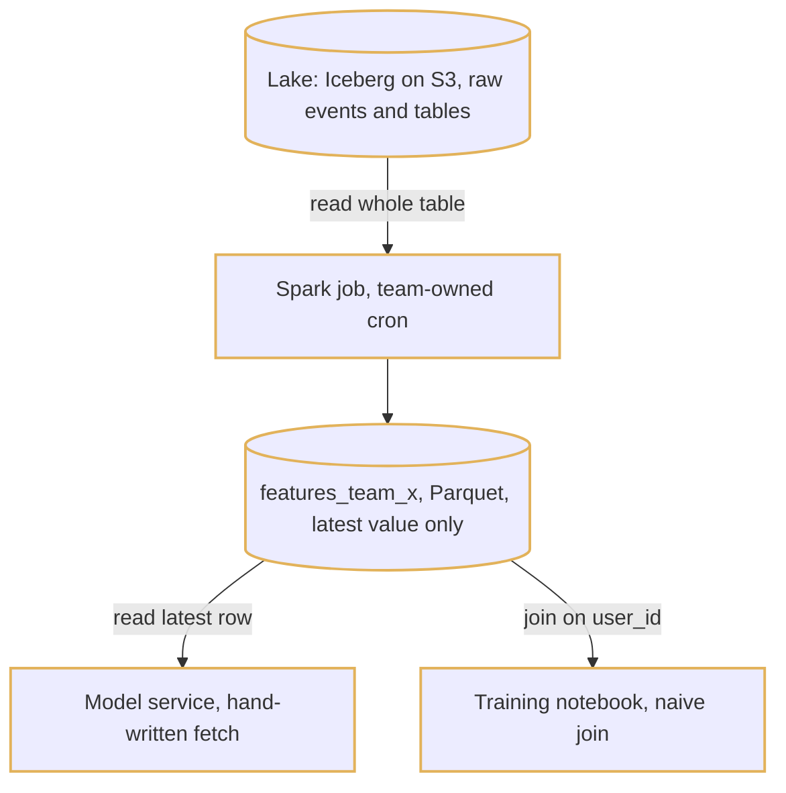

1. A nightly cron runs the team's Spark job, which rescans 30 days of raw events and overwrites a table of about 40 columns per user.
2. The model service reads the latest row for a user at request time, with its own code to fill zeros for missing users.
3. The training notebook joins the same table onto last quarter's labels by `user_id`, so every label sees today's value of a feature that was different when the prediction happened.
4. A second team needs `txn_count_7d` too and writes its own version, with a slightly different definition of a transaction.

This works for one model and is where every company starts. It fails in three ways once there are sixty: the training join leaks the future, the serving code and the Spark code disagree silently, and nobody can answer which model reads which column.

### Step 2: The registry and feature views

Step 1 has no definition, only code in two places. Add a repository where a feature view is declared once, in Python, keyed by (entity, source, grain, TTL) with 5 to 30 features; CI validates it, computes a SHA-256 semantic hash over the value-affecting fields, classifies the change as metadata, additive or breaking, estimates its cost, and on merge inserts an append-only version row into a Postgres registry. One name is one promise: a breaking change is rejected unless it is a new name with `supersedes`. Everything downstream is compiled from this object; nothing runs from a side document.

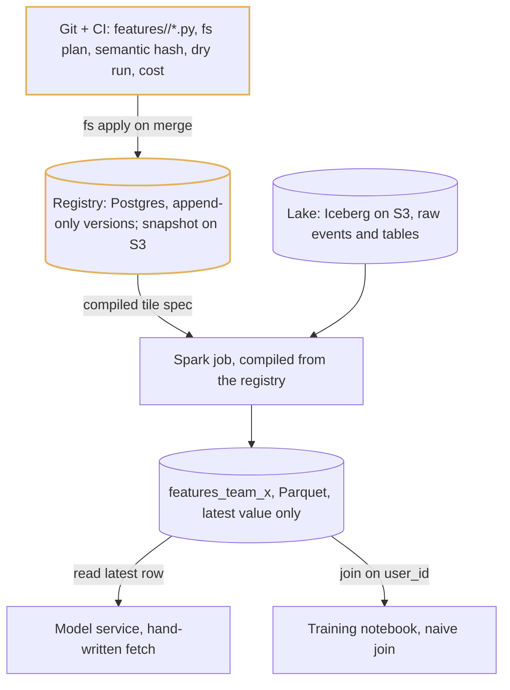

1. A pull request touching `features/` runs lint, unit tests on fixtures, the registry diff, a 1 percent real-data dry run over 7 days (about $2), and a cost estimate; it posts a plan comment listing every consumer from lineage.
2. On merge `fs apply` writes the version row, rewrites a compiled snapshot on S3 (about 20 MB: definitions, feature services, kill switches, grants), and publishes to `registry.changes` on Kafka.
3. The compiler turns the view into one tile spec (dedupe key, value expression, aggregation, tile grain, windows, lateness) and emits the Spark job from it; the job reads the spec, not the Python.
4. The semantic hash covers entity, source and timestamp column, transformation, aggregation, dtype and TTL, and not schedule, owner or thresholds, so a metadata change bumps the version without changing the hash.

### Step 3: Batch materialisation, the offline store and the point-in-time join

Step 2 has one definition but the same leaky table underneath it. Replace the latest-value table with an offline store: per view, an Iceberg change log partitioned by `day(available_at)` and bucketed by `bucket(256, entity_id)`, where `available_at` is the instant serving could first have returned the value, plus a monthly anchor snapshot so no join scans more than 31 days. Put a validator between the job and the store, and replace the notebook with a training-set builder that joins a registered, identically bucketed label table on `available_at <= prediction_ts`.

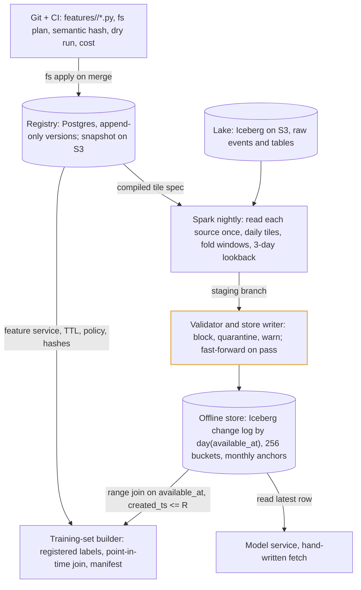

1. Nightly Spark reads each closed source partition once with a 3-day lookback, writes daily tiles for every view on that source, and folds windows: invertible aggregates as running state over 3 partitions, others as a merge of N tiles, sketches for distinct, percentile and top-k.
2. The job writes to an Iceberg branch `staging-<run_id>`; the validator checks schema, ranges, row counts, null rates and cardinality against thresholds auto-derived from the trailing 28 passing days, then fast-forwards `main`. A failed branch is quarantined for 7 days and nothing downstream can read it.
3. Every row carries `event_ts`, `available_at` and `created_ts`; `valid_to` is filled nightly, and a monthly anchor per view copies `latest` with its original timestamps so the range join is bounded to 31 days.
4. The builder resolves a feature service version to views, TTLs and policy, prunes the change log by an entity Bloom filter and time range, range-joins per view inside each bucket on `available_at <= t < valid_to` and `t - available_at <= ttl`, assembles wide by `row_id`, and writes Parquet plus a manifest pinning snapshots, semantic hashes and engine version.
5. A 10k-row leakage test recomputes from raw before the manifest is recorded; 50M rows by 300 features runs in 16 minutes for about $8.

### Step 4: The online store, the serving path and the missing-value contract

Step 3 still has a model service reading Parquet. Add a Redis cluster as a rebuildable cache: one hash per entity keyed by its surrogate int64 id, one field per view holding a fixed-layout binary row with a 4 B layout version and 8 B `available_at` header, `HPEXPIRE` per field. Put one Go binary in front of it, run as a node-local agent over a Unix socket on the fraud and ranking node pools and as a zone-affine gRPC service for everyone else; no SDK ever reads Redis directly. The wire returns a value with a status per feature and never a default.

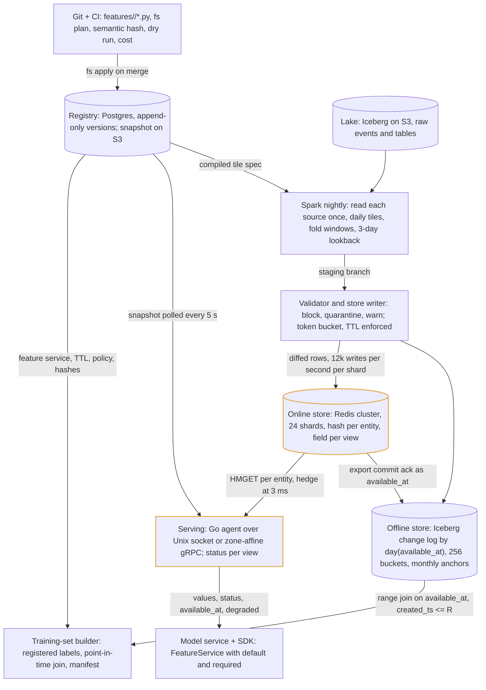

1. After the validator fast-forwards `main`, the store writer diffs the partition against the last export and pushes changed rows through a per-shard token bucket at 12k writes per second, backing off when read p99 crosses 7 ms; it refuses any write without a TTL. The commit ack time is written back to the offline rows as `available_at`, one value per bucket.
2. The agent loads the registry snapshot from S3 every 5 s into memory: view ids, layout versions, feature services, kill switches, authz bitsets. A fraud request is one pipelined HMGET per entity, three shards for three entities, to the same-AZ replica, hedged to the other replica at 3 ms.
3. Each view decodes in under 1 µs with no allocation and gets a status: OK inside `max_staleness`, STALE up to 3x, MISSING beyond that or on a shard miss, DISABLED on a kill switch, ERROR if a transform threw. The value is None for the last three.
4. The SDK applies `default` only for features the model's versioned FeatureService declared it for, only on MISSING, DISABLED or ERROR, and counts every fill; the server sets `degraded=true` when a `required` feature is not OK. The offline join returns null in the same cases, so training fills the same value from the same object.
5. Tier-1 batch views load into a namespace per run behind a pointer, previous namespace kept 2 h, so a bad load is a pointer flip back in under a minute.

### Step 5: Streaming tiles, dual materialisation and the consistency checker

Step 4 is fresh once a day, and a fraud model needs transactions in the last 5 minutes. Add Flink, compiled from the same tile spec as the Spark job: it keys events by entity, aggregates 5-minute and hourly tiles in RocksDB with event-time watermarks, writes the folded window value online per event with a 1 s debounce, and flushes the tile log offline every 60 s with the sink write time as `available_at`. Flink owns tiles younger than 24 h; nightly Spark overwrites everything older from the lake archive. Add a checker that measures whether the two agree.

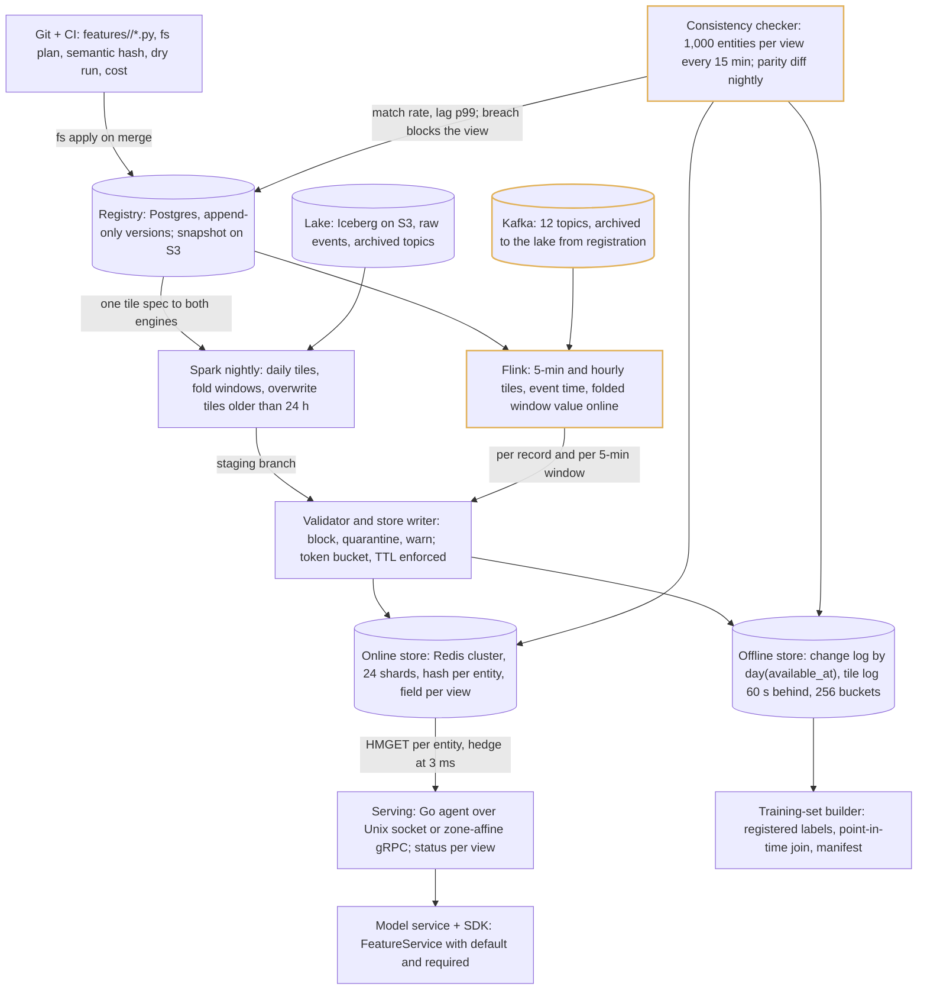

1. The compiler emits a Flink job from the same spec that produced the Spark job: same UTC-aligned tile boundaries, same dedupe key and value expression, tested against one golden dataset in CI. Watermark is max event time minus 30 s with a 60 s idle timeout and 1 h grace; later events go to a dropped-late topic and are fixed by the nightly overwrite.
2. Online, Flink writes the folded window value per event, debounced to one write per entity per second; the tiles stay in state (about 150 GB for 300 features) and in the offline tile log, where training folds those with `available_at <= t`.
3. The nightly Spark run recomputes closed tiles from the archived topic and overwrites everything older than 24 h with a 3-day lookback, so the store converges to batch values; the offline log keeps the streaming emission and the batch correction as separate rows, because training must see what serving saw.
4. Every 15 minutes the checker samples 1,000 entities per view, recomputes from the offline log and from the definition, fetches online, and diffs by type tolerance; below 99.9 percent match (99.99 for fraud views) new versions of the view are blocked and the owner is paged. A second signal separates a materialiser bug from a definition bug.

### Step 6: On-demand transforms, the served-feature log and governance

Step 5 cannot compute "distance between this transaction and the last one", which needs a request field. Add on-demand views: registry objects with `source=request`, expressions in the same SQL-subset DSL over request fields and stored features, run in the agent through the shared function library under 1 ms per view and 3 ms per request, with the inputs logged so training replays the pinned function. Add the served log for every model from day one, and move grants, tombstones and kill switches into the same snapshot the agent already polls.

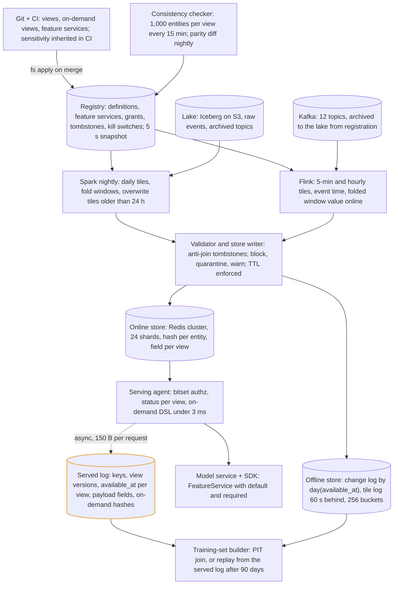

1. An on-demand view is content-hashed at registration; the agent runs its expression through the Rust core of the shared library after the stored views arrive, with declared defaults on overrun and a page when overruns pass 0.1 percent of requests. A heavy Python sidecar exists for at most 3 views per model at 2 ms, with a declared skew tolerance.
2. Every request writes an asynchronous 150 B record: request id, resolved entity keys, view ids and versions, the `available_at` and status of every view as fetched, declared payload fields, on-demand hashes and outputs, `served_at`. Values are logged in full only for a 1 percent sample, for session entities, for fraud services with a `required` feature, and for any model's first 30 days.
3. A model with 90 days of serving history retrains from the served log, with stored values reconstructed exactly from the logged per-view `available_at`, and the point-in-time join runs alongside on a 5 percent sample as the cross-check.
4. Authorisation is in-process: the agent checks the caller's SPIFFE identity against a bitset per (principal, feature service) from the snapshot and returns 403 for the whole request on any failure; a principal absent from the snapshot is denied. Kill switches, pins and revokes propagate in 5 s.
5. Erasure inserts a tombstone that both materialisers and the training-set builder anti-join; the online delete lands within 24 h, the nightly Iceberg position-delete merge within 30 days, and a seeded tombstone plus a backfill is a CI test.

### Step 7: The final picture

The same fourteen components grouped by what owns them. The control plane publishes and the data plane never calls it: a registry outage for a day changes nothing served. One definition runs in three executors; two stores hold the same rows with the same `available_at`; one agent is the only reader of the online store and the only writer of the served log.

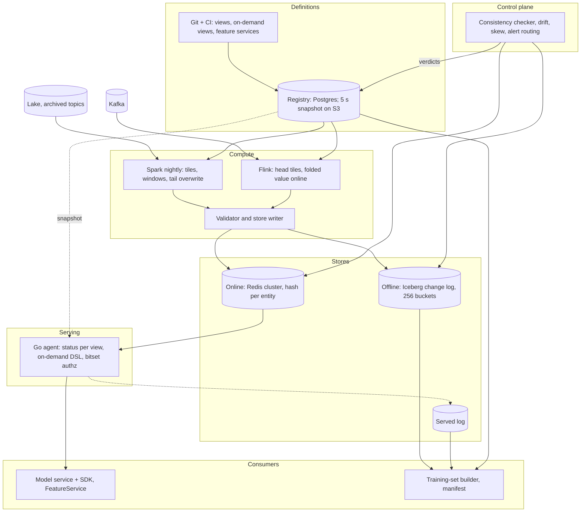

| Component | Owns | Scales by | Fails how |
| --- | --- | --- | --- |
| Git + CI | Definitions as code, semantic hash, breaking-change classifier, $2 real-data dry run per PR, cost estimate, sensitivity inheritance | One repo, about 400 views; a PR pipeline under 15 minutes | A CI outage blocks changes, not serving; nothing merges without `fs plan` |
| Registry | Append-only versions, feature services, grants, tombstones, kill switches, run log, quality verdicts, lineage; one 20 MB snapshot per change | Postgres, 200 pods polling S3 every 5 s (40 requests a second) | Down for a day: no new pins, grants or verdicts; every pod serves from memory; page at 5 minutes of snapshot age |
| Spark nightly | One read per source, daily tiles for every view on it, window folds, tail overwrite with 3-day lookback, manifests | 1,650 core-hours a night, spot; a source is one job | A missed night leaves the previous rows valid inside TTL; owner paged if tier 1, more than 5 late views pages platform |
| Flink | 40 streaming views from the same tile spec, event-time watermarks, RocksDB with TTL, 30 s checkpoints | 32 task managers, 150 GB state; a view is one job | Lag makes views STALE past `max_staleness`, MISSING past 3x; batch views unaffected; platform paged for job health |
| Validator and store writer | Staging branch per run, three outcomes, per-record and per-window streaming checks, tombstone anti-join, token bucket at 20 percent of shard write capacity, TTL enforcement | 2 min on 20 cores per 10 GB partition; 12k writes per second per shard | A blocked batch is never readable; the writer halves its rate above 6 ms read p99 and grows below 4 ms |
| Offline store | Per view: change log by `day(available_at)`, `bucket(256, entity_id)`, monthly anchors, tile log; 550 TB, snapshots expire at 7 days except 2-year tags on regulated models | S3 tiering at 12 months; re-bucket to 1,024 past 400M entities | Nothing on the online path reads it; a corrupt partition is a quarantined branch |
| Online store | 24 shards, one replica each in another AZ, no AOF, RDB on replicas; hash per entity, field per view, `HPEXPIRE` | 615 GB data, 1.6 TB provisioned, 200k rows per second with 3x headroom | Shard loss: features MISSING for 10 to 30 s until promotion; AZ loss: two AZs carry the load; rebuilt from S3 plus Kafka in under 4 h |
| Serving agent | Snapshot in memory, slot grouping, one pipeline per shard, hedge at 3 ms, zero-allocation decode, status per view, on-demand DSL, 512 MB near cache keyed on `max_staleness`, served-log write | DaemonSet on fraud and ranking pools, zone-affine Deployment elsewhere; 15 µs per row | A crashed agent is a store outage to that node: the SDK returns declared defaults at 8 ms and counts them |
| Served log | 650 GB a day; 90 days full, then 10 percent stratified plus every fraud-labelled request for 3 years | Async, 150 B per record | A dropped record is a training row lost, never a blocked request |
| Model service + SDK | FeatureService with `default` and `required`, 8 ms fraud deadline, 25 ms ranking, `fill_defaults`, SLO histograms | 60 models, up to 500 rows per call | Deadline: score with what exists; `degraded` fails a score closed only where `required` says so; 1 percent defaulted for a day pages the model owner |
| Training-set builder | Registered label tables, Bloom pruning, bucket-local range join, tile fold, wide assembly, manifest, leakage test, served-log replay | 16 min and $8 per 50M x 300; 40 percent served from the manifest cache | Cost shown before the run and blocked above the team threshold; a skew breach of 3 days refuses the view without a signed override |
| Consistency checker | 1,000 entities per view every 15 minutes, nightly parity diff and PSI drift, skew recompute of the served sample, alert routing on `owner` and `tier` | About 45k Prometheus series | A breach blocks new versions of the view and pages the owner; the checker itself down pages platform |
| Lake and Kafka | Raw events archived per registered topic; 7-day Kafka retention | 2 TB a day at the ceiling | A topic that is not archived cannot register a view |

## Deep dive: point-in-time correctness and the offline store

### 1. The problem

Build a training set of 50M labelled predictions over 2 years by 300 features so that every row contains exactly the values serving could have returned at that prediction's timestamp, no more and no less, and so that the same request next month produces the same bytes. The value that was true at time t and the value serving held at time t differ by the materialisation delay, and a velocity feature that leaks that delay is worth several AUC points offline and nothing online.

### 2. The obvious approach

Snapshot every feature table daily, join each label to the snapshot on or before its `event_ts`, and pin the Iceberg snapshot ids in the training job so it can be rerun.

### 3. Why it breaks

Daily snapshots of 100M users by 400 views are 20x the storage of a change log and still do not answer the question, because a snapshot is keyed by when the value became true, not by when it became readable. Take a 7-day transaction count for a prediction at 09:15: the nightly job that computed the row including yesterday's transactions finished at 11:30, so serving returned the row from the previous night, r2; the snapshot join returns r3. The model trains on information it will never have. Pinning 15,000 snapshots a month makes expiry a no-op and triples storage in a quarter. And a stale entity with no change in 3 years forces the join to scan 3 years to find its last row.

### 4. Join on `available_at`, stamped from the online commit

Every offline row carries three timestamps: `event_ts`, when the value became true; `available_at`, when serving could first have returned it; and `created_ts`, when the row was written offline, monotonic and never historical. For a batch view the export job writes the partition to a staging branch with `available_at` null, upserts to the online store, and fills `available_at` with the commit ack per bucket at fast-forward, so a late job cannot lie. For a streaming view it is the sink write time of each emission, carried into the tile log on the 60 s flush. For a view never served online it is the offline commit. The join for label (e, t) with run time R takes rows with `available_at <= t`, `created_ts <= R`, and a successful materialisation run of that view in the registry run log inside `[t - ttl, t]`, which mirrors online TTL expiry without an offline row per refresh; among those it picks the max `(available_at, created_ts)`. The cost is one extra column per row and a write-back after every online export.

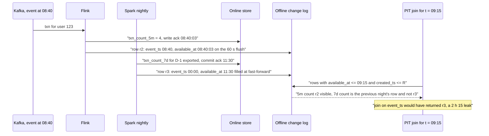

### 5. A change log with monthly anchors, not snapshots

Per view the offline table is a change log: one row per (entity, `available_at`) when the value changed, partitioned by `day(available_at)`, bucketed by `bucket(256, entity_id)`, files sorted by (entity_id, `available_at`), `valid_to` filled nightly over the last 2 days. Once a month an anchor snapshot copies `latest` for every entity with its original timestamps, so a label at any t needs at most the anchor partition plus 31 days of change rows, and the stale entity costs one row. Tiles live beside it in the same buckets: 5-minute tiles for 90 days, hourly for a year, daily for 3 years, because the daily tile is the batch partial. The whole store is about 550 TB at $12k to $14k a month against 820 TB and more for snapshots. Bucket count is 256 rather than 1,024 because 20M changed rows per view per day gives 4 MB files instead of 1 MB, and the label side must be bucketed identically. The cost is the anchor copy, about 30 TB, and a `valid_to` fill job every night.

| Layout | 3-year size | Join reads per label | Reproducible | Verdict |
| --- | --- | --- | --- | --- |
| Daily snapshots | 820 TB or more | one partition | needs `available_at` anyway | Rejected: 20x storage for nothing the change log lacks |
| Change log only | about 200 TB | up to 3 years for a stale entity | yes | Rejected: unbounded scan |
| Change log plus monthly anchors | about 230 TB plus tiles | anchor plus 31 days | yes | Chosen |

### 6. The join is bucket-local, and the label table is registered first

A label table is registered before any training set uses it, with `row_id`, entity, `prediction_ts` and `label_known_ts`, and bucketed with the same 256-way transform. The builder resolves the feature service, prunes each view's change log by an entity Bloom filter and by the label time range plus TTL slack, then runs a storage-partitioned range join inside each bucket: no shuffle, no broadcast. Streaming views are folded from the tile log with `available_at <= t`, precision one tile plus sink latency, and the skew job measures the residual. Assembly is wide by `row_id`. 50M rows by 300 features over 2 years is 16 minutes and about $8; registering the label table removes a 2.5 TB shuffle per run and forces `label_known_ts` to exist, which is where most leakage bugs are caught. The cost is a 5-minute registration step and the rule that a label table nobody registered cannot be joined.

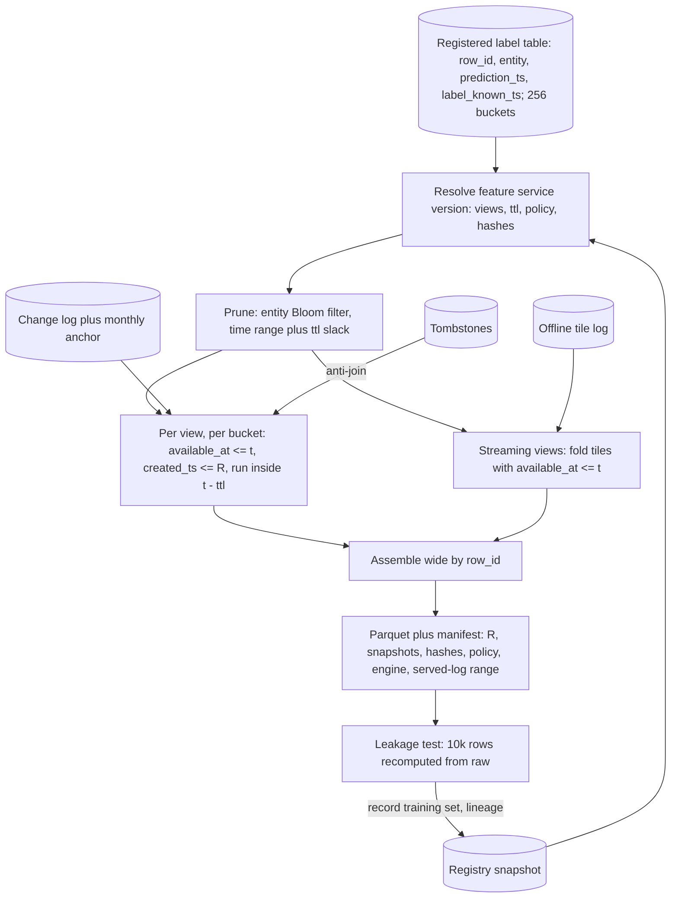

### 7. Backfills are declared, and reproducibility is a manifest

A feature registered today has no history, and a feature without history is a feature nobody trains on. Backfills come in two declared kinds. A `correction` gets `available_at = now`, because the old value is what serving had. A `bootstrap`, for a view with no prior online history, gets `available_at = event_ts + declared_lag` where the lag is the view's freshness SLO (2 h for batch, 2 to 5 s for stream), the row is flagged `is_backfill`, the first N-1 days of an N-day window are excluded as warm-up, and the manifest records the policy; a strict mode that nulls anything before `first_served_at` is opt-in per training set. A model whose offline metrics beat online is then identifiable from its manifest. Reproducibility is `created_ts <= R` plus the manifest: R, registry version, every view version and semantic hash, every on-demand content hash, the shared-library version, the label snapshot, the served-log range. Iceberg snapshots expire after 7 days; regulated models tag monthly for 2 years; the output itself is kept 180 days, because not recomputing is the cheapest reproduction. The cost of the synthetic `available_at` is that it is a model of the pipeline, not a measurement, so the view's first 30 days online run the checker at the fraud tolerance.

### 8. Where it lands

- Three timestamps on every offline row; the join uses `available_at <= t` and `created_ts <= R` and a successful run inside the TTL, never `event_ts`.
- `available_at` is stamped from the online commit ack for batch and the sink write time for streaming; a failed online write leaves it null and the row invisible.
- Per view a change log by `day(available_at)` in 256 shared entity buckets with monthly anchors; the scan is bounded to 31 days; tiles sit in the same buckets at three retentions.
- Label tables are registered and bucketed first; the join is storage-partitioned and shuffle-free; 16 minutes and $8 for 50M by 300.
- Backfills are `correction` or `bootstrap` and say so in the manifest; reproduction is bitemporal plus a manifest, not 15,000 pinned snapshots.

## Deep dive: the online path inside 10 ms

### 1. The problem

Return 40 features across 3 entities and one embedding to a fraud service that is holding a card authorisation, with p99 under 10 ms end to end at 30k requests a second, while 500-candidate ranking requests share the store, 100M rows load underneath it every night, one item can be read 17k times a second, and a missing value must never be mistaken for a zero.

### 2. The obvious approach

One Redis key per feature per entity, a Python SDK that reads Redis directly with a default per feature in the client config, DynamoDB when Redis gets expensive, and a nightly job that writes every row with a large pipeline.

### 3. Why it breaks

One key per feature is 240 GB of key overhead and 40 round trips where 3 will do. A direct client puts decode, hedging, the small-entity cache, authorisation and the served log into three languages and credentials into 30 teams, and one team's ranking fan-out has no priority header to shed. DynamoDB's in-region p99 of 5 to 10 ms is the whole budget, `BatchGetItem` caps at 100 keys, and full nightly pushes cost $94k a month on demand. A default in the client config is a value the training join never sees, which is the skew the store exists to remove. And a nightly bulk load with no feedback loop pushes read p99 past 10 ms for the 40 minutes it runs.

### 4. One hash per entity, one field per view, a fixed-layout row

Key `<entity_prefix>:<int64 id>`, one field per immutable view id, `hash-max-listpack-entries 64`, `HPEXPIRE` per field with 10 percent jitter. A fraud request groups 3 entities by slot and sends one pipelined HMGET per shard for exactly the views asked for. The field value is a fixed-layout binary row for that view version: 4 B layout version, 8 B `available_at`, then fields at offsets the registry owns, so decode is under 1 µs with zero allocations against 10 µs and 40 allocations for protobuf, and at 200k rows a second that is 3 core-seconds per second. The row is replaced whole by its one writer, never patched, so a reader never sees a mixed-version row; streaming and batch views are separate views by rule so two writers never share a field. The registry caps online views at 64 per entity and 4 KB per view and refuses `online=true` past the byte budget. The cost is that 64 features across 3 fields cannot be fetched individually, and that half the 5,000 features stay offline-only, which is the intent.

| Layout | Keys for 100M users x 30 views | Reads per fraud request | Writers per row | Verdict |
| --- | --- | --- | --- | --- |
| Key per (view, entity) | 3B, about 240 GB of overhead | 15 GETs, 3 shards with hash tags | 1 | Rejected on key overhead |
| One blob per entity | 100M | 3 GETs | 30 contending | Rejected: 10x read amplification, 30 writers |
| Hash per entity, field per view | 100M hashes, 3B fields in listpacks | 3 HMGETs | 1 per field | Chosen |

### 5. The agent, the hedge and the deadline

One Go binary, two modes. On the fraud and ranking node pools it is a DaemonSet reached over a Unix socket, 0.1 ms p50 and 0.3 ms p99, with no network hop and no second network failure domain; for the other 28 teams it is a zone-affine gRPC Deployment. Nobody reads Redis directly. The agent holds the registry snapshot in memory (view ids, layout versions, feature services, kill switches, authz bitsets, refreshed every 5 s off-path), groups keys by slot, pipelines one HMGET per shard to the same-AZ replica in parallel, hedges to the other replica at 3 ms, decodes, runs the on-demand expressions, and answers with a status and `available_at` per view. The SDK sends an 8 ms deadline in metadata, retries only on an immediate UNAVAILABLE, never on a timeout, and at the deadline returns what exists. Ranking carries 25 ms and up to 500 rows, fanned out at most 100 keys per store call; the priority header sheds ranking first under load and fraud last. Reopen trigger: agent p99 above 6 ms inside the fraud service at the month-5 load test. The cost is one extra deployment mode and 128 MB to 5 GB of memory on two node pools.

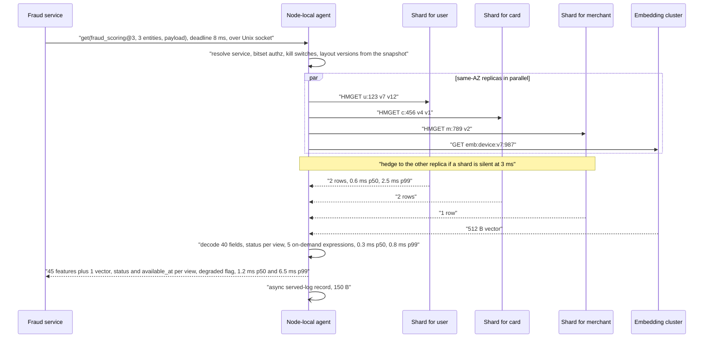

| Hop | p50 ms | p99 ms | Why it holds |
| --- | --- | --- | --- |
| Fraud service to agent, Unix socket | 0.1 | 0.3 | Same node, no TLS, no proxy |
| Snapshot resolve, authz, layout | 0.01 | 0.01 | In memory, refreshed off-path |
| 3 HMGETs plus 1 embedding GET, parallel | 0.6 | 2.5 | One shard per entity, AZ-local replica |
| Hedge on a silent shard | 0 | 3.0 | Fires at 3 ms, caps the tail at the second replica |
| Decode, on-demand, statuses | 0.3 | 0.8 | Fixed layout, no allocation, no I/O in expressions |
| Go GC and scheduler jitter | 0 | 1.0 | GOMEMLIMIT, heap under 1 GB, no CPU limit |
| Total feature fetch | 1.2 | 6.5 | 3.5 ms headroom against 10 ms |

### 6. Hot entities and the near cache

One item can be read 17k times a second and the top 200k items cover about 80 percent of item reads in 70 MB. The agent keeps an LRU, 512 MB on ranking nodes and 128 MB elsewhere, with singleflight per key, and a view is cacheable only when it declares `max_staleness` of 60 s or more, with the cache TTL equal to that bound; the consumer never picks a TTL because the owner declared it. Entities under 10k keys (merchant categories, countries) live in the agent's memory refreshed every second, which removes about 60k reads a second from Redis. Embeddings never live in the scalar row: a separate cluster keyed `emb:{family}:{version}:{entity}` holds user and device vectors in fp16, and item vectors ship as an int8 per-version Arrow snapshot (5.2 GB) that the agent mmaps and swaps atomically, so a 300-candidate ranking request makes one fetch for the user row and one for the user vector instead of 770 MB a second of vector traffic. The cost is 512 MB per ranking node and a rule that a view without `max_staleness` is never cached.

### 7. Bulk loads that do not move the p99

The store writer is the only path to Redis for batch data. It diffs each partition against the last export (2.5B rows a night become about 375M to 600M), pushes through a per-shard token bucket at 20 percent of write capacity, about 12k writes a second per shard, and halves its rate when read p99 crosses 6 ms and grows it back below 4 ms; the threshold pair is a registry value model owners can read. It refuses any write without a TTL: batch views get 14 days and a weekly full rewrite that refreshes every field's TTL and guards the diff, streaming views get the window length. Tier-1 batch views, about 20 of them, load into a namespace per run behind a pointer with the previous namespace kept 2 h, so a bad load is a pointer flip back in under a minute; the rest use change-only upserts with event-time last-writer-wins and a 20-minute re-push as rollback. Streaming writes are debounced to one per entity per second. The cost is 2x memory for the tier-1 footprint for 2 h a day and a 40-minute write window instead of 4 h.

### 8. The missing-value contract

The wire carries a value or None plus one of OK, STALE, MISSING, DISABLED or ERROR per feature and `available_at` per view. OK is inside `max_staleness`; STALE is up to 3x it and still carries the real value; MISSING is beyond that, or no row, or a shard that timed out; DISABLED is a kill switch; ERROR is a transform that threw. The store never invents a value. Defaults live in exactly one place, the model's versioned FeatureService, which declares `default` and `required` per feature; the SDK fills defaults only when asked, only on MISSING, DISABLED or ERROR, never on STALE, and counts every fill; the server sets `degraded=true` when a `required` feature is not OK, and the model decides what to do with that. The offline join returns null in the same cases and the training code fills from the same object. Authorisation is the other axis and is fail-closed: an unknown principal, a missing grant or a purpose conflict is a 403 for the whole request. The cost is that a fraud team must write down, per feature, what happens when it is absent; they have already agreed in writing that KYC-tier attributes are `required` and velocity counts default to 0 with the status read as a signal.

### 9. Where it lands

- One hash per entity, one field per view, a fixed-layout row with a registry-owned layout version; 615 GB of data on 24 shards, one replica each, provisioned at 1.6 TB, $18k a month.
- One Go binary as a node-local agent on the fraud and ranking pools and a zone-affine service elsewhere; no SDK reads Redis; 8 ms deadline, hedge at 3 ms, 6.5 ms p99 measured.
- Near cache bounded by `max_staleness`, small entities in memory, embeddings in their own cluster with item vectors shipped as snapshots.
- One store writer with a p99 feedback loop and TTL enforcement; tier-1 views behind a pointer, the rest change-only.
- None plus status on the wire; `default` and `required` in the FeatureService; authorisation fail-closed, data fail-open.

## Deep dive: one definition, three executors

### 1. The problem

Make one feature definition produce the same value in a nightly Spark job over 3 years of history, in a Flink job over a Kafka topic, and in a serving agent 6 ms after a request arrived, for 5,000 features written by 200 people who are not going to hand-port anything, and prove it with a number rather than a code review.

### 2. The obvious approach

Let each team write the batch version in PySpark and the streaming version in Flink SQL, ask the model service to compute request-time features in its preprocessing code, and review the three for equivalence when they change.

### 3. Why it breaks

Three implementations of `txn_count_7d` are three definitions of a transaction, three window boundaries and three null rules, and the divergence is silent until a model's online metrics fall short of offline. A window recomputed by rescanning raw per feature costs $50k a night at 5,000 features, and a streaming window over 100M entities with per-feature state does not fit any cluster. Preprocessing code in the model service is the skew machine: it has no version in the registry, no log, and no offline counterpart. And review does not scale to 20 percent growth a year.

### 4. A restricted DSL and one shared function library

A feature view's transformation is an expression in a restricted SQL subset: projection, filter, case, arithmetic, string and date functions, windowed aggregates over a declared set (count, sum, min, max, last, first, HLL, DDSketch, SpaceSaving), one typed AST. Every function has exactly one implementation in a shared library with a Rust core and bindings for Spark, Flink and the Go agent, so `haversine` or `safe_div` cannot drift; null propagates through every function unless the expression says `coalesce`. Sessionisation, arbitrary Python and anything not decomposable into mergeable partials go into a registered source transform whose output table a view consumes, with a declared cost and a determinism attestation. Python in the serving path survives only as a content-hashed heavy sidecar, at most 3 views per model at 2 ms, replayed by the same interpreter in Spark, with a declared skew tolerance. The platform commits to a one-week SLA on library function requests so the hatch stays rare. Scientists get a Python SDK that builds the expression, not a runtime. The cost is a smaller language than pandas, and 8 people cannot own both a compiler and an embedded interpreter, so the language that runs identically in three engines wins.

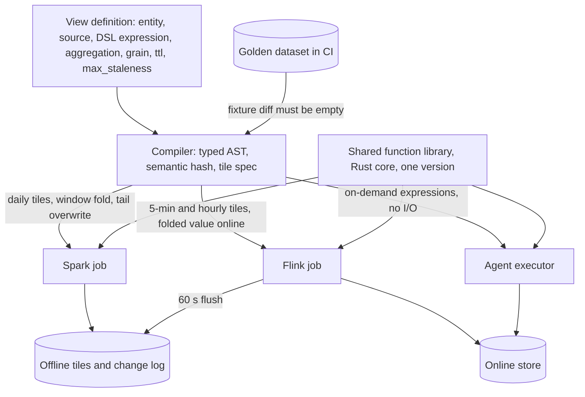

### 5. Tiles: the one aggregation primitive

A daily partial and a daily tile are the same row. Every aggregate is materialised as mergeable tiles at 5 minutes, 1 hour and 1 day on UTC-aligned boundaries, in one tile table per view in the same 256 entity buckets as the change log. Batch-only views produce daily tiles and fold windows nightly: invertible aggregates as running state over 3 partitions, others as a merge of N tiles, sketches (HLL precision 10, DDSketch 1 percent, SpaceSaving k=20) where the function is not decomposable, hourly only and capped at 20 sketch features per entity. Raw is read once per night per source, 1,650 core-hours, $66 a night. Streaming views produce 5-minute and hourly tiles in Flink for the last 24 h, in RocksDB with TTL, about 150 GB for 300 features, and daily tiles from Spark for the tail; Flink writes the folded window value online per event with a 1 s debounce, and the tiles go to the offline log where training folds those with `available_at <= t`. A 3-year backfill of a new view is 10k core-hours and $400 because it merges archived tiles instead of rescanning events. Features that declare `tile=1m` get 1-minute tiles for the last hour only. Exact distinct counts are limited to 24 h windows over a bounded key set. The cost is a tile precision of 5 minutes plus sink latency on the training fold, which the skew job measures.

| Window kind | Batch strategy | Streaming strategy | Storage |
| --- | --- | --- | --- |
| Sum-class, invertible | Running state, read 3 partitions | Add tile, subtract expired tile | Daily tiles, 3 years |
| Min, max, last, first | Merge N tiles | Merge head tiles | Daily and hourly |
| Distinct, percentile, top-k | Sketch merge | Sketch merge, 3 percent error | Hourly sketches, capped at 20 per entity |
| Exact distinct | Rejected past 24 h | Bounded key set in state | 24 h max |

### 6. Dual materialisation and who owns which hour

Flink owns tiles younger than 24 h; nightly Spark recomputes closed tiles from the archived topic and overwrites everything older, with a 3-day lookback for both partials and tiles, so after 24 h every value is batch-produced and the store converges. Late events inside the 1 h grace are merged by Flink and re-emitted; later ones go to a dropped-late topic and are fixed by the overwrite; events more than 3 days late are accepted and reported below 0.5 percent of a day's volume and trigger a targeted reprocess above it, with a revision event so containing windows are patched. The offline log keeps the streaming emission with its real `available_at` and the batch correction as a separate row, because training must see what serving saw at t, not the corrected value. A revised partition that a training set already used is recorded and the model owner notified; nothing retrains automatically, because the manifest pins the old snapshot. Any topic a streaming view reads is archived to the lake from the day the view registers, or the view is rejected; backfill never comes from Kafka retention. The cost is two engines for a team of 8, accepted because teams do not write Flink: the compiler emits one job template per view, platform is paged for job health, and the owner for data verdicts.

### 7. The checker, the skew SLO and the served log

Skew is a metric with a threshold. Every 15 minutes the checker samples 1,000 entities per view, uniform over the key space plus a stratum of the last hour's active keys (stratified by merchant category for fraud views), recomputes from the offline log, fetches online, and diffs by type: exact for ints, strings, bools and timestamps, 1e-6 relative for floats. It writes match rate, lag p99 and null delta to the registry. Below 99.9 percent match per view per day (0.1 percent mismatched entities), or 99.99 percent for views read by fraud models with exact equality and shared-library-only functions, new versions of the view are blocked and the owner is paged; three consecutive days block new training sets on the view, with a signed override recorded in the manifest. A second signal recomputes from the definition: log matches recompute but not online is a materialiser bug and the platform's; log does not match recompute is the owner's. Nightly, a parity diff recomputes the head tiles in batch and compares them with Flink's, and a skew job recomputes the 0.1 percent served-value sample offline; both write to the same quality table the snapshot carries to serving. The served log makes this exact: with `available_at` logged per view, the training truth for a request is the row with that timestamp, or null when the status was MISSING, so 09's objection that reconstruction can disagree with what Redis held is closed without logging values. The cost is under $1k a month for the checker and 12k for the whole quality pipeline, under 10 percent of the platform.

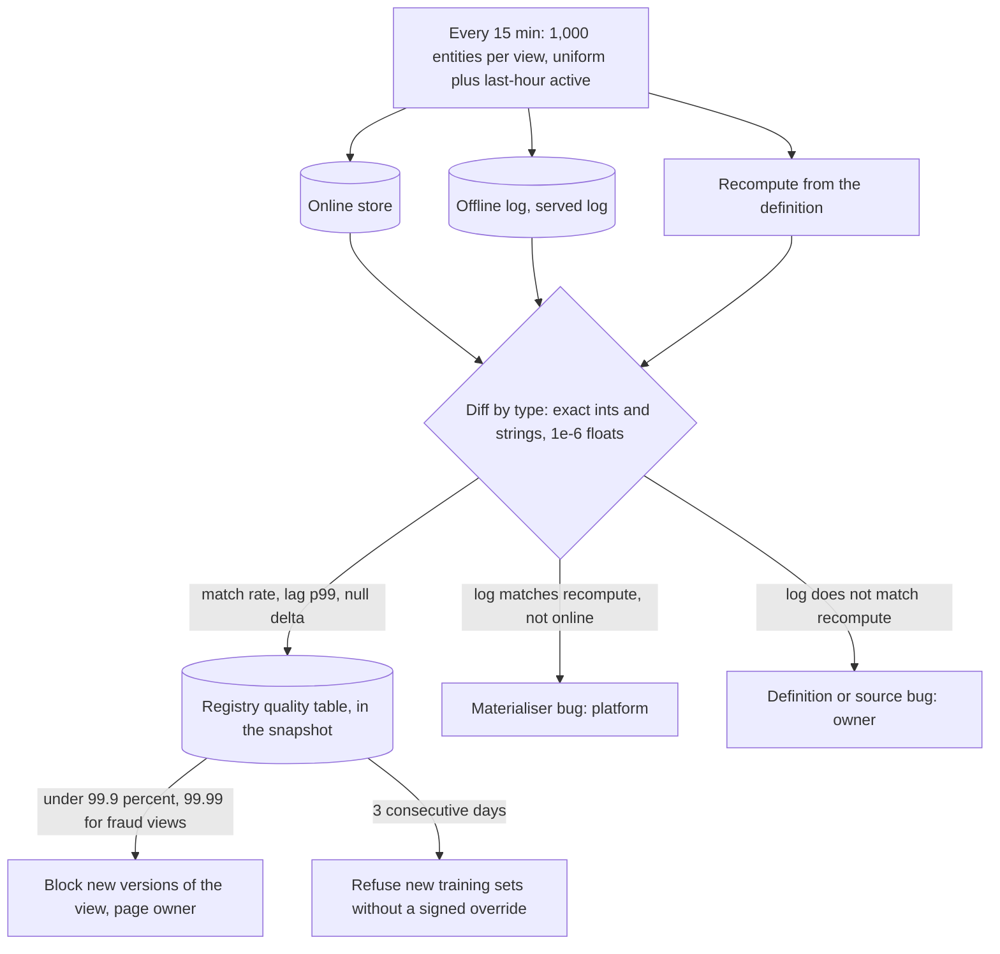

### 8. Where it lands

- One restricted DSL and one shared function library with a Rust core; the same AST runs in Spark, Flink and the agent, with an empty fixture diff at publish time.
- Mergeable tiles at 5 minutes, 1 hour and 1 day are the only aggregation primitive; raw is read once per night; backfill merges archived tiles.
- Flink owns the last 24 h and writes the folded value online; Spark overwrites the tail; both emissions stay in the offline log with their own `available_at`.
- The checker publishes a match rate per view every 15 minutes; 99.9 percent blocks new versions, 99.99 for fraud, 3 days blocks training sets.
- The served log records keys, versions and per-view `available_at` for every model from day one, and after 90 days it is the retraining default.

## Deep dive: the platform and the people

### 1. The problem

Run this for 30 teams with a platform team of 8: a registry that 60 models and 400 views depend on, a fraud service that pages when a feature is late, sixty legacy pipelines that must keep working during the migration, a bill of about 75k USD a month that has to land somewhere, and a right-to-erasure obligation that a Kafka replay would otherwise undo.

### 2. The obvious approach

A registry service that serving calls per request, a platform on-call rotation that receives every alert, chargeback from day one so teams behave, a big-bang migration starting with fraud because it matters most, and a delete statement for erasure.

### 3. Why it breaks

A registry on the request path is a second failure domain on the 10 ms path and an outage that stops every model at once. Eight people cannot page themselves for 5,000 features; a team-owned feature that fails in isolation is the team's problem or nothing gets owned. Chargeback in month one is the fastest way to make teams bypass the store. A fraud-first migration that fails publicly ends the platform, and its skew cannot wait for a 5-minute batch. And a deleted row comes back on the next backfill or Kafka replay, so a delete is not an erasure.

### 4. The registry as system of record that serving never calls

The registry in Postgres holds definitions, feature services, grants, sensitivity, tombstones, the run log, quality verdicts and lineage; git plus the CI service account is its only writer. On every change a policy compiler writes one versioned snapshot object of about 20 MB to S3; 200 serving pods poll its version every 5 s and load it on change, 40 requests a second, and never query Postgres. Kill switches, pins, quarantine verdicts and revokes propagate in 5 s; if the snapshot cannot be fetched a pod serves from memory indefinitely and `policy_age_seconds` pages platform at 5 minutes. The same compiler writes Lake Formation column grants for the offline plane, so two access planes derive from one grant table: in-process bitsets keyed on SPIFFE service identity online, column grants offline, people only offline or through a 4-hour break-glass principal with entity-level audit. Lineage is populated as a side effect: the served log says which service read which view, the manifest says which training set used which version, and the model registry says which model trained on which set. The cost is a 5 s delay on every control-plane change and a compiler that must be tested against the SDK it feeds.

### 5. Versions, breaking changes and CI on a definition

A published `(name, version)` is immutable. CI classifies every diff: metadata (owner, thresholds, schedule) bumps the version in place; additive (a new feature in the view) bumps it and materialises the new column; a value-affecting change to an existing name is rejected, and the author creates `name_v2` with `supersedes` set, materialised to its own table and backfilled while the old name keeps serving. The semantic hash enforces this, not review. Each PR runs lint, unit tests, the registry diff, a 1 percent dry run over 7 days, a 10k-entity batch-versus-stream consistency check with a latency assertion under 0.5 ms for on-demand views, and a cost estimate; it posts a plan comment listing consumers from serving lineage with 2 working days to object. A 90-day backfill runs automatically under $500; above that the PR needs a `cost-approved` label, and above 200 core-hours platform approval. Deprecation refuses new training sets after 30 days and never stops serving to a production model; retirement follows 30 days of zero serving-lineage consumers; embedding versions go at zero consumers plus 7 days because each is 180 GB. The cost is a $2 dry run per PR and a pipeline under 15 minutes.

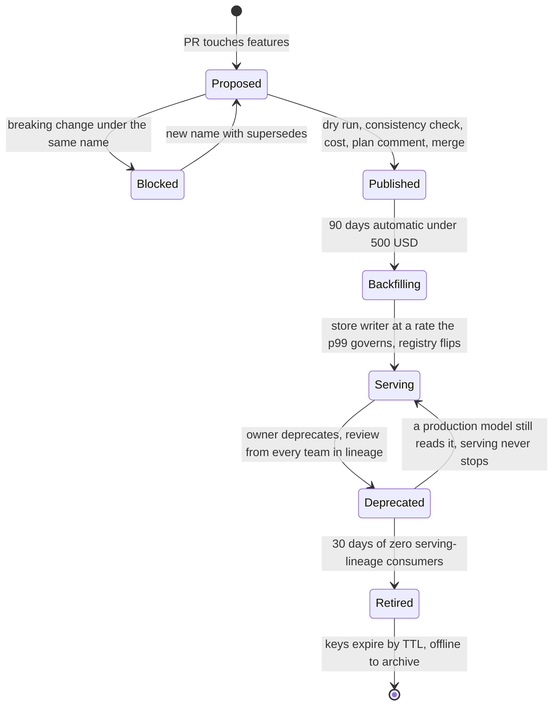

### 6. Governance and erasure that survive a backfill

Sensitivity and purpose are inherited in CI from source columns through the expression: an untagged column is SENSITIVE_PII and a merge that would expose it fails closed; declassification takes two approvers from a data-protection group, not the platform team. Purpose is enforced against the model's declared purpose carried as the FeatureService name, with the calling SPIFFE identity checked for the grant per (principal, service). Erasure is a tombstone row in the registry: the online delete lands within 24 h, the nightly Iceberg position-delete merge removes the offline rows, and both materialisers and the training-set builder anti-join the tombstone table so a backfill or a Kafka replay cannot resurrect the value; a seeded tombstone followed by a backfill is a CI test. Training sets live 30 days unless pinned, and pinned sets are rewritten on erasure; completion in 30 days with a page at 25. Audit is minute-grain everywhere and entity-level for PII, break-glass, legal hold and the credit purpose, under $2k a month of S3. Models trained before an erasure request are out of scope for the store: the lineage query "which models trained on sets containing this entity" is provided, and whether to retrain is a legal decision with the bill attached, recorded in the DPIA. The cost is a fail-closed default that makes the first PII-adjacent PR slower, once.

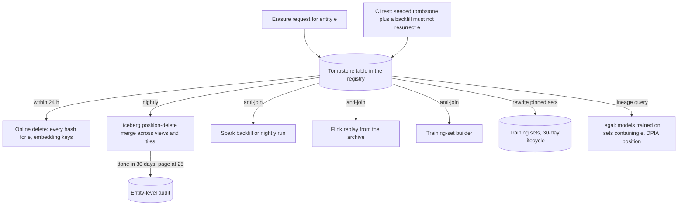

### 7. SLOs, alert routing and who is paged

SLOs are measured in the SDK, per feature service: a call succeeds if it returns a usable response, any status, `degraded` allowed, within the client deadline. Targets: 99.95 percent monthly for the fraud tier with p99 under 10 ms and p99.9 under 25 ms; 99.9 percent for others with p99 under 25 ms for 500 rows; streaming freshness 99 percent of served rows inside `max_staleness` measured at serve time; batch online by 06:00 D+1. Server histograms exist and the gap to the SDK number is the network, which runbook 1 checks first. Alerts route on labels the registry already knows: `feature_view`, `feature_service`, `model`, `tier`, `owner`, about 45k series. Platform is paged for correlated failure: serving burn rate, fraud p99 over 10 ms for 5 of 10 minutes, more than 5 views late or stale, Redis memory over 85 percent, snapshot age over 5 minutes, Flink job health. An isolated failure is the owner's: a tier-1 view failure pages the owner's PagerDuty schedule, which tier-1 registration requires to exist; tier 2 and 3 go to the owner's Slack and a ticket; `features_defaulted_total` above 1 percent for a day pages the model owner. Budget: under 5 platform pages a week. Availability is one region and three AZs; the second region is a copy of the cell at about $25k a month, built the month the fraud team signs and funds 99.99. The cost is that fraud's 99.95 is written down with degraded responses counting as success, which the fraud team agreed to in writing.

### 8. Cost levers and chargeback

The naive design puts every byte in Redis at 2,000x the price of S3 and lands at $85k a month for the platform lines; seven levers take it to about $50k: a 90-day online TTL, the live-reader flag with a 60-day auto-unflag (no reader, no bytes), change-only writes for non-tier-1 views, offline tiering at 12 months, sketches for distinct counts, AZ-local reads, and a training-set cache keyed by content hash that serves 40 percent of runs. With Flink, the quality pipeline and the offline tiles the steady state is about 75k, and year one is 100 to 120k including 30k of coexistence while legacy pipelines run alongside. Every number comes from meters: sampled `MEMORY USAGE`, Iceberg partition bytes, tagged core-hours, server read counters. Attribution: readers pay online bytes and materialisation compute in proportion to key reads, so a view read by 12 models is split 12 ways; producers pay offline storage; requesters pay training sets, shown before the run and blocked above the team threshold; the platform subsidises only the registry, monitoring and audit, about $2.5k. Bills are visible from month 1 and money moves from month 13, because charging in year one makes teams bypass the store. The cost is a year of platform budget carrying 30k a month of duplication.

### 9. Migration order and build versus buy

Build on Feast's core narrowly, the Python definition format, the batch-source wrap path, the offline layout and the point-in-time join, and own five pieces: the git-compiled registry with the breaking-change classifier, the Flink materialiser, the store writer, the fixed-layout row and the serving agent. Trip-wires: fewer than 4 infrastructure engineers, a median training set over $100 at month 4, or a sixth replaced piece, and the 4-week Tecton proof of concept on churn data that runs in parallel decides the flip. Migration goes churn, recs, search, fraud, because a public failure on the first migration ends the platform and churn has the most reused features and the worst backfill pain; but the 10 ms path is engineered from fraud outward, built in phase 2 for recs, load-tested with fraud-shaped synthetic traffic at 150k requests a second from month 5, shadow-read by fraud from month 6, and cut over behind a flag between months 7 and 10 after 30 days of green parity. The deploy gate lives in the model registry, because a deploy can bypass CI but not the registry, and turns on at month 9 once 10 teams are live. The weekly metric is production models reading from the store: 15 at 6 months, 48 at 12, 60 at 18. Kill criterion: fewer than 5 teams live at month 6 stops building and embeds every engineer with a team.

| Phase | Window | Ships | Exit criterion |
| --- | --- | --- | --- |
| 0 | weeks 1 to 8 | Registry from git, batch materialise, PIT join, wrap-a-table, CI lint and unit stages | Churn team generates one training set in one SDK call |
| 1 | months 2 to 4 | Churn live, 2 platform engineers embedded, dry run and consistency CI stages | 2 clean nightly training runs; median backfill under 1 day |
| 2 | months 4 to 7 | Recs and search, agent, fixed-layout row, store writer, near cache, embedding cluster | Ranking p99 under 12 ms in the ranker; fraud-shaped load test at 150k requests a second under 6.5 ms p99 |
| 3 | months 7 to 10 | Fraud with Flink velocity views, shadow reads from month 6, cutover behind a flag | 30 days parity green; 2 s p99 lag on velocity views; zero skew incidents in the quarter |
| 4 | months 9 to 12 | Deploy gate in the model registry, self-serve onboarding | 10 teams live before the gate; time to first feature under 1 day |
| 5 | months 12 to 18 | Retire 30 pipelines, chargeback on | 60 of 60 models on the store; 0 ad-hoc pipelines |

### 10. Where it lands

- The registry is the system of record and never on the read path; one 20 MB snapshot every 5 s carries definitions, verdicts, kill switches and grants.
- Names are immutable in meaning by hash; a breaking change is a new name; every PR runs a $2 real-data dry run and a consistency check; serving never stops for a production model.
- Sensitivity inherits in CI fail-closed; erasure is a tombstone every write path anti-joins, tested with a backfill; pre-erasure models are legal's call with the lineage query provided.
- SLOs in the SDK, 99.95 fraud in one region; correlated failure pages platform, isolated failure pages the owner; a second region is a priced copy.
- Meters from day one, bills from month 1, money from month 13; Feast core with five owned pieces and three trip-wires; churn first, fraud last but load-tested from month 5.

## Trade-offs

| Decision | Chosen | Alternative | Why |
| --- | --- | --- | --- |
| Join timestamp | `available_at` from the online commit, plus `created_ts <= R` | `event_ts` with TTL | The leak is exactly the materialisation delay, 2 h 15 in the worked example; bitemporal rows reproduce without 15,000 pinned snapshots |
| Offline layout | Change log by `day(available_at)`, 256 buckets, monthly anchors | Daily snapshots | 20x storage and still no `available_at`; anchors bound the scan to 31 days |
| Aggregation | Mergeable tiles at 5 min, 1 h, 1 d | One job per feature rescanning raw | $66 a night against $50k; the only primitive that bounds streaming state at 100M entities and backfills from an archive |
| Who folds streaming windows | Flink writes the folded value; serving does no tile arithmetic | Serving merges 64 tiles per feature | 19,200 values per entity fits no byte budget; the 10 ms path carries no work a job can do once |
| Online key layout | Hash per entity, field per view, fixed-layout row | Key per (view, entity) with protobuf | 240 GB of key overhead and 10 µs decodes; the fixed layout is under 1 µs with zero allocations |
| Online store | One Redis cluster, byte budget per entity | DynamoDB, or a ScyllaDB tier past 5 TB | p99 of 5 to 10 ms is the whole budget; a second store is two writers and two TTL semantics for one view |
| Hot path | One Go binary as a node-local agent and a zone-affine service; no SDK-direct reads | Central server only, or SDK reads Redis | 0.3 ms hop keeps the latency argument; one implementation of decode, hedge, cache, authz and the served log |
| Missing values | None plus status; `default` and `required` in the FeatureService | Per-feature default in the registry | A default of 0 for a velocity count is indistinguishable from a real 0; the model owns the loss function and training fills from the same object |
| Transformation language | Restricted SQL-subset DSL with a Rust library | Restricted Python in the serving pod | 8 people cannot own a compiler and an interpreter; one AST runs in three engines |
| Regions | One region, three AZs, 99.95 | Two active regions, 99.99 | $25k a month and a second on-call load for a number fraud has not signed; the cell is a copy when they do |
| Served log | Keys, versions and per-view `available_at` for all; values for 1 percent, fraud and new models | Full values for everyone | 650 GB a day against 12 TB; reconstruction from the logged `available_at` is exact by construction |
| Migration | Churn, recs, search, fraud; fraud load-tested from month 5 | Fraud first | A first-migration failure on real money ends the platform; fraud's skew persists up to 10 months longer, which is cheaper |
| Chargeback | Meters from day one, money from month 13 | Chargeback from month 1 | Charging in year one makes teams bypass the store; the platform carries 30k a month of coexistence instead |
| Build versus buy | Feast core narrowly, five owned pieces, Tecton proof of concept in parallel | Tecton, or build from scratch | People cost more than machines; the exit from a licence is a DSL rewrite; a sixth replaced piece is the trip-wire |

## Pitfalls

- Joining training data on `event_ts`. The model trains on the row serving did not have yet; join on `available_at`, stamped from the commit ack, never from the job's own clock.
- Backfilling history without flagging it. A bootstrap backfill is a model of the pipeline, not a measurement; `is_backfill` and the policy in the manifest, warm-up days excluded, and the first 30 days checked at the fraud tolerance.
- A default in the client, or a 0 that means missing. The wire says None plus MISSING; the model's FeatureService says what to fill, and training fills the same thing.
- Serving that calls the registry. A 5 s snapshot in memory; a control plane down for a day changes nothing served.
- One key per feature, or embeddings in the scalar row. 240 GB of key overhead, and a 2 KB fraud row that grows to 2.5 KB for callers that never read the vector.
- A bulk load with no feedback loop. 40 minutes of read p99 above 10 ms every night; the writer halves at 6 ms and refuses rows without a TTL.
- Feature logic in model preprocessing. It has no version, no log and no offline twin; on-demand views are registered, hashed and executed by the platform.
- Reviewing batch and streaming code for equivalence. Compile both from one spec, diff them against a golden dataset in CI, and measure the match rate every 15 minutes.
- A delete statement for erasure. The next backfill or Kafka replay brings the row back; a tombstone that every write path anti-joins, with a CI test that proves it.
- Paging the platform for a team's feature. Correlated failure is the platform's; an isolated tier-1 failure pages the owner's PagerDuty schedule, which registration requires.
- Counting registered features as adoption. The metric is production models reading from the store; fewer than 5 teams at month 6 stops the build.
- Migrating fraud first. A public failure on the first migration ends the platform; build the 10 ms path for recs and load-test it with fraud traffic from month 5.

## Design panel notes

Twenty engineers designed this independently through one lens each; four leads reconciled five each; the chair settled the cross-area conflicts. The full record, including every engineer's design, is in `docs/sessions/feature-store/`. What they disagreed on and what won:

- **Key layout.** Engineer 06 and lead B wanted one hash per entity with a protobuf field per view; engineers 18 and 20 and lead D wanted one key per entity per view with a fixed-layout binary row. The chair took B's keys and D's encoding: the hash wins on key overhead, the fixed layout wins on decode, and the two were never in conflict.
- **The hot path.** Engineer 18 wanted the SDK to read Redis directly; 16 and 20 a central Go server; lead D a node-local agent over a Unix socket; lead B a central service with no direct reads. One Go binary in two modes won, with everything B put in the service inside the agent, and no direct reads in any language.
- **Who folds tiles.** Lead A had serving merge 64 tiles per feature and asked serving to confirm the budget; the chair moved the fold into Flink because 19,200 values per entity fits no byte budget, not because of CPU.
- **Requests or rows.** Engineer 18 and lead D sized on 200k requests and 4.5M rows a second; 06 and 20 read the brief as 200k rows. Rows won, on the brief's own sentences about fraud volume; the month-5 load test at 150k requests a second stays as the proof of headroom.
- **Regions.** Engineer 12 wanted two active regions at 99.99; 11 and 14 one region at 99.95; leads B, C and D agreed on one. One region with three AZs, and a second region as a $25k copy the month fraud signs for 99.99.
- **DynamoDB.** Engineers 07, 10 and 15 assumed it for some views; lead C would allow it for the long tail; lead B proposed a ScyllaDB tier. The chair cut both: one store, a byte budget as the release valve.
- **Defaults.** Engineer 12 wanted an `on_missing` policy in the registry; 15 wanted None plus status; lead D wanted defaults in the definition; lead C put them in the model's FeatureService. C's contract won, and the on-demand null rule went into the DSL so three engines agree.
- **Freshness.** Engineer 06 and lead B wanted 5 s p99, 18 wanted 2 s for velocity views, lead A p99 60 s because the watermark alone is 30 s. All three, layered: 2 s for card and merchant velocity, 5 s for other fraud-read views, 60 s for the rest, made possible by Flink writing the running value per event while tiles close at the watermark.
- **Skew as a gate.** Engineer 05 asked whether a 3-day breach should block training sets; 08 whether fraud needs 99.99; lead C wanted the platform to own tolerances. Yes, yes, and the owner may loosen with a reason: 99.9 blocks new versions the same day, 3 days blocks training sets, fraud views at 99.99 with exact equality.
- **The DSL.** Engineer 09 wanted a restricted Python subset in the serving service; 08 a SQL-subset DSL with a Rust library. The DSL won on lead B's argument that 8 people cannot own a compiler and an interpreter; Python survives as a content-hashed sidecar, 3 per model.
- **Money.** Engineer 19 wanted chargeback from day one; 16 said it makes teams bypass the store; lead C wanted readers to pay by share of key reads. Meters and visible bills from month 1, money from month 13, C's attribution.
- **Kafka archive.** Engineer 03 wanted every topic archived at 2 TB a day; lead A wanted rejection of unarchived features. Archive on registration: 12 topics in year one, 1.1 PB as the ceiling.
- **Migration order.** Engineers 18 and 20 designed from fraud outward; 16 and lead D put fraud last. D's order for cutover, fraud-outward for engineering, with the load test from month 5 and shadow reads from month 6.
- **Erasure.** Engineer 13 and lead C asked whether pre-erasure models are in scope. Out of scope for the store with the lineage query provided; a legal decision with the bill attached.
- **Panel structure.** 20 engineers, one lens each; 4 area leads (definitions and computation, serving and consistency, platform, adoption and evolution) reconciling five each; 1 chair settling 14 cross-area decisions. Engineer designs, lead reviews and the chair's record live in `docs/sessions/feature-store/`.
