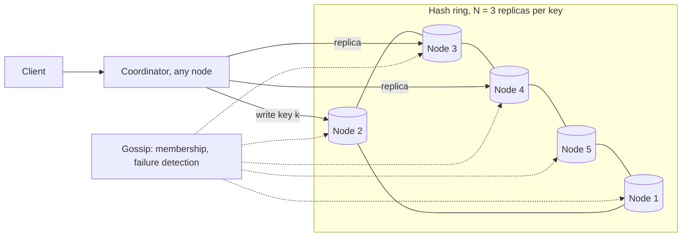
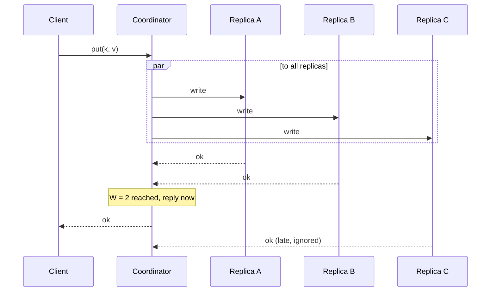
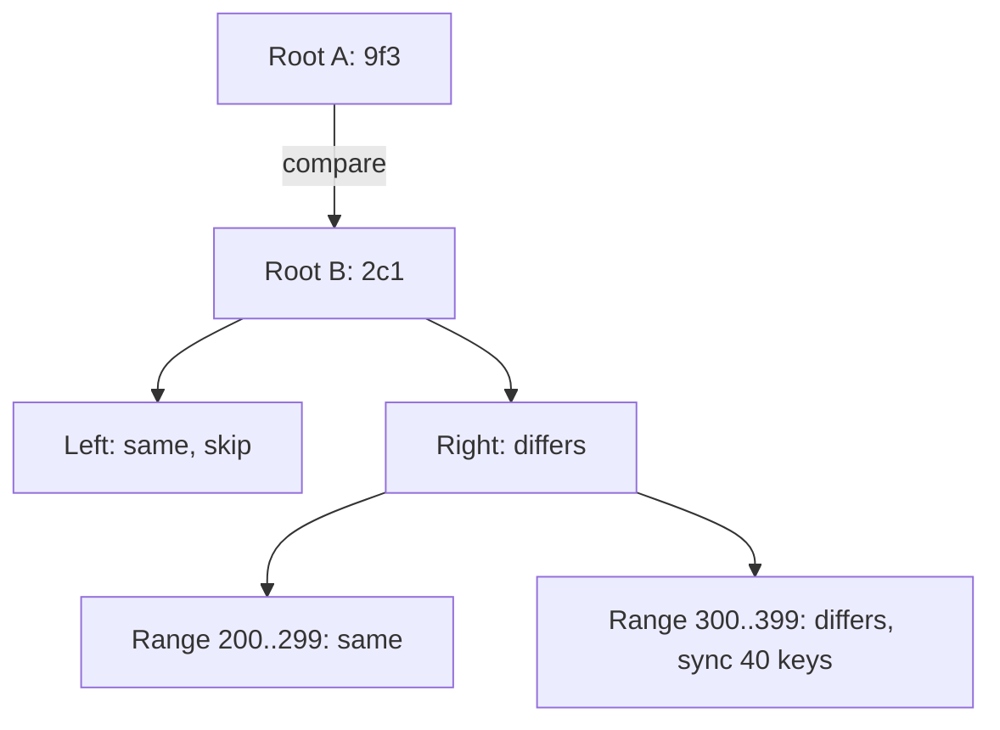
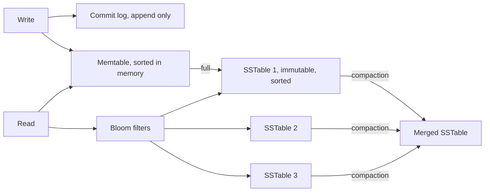

## Requirements

**Functional**

- `put(key, value)` and `get(key)`. Keys and values are opaque bytes; values up to a few MB.
- No range queries, no transactions across keys.

**Non-functional**

- Scale to petabytes and millions of operations per second by adding machines.
- Keep serving reads and writes when a machine, a rack or a data centre is lost.
- Consistency is a knob: some callers want strong reads, most want fast ones.
- Latency in the low milliseconds at p99 for both operations.

There is no single "the" design. The requirements above describe the AP end of the spectrum, which is the one to draw unless the interviewer says "bank".

## Architecture

Every node is identical. A client sends a request to any node, which acts as coordinator: it hashes the key, finds the N nodes that own it, forwards, and collects replies. There is no leader, no metadata server, no single point that has to be up.

## Partitioning

Keys are placed on a ring with [consistent hashing](../../concepts/consistent-hashing/), each physical node owning many virtual nodes. Adding a node moves only the slices it takes over; losing one spreads its slices across the survivors. The ring is the only routing table, and every node has a copy.

## Replication

Each key is stored on the N distinct physical nodes found clockwise from its position; N = 3 is the norm. The coordinator writes to all N and waits for W acknowledgements before replying; a read asks all N and waits for R.

`W + R > N` makes reads strongly consistent: a read quorum always overlaps the last write quorum. `W = 1, R = 1` is fastest and eventually consistent. The client chooses per request.

## Deep dive: staying available during failures

### Sloppy quorum and hinted handoff

If a replica is unreachable, the coordinator writes to the next healthy node on the ring instead, with a hint saying who the data was meant for. When the intended node comes back, the hint is handed over and deleted. Writes never fail because one replica is down; that is the availability promise.

### Anti-entropy with Merkle trees

Hints cover short outages. For long ones, or a lost disk, replicas compare what they hold. Each node keeps a Merkle tree over its key ranges; two replicas exchange root hashes, descend only into subtrees that differ, and copy just the divergent keys. Comparing a terabyte costs a handful of small messages when the replicas agree.

### Failure detection

Nodes gossip: each second every node tells a few random peers what it knows about the membership and the health of everyone else. A node that stops answering is marked suspect, then dead, by everyone, without a central monitor, and the ring is updated the same way.

## Deep dive: conflicting writes

With `W = 1` or during a partition, two clients can write the same key on different replicas. Both are accepted; the store now holds two versions.

- **Vector clocks** tag each version with `{node: counter}` pairs. On read, the coordinator sees that neither version descends from the other, and returns both to the client, which merges and writes back. Exact, and it pushes work to the application. Dynamo's shopping cart merges by union.
- **Last write wins** keeps the version with the higher timestamp. Nothing for the client to do, and one write is silently lost. Cassandra defaults to this because most applications would rather lose an update than write merge logic.

Offer both, default to last write wins, and say what it loses.

### Read repair

When a read with `R > 1` returns different versions, the coordinator sends the winner back to the stale replicas. Reads heal the data they touch, which keeps frequently read keys consistent without waiting for anti-entropy.

## Deep dive: the storage engine on one node

Random writes to disk are slow; sequential writes are fast. A log-structured merge tree only ever writes sequentially.

1. A write appends to the commit log for durability, then updates the sorted in-memory memtable. Both are fast.
2. When the memtable fills, it is flushed to disk as an immutable sorted file, an SSTable, with an index.
3. A read checks the memtable, then SSTables newest to oldest. A Bloom filter per SSTable says "definitely not here" for most of them, so a typical miss touches no disk.
4. Compaction merges SSTables in the background, dropping overwritten and deleted keys.

Deletes are tombstones: a marker that wins over older values and is removed at compaction after a grace period, long enough for anti-entropy to have spread it, otherwise a repaired replica resurrects the key.

## Trade-offs

- **Leaderless replication** costs conflict handling and gives no single point of failure and writes that succeed as long as W nodes exist.
- **Tunable quorums** move the CAP decision from the system to each request. The cost is that a caller who picks `R = 1` and then complains about a stale read has to be told what they picked.
- **LSM storage** makes writes cheap and reads a little more expensive, and needs compaction to keep read amplification down. For a write-heavy store that is the right side of the trade.
- **No range queries.** Hashing scatters neighbouring keys. If ordered scans are required, that is a different system, one with range partitioning and a leader per range.

## Pitfalls

- Drawing a master node. The moment there is one, availability is bounded by it.
- Forgetting `W + R > N` when claiming strong consistency.
- Last write wins with unsynchronised clocks, and then the "last" write is the one from the node whose clock is ahead.
- Deleting tombstones before every replica has seen them.
- Treating hinted handoff as durability. It is a buffer; anti-entropy is the guarantee.
