## Requirements

**Functional**

- Data in: daily OHLCV bars for a fixed universe of 30 liquid ETFs and large caps (11 traded), pulled once a night from a free broker feed, validated, and stored raw with corporate actions in a separate table.
- Signal: one pure function, `target_weights(bars, held)`, returns target portfolio weights for the 11 traded symbols once a day; the same bytes run in backtest, paper and live.
- Order out: convert weights to orders against settled cash, pass a risk gate, submit to a cash account at Alpaca as fractional DAY orders inside one 15:45 to 15:50 ET window, cancel anything unfilled at 15:58.
- Reconcile: compare the local ledger to the broker's positions, open orders and cash every 60 seconds, and before any order; an unexplained difference halts new orders and pages the operator.
- Report: one push notification a day with a one-line verdict, a weekly report that leads with realised versus modeled cost, and every number rebuildable from insert-only tables by one script.
- Research: a register, an append-only log, a sealed 24-month holdout, and a promotion ladder from backtest through shadow, paper and canary to live, with numeric gates written down before each stage starts.
- Out of scope for version one: intraday signals, crypto, options, shorts, margin, machine learning on the signal, paid data, more than one operator.

**Non-functional**

- Safety first: no bug, crash, outage or stale feed may produce an order the system is not watching. Every order is DAY, every intent is written to disk before the HTTP call, and a dead process leaves nothing past 16:00.
- Unattended for a trading day: the operator is unavailable 23 hours a day, so silence must be safe; halts are sticky and only a typed human reason resumes trading.
- Loss limits: 3 percent of start-of-day equity ($60) halts entries; 5 percent over five sessions ($100) halts entries; 10 percent from the high-water mark ($200) flattens the book and sends the strategy back to paper.
- Cost: under $7 a month fixed, $0 for data; one Mac mini, one home broadband, no cloud beyond an off-site copy of one file.
- Correctness of the record: raw prices are never overwritten, the fill ledger is append-only and keyed on the broker's fill id, and an identical backtest rerun reproduces its result bit for bit.
- Honesty: no report prints a Sharpe without its standard error and a deflated version; "edge confirmed" is not a stage and not a sentence the system can emit.

## Estimates

| Quantity | Value | How |
| --- | --- | --- |
| Daily bars stored | 190k rows, 8 MB | 30 symbols × 252 sessions × 25 years |
| Minute bars stored | 2.2M rows, 45 MB | 11 traded symbols × 2 years, regular hours only; used only to measure slippage |
| State file | under 100 MB; logs 550 MB per year | One SQLite file for bars, orders, fills, runs, halts; JSON-lines logs kept 365 days |
| Broker API calls | 3 per minute, under 200 per day of ingest | Reconcile every tick against a 200 per minute limit |
| Fixed cost per month | $3 to $7 | Electricity $1 to $3, UPS amortised $2, B2 backup under $1, data $0, alerting $0 |
| Orders per year | 15 to 25 | Reference strategy: 12 signal days a year, 3 positions, turnover 150 to 250 percent of NAV |
| Cost per round trip | 4 bps measured on SPY-class; 10 bps planned; 20 bps stress | Spread crossed once 1.7 bps, timing slippage 2 bps, regulatory fees under 0.3 bps, fractional rounding 0 to 1 bp |
| Break-even gross return, monthly cadence | 3.6 to 4.2 percent a year | Turnover 6× NAV at 10 to 20 bps plus $60 fixed; daily cadence needs 10.5 to 18 percent, weekly 5.6 to 8.2 |
| Expected edge | $40 to $100 a year gross; $0 to $100 net | Documented retail-replicable premia of 2 to 5 percent over buy-and-hold on $2,000, before $60 of fixed cost |
| Drawdown of a zero-edge book, one year | about 19 percent, $375 | 1.25 × sigma × sqrt(T) at 15 percent vol; a normal losing year, not evidence |
| Sharpe standard error after one live year | 1.0 | SE ≈ sqrt(252 / n) with n = 252 daily returns |
| Years to a significant Sharpe | about 4 at a true Sharpe of 1.0; 15 to 16 at 0.5 | n ≈ 252 × 1.96² days to reject zero at two-sided 95 percent |

Three conclusions shape the design. The account cannot pay for anything: no feed, no cloud, no daemon, so the platform is one file, one supervisor and free-tier services. Cost scales with turnover and the edge does not, so the only strategies that clear the hurdle are slow ones on liquid ETFs, and daily rebalancing is designed out before any rule about day trading is counted. And live P&L cannot show an edge inside several years, so the live stages exist to prove that the plumbing, the costs and the signals match the backtest, and the backtest carries the edge hypothesis.

## High-level design

### Step 1: A script that pulls bars and prints target weights

There is no previous step, so the problem is the product itself: given a list of ETFs, what should the book look like today? One script pulls daily bars from Alpaca's free REST endpoint, stores them in a SQLite file, and calls a 20-line function that returns weights. It prints them; the operator reads them. Each later step names what this one could not do and adds the smallest thing that fixes it; nodes added in a step are outlined in gold, and ids stay fixed so the diagram grows rather than changes.

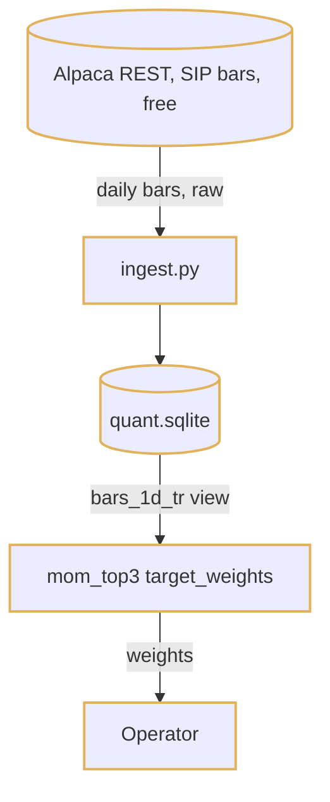

1. `ingest.py` asks the exchange calendar whether today was a session, then fetches the last five sessions of daily bars for 30 symbols with `feed=sip` and `adjustment=raw`.
2. The fetched window is rewritten in one transaction, so a rerun or a vendor correction lands identically; corporate actions go to their own table and total-return factors are rebuilt backward to 1.0 today.
3. The strategy reads the last 300 completed sessions through the `bars_1d_tr` view, scores each ETF by its 126-bar total return, and returns `{SPY: 0.333, GLD: 0.333, TLT: 0.333}` or a mix with BIL.
4. The operator places the trades by hand, or does not.

This works and is where most people should stop for a month. It fails in three ways once it is trusted: nothing says whether the weights are any good, nothing sends the orders, and nothing checks that the data the function saw is the data it should have seen.

### Step 2: The backtest engine and the research log

Step 1 prints weights with no evidence behind them, and the first evening spent tweaking the lookback turns the strategy into a fit to noise: daily returns have a signal-to-noise ratio around 0.03, and 20 variants on 8 years of data produce a Sharpe of 0.87 from nothing. Add the engine that walks the stored bars one session at a time calling the same function, and put a register in front of it: an idea gets an id and a written economic reason, every run is a row before it executes, the register refuses a 21st run per idea, and the last 24 months are sealed in a separate file that a function opens once. This runs on the laptop against a copy of the file.

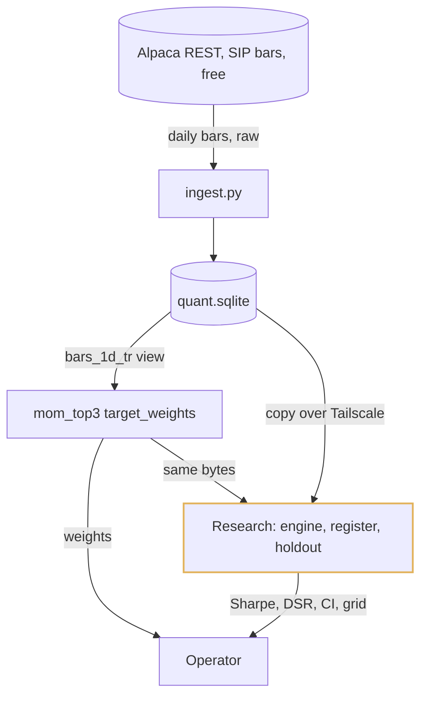

1. The operator registers an idea with a one-paragraph reason and a declared metric; the register creates a `research_log` row with code hash, parameters, snapshot hash and sweep size, and an append-only trigger makes the row permanent.
2. The engine walks 2016-09 to 2024-08 one session at a time, calls `target_weights` with bars through the prior close, converts weights to orders with the cash, lot and settlement rules, fills at the session close minus 5 bps and fees, and reruns at 10 and 20 bps.
3. Walk-forward is train 3 years, test 1, roll 1, 5-day embargo, 5 folds; the report prints Sharpe, deflated Sharpe over the idea's cumulative configuration count, a 1,000-resample block-bootstrap interval, drawdown, turnover and cost paid.
4. `holdout_run(idea_id)` opens 2024-09 to 2026-08 once, writes a loud row, and refuses a second call.

### Step 3: The broker adapter, intent-before-submit and the order state machine

Step 2 proves a strategy on paper and still places every order by hand, which is where the errors are. Add a broker adapter for a cash account at Alpaca, but not as a function that posts an order: as a state machine whose first move is a row in SQLite carrying a deterministic `client_order_id`, fsynced before the HTTP call, so a timeout, a crash and a retry can never make a second order. The same adapter has a paper endpoint and a live endpoint selected by one config value.

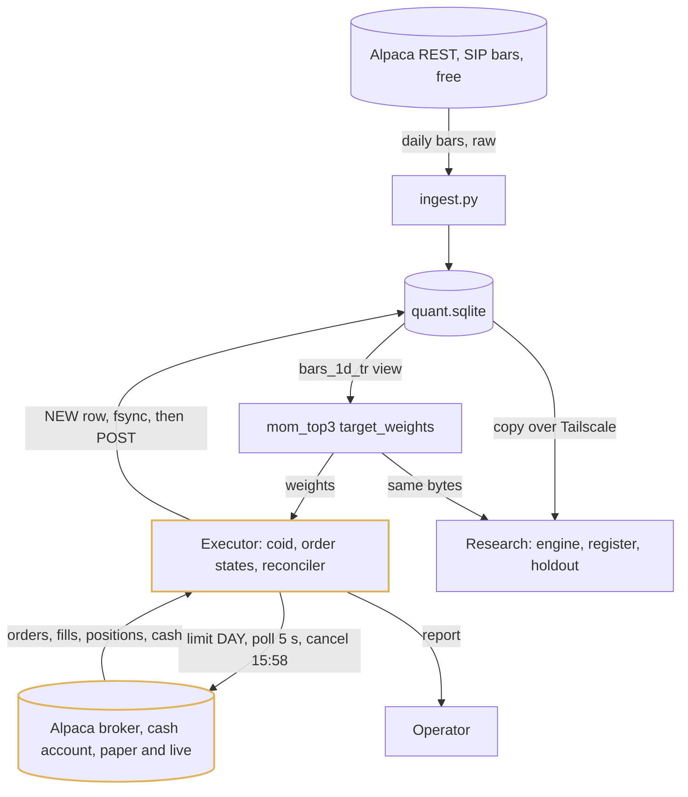

1. Before anything, the executor snapshots the broker (account, positions, open orders), cancels any open order left by a crashed run, and reconciles positions and cash against the ledger.
2. For each order it inserts a row as `NEW` with `coid = "{strategy}-{symbol}-{yyyymmdd}-{side}-{seq}"` under `synchronous=FULL`, then submits a marketable limit DAY order: ask plus 10 bps for buys by notional, bid minus 10 bps for sells by quantity.
3. A timeout or 5xx moves the row to `UNKNOWN`, and the only legal next action is `GET order by client_order_id`; every state change is one `UPDATE ... WHERE state = expected`.
4. Fills are booked with the broker's fill id as the key, a settlement date of T+1, and FIFO lots; the ledger is never updated, only appended.

### Step 4: The risk gate as a separate process holding the keys, and the portfolio layer

Step 3 lets the strategy reach the broker through an in-process convention, on a machine where the one operator edits the strategy weekly with no reviewer; a bug in a 20-line function can size a position at 100 percent. Split the box into two macOS users. The `strategy` user's process reads bars and writes `intents/<date>.json` with weights and nothing else; it has no Keychain items. The `trader` user's process owns the portfolio layer, the gate, the executor and the keys. "The strategy cannot reach the broker" becomes a permission, not a convention.

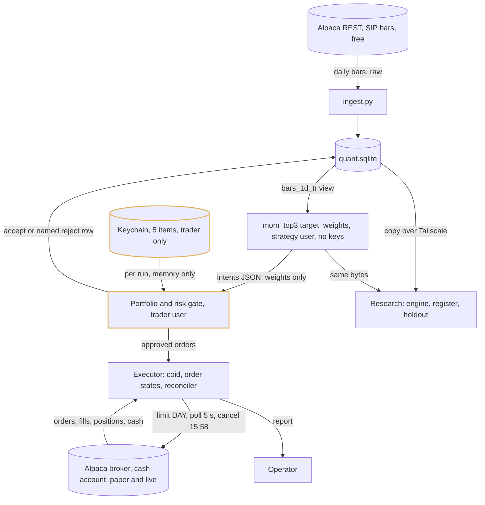

1. The portfolio layer computes NAV and target dollars, applies the band (trade only if the change is at least the larger of $10 and 20 percent of the target; always open at $25 or more; always close fully at a target of zero), sequences sells before buys, and budgets buys against settled cash minus a 5 percent reserve, scaling pro rata on overflow.
2. Settled cash is the ledger's number, cash minus proceeds settling after today, cross-checked against the broker's `cash` with the lower value winning; a symbol sold today cannot be bought today.
3. The gate runs its checks in a fixed order and writes a named reject row on the first failure: halt flag, allow-list and event lockout, bar age, weight and gross caps, position count, settled cash, order count, turnover, measured spread. Sells that reduce a position skip the entry checks.
4. Limits are rows in a `limits` table changed only through `riskctl set --reason`; a raised limit is a logged row that appears in the next report.

### Step 5: The platform: launchd tick, runs table, Keychain, dead-man's switch, alerts

Step 4 is correct while a human starts it. Left alone on a Mac, it sleeps, reboots after a power cut, hangs on a stuck socket, or fires an hour late on the Sunday the clocks change, and none of those failures tell anyone. Replace the run-once script with a stateless launchd tick every 60 seconds that reads a `runs(trading_day, step)` table and executes whatever step is due and inside its deadline; a step past its deadline is skipped and alerted, never replayed. The last line of a successful tick pings healthchecks.io, so the outside learns of a dark box by absence. Backups are one file.

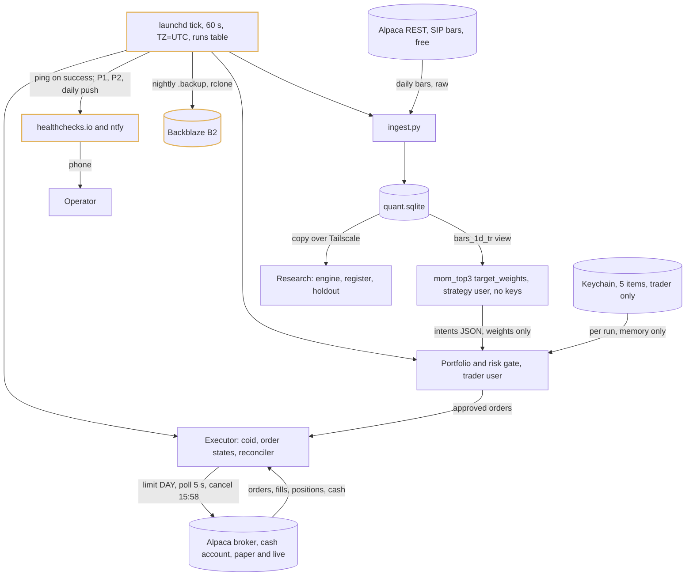

1. Each tick opens the file (WAL, `synchronous=FULL`, `busy_timeout=5000`), checks the `halts` table, loads the session calendar, derives `trading_day` as data, and reconciles positions, open orders and cash against the broker: 3 calls a minute.
2. During market hours it compares broker equity to start-of-day equity; a 3 percent loss writes a `HALT_ENTRIES` row that survives restart and is cleared only by `quant ack <id> --reason` over Tailscale SSH.
3. Three healthchecks.io checks watch the box: `quant-open` pages by 09:30 ET if the 09:15 pre-open reconcile did not run, `quant-tick` within 6 minutes of a missed tick, `quant-report` by 16:45 if the report is missing.
4. Secrets are five Keychain items read by `security find-generic-password` at the start of each tick and held in one variable; live also requires a `LIVE_ARMED` file. The dashboard is a stdlib `http.server` on 127.0.0.1 published to the phone with `tailscale serve`, offering Halt and Flatten and nothing else.

### Step 6: Promotion stages from shadow to canary to live, and the evaluator

Step 5 runs unattended and would happily trade a strategy that passed a backtest yesterday with real money today. Add a `strategies` table where stage is a column, a size multiplier in exactly one function (0 for shadow, 1.0 for paper, 0.1 for canary, 1.0 for live), and an evaluator that runs after the close with a read-only connection: it replays today's signal against the stored snapshot, computes the metrics, and applies the gate, demotion and retirement rules that were written to the row before the stage began. Downward moves are automatic; upward moves need the evaluator to pass the gate and the operator to press confirm.

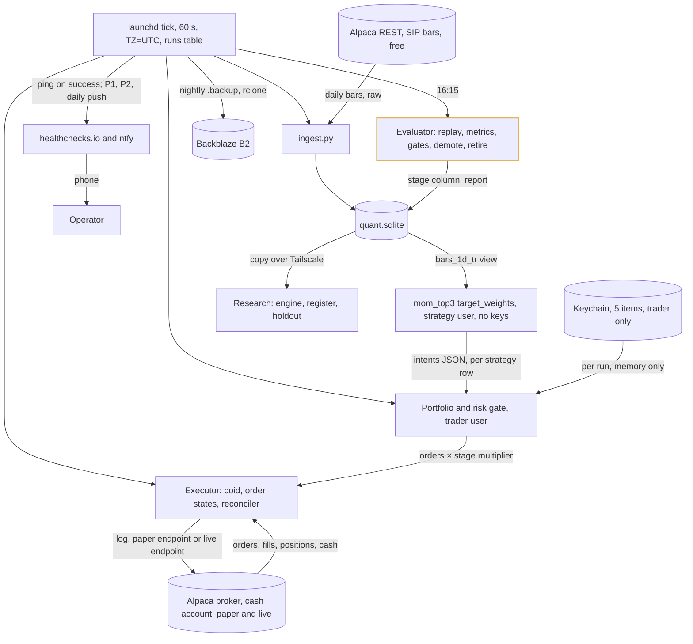

1. A strategy enters shadow from the research gate; for 10 days its intents go to the log only, and the evaluator diffs them against a replay of the stored snapshot; any mismatch is a bug, never a metric.
2. Paper routes the same intents at full size to the paper endpoint for 60 trading days spanning at least 3 signal days; the gate is 100 percent signal match, zero `UNKNOWN` residues and zero unexplained reconcile breaks.
3. Canary routes to the live endpoint at 10 percent size for 20 trading days and at least 2 signal days, with a reject rate at most 2 percent and the daily cap never hit; the first 30 live fills, wherever they land, must show median slippage at most 5 bps against the model and p95 at most 20.
4. At most 4 rows exist and at most 2 at canary or live, each owning its symbols; a `core/` code change creates a new row at shadow rather than touching the incumbent.

### Step 7: The final picture

The same fourteen components grouped by where they run and who may touch them. Two macOS users on one box separate what can compute a signal from what can spend money; the laptop holds research and never holds a key; everything outside the house is a free tier or the broker. There is no queue, no container and no daemon: one supervisor, one file, one tick.

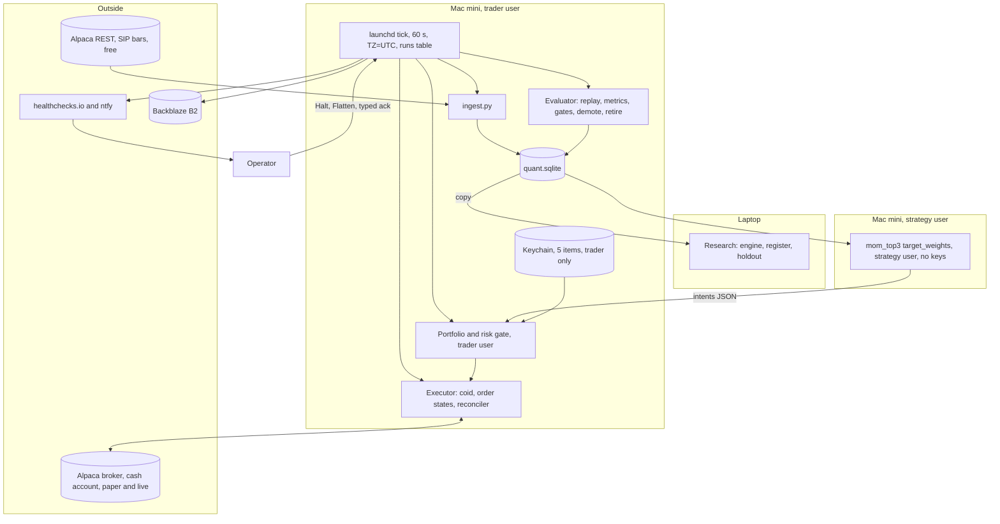

| Component | Owns | Scales by | Fails how |
| --- | --- | --- | --- |
| Alpaca REST data | Consolidated SIP daily and minute bars once 15 minutes old, corporate actions, calendar | Free tier, 200 requests a minute | A missed night is a stale-bar reject at 15:45; no orders, one alert |
| ingest.py | Nightly pull at 16:35 and 20:05, window rewrite in one transaction, validator, factor rebuild, snapshot hash | 30 symbols, under 10 s of API time | Reruns are idempotent; a symbol that fails validation goes AMBER or RED and cannot be entered |
| quant.sqlite | Bars, corporate actions, factors, data quality, intents, orders, fills, lots, runs, halts, limits, strategies, reconcile snapshots | One file under 100 MB; WAL, `synchronous=FULL` | Power cut loses nothing committed; nightly `.backup` to B2; restore drill quarterly |
| Strategy process | `target_weights(bars, held)`, one intents file a day, no keys | 20 lines per strategy, pandas and numpy only | A missing or malformed intents file means no orders and an alert; it cannot reach the broker |
| Portfolio and risk gate | NAV, deltas, band, settled cash, sequencing, ordered checks, `limits` table, named rejects | Nine checks, one row each | Fails closed: first failing check rejects; a 100 percent reject week is flagged in the report |
| Executor | Deterministic coid, order state machine, marketable limit DAY orders, 15:58 cancel, reconciler, disposition table | One order pass a day, under 10 orders | Timeout goes `UNKNOWN`, resolved only by lookup; a mismatch halts and sends nothing |
| Alpaca broker | Cash account, positions, fills, cash, paper and live endpoints, `daytrade_count` | The broker's problem | An outage costs one missed run; DAY orders expire; the broker app still works from the phone |
| launchd tick | 60-second stateless loop, `runs` table, deadlines, reconcile every tick, equity check, machine checks, healthchecks ping | Nine steps a day | Sleep, reboot, crash and late fires all reduce to the next tick reading the table; late steps skip |
| Keychain | Five trading-only secrets under `trader`, unlocked by auto-login | Five items | Theft yields a key with no transfer rights, rotated the same day, bounded by the risk caps meanwhile |
| Evaluator | Signal replay, metrics with standard errors, gates, automatic demotion and retirement, report markdown | Read-only connection at 16:15 | Cannot touch the order path; a failed run is a missing `quant-report` ping by 16:45 |
| healthchecks.io and ntfy | Three absence checks and one random topic; P1 urgent, P2 high, P3 paper | Free tiers | If ntfy is flaky, Pushover; if the Mac is dark, the absence check is what pages |
| Backblaze B2 | Nightly `.backup` of the one file, 90-day prune | About a cent a month | Restore is git clone, `uv sync --frozen`, `rclone copy`, `quant selftest` against paper |
| Research | Engine, register, append-only log, sealed holdout, walk-forward, deflated Sharpe | Laptop; 252k bars in 0.8 s, 500 configs in under a minute | Promotion artefacts are committed to git, which is the research record's off-site copy |
| Operator | One push a day, five-minute checklist, Saturday half hour, typed resumes, Halt and Flatten from the phone | One person, 23 hours a day away | Five unacknowledged days halt entries and hold; the loss rules stay armed |

## Deep dive: the order path and reconciliation

### 1. The problem

Once a day, turn a set of target weights into at most ten orders against a broker over a home connection, so that a timeout, a crash between the HTTP call and the write, a launchd restart, or a position the operator closed by hand in the broker app can never produce a second order, a phantom position, or a ledger that quietly disagrees with the account. The account is $2,000; a duplicated buy is 40 percent of it.

### 2. The obvious approach

Loop over the orders, `POST /v2/orders` for each, write the response to the database when it comes back, and retry on any error. Once a day, pull positions from the broker and overwrite the local table with them. If the two disagree, trust the broker and move on.

### 3. Why it breaks

A retry after a timeout is the duplicate-order machine: the first POST may have succeeded. A crash between the POST and the write leaves an order at the broker with no local row, which the next run does not know to poll or cancel. Overwriting the ledger from the broker hides bugs, because a phantom position becomes a real one with no record of how. And "trust the broker and move on" is wrong in the one case that matters: when the ledger is untrusted, the quantities computed from it are untrusted, and sending anything, including an exit, is a guess.

### 4. The intent is written before the call, with an id the broker will honour

Every order starts as a row in `orders` with state `NEW` and a deterministic `client_order_id` built from strategy, symbol, date, side and sequence, committed under `synchronous=FULL` before any network call. Alpaca rejects a second order with the same client id as a 422 duplicate, so the id turns at-least-once submission into exactly-once placement: the local row is the intent, the broker's id is the fact, and the client id is the join. A `SUBMITTING` state is written before the POST and every later transition is `UPDATE orders SET state = ? WHERE coid = ? AND state = ?`, so two ticks racing after a restart cannot both advance the same row. The cost is one fsync per order and a rule that no code path submits without a row; on 20 orders a year it is free.

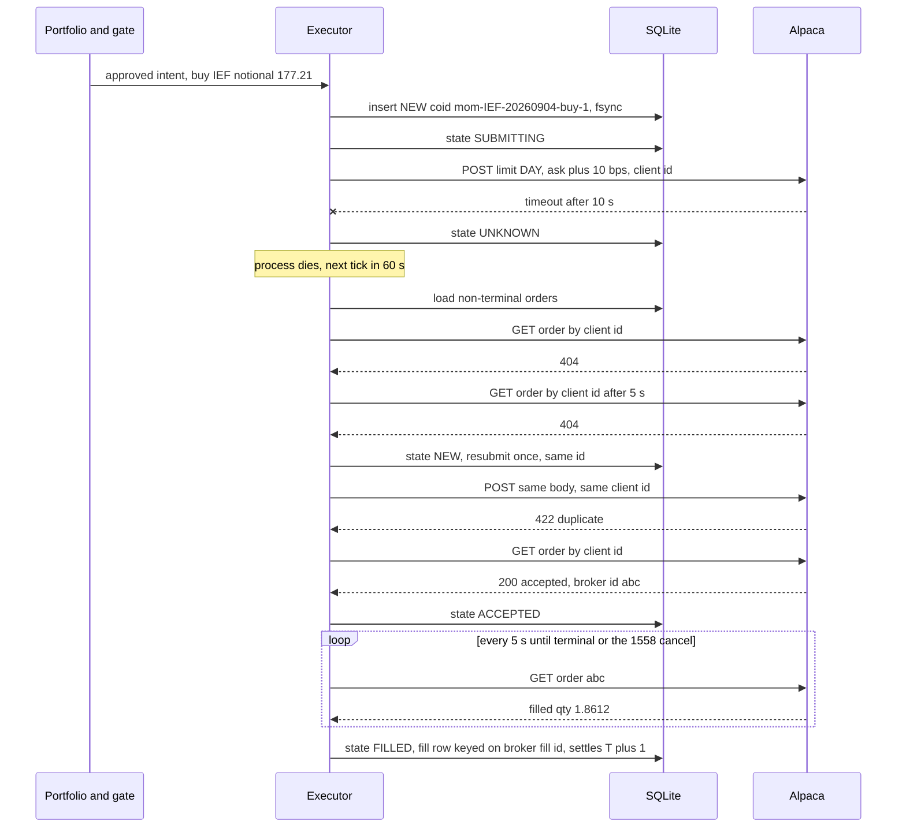

### 5. Unknown is a state, and lookup is its only exit

A timeout or a 5xx does not mean the order was not placed; it means the executor does not know. So `UNKNOWN` is a real state whose only legal successor is a `GET` by client id. Two 404s five seconds apart return the row to `NEW` for exactly one resubmit with the same id; a 422 duplicate on that resubmit is treated as found and looked up again. No retry counter, no exponential backoff, no guessing. At 15:58 every non-terminal order is cancelled explicitly, and a fill that beats the cancel wins and is booked. The cost is that a broker outage across the whole window leaves an `UNKNOWN` row until the next tick can resolve it, during which the gate refuses new orders on that symbol; that is the correct behaviour, and it is the residue that the paper stage must show as zero.

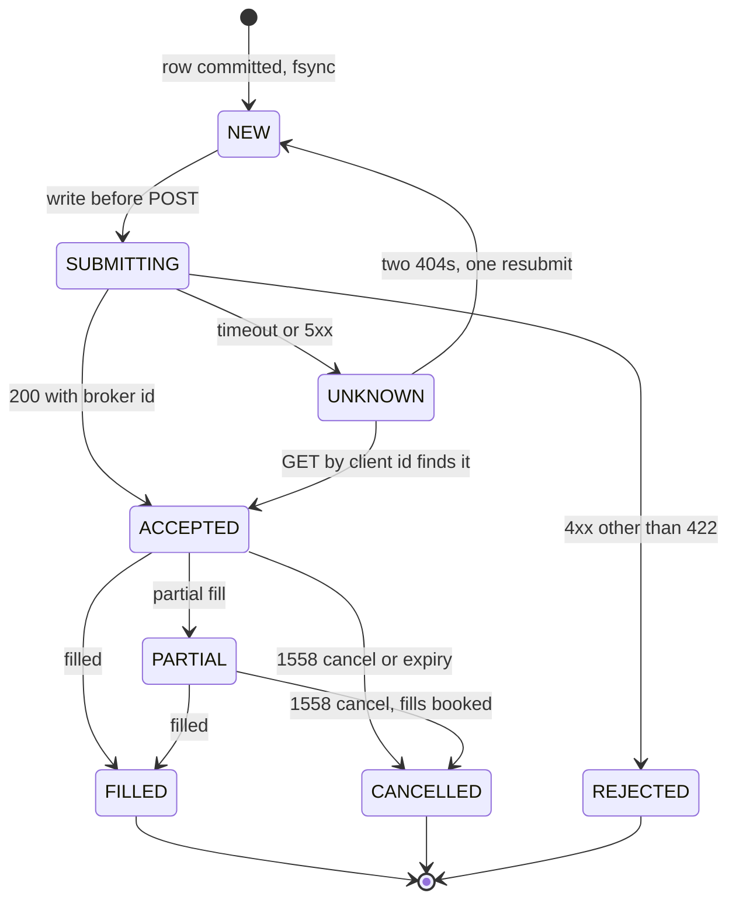

### 6. Reconcile first, and dispose of every mismatch by table

Every tick, and always before any order, the executor pulls positions, open orders and cash and compares them per instrument to the ledger. Three calls a minute is nothing against the rate limit, and it is what catches a position the operator closed in the broker app within a minute rather than at 15:45. The two rules are that broker quantities and cash always overwrite local, with the delta logged, and that no reconcile action ever creates an order. The disposition table is the whole recovery code:

| Local | Broker | Action |
| --- | --- | --- |
| `ACCEPTED` or `PARTIAL` | filled, cancelled or expired | Apply broker status, book fills at broker price and quantity |
| `UNKNOWN` | found by client id | Adopt broker id and status |
| `UNKNOWN` | 404 twice | Back to `NEW`, resubmit once with the same id, then `REJECTED` with an alert |
| `FILLED` | order missing at broker | Alert, halt entries; treat as a bug |
| Position differs by up to $5 | any | Overwrite local, log the delta, list on Saturday |
| Position differs by more than $5 | any | Overwrite local, halt entries, send nothing, page |
| Broker position with no local order in 5 days | any | Alert; the operator decides, no auto-flatten |
| Broker open order with no local row | any | Cancel it, alert; the bot did not place it |
| Cash differs by more than $5 | any | Overwrite local, halt entries, recompute settled cash, page |
| `daytrade_count` above 0 | any | Halt entries, page; the same-day exclusion failed |

The $5 threshold is per instrument and never on totals. Dividend accrual, cash interest and fractional-share rounding produce sub-dollar diffs weekly, and halting on them trains the operator to type resume without reading. The cost is that a real $4 phantom is logged rather than paged; it appears in Saturday's list, and $4 is 0.2 percent of the account.

### 7. Halt means entries, and nothing flattens on its own

A halt is a row in `halts` with a reason and a snapshot id, written by the tick on a reconcile break, a loss limit, a broken invariant, five unacknowledged pushes, or the operator, and it survives restart. `HALT_ENTRIES` blocks buys; sells that reduce or close a position still pass, because in a cash account every legal entry implies a legal exit and blocking exits is the larger loss. Every open order is cancelled so the next reconcile sees a closed book. The one exception to "exits pass" is a reconcile mismatch, which sends nothing at all, because the quantities are what is untrusted. `FLATTEN` is cancel-all then close-all, limit then market at 15:59, triggered only by the operator from the phone or the shell, or by the 10 percent drawdown budget at the next 15:45 run. Nothing time-based flattens: an ISP flap or a holiday week must not become a realised trade. Both states clear only by `quant ack <id> --reason` over Tailscale SSH; there is no resume button and no auto-resume code path. The cost is that a false halt on a Tuesday morning blocks the month's rebalance until the operator reads the page, which the band absorbs the next day.

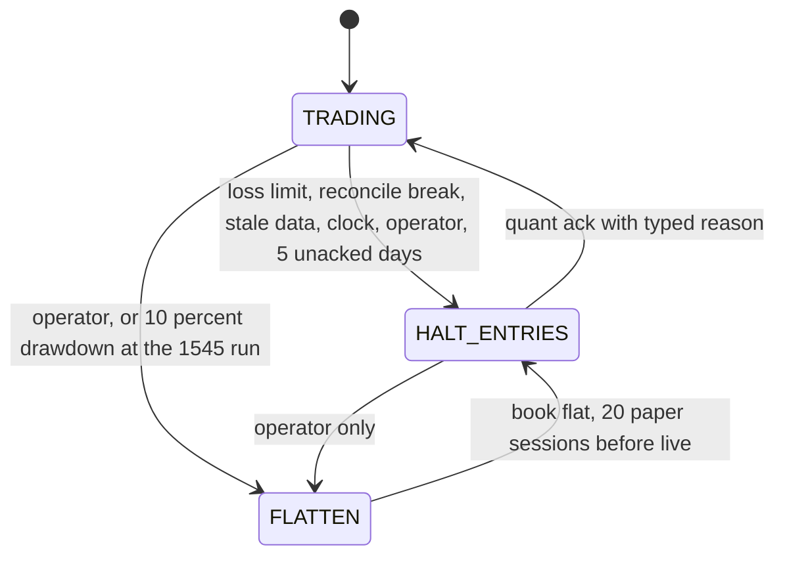

### 8. Where it lands

- A `NEW` row with a deterministic client order id is committed before every HTTP call; the broker's duplicate rejection makes at-least-once submission exactly-once placement.
- `UNKNOWN` is a state whose only exit is a lookup by client id; one resubmit with the same id; every order is DAY and cancelled at 15:58.
- Reconcile per instrument every 60 seconds and before any order; broker overwrites local, deltas are logged, more than $5 halts and sends nothing, and no reconcile action creates an order.
- Halts block entries, cancel opens, survive restart and clear only by a typed human reason; flatten is the operator's or the drawdown budget's, never a timer's.

## Deep dive: risk, sizing and the account rules

### 1. The problem

Hold three to five ETF positions in a $2,000 cash account without ever tripping a good-faith violation or a pattern-day-trade flag, size them so that one bug or one gap cannot take more than a defined slice, and bound the losses over a day, a week and a drawdown so that a strategy with no edge costs tuition rather than the account. The strategy is the least trusted code in the system; it is edited weekly by one person with no reviewer.

### 2. The obvious approach

Open the broker's default margin account, size each position at 1 percent risk off a 2 x ATR stop, attach a broker-side bracket stop to every entry so the Mac can die safely, rebalance daily, and halt when the day is down 2 percent. Put the limits in the code next to the strategy.

### 3. Why it breaks

$2,000 sits exactly on the FINRA 4210 margin floor, so a $60 drawdown turns margin off anyway, and in margin the exit can be the fourth day trade that the broker's PDT check rejects: the protective sell is the illegal leg. Bracket stops at Alpaca need whole shares, which turn a $400 slot in SPY at $560 into nothing, and a DAY bracket's stop leg dies at 16:00, so protecting an overnight position needs the GTC order that nobody is watching. A 2 percent daily halt fires on the ordinary range of a 95 percent long ETF book. Daily rebalancing at 30 percent turnover needs 10.5 to 18 percent gross a year to break even. And limits in code next to the strategy are edited by the same person on the same losing evening.

### 4. Cash semantics in software, whatever the account says

The account is cash, long only, and the portfolio layer enforces cash semantics regardless of what the broker would allow: a settled-cash ledger (cash minus proceeds whose settlement date is after today, cross-checked against the broker's `cash`, lower wins), no same-day round trip per symbol, and one run per day. Under T+1 a sale at 15:45 today is spendable tomorrow, which is exactly the cadence the design wants, so settlement costs a daily-or-slower system nothing. PDT does not apply to a cash account, and the same-day exclusion makes a day trade impossible by construction; `daytrade_count` above 0 at the broker is treated as a bug and halts entries. A test fails if any of the three rules is removed. The cost is a 5 percent settled-cash reserve ($100) as the fee and rounding buffer, and the restriction that a later move to intraday would have to argue against, which is a feature.

### 5. Sizing arithmetic on $2,000

The strategy publishes weights; the portfolio layer converts to dollars; the gate clamps. No risk-per-trade formula, because there is no stop to size from: the 40 percent cap is the fat-finger bound and the daily limit is the loss bound.

| Rule | Value at $2,000 | Why |
| --- | --- | --- |
| Investable | $1,900 | gross ≤ 0.95, 5 percent settled-cash reserve |
| Per-symbol weight | ≤ 0.40, $800 | A 5 percent overnight gap on the largest position is 2 percent of NAV, inside the daily limit |
| Positions | 3 to 5; `max_positions = min(5, floor(NAV × 0.95 / 200))` | Falls to 4 at $1,000; minimum position $100 so spread and rounding stay under 1 percent |
| Reference strategy slot | about $633 each for 3 positions | 1/3 of $1,900; fractional orders make this constructible, whole shares would not |
| Band | trade only if the change ≥ max($10, 20 percent of target); open at ≥ $25; close fully at 0 | Daily evaluation lands at about 5x annual turnover, the monthly cost profile; no minimum holding period, exits are never gated |
| Order caps | 10 orders a day, 1 open order per symbol, minimum notional $5 | Fat-finger bounds on the executor |
| Turnover cap | rolling 20-session one-way turnover ≤ 1.25 × NAV (15x a year) | A strategy that churns has stopped being the strategy that was tested; soft-halts entries |
| Spread cap | measured spread ≤ 20 bps from the broker's quote; limit within 2 percent of last close | Blocks a symbol whose cost has left the model |

### 6. Loss limits and the drawdown budget

All three limits use the broker's `equity`, which marks at NBBO, not a feed's last trade; deposits and withdrawals are netted out of start-of-day equity and the high-water mark.

| Limit | Value | What it does | Re-arm |
| --- | --- | --- | --- |
| Daily | 3 percent of start-of-day equity, $60 | `HALT_ENTRIES` for this session and the next; no flatten | Typed reason |
| Weekly | 5 percent rolling 5 sessions, $100 | `HALT_ENTRIES`; the only guard against a slow bleed of 1.9 percent a day | Typed reason |
| Drawdown tier 1 | 5 percent from high-water mark, $100 | Gross cap drops from 0.95 to 0.60 | Automatic as the mark recovers |
| Drawdown budget | 10 percent from high-water mark, $200 | `FLATTEN` at the next 15:45 run; strategy to paper for 20 sessions | Evaluator and confirm |
| Reconcile break | more than $5 per instrument or cash | `HALT_ENTRIES`, nothing sent | Typed reason |
| Realised cost | more than 1.5x modeled over 20 trades | `HALT_ENTRIES` | Typed reason after a cost-model refit |

The budget is $200 of tuition. A 15 percent budget was rejected as too generous for a first strategy, and 2 percent daily as noise. The cost of the sticky re-arm is that a halt on a Tuesday blocks entries until the operator reads the page; the cost of an automatic re-arm would be a 3-percent-a-day week that nobody looked at.

### 7. The gate is a different user, and its limits are data

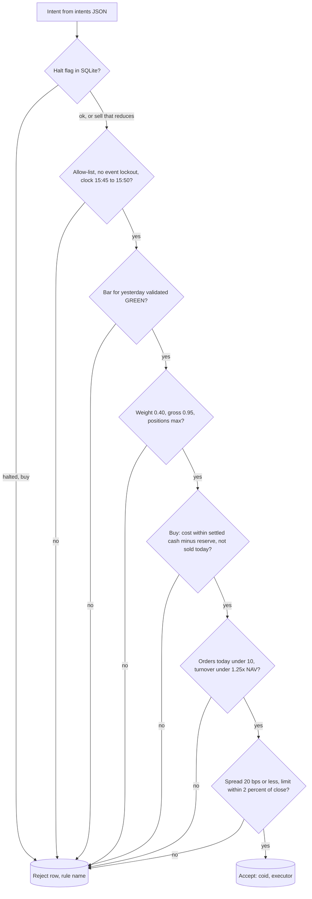

The gate runs as the `trader` user; the strategy runs as `strategy`, cannot read `trader`'s Keychain, and can only write a JSON file. Limits are rows in a `limits` table read at gate time and changed only by `riskctl set --reason`, so raising a cap on a losing evening is a logged row in the next morning's report rather than a silent edit. The pre-deploy test is the contract: a strategy that emits 50 intents at weight 1.0 for a symbol off the allow-list produces zero broker calls and 50 reject rows. The cost is an extra macOS user, an extra plist and an hour of setup once.

### 8. Where it lands

- Cash account, long only, fractional orders; settled cash, no same-day round trip, one run a day, enforced in software and covered by a test.
- Weights in, dollars out: 0.40 per symbol, 0.95 gross, 3 to 5 positions, the 20 percent band, 10 orders a day, 1.25x NAV turnover per 20 sessions, 20 bps spread cap.
- 3 percent daily and 5 percent weekly halt entries with a typed re-arm; 5 percent drawdown cuts gross to 0.60; 10 percent flattens and sends the strategy to paper.
- No broker-side stops; the substitutes are the daily exit, the 60-second equity check, the 6-minute dead-man page, and Halt and Flatten from the phone.
- The gate is a separate user holding the only keys, and every limit is a row with a reason.

## Deep dive: research discipline and the cost arithmetic

### 1. The problem

Decide whether a strategy has an edge before it trades real money, on data where the daily signal-to-noise ratio is about 0.03, where 20 variants on 8 years produce a Sharpe of 0.87 from pure noise, and where the only thing that certainly costs money is turnover. The output has to be a number the operator will believe on the evening the live curve is down $150.

### 2. The obvious approach

Pull ten years of adjusted closes into a notebook, try lookbacks and thresholds until the equity curve looks good, hold out the last two years and check them once the curve does, and run it live at whatever cadence the signal suggests, because commissions are zero.

### 3. Why it breaks

Every window tried is a draw from the noise distribution, and the notebook keeps no count, so the best of 125 combinations on 120 monthly decisions is reported as if it were one. Adjusted closes leak: a split-adjustment factor is computed from a future event, so any rule on a price level sees the future. The holdout is opened as many times as the operator is tempted, which is the number of times the curve disappoints. And "commissions are zero" hides that a daily-rebalanced book at 30 percent turnover pays 7.5 to 15 percent of NAV a year in spread and slippage.

### 4. The register, the caps and the log

Research starts at the register, not at a notebook. An idea gets an id, a one-paragraph economic reason and a declared metric; each run is an append-only row before it executes, carrying idea id, variant number, code hash, parameters, snapshot hash and sweep size, and the runner's only entry point takes a run id, so there is no importable `backtest()` to route around the log. Three numbers each have a job: at most 3 free parameters per strategy, each a published convention rather than a search result; at most 20 logged runs per idea, refused by the register on the 21st; and the deflated Sharpe computed over the total configurations across all runs, so a 500-config sweep counts 500 and pushes the noise ceiling to 1.25 at 8 years, which is the self-correcting reason nobody runs one. The neighbourhood grid (4 lookbacks x 3 N for the reference strategy) is declared as one run before the chosen cell is fixed, and the median neighbour must be positive. The cost is that a good idea with a bad first parameterisation burns its budget; that is the point.

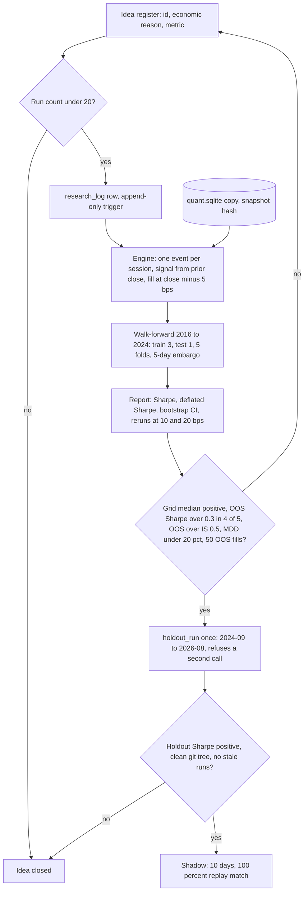

### 5. Leakage-free inputs and a sealed holdout

Prices on disk are raw. Total-return factors are rebuilt nightly, backward, ending at 1.0 today, and applied in two read-time views: `bars_1d_tr` for strategies and `bars_1d_split` for any rule that uses a price level. A ratio of two total-return prices is leakage-free because factors from actions after time t cancel, so the reference strategy's score is safe; a level is not, so a strategy that uses one must declare `series=split` in its register row. The truncation test enforces this rather than a policy: for 50 random dates it recomputes factors as of that date and fails the build if the strategy's output differs from the full-history run. The holdout is the last 24 months in a separate file opened by `holdout_run(idea_id)`, which writes a loud row and refuses the second call; the real holdout is the 60 paper days that have not happened yet. A late-arriving corporate action marks every run whose snapshot covers the ex-date `stale=true`, blocks graduation, and is rerun from the same register row so the count does not increase. The cost is a nightly factor rebuild and two views instead of one adjusted table.

### 6. One cost function and the break-even table

The cost model is one function shared by backtest and live: half the measured spread from a rolling 20-session table per symbol, plus 2 bps of timing slippage, plus SEC and FINRA fees on sells; 5 bps per side by default, and every result is rerun at 10 and 20 bps. Live fills record `assumed_px` and `fill_px`, so implementation shortfall is a subtraction, and the weekly report leads with realised against modeled cost.

| Cadence | Turnover assumption | T per year | Drag at 10 bps | Drag at 20 bps | Gross return to break even, with $60 fixed |
| --- | --- | --- | --- | --- | --- |
| Daily rebalance | 30 percent of book a day | 75 | 7.5 percent | 15 percent | 10.5 to 18 percent |
| Weekly rebalance | 50 percent of book a week | 26 | 2.6 percent | 5.2 percent | 5.6 to 8.2 percent |
| Monthly rebalance | 50 percent of book a month | 6 | 0.6 percent | 1.2 percent | 3.6 to 4.2 percent |
| Reference strategy, banded daily evaluation | about 5x NAV a year | 5 | 0.5 percent | 1.0 percent | 3.5 to 4.0 percent |

Read in dollars: daily rebalancing must earn $210 to $360 a year gross to hand $150 to $300 to the market; the reference strategy must earn about $70 to $80. The same universe and the same signal differ 12x in hurdle by cadence alone, which is why cadence is a design variable and not a strategy preference. The cost of a monthly cadence is statistical: 12 decisions a year, so the live record will never be the evidence.

### 7. The reference strategy, fully specified

| Field | `mom_top3` |
| --- | --- |
| Universe, risk sleeve | SPY, QQQ, IWM, EFA, EEM, TLT, IEF, GLD, DBC, VNQ; each over $100M daily volume and under 3 bps spread except DBC at about 5 |
| Universe, cash sleeve | BIL |
| Fixed | Before any return was looked at; changing it now is a parameter search |
| Input | `bars_1d_tr`, last 300 completed sessions through the prior close; needs 130 |
| Score | `close[t-1] / close[t-127] - 1`, six-month total return |
| Signal day | Last trading day of each calendar month, executed at 15:45 ET from bars through the prior close |
| Entry | Rank the 10 risk ETFs by score; take the top 3 whose score exceeds BIL's over the same window |
| Weight | 1/3 each; every unfilled slot goes to BIL, so weights sum to 1.0 |
| Exit | A held ETF not in the selected set at a signal day gets weight 0; no intra-month exit |
| Non-signal days | Return `held` unchanged; the portfolio layer's band handles drift |
| Free parameters | 2: lookback 126, top N 3; both literature conventions |
| Neighbourhood grid | lookback in {63, 126, 189, 252} x N in {2, 3, 4}, one declared run of 12 configs |
| Expected | 12 signal days, 15 to 25 orders, 150 to 250 percent turnover, 2 to 5 percent a year over 60/40 at 11 percent vol |
| Years to a t-statistic of 2 | about 16 at Sharpe 0.5 |
| Second candidate | RSI(2) mean reversion on SPY, 30 to 50 trades a year; valued because it tests the slippage assumption in one quarter |

### 8. Where it lands

- Register before run; append-only log; 3 parameters, 20 runs per idea, deflated Sharpe over cumulative configurations; the grid is one declared run.
- Raw prices, factors rebuilt nightly to 1.0 today, two views, a truncation test that fails the build on leakage; a sealed 24-month holdout read once.
- One cost function in backtest and live, 5 bps per side with reruns at 10 and 20; cadence chosen by the break-even table, which puts the reference strategy near the monthly line.
- Promotion out of research needs out-of-sample Sharpe above 0.3 in 4 of 5 folds, out-of-sample to in-sample above 0.5, survival at 10 bps, drawdown under 20 percent, 50 out-of-sample fills, a positive grid median and a positive holdout; the deflated Sharpe and bootstrap interval are printed, never gated.

## Deep dive: the platform and the human

### 1. The problem

One Mac mini on home broadband must run the day unattended, survive sleep, reboot, a power cut, a hung socket and the two Sundays a year when the clock jumps, and tell a phone within minutes when it cannot. One operator with a day job must be able to trust silence, stop everything from a phone, and move a strategy from paper to real money without being the person who decides the loss was variance.

### 2. The obvious approach

A long-running Python daemon under `KeepAlive` with a websocket for bars and a scheduler that sleeps until 15:45; secrets in a `.env` file; a Slack message on exceptions; the operator promotes a strategy when it looks ready and turns it off when it looks broken.

### 3. Why it breaks

A process that sleeps until 15:45 is guaranteed wrong on a machine that suspends, and a daemon needs its own stuck-loop detection, which is a second daemon. A `.env` file ends up in Time Machine, `ps eww`, crash reports and git. An exception alert says nothing when the box is dark, which is the failure that matters. And the operator is the person most motivated to call a loss variance and a win skill, so a promotion decided by feel drifts the goalposts every month.

### 4. A stateless tick and a runs table

`com.quant.tick` runs every 60 seconds under `trader` with `TZ=UTC` and absolute paths. Each tick opens the file, checks `halts`, loads the session calendar from a `sessions` table refreshed daily from the broker 60 days ahead, derives `trading_day` as data, reconciles, and executes whichever `runs(trading_day, step)` row is due and inside its deadline. Steps are idempotent and past-deadline steps are skipped with an alert: catch-up after sleep never places an order. There is no `StartCalendarInterval`, so the March hour that does not exist and the 23:30 ET row that lands on the wrong UTC date cannot happen; due times come from `open_utc` and `close_utc`, so half days need no code. Machine checks (disk over 10 GB free, clock within 2 seconds of the broker's, `pmset` still sleep 0, both agents still loaded) are steps in the tick. The `strategy` user's agent is the same shape with one job: write `intents/<date>.json` between 15:35 and 15:45 if it does not exist. The cost is a `runs` table and nine rows a day; the benefit is that every failure reduces to "the next tick reads the table".

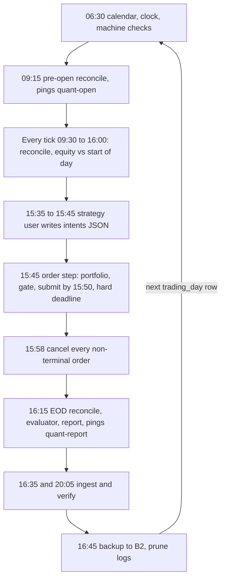

### 5. The dead-man's switch and alerts with verbs

The box cannot report its own death, so three absence checks on healthchecks.io do: `quant-open` on a 09:15 cron with 15 minutes of grace, so a page lands by 09:30 before any order could go out; `quant-tick` with a 60-second period and 5 minutes of grace all day, because launchd fires seconds to minutes late after coalescing and the alert budget is under one P1 a month; `quant-report` on a 16:30 cron with 15 minutes of grace. The ping is the last line of a successful tick, never a side thread, so a hung loop is a missed ping. Exchange holidays pause the two cron checks at 09:00. Alerts go to one random 24-character ntfy topic stored in the Keychain, `urgent` for P1, deduplicated per condition per day, and every alert is a sentence with a verb: "Reconcile break IEF $7.40, entries halted, ack at quant ack 4412." An alert that fires twice with no action is deleted. The cost is two free-tier dependencies and a rule the operator has to keep.

### 6. The runbook: one push, one page, one shell

The operator's job is one push by 16:30 with a one-line verdict, a five-minute checklist (equity, positions, rejects by rule, halt state, drawdown from the mark, `daytrade_count`), a Saturday half hour (the weekly report led by realised against modeled cost, the list of sub-$5 reconcile diffs, retired.md if judgment says so), and typed resumes. The phone dashboard is a stdlib `http.server` on 127.0.0.1:8000 published by `tailscale serve`, and it has two actions, Halt and Flatten, both downward. Resume exists only as `quant ack <id> --reason` at a shell over Tailscale SSH. The third control is the broker's own app, which works with the Mac unplugged: closing a position there produces a halt on the next reconcile, not a correction. Deploys are Saturday only; `deploy.sh` exits non-zero on weekdays between 09:25 and 16:05 and whenever orders are open, and requires a byte-identical replay of last week plus a green fault suite (crash after submit, position mismatch, stale bars). Five unacknowledged daily pushes set `HALT_ENTRIES` and hold the book, with the loss rules still armed. The cost is that nothing resumes without the operator typing a reason, which is the price of trusting silence.

### 7. Promotion gates, with numbers

Stage is a column on the strategy row and the size multiplier lives in one function. The gate for each stage is written to the row before the stage starts and cannot be edited while in it. The evaluator marks a gate passed; the operator presses one confirm button to move the row and can delay a promotion but never accelerate or skip one.

| Stage | Routes to | Duration | Gate to leave |
| --- | --- | --- | --- |
| Backtest | in-memory ledger | on demand | OOS Sharpe above 0.3 in 4 of 5 folds, OOS over IS above 0.5, survives 10 bps, MDD under 20 percent, 50 OOS fills, grid median positive, holdout positive, clean git tree, no stale runs |
| Shadow | log only, size 0 | 10 trading days | 100 percent replay match against the stored snapshot, runner done by 15:55 on 95 percent of days, 0 crashes |
| Paper | paper endpoint, size 1.0 | 60 trading days and at least 3 signal days | 100 percent signal match, 0 `UNKNOWN` residues, 0 unexplained reconcile breaks, no P&L gate; operator confirm |
| Canary | live endpoint, size 0.1 | 20 trading days and at least 2 signal days | Reject rate at most 2 percent, daily cap never hit; operator confirm |
| Live | live endpoint, size 1.0 | open-ended | Slippage over the first 30 live fills: median at most 5 bps against the model, p95 at most 20; breach demotes to canary and refits the cost model at the p75 of observed fills |

Paper is a plumbing test, not a cost test: Alpaca paper fills are optimistic and adding a fudge would hide the size of the gap the canary exists to measure. The 60-day paper stage exists because a monthly strategy needs three signal days to exercise the entry path three times; a fill-count gate would retire the reference strategy for trading too rarely.

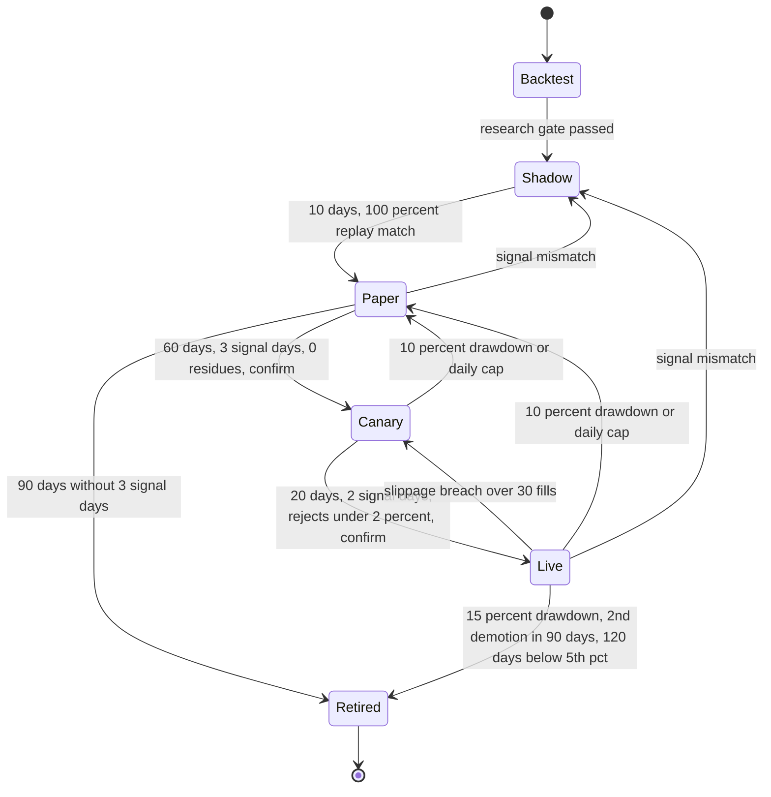

### 8. Retirement rules, split into safety and evidence

Rules are labelled on the row as one or the other so nobody mistakes a capital-protection trip for a verdict. Safety: 10 percent drawdown from peak on the strategy's allocation demotes to paper; 15 percent retires; a second demotion within 90 days retires. Evaluability: 90 paper days without 3 signal days retires. Evidence, exactly one rule: 120 live trading days of return below the 5th percentile of 1,000 bootstrapped paths from the strategy's own backtest retires it, a pre-registered 5 percent test that fires on bad luck one time in twenty. Slippage over 10 bps demotes live to canary; if the backtest no longer passes at the refit cost, retire. "Cannot explain a losing week" is a human right to retire, not a rule the evaluator runs. A retired strategy never returns without a fresh paper run. The cost is that a real edge with a bad first quarter can be retired; the register lets it be re-registered as a new idea with a fresh budget, which is the honest path.

### 9. Where it lands

- One 60-second launchd tick per user, `TZ=UTC`, a `runs` table with deadlines, reconcile every tick; no daemon, no calendar intervals, no catch-up orders.
- Three healthchecks.io absence checks paging by 09:30, within 6 minutes, and by 16:45; ntfy for the rest; every alert names an action.
- One push a day, Halt and Flatten from the phone, resume only by a typed reason at a shell, Saturday-only deploys with a byte-identical replay.
- Five stages with numeric gates on the row, automatic demotion and retirement, human confirm on the way up; safety rules and one evidence rule, labelled.

## Trade-offs

| Decision | Chosen | Alternative | Why |
| --- | --- | --- | --- |
| Timeframe | Daily bars only, one decision at 15:45 ET | Intraday on minute bars | Good-faith violations in cash, PDT in margin, and 10.5 to 18 percent gross to break even at daily turnover before either rule counts |
| Decision window | 15:45 on bars through the prior close, fill at the close | 18:00 signal, fill at the next open | The overnight gap on SPY is about 0.7 percent, ten times the round-trip cost; the 15-minute gap is not; proceeds settle for tomorrow |
| Account | Cash, long only, cash semantics in software too | Margin with a PDT counter | $2,000 is the margin floor, a $60 drawdown flips it off, and in margin the protective exit can be the illegal leg |
| Stops | None broker-side; daily exit, 60-second equity check, dead-man page, phone Flatten | Bracket stop on every entry | DAY legs die at 16:00, GTC is banned, whole shares break a $400 slot; a 5 percent gap on a 0.40 position is 2 percent of NAV |
| Gate location | Separate process and macOS user holding the keys | In-process layer | One person edits the strategy weekly with no reviewer; a permission beats a convention; cost is an hour once |
| Halt | Entries only, sticky, typed resume; flatten only by operator or the 10 percent budget | Auto-flatten on faults, auto re-arm on the daily cap | Flattening on an ISP flap pays spread for no information; one resume path for every halt means no auto-resume code |
| Store | One SQLite file, WAL, `synchronous=FULL`; DuckDB reads it for research | Parquet for bars plus a SQLite meta file | Minute history was cut to 45 MB; one file is the whole backup and the whole restore |
| Process shape | 60-second launchd tick and a `runs` table | Long-running daemon, or two fires a day | Sleep, reboot, crash and DST reduce to the next tick; two fires leave nothing checking the daily limit during the day |
| Research | Laptop, on a copy of the file; artefacts committed to git | On the Mac mini | The box keeps one venv and no notebooks; the engine needs 0.8 s per backtest; git is the research record's off-site copy |
| Paper and live | Parallel, one process, stage as a column, at most 4 rows | Sequential, or a second file and topic | The router is one multiplier function; reconcile sums virtual books per instrument |
| Idle cash | No platform sweep; BIL is a strategy weight | Sweep the reserve into SGOV | The strategy already parks unselected slots in BIL; a sweep puts a sell in front of every buy against the settled-cash rule for $4 a year |
| Paper gate | 60 days and 3 signal days, slippage judged over the first 30 live fills | 30 days and 20 fills, 90-day cap | 20 fills is a year for a monthly strategy; paper fills are optimistic anyway, so cost is a canary and live measurement |

## Pitfalls

- Retrying a timed-out submit without a lookup. The first POST may have succeeded; the client order id and the `UNKNOWN` state exist so the only retry is a lookup.
- Overwriting the ledger from the broker and moving on. Log every delta, halt above $5 per instrument, and send nothing while quantities are untrusted; an auto-corrected phantom is a bug with its evidence deleted.
- Letting the strategy see today's partial bar, or adjusted price levels. The signal reads completed sessions through the prior close and total-return ratios; the truncation test fails the build on anything else.
- Counting variants in a notebook. The register counts them, and the deflated Sharpe is computed over every configuration ever tried for the idea, not the ones the operator remembers.
- Treating a one-year live Sharpe as evidence. Its standard error is 1.0; the live stages confirm signal match, slippage, turnover and vol, which converge in days to months, and the report says so in a fixed footnote.
- `StartCalendarInterval` and `datetime.now()` without a zone. The March hour that does not exist and the 23:30 ET row on the wrong UTC date both cost a trading day; the tick, `TZ=UTC` and `trading_day` as data remove them.
- A flatten on a timer, a heartbeat or an unacknowledged week. A holiday becomes a forced exit; positions are protected by the loss rules, not by a clock.
- Raising a limit on a losing evening. Limits are rows with reasons, and the morning report prints every change.
- FileVault with unattended reboot, or a `.env` file. The first is an outage until someone types a password; the second is a key in Time Machine and `ps`.
- Any market-hours deploy, or a strategy edit that keeps the incumbent's clock. Saturday only, and a `core/` change is a new row at shadow.

## Design panel notes

Twenty engineers designed this independently through one lens each; four leads reconciled five each; the chair settled the cross-area conflicts. The full record, including every engineer's design, is in `docs/sessions/mini-quant/`. What they disagreed on and what won:

- **When to trade.** Engineer 12 and lead A put the signal at 18:00 and the order at 09:31 the next session; engineers 02, 05 and lead D ran once at 15:45; lead C drew a 09:45 window. The chair chose 15:45 on bars through the prior close with the backtest filling at the close, because the overnight gap is ten times the round-trip cost and the strategy still never sees a partial bar.
- **Margin or cash.** Engineer 02 wanted margin with a day-trade counter and 12 wanted margin so a sell never blocks a buy; 04, 06 and 07 wanted cash; 05 said run cash semantics in software either way. Cash won on 06's point that in margin the protective exit can be the illegal leg; 02's counter survives as a bug detector.
- **Broker-side stops.** Engineer 04 made a bracket stop on every entry a non-negotiable; 05's fractional orders and 02's ban on GTC made it impossible; lead B overruled and asked the chair to confirm. Confirmed, with the arithmetic recorded so the first bad gap does not reopen it.
- **Where the gate lives.** Engineer 04 wanted two processes under two macOS users; 02 and 17 had one process; lead C asked whether it must pay the setup cost. Two users won: on a box with one unreviewed editor, the boundary must be a permission.
- **What a halt does.** Engineers 04 and 08 flattened on hard faults; 02, 09, 10, 15, 16 and 20 never auto-flattened; 06 insisted exits are never gated. The chair kept entries-only halts, cancelled open orders, and made the reconcile break the one case that sends nothing; flatten belongs to the operator and the 10 percent budget.
- **The daily loss cap.** Engineer 04 and lead D wanted 2 percent; 05, 07 and lead B wanted 3; lead B wanted automatic re-arm and lead D a typed resume. 3 percent with a typed resume: 2 percent fires on the ordinary range of a long ETF book, and one resume path for every halt means no auto-resume code.
- **Parquet or SQLite.** Engineers 01 and 03 and lead A wanted Parquet with atomic partition replace and DuckDB; 14, 16 and lead C wanted one SQLite file. SQLite won after the panel itself cut minute history to 45 MB; 01's idempotency became a windowed rewrite in one transaction.
- **Daemon, tick or two fires.** Engineers 08, 09, 10 and 15 wanted a long-running process; 16 a 60-second tick with a `runs` table; 17 and lead D one script fired at 15:45 and 16:15. The tick won because every failure reduces to the next tick reading the table and because something must check the daily limit during the day.
- **Five unacknowledged days.** Engineer 20 asked hold or flatten; lead D said hold with the loss rules armed. Hold won; a timer flatten turns a holiday week into a forced exit.
- **The reconcile threshold.** Engineers 17 and 19 halted at $0.01 on totals; 20 at $5 or one share per instrument. $5 per instrument won, owned by lead B, because sub-dollar diffs from dividends and rounding would train the operator to resume without reading.
- **Paper gate.** Engineer 11 wanted 30 days and 20 fills with a 90-day cap; 19 supplied the sample arithmetic; lead A wanted 60 days spanning 3 signal days. The chair took 60 days and 3 signal days and moved the fill-count slippage test to the first 30 live fills, because 20 paper fills is a year for the reference strategy and paper fills are optimistic anyway.
- **Backtest bar.** Lead D wanted deflated out-of-sample Sharpe at least 0.8 and up to 5 parameters; lead A computed a noise ceiling of 0.87 at 20 variants over 8 years and set out-of-sample Sharpe above 0.3 in 4 of 5 folds with 3 parameters. A's bar won; the deflated Sharpe and bootstrap interval are printed on every report and are not gates.
- **Idle cash.** Engineer 07 asked whether $80 a year in SGOV or BIL was worth taking. No sweep: the reference strategy already holds BIL by weight, and the $100 reserve stays cash because a sweep would put a sell in front of every buy.
- **Research location.** Engineer 15 and lead C wanted it off the box; lead A needed the always-on data and an off-site copy of the research log. The laptop won, on a copy of the file over Tailscale, with promotion artefacts committed to git as the off-site record.
- **Panel structure.** 20 engineers, one lens each; 4 area leads (data and research, execution and risk, platform, operations and evaluation) reconciling five each; 1 chair settling 14 cross-area decisions. Engineer designs, lead reviews and the chair's record live in `docs/sessions/mini-quant/`.
