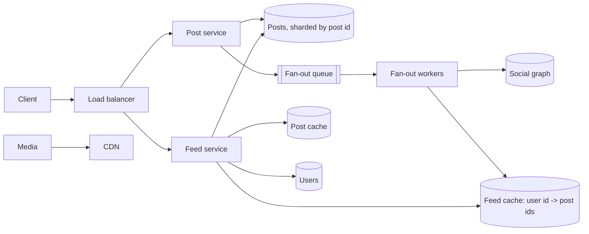
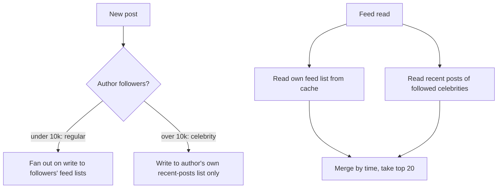
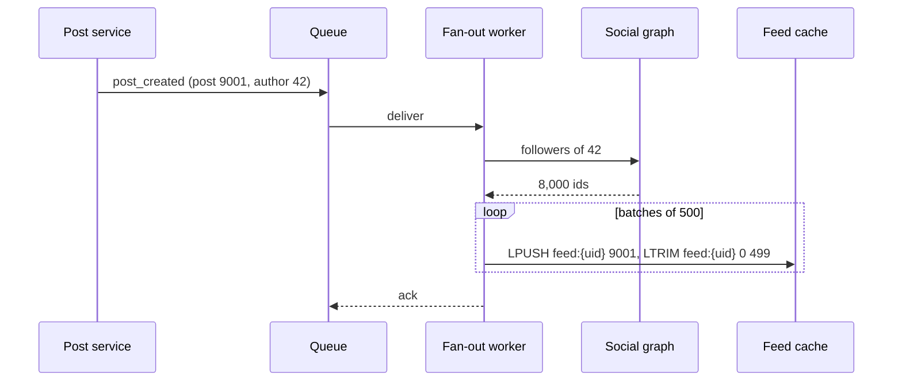

## Requirements

**Functional**

- Publish a post: text, optional media.
- Follow users; a feed is the posts of everyone you follow, newest first.
- Open the app and see the feed; scroll to page back in time.

**Non-functional**

- Feed load under 200 ms at p99. The feed is the app's home screen.
- A new post should appear in followers' feeds within seconds, not minutes.
- 300M daily active users, ~2 opens per user per day, and a small number of users with over 10M followers.
- Eventual consistency is fine: seeing a post a few seconds late is invisible; seeing an empty feed is not.

## Estimates

| Quantity | Value | How |
| --- | --- | --- |
| Feed loads / s | ~7,000 avg, ~35,000 peak | 300M × 2 ÷ 86,400, peak ×5 |
| Posts / day | 30M | 10% of DAU post once |
| Posts / s | ~350 | 30M ÷ 86,400 |
| Average followers | 200 | given |
| Feed insertions / s | ~70,000 | 350 × 200, if every post fans out |
| Feed cache per user | ~4 KB | 500 post IDs × 8 bytes |
| Feed cache total | ~1.2 TB | 300M × 4 KB |

Reads outnumber writes 20 to 1 at the post level, and 20,000 to 1 at the feed level. The design spends write-time work to make reads a single cache lookup.

## High-level design

**Publish.** The post service writes the post, puts the media on the CDN, and publishes `post_created` to the queue. Fan-out workers read the author's follower list and push the post ID onto each follower's feed list in the cache.

**Read.** The feed service reads the user's feed list from cache, which is a list of post IDs, hydrates the first 20 from the post cache, attaches author details, and returns. Steady state: two cache lookups, no database.

## Deep dive: fan-out

### Fan-out on write

When a post is created, push it into every follower's feed. Reads are trivial. Writes cost one insertion per follower, and a user with 20M followers turns one post into 20M cache writes that take minutes to finish. Inactive users get feeds computed that they never open.

### Fan-out on read

Store nothing per feed. On open, fetch the recent posts of every followed user, merge, and sort. Writes are free. Reads are 200 queries and a merge, on the hot path, at 35,000 per second.

### Hybrid

- Regular users fan out on write. Their follower counts are small, so the work is bounded and reads stay a single lookup.
- Celebrities do not fan out. Each follower's feed read merges in the celebrity's latest posts at read time. A user follows a handful of celebrities, so that is a handful of extra cache reads, not 200.
- Inactive users, say not opened in 30 days, are skipped during fan-out. Their next open falls back to fan-out on read to rebuild the list, then they are active again.

This is the answer X and Meta converged on, and it is the one to draw.

### Fan-out workers

Each follower's feed is a capped list of the newest 500 post IDs. Insertion is a push and a trim, pipelined in batches. Workers are idempotent: pushing the same ID twice is caught by checking the head of the list, or tolerated and deduped at read.

## Deep dive: the read path

1. `LRANGE feed:{uid} 0 19` from the feed cache. If empty, either the user is new or inactive: build the feed on read from the followed users' recent posts and cache it.
2. Fetch the celebrity lists for the handful of celebrities the user follows and merge by timestamp.
3. `MGET` the 20 post IDs from the post cache; misses go to the posts database in one batched query.
4. `MGET` the authors from the user cache.
5. Apply ranking if there is any, then return with a cursor, which is the timestamp and ID of the last post shown.

Paging is by cursor, never by offset: new posts arriving between pages shift offsets and repeat items.

## Data model

Posts are sharded by `post_id`, which embeds a timestamp, so the newest posts spread across shards rather than piling onto one. The social graph is stored twice: `following(user_id, followee_id)` sharded by follower for "who do I follow", and `followers(user_id, follower_id)` sharded by followee for fan-out. Both are written together through an outbox so they cannot drift.

## Ranking

Reverse-chronological is the requirement here. If ranking comes up: the feed list becomes a candidate set, a scoring service takes the top few hundred candidates plus features about the viewer, and the read path gains one call. The fan-out design does not change; only the merge step does.

## Trade-offs

- **Hybrid fan-out** costs two code paths and a celebrity threshold to tune. It buys bounded write amplification and a single-lookup read for almost everyone.
- **Capped feed lists** at 500 mean scrolling past 500 posts falls back to a database query. Nobody does.
- **Eventual consistency**: a post appears in feeds seconds after publish. The author sees it immediately because their own client inserts it locally.
- **Skipping inactive users** makes their first open slower and saves the majority of fan-out work. Most users are inactive on any given day.

## Pitfalls

- Pure fan-out on write and then a celebrity signs up.
- Pure fan-out on read and then the read path is 200 queries at 35,000 per second.
- Offset pagination on a list that changes under the reader.
- Storing full posts in the feed cache instead of IDs, so every edit and delete has to touch millions of lists.
- Forgetting deletes: a deleted post's ID stays in feed lists, so the hydration step has to drop misses silently.
