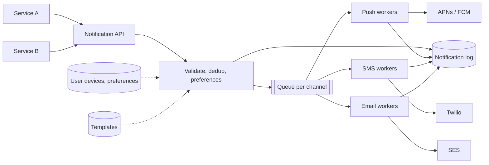
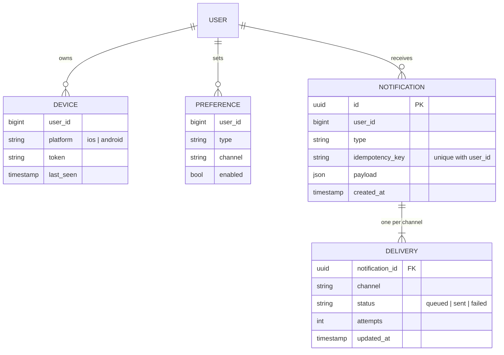
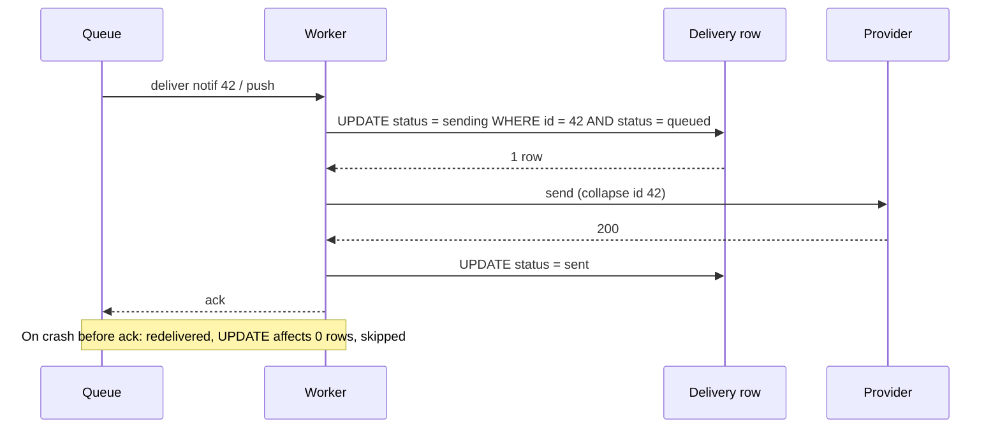

## Requirements

**Functional**

- Internal services submit a notification for a user: a type, a payload, and optional scheduling.
- Deliver via iOS push, Android push, SMS and email, based on the user's devices and preferences.
- Users can opt out per type and per channel.
- Templates render the payload into channel-specific text.

**Non-functional**

- Soft real-time: most notifications land within seconds, none are lost.
- At-least-once delivery to the provider, with dedup so a user never sees the same one twice.
- Tens of millions of notifications a day, with spikes when a service fans out to everyone.
- Third-party providers are slow and flaky, and that must not back up into the callers.

## Estimates

| Quantity | Value | How |
| --- | --- | --- |
| Notifications / day | 50M | given |
| Average / s | ~600 | 50M ÷ 86,400 |
| Peak / s | ~20,000 | a campaign to 10M users over 10 minutes |
| Provider latency | 100 to 500 ms | APNs, FCM, Twilio, SES |
| Provider calls in flight at peak | ~10,000 | 20,000 × 0.5 s |

The gap between average and peak is the design. Callers submit at 20,000 per second for ten minutes; providers take what they take. Something has to hold the difference, and that is a queue.

## High-level design

**Submit.** The API validates the request, looks up the user's devices and preferences, drops channels the user has opted out of, renders the template, writes one row per channel to the log with status `queued`, and publishes one message per channel. It returns `202 Accepted` with the notification ID. Total time: a few milliseconds and two writes.

**Deliver.** Workers per channel pull messages, call the provider, and update the log row to `sent` or `failed`. Workers scale on queue depth, independently per channel, because a Twilio slowdown should not stall push.

## Data model

Shard the notification and delivery tables by `user_id`. Every query is "what did this user get", so the shard key is in every query, and one user's history stays on one shard.

## Deep dive: exactly-once to the user

The provider call is at-least-once: a worker can send, crash before updating the row, and the message is redelivered. Three layers keep that from reaching the user twice.

1. **Idempotency key at submission.** The caller sends `(user_id, idempotency_key)`, typically `order-1234-shipped`. A unique index rejects the second submission, and the API returns the original ID. A retrying caller cannot create two notifications.
2. **Delivery row is the lock.** Before calling the provider, the worker updates `status = sending WHERE status = queued`. Zero rows updated means another worker has it; ack and move on.
3. **Provider dedup where available.** APNs accepts `apns-collapse-id`; FCM has `collapse_key`. Sending the same ID twice replaces the first notification on the device instead of stacking it.

The window that remains is a crash between the provider's 200 and the `sent` update. The row stays `sending`; a sweeper re-queues `sending` rows older than a minute, and the collapse ID makes the resend harmless.

## Retries and failure

- Provider errors split into **retryable** (429, 5xx, timeout) and **terminal** (invalid token, unsubscribed number). Retryable ones go back on the queue with exponential backoff, up to a limit; terminal ones mark the delivery `failed` and, for invalid tokens, delete the device.
- After the retry limit, the message lands in a **dead-letter queue** with the last error attached. An alert fires on DLQ depth.
- Each provider gets a **circuit breaker**. When error rate spikes, workers pause that channel for a minute rather than burning retries into an outage.

## Rate limiting and batching

- Per-user caps such as "no more than 5 marketing pushes a day" are enforced at submission, in the validation step, against a counter in Redis.
- Providers accept batches: FCM takes 500 tokens per call, SES 50 recipients. Workers pull a batch from the queue and issue one provider call, which is how 10,000 in-flight calls become a few hundred.

## Preferences and quiet hours

Preferences are read at submission, not at delivery, so the queue holds only what the user wants. A "quiet hours" setting turns into a scheduled delivery: the message is published with a delay, or written with a `deliver_at` and picked up by a scheduler that scans for due rows.

## Trade-offs

- **202 and a queue** buys callers a few milliseconds of latency and total isolation from provider health; it costs an eventual status the caller has to poll or subscribe to.
- **Per-channel queues** let one slow provider stall only itself, at the price of more queues to operate.
- **Rendering at submission** freezes the content, so a template fix does not apply to queued messages. Rendering at delivery would apply it, but means a change in the user's locale or name races with delivery. Submission is the safer choice.
- **Preferences at submission** means an opt-out that lands while a message is queued does not stop it. A check at delivery closes that gap, at the cost of a lookup per send. Add it if the interviewer asks about compliance.

## Pitfalls

- Calling providers synchronously from the API. One slow provider and every caller's p99 is the provider's p99.
- No idempotency key, so every caller retry is a duplicate notification.
- One queue for all channels, so an SMS outage delays password-reset emails.
- Keeping invalid device tokens. Providers rate-limit senders who keep hitting dead tokens.
