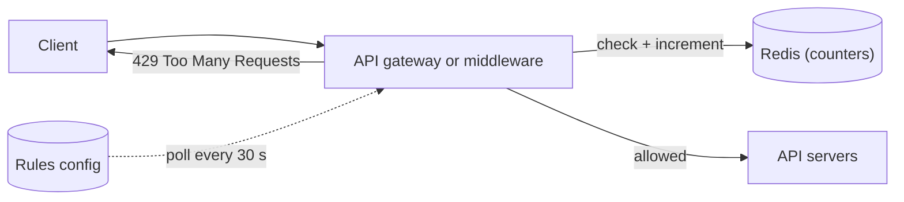
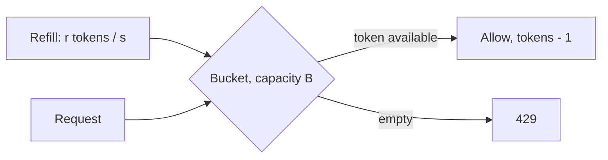
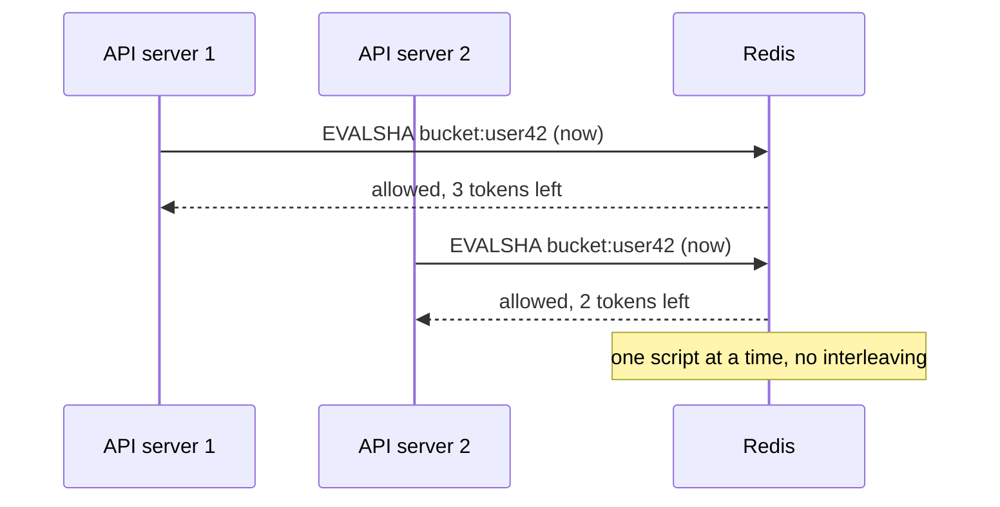

## Requirements

**Functional**

- Limit requests per client, where a client is an API key, a user ID, or an IP.
- Rules such as "100 requests per minute per user" and "10 login attempts per hour per IP", several active at once.
- A limited request gets a 429 with headers saying when to retry.

**Non-functional**

- Adds well under 1 ms to a request. The limiter runs on every call.
- Accurate across all API servers: a client cannot get N× the limit by spreading calls across N servers.
- Fails open. If the limiter's store is down, requests go through. Losing the whole API to protect it from overload is the wrong trade.

## Where it runs



The limiter is middleware in the gateway, or in each API server if there is no gateway. Either way the counters have to live in a shared store, since any server may see any request. Rules are loaded from config and cached in memory; they change rarely.

## Algorithms

### Token bucket

Each client has a bucket of capacity `B` that refills at `r` tokens per second. A request takes one token; an empty bucket means 429.



Allows bursts up to `B` while holding the long-run rate to `r`. Two numbers per client, both tunable, and the state is two fields: tokens and last refill time. This is what most production limiters use.

### Fixed window

Count requests in each calendar minute. Cheap, and wrong at the boundary: 100 requests at 12:00:59 and 100 more at 12:01:00 is 200 in two seconds against a limit of 100 per minute.

### Sliding window log

Keep a timestamp per request, count those inside the last 60 s. Exact, and the memory is proportional to the limit times the number of clients. Fine for low limits like login attempts, wasteful at 10,000 per minute.

### Sliding window counter

Weight the previous fixed window by how much of it still overlaps the sliding window: `count = current + previous × (overlap fraction)`. Two counters per client, approximately right, and it removes the boundary spike. A good default when the interviewer wants something simpler than a token bucket.

| Algorithm | State per client | Bursts | Accuracy |
| --- | --- | --- | --- |
| Token bucket | 2 numbers | Allowed up to B | Exact on average rate |
| Fixed window | 1 number | Up to 2× at boundary | Poor at edges |
| Sliding log | One entry per request | None | Exact |
| Sliding counter | 2 numbers | Smoothed | Approximate, close |

## Deep dive: the distributed counter

The check-then-increment has to be atomic, or two servers both read 99, both allow, and the client gets 101. A Redis `INCR` is atomic, but a token bucket needs read, compute, write. The answer is a Lua script, which Redis runs atomically.

```lua
-- KEYS[1] = bucket key; ARGV = capacity, refill_rate, now_ms, cost
local tokens = tonumber(redis.call('HGET', KEYS[1], 'tokens') or ARGV[1])
local last   = tonumber(redis.call('HGET', KEYS[1], 'ts') or ARGV[3])
local elapsed = math.max(0, ARGV[3] - last) / 1000
tokens = math.min(ARGV[1], tokens + elapsed * ARGV[2])
local allowed = tokens >= tonumber(ARGV[4])
if allowed then tokens = tokens - ARGV[4] end
redis.call('HSET', KEYS[1], 'tokens', tokens, 'ts', ARGV[3])
redis.call('PEXPIRE', KEYS[1], math.ceil(ARGV[1] / ARGV[2] * 1000) * 2)
return { allowed and 1 or 0, tokens }
```



Every key carries a TTL of a couple of bucket-refill periods, so idle clients cost nothing.

### Latency

One Redis round trip in the same availability zone is 0.2 to 0.5 ms. To go lower, or to survive Redis being slow, each server keeps a small local cache of recent verdicts and only consults Redis every few requests for a client, accepting slight over-admission. Stripe does a version of this.

### Failure

Redis unreachable means the script call times out after a few milliseconds and the middleware **allows** the request, logs it, and bumps a metric. Fail open, alarm loudly.

### Scale

Counter keys are small and independent. A Redis cluster with hash-slot sharding by client key spreads them evenly. There is no cross-key operation, so scaling is linear.

## Response

```http
HTTP/1.1 429 Too Many Requests
Retry-After: 12
RateLimit-Limit: 100
RateLimit-Remaining: 0
RateLimit-Reset: 12
```

Send the same `RateLimit-*` headers on allowed responses too, so well-behaved clients can back off before they are cut off.

## Rules and identity

- Identify the client in this order: API key, then authenticated user, then IP. IPs are last because NAT puts thousands of users behind one.
- Several rules can apply to one request. Evaluate all, deny if any denies, and report the tightest remaining budget.
- Hot-reload rules from config with a 30 s poll. A rule change should not need a deploy.

## Trade-offs

- **Token bucket** costs a Lua script and buys bursts plus exact average rate. A sliding counter is the fallback when Lua is unavailable.
- **Fail open** risks a burst during a Redis outage in exchange for never taking the API down with the limiter.
- **Local verdict cache** trades a little over-admission for sub-millisecond checks and resilience.
- **Centralised counters** are the only way to be accurate across servers; per-server limits are simpler and wrong by a factor of N.

## Pitfalls

- Read, compute, then write from the application: a race that over-admits under load, which is exactly when the limiter matters.
- Fixed windows and a client who learned where the boundary is.
- Limiting by IP alone and cutting off a whole office or a whole mobile carrier.
- Failing closed, so the limiter's outage becomes the product's outage.
