## Requirements

**Functional**

- Play: resolve a track to audio at the right bitrate, start fast, seek anywhere, gapless into the next track, resume on another device.
- Search and browse: typeahead and full search over tracks, albums, artists and playlists, filtered by the user's market.
- Playlists and library: create, reorder, follow, and edit a playlist collaboratively from several devices; save tracks and sync across devices.
- Offline: Premium users download tracks; playback works with no network; downloads stop working if the subscription lapses.
- Recommendations: Home shelves, radio and autoplay, and weekly batch playlists such as Discover Weekly.
- Royalties: count each play of 30 seconds or more of audio, per recording, market and subscription tier, exactly once, and produce auditable monthly statements.
- Out of scope: podcasts, ads serving, lyrics, the recommendation models themselves.

**Non-functional**

- Tap to first audio under 200 ms at p50 and under 600 ms at p99 on a warm mobile client. This is the number the product lives on.
- Playback available 99.99%. Search, recommendations and social may all be down and a play must still start; the catalog is playback's only hard dependency.
- 600M monthly users, 250M daily, 30M concurrent streams at peak, 100M tracks, 180 markets.
- Catalog and search eventually consistent within minutes. A user's own playlist edits read-your-writes on the device that made them.
- Royalty counts exactly once at monthly close. A week of delay is fine; a 0.1% overcount is real money paid to the wrong party.
- Audio encrypted at rest on device and on the CDN, keys bound to an entitled user and device. No plaintext audio anywhere a user can copy it.

## Estimates

| Quantity | Value | How |
| --- | --- | --- |
| DAU / peak concurrent streams | 250M / 30M | 12% of DAU listening at the same moment in the evening peak |
| Plays / day | 5B | 250M × 20 tracks (about 70 minutes of listening) |
| Play starts / s | 60k avg, 150k peak | 5B ÷ 86,400, peak ×2.5 |
| Peak egress | 4.8 Tbps | 30M × 160 kbps average delivered bitrate |
| Egress / day | 21 PB | 5B × 4.2 MB (3.5 min at 160 kbps) |
| Delivery cost per stream | ~$0.00002 | About $0.005/GB blended; royalty per stream is ~$0.004, 200× more |
| Catalog audio | 3 PB | 100M × (Vorbis 96/160/320 + AAC 128/256) ≈ 25 MB; FLAC and masters in cold storage |
| Hot set, top 1M tracks | 25 TB | 80% of plays; fits on one edge PoP's SSDs |
| Catalog metadata | 300 GB | 100M × 2 KB plus albums, artists, credits; fits in RAM per region |
| Playlist rows | 200B, ~8 TB | 4B playlists × 50 entries × 40 B |
| Play events / day | 50B, ~25 TB raw | 10 per play: start, heartbeat every 30 s, seek, end; 500 B each |
| Event ingest / s | 600k avg, 1.5M peak | 50B ÷ 86,400, peak ×2.5 |
| Search QPS | 50k typeahead, 10k full | 250M × 4 searches × 10 keystrokes; peak ×3 |

Three conclusions shape the design. The hot set is tiny, so audio delivery is a cache problem, not a bandwidth problem. Delivery cost is a rounding error next to royalties, so the CDN is tuned for hit ratio and latency rather than cents. And the event pipeline is large but only one subset of it, qualified plays, has to be correct.

## High-level design

### Step 1: The simplest thing that works

There is no previous step, so the problem is the product itself: play any of 100M tracks on a phone and let the user browse what exists. One API in front of one catalog database, and the audio as label-delivered files in an object store; the API looks up the track and returns a file URL, the client downloads the file and plays it. Each later step names what this one could not do and adds the smallest thing that fixes it; nodes added in a step are outlined in gold, and ids and labels stay fixed so the diagram grows rather than changes.

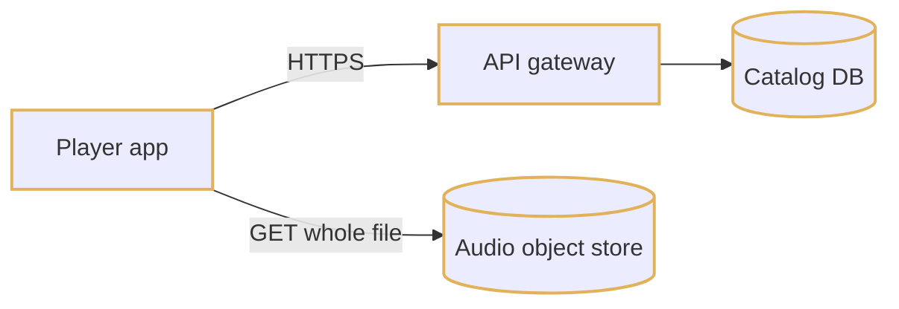

1. Client taps a track and calls `GET /tracks/{id}`.
2. The API reads the catalog row and returns a signed URL for the audio file.
3. The client downloads the file from the object store and starts decoding once enough bytes have arrived; seek means downloading again from a guessed offset, or from the start.

At scale this fails four ways. Every tap is a database read plus a fetch from one of three object-store regions, 100 ms or more away on cellular, so tap-to-audio is 400 ms on a good day against a 200 ms budget. 4.8 Tbps of peak egress leaves the object store directly. The files are plaintext, so anyone with a URL has the master. Nothing checks who is entitled to what.

### Step 2: Put audio behind a CDN

Step 1 fetches every byte from a distant origin, and the tap path has a resolve round trip plus a connection setup in front of the first byte; that is where the 200 ms is lost. So: transcode every track at ingest into one whole encrypted file per rendition (Vorbis 96/160/320, AAC 128/256; AES-128-CTR under a per-track key; stored under the SHA-256 of its ciphertext) and serve it from an edge PoP by HTTP byte range. The hot set of 1M tracks is 25 TB and 80% of plays, so it fits in every PoP. The API returns a manifest per track (file ids, CDN base URLs, a byte offset per second of audio); the client asks for manifests when the queue changes, not when the user taps, and prefetches the first 15 seconds of the next three tracks.

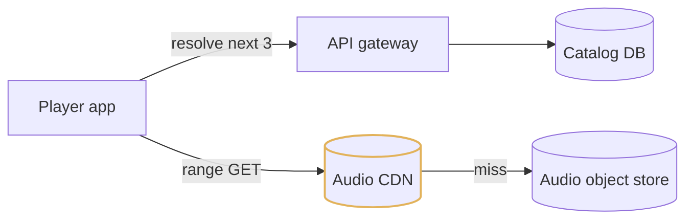

1. The queue changes; the client calls resolve for the next three tracks.
2. The API reads file ids and the byte index from the catalog and returns the manifests.
3. The client range-GETs the first 256 KB of each track from the nearest PoP over a persistent QUIC connection.
4. On tap the head is already local, decoding starts, and the rest streams by range request; seek to 1:23 is one range request computed from the byte index, since CTR mode decrypts any range independently.

### Step 3: Separate catalog reads from writes

Step 2 sends 150k resolves per second, plus every browse, to one database in one region that also has to run rights transactions, and nothing checks tier, market or device before handing out bytes. Keep the catalog in a single-writer relational store, because a label pulling a release or a rights change across 30 territories is a multi-row transaction, with a read replica per region, and put a Redis track view in front: one denormalised record per track (names, artwork, rendition file ids, duration, gain, availability as a bitmap over 250 markets), invalidated from the catalog's change stream. A playback service owns resolve: it checks entitlement against the track view, wraps the content key for the device, signs the CDN token, and builds the manifest.

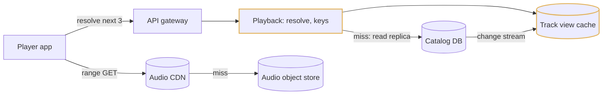

1. Client calls `POST /playback/resolve` for the next three queue items; the gateway routes it to the playback service.
2. Playback reads the track view at a 99%+ hit ratio and falls through to the regional read replica on a miss.
3. It checks the user's market bit and tier against the availability bitmap in constant time, wraps the track key for this device, signs a CDN token, and returns the manifest.
4. A label edit commits on the writer, replicates in seconds, and the change stream invalidates the track view.

### Step 4: Playlists, library and offline

Step 3 plays a track whose id the user already has, but stores nothing the user owns: no playlists, no saved library, no downloads, and no way to edit one playlist from two phones at once. Add a playlists and library service on a wide-column user data store partitioned by playlist id or user id and homed in the user's region, with async replication to one DR region. A playlist is an append-only log of operations over item uids that the server sequences, with a materialised snapshot alongside; the client keeps its own copy, and a WebSocket carries the rare control messages (playlist changed, pause the older device). Offline is the same encrypted CDN file written to app storage with a device-wrapped key that expires in 30 days.

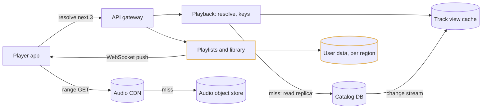

1. Client sends `POST /playlists/{id}/ops` with its last-seen revision and a list of operations.
2. The service rebases the ops against anything it missed, appends them to the log, bumps the revision, and returns the new revision plus the ops the client had not seen.
3. Collaborators with the playlist open get the ops pushed over the WebSocket; everyone else syncs on foreground.
4. A download is a resolve with an offline flag: same file, 30-day wrapped key, counted against 10,000 tracks per device and 5 devices per account on the server.

### Step 5: The play-event pipeline

Step 4 plays music and nobody gets paid. Royalties are the largest cost line in the business, and every play of 30 seconds or more has to be counted exactly once from a client that crashes, retries, and stays offline for a week. The client appends events to a durable SQLite buffer and uploads batches of up to 100 every 30 seconds, or on next launch; the gateway validates, stamps receipt time and writes to Kafka keyed by user id. Stream jobs dedup on `(play_id, seq)`, sessionize per play, apply the 30-second rule and entitlement as of the event time, and upsert one row per qualified play into a ledger whose primary key is the play id. Raw events also land in a data lake, for a daily recount on a separate code path and for training. Nothing on this path is user-facing; it is built for durability and correctness, not latency.

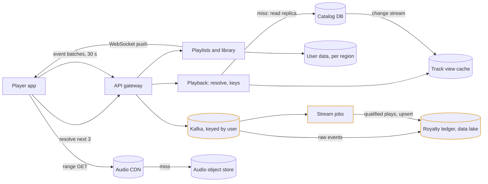

1. The client emits start, a heartbeat every 30 s of audio, seek, end; each event carries `play_id` and `seq`.
2. The gateway validates the batch, stamps `received_ts`, and writes to the Kafka cluster in its region.
3. Flink dedups, sums audio milliseconds per play, and emits one `qualified_play` when a play crosses 30 s; the ledger upserts on `play_id`, so a device replay, a gateway retry or a Flink failover all store one row.
4. A daily batch recount from the lake diffs against the ledger; monthly close is blocked while any label differs by more than 0.01%.

### Step 6: Search, recommendations and social

Step 5 counts plays, but the user still has to arrive with a track id; nobody does, they type into search, open Home, or look at what a friend is playing. Search is two structures fed from the catalog change stream: a finite-state transducer over the top 20M names for typeahead, and an Elasticsearch index for full queries, both carrying the market bitmap as a filter field. Recommendation serving reads precomputed shelves and an HNSW index over embeddings trained weekly from the lake, then reranks with the last hour of context from an online feature store that the stream jobs keep fresh. Presence is a Redis key per user written at play start and read by a 30-second poll. Every one of these can be down and a play still starts: the catalog path from step 3 is playback's only hard dependency.

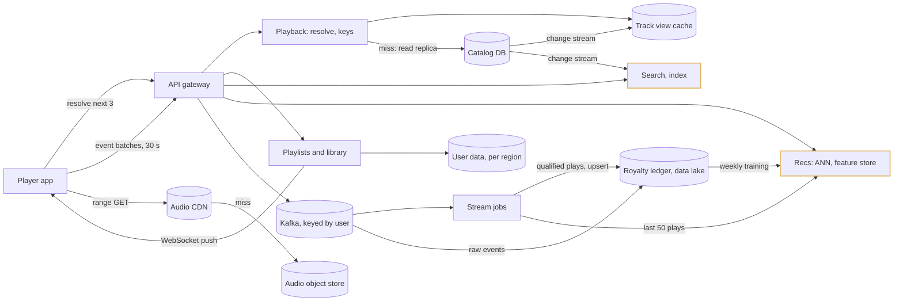

1. Keystroke: the search service merges the user's recents from Redis with the global FST and answers in under 20 ms.
2. Enter: BM25 with the market filter returns 500 candidates; a GBDT rescores them with the user's affinities; top 50 in under 150 ms.
3. Home: serving reads Sunday's shelves, adds real-time shelves from Redis, reranks with the last hour of context. Nothing computes a recommendation from scratch on the request path.
4. Play start writes `user_id -> (track, context, ts)` to presence; a Friend Activity sidebar is one `MGET` of 20 keys every 30 s.

### Step 7: The final picture

The same fourteen components grouped by where they run. The client is a component, not a thin UI: it holds a local audio cache, an encrypted offline store, a durable event buffer, prefetched manifests for the next tracks in the queue, and a copy of the user's library and playlists, and most of the latency and correctness story is in the client-server contract. Label ingest (DDEX feed, transcode, encrypt, catalog commit) is a batch pipeline behind the object store and catalog, drawn in the first deep dive.

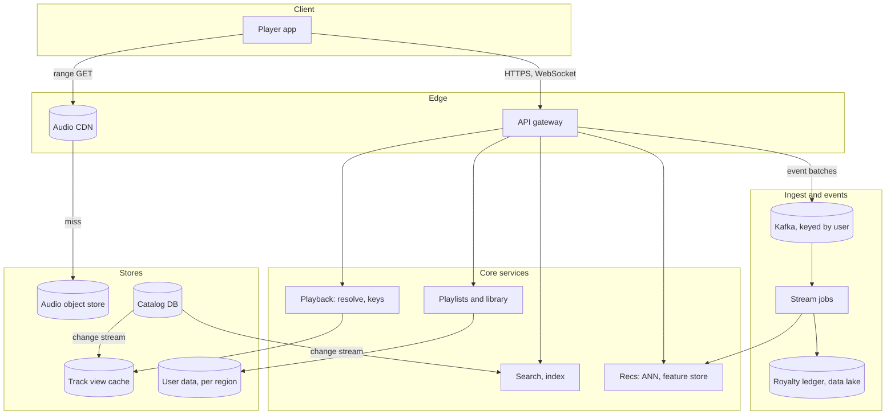

| Component | Owns | Scales by | Fails how |
| --- | --- | --- | --- |
| Player app | Audio cache, offline store, event buffer, prefetched manifests, copy of library and playlists | One per device | Keeps playing from cache; buffers events for a week; replays unacknowledged ops on reconnect |
| Audio CDN | Encrypted whole files: top-1M hot set in every PoP, 30-day LRU tail, regional shields | ~200 PoPs; consistent hashing across nodes inside a PoP | A lost PoP shifts to the next; shield and origin absorb misses, collapsed to one fetch per file id |
| API gateway | Auth, routing, event-batch validation, per-user rate limits | Stateless, per region | Region failover by DNS; clients hold events until it returns |
| Playback | Resolve, entitlement, key wrap, CDN tokens, session for the one-stream rule | Stateless; sessions in Redis with a 90 s TTL | Cached manifests and 1-hour entitlements keep current queues playing; new resolves fail |
| Playlists and library | Op log, snapshot, library change log, WebSocket pushes | By playlist id and user id | Edits queue on device; the last seconds are lost on a regional failover and replayed by the client |
| Search | FST typeahead, BM25 indices, GBDT rerank | Replica count; 50 GB index in page cache | Personalisation zeroed if the feature store is down; play unaffected if search is down |
| Recs | Shelf snapshots, HNSW index, online feature store, presence | Sharded ANN; Redis cluster | Falls back to batch shelves without rerank; Home is a day stale, not empty |
| Audio object store | Every rendition, 3 PB, 3 regions, erasure coded | Capacity | Under 1% of requests; a lost region is served by the other two |
| Catalog DB | Recordings, works, tracks, releases, availability, versioned work shares | Single writer, replica per region; release id is the partition key for sharding later | Writer down: reads continue from replicas and the track view; label ingest pauses |
| Track view cache | Denormalised track record with the 250-market bitmap, 24 h TTL | Redis cluster per region | A miss falls to the replica; a cold cache is a slower resolve, not an outage |
| User data | Playlists, library, follows, settings | Wide-column, homed per region, async DR replica | Seconds of edits on failover, covered by client replay |
| Kafka | Play events, one cluster per region, keyed by user | 200 to 400 partitions | Events stay in the device buffer; nothing is lost, only late |
| Stream jobs | Dedup, sessionize, qualify, online features | Flink parallelism; 7-day keyed state | Replays from Kafka; the ledger upsert makes replays safe |
| Ledger and lake | One row per qualified play (Iceberg, upsert on play id); raw events (Parquet, by day and region) | Partitions; append-only | Close is blocked until the recount matches; statements regenerate from raw events |

## Deep dive: playback delivery and startup latency

### 1. The problem

Tap to first audio under 200 ms at p50 and 600 ms at p99 on a warm mobile client, where 200 ms on a cellular network is one to two round trips. 30M concurrent streams at 4.8 Tbps, seek anywhere, gapless into the next track, and the audio encrypted everywhere a user could copy it. Delivery cost is a rounding error next to royalties (~$0.00002 against ~$0.004 per stream), so the delivery path is tuned for hit ratio and latency, not cents.

### 2. The obvious approach

Do what video does. Transcode each track into 10-second segments per bitrate, publish an HLS or DASH playlist per rendition, and put a commercial CDN in front. On tap the client fetches the playlist, then the first segment, and adapts bitrate segment by segment as throughput changes. Seek is a playlist lookup and a segment fetch. Encryption is the segment-level AES the container already supports.

### 3. Why it breaks

100M tracks × 5 renditions × 20 segments is 50B objects and 50B cache entries, against 500M for whole files, so every cache tier holds a hundredth of the tracks it could. The tap path is a playlist fetch and a segment fetch, two round trips before any audio, on top of connection setup: 300 to 500 ms cold. And a 3.5-minute constant-bitrate asset gets nothing from mid-track adaptive bitrate; a quality switch between songs is invisible, a stall is not.

### 4. Whole encrypted files, content-addressed

Each track is transcoded at ingest into Ogg Vorbis at 96, 160 and 320 kbps and AAC at 128 and 256 kbps for platforms without a Vorbis decoder; each rendition is one object, encrypted with AES-128-CTR under a per-track key, stored under the SHA-256 of its ciphertext. Three properties fall out of that and everything downstream depends on them. **Immutable and content-addressed:** the hash is the file id in the manifest and the cache key at every tier, so a re-delivered master gets a new hash and a catalog pointer flip and no cache can serve a mix of old and new bytes. **Range-friendly:** CTR mode decrypts any byte range independently and Ogg pages are self-synchronising, so a seek to 1:23 is one range request computed from the byte index with no server round trip. **One object per rendition:** 500M objects rather than the 50B that 10-second HLS segments would produce, and one cache entry per track.

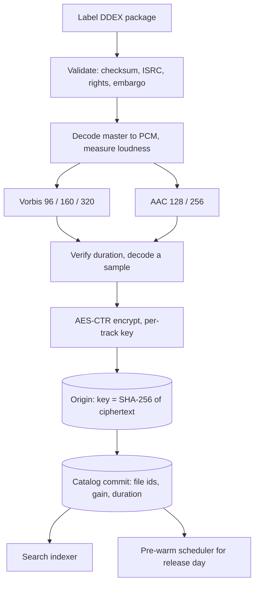

Ingest is idempotent on `(release id, ISRC, master checksum)` because labels re-deliver constantly. Loudness is measured once and stored as a per-track gain so clients normalise to -14 LUFS without re-encoding. The cost is that mid-track quality switching means opening a second file at the aligned time offset: the client only switches down, and only if the buffer drops under 5 s with throughput under 1.5× the current bitrate; switching up waits for the track boundary.

### 5. Take the round trips off the tap path

| Step | Cold | Warm | How the warm number is achieved |
| --- | --- | --- | --- |
| DNS, connection, TLS | 150 to 300 ms | 0 ms | Persistent QUIC connection to the edge, kept open while foregrounded; TLS 1.3 0-RTT on wake |
| Resolve call | 60 to 120 ms | 0 ms | Manifests and keys for the next 3 queue items fetched when the queue changed |
| First 256 KB from edge | 40 to 80 ms | 0 to 40 ms | Head of the next track prefetched; otherwise a 256 KB-aligned range served from PoP SSD |
| Key unwrap, decoder start | 30 to 50 ms | 30 to 50 ms | Device-bound key; decode from the first Ogg page, play at 500 ms of PCM buffered |
| Total | 300 to 500 ms | 30 to 90 ms | Most plays are next-in-queue, so most plays are warm |

The design makes the tap-to-audio path zero round trips for the common case and one for the rest. The prefetch rule is the biggest lever: for any queue, the manifest and first 15 seconds (about 300 KB at 160 kbps) of the next three tracks. Depth and head length are parameters in the manifest per context, because radio skips more than albums.

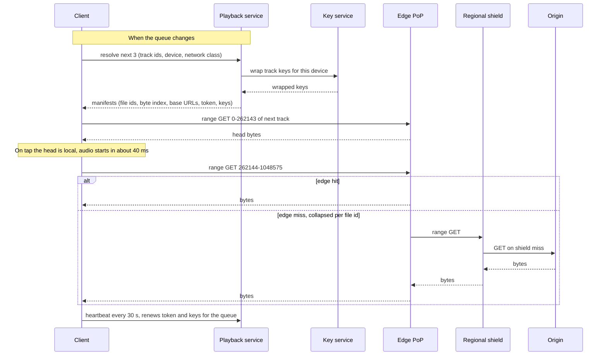

The cost is speculative bytes the user may never hear, capped at 5% of the user's daily traffic and reduced to the next track only on metered connections.

### 6. The cache hierarchy

| Tier | Where | Holds | Share of requests |
| --- | --- | --- | --- |
| Device | 1 to 10 GB app storage, LRU plus pinned downloads | Recent plays, prefetched heads, offline library | ~30% of plays never touch the network |
| Edge PoP | ~200 PoPs, 50 to 200 TB SSD each | Whole top-1M hot set in every streaming rendition, plus a 30-day LRU tail | ~92% of network requests |
| Regional shield | 1 per region, 300 to 500 TB | Top 10M tracks, everything requested in 30 days | ~7% |
| Origin | Object store in 3 regions, erasure coded | Everything | under 1%: first plays of tail tracks, PoP fills |

Inside a PoP, files are placed by consistent hashing of the file id across the PoP's nodes with a replication factor of 2, so a 100 TB PoP holds 100 TB of distinct content instead of every node caching the same top 10k tracks. Requests upstream are collapsed to one in-flight fetch per `(file id, range)` at both the PoP and the shield, which is the stampede guard for a surprise viral track: at most one origin fetch per region per file. **Release day.** Friday midnight is the one predictable thundering herd: a top album can see 5M plays in its first hour. The pre-warm scheduler pushes every rendition of embargoed releases to every PoP up to 24 hours ahead. The bytes are encrypted, and the key service refuses to issue keys before the release timestamp, so early bytes are noise. Nothing hits origin at midnight; the only thing that scales is key issuance, which is a Redis read. The cost is owning PoPs rather than renting a CDN, because commercial CDNs expose neither placement inside a PoP nor pre-warm at this granularity.

### 7. Split the manifest so policy still holds

A manifest cached on device means resolve cannot enforce anything after the first call, and a short manifest TTL puts resolve back on the critical path. The manifest is therefore split. The immutable part (file ids, byte index, duration, gain, base URLs) is cacheable for 24 hours or more. The entitlement part (signed CDN token, wrapped content key) has a one-hour TTL and is renewed by the 30-second heartbeat in a single batch for the whole prefetched queue. The heartbeat also carries the playback session id, which the playback service keeps in Redis with a 90-second TTL for the one-stream-per-account rule; a second device starting playback wins and the first gets a push to pause, because the user is holding the newer device. A rights withdrawal takes effect within an hour through three independent gates: resolve refuses the track, the key service refuses to renew, the CDN token expires. **Offline** is the same encrypted file written to the app's private storage with a wrapped key that expires in 30 days. Every time the app is online it renews keys for all downloads in one call; a lapsed subscription fails the renewal and the client refuses to play after expiry. Keys are wrapped to a device public key from the secure enclave, so copying files to another device yields nothing. Limits (10,000 tracks per device, 5 devices per account) are counted server-side. The cost is a heartbeat every 30 seconds from every active stream and a key service on the renewal path, though never on the tap path.

### 8. Where it lands

- One whole AES-CTR file per rendition, id and cache key the hash of its ciphertext, fetched by byte range with a per-second byte index for seeking; zero round trips on tap: persistent QUIC, manifests and keys resolved when the queue changes, 15 seconds of the next three tracks prefetched; 30 to 90 ms warm.
- Four cache tiers, ~92% of network requests from a PoP and under 1% from origin; consistent-hash placement inside a PoP, request collapsing upstream, release day pre-warmed with time-locked keys.
- Manifest split 24 h immutable and 1 h entitlement, renewed by heartbeat, so rights changes land within an hour and offline keys lapse with the subscription.

## Deep dive: catalog and playlists

### 1. The problem

100M tracks in 180 markets, about 300 GB of metadata, written at 10 per second by one pipeline and read hundreds of thousands of times per second by every resolve and search. Rights changes are transactions and the royalty ledger's correctness depends on the model. Playlists are 4B lists, 200B rows, up to 10k items each, edited by a few hundred collaborators at once, with read-your-writes on the device that made the edit.

### 2. The obvious approach

One `song` table with title, artist, album, file id and a list of countries it is allowed in. One `playlist` row per playlist holding an ordered array of track ids; an edit sends the whole new array and the server writes it. Every resolve reads the song row; every playlist edit replaces the row.

### 3. Why it breaks

The song row collapses distinct legal objects: the same master appears on the album, the deluxe edition and a compilation as three rows, and a ledger keyed that way pays a compilation appearance twice or to the wrong party. The database takes 150k reads per second from one region, so a resolve from the far side of the world is a cross-region round trip, and rights transactions contend with reads. And two phones editing one playlist with last-writer-wins on the array lose one of the edits; position-based operations from two clients cannot be merged, and a move on a 10k-item list rewrites the row.

### 4. Model the legal objects

A **recording** is the master, identified by ISRC and owned by a label. A **work** is the composition, identified by ISWC and split among publishers by percentage. A **track** is a recording's placement on a **release**: the same recording appears on the album, the deluxe edition and a compilation as three track ids and one recording. Streams are counted per recording for the label side and per work for the publishing side.

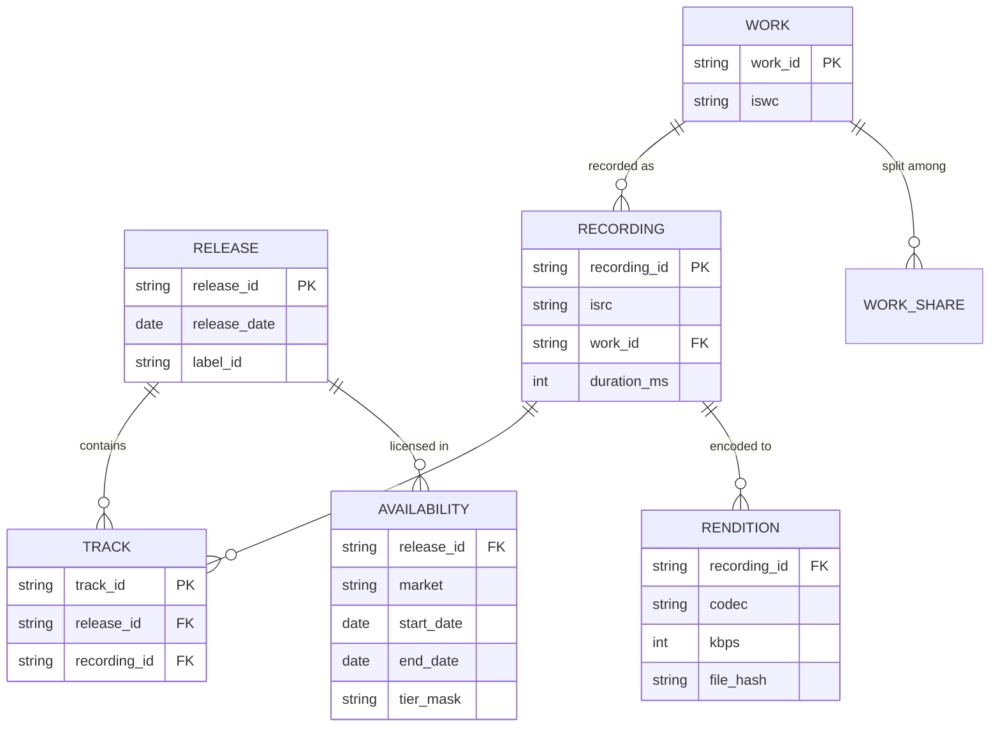

Work shares are versioned with a `valid_from`, because publishing splits are renegotiated and last month's statement must not change when they are. The cost is six tables where the obvious design had one, and a ledger keyed by recording and work rather than by the track id the client reports.

### 5. Single writer, replicas, and a track view in front

Catalog writes come from one pipeline at about 10 per second; reads are hundreds of thousands per second. That shape wants a single-writer relational store with a read replica in every region: strong consistency for the writer, and a few seconds of replication lag that the release embargo hides. At 300 GB it does not need sharding; the release id is the partition key so tracks and availability co-locate with their release, and sharding later is a configuration change. The reason it is relational rather than wide-column is the write side: a label pulling a release, a rights change across 30 territories, a work-share update, are all multi-row transactions that a wide-column store would push into application code. The read path never touches the database. A Redis cluster per region holds a denormalised **track view** (track, album and artist names, artwork ids, rendition file ids, duration, gain, and availability as a bitmap over 250 markets) keyed by track id, with a 24-hour TTL and invalidation from the catalog's change stream. Hit ratio is above 99% because catalog reads follow the same popularity curve as plays. The playback service checks the user's market bit at resolve in constant time; search carries the same bitmap as a filter field so there is one index, not 180 per-market copies. The cost is a cache to invalidate and seconds of lag between a label's write and every region seeing it.

### 6. Playlists as an operation log

Each item gets a unique uid at insertion, and the playlist is an append-only log of three operations over uids, `(playlist_id, revision, actor, op)`: add track after item, remove item, move item after item. The server sequences every op, so adds and removes from concurrent clients both apply, and concurrent moves of the same item are last-writer-wins by server sequence, with the losing client seeing a refresh. A materialised snapshot is kept alongside the log, refreshed every 50 ops or on a stale read; inside the snapshot each entry carries a fractional position key, a lexicographically sortable string, so a move rewrites one row rather than fifty.

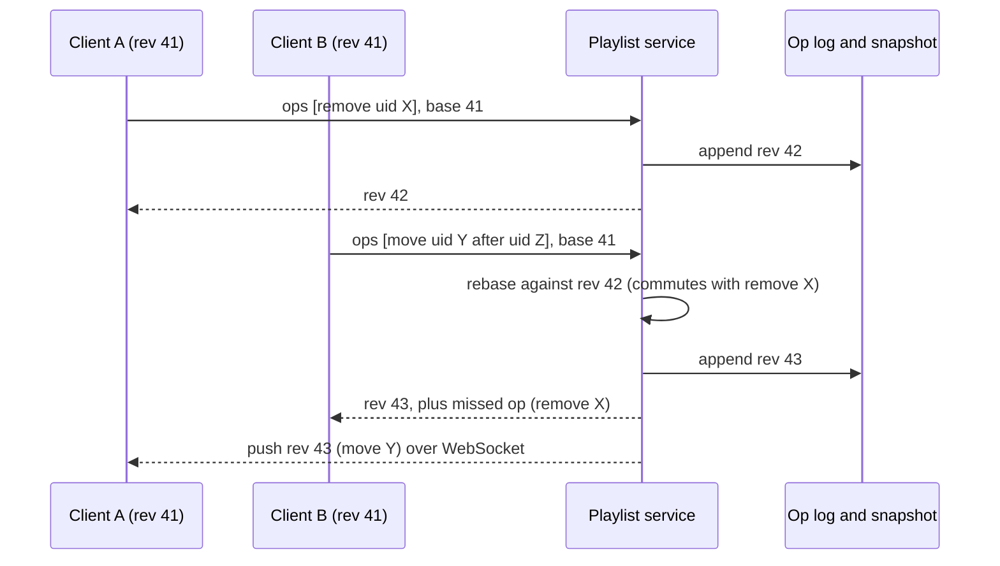

A client more than 200 revisions behind is told to resync the snapshot. The log is the audit trail: "who removed my track" is a query, not a mystery. A CRDT was rejected because the server is always available to sequence operations; offline editing of shared playlists is not a requirement, and if it became one, the client would apply its offline ops on reconnect against the server's sequence, which is what it does today for a stale base revision. The cost is a log and a snapshot to keep consistent, and a lost edit when two people move the same item in the same second.

### 7. Home the user's data in one region

Playlists, library, follows and settings live in a wide-column store partitioned by playlist id or user id and **homed in the user's region**: local-quorum writes in the home region, asynchronous replication to one other region for disaster recovery. That gives read-your-writes for the author and eventual consistency within seconds for followers. A regional failover can lose the last seconds of edits; the client holds its own copy and replays unacknowledged ops on reconnect, so the loss is invisible in practice. Followed playlists are a pointer, not a copy; an editorial playlist with 30M followers is one snapshot in Redis. Library saves are a per-user key-value problem with a per-user change log for sync; writes carry an idempotency key `(device_id, local_seq)` so the retry storm after a subway tunnel does not double-save. The cost is seconds of edits lost on a regional failover, and one cross-region hop per op for a collaborator editing a playlist homed elsewhere.

### 8. Where it lands

- Recording, work, track, release, availability and versioned work shares as separate tables; money keyed by ISRC and ISWC, never by track id.
- One relational writer with a replica per region, 300 GB unsharded, release id as the partition key for later; a Redis track view per region with the 250-market bitmap at 99%+ hit ratio, so resolve and search never read the database.
- Playlists as a server-sequenced op log over item uids with a fractional-key snapshot; LWW for concurrent moves; no CRDT; user data homed per region with async DR; the client's own copy and op replay cover what a failover loses.

## Deep dive: the play-event ledger and royalties

### 1. The problem

Royalties are the largest cost line in the business and are audited by labels. 5B plays and 50B events a day, 1.5M events per second at peak, from clients that crash, retry, and stay offline for a week. The count has to be exactly once per play of 30 seconds or more, per recording, market and tier, explainable to a label, and reproducible months later. A week of delay is fine; a 0.1% overcount is real money paid to the wrong party.

### 2. The obvious approach

When the player passes the 30-second mark the client posts `POST /plays {track_id, tier, market}`. The server increments a counter per track, and monthly close sums the counters into statements.

### 3. Why it breaks

A post that times out is retried and counts twice; a crash at 29 seconds counts nothing. A counter cannot be audited: when a label asks why a track dropped 4% there is no row to point to. The client reports its own tier and market, so a modified client moves streams into the Premium pool. And it is keyed by track id, which pays a compilation appearance twice.

### 4. The event contract

- `play_id`: a UUID assigned by the client at play start; `seq`: monotonic within the play. `(play_id, seq)` is unique across retries.
- `session_id` from resolve, which ties the event to an entitlement check the server did.
- `type`: start, heartbeat every 30 s of audio, seek, pause, resume, end with a reason; `audio_ms_played`, cumulative for the play.
- `client_ts`, and on the server `received_ts`. CDN base URL and time to first byte, for steering.

The event carries nothing that affects money. Tier and market are looked up server-side from a slowly-changing table of subscription states as of the event time, so a modified client that reports "premium" cannot move a stream into the Premium pool. The cost is 10 events per play instead of one, 25 TB a day raw, because the heartbeat is what makes a crash at 29 seconds recoverable.

### 5. At-least-once in, idempotent out

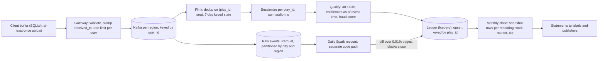

1. **The ledger's primary key is the guarantee.** No single component is exactly once; the combination is. The Flink job emits one `qualified_play` when a play's accumulated audio crosses 30 seconds and upserts it keyed by `play_id`. Even if Flink emits twice across a failover, or a device re-uploads a week of events with their original ids, the ledger stores one row. A dedup window is a probabilistic guard that is only as wide as its state; a primary key is a constraint. The 7-day keyed state is kept because it also drives sessionization and stops duplicate heartbeats from inflating audio ms, not because the ledger depends on it.
2. **One play yields at most one stream.** Sessionization folds all events for a `play_id` into one row, so a retried `progress` event cannot count twice even if dedup misses. The cost is 7 days of keyed state in Flink for every play in flight and a ledger that must support upsert, which rules out a plain append-only log as the sink.

### 6. A second computation as the auditor

3. **The batch recount is the auditor, not the ledger.** A daily Spark job recomputes qualified plays from raw events on a completely separate code path and diffs against the ledger. A diff above 0.01% for any label pages someone and blocks monthly close until explained. Artist-facing counts come from the streaming path with a "provisional" label.
4. **Late events are accepted for 30 days and quarantined beyond.** A phone that spent a week on a plane is normal; a 60-day-old event is indistinguishable from a replay and is reviewed rather than counted. Late arrivals after a month has closed are counted in the current month, which is what rights holders are told.
5. **The ledger is append-only.** Monthly close writes a snapshot row per `(recording, work, market, tier, month)` with the count and the pool share, `payout = pool_revenue × streams / total_streams`. Corrections after close, a proven delivery error or a discovered fraud ring, are adjustment rows in a later month, never updates. Any statement can be regenerated from the ledger and the raw events. The cost is two code paths that compute the same number and a monthly close that stops whenever they disagree.

### 7. Regions and fraud

Kafka is deployed per region with a region column on every event, and each region's Flink job writes to the one global ledger; the idempotent key makes multiple writers safe. Data residency is not a constraint today, but if it arrives the only change is to pin one region's raw storage and compute and federate the rollup, rather than to split a global pipeline. **Fraud.** A separate job scores plays (many accounts on one device, no client interaction, uniform 31-second plays). Suspect plays are marked with a reason code and excluded from the pool pending review, not deleted, so a false positive is reversible and the count is explainable when a label asks why a track dropped. The cost is a Kafka cluster per region and a review queue for flagged plays instead of a filter.

### 8. Where it lands

- Client-generated `play_id` and `seq`, cumulative audio ms, at-least-once upload from a SQLite buffer; nothing in the event affects money.
- Kafka per region keyed by user; Flink dedups over 7 days, sessionizes, qualifies at 30 s with entitlement as of event time; the ledger upsert keyed by `play_id` is the exactly-once guarantee, not any window.
- A daily recount from raw events on a separate code path audits the ledger and blocks close above 0.01%; monthly close is append-only snapshot rows; corrections and fraud reversals are adjustment rows, never updates.

## Deep dive: search and recommendations

### 1. The problem

Typeahead at 50k QPS answering in under 20 ms per keystroke, full search at 10k QPS, both filtered by the user's market and catching a new release within seconds. Home shelves, radio and weekly playlists for 250M daily users without computing anything from scratch on the request path. Presence for 5M open Friend Activity sidebars. None of it may be on the play path.

### 2. The obvious approach

One Elasticsearch index over every entity. Typeahead is a prefix query on it per keystroke, full search is the same query on enter. Recommendations are computed when the user opens Home, from their play history and a nearest-neighbour lookup. Friend Activity subscribes each open sidebar to its friends' play events over the WebSocket.

### 3. Why it breaks

Prefix queries walk term dictionaries; at 50k QPS that is the whole cluster's CPU for the cheapest feature in the product. Scoring 250M users at first open is the same compute as scoring them on Sunday, but with no day to catch a bad model before anyone sees it, and it makes the feature store a dependency of Home. And 2B now-playing updates a day fanned out to 5M subscribed sidebars adds per-connection subscription state for a feature where wrong-for-30-seconds is fine.

### 4. Typeahead as a transducer

**Typeahead** is a finite-state transducer over the top 20M entity names weighted by 30-day play count: a few GB, memory-resident, single-digit milliseconds. It is rebuilt nightly and swapped by pointer after a smoke test. A small per-user layer in Redis, the user's recent searches and library, is checked first so "hel" returns the user's most-played match before the global one. The cost is that a brand new release is not in typeahead until the next morning; full search catches it within seconds.

### 5. Full search: lexical retrieval, learned rerank

**Full search** is two stages. BM25 over name, artist and album with a popularity boost and the market filter returns 500 candidates in about 30 ms from an Elasticsearch cluster whose 50 GB catalog index sits entirely in page cache; tracks, artists, albums and playlists are separate indices so the ranker can weight types and a reindex of one does not touch the others. A gradient-boosted tree with a few hundred features then rescores the 500 in about 10 ms using the user's affinity to each candidate's artist and genre and whether it is in their library. This is where "help" resolves to the Beatles for one user and Papa Roach for another. Freshness comes from the catalog's change stream: an indexer applies label writes within seconds. Friday's 50k-track drop is 100 writes per second. Availability changes go ahead of the normal reindex queue, and the playback service enforces availability anyway, so a lagging index produces a clean message rather than a broken stream.

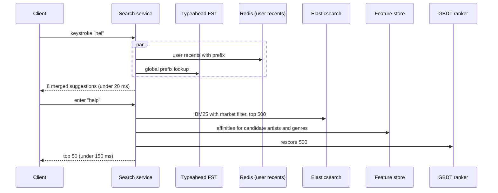

If the feature store is down the ranker runs with personalisation zeroed and nobody notices. User playlists (5B) are indexed by title only and sharded by owner. The cost is no neural reranker: it would take 10× the hardware for a few percent of NDCG on a workload dominated by navigational queries that BM25 plus popularity already gets right.

### 6. Recommendations: batch candidates, real-time rerank

Batch produces candidates and long-lived user representations; real time only reranks and filters. The line is drawn there because scoring 250M users is the same compute whether it runs Sunday or at first open, and Sunday gives a day to catch a bad model before anyone sees it.

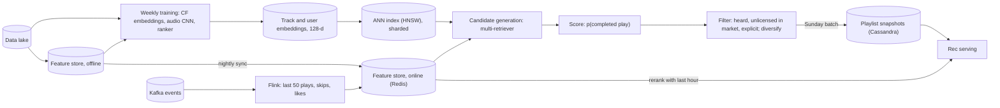

- **Signals.** Collaborative filtering (matrix factorisation or a two-tower model over the play matrix) trained weekly is the workhorse. Content embeddings from a CNN over spectrograms cover cold-start: a new release gets one at ingest so it can appear in Release Radar the same day. Real-time context is the last 50 plays, skips and likes in the online feature store, updated within seconds.
- **Candidates from several retrievers**, each a few hundred tracks: neighbours of the user embedding, neighbours of each recent track, followed and similar artists, editorial pools. One retriever collapses into the user's existing taste, and the point of Discover Weekly is controlled novelty.
- **Scoring** predicts the probability of a completed play (over 30 s, not skipped). **Filtering** removes heard tracks, tracks unlicensed in the user's market as of now (never from the snapshot), and explicit content by preference, then caps tracks per artist. The metric that gates publishing is saves per user per week, not plays. Radio and autoplay run the same stages online from one HNSW query on the seed track, under 50 ms. The cost is a Home whose candidates are up to a day stale, hidden by the real-time rerank over the last hour.

### 7. One feature definition, two materialisations

`user_artist_affinity_30d` is defined once and written to the offline table by Spark and to Redis by Flink, with point-in-time correct joins for training. If the two implementations diverge by a normalisation constant the model quietly degrades and nothing errors; a daily job samples online values against the offline table to catch it. The cost is that daily skew check and two pipelines that change together whenever a feature definition does.

### 8. Presence: poll, not push

Every play start writes `user_id -> (track, context, ts)` to Redis with a 10-minute TTL, 60k writes/s. The Friend Activity sidebar polls every 30 seconds with an `MGET` of the 20 followed friends; 5M open sidebars is 170k reads/s of small keys and no connection state. Push would matter only for "listen along", which is Jam: a 32-member state machine in one Redis hash with members on the WebSocket the client already holds for playlist updates and device-pause messages. Private session is enforced at the presence write, not the read, so a reader bug cannot leak it. The cost is a sidebar up to 30 seconds stale, which nobody can tell.

### 9. Where it lands

- Typeahead is an FST over 20M names rebuilt nightly, merged with a per-user Redis layer, under 20 ms; full search is BM25 with the market bitmap over per-type indices, rescored by a GBDT with the user's affinities, fresh within seconds from the change stream.
- Recommendations are weekly batch candidates from CF and audio embeddings through an HNSW index, filtered against market availability as of now, reranked online with the last hour of context; one feature definition materialised offline and online, with a daily skew check.
- Presence is a Redis write per play start and a 30-second poll; the one WebSocket carries only control messages and Jam.

## Trade-offs

| Decision | Chosen | Alternative | Why |
| --- | --- | --- | --- |
| Delivery container | Whole encrypted file per rendition, byte range, byte index | HLS/DASH segments | 100× fewer objects, one cache entry, seek is one request; mid-track quality switches need an aligned second fetch, rare for music |
| Content protection | AES-CTR, device-wrapped keys, signed short-lived URLs | Hardware DRM | Labels accept it for lossy audio; DRM adds device pain for little marginal protection. A lossless tier may need a second, segmented path |
| Manifest lifetime | Immutable part 24 h, entitlement part 1 h renewed by heartbeat | One TTL | Zero round trips on tap and rights changes take effect within an hour |
| Catalog store | Single-writer relational, replica per region, Redis track view | Wide-column | Rights changes are transactions; reads never reach the database anyway |
| Playlist edits | Server-sequenced op log over item uids, fractional keys in the snapshot | CRDT, or LWW list | Server is always there to sequence; the log is the audit trail; a CRDT solves an offline-merge problem nobody has |
| User data placement | Homed per region, async DR replica | Global transactional store | Seconds of loss on failover, covered by client-side op replay, versus cross-region latency on every write |
| Royalty exactly-once | Idempotent ledger keyed by play id, batch recount as auditor | Kafka transactions end to end, or batch as the ledger | Transactions do not cover a retrying client; a primary key does. Batch as truth makes correctness depend on a job finishing |
| Friend Activity | 30 s poll | WebSocket push | Stateless, staleness invisible; the push channel exists but subscription fan-out for 5M sidebars buys nothing |

## Pitfalls

- Counting royalties per track instead of per recording. The same master appears on the album, the deluxe edition and a compilation; key money by ISRC and ISWC.
- Trusting the client's tier or market. The event carries nothing that affects money; the server looks up entitlement as of the event time.
- Letting resolve be the policy enforcer. Manifests are cached, so anything that must hold during playback (device limits, cancellation, rights withdrawal) needs the heartbeat and key renewal, not resolve.
- Every PoP node caching the same top 10k tracks, so a 100 TB PoP behaves like a 2 TB one. Consistent-hash placement across nodes, and measure distinct bytes per PoP, not just hit ratio.
- Mutable file ids. A re-delivered master under the same id leaves every cache tier serving a mix; content-hash ids make it impossible by construction.
- An append instead of an upsert in the ledger. A Flink failover then double-pays. The primary key on `play_id` is a constraint, not a convention.
- Mutable ledger rows. The first in-place "fix" of last month's count makes statements unreproducible. Adjustments only.

## Design panel notes

Three engineers designed this independently; the full record is in `docs/sessions/spotify/REVIEW.md`. What they disagreed on and what won:

- **Baseline numbers.** Principal estimated 3 events per play, Sr Staff 10 with a 30-second heartbeat. Sr Staff's model won because the royalty rule needs incremental audio milliseconds; the panel settled on 250M DAU, 5B plays and 50B events a day.
- **Delivery container.** Principal and Distinguished both chose whole files with byte ranges; Sr Staff assumed segments in passing. Whole file won; segmentation is reserved for a lossless tier if a label ever demands hardware DRM.
- **Manifest TTL.** Principal cached manifests for 24 hours and enforced policy by heartbeat; Distinguished expired them in an hour to bound rights lag. The panel split the manifest: immutable part 24 hours, entitlement part 1 hour, renewed by the heartbeat.
- **Catalog store.** Principal wanted sharded Postgres, Distinguished a single-writer globally replicated relational store, Sr Staff Cassandra in memory per region. Relational single-writer won because rights changes are transactions and reads never reach the database; sharding is deferred.
- **Playlists.** Principal proposed a three-op OT log over item uids, Distinguished fractional position keys, Sr Staff a server-sequenced op log with WebSocket push. The op log won, with fractional keys inside the materialised snapshot and LWW for concurrent moves. All three rejected a CRDT.
- **Which computation is the ledger.** Principal made the daily batch the ledger, Distinguished and Sr Staff the streaming job. Sr Staff's idempotent upsert keyed by play id won as the exactly-once guarantee; Principal's batch recount became the auditor that gates monthly close. The 7-day dedup window beat Distinguished's 48 hours.
- **Friend Activity.** Sr Staff's 30-second poll won over push, while the WebSocket that Principal used for device pause and Sr Staff for playlist ops carries the control messages. One connection, two patterns.
- **Multi-region.** Distinguished's home-region user data with async DR won, accepting seconds of loss on failover. Sr Staff's residency question was answered by building Kafka per region with a region column from day one, writing to one global ledger.
