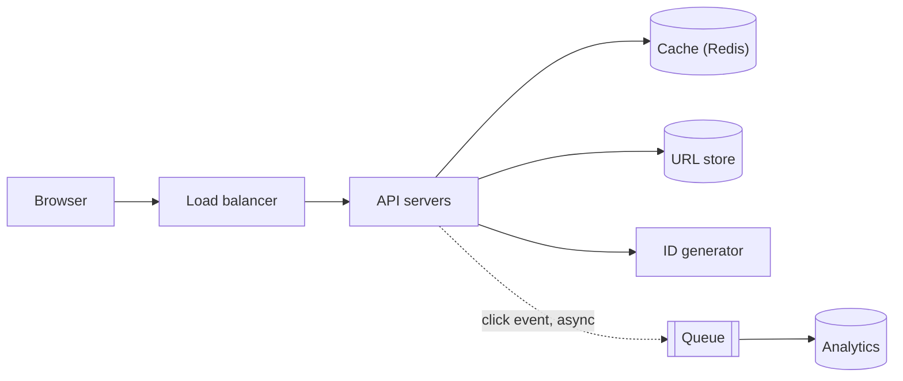
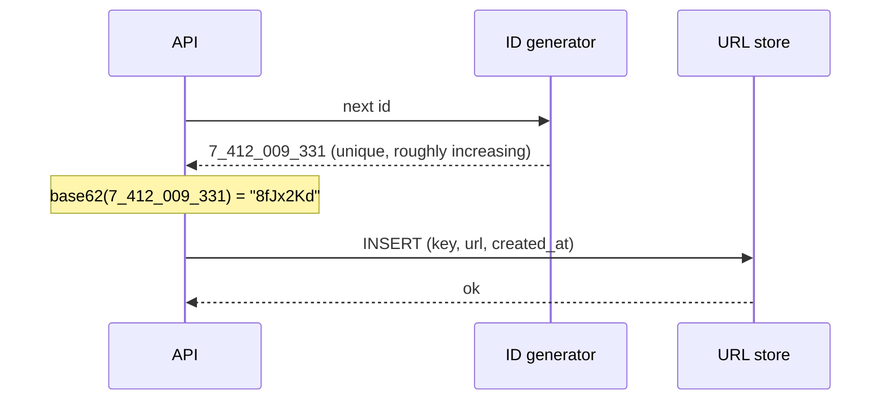
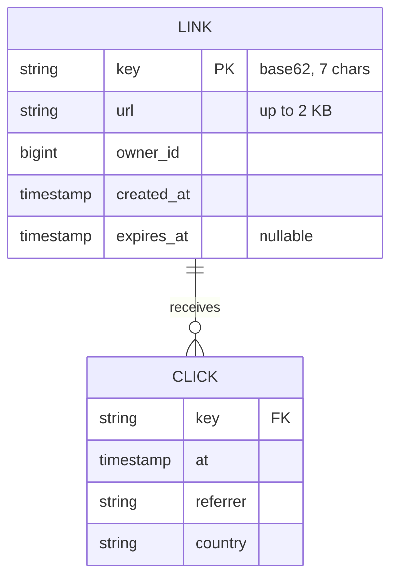

## Requirements

**Functional**

- Given a long URL, return a short one, such as `https://sho.rt/Ab3xY9k`.
- Opening the short URL redirects to the original.
- Optional custom alias, optional expiry.
- Basic click count per link.

**Non-functional**

- Redirect latency under 50 ms at p99: this sits in front of every page load that uses it.
- Highly available for reads. A short link that does not resolve is a broken link on someone else's site.
- Short URLs must be unpredictable enough that nobody can enumerate them, and unique for years.

## Estimates

| Quantity | Value | How |
| --- | --- | --- |
| New URLs / day | 100M | given |
| Writes / s | ~1,200 | 100M ÷ 86,400 |
| Reads / s | ~12,000 | 10:1 read to write ratio |
| URLs over 10 years | 365B | 100M × 365 × 10 |
| Storage | ~180 TB | 365B × ~500 bytes per row |
| Key length | 7 chars | 62^7 = 3.5T, enough for 365B with room |

The write rate is modest. The read rate is what needs a cache, and the storage number is what needs a plan for sharding, though not on day one.

## API

```http
POST /api/v1/links
{ "url": "https://example.com/very/long/path", "alias": "optional", "expiresAt": "optional" }
→ 201 { "short": "https://sho.rt/Ab3xY9k" }

GET /Ab3xY9k
→ 302 Location: https://example.com/very/long/path
```

**301 or 302?** A 301 is cached by the browser, so the second click never reaches the server: less load, no click count. A 302 hits the server every time: analytics work, and the target can be changed later. Pick 302 unless analytics are explicitly out of scope.

## High-level design



**Redirect path.** Look the key up in the cache; on a miss read the database and fill the cache; respond with a 302. Publish the click to a queue after the response is sent, so analytics never slows the redirect.

**Create path.** Get a new ID, encode it to base62, write the row, return the short URL. If the user supplied a custom alias, the write is `INSERT ... ON CONFLICT DO NOTHING` and a conflict is a 409.

## Deep dive: generating the short key

This is the part of the design that has to be right.

### Option A: hash the URL

Take `sha256(url)`, base62-encode it, keep the first 7 characters.

- Collisions are likely at this scale: 7 base62 characters is 42 bits, and by the birthday bound collisions appear well before 365B rows. Each collision means a database check and a retry with a salt.
- Same URL always produces the same key, which is a feature if two users shortening the same link should share it, and a bug if links are private.

### Option B: unique ID, then encode

Generate a globally unique 64-bit integer and base62-encode it. No collisions by construction, no database check on write.



Where the ID comes from:

| Source | Pros | Cons |
| --- | --- | --- |
| Database auto-increment | Trivial | Single writer bottleneck; guessable, sequential keys |
| Snowflake-style: timestamp + machine + sequence | Distributed, no coordination, roughly time-ordered | Still sequential enough to enumerate; needs clock discipline |
| Pre-generated key pool | Keys are random; handing one out is a pop | The pool service is stateful and must never hand out a key twice |

**Choice:** Snowflake-style IDs for the integer, then a fixed random permutation of the bits before encoding so consecutive IDs do not produce consecutive keys. The result is unique with no coordination and unpredictable to an outside observer. A key pool is the alternative to reach for if the interviewer pushes on enumeration.

### Base62

`[0-9a-zA-Z]` gives 62 symbols, all URL-safe with no escaping. Base64 would be shorter but `+` and `/` need escaping, and `-` and `_` in URL-safe base64 look like punctuation in prose. Seven base62 characters cover 3.5 trillion keys.

## Data model



The workload is a point lookup by primary key and an insert. There are no joins on the hot path. A key-value store fits; so does any relational database with `key` as the primary key, and the relational option gets the owner and expiry queries for free.

## Scaling reads

- **Cache** the key to URL mapping with an LRU policy. The distribution is heavily skewed, so a cache holding 20% of keys serves well over 90% of redirects. Rows are immutable except for deletion, so invalidation is a single delete on expiry.
- **CDN or edge** in front of the redirect endpoint moves the 302 to the point of presence nearest the user. Only worth it once latency across regions is the complaint.
- **Read replicas** behind the cache absorb misses.

## Scaling writes and storage

At ~1,200 writes per second one primary is fine for years. When storage crosses what one machine holds comfortably, shard by `key`. The key is already random, so hash-based sharding spreads evenly, and every read carries the key, so no query ever fans out.

## Expiry and cleanup

Do not delete synchronously. A nightly job scans for `expires_at < now()`, deletes in batches, and evicts the cache keys. A read of an expired row that the job has not reached yet checks `expires_at` and returns a 404, so correctness never depends on the job's timing.

## Trade-offs

- **302 over 301** costs a request per click and buys analytics and editable targets.
- **Unique IDs over hashing** costs an ID service and buys collision-free writes.
- **7 characters** is the smallest length that leaves headroom at 100M links a day; going to 6 would run out in a couple of years.
- **Eventual analytics.** Click counts lag by seconds. Nobody needs them to be transactional.

## Pitfalls

- Hashing the URL and truncating, then saying "collisions are rare". At 10^11 keys they are not.
- Forgetting that the redirect path is the product. Every millisecond on it is visible to every site that uses the service.
- Serving a 301 and then wondering why click counts are a fraction of real traffic.
- Letting custom aliases collide with generated keys. Reserve a namespace, or check the alias against the generator's alphabet and length so the two sets cannot overlap.
