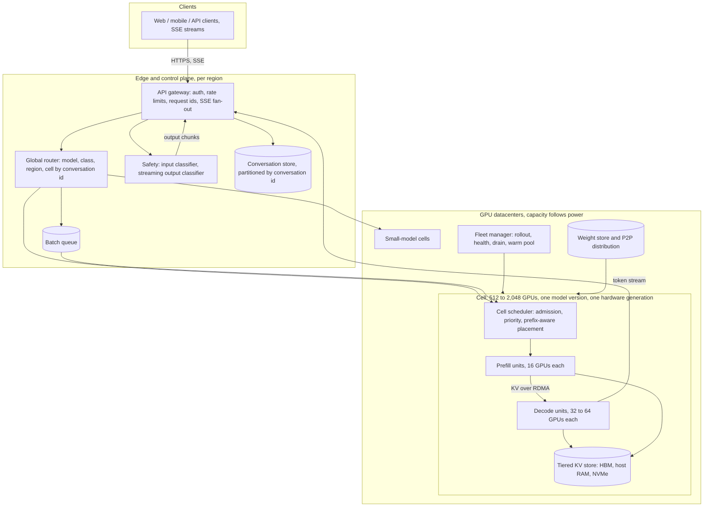
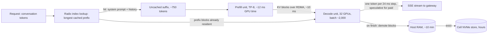
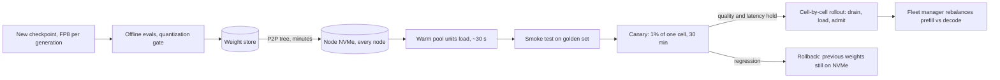

# ChatGPT — Distinguished Engineer, 45-minute design

Lens: the GPU fleet and the inference serving layer at planet scale. The premise is that we already have a trained model and can run it on one box. Everything below is about the distance between that box and 300 million people a day. I will sketch the gateway, conversation store and safety layer so the design hangs together, but the deep dives are the capacity model, the inference engine, the KV cache, scheduling, and running the fleet.

## Requirements

I am stating assumptions rather than asking. If the panel disagrees with a number, the design bends, it does not break.

**Functional**

- Multi-turn chat: send a message, get a streamed response, continue the conversation with full history.
- Several models behind one product: a flagship model, a small fast model, and a "thinking" mode that spends extra tokens before answering.
- Conversation history persisted per user; resume on any device; share links.
- Public API with the same models, plus a batch endpoint with relaxed latency.
- Tool calls and attachments (files, images) as inputs to the model. I treat them as extra tokens and stop there.
- Out of scope today: training, fine-tuning, image generation, voice, browsing internals, billing. I will show where they plug in.

**Non-functional**

- Time to first token (TTFT): p50 under 500 ms, p95 under 1.5 s for paying users on a warm conversation; free tier may see 2 to 3 s at peak.
- Streaming speed: at least 30 tokens/s per user for paid, 15 tokens/s for free. People read at 5 to 10 tokens/s, so anything above 30 is invisible.
- Availability: chat path 99.9% (the model itself is the risk, not the web tier); conversation store 99.99% because losing history is worse than a slow reply.
- Scale: 800M weekly, 300M daily users, several billion messages a day, global.
- Cost: serving cost per message must sit well under blended revenue per message. I will derive it; the target is under $0.001 per consumer message.
- Safety: every input and output passes a policy classifier; the classifier must not add more than ~50 ms to TTFT.
- Privacy: conversation content encrypted at rest, regional residency for enterprise tenants, opt-out from training honoured at the storage layer.

## Estimates

Rounded where it does not change a decision. The model I size for is a ~1T-parameter mixture-of-experts with ~40B active parameters per token, 8-bit weights, 8 KV heads with 128-dim heads over ~80 layers. A dense 70B to 400B model changes the constants, not the shape of the design.

| Quantity | Value | How |
|---|---|---|
| Daily users | 300M | Given; 800M weekly |
| Consumer messages per day | 3B | 300M DAU × ~10 messages |
| API requests per day | 1B | Assumed; fewer requests, more tokens each |
| Generated tokens per request | 400 consumer, 800 API | Visible answer ~300 plus a share of thinking-mode traffic |
| Generated tokens per day | 2T | 3B × 400 + 1B × 800 |
| Generated tokens per second | 23M avg, 40M peak | 2T / 86,400; global peak ~1.7× (US afternoon overlaps Europe evening) |
| Context per request | ~3,000 tokens | ~1,200 system prompt and tool schemas, ~1,500 history, ~300 new input |
| Prefix cache hit on context | ~75% | System prompt always; history when the follow-up lands on a warm replica |
| Fresh prefill tokens per day | 3.6T | 4B × 3,000 × 25% |
| Fresh prefill tokens per second | 42M avg, 70M peak | Without prefix caching this is 4× larger |
| Model weights, FP8 | ~1 TB | 1T params × 1 byte |
| KV cache per token | ~160 KB | 2 (K and V) × 8 heads × 128 dims × 80 layers × 1 byte (FP8) |
| KV for one 3,000-token conversation | ~480 MB | 3,000 × 160 KB |
| Decode throughput per H100 | ~1,500 tokens/s | Derived in deep dive 1; range 1,000 to 2,500 |
| Prefill throughput per H100 | ~8,000 tokens/s | 80 GFLOP per token, ~650 TFLOPS achieved FP8 |
| Decode GPUs at peak | ~27,000 | 40M / 1,500 |
| Prefill GPUs at peak | ~9,000 | 70M / 8,000 |
| Serving fleet, H100-class | ~50,000 | 36k at 100% efficiency, ÷ 0.72 for partial batches and imbalance, + 10% rollout and failure headroom |
| Same fleet, B200-class | ~25,000 | ~2× per GPU on memory bandwidth and FP4 |
| Fleet HBM | 4 PB | 50k × 80 GB; ~2 PB free for KV after weights |
| Fleet host RAM | ~12 PB | 6,250 nodes × 2 TB |
| Power, all-in | ~70 MW | 50k × ~1.4 kW including host, fabric, cooling |
| GPU-hour cost, owned | ~$2 | $30k over 4 years plus power and datacenter; rented is $3 to $4 |
| Serving cost per day | ~$2.4M | 50k × $2 × 24 |
| Cost per million output tokens | ~$0.90 realised | $2 / (1,500 × 3,600 × 0.72 peak efficiency × 0.6 diurnal utilisation) |
| Cost per million fresh input tokens | ~$0.17 realised | $2 / (8,000 × 3,600 × 0.72 × 0.6) |
| Cost per consumer message | ~$0.0005 | 750 fresh input × $0.17/M + 400 output × $0.90/M |
| Concurrent sequences in decode at peak | ~600k | 59k requests/s at peak × ~10 s of generation each |
| KV in HBM at peak | ~290 TB | 600k × 3,000 tokens × 160 KB; fits in 2 PB with room |
| KV to hold every conversation warm for 5 min | ~8.5 PB | 59k/s × 300 s × 480 MB; does not fit in HBM, fits in host RAM |
| Conversation store writes | ~50k/s | 4B messages plus responses per day, spiky |
| Conversation store size | ~3 PB/year | 4B × 2 × ~1 KB compressed × 365 |

Three numbers shape the design. First, the fleet is memory-bandwidth bound in decode, not compute bound, so every lever that reduces bytes read per generated token (batching, FP8, KV compression) is a direct multiplier on the GPU count. Second, prefix caching removes three quarters of prefill, and the KV needed to keep conversations warm between turns is 8.5 PB, which fits in host RAM but not HBM, so a tiered KV store and cache-aware routing are not optimisations, they are the difference between 50k GPUs and 80k. Third, the diurnal curve leaves 40% of the fleet idle on average; a batch tier and preemptible free-tier traffic exist to fill that trough.

## High-level design



**Request path.** The client opens an SSE stream to the gateway with the conversation id, the new message, and a client-generated request id for idempotent retries. The gateway authenticates, checks the per-user and per-org rate limits, appends the user message to the conversation store, and hands the request to the router. The router picks the model (explicit choice, or the difficulty classifier for free-tier traffic), the request class (free, paid, API, batch), and the cell: conversations are consistently hashed to a cell within the region that serves that model, so a follow-up turn lands where its KV prefix lives. In parallel, the input safety classifier runs; it is a small model, ~20 ms, and blocks only on a hard hit. The cell scheduler admits the request against a token budget, looks up the longest cached prefix in its radix index, assigns a prefill unit for the uncached suffix and a decode unit that holds or can receive the prefix, and the first token comes back through the gateway as an SSE event. Tokens stream at the decode step rate; the output classifier reads chunks of ~50 tokens and can cut the stream. When generation ends, the response is written to the conversation store and the KV for the conversation is demoted from HBM to host RAM in the decode node, where it waits up to ten minutes for the next turn.

**Conversation store.** A wide-column store partitioned by conversation id, with messages as rows ordered by sequence number, homed in the user's region and asynchronously replicated for disaster recovery. Reads on resume are one partition scan. The hard part is not the store; it is that the model's view of history and the stored history must be the same bytes, or the prefix cache never hits. The gateway renders history into tokens deterministically from the store, and the token ids, not the text, are what the scheduler hashes.

**Batch and off-peak.** Batch API requests go to a queue with a 24-hour deadline; the cell scheduler pulls from it whenever admitted interactive tokens per second drops below the cell's capacity. This tier is priced at half of interactive because it is served from capacity we already paid for.

**Multi-region.** Chat is tolerant of distance: the TTFT budget is 500 ms and a cross-continent round trip is 150 ms. So GPUs sit where there is power, not where the users are, and regional affinity is soft. What is regional and hard is the conversation store and enterprise tenants with residency requirements; those are pinned to cells in their jurisdiction, and the router respects that pin before it considers load.

## Deep dive: the capacity model, from one GPU to the fleet

Everything downstream rests on how many tokens one GPU produces, so I want to derive it rather than quote it.

**Decode is a memory-bandwidth problem.** Each decode step produces one token for every sequence in the batch. To do that the GPU must read the weights it touches plus the KV cache of every sequence in the batch. On an H100 the HBM delivers ~3.35 TB/s, and that, not the 2 PFLOPS of FP8 compute, is the wall.

Take a decode unit of 32 H100s across 4 NVLink nodes, holding one copy of the 1 TB of weights with expert parallelism (256 experts, 8 per GPU) and attention sharded 8-way inside each node. Per step, per GPU:

| Term | Bytes read per GPU per step | Time at 3.35 TB/s |
|---|---|---|
| Weights, batch 1 | ~1.25 GB (only the 8 experts this token routes to, spread across the unit) | 0.4 ms |
| Weights, batch 2,000 | ~32 GB (2,000 tokens × 8 experts hit every expert; the whole 1 TB is read once, sharded 32 ways) | 9.5 ms |
| KV, batch 2,000 × 3,000 tokens | 2,000 × 3,000 × 160 KB / 32 = 30 GB | 9 ms |
| Expert all-to-all and attention all-reduce | | ~5 ms |
| Step total, batch 2,000 | | ~24 ms |

So the unit produces 2,000 tokens every 24 ms: ~83k tokens/s, or ~2,600 tokens/s per GPU, with every user seeing ~40 tokens/s. That is the ceiling with a full, balanced batch. In production the batch is not always full, experts are not evenly loaded, some sequences are 30k tokens long, and the scheduler spends time on admission; I plan on ~1,500 tokens/s per GPU sustained at peak and call the gap "peak efficiency" of about 0.72 in the estimates. The MoE point is worth saying out loud: at batch 1 an MoE reads 40 GB per step and at batch 2,000 it reads 1 TB, so the whole benefit of sparse activation only shows up when the batch is large enough to amortise reading every expert. MoE and large-batch continuous batching are one design decision, not two.

**Prefill is a compute problem.** Prefill processes all context tokens at once, and matrix multiplies at that width are compute bound. Cost is ~2 FLOPs per active parameter per token: 80 GFLOP per token. An H100 does ~2 PFLOPS dense FP8 on paper; ~33% MFU on real shapes with attention over 3,000 tokens gives ~650 TFLOPS, so ~8,000 tokens/s per GPU. A 750-token uncached suffix on a TP-8 prefill node takes ~12 ms of GPU time. TTFT is therefore dominated by queueing and by KV transfer, not by the prefill itself, which is why the scheduler and the KV store get their own deep dives.

**Memory budget per GPU.** 80 GB HBM minus 32 GB of weights minus ~8 GB of activations and workspace leaves ~40 GB for KV, so a 32-GPU unit holds 1.28 TB of KV, which is ~8M tokens or ~2,700 sequences at 3,000 tokens. That matches the batch of 2,000 the throughput model wants, and it is why the unit is 32 GPUs: 16 would fit the weights but starve the batch.

**From per-GPU to the fleet.** Peak demand is 40M generated tokens/s and 70M fresh prefill tokens/s. At 1,500 and 8,000 tokens/s per GPU that is 27k decode GPUs and 9k prefill GPUs, a 3:1 ratio that the fleet manager can rebalance as traffic shifts (thinking-mode traffic pushes it toward decode; long-document traffic pushes it toward prefill). Add 10% for rollouts in progress and failed units and I am at ~50k H100-class GPUs for serving. On B200-class hardware, with ~8 TB/s of HBM and FP4 weights halving the weight term, the same load takes roughly half the GPUs at about 1.5× the price per GPU, so cost per token drops ~30%.

**What it costs.** At ~$2 per GPU-hour all-in, a decode GPU produces 1,500 × 3,600 = 5.4M tokens per hour at peak. Realised over a day the fleet runs at ~60% of peak because of the diurnal curve, and peak itself is at 72% of the ideal, so realised output is ~2.3M tokens per GPU-hour: ~$0.90 per million output tokens. Fresh input is ~$0.17 per million. A consumer message with 750 fresh input tokens and 400 output tokens costs ~$0.0005; a thinking-mode message with 4,000 output tokens costs ~$0.004. The fleet bill is ~$2.4M per day, ~$0.9B per year for 300M daily users, about $3 per daily user per year. Every lever in the cost section is measured against that $2.4M per day.

## Deep dive: the inference engine

The engine is where a research checkpoint becomes something that serves 2,000 people from one set of weights. Each technique below buys a specific multiplier and I want to be precise about which.

**Continuous batching.** The scheduler admits new sequences and retires finished ones at every decode step, rather than waiting for a whole batch to finish. Without it, a batch of 2,000 runs at the speed of its longest response, and the average sequence occupies a slot it does not use for 60% of its life. With it, slots are recycled per step and the batch stays full. This is the single largest multiplier over a naive server, on the order of 10× to 20× in throughput, and everything else assumes it.

**Paged KV cache.** KV for a sequence is allocated in fixed blocks of 16 tokens, mapped through a block table, rather than as one contiguous reservation sized for the maximum context. Fragmentation drops from ~50% of HBM to under 5%, and blocks can be shared between sequences that have the same prefix (the system prompt, a conversation's history, the N samples of one request). Paging is what makes the prefix cache and the tiered store possible: a block is an immutable, content-addressed unit that can live in HBM, host RAM or on NVMe.

**Prefill/decode disaggregation.** Prefill and decode have opposite profiles: prefill is a 12 ms compute-bound burst; decode is a 24 ms memory-bound step repeated hundreds of times. If they share a GPU, every new request's prefill stalls the decode batch, and the 2,000 users on that unit see their stream freeze for 12 to 100 ms. Separate pools fix that: prefill units take the uncached suffix, write KV blocks, and hand them to a decode unit over RDMA (480 MB over a 400 Gbps link is ~10 ms, overlapped with the last prefill layers). Each pool is tuned for its own job: prefill units run TP-8 within a node for low latency; decode units run 32 to 64 GPUs wide for batch size. The cost is the KV transfer and a more complex scheduler; the gain is ~1.3× to 1.5× throughput and, more importantly, decode step times that do not jitter.

**Parallelism.** Inside a node, tensor parallelism over NVLink (900 GB/s per GPU) shards attention and the dense layers 8 ways, giving 8× the HBM bandwidth per step at the cost of two all-reduces per layer. Across nodes, expert parallelism places 8 experts per GPU and routes tokens with an all-to-all over InfiniBand or NVLink Switch; this is what lets a 1 TB model live on 32 GPUs without pipeline bubbles. Pipeline parallelism I use only for the prefill units with very long contexts, where micro-batching over 2 nodes hides the bubble. Every unit is one failure domain: a dead GPU takes the unit with it, which is a fleet-management fact I return to.

**Speculative decoding.** A small draft (a multi-token prediction head or a 1B draft model) proposes 3 to 5 tokens; the big model verifies them in one step. Verification is a prefill-shaped step so it costs compute, not bandwidth, and when acceptance is 70% each step yields ~2.5 tokens. At batch 2,000 the unit is already bandwidth-saturated and the extra compute competes with batch size, so the throughput gain is only ~1.2×. At low batch it doubles per-user tokens/s. I turn it on for paid-tier and API-priority sequences to hold the 30 tokens/s SLO, and off for free-tier sequences where throughput matters more than speed.

**Quantization.** FP8 weights and FP8 KV are the default; they halve both terms of the decode step and lose under 0.5% on evals. FP4 weights on B200 halve the weight term again. INT4 weight-only for the small model. The rule is that a quantized build ships only after the same eval gate as a new checkpoint, because a 1% regression on 4B requests a day is a product change, not an optimisation.

**Prefix caching.** Every KV block is keyed by the hash of the token ids up to and including that block. A radix tree per unit maps token prefixes to resident blocks. On admission the scheduler walks the tree, finds the longest match, and only the suffix goes to prefill. The system prompt and tool schemas (~1,200 tokens, ~190 MB of KV) are pinned on every decode unit forever; conversation history hits when the follow-up turn lands on a unit that still has it. The 75% hit rate in the estimates is roughly 40 points from the system prompt and 35 from history. It removes ~3 of every 4 prefill tokens, which is ~27k GPUs saved at peak.



## Deep dive: the KV cache as the central resource

If weights are the fixed cost, KV cache is the working capital. It sets batch size, it sets TTFT for follow-up turns, and it is the thing that makes routing stateful.

**Size and lifetime.** 160 KB per token; 480 MB for a typical 3,000-token conversation; 5 GB for a 32k-token document chat. A conversation's KV is needed continuously during generation (~10 s), then sits idle while the person reads and types (median ~45 s, long tail of hours), then is needed again in full for the next turn. At 59k new turns per second at peak, keeping every conversation's KV warm for 5 minutes is ~8.5 PB and for an hour is ~100 PB. HBM has ~2 PB free fleet-wide and needs most of that for in-flight batches.

**Reload versus recompute.** The alternative to keeping KV is to recompute it from tokens. Recomputing 3,000 tokens costs 3,000 / 8,000 ≈ 0.375 GPU-seconds, about $0.0002, and ~50 ms of latency on a TP-8 node. Reloading 480 MB costs ~10 ms from host RAM over PCIe, ~70 ms from local NVMe, ~10 ms from another node's RAM over RDMA. Reload wins on latency from every tier and wins on cost by a wide margin, because a GPU-second is 100× the price of the DRAM and NVMe bandwidth it replaces. Recompute is the fallback, not the plan. That is the whole argument for a tiered store.

| Tier | Where | Fleet capacity | Restore time, 480 MB | Retention | Holds |
|---|---|---|---|---|---|
| HBM | Decode unit | ~2 PB free | 0 | Seconds after generation ends | In-flight batches, just-finished turns, pinned system prompts |
| Host RAM | Same node, 2 TB | ~12 PB | ~10 ms over PCIe | ~10 min LRU | Conversations likely to continue; covers the median think-time many times over |
| Cell NVMe | 8 × 30 TB per node, or a cell-local store | Budget ~100 PB of ~1 EB raw | ~70 ms local, ~20 ms over RDMA from a peer | Hours | Paused conversations, long documents, enterprise sessions with residency pins |
| Recompute | Prefill pool | n/a | ~50 ms plus queue, 0.375 GPU-s | Forever, from the conversation store | Anything colder, and anything after a unit failure |

Blocks are immutable and content-addressed, so a block can exist in several tiers at once and demotion is a copy, not a move. Eviction is LRU with a bias: blocks belonging to paid users and to conversations with a high turn rate stay longer; blocks for a conversation whose client closed the stream go first.

**Cache-aware routing.** The store only pays off if the follow-up turn lands somewhere that can reach the prefix cheaply. Three levels:

1. The global router hashes conversation id to a cell with consistent hashing, so a conversation stays in one cell across turns unless the cell is drained. Cells are big enough (512 to 2,048 GPUs) that this does not create hot cells; a viral share link is many conversations, not one.
2. Inside the cell, the scheduler keeps the radix index for the whole cell, not per unit, tagged with which unit holds which blocks and in which tier. A follow-up is placed on the unit that holds the longest prefix if that unit has headroom; otherwise on the least-loaded unit, which pulls the blocks over RDMA from the holder's host RAM. Pull over RDMA costs ~10 ms and keeps load balancing free to do its job; strict stickiness would be simpler and would create hot units.
3. The system prompt prefix is on every unit, so a cold conversation always hits the first 1,200 tokens.

Long conversations are the failure case: a 50k-token chat has 8 GB of KV and a step-time footprint 16× a normal one. The scheduler counts sequences in tokens, not in requests, and a decode unit's batch is a token budget (~6M resident tokens) rather than a sequence count. Above 32k tokens I route to a dedicated long-context cell with fewer, larger batches and a higher price per token on the API.

```mermaid
sequenceDiagram
    participant C as Client
    participant G as Gateway
    participant R as Router
    participant S as Cell scheduler
    participant P as Prefill unit
    participant D as Decode unit
    C->>G: "POST message, conversation id, request id, SSE"
    G->>G: "append to conversation store, input safety classifier in parallel"
    G->>R: "route: model, class"
    R->>S: "cell = hash(conversation id)"
    S->>S: "radix lookup: system prompt + 1,500 history tokens resident on unit 7 (host RAM)"
    S->>P: "prefill 300-token suffix given prefix blocks"
    P->>D: "KV blocks over RDMA, ~10 ms; unit 7 restores prefix from host RAM"
    D-->>G: "first token, ~350 ms after request"
    loop every ~24 ms step
        D-->>G: "token"
        G-->>C: "SSE event"
    end
    D->>S: "finished; blocks demoted to host RAM, 10 min TTL"
    G->>G: "write response to conversation store"
```

## Deep dive: scheduling, admission and the SLOs

The fleet is a fixed pool of tokens per second; demand exceeds it for a few hours a day in every launch week and on any viral day. Scheduling is how I decide who waits, who is slowed, and who is turned away, and it has to happen at ~60k admissions per second.

**Request classes.**

| Class | Share of tokens | TTFT target | Tokens/s target | Preemptible | Shed order |
|---|---|---|---|---|---|
| Batch API | 15% | Hours | n/a | Yes, always | 1st: pause the queue |
| Free | 40% | p50 1 s, p95 3 s | 15 | Yes, by KV swap to host RAM | 2nd: route to small model, then queue, then cap output |
| API standard | 15% | p50 500 ms, p95 1.5 s | 30 | Rarely | 3rd: 429 with retry-after above quota |
| Plus / Pro | 25% | p50 500 ms, p95 1.5 s | 30 | No | 4th: queue with position shown |
| API priority, enterprise | 5% | p50 300 ms | 50 | Never | Last |

**Two-level scheduling.** The global router does coarse placement (model, class, cell, residency) with a per-cell view of admitted tokens per second that refreshes every second; it does not see individual GPUs. The cell scheduler does fine placement every decode step: which unit, which prefill unit, whether to preempt. Each decode unit reports its resident token count and step time; each prefill unit reports queue depth in tokens. The cell scheduler's job is to keep every decode unit's batch near its token budget without letting step time exceed ~30 ms, because step time is the per-user tokens/s.

**Admission.** A request is admitted when the cell has decode token headroom for its expected footprint (context plus expected output, from a per-model histogram) and its class's TTFT deadline is achievable given prefill queue depth. Otherwise it queues in a per-class priority queue with the deadline as the key. Batch requests are admitted only when the interactive queues are empty and the cell is below 85% of its token budget, which in practice means the trough hours.

**Preemption.** When a paid request arrives and the unit is full, a free-tier sequence is preempted: its blocks are already in HBM so it is swapped to host RAM (~10 ms) and re-admitted when there is room, with its stream paused. The user sees a pause, not an error. Batch sequences are preempted the same way but first. I do not preempt paid or API sequences; they queue at admission instead.

**Holding the two SLOs.** TTFT is set by prefill queue depth plus KV transfer; the scheduler keeps the prefill pool at under 70% utilisation at peak so that queueing delay stays under ~100 ms for interactive classes, and the fleet manager shifts units from decode to prefill when the prefill queue's p95 wait exceeds 200 ms for five minutes. Tokens/s is set by decode step time, which grows with resident tokens; the token budget per unit is chosen so a full batch steps in ~24 ms, and speculative decoding is enabled per sequence for classes with the 30 tokens/s target. When a unit's step time crosses 30 ms the scheduler stops admitting to it until sequences finish.

**Overload, in order.** Pause batch; route free-tier requests that the difficulty classifier marks as easy to the small-model cells (which is 40% of them at any time and 60% under pressure); queue free-tier requests with a visible position; cap free-tier maximum output at 1,000 tokens; return 429 to API standard traffic above its committed quota; and only then queue paid traffic. Each step is a config value in the cell scheduler, not a code change, and each has an alert. The one thing the system never does under overload is accept a request it cannot start within the class deadline, because a request that sits in a queue for 30 s and then fails costs more goodwill than an immediate "try again".

## Deep dive: running the fleet

**Cells.** The unit of operations is a cell: 512 to 2,048 GPUs on one fabric, one hardware generation, one model version, its own scheduler, its own KV store. A datacenter holds several cells; the fleet holds a few dozen. Cells are homogeneous on purpose: TP and EP groups need identical GPUs, and a scheduler that reasons about one step-time model is far simpler than one that reasons about three.

**Model rollout.** A new checkpoint is ~1 TB of FP8 weights per hardware build, and a rollout touches ~6,000 nodes. Pushing from a central weight store would take 6 PB through one origin; instead the weight store seeds a peer-to-peer tree over the cluster fabric, each node pulling from two peers at ~100 Gbps effective, so every node has the file on local NVMe in a few minutes. Loading from NVMe into HBM takes ~30 s per unit. The rollout then proceeds cell by cell: drain a cell by pinning new conversations elsewhere and letting in-flight ones finish (~2 min at the 30k-token tail), load the new weights, run the eval smoke test against a golden set, then admit 1% of traffic for 30 min under a quality and latency canary before the cell takes its full share. A whole-fleet rollout takes a few hours and can stop at any cell. Old weights stay on NVMe for a one-command rollback.

**Warm pools.** 3 to 5% of units in each cell sit loaded with the next model version or with the same version and no traffic. They absorb unit failures without a cold load, they take the first traffic in a rollout, and they are where the fleet manager rebalances prefill against decode: a warm decode unit can become a prefill unit by changing its parallel configuration, which is a restart of the engine process, not a weight download.

**GPU failures.** Dense clusters see something like 2 to 4% of GPUs fail per year, plus a comparable rate of correctable trouble (ECC storms, NVLink retries, thermal throttling). On 50k GPUs that is 10 to 30 hardware events a day. A unit is a TP/EP group and one dead GPU kills the unit, so a 32-GPU unit fails 32× more often than a GPU. When it happens, ~2,000 in-flight sequences die; the gateway holds the client stream, the router retries the request with the same request id at the token position already streamed (the prompt plus tokens so far is the new prefix), and the cell scheduler reconstructs the prefix from host RAM on surviving nodes or recomputes it. The user sees a stall of one to two seconds, not a lost answer. The unit's node is fenced, diagnostics run (a 10-minute NCCL and memory test), and it is returned to the pool or ticketed.

**Stragglers.** Worse than a dead GPU is a slow one, because a TP group runs at the speed of its slowest rank. Every unit reports per-rank step time; a rank that is more than 10% slower than its peers for 60 s is flagged, the unit is drained, and the node is swapped from the warm pool. The usual causes are a throttling GPU, a degraded NVLink lane, or a host with a noisy neighbour on PCIe; all of them show up as step-time skew before they show up in any hardware counter.

**Placement, power and supply.** GPUs go where there is power and cooling on a two-year horizon, which is not where the users are. I plan datacenters at 20 to 60 MW each for this fleet, on at least two grids and two continents, and I treat capacity as arriving in quarterly tranches of one hardware generation. Because chat is latency-tolerant, the router can send European evening traffic to a North American cell that is in its morning trough, which flattens the global peak from 1.7× to ~1.4× of average. Only residency-pinned traffic is exempt.

**Several generations at once.** At any time the fleet has three generations: the previous one (H100), the current one (H200 or B200), and the first tranche of the next. Each model version ships as a build per generation, evaluated separately. Cells are single-generation, and the router weights traffic by each cell's measured tokens per second, not by GPU count. The oldest generation gets the small models and the batch tier, where its lower bandwidth costs least; the newest gets the flagship and the long-context cell. Retirement is a cost decision: a GPU is retired when its power bill per token exceeds the amortised capital cost of its replacement, which for H100 against B200 is around year four.



## Deep dive: the cost model and its levers

Baseline: ~$2.4M per day, ~$0.90 per million output tokens realised, on 50k H100-class GPUs. Each lever is stated as its effect on that baseline; some compound, some compete.

| Lever | What it changes | Effect on the baseline | Cost or catch |
|---|---|---|---|
| Continuous batching, paged KV | Batch size from ~50 to ~2,000 | Already in the baseline; removing it would need 10× the fleet | Scheduler complexity |
| FP8 weights and KV | Halves bytes per step | Already in; BF16 would need ~1.7× the decode fleet | Eval gate per build |
| Prefix caching, tiered KV | Removes 75% of prefill | Already in; without it ~27k more prefill GPUs, +50% | 12 PB of host RAM, NVMe, and the routing logic |
| Disaggregation | No prefill stalls in decode; pools tuned separately | +30 to 50% throughput, in baseline | KV transfer fabric, two engine configs |
| Small-model routing | 40% of consumer messages to a model ~8× cheaper per token | About -25% of the flagship fleet, ~$0.5M per day | Quality regression on misrouted requests; needs a difficulty classifier and an eval loop |
| Batch tier in the trough | Fills the 40% idle capacity with 50%-price work | Revenue on sunk cost; effectively lifts utilisation from 60% to 80%, -25% cost per token | Only if there is batch demand; adds queue and deadline machinery |
| Speculative decoding | 2 to 2.5 tokens per step at low batch | +20% throughput at high batch, +100% per-user speed; mainly an SLO tool | Draft model must be trained with the checkpoint |
| KV compression (MLA-style, 4-bit KV) | 2 to 3× less KV per token | Bigger batches at the same HBM; +30 to 50% decode throughput on long contexts | Needs the model trained for it, or a small quality loss |
| B200 generation | ~2× per GPU | ~-30% cost per token after the price premium | Supply, power density, new failure modes |
| Shorter system prompt | 1,200 tokens of KV pinned everywhere, prefilled for cold users | Every 100 tokens is ~16 MB per resident sequence; 400 tokens saved is ~10% more batch | Product negotiation |

The compounding order matters. Batching, FP8 and caching are foundations; without them nothing else registers. Small-model routing and the batch tier are the two levers that move the bill after the foundations are in, and they are operational, not engineering: they need a quality loop and a sales motion respectively. The hardware generation lever is the one that resets the baseline every 18 months.

## Trade-offs

| Decision | Chosen | Alternative | Why, and what it costs |
|---|---|---|---|
| Model form | ~1T MoE, 40B active, FP8 | Dense 400B | 5× fewer FLOPs per token and a smaller weight read at batch 1; needs 32-GPU units and expert parallelism, and only pays at large batch |
| Prefill and decode | Disaggregated pools | Co-located with chunked prefill | Stable decode step time and pools tuned separately; costs a KV transfer of ~10 ms and two engine configs |
| KV between turns | Tiered store, HBM to host RAM to NVMe | Recompute from tokens every turn | Reload is 5× faster and ~100× cheaper than recompute; costs 12 PB of RAM and a stateful router |
| Routing | Cell-sticky by conversation id, prefix-aware inside the cell, RDMA pull when the holder is busy | Strict replica stickiness | Load balancing stays free; costs a cell-wide radix index at ~60k lookups per second |
| Batch as token budget | Resident tokens per unit | Sequence count | Long conversations are 16× a short one in step time; counting sequences makes step time unpredictable |
| Speculative decoding | Per-class, on for paid | Fleet-wide | Throughput gain is small at high batch; the per-user speed gain is what the SLO needs |
| Cells | Homogeneous, single generation, single model | Heterogeneous pools | TP and EP need identical GPUs; the router balances across cells by measured tokens/s instead |
| Placement | Capacity follows power, soft regional affinity | GPUs near users | Chat tolerates 150 ms; power does not tolerate wishful siting. Residency-pinned tenants are the exception |
| Free-tier overload | Route to small model, then queue, then cap output | Uniform slowdown | Keeps paid SLOs intact; free users get a visible, honest degradation |
| Safety on the stream | Output classifier on 50-token chunks | Classify the finished response | Adds a few ms per chunk and can cut a stream mid-answer; the alternative doubles TTFT for everyone |

## Pitfalls

Things that have bitten inference fleets, and where this design guards against them.

- Sizing the fleet on batch-1 numbers. An MoE at batch 1 looks 25× cheaper than it is at batch 2,000 because it reads only the active experts. The capacity model is built on the full-batch step, where every expert is read every step.
- Counting batch in sequences. One 50k-token conversation costs the step what 16 normal ones cost. The token budget per unit is the guard, and long contexts get their own cell.
- Prefix cache that never hits. If the gateway renders history slightly differently from one turn to the next (a timestamp in the system prompt, a re-ordered tool schema, a different tokenizer version), the hash changes and the whole history is re-prefilled. History is rendered deterministically from the store, and the cache hit rate per cell is a paged metric.
- Strict stickiness turning into hot replicas. The RDMA pull is what lets the scheduler prefer the prefix holder without being bound to it.
- Prefill stalls in the decode batch. Co-located prefill freezes 2,000 streams for the duration of one long document. Disaggregation exists for this, and chunked prefill is the fallback inside the prefill pool only.
- Treating a slow GPU as a healthy one. A rank 15% slow costs the unit 15% and shows up in no hardware counter. Per-rank step-time skew is the primary health signal.
- Losing a unit and losing the answer. A unit failure kills ~2,000 in-flight requests; the request id plus the tokens already streamed make the retry a continuation, not a restart.
- Rolling out weights through one origin. 1 TB × 6,000 nodes is 6 PB; the P2P tree makes it a few minutes on the fabric instead of a day on an object store.
- Quantized build shipped without the eval gate. A 1% regression across 4B requests a day is a product incident. Every build per generation goes through the same gate as a new checkpoint.
- Free tier degrading by accident instead of by policy. Without explicit classes and shed order, overload slows everyone equally, and paid users churn. The shed order is a config, alerted at every step.
- Batch tier competing with interactive at peak. Admitted only below 85% of the token budget with empty interactive queues; otherwise it silently eats the headroom that TTFT depends on.
- Thinking-mode traffic shifting the prefill:decode ratio. A product change that doubles hidden tokens moves the fleet from 3:1 toward 6:1 decode; the fleet manager rebalances units, but the capacity plan must be re-run whenever the token histogram moves.
- Regional residency added late. If cells and the conversation store were not designed with a residency pin, enterprise contracts force a second fleet. The pin is in the router from day one.

## Open questions for the panel

1. KV retention economics: I picked 10 minutes in host RAM and hours on NVMe on the argument that reload is ~100× cheaper than recompute. What is the actual distribution of think-time between turns, and does a long tail of multi-hour resumes justify the NVMe tier at all, or should everything past 10 minutes recompute?
2. Small-model routing: routing 40% of consumer messages to a cheaper model is the largest post-foundation cost lever, about $0.5M per day, but it is a product quality decision made by a classifier. Who owns the quality loop, and what regression on which eval would make us turn it off?
3. Capacity follows power versus latency: I send European evening traffic to North American trough capacity. Does the product tolerate the extra 100 to 150 ms of TTFT, and does the conversation store's regional home create a cross-region read on every turn that I have not accounted for?
4. Free-tier overload policy: my shed order is small model, then queue, then cap output. Is a visible queue with a position number acceptable to the product, or would they rather a uniform slowdown that keeps free users out of a queue at the cost of paid SLOs?
5. Prefill:decode ratio and thinking mode: the fleet is sized at 3:1 decode to prefill. If thinking-mode adoption doubles hidden tokens, decode demand roughly doubles while prefill barely moves. What is the adoption forecast, and should the next hardware tranche be biased toward memory bandwidth (decode) or compute (prefill) on that basis?
