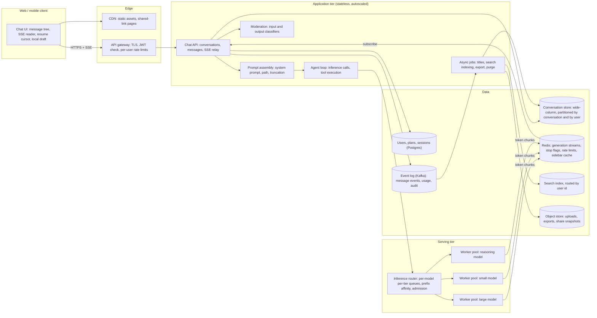
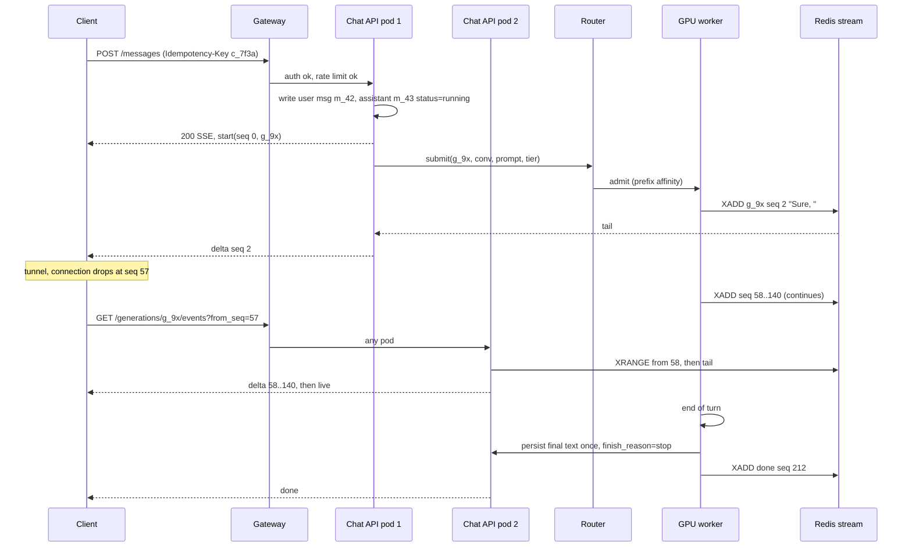
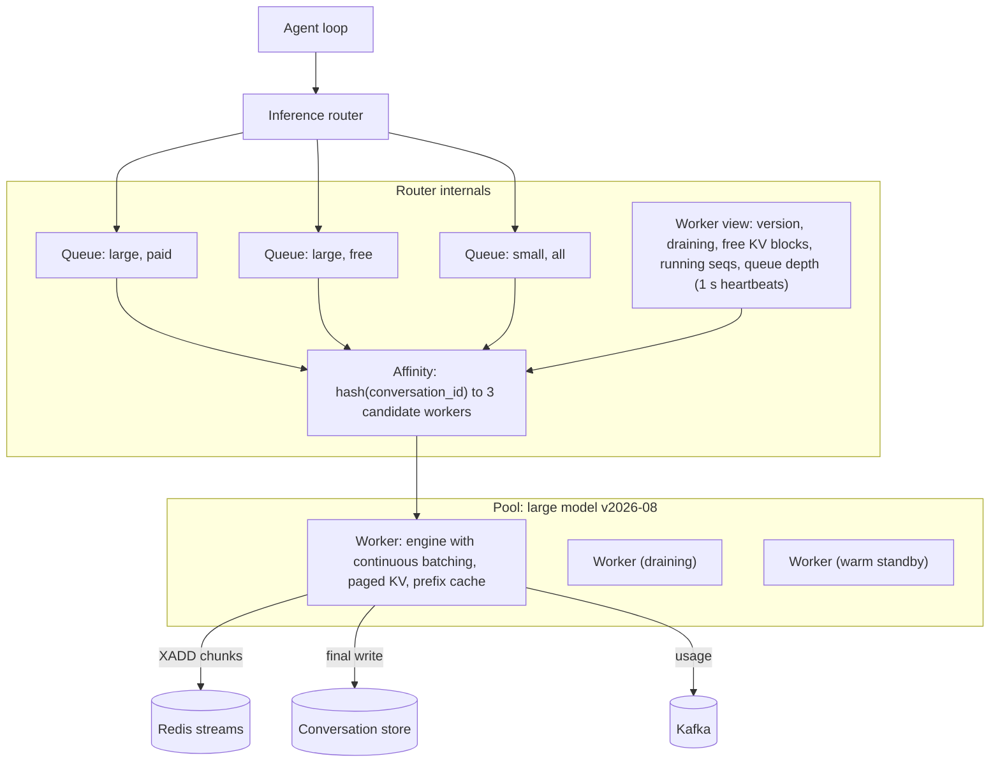

# ChatGPT — Engineer, 45-minute design

## Requirements

The framing is honest about where we are: the model is trained, it runs on a GPU, one box answers one question. Everything between that box and 300 M people a day is the design. I am going to state assumptions rather than ask, and I am going to build this the way I would actually build it: start with the one box, break it, fix it, repeat, and keep the numbers at each step. The product surface is the consumer chat app on web and mobile. Training, fine-tuning, the model itself, and the fleet-level GPU scheduler are out of scope; I will show where they connect.

**Functional**
- Send a message in a conversation and get the assistant's reply as a stream of tokens; stop generation mid-way.
- Regenerate a reply; edit an earlier message and continue from there. Both keep the old branch, so a conversation is a tree, not a list.
- Sidebar of conversations with auto-generated titles; rename, archive, delete; search over my own conversations; export my data.
- Share a conversation as a read-only link; revoke it.
- Several models (a large default, a small fallback, a reasoning model). Paid users pick; free users get the default with limits.
- Tools: web browsing, code execution, file retrieval. The model calls them mid-answer and the answer continues.
- Safety: classify input and output; refuse or cut off flagged content.
- Accounts: sign-up and login, sessions across devices, free and paid plans, per-user limits.

**Non-functional**
- Time to first token (TTFT): p50 under 1 s, p95 under 3 s for paid users. Free users may queue at peak but must see a queue state, never a bare spinner. This is the number the product lives on.
- Streaming rate: at least 30 tokens/s per stream (faster than reading speed) and steady. A stall is worse than a slower constant rate.
- Availability: send-message path 99.9% (I will not claim four nines for a GPU-bound system in year one); reading history 99.95%. A dropped stream must be resumable, not restarted.
- Durability: a user message, once acknowledged, is never lost; a completed reply is never lost; a partial reply from an interrupted generation is kept and visible.
- Consistency: read-your-writes on a user's own conversations across devices within about a second; titles and search eventually consistent within a minute.
- Scale: 800 M weekly, 300 M daily users, several billion messages per day. Mobile-first, flaky networks, app kills mid-answer are normal.
- Cost: GPU time dominates. Do not waste it: no GPUs idle waiting for a batch to fill, no re-prefilling text that is already cached.
- Privacy: deleted conversations disappear from serving stores within 30 days; shared links are snapshots and revocable.

## Estimates

I round hard; the goal is to know what is big.

| Quantity | Value | How |
|---|---|---|
| WAU / DAU | 800 M / 300 M | Stated assumption |
| Messages per day | 3 B | 300 M DAU x 10 user messages/day |
| Messages/s, avg / peak | 35 k/s / 100 k/s | 3 B / 86,400; peak about 3x when the US evening overlaps Europe and India |
| Tokens per turn, prompt / output | 2,000 / 400 | System prompt (~500) plus truncated history plus the new message; output averages 400 with a long tail to 4 k |
| Output tokens per day | 1.2 T | 3 B x 400 |
| Output tokens/s, avg / peak | 14 M/s / 40 M/s | Divide by 86,400; peak 3x |
| Prompt tokens/s, avg / peak | 70 M/s / 200 M/s | 2,000 per turn; about 60% hits the prefix cache (system prompt, prior turns), so 30 to 80 M/s is actually computed |
| Wall time per generation | 10 s | 400 tokens at 40 tokens/s |
| Concurrent generations, avg / peak | 350 k / 1 M | 35 k/s x 10 s; 100 k/s x 10 s |
| Decode throughput per 8-GPU node | ~2,500 tokens/s | 70 B-class model, continuous batching, about 80 streams at 30 to 40 tokens/s each |
| Nodes at peak | ~16,000 decode, ~20,000 with prefill and headroom | 40 M/s / 2,500; plus 25% |
| GPUs at peak | ~160 k | 20,000 x 8 |
| KV cache per token | ~320 KB | 80 layers x 2 (K and V) x 8 KV heads x 128 dims x 2 bytes; a 4 k-token context is 1.3 GB |
| KV budget per node | ~450 GB, about 350 contexts of 4 k | 640 GB HBM minus 140 GB weights minus activations |
| Prefill cost saved by prefix cache | ~150 ms of node time per turn | 1,500 cached tokens at ~10 k tokens/s prefill; across 35 k turns/s that is about a quarter of the fleet |
| Message row size | ~2 KB | 400 tokens is about 1.6 KB of text plus metadata; user messages are smaller |
| Message storage per day / year | 6 TB / 2.2 PB | 3 B x 2 KB |
| Message row writes/s | ~120 k/s peak | Final write plus about two checkpoints per assistant message, plus the user message |
| Conversations created per day | 600 M | 300 M DAU x 2 new conversations |
| Sidebar reads per day | 1.5 B | Five per DAU: every app open and foreground |
| Open SSE connections at peak | ~1 M | One per running generation |
| GPU cost | ~$6 M/day, about $0.002 per message | 160 k GPUs x $1.50/GPU-hour x 24 |

Three numbers shape the design. One million concurrent generations at peak, each an open stream for ten seconds: the API tier is a connection-holding tier, not a request/response tier, and the client contract must survive those connections dropping. Twenty thousand GPU nodes: the router between the API and the GPUs is where cost is won or lost, because every re-prefilled prompt and every half-empty batch is money. Six terabytes a day of message text in a tree shape: conversation storage is a big but plain partitioned write-mostly problem. Nothing there should be clever; it should be boring and correct.

## High-level design



**One turn, end to end.**

1. The client sends `POST /v1/conversations/{id}/messages` with the parent message id, the content, the model, and a client-generated message id that doubles as the idempotency key. The gateway checks the JWT locally and the per-user token bucket in Redis (about 1 ms).
2. The Chat API writes the user message to the conversation store first (durable before any GPU work), inserts an empty assistant message with `status=running`, allocates a `generation_id`, and returns HTTP 200 with `text/event-stream` immediately. The first event carries the three ids.
3. Prompt assembly loads the root-to-parent path (hot conversations are cached in Redis), prepends the versioned system prompt, truncates to the model's budget, and hands the assembled messages to the agent loop. Input moderation runs in parallel; a flag cancels before a GPU is touched and the client gets a `refusal` event.
4. The agent loop submits to the inference router: model, tier, `conversation_id` as the affinity key, prompt, `max_tokens`, and the stop-flag key. The router admits to a worker that has capacity and probably has the prefix cached, or parks the request in the tier's queue and emits `queued` events with a position so the client can show "waiting".
5. The worker prefills, then decodes. Every chunk is appended to a Redis stream keyed by `generation_id` with a sequence number. The Chat API pod holding the client connection tails that stream and relays it as SSE. Output moderation samples the accumulated text as it grows.
6. On finish (end of turn, stop, length, error) the worker writes the final text once to the conversation store with `finish_reason` and token counts, a `done` event goes out, and a usage event lands in Kafka for limits and billing. After the first exchange in a conversation, a title job runs on the small model.
7. If the client's connection dropped anywhere in steps 4 to 6, it reconnects with `GET /v1/generations/{gid}/events?from_seq=N`; the API replays the Redis stream from N and then tails live. Generation never depended on that connection.

## Deep dive: From one box to a fleet, in the order it breaks

This is my lens, so I will spend the most time here. Day one is FastAPI in front of `model.generate()` on one 8-GPU node. It works for a demo. Then it breaks, in this order, and each fix is the seed of a component in the diagram above.

| Step | What breaks | At about | Symptom | Fix |
|---|---|---|---|---|
| 1 | No streaming | The first user | Ten-second spinner, then a wall of text; timeouts on long answers | Generate token by token, `StreamingResponse` as SSE. Cheapest change; everything after inherits the contract |
| 2 | One request at a time | 5 concurrent users, a few hundred DAU | Second user waits 10 s, tenth waits 100 s; GPU utilisation sits at 10% | Batching in the model server, and specifically continuous batching (below). One node goes from 0.1 to about 6 messages/s |
| 3 | Memory | 50 concurrent, a few thousand DAU | A long conversation plus a full batch blows the KV cache; CUDA OOM kills the process and every stream on it | Paged KV cache; admit by tokens not by request count; hard caps on context, `max_tokens`, wall clock; preempt instead of crash |
| 4 | No persistence | The first deploy | Restart loses every conversation; no history, no second device | Split into an API process, a model server, and a database. Conversations in Postgres to start |
| 5 | No auth | Public launch | Scripts hammering the endpoint; the bill triples overnight | Sessions, per-user token buckets, request size limits, and idempotency keys because retries now exist |
| 6 | One node | 20 k DAU at peak | The node is saturated and it is also the only failure domain | N model servers behind a router; API tier scaled behind a load balancer; Redis as the shared stream buffer so any API pod can relay any generation |
| 7 | Single Postgres | 10 to 20 M DAU | 3 to 4 k message writes/s and tens of TB in one table; vacuum and failover get scary | Wide-column store partitioned by conversation id, with a per-user index partition for the sidebar |
| 8 | Deploys and second model | The first model update | Restarting a worker kills its streams; users see answers from two model versions in one conversation | Pools per model version, draining, router-level version selection |
| 9 | One region | Global users, GPU supply | 200 ms RTT to the API from Sydney; GPUs are wherever the datacentre has power | Global API edge; serving pools in a few GPU regions; the SSE relay tolerates the extra hop |

**Step 2 is the 50x, so here is what actually happens on the GPU.** A turn has two phases. Prefill processes the whole prompt in one pass: compute-bound, thousands of tokens per second per node, and it produces the KV cache (the per-token key and value tensors every later token attends to). Decode produces one token per step per sequence, and each step reads all 140 GB of weights from HBM to produce that one token. That is memory-bandwidth-bound: reading the weights once to produce one token for one sequence costs about the same as reading them once to produce one token for each of 80 sequences. So a single sequence uses a few percent of the GPU; batching is where the other 95% comes from.

Naive batching, by count, is the first thing everyone writes and it is wrong for LLMs: wait until N requests arrive, pad prompts to the longest, run until the longest output finishes. Three problems. The fill wait lands directly in TTFT. Every sequence in the batch runs at the pace of the longest, so a 50-token answer sits in a slot for 4 k tokens' worth of steps. And the batch shape is fixed when it starts, so nobody joins until it ends. Continuous batching (what vLLM and TGI style engines do) runs a scheduler loop where each iteration decodes one token for every running sequence, finished sequences leave immediately, and waiting sequences join at the next iteration. Prefill of a new sequence is chunked (say 512 tokens per iteration) and interleaved with decode so a 30 k-token prompt does not freeze everyone else's stream for a second. The batch stays full, TTFT is one iteration plus prefill, and a short answer leaves as soon as it is done. Paged KV (step 3) is what makes this possible: KV memory is allocated in fixed blocks as a sequence grows, so the engine knows exactly how many free blocks it has and admission is a real number, not a guess.

The arithmetic for one node after step 3: about 80 concurrent streams at 35 tokens/s each is 2,800 tokens/s; at 400 tokens a message that is 7 messages/s, 600 k messages/day, or about 60 k DAU at average load and 20 k DAU at peak. So "when do I need a fleet" has a concrete answer: somewhere around 20 k daily users, one box is done, and at 300 M it is 20,000 boxes.

**Step 6 is where the architecture appears.** The moment there are two model servers, three things become true: the API pod holding the client's connection is not the process producing tokens; a client can reconnect to a different API pod mid-answer; and a worker can die under a running generation. The fix for all three is the same: the worker publishes tokens to a stream in Redis keyed by `generation_id`, the API pod subscribes, and the stream (not the connection) is the source of truth for the in-flight answer. That one decision gives me resume, stop, multi-device viewing of a running answer, and graceful API deploys for free.

## Deep dive: The client-server contract

The API is small. Everything hard is in the streaming semantics.

```
POST /v1/conversations/{conv_id}/messages
Idempotency-Key: c_7f3a...            // the client-generated message id
{
  "parent_message_id": "m_41",        // null for the first message in a conversation
  "content": [{"type": "text", "text": "..."}],
  "model": "large-2026-08"
}
-> 200 text/event-stream

event: start    data: {"seq":0,"user_message_id":"m_42","assistant_message_id":"m_43","generation_id":"g_9x"}
event: queued   data: {"seq":1,"position":120,"eta_s":8}
event: delta    data: {"seq":2,"text":"Sure, "}
event: delta    data: {"seq":3,"text":"here is "}
event: tool     data: {"seq":40,"name":"web_search","state":"running"}
event: done     data: {"seq":212,"finish_reason":"stop","usage":{"prompt":1900,"completion":402}}
```

Every event has a monotonic `seq` within the generation. That is the whole resume story: the client remembers `(generation_id, last_seq)` and can ask for everything after it.

**Regenerate and edit are the same call.** Regenerate is `POST .../messages` with `parent_message_id = m_42` (the user message) and no content: the server creates a new assistant sibling `m_44` under `m_42` and moves `current_leaf` to it. Edit is the same call with `parent_message_id = m_41`'s parent and new content: a new user sibling, then a fresh assistant child. The old branch stays; the client shows `< 2/3 >` on any message that has siblings. Nothing is ever mutated in place.

**Stop.** `POST /v1/generations/{gid}/stop` sets a flag in Redis. The worker checks it every decode step, finishes with `finish_reason=stopped`, and persists what it has. The client shows the partial text as a normal message with a "stopped" marker. Stop is idempotent and safe to spam.

**Retry and idempotency.** Mobile clients retry; the question is what a retry means. The client generates the message id, so a retried `POST` carries the same key. The API keeps `idempotency_key -> generation_id` in Redis for 24 hours. A hit does not start a second generation; it returns the existing stream from `seq=0`. The worst case on a flaky link is seeing the same reply from the start, never two replies and never a duplicate user message in the tree.

**Queue wait.** When the router cannot admit within about a second it emits `queued` with a position and an ETA derived from the pool's measured throughput, refreshed every 2 s. The client shows "high demand, you are in line" with the estimate; free users get a "switch to the faster model" button that resubmits with the small model. After 20 s (paid) or 60 s (free) the router fails the request with `error: capacity`, the client offers retry, and the user message is already saved so nothing is lost.

**Flaky networks and resume.** SSE over HTTP/2. On any disconnect the client reconnects with backoff (0.5, 1, 2, 4 s, capped at 30 s) to `GET /v1/generations/{gid}/events?from_seq=N`. The API replays from the Redis stream (`XRANGE` from N) and then tails live. Generation continues while the client is away, capped by `max_tokens`, because when the phone comes out of the tunnel the answer should be waiting. The stream is kept in Redis for 10 minutes after `done`; past that the client just loads the finished message from the store. If the app was killed, the next conversation load returns the assistant message with `status=running` and the generation id, and the client resubscribes; the same mechanism lets a second device watch an answer being written on the first.



Why SSE and not WebSockets: the stream is one-directional, SSE is plain HTTP so auth, retries, proxies and CDNs all behave, and resume by cursor is natural. The one thing WebSockets would buy is server push for cross-device updates, which I handle with a cheap long-poll on foreground and a push notification for "your answer finished".

## Deep dive: Conversation state, end to end

**The tree.**

```
conversations  partition: user_id            cluster: updated_at desc, conversation_id
  title, model, created_at, updated_at, current_leaf_id, archived, deleted_at, share_id

messages       partition: conversation_id    cluster: message_id (time-ordered ULID)
  parent_id, role (system|user|assistant|tool), content, status (running|done|interrupted|flagged),
  finish_reason, model_version, tokens_in, tokens_out, created_at, metadata
```

Each message points at its parent; siblings are alternatives. The client builds a children map and renders the path from root to `current_leaf_id`, which is stored per conversation so every device opens the same branch. A typical conversation is 20 to 30 messages and loads in one partition read. For the rare thousand-message tree the API returns the current path plus sibling counts and the client lazy-loads other branches. The sidebar is one read of the user partition, limit 50, with the first page cached in Redis and invalidated on any write to that user's conversations.

Store choice: wide-column (Cassandra or DynamoDB style). Writes are 120 k/s at peak, every read is a single partition, there are no cross-conversation transactions, and the dataset grows 2 PB a year. Postgres sharded by user would work to about 20 M DAU and I would honestly start there (step 4), but the migration is inevitable so I would design the access patterns as single-partition from day one so the move is mechanical.

**Assembling a prompt.** Prompt assembly is a pure function of (system prompt version, user's custom instructions, path messages, model budget). Order and rules: the system prompt is versioned and byte-for-byte stable so its KV is cached on every worker; volatile things like the date go at the end of it, never the top, because one changed byte at the top invalidates the whole prefix for everyone. Then custom instructions and memory. Then the path, newest last, dropping oldest whole messages until `prompt_tokens <= context_window - max_tokens - margin`. Token counts are stored on each message row at write time so assembly is a sum, not a re-tokenise of the whole history. For long conversations an async job summarises the dropped segment into a hidden `summary` message that assembly pins after the system prompt; that keeps a 200-message conversation coherent without re-reading it.

**Titles.** After the first assistant reply completes, a job calls the small model with the first exchange and a "3 to 6 word title" instruction, writes it, and pushes `conversation.updated` to any open client. A user rename sets a flag and wins forever.

**Search over your own conversations.** A shared search index with documents routed by `user_id`, so a query touches one shard and is always filtered by owner. Indexing is asynchronous from the message event stream in Kafka, which is why search is "within a minute" rather than immediate. Six terabytes a day of text is a large index, so the last 12 months are indexed in full and older conversations keep titles only with on-demand reindex. Semantic search later rides the same pipeline with an embedding per message.

**Delete and export.** Delete is a soft delete: `deleted_at` set, hidden from sidebar and search within seconds via the same event stream, share link revoked, then a purge job hard-deletes rows, index documents, and Redis caches within 30 days and writes an audit event. Export is an async job that walks the user partition, writes JSON and HTML to the object store, and emails a signed URL; one per day per user.

**Shared links.** `POST /v1/conversations/{id}/share` snapshots the current path into a `shares` object keyed by a random 128-bit id and serves it read-only from the CDN. A snapshot, not a live view: the owner keeps chatting privately and nothing leaks after the moment of sharing. Revocation deletes the object and the CDN entry.

**Persisting the streamed reply.** The user message is written once, before generation starts. The assistant message row is inserted with `status=running` and empty content when generation starts, so a reload mid-answer sees it and knows to resubscribe. Tokens go to Redis, not the database. Every 5 s or 250 tokens the relay writes a checkpoint of the content so far. On finish the worker writes the final content once with `finish_reason`. That is roughly 3 writes per assistant message instead of 400, and a worker crash leaves a checkpointed partial marked `interrupted` by a reaper that watches for stale generation heartbeats, with the client shown "generation interrupted, regenerate?". Writing every chunk to the database would be 40 M writes/s at peak for no product benefit; writing only at the end would lose up to 4 k tokens of work on a crash and would leave a reload during generation with nothing to show.

## Deep dive: The serving tier from the practitioner's side



**Queue, but not a durable one.** The router holds requests in memory in per-model, per-tier queues. I considered Kafka for the request path and rejected it: a chat request is worth nothing 60 seconds later, a durable log invites processing stale work, and it adds a hop to TTFT. The durable record is the user message already in the store; if a router instance dies, the client's retry with the same idempotency key reissues the work. Queues are bounded by wait time, not length.

**Admission.** A worker reports free KV blocks, running sequences, queue depth, model version and draining state every second. The router admits a request to a worker only if it has blocks for the prompt plus a reserved output allowance (512 tokens, grown on demand) and is under its concurrency cap. Requests that cannot be admitted queue with a `queued` event. This is admission by tokens, not by requests, because a 30 k-token prompt and a 300-token prompt are not the same unit of work.

**Sticky routing for the prefix.** Every worker has the system prompt cached, so the win is the conversation's prior turns. The router hashes `conversation_id` to three candidate workers in the pool and picks the least loaded of them if it is under 85% KV utilisation, otherwise the least loaded worker in the pool. A follow-up turn within a few minutes usually lands where its prefix still lives and skips about 1,500 tokens of prefill. The estimate above puts that at roughly a quarter of fleet time, so affinity is not a nicety; it is a cost line. It is also why tool calls resubmit to the same worker: each hop prefills only the appended tool result.

**Timeouts and caps.** Queue wait: 20 s paid, 60 s free. TTFT after admission: 5 s, else the worker is marked unhealthy. `max_tokens`: 4 k default, 16 k for the reasoning model. Wall clock: 5 minutes. Stall: no token for 30 s kills the generation as `interrupted`. Context: per model, enforced in prompt assembly, not in the engine.

**Health and draining.** Worker states: `starting` (weights load in 2 to 5 minutes, then a canary prompt), `ready`, `draining`, `dead`. Draining stops new admits and finishes in-flight work, bounded by the 5-minute wall clock; the orchestrator's pre-stop hook flips the flag and waits up to 10 minutes. Three missed heartbeats mark a worker suspect and remove it from routing; ten seconds marks it dead and the reaper marks its generations `interrupted`. If no tokens were sent to the client yet, the API retries the generation transparently on another worker under the same generation id; if tokens were sent, the client gets `error: interrupted` and a regenerate offer, because silently restarting would produce a different answer under the text the user is already reading.

**Warm standby.** Because loading weights takes minutes, autoscaling reacts in tens of minutes, not seconds. Each pool keeps about 15% of forecast peak as ready-but-idle standby. The fast levers at peak are not more GPUs; they are routing free traffic to the small model, letting free wait longer, and lowering free `max_tokens`.

**Rollouts without dropping streams.** A new model version is a new pool. The router shifts a share of new conversations to it (1%, 10%, 50%, 100% over hours) while watching per-version TTFT, error rate, stall rate, and a quality canary set. In-flight generations are never moved. A conversation stays on the version it started on for the session (the message row records `model_version`) so a user does not see two personalities in one thread, until the old pool is gone. The old pool drains node by node; rollback is the traffic share back to the old pool, which is a config change, not a deploy. Two live versions mean two sets of KV cache and weaker affinity, so the overlap is kept short.

## Deep dive: Auth, tiers, priority, tools, moderation

**Auth and sessions.** OAuth (Google, Apple, Microsoft) plus email. A session service issues a 15-minute access JWT and a 30-day rotating refresh token stored in Postgres with device id. The gateway verifies the JWT signature locally, no database hit, and checks a small Redis revocation set for "log out everywhere". Anonymous trial traffic gets a device-scoped token with tight per-IP limits.

**Rate limits.** Token buckets in Redis per `(user, model)`: free gets about 10 messages per 5 hours on the large model then automatic fallback to the small one; paid gets about 80 per 3 hours. There is also an output-token budget per day, because messages vary 100x in cost and a bucket counted in messages is gameable. Limits are enforced in the API tier before the router; consumption is counted from the worker's `done` usage event through Kafka, which is eventually consistent by a few seconds and that is fine.

**Priority for the paid tier.** The router's queues are per tier. Weighted fair scheduling at 4:1 paid to free, plus 30% of large-model capacity reserved for paid so a free-tier surge cannot starve it. At peak, free users wait longer and are offered the small model. Enterprise and API traffic run on separate pools entirely so consumer spikes cannot touch them.

**Tools as extra hops.** The agent loop owns the tool cycle. The model streams a tool-call block; the loop emits a `tool` event to the client, executes the tool (web search through a search API with a 5 s timeout; browsing through a headless fetcher with an allowlist and content sanitising; code in a sandboxed container with a 60 s CPU cap and no network), appends the result as a `role=tool` message in the tree (persisted like any other message, so a reload shows what happened), and resubmits to the same worker where the prefix is cached. Caps: 10 tool calls per turn, 5-minute wall clock total. Tool output is untrusted input; that is where prompt-injection defence lives, and anything with side effects (send, buy, delete) needs a user confirmation event.

**Moderation on both sides.** Input: a small classifier (about 20 ms) runs in parallel with prompt assembly; a hit cancels the generation before it reaches the router and the client gets a `refusal` event; the message is kept with a flag for review. Output: the relay runs the classifier on the accumulated text every 50 tokens and at `done`; a hit sets the stop flag, replaces the content with a refusal, and marks the row `flagged`. Both live in the application tier, not in the engine, so classifiers ship on their own cadence.

## Deep dive: Operating it

**What I watch, per model version and tier.** TTFT p50/p95/p99 and time-in-queue separately (queue is capacity, post-admission is the engine). Tokens/s per stream p50 and p5 (p5 is the stall detector). Generations/s, finish-reason mix (a spike in `length` or `interrupted` is a bug, a spike in `stopped` is a quality problem). Stream disconnect and resume rates (network health, and a proxy for how good resume is). Error rate per worker version. Per node: GPU utilisation, KV utilisation, preemption rate, prefix cache hit rate, running batch size. Per pool: ready, draining, dead, standby counts, headroom against forecast. Every generation id ties the API log, the router decision, the worker, and the moderation verdicts together.

**Alerts.** Paid TTFT p95 above 3 s for 5 minutes. Free queue wait p50 above 10 s. Error rate above 1%. Stall rate above 0.5%. Prefix hit rate falling below 40% (someone changed the system prompt's first bytes). Headroom below 10%.

**An incident.** Tuesday evening, the new large-model version is at 50% of new conversations. TTFT p95 doubles on the new pool only; preemption rate is up. Cause: the new version has a larger context window and the admission reserve was tuned for the old one, so the workers over-admit and then preempt. Rollback is the traffic share to 0% (one config change, under a minute), drain the new pool, fix the reserve, redo the ramp. What kept it to ten minutes: per-version metrics, and traffic shifting being a config knob rather than a deploy.

**Capacity planning.** Weekly forecast of peak messages/s per model per region, with seasonality (Monday mornings, school terms, launches). Convert to nodes with the measured tokens/s per node at target latency, add 20 to 30% buffer, and plan quarterly because GPU lead times are months. The pool that runs out first is the large model at the US evening peak.

**Cost.** At $0.002 per message the fleet is about $6 M a day. The levers in order of size: continuous batching (the 50x over naive), prefix caching (about a quarter of prefill), FP8 quantisation (1.5 to 2x on decode), speculative decoding (1.5 to 2x on decode for the large model), and routing free traffic to the small model at peak. One percent of fleet is $60 k a day, so a serving-efficiency team pays for itself many times over.

## Trade-offs

| Decision | Chosen | Alternative | Why |
|---|---|---|---|
| Stream transport | SSE over HTTP/2 with a per-event `seq` | WebSockets | One-directional, works through every proxy and CDN, resume by cursor is natural; push for cross-device updates is handled separately |
| In-flight answer | Redis stream per generation, API pods tail it | Worker holds the client connection directly | Decouples the connection from the GPU; gives resume, stop, second-device viewing, and API deploys without dropping streams |
| Persisting the reply | Row on start, checkpoint every 5 s or 250 tokens, final write once | Write every chunk, or write only at the end | 3 writes instead of 400 per message; a crash loses at most a few seconds; a reload mid-answer has something to show |
| Conversation storage | Wide-column, partitioned by conversation and by user | Sharded Postgres | 120 k writes/s and 2 PB/year with no cross-partition transactions; I would start on Postgres and design single-partition access so the move is mechanical |
| Request path | In-memory per-tier queues in the router, bounded by wait time | Kafka between API and workers | Requests are worthless after a minute; durability lives in the stored user message and the client's idempotent retry |
| Batching | Continuous batching with paged KV, chunked prefill | Static batching by count | Fill wait and pad-to-longest waste both latency and GPU; continuous batching keeps the batch full and short answers leave early |
| Routing | Prefix affinity by conversation id with a load fallback | Pure least-loaded | About a quarter of fleet time is prefill that affinity avoids; fallback keeps it from creating hot workers |
| Retry semantics | Client-generated message id as idempotency key, hit returns the existing stream | Server-generated ids, client dedups | Mobile retries are the common case; the worst case must be "see the same answer again", never two answers |
| Worker death mid-stream | Transparent retry if no tokens sent; otherwise interrupted plus regenerate offer | Always retry transparently | A restarted generation produces different text; splicing it under what the user already read is worse than an honest interruption |
| Model rollout | New pool, traffic share on new conversations, conversation pinned to a version | In-place rolling restart | Rolling restarts drop streams and mix versions within a thread; pools make rollback a config change |
| Shared links | Snapshot of the current path | Live view of the conversation | Nothing leaks after the moment of sharing; simpler caching; revocation is a delete |

## Pitfalls

Batching by request count. The unit of GPU work is tokens in the KV cache, not requests. Admit by blocks or the first long conversation in a full batch OOMs the process and every stream on it.

A system prompt that changes at the top. One byte of date or user name near the start invalidates the cached prefix for the whole fleet. Keep the shared part stable and put volatile text at the end.

Holding the client connection on the worker. The first time a worker restarts under a running answer, or a phone changes networks, the answer is gone. The stream buffer in Redis is the fix and it has to exist before there are two workers.

Writing tokens to the database as they arrive. It looks safe and it is 40 M writes/s at peak. Checkpoint, then write once.

Retrying a generation after tokens were shown. The retry produces different text; users read a sentence that turns into a different sentence. Retry transparently only when nothing was sent.

Durable queues on the request path. Stale work gets processed after the user has left, and TTFT pays for the extra hop. Bound queues by wait time and let the idempotent retry be the durability.

Editing messages in place. Regenerate and edit create siblings. An in-place update breaks the tree, the share snapshot, and the audit trail at once.

Counting limits in messages only. A 4 k-token answer and a 40-token answer are not the same cost; a message bucket alone is gamed by asking for essays. Budget output tokens too.

Mixing model versions in one thread. A rollout that routes follow-up turns to whichever pool is free gives users two voices in one conversation. Pin the conversation to its version for the session.

Autoscaling GPUs like web servers. Weights take minutes to load; by the time the new node is ready the spike has passed. Warm standby and shedding levers are the real response; autoscaling is for the hourly curve.

## Open questions for the panel

1. Redis streams as the in-flight buffer at 1 M concurrent generations and 40 M chunk appends per second is a lot of Redis. Should the buffer be sharded Redis by generation id as I have it, or is a purpose-built relay tier that fans out from the worker's gRPC stream and keeps only a bounded replay window in memory the better shape at this scale?
2. Prefix affinity by conversation id versus a fleet-level distributed KV cache (offloading prefixes to host memory or a shared tier so any worker can pull them). Affinity is simple and gets most of the win; is the distinguished engineer's view that the remaining prefill cost justifies the shared cache, and at what fleet size does affinity stop being enough?
3. Wide-column from day one versus Postgres first. I would start on Postgres and migrate at 10 to 20 M DAU because the access patterns are single-partition either way. Does the panel think that migration under load is worth the earlier simplicity, or should the first version already be on the store it will end on?
4. Free tier at peak: I shed by routing free traffic to the small model and lengthening its queue. Is there a product argument for the opposite, a hard cap on free concurrency so that free users who get in always get the good model and a good TTFT, rather than everyone getting a worse experience gradually?
5. Interrupted generations: my rule is transparent retry only if no tokens were shown, else an honest interruption with a regenerate offer. Would the panel accept a middle path where the retry continues from the checkpointed partial text as the prompt prefix (so the user sees the answer continue rather than restart), given that the continuation will not be byte-identical to what the dead worker would have produced?
