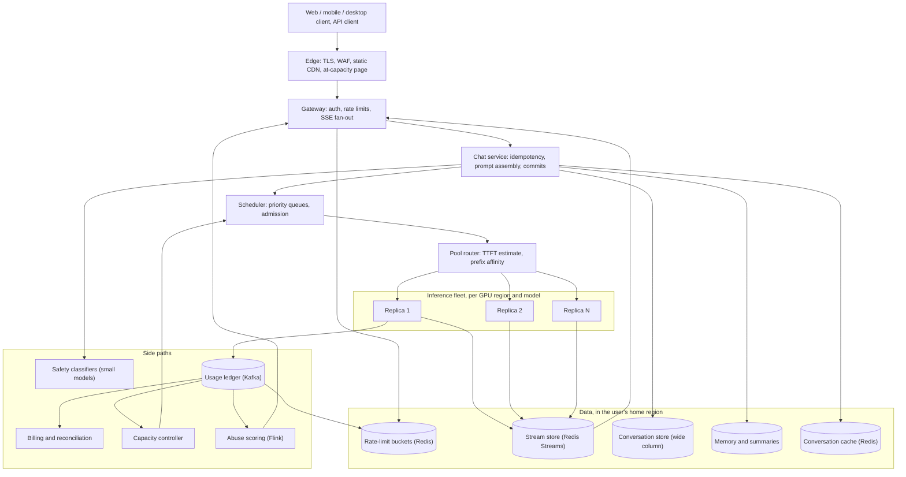
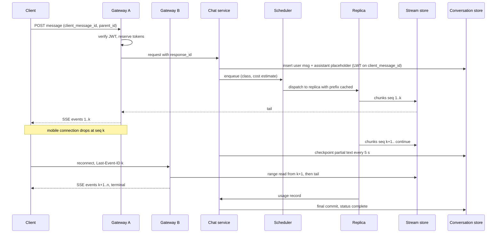
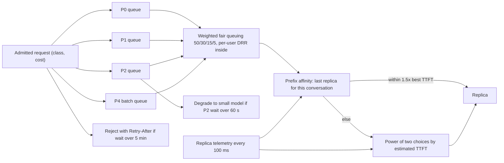
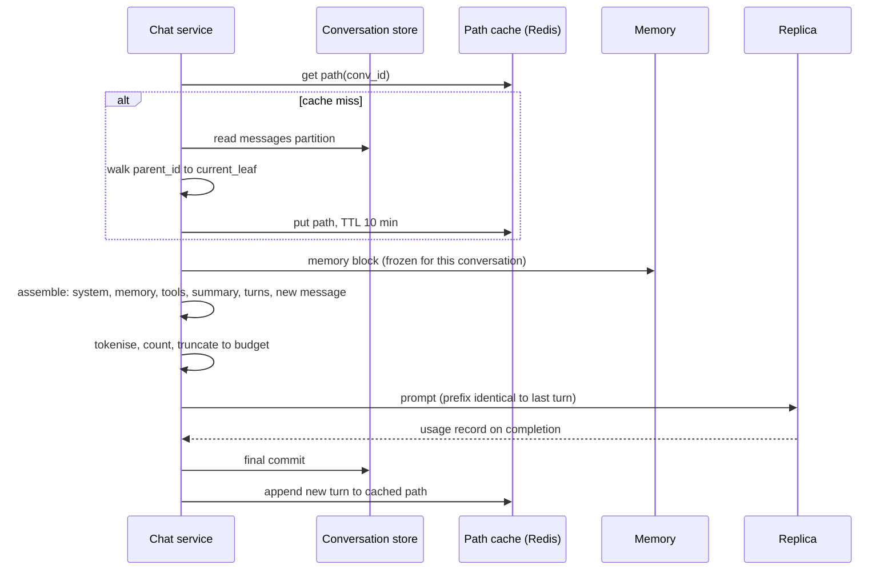

# ChatGPT — Senior Staff Engineer, 45-minute design

## Requirements

The framing is that inference works: there is a trained model and it runs on a GPU box. The question is how one model on one box becomes a service for 300M people a day. My lens on this panel is the request path between the user and the GPU, and the data that surrounds that path: the gateway, limits, streaming, the queue in front of the fleet, the conversation store, and the ledger that tells us what we served and to whom. I will cover the inference engine only deeply enough that the routing and capacity story hangs together; batching and KV cache internals belong to the Distinguished Engineer.

**Functional**

- Chat: a user sends a message in a conversation and receives a streamed response. They can stop it, regenerate it, edit an earlier message (which forks the conversation), and pick a model.
- Conversations persist: a sidebar lists them, they sync across devices, they can be deleted, renamed, searched by title, and shared by link.
- Tiers: Free, Plus, Team, Enterprise, and the API. Each has different limits, different priority when the fleet is full, and for the API, per-token billing.
- Memory: facts the assistant learns about the user across conversations, visible and editable by the user.
- Attachments, tools (browsing, code execution) and voice exist. I will treat them as "the prompt gets bigger and the response has non-text parts" and not design them here.
- Safety: policy classification on input and output; abuse controls on accounts and traffic.

**Non-functional**

- Scale: 800M weekly users, 300M daily, and I will assume 10 user messages per daily user, so 3B user messages a day. Peak is about 3x the daily average, when the US afternoon overlaps the European evening.
- Latency: time to first token (TTFT) P50 under 1 s and P95 under 3 s on the chat product; steady decode of at least 20 tokens/s per stream (reading speed is around 5 tokens/s, 20 feels instant). API customers care about throughput and predictable 429s more than TTFT.
- Availability: the send-message path 99.9%. GPUs are scarce and I will not promise four nines on compute. The read path (open the app, see history) 99.99%, and it must work even when the fleet is at capacity.
- Durability: once the client sees the terminal event, the message is never lost. A partial response survives a gateway or chat-service crash.
- Correctness where money is: API usage metering within 0.01% of what the engine actually generated, and no double billing on retries.
- Residency: an EU user's transcripts stay in the EU at rest. Whether compute may leave the region depends on the contract.
- Cost: GPUs dominate. Any choice that saves prefill tokens or idle GPU seconds beats one that saves CPU or storage.

## Estimates

I will round hard; what matters is knowing which numbers are big.

| Quantity | Value | How |
|---|---|---|
| Daily active users | 300M | Given |
| User messages per day | 3B | 300M x 10; skewed, median user sends 3, power users 100+ |
| Message rate | 35K/s average, 100K/s peak | 3B / 86,400 s; peak about 3x |
| Mean response | 400 output tokens, ~20 s of streaming | At 20 tokens/s; code and essays run to 2K tokens |
| Mean prompt | 2K tokens, of which ~1.5K is prior turns | Conversations average 5 turns and every turn re-sends the history |
| Concurrent generations at peak | 2M | Little's law: 100K/s x 20 s |
| Peak decode throughput | 40M tokens/s | 2M streams x 20 tokens/s |
| Peak prefill throughput | 200M tokens/s offered, ~70M/s after prefix cache | 100K/s x 2K; ~65% of prompt tokens are cached prefixes if turn N lands on the replica that served turn N-1 |
| GPU fleet, rough | ~25K 8-GPU nodes, ~200K GPUs | A node holds ~100 resident sequences at 20 tokens/s each, so ~2K output tokens/s; 40M / 2K = 20K nodes for decode, plus ~5K for prefill. The DE will correct this |
| Open streaming connections at peak | 5M | 2M generating plus idle tabs holding an event channel; 50K per gateway node is 100 nodes, run 200 |
| Message rows written per day | 6B final, ~30B including partial checkpoints | User plus assistant per exchange; 70K/s average, 200K/s peak finals, plus a checkpoint every 5 s per active stream (400K/s peak) |
| Transcript bytes | ~2 KB per exchange, 12 TB/day raw, ~4 TB/day compressed | 400 tokens x 4 B plus metadata; ~1.5 PB/year compressed |
| Conversation loads | 2B/day, 70K/s peak | Every open of an existing thread, plus one per turn for prompt assembly (served from cache) |
| Sidebar list reads | 1B/day, 35K/s peak | Every app open and focus |
| Rate-limit operations | 200K/s peak | One reserve at admission and one settle at completion per message |
| Stream-store writes | 4M/s peak | Tokens batched into a chunk every 100 ms per stream; 2M streams x 10/s / 5 |
| Usage ledger | 3B records/day, ~300 B each, ~1 TB/day | One record per completion; the billing and capacity source of truth |
| Safety classifier calls | ~10B/day | One on input, several windows per output; each ~1% of the main model's cost |

Three numbers shape the design. 2M concurrent streams makes streaming a connection-state and resume problem, not a request/response problem. 40M output tokens/s against a fleet that cannot grow in under a quarter makes admission control the product's real availability story. And 400K partial writes/s of messages that are not finished at the moment they are written makes the conversation store's write path different from a normal chat app's. Everything else is a large but ordinary web service.

## High-level design



**Send a message.** The client POSTs to `/conversations/{id}/messages` with a client-generated `client_message_id`, the text, the model, and the parent message id. The edge terminates TLS. The gateway verifies the session JWT locally (no call), looks up the tier and the account's abuse score from a small cache, reserves budget in the rate limiter (one Redis Lua call, about 1 ms), opens the SSE response, and hands the request to the chat service with a fresh `response_id`. The chat service does the idempotency check, loads the conversation path (5 ms from cache, 20 ms from the store), writes the user message and a placeholder assistant message, assembles the prompt, and kicks off the input safety classifier in parallel. The scheduler classifies the request into a priority class and admits it when the pool router reports headroom; under normal load this is under 10 ms and under overload it is where the waiting happens. The replica prefills (100 to 500 ms depending on prompt length and cache hits), then decodes, writing chunks to the stream store keyed by `response_id`. The gateway tails that stream and pushes SSE events. On completion the replica emits a usage record, the chat service commits the final message, the rate limiter settles the reservation against the true token count, and the gateway sends the terminal event.

**Open the app.** The sidebar is one partition read by `user_id`, cached for 60 s. Opening a conversation is one partition read by `conversation_id`. Neither touches the GPU fleet, which is why the read path can be 99.99% while compute is not.

**API call.** Same path minus the conversation store: the API is stateless, the prompt arrives whole, and there is no sidebar. The API's limits, priority, and metering differ, and I call those out below.

## Deep dive: gateway, limits, and the streaming path

**Auth.** Consumer sessions are JWTs with a one-hour expiry and a refresh token; the gateway validates signatures locally and never calls an auth service on the hot path. API keys are hashed and resolved through a cache to `(org_id, tier, limits, allowed models)`. The gateway is stateless with respect to sessions and stateful with respect to open streams: it holds the client socket, nothing more.

**Limits by tier.** My assumed numbers, per user unless noted: Free gets 10 flagship-model messages per 5 hours, then an effectively unlimited fallback to a small model, and one generation in flight at a time. Plus gets 160 flagship messages per 3 hours, three in flight, and a larger context window. Team is Plus per seat plus a shared org pool. Enterprise has no per-user caps but an org-level throughput contract in tokens per minute and a higher priority class. The API has per-org requests-per-minute and tokens-per-minute by spending tier, per model: something like 500 RPM and 30K TPM at the bottom to 10K RPM and 30M TPM at the top.

**Tokens, not requests.** A request is not a unit of cost. A 20-token "hi" and a 100K-token pasted document are both one request, and they differ by four orders of magnitude in prefill work. The product shows "messages" because that is what users understand, but internally every limit is a budget of weighted tokens: `cost = uncached_input x 1 + cached_input x 0.1 + output x 4`. The weights track GPU seconds: output tokens are decode-bound and each one is a full forward pass, cached input is almost free. A consumer "message" limit becomes a token budget with a per-message cap, and the UI translates back to a message count using the median cost. This is what stops one user pasting a novel ten times from consuming a hundred times another user's ten messages.

**Token bucket versus sliding window.** The API uses a token bucket per `(org, model)` for both TPM and RPM: capacity is one minute of allowance, refill is continuous. Buckets allow bursts and are what API clients expect. The consumer product uses a sliding window, because "10 per 5 hours" is a product promise with a countdown in the UI, and a bucket's refill would drift from the promise. I implement the sliding window as two fixed-window counters (current and previous, weighted by overlap): O(1) memory per user, about 1% error at the boundary, versus a sorted set with one member per message, which is exact but 100x the memory at 3B messages a day. Both live in Redis, sharded by user, with a Lua script for atomic check-and-reserve.

**Reserve, then settle.** At admission we do not know the output length. The reservation is `prompt_tokens` (known, we tokenised during assembly) plus the per-model rolling median output (~400) capped by `max_tokens`. At completion the usage record carries the true count and a second Lua call settles the difference; if the true cost was higher the budget goes negative and the user's next window starts later. Without reservation a Plus user with three concurrent streams can overshoot the limit by three responses; with it the error is bounded by one response. Reservations carry a 10-minute expiry so a crashed generation does not leak budget forever.

**Streaming transport.** Server-Sent Events over HTTP/2. It is unidirectional, which is all a response needs; it is plain HTTP, so every proxy, CDN, and corporate firewall passes it; browsers give us reconnect and `Last-Event-ID` for free; and it multiplexes with the rest of the app's HTTP/2 connection. WebSocket is reserved for voice, where audio flows both ways. A gateway node holds 50K open HTTP/2 streams comfortably; 5M peak connections is 100 nodes, and I run 200 for headroom and rolling deploys.

**Decouple the socket from the generation.** The replica never writes to the client socket. It writes to a stream store: Redis Streams keyed by `response_id`, entries of `(seq, delta_text, events)`, batched into a chunk every 100 ms or 10 tokens, whichever first, with a terminal entry on completion and a TTL of 10 minutes after that. The gateway tails with a blocking read and forwards. The cost is 4M chunk writes/s at peak across a sharded cluster of 100 nodes at 40K ops/s each, and memory of about 2M active streams x 2 KB plus 10 minutes of completed streams, roughly 150 GB in total. The 100 ms batching means tokens arrive in bursts of two, which is invisible.

**Resume after disconnect.** The client reconnects with `response_id` and the last `seq` it rendered (SSE's `Last-Event-ID`). Any gateway node serves it: a range read from `seq+1`, then tail. No affinity is needed, which matters because a mobile client on a new cell tower lands on a different node. If the stream has completed, the replay ends with the terminal event. If the stream has expired, the client fetches the committed message from the conversation store. The generation keeps running for 60 s with no subscriber, then is cancelled and the partial is committed as `interrupted`, because 2M streams of GPU time for users who have closed the tab is real money and typical mobile disconnects are under 10 s.

**Idempotency.** The client generates `client_message_id` once per send, not per retry. The chat service does a conditional insert on `(conversation_id, client_message_id)`. If the row exists it returns the existing `response_id` and the client attaches to that stream. This covers a timed-out POST, a double tap, and an app crash mid-send. Stop is a cancel on `response_id` and is idempotent too. Regenerate is a new send with a new id and the same parent, which produces a sibling in the tree.

**Backpressure.** From GPU to client the decode rate is the natural limit; a client cannot ask for more than the replica produces. From client to GPU is the direction that matters: a slow client must never stall a decode step, because each step is a batch of 100 sequences and a stalled slot wastes the whole batch's share. The stream store absorbs this: the replica writes at its pace, the gateway reads at the client's pace, and a client that is 10 KB behind simply has 10 KB of chunks waiting in Redis. If a stream-store shard is unhealthy, the replica buffers 64 KB locally and then fails the stream loudly rather than blocking the batch. Overload backpressure lives upstream of the GPU in the scheduler, not at the socket.



**Alternatives.** WebSocket everywhere: bidirectional is unnecessary for text, proxies and load balancers make it sticky, and resume has to be built by hand. Long polling: doubles the request rate and produces chunky rendering. gRPC streaming to browsers needs grpc-web and a translating proxy. Direct replica-to-socket streaming with no store is the fastest by a few milliseconds, but a gateway restart makes 50K in-flight generations invisible, there is no resume, and a second device cannot attach; the store is worth its 150 GB.

## Deep dive: admission control and routing to the fleet

The fleet is fixed on any timescale that matters to a request. GPUs are not autoscaled in 30 s; they are ordered in quarters. So the design accepts that demand exceeds supply at peak and makes the decision about who waits explicit, rather than letting it fall out of TCP timeouts.

**Structure.** Gateway and chat service hand admitted requests to a scheduler per (user region, model pool). Scheduler nodes hold priority queues in memory, mirrored to Redis so a scheduler crash loses nothing; a request is also durable in the chat service's placeholder row, so at worst it is re-enqueued. The scheduler dispatches to a pool router in a GPU region, which picks a replica. A global capacity controller adjusts class weights and cross-region spill every 10 s from the usage ledger and replica telemetry.

**Priority classes.** P0: API customers with provisioned throughput, and Enterprise chat. They paid for a reservation and they get it. P1: Team and Plus. P2: Free on the flagship model. P3: Free on the small fallback model, which is cheap enough that it is almost never queued. P4: the batch API, which has an hours-long SLA at half price and exists to fill the troughs. Between classes I use weighted fair queuing with weights of roughly 50/30/15/5 for P0 to P3, not strict priority, so Free never fully starves and Plus does not sit behind an enterprise burst. Within a class I do deficit round-robin over per-user queues, so one user with three long requests does not push out a hundred users with one each; per-user concurrency caps enforce this before enqueue.

**Cost-aware admission.** Every request carries the estimated cost from the rate limiter: uncached prompt tokens and expected output. The scheduler models each pool's capacity as prefill tokens/s and decode slots, and admits when the router reports headroom for that cost. A request is not a slot; a 100K-token document takes a hundred "hi" requests worth of prefill and the queue accounts for it that way.

**What the user sees under overload.** Expected wait under 5 s: nothing except a slower TTFT. Between 5 and 60 s: "high demand", a queue position, updated every 5 s over the already-open SSE stream. Beyond 60 s of expected wait for a Free user (or immediately when P2 backlog exceeds a minute), the request is served by the fallback model with a visible note, unless the user chooses to wait. Beyond a 5-minute estimate for anyone, the gateway rejects with a `Retry-After` and the client shows the at-capacity page, which is static on the CDN and touches nothing. API requests never queue for more than 10 s; they get a 429 with `Retry-After` and remaining-budget headers, because API clients have exponential backoff and holding their request only burns their timeouts. Provisioned customers are admitted from their own reservation and see a 429 only when they exceed it. Shedding order is always the same: batch first, then Free degrades to the small model, then Plus queues; queue depth per class is the alarm.

**Why least-connections fails for LLM traffic.** First, a connection is not a unit of work: prefill cost varies by 1000x between requests, so the replica with the fewest connections may be mid-way through a 100K-token prefill that will stall every decode step on that box for half a second. Second, decode throughput per stream degrades with resident sequences: a replica at 150 sequences produces tokens slower for each one than at 50, and a connection count says nothing about KV memory. Third, prefix locality: turn 6 re-sends turns 1 to 5, and if it lands on the replica that still holds those KV blocks, prefill drops by 60 to 70%; least-connections scatters a conversation across the pool and throws that away. Fourth, requests live for 20 s, so a burst that arrives in the 100 ms before counts update all piles onto the same replica.

**My router.** Each replica pushes state every 100 ms: queued prefill tokens, active sequences, free KV blocks, and the set of conversation prefixes it holds (a recency list, not a bloom filter, since the router itself made the placements). Placement is: (a) preferred replica is the one the router last sent this conversation to, if within 10 minutes; (b) use it if its estimated TTFT, which is queued prefill tokens divided by prefill rate plus a check that decode is not saturated, is within 1.5x of the pool's best; (c) otherwise, power-of-two choices among replicas with enough free KV blocks for the estimated sequence length, picking the lower estimated TTFT. Estimated TTFT is the balancing signal because it is the thing the user feels, and the 1.5x tolerance is what keeps the prefix cache hit rate near 65% instead of chasing the last 10 ms and losing 500 ms of prefill.



**Enough of the engine.** A replica runs continuous batching: every decode step advances all resident sequences by one token, and new sequences join the batch between steps. Prefill is compute-bound, decode is memory-bandwidth-bound, which is why the two are often chunked or split onto separate replicas. The KV cache costs on the order of 300 KB per token for a large model, so an 8K-token conversation is about 2.5 GB and a node holds 100 to 200 resident sequences after weights. Prefix caching keeps KV blocks for shared prefixes: the system prompt, which everyone shares, and the conversation history, which each turn shares with the last. My router treats a prefill pool and a decode pool as two hops if the DE chooses disaggregation; affinity then applies to the prefill hop.

**Alternatives.** A single FIFO: Plus waits behind Free and enterprise SLAs break. Strict priority: Free starves for hours at peak and the funnel dies. A single global queue: the queue becomes the bottleneck at 100K/s and adds a cross-region round trip to every request; per-region schedulers with a slow global controller are the right split. Autoscaling: not on the request timescale, but the controller does shift traffic between GPU regions.

## Deep dive: conversation storage and prompt assembly

**Data model.** Four tables and one index.

```text
conversations   PK conv_id            user_id, org_id, title, model, created_at, updated_at,
                                      current_leaf_id, deleted_at, retention_class, share_id
messages        PK (conv_id, msg_id)  msg_id is a time-ordered ULID; parent_id, role,
                                      content parts, model, status {streaming, complete,
                                      interrupted, cancelled}, input_tokens, output_tokens,
                                      cached_tokens, safety_flags, client_message_id, response_id
user_conversations  PK (user_id, updated_at desc, conv_id)   title, preview, model   (sidebar)
shares          PK share_id           snapshot of the visible path, created_at, revoked_at
memory          PK user_id            list of {fact, source_conv_id, created_at}, capped ~100
```

A conversation is a tree, not a list: edit and regenerate create siblings under the same parent, and the visible transcript is the path from the root to `current_leaf_id`. I store `parent_id` and walk the path in memory after loading the partition. Conversations are capped at 1K messages, about 2 MB; past that the client starts a new one seeded with a summary.

**Store choice.** A wide-column store of the Cassandra/Scylla family, with messages partitioned by `conv_id` and the sidebar partitioned by `user_id`, replication factor 3 in the home region and an async replica in a sibling region inside the same residency zone. The reasons: 200K final writes/s plus 400K checkpoint writes/s of about 2 KB each, an append-mostly pattern, every read is a single partition, there are no cross-entity joins, TTL is native for retention, multi-DC replication is built in, and 1.5 PB/year of growth would mean continuous resharding on a relational fleet. I considered sharded Postgres keyed by `user_id` (Vitess-style); it gives a transaction across the message insert and the sidebar update, and I would take it at a tenth of this scale. At this scale the lack of native TTL and the resharding burden drove me off, and I get the transaction-like behaviour I need from a logged batch to the two partitions plus idempotent replays. Hot partitions: a 1K-message conversation is one 2 MB partition, fine; a power user with 50K conversations is a 10 MB sidebar partition, which I page and, if it grows, bucket by month.

**Write path for a streamed message.** On send, one logged batch inserts the user message (`complete`) and the assistant placeholder (`streaming`, with `response_id`) into the conversation partition and updates the sidebar row. That placeholder is the durable record that a response is in flight, and it is what a second device sees. During generation the stream store is the live buffer; every 5 s or 500 tokens the chat service checkpoints the accumulated text into the assistant row, overwriting the content column, status still `streaming`. That is 400K writes/s at peak and the largest write load on the store. I chose 5 s because a crash then costs at most 5 s of tokens, which the resume path refills from the stream store anyway; the checkpoint protects against the stream store's TTL and against Redis losing a shard. Checkpoints carry the `seq` they cover and a later `seq` always wins, so a delayed checkpoint cannot overwrite a newer one. On completion the final write carries full content, token counts and `complete`, updates `updated_at`, and only then does the gateway send the terminal event: the client can treat terminal as durable. On cancel or replica death the row becomes `interrupted` with what we have, and the UI shows the partial with a "continue" affordance. Titles are generated by a small model after the first exchange, asynchronously.

**Read path.** Opening a conversation reads `conversations` by id (and checks `user_id` or a share), reads the messages partition, computes the path to `current_leaf_id`, and returns the last 50 messages on the path with a cursor for older ones. The assembled path is cached in Redis for 10 minutes for active conversations because the same path is loaded again on every turn for prompt assembly, and that cache is what makes the per-turn load 5 ms. The sidebar is the first page of `user_conversations`, cached 60 s and invalidated on write. Title search is a filter over the cached list for users with under 1K conversations and a small per-user inverted index beyond that.

**Retention and deletion.** A user delete sets `deleted_at`, removes the sidebar row immediately, and a sweeper purges the partition after 30 days; the window allows undo and satisfies the "deleted within 30 days" policy. Temporary chats get a 30-day TTL, never appear in the sidebar, and never feed memory. Enterprise orgs set a retention class per org, including zero, which means the assistant message is never committed beyond the stream store's 10 minutes and the client keeps the transcript. Deletion cascades to memory facts whose `source_conv_id` matches, to the share snapshot, and to any consented export for training or evaluation, which is keyed by `conv_id` so a delete event tombstones it. Backups are 30-day encrypted snapshots, so deleted data can persist there up to 30 days, and that is the disclosed policy.

**Cross-device sync.** The store is the truth and there is one event channel per user, a Redis stream keyed by `user_id`, which every open client subscribes to over its SSE connection alongside any response it is watching. The chat service publishes `conversation_updated` and `response_started` events. A phone opening the sidebar while the desktop is mid-stream sees the conversation, opens it, finds the placeholder with its `response_id`, and attaches to the stream from `seq` 0. Two devices sending into the same conversation concurrently is a conflict I do not merge: the second send carries a stale `parent_id`, the server rejects it with "conversation moved", and the client refreshes.

**Shared links.** A share is an immutable snapshot of the visible path at share time, stored under an unguessable `share_id`, readable without auth, and cached at the CDN for 5 minutes. Deleting the conversation or revoking the share deletes the snapshot and purges the CDN. Snapshot rather than live view because the sharer should know exactly what they shared and later turns must not leak; the cost is a copy of a few KB per share.

**Prompt assembly.** The order is: system prompt (fixed per model and surface), the memory block, tool definitions, the conversation path oldest first, then the new user message. For a 128K-token model I reserve 8K for output and about 3K for system, memory and tools, and the rest is history. When history exceeds the budget I do not truncate blindly. First, tool outputs older than the last three turns are dropped; they are bulky and rarely referenced again. Second, the oldest turns are replaced by a rolling summary: once a conversation passes half its budget, a small model produces a summary asynchronously and it is stored as a summary message on the branch with the id of the last message it covers, so the assembled prompt becomes `[system][summary through message k][messages k+1..n]`. Third, if still over, the oldest turns are hard-truncated. The summary is built off the request path, so the turn that first needs it does not pay for it; if it is not ready, that turn truncates and the summary is there for the next.

**Prefix-cache friendliness.** The assembled prompt must be byte-identical up to the new message across turns, or the KV prefix cache misses and the fleet pays a full prefill. So anything dynamic, the date, the memory block, the tool list, sits in the fixed head and is frozen for the conversation's lifetime. Memory is loaded at conversation start and only refreshed for a new conversation. A system-prompt deploy invalidates every conversation's cached prefix once, which is acceptable on a deploy cadence and would be a disaster on a per-turn one.

**Memory.** When a conversation goes idle for 10 minutes, an async extractor (a small model) reads the new turns and proposes facts, deduplicated against the existing list by embedding similarity, and appends to the user's memory row. The user sees each fact and can delete it. The list is capped at about 100 facts, or 2K tokens, and the whole block goes into the prompt head; it is a cached prefix so it is nearly free. When memory grows to thousands of facts it becomes a retrieval problem, top 20 by relevance per new conversation, and that is a later milestone, not this design.



## Deep dive: metering, observability, and abuse

**The usage ledger.** The replica emits one usage record per completion or cancellation: `request_id`, `response_id`, user, org, model, GPU region, replica, input tokens, cached tokens, output tokens, TTFT, total time, finish reason, and safety outcome. About 300 B, 3B a day, 1 TB a day, onto Kafka partitioned by `org_id`. Four consumers: API billing, the rate limiter's settle, capacity planning and per-model cost dashboards, and abuse scoring. The gateway emits a shadow record from what it streamed, and a reconciler compares the two; the replica's is the truth because only the engine knows the true token count, and the shadow catches a broken replica.

**Exactly-once-ish billing.** The billing consumer upserts each record into a usage table keyed by `request_id`, and the aggregator sums by `(org, model, hour)` from that table, so a replayed Kafka record cannot double-bill. A client retry with the same idempotency key is one `request_id` and one charge; a retry with a new key that produced two generations is two charges, which is correct. Monthly invoices come from the aggregate, and a reconciliation job compares against per-replica counters; a discrepancy above 0.01% blocks the invoice run rather than shipping a wrong bill. This is the Spotify royalty pattern again: at-least-once delivery plus an idempotent sink keyed by an id minted upstream.

**Observability.** Every request carries `response_id` as the trace id through gateway, chat service, scheduler and replica. The metrics I page on: queue wait P95 per class, TTFT P95, tokens/s per stream P5 (the slow tail is what users feel), stream-store lag, checkpoint write failures, rate-limit reject rate by tier (a sudden rise means a bucket bug, not a demand spike), and fleet token throughput against the capacity model. Sampling is 100% of usage records, 100% of errors, 1% of full traces.

**Safety classifiers.** Input: a small classifier runs on every user message in parallel with prompt assembly and prefill, about 20 to 50 ms, and does not add to TTFT unless it blocks, in which case the request is cancelled before or during prefill. Output: the stream is classified on a sliding window every 64 tokens plus once at completion. If a window trips, the gateway cuts the stream, the message is replaced with a refusal, and the row is marked. The window means up to 64 tokens of a bad response reach the screen before the cut; that is the trade for not buffering the whole response. Classifiers run on their own small pool, CPU or small GPUs, and never wait in the main scheduler's queue; they cost about 1 to 2% of the main model's compute.

**Abuse.** Three layers. At the edge: IP reputation, bot signatures, signup velocity, and a CAPTCHA at signup or on anomaly. At the account: age, payment status, device count, and a score that selects which limit table applies, so a day-old free account gets a tighter bucket than a year-old one. On traffic: a Flink job over the usage ledger looks for account farms, which show up as many accounts sending near-identical prompts at machine cadence, and pushes updated scores to the gateway's cache within seconds. The sharp signals are prompt diversity and inter-arrival timing, not volume; a real power user is bursty and varied.

## Multi-region

There are three kinds of location and they do not line up. User-facing regions, around ten, each with edge, gateway, chat service, stream store and conversation store; every user has a home region set by residency. GPU regions, perhaps five to eight large sites where the power is, chosen by megawatts rather than by users. And a thin global control plane: accounts, billing, the capacity controller's weights.

**Where data lives.** The user's home region holds transcripts, memory, the path cache and the stream store, replicated asynchronously to a sibling region in the same residency zone (say EU-West and EU-Central). The GPU region persists nothing: the assembled prompt goes over the private backbone in memory, 30 to 80 ms of round trip once, and the tokens come back to the home region's stream store. That one round trip is the price of not putting GPUs everywhere, and it is well inside the TTFT budget. Contracts that require in-region compute get a restricted pool and, when that pool is full, an at-capacity response instead of spillover; that is disclosed up front. The KV prefix cache is per GPU region, so spilling a conversation to another region means a cold prefill; the capacity controller keeps a conversation in its GPU region for its lifetime and spills only new conversations.

**A GPU region goes dark.** Say the site with 30% of the flagship model's capacity fails. The capacity controller re-weights within 10 s. In-flight generations there die: if fewer than 50 tokens had been emitted the chat service retries once, transparently, on another region; past that the user sees an interrupted message with a retry button, because silently producing a second half-answer is worse. Now demand exceeds supply by 30% and the scheduler does what it was built for: batch is shed, Free degrades to the small model, Plus sees 10 to 30 s waits with a queue position, and Enterprise is protected by its reservation. The status page is driven by the same queue-depth signal. The outage becomes waits and downgrades, not errors; that is what I mean by the request path being graceful.

**A user region goes dark.** Anycast and DNS fail over to the sibling region. The conversation store replica is seconds behind, so the last message or two may be missing on the replica; the client still has them locally and re-sends with the same `client_message_id`, so the idempotency path does double duty as the recovery path.

## Trade-offs

| Decision | Chose | Alternative | Why |
|---|---|---|---|
| Streaming transport | SSE over HTTP/2 | WebSocket everywhere | One direction is all a response needs; SSE passes every proxy and gives resume for free; WebSocket kept for voice |
| Socket and generation | Decoupled via a stream store | Replica writes to the socket | Resume on any gateway, second-device attach, gateway restarts do not orphan 50K generations; costs 150 GB of Redis |
| Unit of limits | Weighted tokens | Requests | Requests differ 1000x in cost; tokens track GPU seconds |
| Consumer limiter | Sliding window, two-counter approximation | Token bucket | The product promise is windowed with a countdown; 1% boundary error at O(1) memory |
| API limiter | Token bucket per org and model | Sliding window | Clients expect bursts and RPM/TPM semantics |
| Output cost | Reserve then settle | Count after completion | Bounds overshoot to one response instead of concurrency x responses |
| Scheduling | Weighted fair queuing with per-user DRR | Strict priority or FIFO | Free must not starve, Plus must not wait behind enterprise bursts, one user must not hog a class |
| Replica selection | Estimated TTFT with prefix affinity, power of two | Least connections | Connections do not measure prefill cost, KV pressure, or cache locality |
| API under overload | 429 within 10 s | Queue like chat | API clients back off; holding their request burns their timeout |
| Conversation store | Wide column, partition per conversation | Sharded Postgres by user | Native TTL, multi-DC, 1.5 PB/year without resharding; lose cross-table transactions, which a logged batch covers |
| Partial writes | Checkpoint every 5 s | Per token, or final only | Per token is 40M writes/s; final only loses everything on a crash; 5 s bounds loss to what resume refills |
| Shared links | Immutable snapshot | Live view | The sharer knows what they shared; later turns cannot leak |
| Long histories | Async rolling summary, then truncate | Truncate only | Keeps early context for long conversations without paying for it on the request path |
| Data and compute | Data in home region, compute wherever capacity is | Colocate both | GPUs live where the power is; one 50 ms hop is cheaper than an idle GPU region |

The recurring theme: correctness budget goes to the two places money moves (the API usage ledger and the rate limiter), latency budget goes to TTFT, and everything else is allowed to be a few seconds stale, a few percent approximate, or downgraded under load, because the user cannot tell and the GPUs are the scarce thing.

## Pitfalls

**Least-connections in front of the fleet.** Someone will put a standard L7 balancer in front of the replicas because it is there. It scatters conversations, kills the prefix cache, and lands heavy prefills on already-loaded boxes. The router's telemetry-driven placement is not an optimisation; it is a third of the prefill fleet.

**Rate-limit reservations that never settle.** A crashed generation whose usage record never arrives leaves a reservation in the bucket. The 10-minute expiry on reservations is the guard, and the metric to watch is reserved-but-unsettled budget per tier.

**Idempotency key per attempt instead of per send.** If the client mints a new `client_message_id` on retry, every network blip becomes two generations and two charges. The key is generated when the user presses send and stored in the client's outbox until the terminal event.

**Prompt changes that break the prefix cache.** Adding the current time to the system prompt per turn, or reordering tool definitions, silently drops the cache hit rate from 65% to zero and doubles prefill load. Prompt-assembly changes need a prefix-stability check in CI and a cache-hit-rate alarm in production.

**Checkpoint races.** Two checkpoints for the same message in flight, the later `seq` arriving first: last-writer-wins by wall clock would roll the message backwards. Checkpoints are conditional on `seq` being higher than what is stored.

**Hot partitions.** A viral shared link is a single `share_id` read millions of times; the CDN absorbs it. A power user's 50K-conversation sidebar partition is bucketed by month. A single enterprise org's API traffic on one Kafka partition is the ledger's hot spot; partition by `(org_id, hash)` for the largest orgs.

**Memory contamination.** Facts extracted from a temporary chat, a shared conversation viewed by someone else, or a conversation the user later deletes. Extraction only runs on persistent, owned conversations, every fact records its source, and deletion cascades by source.

**Tokenizer drift.** The rate limiter, the billing ledger, and the model must count tokens with the same tokenizer version. A model upgrade that changes tokenization changes everyone's bill if the gateway's copy lags; tokenizer version is part of the usage record and the reconciler checks it.

**The output classifier's window.** 64 tokens of a bad response reach the screen before the cut. Shrinking the window raises classifier cost linearly; buffering the whole response destroys the streaming experience. Keep the window short and measure the exposure rate rather than pretending it is zero.

**Zero-retention and the stream store.** Enterprise zero-retention still passes through 10 minutes of Redis. That must be in the contract language, or the stream store needs a per-org mode that holds chunks only in gateway memory and gives up resume.

## Open questions for the panel

1. **Disaggregated prefill and decode.** My router assumes one hop with prefix affinity on the replica. If the DE wants prefill and decode on separate pools with KV transfer between them, affinity moves to the prefill pool and the decode pool becomes a slot allocator, and the TTFT estimate has to include the transfer. Which way is the fleet going, and does the 65% cache hit rate survive it?
2. **Automatic degradation versus visible waiting.** I degrade Free to the small model after a 60 s expected wait. A product owner might prefer that users see the wait and choose, because a silent downgrade reads as "the model got worse". This is a product call that changes what the scheduler does with P2 under overload.
3. **Zero-retention contracts and resume.** I hold every stream in Redis for 10 minutes so any gateway can resume it. Is that acceptable under zero-retention enterprise terms, or do those orgs need a memory-only path and lose resume and second-device attach?
4. **Org-scoped access to transcripts.** My storage is partitioned by conversation and by user, which serves the product perfectly and serves an enterprise eDiscovery or audit query ("everything this org's users said about X in March") not at all. Do we need a secondary org-scoped index, or is a nightly export to the org's own store enough?
5. **How real is the prefix-cache assumption?** My fleet estimate carries about 5K nodes of prefill on the belief that routing keeps 65% of prompt tokens cached. Under overload, spill between replicas and regions eats into that. I would like the DE's measured hit rates under load before I trust the number, because at 30% the prefill fleet doubles.
