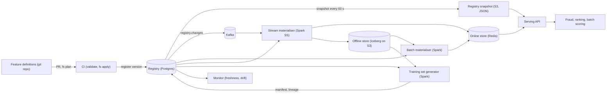
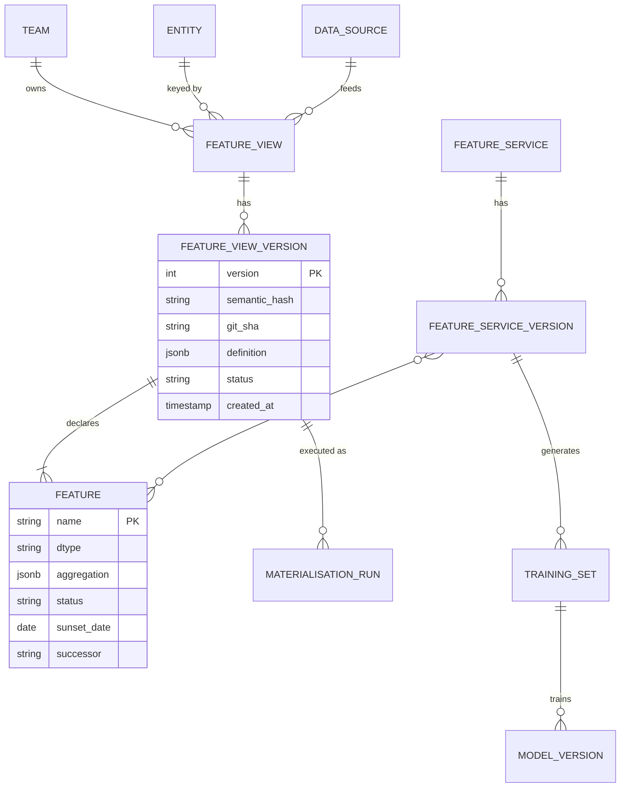
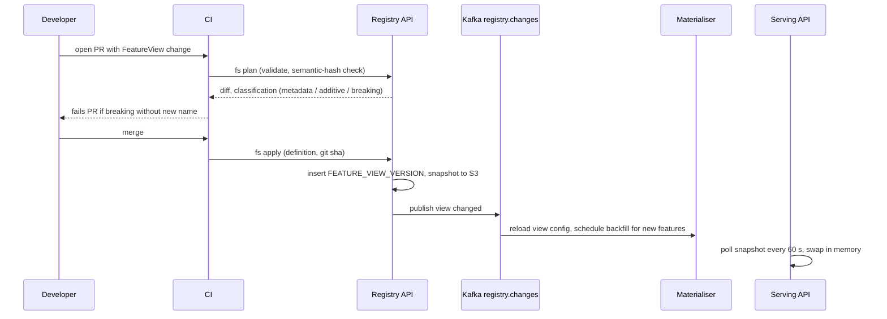

# Feature store — DE 01, feature definitions and the registry

Assumptions: AWS (S3 + Iceberg, EMR Spark, MSK Kafka, EKS, RDS Postgres, ElastiCache Redis). Definitions live in one git repo. The platform team of 8 owns the registry service; feature-owning teams own definitions.

## Requirements

Functional

| # | Requirement | Number |
|---|---|---|
| F1 | Declare a feature once, in code; the same definition drives batch, streaming, online serving and training sets | 5,000 features, +20 %/yr |
| F2 | Registry is the system of record: every consumer resolves definitions from it, never from a side document | 30 teams, 60 models |
| F3 | Immutable, versioned definitions; a value-affecting change can never silently alter an existing feature | 0 silent semantic changes |
| F4 | Lineage both ways: source column to feature to model version, and "which models use this column" | answer in < 1 s |
| F5 | Search and browse by name, entity, owner, tag, freshness, usage | 5,000 features, < 300 ms |
| F6 | Ownership, deprecation with sunset date and successor, retirement blocked while any live model depends on it | every feature has an owner |
| F7 | Point-in-time correct training sets over 3 years, driven by registry metadata (timestamp column, TTL, version) | 1,000 sets/month |

Non-functional

| # | Requirement | Number |
|---|---|---|
| N1 | Registry is never on the online hot path; serving works with the registry down | p99 fetch < 10 ms unaffected |
| N2 | Registry API availability (writes and control-plane reads) | 99.9 %, ~50 writes/day, ~5k reads/day |
| N3 | A registered change reaches materialisation and serving | < 5 min |
| N4 | Registry storage is small enough to snapshot and cache entirely | < 1 GB incl. history |

## Estimates

| Item | Estimate | Working |
|---|---|---|
| Definitions | 5,000 features in ~600 feature views, ~2 KB each, ~12 MB live; ~150 MB with 5 yr of versions and run history | 30 teams × ~20 views |
| Registry traffic | ~50 writes/day (CI applies), ~5k control-plane reads/day, serving reads a snapshot every 60 s per pod (~200 pods, 3 QPS) | trivial for one Postgres |
| Raw events | 2B/day = 23k/s avg, ~70k/s peak, ~200 B each = 400 GB/day raw, 150 GB/day Parquet | Kafka retention 7 d = 1 TB |
| Offline feature tables | 100M users × ~300 user features × 8 B = 240 GB per daily snapshot; 20M items × 100 features = 16 GB; change-only + Parquet ~40 GB/day; 3 yr ≈ 45 TB | S3 ~$1k/month |
| Online store | 120M entity rows × ~1.5 KB (latest values, serialised per view) = 180 GB; ×2 replicas = 360 GB Redis | ~$8k/month |
| Online reads | 200k lookups/s peak, each ~3 view fetches = 600k Redis ops/s | 20-node cluster |
| Compute | batch materialisation ~600 view jobs/day, ~300 Spark-node-hours/day; streaming 20 jobs always-on; training sets 1,000/month × ~30 node-hours | ~$40k/month |
| Total | ~$60k/month order of magnitude, dominated by Spark and Redis; registry itself < $500/month | one db.r6g.large + read replica |

## High-level design



Main flows

1. Define: engineer writes a feature view in Python in the git repo. CI runs `fs plan` (validation, diff, semantic-hash check), reviewers approve, merge runs `fs apply` which calls the registry API. The registry assigns an immutable version and publishes a change event.
2. Materialise batch: the scheduler lists active feature view versions with a batch source, builds a DAG by source table, runs one Spark job per view on its schedule, writes to the Iceberg feature table and upserts latest values to Redis. Job config comes from the registry, not from the job repo.
3. Materialise streaming: one Structured Streaming job per stream-sourced view; the aggregation spec (window, function) is read from the registry at job start and on change events. Writes to Redis and appends to the offline table so training sees the same values.
4. Serve online: the serving API loads the registry snapshot into memory (feature service to Redis key layout and schema id), fetches rows from Redis, decodes, returns. It never calls the registry synchronously.
5. Training set: caller passes a feature service version and an entity dataframe with event timestamps. The generator resolves each feature to its offline table, timestamp column and TTL from the registry, does the as-of join, writes Parquet plus a manifest (feature versions, data ranges, row count) back to the registry.
6. Monitor: freshness checker reads each view's SLA from the registry, compares against the newest event timestamp in Redis and Iceberg, alerts the owner on the registry's on-call channel.

## Deep dive: feature definitions and the registry

The hard part: 30 teams changing 5,000 definitions while 60 models depend on exact semantics. The registry has to be the thing that executes, not a description of something else, and it has to make a semantic change impossible to do quietly.

Obvious approach: a catalog (wiki, YAML in a data-catalog tool) that documents features that pipelines compute in each team's own repo. Why it breaks: the doc and the code drift within weeks; training and serving code are two implementations of the same doc, so parity is a hope; usage is not recorded, so "which model uses this column" is a Slack question; a team changes a window from 7 d to 30 d, the name stays, three models degrade and nobody knows why for a month. This is the status quo the brief describes.

What I would do instead: definition-as-code, compiled into the registry, content-hashed, and every downstream job derives its config from the registry at run time.

### A feature definition as data

| Field | Level | Example | Value-affecting |
|---|---|---|---|
| name | feature | `user_txn_amount_sum_7d` | yes (identity) |
| entity | view | `user` (join key `user_id`, dtype string) | yes |
| source | view | batch table `lake.transactions`, or stream topic `txn.events`, plus timestamp column `event_ts` | yes |
| transformation | view | Spark SQL string, or Python module path + git sha + image digest | yes |
| aggregation | feature | function `SUM`, column `amount`, window `7d`, slide `1h` (null for non-aggregated) | yes |
| dtype | feature | `float64`, `int64`, `string`, `bool`, `list<float32>[128]` | yes |
| ttl | view | 30 d (value older than this is null at serving and in training) | yes |
| schedule / freshness SLA | view | `daily 02:00 UTC`, SLA 26 h; or `streaming`, SLA 60 s | no |
| owner | view | team `payments-risk`, on-call channel, two named maintainers | no |
| description, tags | feature | free text, `pii`, `fraud`, `experimental` | no |
| version | view | integer, plus semantic hash of the value-affecting fields | derived |
| status | feature | active, deprecated (sunset date, successor), retired | no |

A feature view groups features that share entity, source, transformation and TTL; it is the unit of materialisation. A feature service is a named, versioned list of features a model consumes; it is the unit of serving and training.

Declared in code, one file per view, checked into `features/<team>/`:

```python
user_txn = FeatureView(
    name="user_txn_stats", entity=user, owner=Team("payments-risk"),
    source=StreamSource(topic="txn.events", ts="event_ts", batch_table="lake.transactions"),
    ttl=days(30), freshness_sla=seconds(60),
    features=[
        Feature("user_txn_amount_sum_7d", Sum("amount", window=days(7)), dtype=Float64, tags=["fraud"]),
        Feature("user_txn_count_1h", Count(window=hours(1)), dtype=Int64),
    ],
)
fraud_v3 = FeatureService(name="fraud_scoring", features=[user_txn["user_txn_amount_sum_7d"], ...])
```

### Registry schema



Postgres, one schema, ~12 tables. `definition` is the full JSON the CLI produced, so any component can reconstruct the exact object without the Python SDK. `DATA_SOURCE` carries kind, location, timestamp column and the list of columns each view reads (populated by the CLI from the SQL parse), which makes column-level lineage a join instead of a crawl. `TRAINING_SET` stores manifest URI, time range and row count.

### Registration, immutability, versioning

Registration path: `fs plan` in CI validates (entity and source exist, dtype allowed, name globally unique, no cycle in on-demand features, SQL parses) and prints a diff. On merge, `fs apply` calls `POST /views/{name}/versions` with the definition and git sha. Only the CI service account holds write scope; humans and other services are read-only. Git is the change process, the registry is the record; the git sha in each version ties them together.

Rules the registry enforces, not conventions:

| Change | Classification | What happens |
|---|---|---|
| Description, tags, owner, SLA, schedule | metadata | New version, same semantic hash, applied in place, no consumer action |
| Add a feature to a view | additive | New version; new feature backfilled by next run; existing consumers unaffected |
| Change aggregation, window, transformation, source, entity, dtype, TTL of an existing feature name | breaking | Rejected. A feature name is a promise about the value. The author must create a new name (`..._v2`) with `supersedes=` set, and deprecate the old one |
| Remove a feature | breaking | Rejected unless status is `retired`, which requires zero active model versions in lineage |

The semantic hash is SHA-256 over the canonical JSON of the value-affecting fields in the table above, per feature. It is what a training set manifest records, so a model trained on hash H is provably served the same definition. Versions are append-only rows; nothing is ever updated or deleted, only superseded.

Registration and change propagation:



### Lineage

Lineage is three joins, all populated as a side effect of normal operation, never by a crawler:

- Source to feature: `DATA_SOURCE.columns` + `FEATURE_VIEW_VERSION` from the CLI's SQL parse at registration.
- Feature to training set: the generator writes `TRAINING_SET` and its feature list (with semantic hashes) when it finishes.
- Training set to model: the training pipeline calls `POST /models/{name}/versions` with the training set id; the model registry integration is a one-line SDK call, and deployment is blocked in CI if it is missing.

"Which models use `lake.transactions.amount`": source column to views to features to feature service versions to training sets to model versions with status `deployed`. One query, under 100 ms on 150 MB. Same path answers "what breaks if I retire this feature" and drives the retirement block in F6.

### Discovery across 5,000 features and 30 teams

Postgres full text (`tsvector` over name, description, tags, owner, entity) plus `pg_trgm` for prefix and typo matches. At 5,000 rows this is under 10 ms; it would still be fine at 100k. No search cluster. Ranking: text match, then number of deployed models using the feature, then online QPS from serving metrics pushed hourly, then freshness health. Facets: entity, team, dtype, source, status, tag. Each feature page shows definition, owner, freshness now versus SLA, value distribution from the last materialisation run, and its consumers. The reuse signal that matters: "12 models already use this, healthy for 400 days" beats any description.

### Ownership and deprecation

Every view has a team, an on-call channel, and two named maintainers; CODEOWNERS in the git repo is generated from the registry so a review from the owning team is mandatory. Deprecation is a state machine: `active` to `deprecated` (sunset date at least 30 days out, successor required) to `retired`. On deprecation the registry emails every owner in lineage and the training set generator warns; after the sunset date it refuses new training sets from the feature unless `--allow-deprecated`. `retired` is only accepted when lineage shows zero deployed model versions; materialisation stops, Redis keys expire by TTL, offline history stays for audit.

### The registry drives every component

| Component | What it reads from the registry | What it writes back |
|---|---|---|
| Batch materialiser | active views with batch source, schedule, SQL, entity, TTL, output table | `MATERIALISATION_RUN` (rows, min/max event_ts, duration, status) |
| Stream materialiser | views with stream source, aggregation spec, SLA | run heartbeat, lag |
| Online store layout | key `{entity}:{id}`, field per view name, value = schema-id + serialised row; schema id = view version | none |
| Serving API | snapshot: service to views to features to dtype and schema id | hourly usage counts per feature |
| Training set generator | per feature: offline table, ts column, TTL, semantic hash | `TRAINING_SET` and manifest |
| Monitor | freshness SLA, owner, on-call, expected row counts from history | freshness status per view |

Serving reads a JSON snapshot from S3, not the database, so a registry outage delays changes but never affects a lookup (N1). The snapshot is the entire registry, about 12 MB gzipped to 2 MB, rewritten on every apply and reloaded by pods every 60 s.

## Trade-offs

| Decision | Chosen | Alternative | Why |
|---|---|---|---|
| Change process | git + CI as only writer | UI or API self-service edits | review, diff, blame for free; the registry stays a record, not an editor |
| Breaking change | new name, old deprecated | keep name, bump version, store both values online | doubles Redis for months and makes the name meaningless; a name should have one meaning forever |
| Definition storage | Postgres with JSON definition column | graph database for lineage | lineage is 3 to 5 joins on 150 MB; Postgres is what the platform already runs |
| Search | Postgres full text + trigram | OpenSearch | 5,000 rows; a cluster to search a spreadsheet is not worth 1 of 8 engineers |
| Serving config | S3 snapshot polled every 60 s | registry RPC on request, or Kafka push to pods | zero hot-path dependency; 60 s propagation is well within N3 |

## Pitfalls

- Letting anything but CI write to the registry. The first manual hotfix through the API is the day git and the registry diverge; lock the write scope to one service account from day one.
- Semantic hash over the wrong fields. Include TTL and timestamp column; exclude schedule. Getting this list wrong means either false rejections or silent changes.
- Views that are too wide. A 200-feature view re-materialises 200 columns when one changes; keep views to 5 to 30 features that share a source and cadence.
- Deprecating without a successor. Sunset dates pass, nobody migrates, the feature can never be retired. Require the successor at deprecation time.

## Open questions for the panel

1. Should a model be allowed to pin a feature service version that is older than the current one, and if so does the online store hold both serialisations, or do we only guarantee the latest per view?
2. On-demand (request-time) features: same registry object with `source=request`, or a separate concept? I lean same object, transformation must be Python pinned by image digest.
3. Who approves a breaking change that affects another team's model: the feature owner, the model owner, or both via a registry-generated PR review requirement?
4. PII tags: is a tag in the registry enough, or does the registry need to enforce that a `pii` feature cannot enter a feature service without a data-governance approval record?

## Non-negotiables

1. The registry is the only source consumers execute from; no job, serving path or training set may carry a feature definition that is not resolved from the registry by name and version.
2. A feature name is immutable in meaning: any value-affecting change is a new name, enforced by the registry via semantic hash, never by review discipline.
3. Every training set and every deployed model version is recorded in the registry with the semantic hashes it was trained on; deployment without this record is blocked in CI.
