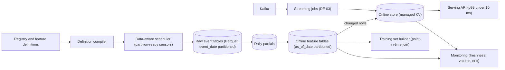
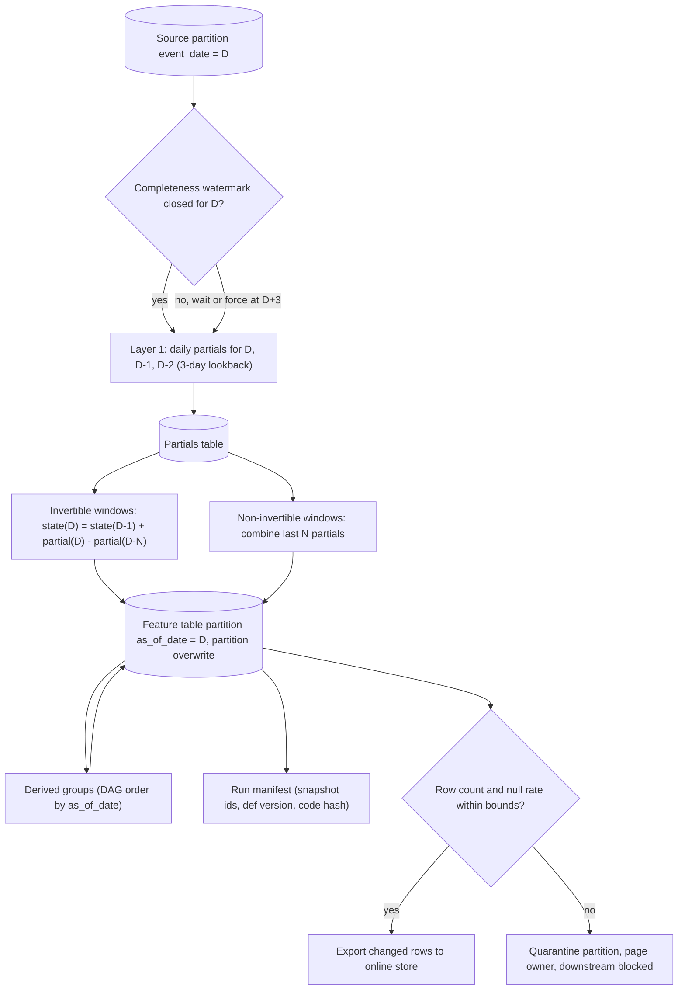
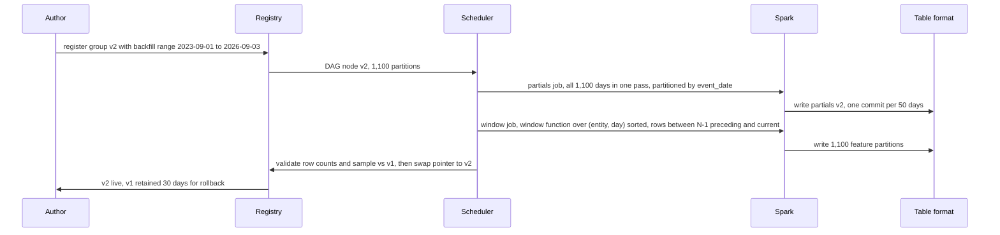

# Feature store — DE 02, batch feature computation

Lens: turning 5,000 feature definitions into nightly Spark jobs that are cheap, idempotent, backfillable over 3 years, and correct under late data.

## Requirements

Functional

| # | Requirement | Number |
|---|---|---|
| F1 | A feature definition (SQL or PySpark expression + entity + window + source) compiles to a scheduled job with no hand-written DAG code | 5,000 features, ~350 feature groups, ~40 source event tables |
| F2 | Windowed aggregates over event time: 1d, 7d, 30d, 90d counts, sums, min/max, distinct counts, last value | 60 percent of features are windowed aggregates (assumption) |
| F3 | Nightly materialisation of every batch feature for every entity that changed | 100M users, 20M items, ~20M entities change per day |
| F4 | Backfill a changed definition over 3 years of history | 1,100 daily partitions, complete in hours, not weeks |
| F5 | Features can depend on other features | DAG depth up to 4, ordering derived from the registry, never hand-scheduled |
| F6 | Late-arriving events are absorbed and reprocessed with a bounded lookback | 3-day lookback by default, per-source override |
| F7 | Every materialised partition is reproducible from a recorded manifest | rerun yields byte-identical output |

Non-functional

| # | Requirement | Number |
|---|---|---|
| N1 | Nightly run finishes before the batch scoring window | all batch features for as-of D-1 ready by 06:00, 5 h budget |
| N2 | Compute cost | under 10k USD per month for nightly batch, under 500 USD per 3-year backfill of one group |
| N3 | Idempotence | any partition can be rerun any number of times with no duplicates or drift |
| N4 | Freshness of batch features | 24 h; anything needing under 1 h is a streaming feature (DE 03 lens) |
| N5 | Blast radius of a bad definition | one feature group, never the whole nightly run |

## Estimates

Assumptions: 2B events/day at 500 B compressed in Parquet = 1 TB/day raw, 40 source tables, average source 25 GB/day. Spark on spot at 0.04 USD per core-hour, effective aggregation throughput 3 GB per core-hour once shuffle over 100M keys is included.

| Item | Estimate |
|---|---|
| Raw events, 3 years | 1,100 days x 1 TB = 1.1 PB, 22k USD/month at 0.02 USD/GB-month |
| Daily partials (per source, per entity, per day: count, sum, min, max, HLL, last) | 20M active entities x 40 sources x 120 B = 100 GB/day compressed, 110 TB over 3 years |
| Materialised feature tables (only changed rows, all 5,000 features) | 20M x 5,000 x 8 B = 800 GB/day uncompressed, ~150 GB compressed, 165 TB over 3 years |
| Offline storage total | ~1.4 PB, ~28k USD/month; raw dominates, feature tables are 12 percent |
| Nightly compute, naive one-job-per-feature full recompute | 5,000 features x 30-day source scan (750 GB) = 3.75 PB read, ~1.2M core-hours, ~50k USD per night |
| Nightly compute, this design (raw read once, partials, incremental windows) | ~1.5 TB raw + ~1.5 TB partials and state read, ~1,500 core-hours, ~60 USD per night, ~2k USD/month |
| 3-year backfill of one feature group | ~30 TB source read + one window pass over partials, ~10k core-hours, ~400 USD, ~3 h on 3,000 cores |
| Write rate into offline tables | 150 GB/night, 20M changed entity rows per group |
| Downstream read rate | 1,000 training-set generations/month, each scanning 1 to 100 daily partitions of 10 to 50 groups |

The 800x gap between naive and designed nightly cost is the whole point of this lens.

## High-level design

Main flows

| Flow | What happens |
|---|---|
| Define a feature | Author writes definition in the registry; compiler validates it is a pure function of (source tables, as_of_date), assigns it to a feature group keyed by (entity, source, grain), and emits the DAG node |
| Materialise batch | Scheduler fires when source partition D-1 is closed: raw to partials, partials to windows, derived groups, then a changed-rows export to the online store |
| Materialise streaming | Same definition compiled to a Flink or Spark Structured Streaming job over Kafka, writing the online store and a mirror table so training sees the same values (DE 03) |
| Serve online | Serving API reads entity rows from the KV store; batch features are the previous night's values with an explicit as_of timestamp |
| Generate a training set | Point-in-time join of label events against feature tables by as_of_date, pinned to a table snapshot id recorded in the run manifest |
| Monitor | Per-partition row counts, null rates, value distributions, and completeness watermarks per source; alerts on missing or shrunken partitions |

## Deep dive: batch feature computation

### The hard part

Five thousand definitions, most of them sliding windows over the same 40 sources, must be recomputed every night for 100M entities, rerun safely when something breaks, backfilled over 1,100 days when a definition changes, and corrected when events arrive three days late. Each of these is easy alone. Together they force one shape.

### The obvious approach and why it breaks

One scheduled task per feature, each a query like `SELECT user_id, count(*) FROM orders WHERE ts > now() - interval 30 days GROUP BY user_id`, overwriting the feature column.

| Failure | Why |
|---|---|
| Cost | 5,000 tasks each scan 30 days of their source: 3.75 PB per night, 50k USD per night (Estimates) |
| Not idempotent | `now()` makes output depend on wall clock; a rerun at 09:00 gives different values from the 02:00 run; training and serving silently disagree |
| Late data invisible | Overwriting a column destroys the previous value; nobody can tell a partition was revised or reproduce last week's training set |
| Backfill impossible | 3 years of a 30-day window = 1,100 runs x 30-day scans = 825 TB per feature |
| Ordering by hand | Derived features depend on scheduler timing rather than data; a slow upstream produces stale-but-green downstream |

### What I would do instead

1. Compile to feature groups, not features. A group is all features sharing (entity, source table, grain). 5,000 features become ~350 jobs. One Spark job reads a source partition once and emits every feature in the group.

2. Everything is keyed on `as_of_date`, never wall clock. A job is `f(source snapshot, as_of_date) -> feature partition as_of_date`. It writes with partition overwrite (`replaceWhere as_of_date = D` in the table format). Rerunning is overwriting the same partition with the same bytes. The run manifest records source snapshot ids, definition version, and code hash.

3. Two-layer aggregation. Layer 1, daily partials: per (source, entity, event_date) store count, sum, sum of squares, min, max, HLL sketch, last value with timestamp, first value. Raw is read once per night regardless of how many features exist. Layer 2, windows: 7d, 30d, 90d are combinations of partials, so they all share one raw scan and the partials are 10x smaller than raw.

4. Incremental strategy chosen per aggregation type, see table below.

5. Dependency ordering from the registry DAG. Each group declares its inputs (source tables or other groups). The scheduler is data-aware: a node fires when every input partition for as_of_date D exists and is marked closed, not at a fixed time. Derived groups join inputs at the same as_of_date, so a slow upstream delays, never mis-joins.

### Batch materialisation pipeline

### Incremental strategies by aggregation type

| Aggregation | Strategy | Nightly reads per group | Reprocessing one late day costs |
|---|---|---|---|
| count, sum, sum of squares, mean, variance | Invertible running state: add partial(D), subtract partial(D-N) | 3 partitions: state, partial D, partial D-N | Fix the partial, then patch the N window partitions that contain it (cheap, arithmetic only) |
| min, max | Combine last N daily partials (min of 30 daily mins) | N small partitions, ~0.4 GB each | Rerun the N affected window days |
| distinct count | HLL sketch per day, merge N sketches; exact only for N = 1 | N partitions | Rerun the N affected window days |
| percentiles | KLL or t-digest sketch per day, merge N | N partitions | Same as above |
| last value, last timestamp, days since last event | Running state: coalesce(partial(D).last, state(D-1).last); no window subtraction needed | 2 partitions | Rerun from the late day forward until the value is overtaken |
| first value, account age | Running state, write once; never changes after first sight | 2 partitions | None unless the late event predates the recorded first |
| ratio of two aggregates, z-score against 90d | Derived group over two window groups at the same as_of_date | inputs only | Cascades automatically through the DAG |
| top-k categories, mode | Per-day count-by-category partial, merge N, take top-k | N partitions | Rerun N days |

Rule: if the aggregation has an inverse, use running state and read 3 partitions; if it does not, merge N partials and read N. Never rescan raw for a window unless the definition is a genuinely non-decomposable UDF, and those are flagged at registration with an estimated cost.

### Backfills: cheap and idempotent

A definition change creates version v2 of the group. v1 keeps serving. Backfill writes to the v2 table; the registry swaps the pointer when v2 is complete and validated, so a half-done backfill is never visible.

Why this is cheap: the partials pass reads the source once (30 TB for a typical group over 3 years), and the window pass is a single Spark window function over partials sorted by day inside each entity bucket, so 1,100 windows cost one shuffle instead of 1,100 jobs. Idempotent because each of the 1,100 output partitions is written with partition overwrite and the manifest pins source snapshots; a failed backfill is resumed by re-running missing partitions only. Bucketing partials by hash(entity) into 1,024 buckets keeps the window pass shuffle-free.

Cost: ~10k core-hours, ~400 USD, ~3 hours. Today this takes weeks because it is a sequence of 1,100 daily runs against raw.

### Late-arriving data and reprocessing

- Each source partition has a completeness watermark: closed when arrived volume is at or above 99.5 percent of the 28-day same-weekday median, or at ingest time D+3 regardless. Layer 1 always recomputes partials for D-1, D-2, D-3, which absorbs the common case for free (3 x 25 GB per source).
- Events arriving after close land in the same event_date partition but are counted in a `late_after_close` metric. If a day accumulates more than 0.5 percent late volume, the scheduler enqueues a targeted reprocess of that day's partials and the window partitions that include it, per the table above. Below the threshold, the drift is accepted and reported.
- Feature table revisions are table format snapshots; the training set builder records the snapshot id, so a training set generated before a revision is exactly reproducible after it. The registry shows "partition D revised at snapshot S, delta rows 12,304".
- Online store exports run only from the latest as_of_date, so reprocessing history never touches serving.

### Partitioning and layout

| Table | Partition | Cluster or bucket | Why |
|---|---|---|---|
| Raw events | event_date | none, files land by ingest time | Enables event-time correctness; late files just land in the old partition |
| Daily partials | source, event_date | 1,024 buckets by hash(entity) | Window pass and state update are bucket-local, no shuffle |
| Feature table | group version, as_of_date | 1,024 buckets by hash(entity) | Point-in-time join and online export are bucket-aligned |
| Running state | group version, as_of_date | same buckets | State for D is just the feature partition for D; no separate store |

### Cost of 5,000 features nightly over 100M entities

| Stage | Reads | Core-hours | USD per night |
|---|---|---|---|
| Layer 1 partials, 40 sources, 3-day lookback | 3 TB raw | 1,000 | 40 |
| Invertible windows, ~250 groups x 3 partitions | 300 GB | 150 | 6 |
| Non-invertible windows, ~100 groups x up to 90 partials | 1 TB | 350 | 14 |
| Derived groups and validation | 300 GB | 100 | 4 |
| Online export, 20M changed rows x served features | 100 GB | 50 | 2 |
| Total | ~4.7 TB | ~1,650 | ~66, about 2k USD per month |

Sensitivity: if 90d non-invertible windows grow to half of all groups, the non-invertible stage triples and the total stays under 150 USD per night. If someone registers a UDF that forces full raw rescans for a 90d window, that single group costs 2.25 TB per night, which is why the compiler estimates and displays cost at registration and the platform team approves anything over 200 core-hours.

## Trade-offs

| Decision | Chosen | Alternative | Cost of the choice |
|---|---|---|---|
| Unit of scheduling | Feature group (~350) | Per feature (5,000) | A bad feature fails its whole group; mitigated by per-feature null-tolerant evaluation and quarantine |
| Window computation | Daily partials plus incremental | Rescan raw per window | Daily grain limits batch windows to whole days; sub-day windows are streaming features |
| Running state location | The previous feature partition itself | Separate state store | State is coupled to the feature table schema; a schema change forces a backfill |
| Late data | 3-day lookback plus threshold reprocess | Wait until fully closed | Values for D-1 can change until D+3; documented and visible in the registry |
| Backfill visibility | New version table, pointer swap | In-place overwrite | 2x storage for the group during backfill, retained 30 days |
| Scheduling trigger | Data-aware (partition closed) | Cron | Requires every source to publish a watermark; sources without one are forced closed at D+3 |

## Pitfalls

- A definition that references `current_date` or the run time compiles fine and is silently non-idempotent. The compiler rejects any function not in an allowlist of deterministic functions.
- Daily partials assume additivity within a day. A feature such as "sessions longer than 30 minutes" needs sessionisation before aggregation; it belongs in a sessionised source table, not a window over raw.
- Running state drifts if a partial is ever silently rewritten without patching windows. Every partial write emits a revision event that the scheduler consumes.
- Feature tables containing only changed rows need "carry forward" semantics in the point-in-time join; the training set builder must look up the latest as_of_date at or before the label time, not exactly equal.
- 90-day windows at hour zero of a backfill have 89 days of missing history. Mark the first N-1 partitions of a window feature as warm-up and exclude them from training by default.

## Open questions for the panel

1. Daily grain for partials, or hourly? Hourly gives 6 h freshness for batch features and 24x more partial rows; my default is daily and everything under 24 h freshness goes streaming.
2. When a late-data reprocess revises a partition that a model was already trained on, do we notify the model owner, retrain automatically, or just record it? I would record and notify, never retrain automatically.
3. Should backfill compute be charged back to the requesting team? At ~400 USD per group it is cheap enough to allow freely, but a 90 percent-of-features re-register wave would cost 140k USD.
4. Do we allow arbitrary Python UDFs in batch definitions? They break the cost model and determinism guarantees; I would allow them only in a source-table transform stage with a declared cost.

## Non-negotiables

1. Every batch definition is a pure function of (source snapshots, as_of_date). No wall clock, no non-deterministic functions, enforced by the compiler. Without this nothing is reproducible and training and serving cannot be proven equal.
2. Partition overwrite with a recorded manifest of source snapshot ids, definition version, and code hash for every materialised partition. Without this reruns and backfills are not idempotent and revisions are invisible.
3. A shared daily partial layer so raw is read once per night per source. Without this the nightly bill scales with the number of features and reaches 50k USD per night by the time we hit 5,000 features.
