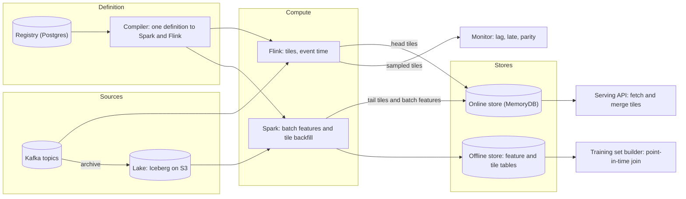
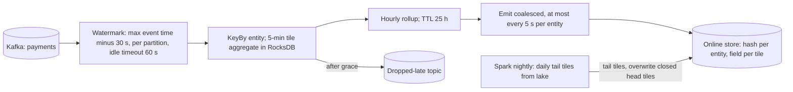
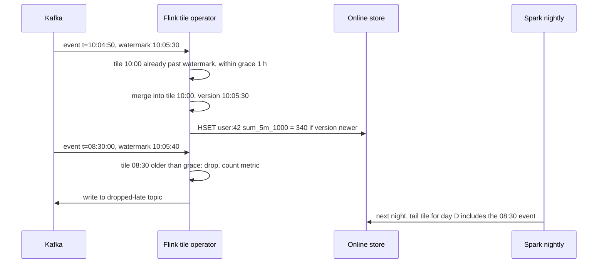

# Feature store — DE 03, streaming feature computation

Assumptions: AWS. Kafka is MSK with 7-day retention; every topic is also archived to the lake as Iceberg tables partitioned by event date. Online store is a Redis-compatible managed KV (MemoryDB). Streaming engine is Flink on Kubernetes; batch is Spark. Of the 5,000 features, about 300 (6 percent) need sub-minute freshness; they belong to roughly 40 feature views over 12 Kafka topics. Fraud is the reason streaming exists here, so its numbers drive the design.

## Requirements

Functional

| # | Requirement | Number |
|---|---|---|
| F1 | One feature definition compiles to batch and streaming with identical semantics | 100 percent of streaming features also have a batch backfill path |
| F2 | Streaming features: windowed aggregates over event time (sum, count, distinct, last-N, percentile) per entity | windows 1 min to 30 days |
| F3 | Backfill a new streaming feature from history so training data exists on day one | up to 3 years of events |
| F4 | Point-in-time correct training sets that include streaming features | 1,000 generations per month |
| F5 | Online serving reads the streaming value with the batch tail merged | one round trip per entity |
| F6 | Monitor lag, late and dropped events, and batch versus stream parity | per feature view |

Non-functional

| # | Requirement | Number |
|---|---|---|
| N1 | Freshness, fraud counters: event in Kafka to value readable online | p95 under 30 s, p99 under 60 s |
| N2 | Freshness, ranking signals | under 5 min |
| N3 | Online fetch latency including merge | p99 under 10 ms at 200k lookups per second |
| N4 | Correctness: value served equals value the batch path would compute for the same window, once the window is closed | mismatch under 0.1 percent of entities per day |
| N5 | Duplicate delivery from Kafka or Flink restart never double counts | effectively-once |
| N6 | Streaming job recovers from failure without manual state repair | checkpoint interval 30 s, recovery under 5 min |
| N7 | Late events within the grace period are reflected; later ones are corrected by batch within 24 h | grace 1 h |

## Estimates

| Quantity | Estimate | How |
|---|---|---|
| Event rate | 2B/day = 23k/s average, 70k/s peak | 3x peak factor |
| Event size, ingress | 1 KB average, 2 TB/day raw | Kafka in plus lake archive |
| Streaming updates | each event touches 2 entities and 5 features: 230k feature updates/s average | coalesced per entity per tile before write |
| Online writes from streaming | 20k to 60k upserts/s | one hash write per entity per emit, emit at most every 5 s per entity |
| Active entities per day | 10M users, 2M items | 10 percent DAU |
| Flink state, naive raw events 30 days | 60B events x 100 B = 6 TB | why raw retention is out |
| Flink state, tiles | 12M active entities x 300 features x 24 hourly tiles x 16 B = 1.4 TB worst case; 150 GB realistic since most features touch few entities per day | RocksDB, 32 task managers x 8 GB local disk each |
| Online store, streaming part | 12M active x 300 features x 53 tiles x 16 B = 300 GB, plus 600 GB batch features, x2 replicas = 1.8 TB | memory-class KV |
| Offline tile table | 300 features x 12M x 288 five-minute tiles x 24 B = 25 TB/day raw, 2 TB/day compressed Parquet, 60 TB/month | sparse: only tiles with events exist |
| Backfill of one 30-day feature over 3 years | scan 3 years of one topic, about 700 TB compressed at 2 TB/day: Spark 200 executors, 2 to 4 h, about $300 | Iceberg partition pruning by date |
| Monthly cost | Flink 32 x m6i.4xlarge $12k, MemoryDB 1.8 TB $30k, Spark backfill and parity $15k, lake storage 200 TB $5k, Kafka $8k: about $70k | order of magnitude $50k to $100k |

## High-level design

Main flows

1. Define: a data scientist writes `Aggregate(source=payments, entity=user_id, value=amount, fn=SUM, tile=5m, windows=[1h, 24h, 30d], lateness=1h)` in the SDK. The registry stores it; the compiler emits a Flink job fragment and a Spark job for the same definition. No free-form code in the streaming path.
2. Materialise batch: nightly Spark computes plain batch features and, for every streaming feature, the daily tail tiles from the lake, then writes both to the online store and the offline store.
3. Materialise streaming: Flink reads the topic, aggregates 5-minute tiles per entity in event time, rolls closed 5-minute tiles into hourly tiles, and upserts the entity's head tiles to the online store.
4. Serve online: one `HGETALL` per entity returns batch features, head tiles and tail tiles; the serving API sums the tiles that fall in each window.
5. Training set: the builder joins labels to the offline tile table as of the label timestamp, never to the online store.
6. Monitor: consumer lag, watermark delay, late and dropped counts, and a daily parity diff of batch versus streaming tiles.

## Deep dive: streaming feature computation

The hard part: a 30-day window with 30-second freshness over 100M entities, that also matches what batch computes, and that exists for training before the stream has run for 30 days.

The obvious approach: a Flink sliding window per entity, size 30 days, slide 1 minute, over raw events, writing the result to the online store. It breaks in four places.

| Failure | Why |
|---|---|
| State | Flink materialises size/slide = 43,200 window instances per key; each event is written to every instance. Even a plain 30-day event buffer is 6 TB. |
| Late data | A late event re-fires 43,200 windows and re-emits the value for every minute in the last 30 days. |
| Backfill | Kafka holds 7 days; a new feature has no value for 30 days and no history for training. |
| Parity | The Spark version is a separate hand-written query; window boundaries, timezones and late-data handling drift silently. |

What I would do instead: tiles.

Every streaming feature is a mergeable aggregate over event-time tumbling tiles. The window value is a fold over tiles at read time. This is what makes every other decision below cheap.

Streaming path

Windows

| Window kind | Support | Reason |
|---|---|---|
| Tumbling tile 1 min to 1 h | yes, the primitive | bounded state, idempotent emit |
| Sliding, hopping | yes, as a sum of tiles at read | no window instances in Flink |
| Session | no | unbounded state, not decomposable; do it in batch |
| Last N events, last value | yes, bounded list in state, N up to 20 | fraud needs it |

Tile granularity per window: 5-minute tiles for the last hour, hourly for the last 24 hours, daily beyond that. A 30-day window reads 12 + 23 + 29 = 64 fields, about 1 KB, one round trip.

Event time, watermarks, late data

- Event time always; processing time would make the value depend on consumer lag, and batch cannot reproduce it.
- Watermark = max observed event time minus 30 s, per Kafka partition, with the minimum across partitions. Partitions idle for 60 s are marked idle so one quiet partition does not stall the job.
- A tile is emitted on every update, not only on watermark, because fraud wants the partial current tile. The watermark only decides when a tile is closed for late-data accounting.
- Late events inside the grace period (1 h after tile close) are merged into their tile and the tile is re-emitted. Older events go to a dropped-late topic with a counter; batch fixes that tile in the nightly tail.

Exactly-once writes to the online store

MemoryDB does not take part in Flink two-phase commit, and I do not want it to. Instead: Kafka offsets and RocksDB state are checkpointed together every 30 s, so the aggregate itself is exactly-once inside Flink. Writes are idempotent upserts keyed by (entity, feature, tile start) carrying the tile watermark as a version; the store keeps the newer version. A replay after restart re-sends the same tile values, which is harmless. No transactions, no outbox.

Bounding state for 100M entities and 30-day windows

| Approach | State per feature | Verdict |
|---|---|---|
| Raw events, 30 days | 2 TB | no |
| Sliding window instances | 43,200 per key | no |
| Hourly tiles for 30 days in Flink, all 100M entities | 100M x 720 x 16 B = 1.1 TB | no |
| Hourly tiles for 24 h, active entities only, TTL 25 h | 12M x 24 x 16 B = 4.6 GB | yes |
| Tail beyond 24 h from batch, stored in the online store not in Flink | 0 in Flink | yes |

Total Flink state: about 4.6 GB per feature, 150 GB realistic for 300 features because most feature views touch a fraction of the entities. Fits RocksDB on 32 task managers with room for a 3x skew. State TTL on the last update evicts inactive keys, so the 88M inactive users cost nothing.

Non-decomposable aggregates use sketches so tiles still merge

| Aggregate | Tile payload | Size | Error |
|---|---|---|---|
| sum, count, min, max | number | 8 to 16 B | exact |
| average | sum and count | 16 B | exact |
| distinct count | HLL, precision 10 | 1 KB | 3 percent |
| percentile | DDSketch, relative error 1 percent | about 1 KB | 1 percent relative |
| top-k | SpaceSaving, k=20 | 500 B | approximate |
| last N values | bounded list, N up to 20 | N x value | exact |

Sketches make the online row heavier: a distinct-count over 30 days is 64 tiles x 1 KB = 64 KB. Rule: sketch-based features get daily tiles only for the tail and hourly for the head (no 5-minute tiles), and at most 20 such features per entity.

Backfill so training data exists on day one

1. The compiler emits the same tile definition for Spark. Spark reads the archived topic from Iceberg for the requested range (3 years for a new feature), computes 5-minute tiles per entity, and writes them to the offline tile table partitioned by tile date.
2. Training set generation reads tiles, not final values: for a label at time t, the 30-day value is the sum of tiles with start in [t - 30 d, t) truncated to tile boundaries. Point-in-time precision is the tile size (5 min), which is documented per feature; a fraud model that needs second-level precision at training time uses a 1-minute tile with a shorter window.
3. Bootstrapping the online store at cutover time T: Spark writes tail and head tiles up to T; Flink starts from the Kafka offset at T minus 1 h grace. Overlapping tiles are the same mergeable aggregates, so the upsert-if-newer rule resolves them without coordination.
4. Cost: about $300 and 3 h for one 30-day feature over 3 years, dominated by scanning the source topic. Features on the same topic backfill together in one Spark job.

Keeping the streaming definition identical to the batch one

- One declarative definition; the compiler owns both translations. Hand-written Flink or Spark code for a registered feature is rejected at registration.
- Same tile boundaries (UTC epoch aligned), same event-time column, same dedupe key, same value expression, same aggregate function; the compiler tests each function against a golden dataset in CI for both engines.
- Batch writes the closed tiles nightly and overwrites the streaming tiles for the same keys; after 24 h every tile in the online store is batch-produced. The streaming path only ever owns the last 24 h. Training therefore uses batch tiles, and serving converges to the same tiles.
- Parity monitor: every day Spark recomputes yesterday's head tiles and diffs them against tiles sampled from the online store before the batch overwrite; alert above 0.1 percent of entities mismatched. Mismatch usually means a dedupe key or timezone bug in one translation.

## Trade-offs

| Decision | Chose | Rejected | Cost of the choice |
|---|---|---|---|
| Window model | tiles merged at read | native Flink sliding windows | serving API does 64 additions; 1 KB read per feature per entity instead of 8 B |
| Store ownership | batch owns everything older than 24 h | streaming owns 30 days of state | value can change slightly at the nightly overwrite when late data arrives |
| Time semantics | event time, 30 s watermark, 1 h grace | processing time | 30 s added to freshness; late beyond 1 h waits for batch |
| Exactly-once | idempotent versioned upserts | Flink 2PC sink | store must keep a version field; a small window where an old replica reads a stale tile |
| Aggregates | mergeable only, sketches for the rest | exact distinct and percentile | 1 to 3 percent error on distinct and percentile features |
| Emit policy | on every update, throttled to 5 s per entity | emit on watermark only | 20k to 60k writes per second sustained |

## Pitfalls

- Sliding windows on a keyed stream with a large size/slide ratio; state grows by that ratio, always.
- Watermarks on a topic with one idle partition stall every window in the job. Set the idle timeout.
- Emitting only on window close makes the fraud value 5 minutes stale at best; emit partial tiles.
- Timezone-aligned daily tiles; tiles must be UTC epoch aligned or batch and stream disagree twice a year.
- Kafka retention shorter than the grace plus recovery time; a restart after a 2-day outage needs 2 days plus grace of data, so 7-day retention with a 1-day recovery objective is the floor.
- Sketch payloads in the online row blowing past 10 ms; cap sketch features per entity and use hourly, not 5-minute, sketch tiles.
- Training on values sampled from the online store instead of the offline tile table; these differ until the batch overwrite, and the online store has no history.
- RocksDB state without TTL; inactive entities accumulate until the job is full-restarted.

## Open questions for the panel

1. Is 5-minute tile precision for point-in-time training acceptable for fraud, or do we need 1-minute tiles for a subset and accept 5x the tile rows?
2. Should the serving API merge tiles, or should Flink pre-merge and write the final window value alongside the tiles, trading 64 additions at read for double the write rate?
3. Do we archive every Kafka topic to Iceberg by default, or only topics that a registered feature reads? Archiving all is 2 TB/day and makes backfill of any future feature possible.
4. Is 3 percent error on distinct counts acceptable for fraud rules, or do those features need an exact path with a hard cap on the window?
5. Who is on call for a Flink job that a team defined but the platform team runs?

## Non-negotiables

1. Event time with an explicit watermark and grace on every streaming feature; processing time cannot be reproduced by batch, so the training and serving guarantee is gone.
2. One definition compiled to both engines, with a daily parity check. Two hand-written versions is the situation the store exists to end.
3. Mergeable tiles as the only streaming primitive; every other window model either fails at 100M entities or cannot be backfilled.
