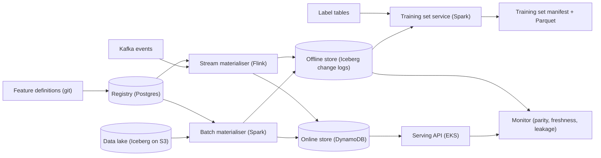
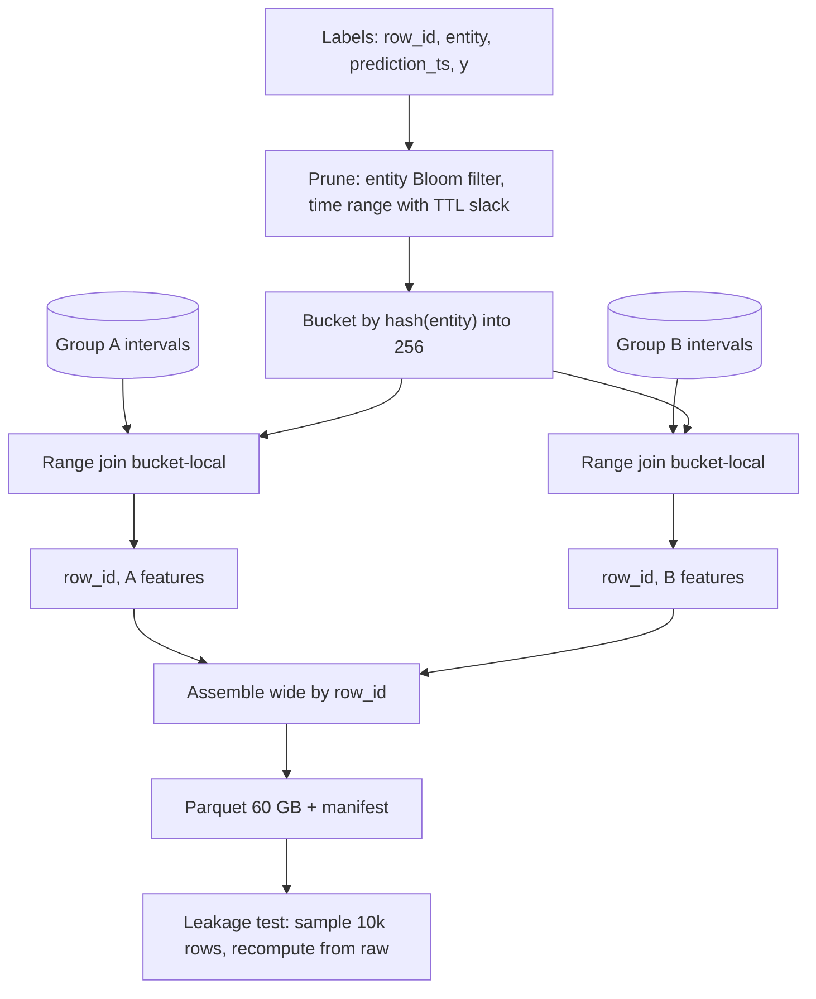

# Feature store — DE 04, point-in-time correctness and training sets

Assumptions: AWS (S3, Iceberg tables, EMR Spark, MSK Kafka, EKS, Aurora Postgres for metadata, ElastiCache/DynamoDB for online). All timestamps UTC. A "feature group" is a set of features sharing an entity key and a pipeline; 5,000 features fall into roughly 300 groups.

## Requirements

Functional

| # | Requirement | Number |
|---|---|---|
| F1 | Register a feature once; batch, stream and on-demand share the definition | 5,000 features, +20%/yr |
| F2 | Materialise batch features to offline and online stores | 100M users, 20M items nightly |
| F3 | Materialise streaming features from Kafka | 2B events/day, end-to-end lag p99 under 5 s |
| F4 | Serve online lookups | 200k lookups/s peak, p99 under 10 ms for a 50-feature fetch |
| F5 | Generate point-in-time correct training sets from a label table | 1,000/month, up to 3 years lookback, up to 50M rows by 300 features |
| F6 | Reproduce any training set used by a production model | byte-identical for 2 years after generation |
| F7 | Lineage: which models read which features | answered from the registry in one query |

Non-functional

| # | Requirement | Number |
|---|---|---|
| N1 | No future leakage: every joined feature value was available to serving before the label's prediction timestamp | verified by an automated leakage test per training set |
| N2 | Training set of 50M x 300 over 2 years | under 60 min wall clock, under $20 |
| N3 | Offline store retention | 3 years hot, table snapshots pinned on demand |
| N4 | Train/serve parity | same value for 99.9% of sampled (entity, ts) pairs in a daily audit |
| N5 | Platform team of 8 | no per-team bespoke join code; one join engine |

## Estimates

| Item | Working | Result |
|---|---|---|
| Offline change log, batch groups | 300 groups, 100M entities, 10% of rows change per day, 40 B/row compressed | 120 GB/day, 130 TB over 3 years |
| Offline change log, streaming groups | 2B events/day, 1 feature row per event, 30 B compressed | 60 GB/day, 65 TB over 3 years |
| Monthly snapshot anchors | 300 groups x 100M rows x 40 B, 36 months | 43 TB |
| Offline total | | about 250 TB, $6k/month on S3 |
| Online store | 100M users x 500 hot features x 8 B, plus 20M items x 1 KB | 420 GB raw, 1.3 TB with 3 replicas, $15k/month |
| Online reads | 200k lookups/s x 50 features | 10M feature reads/s peak |
| Online writes | nightly 100M rows in a 2 h window, plus 25k stream updates/s | 14k/s batch burst + 25k/s stream |
| Batch compute | 300 groups nightly, 2B events/day scanned | about 2,000 core-hours/day, $4k/month |
| Streaming compute | 25k events/s, stateful windows | 60 cores, $3k/month |
| Training sets | 1,000/month x $8 each (see deep dive) | $8k/month |
| Freshness | batch features T+2h15; stream features 5 s | |
| Total | | order of $40k/month, 60% of it storage |

## High-level design



Main flows

| Flow | Path | Notes |
|---|---|---|
| Define | PR to definitions repo, CI validates schema, registry row with version, owner, entity, TTL, schedule | Feature id = name@version; changing semantics makes a new version |
| Materialise batch | Scheduled Spark job per group reads lake, writes one Iceberg partition (change log rows) and upserts online | Every row written with `event_time` and `available_at` |
| Materialise streaming | Flink job per group, windowed aggregates, writes online first, then appends to offline every 60 s | `available_at` = commit time to online |
| Serve online | API batches keys per group, parallel gets, applies TTL, returns vector | TTL rule from registry, same rule the offline join uses |
| Training set | Label table + feature list + as-of policy, join per group, assemble, write manifest | Deep dive below |
| Monitor | Daily sample: replay online reads logged at serve time against offline as-of join; alert on mismatch over 0.1% | Also freshness lag and leakage test per training set |

## Deep dive: point-in-time correctness and training sets

### The hard part

A training row says: at time `t` we had to score entity `e`, and later we learned label `y`. The features for that row must be exactly the vector the serving API would have returned at `t`. Two things make this hard: the store has many values per (entity, feature) over time, and "what serving would have seen at `t`" is not the same as "what was true at `t`".

### The obvious approach and why it breaks

Obvious approach: join labels to the current feature table on entity id. Second-obvious approach: keep history and join on `event_time <= t`. Both leak.

| Approach | What it joins | Leak |
|---|---|---|
| Latest value | value as of today | Includes activity after the label, often the label's own consequence (chargeback count, account flag) |
| `event_time <= t` | newest row whose data cutoff is before `t` | Row computed at 02:15 describing data through 00:00 is joined for a label at 01:30; serving at 01:30 had yesterday's row |
| Backfilled feature, `event_time <= t` | values for dates before the feature existed | Serving returned null before launch; training sees a value |
| No TTL in offline join | any old row | Online expired it after 7 days and returned null |

The second one is the materialisation delay leak. It looks harmless but on a fraud model it shifts every batch feature 2 hours fresher than production, and for features with strong intraday drift (velocity counts, balances) offline AUC beats online by several points and nobody can explain why.

### Worked example

Feature `txn_count_7d` for user 42. Daily job runs at 02:00, computes through the previous midnight, finishes at 02:15.

| Row | event_time (data through) | available_at (written to online) | value |
|---|---|---|---|
| r1 | 2025-03-08 00:00 | 2025-03-08 02:15 | 3 |
| r2 | 2025-03-09 00:00 | 2025-03-09 02:15 | 5 |
| r3 | 2025-03-10 00:00 | 2025-03-10 02:15 | 9 |
| today | 2025-06-01 00:00 | 2025-06-01 02:15 | 40 |

Label: user 42, prediction_ts 2025-03-10 01:30, fraud = 1 (chargeback learned 2025-04-08).

| Join rule | Picks | Value | Correct |
|---|---|---|---|
| latest | today | 40 | No, includes the fraud burst and the block that followed |
| `event_time <= 01:30` | r3 | 9 | No, r3 did not exist until 02:15 |
| `available_at <= 01:30` | r2 | 5 | Yes, this is what the serving API returned at 01:30 |

```mermaid
gantt
  title Which row was visible at the label time
  dateFormat YYYY-MM-DD HH:mm
  axisFormat %d %H:%M
  section Feature rows
  r2 visible (value 5) :r2, 2025-03-09 02:15, 2025-03-10 02:15
  r3 visible (value 9) :r3, 2025-03-10 02:15, 2025-03-11 02:15
  section Label
  prediction at 01:30 :milestone, m1, 2025-03-10 01:30, 0m
```

Streaming features get the same treatment: `available_at` is the online commit time, typically `event_time` plus 1 to 5 s. Late events that arrive after the window closed update the offline log with their true `available_at`, so the join reproduces what serving saw, not the corrected value.

### Time semantics, stated once

| Column | Meaning | Who sets it |
|---|---|---|
| `event_time` | data cutoff the value describes | materialiser |
| `available_at` | instant the value became readable online | materialiser, from online commit ack |
| `valid_from`, `valid_to` | `available_at` of this row and of the next row for the same entity, `valid_to` = infinity for the newest | interval compaction job |
| `prediction_ts` (label table) | when the model had to answer | model owner |
| `label_known_ts` (label table) | when the label was learned | model owner, used to exclude labels not yet known at the training cutoff |
| `ttl` (registry) | max age of a value before online returns null | feature owner |

As-of rule: for label row `(e, t)`, take the row with `entity = e`, `valid_from <= t < valid_to`, and `t - valid_from <= ttl`; otherwise null. Backfilled rows get `available_at = event_time + p95 pipeline latency` and `backfilled = true`; the default policy uses them, the strict policy nulls anything before the feature's `first_served_at`. The policy is recorded in the manifest.

### Offline store layout

| Layout | Rows for 100M entities, one group, 2 years | As-of join cost | Verdict |
|---|---|---|---|
| Daily snapshot | 73B | Equi-join on (entity, day), then fix intra-day availability | 20x more storage, still needs `available_at` logic |
| Change log only | 7.3B at 10% daily churn | Range join, unbounded lookback for stable entities | Cheap storage, slow join for cold entities |
| Change log + monthly snapshot anchor + intervals | 7.3B + 2.4B | Range join bounded to 31 days before `t` | Chosen |

Physical layout, per feature group, Iceberg table: partition by `day(available_at)`, bucket by `bucket(256, entity_id)`, files sorted by `(entity_id, available_at)`, `valid_to` filled by a nightly window job over the last 2 days of partitions. Label tables are bucketed the same way (256 buckets on the same hash), so the join is bucket-local with no shuffle of the feature side. A Bloom filter over the label entity set (50M ids, about 60 MB at 1% false positive) is pushed into the scan as a row-group filter.



Join per group, not per feature: 300 features are about 25 groups, so 25 range joins and one wide assembly instead of 300 joins over the label table.

### Cost of 50M rows x 300 features over 2 years

| Step | Working | Time on 256 cores |
|---|---|---|
| Read labels, build Bloom, bucket | 50M x 24 B = 1.2 GB | 1 min |
| Scan 25 groups, 2 years, pruned to label entities and time range | about 100 GB compressed per group, 2.5 TB total, 50 MB/s per core effective | 3.5 min |
| Range join, sort-merge inside each bucket | 50M x 25 = 1.25B probes, about 10 us each with overhead | 1 min |
| Wide assembly on row_id | 25 x 50M rows, 125 GB shuffle | 5 min |
| Write | 50M x 300 x 4 B = 60 GB Parquet | 3 min |
| Leakage test | 10k rows recomputed from raw events | 2 min |
| Total | | about 16 min, budget 60 |

Cost: 256 cores x 0.3 h x $0.05 = $4 compute plus $2 S3 requests and $2 for the output; about $8 per run, $8k/month for 1,000 runs. What blows the budget: skipping the bucketing (2.5 TB shuffle, +30 min), skipping the entity prune (5 TB scan), per-feature joins (12x the label-side passes), or daily snapshots (20x the scan).

Reuse: the manifest hash of (label table snapshot, feature list, policy) is the cache key. About 40% of monthly runs are re-runs with the same inputs and are served from the cache in seconds.

### Reproducibility months later

A training set is a pure function of four things, all pinned in a manifest row in the registry:

| Input | How pinned | Failure without pinning |
|---|---|---|
| Label table | Iceberg snapshot id | Labels get corrected, set drifts |
| Feature group tables | Iceberg snapshot id per group | Late-arriving events and reprocessing change rows |
| Feature definitions | name@version, code commit | Semantics change under the same name |
| Join engine and policy | engine version, policy name, TTL values | A join bug fix silently changes old sets |

Snapshot expiry is 90 days by default. When a model goes to production its manifest is tagged and the referenced snapshots are exempt from expiry until the model is retired. The output Parquet is also kept for 2 years with a content hash; regeneration from the manifest is checked against the hash weekly for 5 random production manifests.

Feature definition changes never rewrite history in place: a new version is a new column in the change log, and the old version keeps materialising until no manifest of a live model references it.

## Trade-offs

| Decision | Chosen | Alternative | Why |
|---|---|---|---|
| Join key | `available_at` | `event_time` | Only `available_at` reproduces serving; `event_time` is kept for analysis |
| History layout | change log + monthly anchor + intervals | daily snapshots | 20x less storage; range join cost bounded to 31 days |
| Bucketing | 256 hash buckets on entity, labels bucketed to match | shuffle at join time | Removes 2.5 TB shuffle; costs a bucketing pass on label tables |
| Backfill semantics | synthetic `available_at` with flag, strict mode optional | no backfill | Teams need history for new features; the flag keeps it honest |
| Interval materialisation | nightly `valid_to` fill | compute window at join time | One pass per day vs one window per training run |
| Reproducibility | pinned Iceberg snapshots + stored output | stored output only | Stored output alone cannot be regenerated with a new feature added |

## Pitfalls

- Label tables with the wrong timestamp: `label_known_ts` used as the join key gives a 30-day-fresher view than production had. The service rejects label tables without `prediction_ts`.
- `available_at` set from the batch job's scheduled time instead of the online commit ack; a job that ran 3 hours late writes a lie.
- Online TTL and offline staleness diverging because they live in two configs. One registry field, read by both.
- Stream features: using the window end as `available_at` ignores watermark and sink latency; use the sink commit time.
- Entity key changes (merged accounts, re-keyed devices) break the join silently; the registry tracks key versions and the join fails loudly on a key version mismatch.
- Iceberg snapshot expiry deleting a snapshot a production model depends on; tagging is enforced by the model registration hook, not by convention.
- Duplicate label rows collapse in a join on (entity, ts); `row_id` is mandatory.

## Open questions for the panel

1. Should the default backfill policy be the synthetic `available_at` (more data, small skew) or strict (no value before `first_served_at`)? I lean synthetic with the flag exposed to the trainer.
2. 256 buckets fixed for 3 years, or re-bucket at 400M entities? Re-bucketing 250 TB is a one-week job.
3. Do we let teams bring their own label tables in any format, or require registration and bucketing first (adds a 5-minute step but removes the shuffle)?
4. Stream features: is a 60 s offline append delay acceptable, or do some fraud teams need training sets over the last hour?
5. Who pays for pinned snapshots that block compaction on a 250 TB store: the platform or the model owner's budget?

## Non-negotiables

1. Every offline feature row carries `available_at` taken from the online commit, and the training set join uses it. Without this the store reproduces the truth, not what serving saw, and the silent train/serve disagreement the brief describes continues.
2. Every training set has a manifest pinning label snapshot, feature table snapshots, feature versions and join engine version, and production models tag their manifests against expiry. Without this "reproduce the set from March" is impossible in September.
3. One TTL and one as-of policy per feature, defined in the registry and consumed by both the serving API and the join engine. Two copies of that rule will drift within a quarter.
