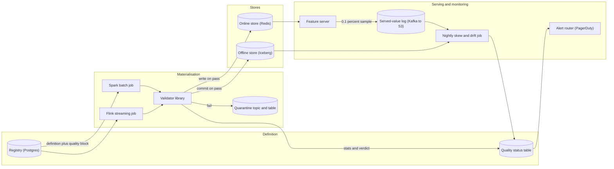
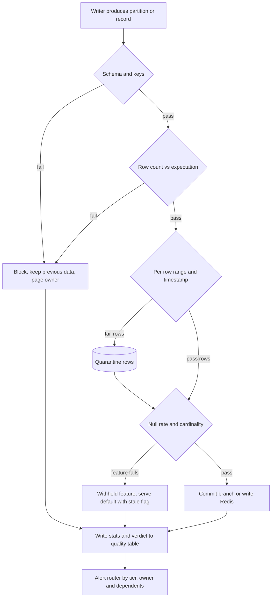

# Feature store — DE 05, feature quality, validation and drift

Assumptions: AWS (S3 + Iceberg lake, EMR Spark, MSK Kafka, EKS, Aurora Postgres for the registry, ElastiCache Redis for online). Features are grouped into ~500 feature views (about 10 features each). Model tiering exists: 6 tier-1 models (fraud, top-line ranking), the rest tier-2.

## Requirements

Functional
- F1. Define a feature once; the same definition materialises to offline (Iceberg) and online (Redis). Every feature carries a `quality` block: schema, null ceiling, range, cardinality, row-count expectation, freshness SLA, owner, tier.
- F2. Every materialisation (batch or streaming) is validated before it becomes visible to readers. Failure outcomes are exactly three: block, quarantine, warn.
- F3. Freshness per feature view is measured continuously from the online store, not inferred from job success.
- F4. Drift is computed daily: today vs yesterday, and serving vs the training snapshot for every model in production.
- F5. Training-serving skew is measured by logging served values and recomputing them offline.
- F6. The registry exposes a health status per feature version and per model (union of its features). Lineage answers "which models break if this feature is bad".
- F7. Point-in-time correct training sets, online serving for fraud, ranking, batch scoring (shared with other lenses; assumed, not designed here).

Non-functional

| Requirement | Number |
|---|---|
| Online fetch latency | p99 < 10 ms at 200k lookups/s; validation adds 0 ms on the read path |
| Batch validation overhead | < 10 percent of materialisation job time |
| Streaming validation overhead | < 5 ms added per record, p99 |
| Freshness measurement lag | detection within 1 minute of SLA breach for streaming views, 5 minutes for batch |
| Drift and skew report latency | available by 08:00 for the previous day |
| False-page rate | < 1 page per feature owner per week from quality alerts |
| Bad data visibility | a failed batch is never readable by training or serving; a failed stream record is never written to Redis |
| Availability of the registry health API | 99.9 percent; serving does not depend on it |

## Estimates

| Item | Working | Result |
|---|---|---|
| Feature views | 5,000 features / 10 per view | 500 views, ~350 batch, ~150 streaming |
| Batch materialisation runs | 350 views x 1 to 24 runs/day | ~2,000 runs/day, 2,000 validation runs/day |
| Validation compute | one extra pass over the output partition; output partition for a 100M-user view is ~10 GB Parquet | ~2 min on 20 cores per run; ~7 percent of a 30 min job |
| Streaming records | 2B events/day, ~40 percent touch a streaming feature | ~10k records/s average, 50k peak; inline checks at ~50 us each |
| Daily statistics rows | 5,000 features x 1 histogram (100 bins) + scalars, ~2 KB | 10 MB/day, 3.7 GB/year, kept 2 years |
| Served-value log | 200k lookups/s peak, 100k average x 50 features x 60 B, sampled 0.1 percent | 300 KB/s, ~26 GB/day, 30 day retention = ~800 GB |
| Skew recompute | point-in-time join of 26 GB of sampled rows against offline store | ~30 min Spark, 100 cores, nightly |
| Drift compute | 5,000 features x (1 day-over-day + ~3 model snapshots avg) PSI over stored histograms | seconds; histograms, not raw scans |
| Online store | 100M users x ~2 KB + 20M items x ~1 KB | ~220 GB, Redis cluster ~ $6k/month |
| Offline store | 5,000 features x 100M entities x 3 years daily snapshots, compressed and deduplicated | ~200 TB, ~$5k/month S3 |
| Whole platform | Spark + Kafka + Redis + storage + registry | $120k to $180k/month |
| Quality share | validation pass, skew job, stats storage, served-value log | ~$12k/month, under 10 percent of platform |

## High-level design

Main flows
- Define: owner registers a feature view with a `quality` block. Missing thresholds are auto-derived from 28 days of history after the first backfill (null rate p99, range p0.1 to p99.9, cardinality). Tier-1 features must have explicit values; the registry rejects them otherwise.
- Materialise batch: Spark writes the partition to an Iceberg staging branch, the validator runs on the staged data, and the branch is fast-forwarded to `main` only on pass. Readers never see uncommitted data.
- Materialise streaming: Flink applies per-record checks inline; failing records go to the quarantine topic; windowed checks (5 minute) decide whether to pause writes for that view.
- Serve online: the feature server reads Redis; validation never runs on this path. It samples 0.1 percent of responses to the served-value log.
- Training set: the generator stamps the dataset with a feature-stats snapshot (histograms per feature) that becomes the drift baseline for the model trained on it.
- Monitor: freshness probe, nightly drift and skew job, and every validation verdict write to the quality status table; the alert router reads it and pages by tier and owner.

## Deep dive: feature quality, validation and drift

The hard part: a feature store makes bad data cheap to reuse. Today a broken column breaks one team's pipeline. Tomorrow it breaks 12 models silently, and nobody knows which 12 until the fraud loss shows up. The store therefore needs three things a normal pipeline does not: a gate that nothing bypasses, a definition of "normal" per feature that keeps itself current, and a path from "this feature is off" to "these models are affected, this person is paged".

The obvious approach: a nightly data-quality DAG that scans the offline store after jobs finish, with a shared thresholds YAML, and Slack alerts. It breaks in four ways. It runs after the write, so readers already consumed bad data. It does not cover streaming at all. Thresholds in one YAML rot within a quarter because 5,000 features have 5,000 normals. And Slack alerts to a channel are read by nobody, so the false-page rate becomes 100 percent and then the true-page rate becomes zero.

What I would do instead.

1. Validation is a gate inside the writer, not a job beside it. The validator is a library called by the Spark and Flink jobs, and the only way to commit to the offline store or write to Redis is through it. For batch this uses Iceberg branching: write to branch `staging-<run_id>`, validate, fast-forward `main`. Failure leaves the branch for inspection and expires it after 7 days. For streaming the validator runs per record for cheap checks and per 5 minute window for statistical ones.

2. Expectations live in the registry next to the definition, not in a separate config. Explicit thresholds override auto-derived ones. Auto-derived thresholds are recomputed weekly from the trailing 28 days and stored with their derivation date, so a threshold is never older than a week and nobody has to maintain it by hand. Every threshold change is a registry version and shows in the feature's history.

3. Three outcomes only. Block: the write is rejected, readers keep the previous partition or previous Redis values, owner is paged. Quarantine: the write commits but the failing rows or the failing feature are withheld; served value falls back to the registered default and the response carries a `stale` flag. Warn: commits, records the verdict, alert on 3 consecutive warns.

Checks, thresholds and responses. Thresholds are per feature; the numbers below are the defaults a feature gets if it declares none.

| Check | Where | Default threshold | Outcome on failure | Who is notified |
|---|---|---|---|---|
| Schema (type, nullability, column set) | batch and per record | exact match to registered schema | block | feature owner, page |
| Row count vs expectation | batch | outside 0.7x to 1.3x of 28 day median for that partition slot | block | feature owner, page |
| Entity key uniqueness | batch | any duplicate key in a partition | block | feature owner, page |
| Event timestamp sanity | batch and per record | timestamp in the future or older than the view TTL | quarantine row | owner, ticket |
| Null rate | batch and 5 min window | > p99 of 28 day history + 2 points, absolute ceiling 20 percent | quarantine feature | owner, page if tier-1 |
| Range | batch and per record | outside registered min and max, default p0.1 to p99.9 of history widened 20 percent | quarantine row | owner, ticket |
| Cardinality (categoricals) | batch and 5 min window | new values > 5 percent of rows, or distinct count off by > 50 percent | warn | owner, ticket |
| Day-over-day drift | nightly | PSI > 0.2 numeric, L-infinity > 0.1 categorical | warn, block only if declared `drift_blocks: true` | owner, ticket; model owners informed |
| Serving vs training drift | nightly per model | PSI > 0.25 on any feature the model uses | warn to model owner; two consecutive days escalate | model owner, page if tier-1 |
| Freshness | continuous probe | age > SLA (streaming default 2 min, hourly batch 90 min, daily batch 26 h) | quarantine feature after 2x SLA | owner, page if tier-1 or if > 3 models depend |
| Training-serving skew | nightly | mismatch rate > 0.1 percent numeric with tolerance 1e-6, > 0.01 percent categorical | warn; 3 days consecutive is a block on new training sets using the feature | platform team, feature owner |
| Validator itself failed | any | exception or run time > 2x median | treated as block | platform team, page |

Validation flow

Freshness. Job success is not freshness; a job can succeed and write yesterday's data. A probe on the feature server side samples 1,000 entities per view per minute (streaming) or per 5 minutes (batch), reads `max(event_timestamp)` from the stored value, and publishes `age = now - max_event_ts` as a histogram per view. The SLA is declared in the registry. The metric that pages is p50 age over the sample, not max, so one stale entity does not page. Materialisation lag (`now - last successful commit`) is a second metric and is what the owner looks at first when paged.

Drift. Every nightly stats run stores a 100-bin histogram per numeric feature and a top-200 frequency table per categorical, computed on a 1 percent entity sample from the offline store and separately from a 1 percent sample of served values. Three comparisons run from stored histograms, never raw scans: today vs yesterday (offline), served today vs offline today (a cheap skew signal), and served today vs the training snapshot for each production model that uses the feature. PSI is used for numeric, L-infinity distance for categorical; both are boring and interpretable. Baselines for a model are the histograms stamped on its training set at generation time, so retraining a model resets its baseline automatically.

Training-serving skew. Drift on distributions cannot see a value that is wrong for every entity in the same way (a units bug, a timezone bug). The feature server logs 0.1 percent of responses: entity key, feature version, served value, request time, and the event timestamp of the served value. The nightly job runs a point-in-time join for those exact keys and request times against the offline store using the same feature definition, then compares. Numeric compare uses relative tolerance 1e-6; categorical is exact. The mismatch rate per feature version is the single most useful number this system produces, because it is the direct measurement of the store's core promise. Persistent mismatch above threshold blocks new training set generation on that feature until someone signs off, because training on a value that will not be served is the failure the whole system exists to prevent.

Who gets paged. Feature owners own feature checks. Model owners own model-level drift. The platform team owns the validator, probe, and the skew job, and is paged when those fail, never for a bad feature. Escalation uses the lineage graph: a block on a feature used by a tier-1 model pages the feature owner and notifies the model owner in the same incident; a block on a feature no production model uses opens a ticket only. Alert dedup is per feature version per day.

Health in the registry. The quality status table has one row per feature version per day plus a live row: last verdict, last commit time, freshness p50, null rate, day-over-day PSI, skew mismatch rate, and open incidents. The registry UI shows a model page that joins this through lineage: every feature the model uses, its status, and the worst status rolled up as the model's status. The same query is an API so model CI can refuse to promote a model whose features are red. Verdicts are appended, never overwritten, so an owner can see when a feature went bad and whether that lines up with a metric drop.

## Trade-offs

| Decision | Chosen | Alternative | Why |
|---|---|---|---|
| Gate location | inside the writer, branch then commit | post-write scan | post-write means readers already consumed bad data; the branch costs one metadata operation |
| Streaming statistical checks | 5 minute windows | per record | per-record statistics are meaningless and slow; 5 minutes bounds the damage to 5 minutes of writes |
| Thresholds | auto-derived weekly, explicit override | hand-maintained YAML | 5,000 features cannot be hand-tuned; explicit for tier-1 where the cost of a wrong default is high |
| Drift statistic | PSI and L-infinity on stored histograms | KS test, learned drift detectors | PSI is explainable to the owner at 3am and needs no raw scan |
| Skew sampling | 0.1 percent of responses | 100 percent logging | 100 percent is 26 TB/day; 0.1 percent still gives 100M values a day, enough to see a 0.1 percent mismatch rate |
| Failure default | quarantine feature, serve default with stale flag | serve last known value | last known value hides the failure from the model; a stale flag lets fraud models decline on stale input |
| Paging target | feature owner by registry, not platform team | platform team triages everything | a team of 8 cannot triage 5,000 features; ownership is the whole point of the registry |

## Pitfalls

- Auto-derived thresholds learn from bad data. A feature that has been broken for 28 days now has "broken" as normal. Mitigation: derive only from days whose verdict was pass, and freeze derivation while an incident is open.
- Row-count expectations by partition slot. Monday and Sunday have different volumes; a single median across all days pages every weekend. Compare against the same weekday.
- Quarantine that nobody drains. Quarantined rows must expire (14 days) and the row count in quarantine must itself be a warn, or it becomes an unmonitored dead-letter store.
- Default value fallback changes model input distribution. If 20 percent of a feature is served as default for an hour, the model sees a distribution it never trained on. The stale flag and a served-default-rate metric per feature make this visible; models that care read the flag.
- Skew recompute drift. If the offline recompute uses a different code path from the online write, the skew job measures the job, not the store. Both must use the same registered transformation and version; the skew job asserts the feature version it recomputed matches the logged one.
- Histogram bins fixed at training time. If the feature's range shifts legitimately, most mass lands in the last bin and PSI saturates. Store bin edges with the baseline and warn when more than 5 percent of mass sits in an edge bin.
- Alert fatigue from correlated failures. One upstream Kafka outage fails 150 streaming views at once. The router groups by upstream source within a 10 minute window into one incident.

## Open questions for the panel

1. Should quarantine-and-serve-default be the fallback for tier-1 fraud features, or should the feature server return an error so the model declines the request outright? Serving a default under an active attack is a real risk.
2. Is 0.1 percent served-value sampling acceptable for low-traffic features (some item features are served a few hundred times a day)? Stratified sampling by feature view adds complexity; is it needed on day one?
3. Who owns thresholds for a feature reused across 12 teams: the defining team, or the strictest consumer? The registry supports per-consumer alerting but only one blocking threshold.
4. Should skew failures block training set generation automatically (my proposal) or only warn? Blocking is the safe default but will be the first thing teams ask to disable.
5. Do we need distributional checks on the online store itself (sampled Redis scans), or is the serving-side sample plus offline stats enough?

## Non-negotiables

1. Nothing writes to the offline or online store except through the validator, and a blocked batch is never readable. If a job can bypass the gate the store is a cache with a nice UI.
2. Served-value logging with offline recompute exists from day one. Without a measured mismatch rate, "training equals serving" is a claim, not a property.
3. Every feature has a named owner and a tier in the registry, and alerts route to that owner. A quality signal that reaches nobody is storage cost.
