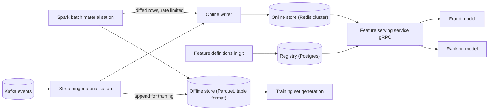
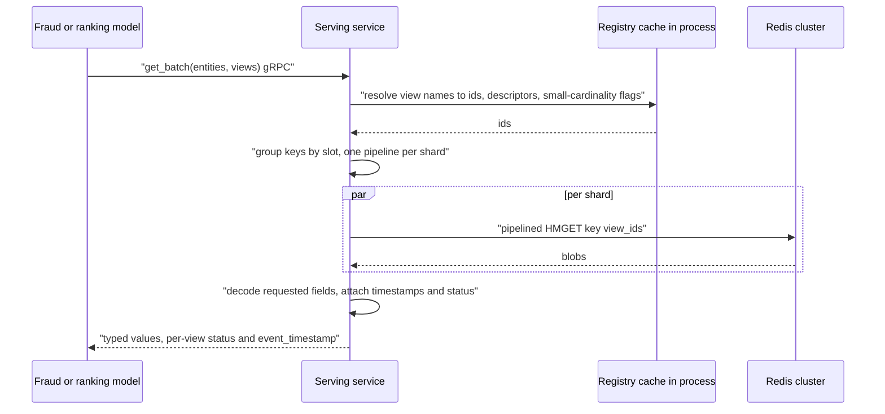
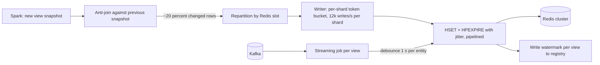

# Feature store — DE 06, the online serving store

Assumptions: AWS. The "managed key-value store" in the brief is DynamoDB. Redis means ElastiCache in cluster mode, Redis 7.4 or Valkey 8 (needs hash-field TTLs). Serving clients are in the same region, spread over 3 AZs.

## Requirements

Functional
- Define a feature once; the same definition materialises to offline (Parquet) and online (Redis) stores.
- Online read: `get(entity_key, [feature_view...])` for 1 entity, and `get_batch([entity_key...], [feature_view...])` for up to 500 entities.
- Materialise a feature view from batch (Spark, daily or hourly) or from a stream (Kafka, seconds).
- Point-in-time correct training set generation over 3 years of history.
- Registry answers "which model reads which feature", "who writes it", "when did it last update".

Non-functional, with numbers

| Requirement | Number |
|---|---|
| Online lookups at peak | 200k entity-row reads/s |
| Fraud fetch latency | p99 < 10 ms end to end, p50 < 3 ms |
| Ranking fetch | 200 to 500 candidates per request, p99 < 15 ms |
| Freshness, batch views | value visible online within 60 min of the batch job finishing |
| Freshness, streaming views | event to online visible in < 5 s at p99 |
| Availability of online reads | 99.99 percent; a bulk load must not raise read p99 by more than 1 ms |
| Online store recovery | rebuildable from the offline store in < 4 h; streaming state replayable from Kafka |
| Feature count | 5,000 now, 12,000 in 5 years; adding a feature to a view must not rewrite unrelated views |

## Estimates

| Item | Estimate | How |
|---|---|---|
| Online-materialised features | ~2,500 of 5,000 (half are only for batch scoring) | assumption, registry flag `online=true` |
| Online row size, user | ~5 KB: ~800 features across ~30 views, ~6 B per encoded feature | protobuf varints, floats 4 B |
| Online row size, item | ~3 KB: ~500 features across ~15 views | same |
| Online data | 100M × 5.5 KB + 20M × 3.2 KB ≈ 615 GB; 1.25 TB with one replica; provision 1.6 TB RAM | 25 percent headroom |
| Read rate | 200k rows/s peak: fraud 30k req/s × 3 entities = 90k; ranking 500 req/s × 220 rows = 110k | brief |
| Read bandwidth | fraud reads 3 views (~500 B), ranking 2 views per candidate (~200 B): ~70 MB/s cluster-wide | HMGET returns only requested views |
| Batch write rate | 100M users × 30 views nightly = 3B view-rows if written blindly; ~600M after diffing (20 percent change/day); 35 min at 300k rows/s | diff against last snapshot |
| Streaming write rate | 2B events/day = 23k/s average, 70k/s peak, debounced to ≤ 1 write per entity per second | Kafka |
| Offline storage | raw events 2B × 200 B = 400 GB/day; 3 years compressed Parquet ~150 TB; feature history ~50 TB | 3:1 compression |
| Compute | batch materialisation ~200 Spark node-hours/day; 20 streaming jobs × 4 cores; 1,000 training sets × ~20 node-hours | order of magnitude |
| Monthly cost | Redis ~$18k (24 × r7g.4xlarge equivalent), object storage ~$4k, Spark ~$8k, streaming ~$3k, training-set gen ~$5k, metadata and serving pods ~$3k: ~$40k/month | order of magnitude |

## High-level design

Main flows
1. Define: a feature view is a YAML or Python object in git with entity, source, features, schema, `ttl`, `online` flag. CI registers it in Postgres and assigns immutable feature ids.
2. Materialise batch: Spark computes the view for all entities, writes the snapshot to the offline store, diffs against the previous snapshot, and hands changed rows to the online writer.
3. Materialise streaming: one Flink or Spark Structured Streaming job per streaming view; each update emits a full view blob for the entity to Redis and an append-only record to the offline store.
4. Serve online: model calls the serving service, which resolves view names to ids from a cached registry, reads Redis, decodes, and returns typed values plus per-view timestamps.
5. Training set: the offline store does an as-of join of the label table against feature history; same definitions, same code path as the batch materialiser.
6. Monitor: per-view write lag, row age distribution online, null rate, and serving p99 per view; alerts route to the view owner from the registry.

## Deep dive: the online serving store

The hard part: 200k row reads/s at p99 under 10 ms, where a single ranking request needs 200 to 500 rows, while the same store absorbs a nightly 100M-user bulk load and 70k streaming writes/s, and the schema grows 20 percent a year.

The obvious approach: use DynamoDB, which we already have, with one item per (entity, feature) or a JSON map per entity, and let Spark write it nightly. It breaks four ways: DynamoDB p99 is 5 to 10 ms on its own, so the fraud budget is gone before the serving service does any work; ranking needs 200+ rows and `BatchGetItem` caps at 100 keys, so it is 3+ round trips; item-per-feature multiplies read units by 800 per user; and a 100M-row nightly load throttles partitions and drives adaptive-capacity churn exactly when the read path is live. DAX fixes latency but adds another cache layer to keep coherent with streaming writes.

### Store choice

| Store | Single read p99 | 200-row batch read | Bulk load of 100M rows | Ops for an 8-person team | Cost at our scale | Verdict |
|---|---|---|---|---|---|---|
| Redis cluster, managed | ~1 ms (0.1 ms server, rest is network) | pipelined HMGET per shard, one round trip per shard, ~2 ms | we rate limit our own writers; no compaction, no throttling | managed, well understood; data must fit in RAM | ~$18k/month for 1.6 TB with replica | chosen |
| DynamoDB | 5 to 10 ms; 1 to 2 ms with DAX | BatchGetItem, 100 keys per call, 3 calls | throttles per partition; needs provisioned burst or slow trickle | zero | ~$20k/month reads and writes plus ~$5k DAX | no: latency and batch shape |
| Cassandra self-managed | 3 to 8 ms, worse during compaction | async per-partition reads, fan out across nodes | SSTable bulk load is excellent | too much for 8 people alongside everything else | ~$15k/month | no: ops |
| ScyllaDB Cloud | 2 to 4 ms | same as Cassandra, faster | SSTable bulk load | managed | ~$20k/month | fallback if data outgrows RAM (above ~5 TB) |
| Aerospike | ~1 ms | batch reads native | own bulk tooling | licence plus ops | ~$25k/month | no: no team experience |

Decision: Redis in cluster mode, 24 shards, one replica per shard, no AOF, RDB snapshots taken on replicas only. Redis is not the source of truth. Everything in it is rebuildable from the offline store plus a Kafka replay from the last batch watermark, which is why we can turn off durability and keep the tail flat.

### Key and value layout

One writer per feature view is the rule that makes everything else simple: a view has exactly one source (one batch job or one stream job), so a view blob is always replaced whole and never patched.

| Layout | Read for fraud (3 views) | Read for ranking (200 × 2 views) | Write per view update | Memory overhead per user | Verdict |
|---|---|---|---|---|---|
| A: one key per feature | 800 GETs per entity, MGET across slots | 80,000 keys | 1 SET per feature | ~800 keys × 80 B = 64 KB | no |
| B: one STRING per (view, entity), hash-tagged on entity | 1 MGET of 3 keys | 200 MGETs, pipelined per shard | 1 SET, atomic | 30 keys × 80 B = 2.4 KB (240 GB fleet-wide) | acceptable |
| C: one HASH per entity, field per view, value = view blob | 1 HMGET returning 3 fields | 200 HMGETs, pipelined per shard | 1 HSET, atomic | 1 key, listpack encoding: ~150 B | chosen |
| D: one blob per entity with all views | 1 GET, but returns 5 KB to use 500 B | 200 GETs, 10× the bytes | read-modify-write across 30 writers, contention | lowest | no: read and write amplification |

Layout C: key `u:<user_id>`, `i:<item_id>`, `c:<card_id>`; field = view id; value = encoded view blob. Set `hash-max-listpack-entries 64` and `hash-max-listpack-value 4096` so a 30-field hash stays in listpack encoding; an HMGET scans at most 64 fields, which is microseconds. Read amplification is exactly the views asked for; write amplification is one field per view update.

Value blob: protobuf, one message per feature view version, field number = immutable feature id within the view, proto3 `optional` on every field so null is distinguishable from zero. A 4-byte header carries the schema version and an 8-byte event timestamp. Descriptors live in the registry; the serving service decodes dynamically, so adding a feature to a view is a registry change and a redeploy of nothing. Decode cost is ~2 µs per 200 B blob; ranking at 400 blobs is ~1 ms on one core, which is inside budget. If that ever dominates, switch to FlatBuffers for zero-copy field access and accept ~1.6× larger blobs.

### TTLs and what a missing value means

- Each view declares `ttl`. The writer sets `HPEXPIRE key ttl field` with ±10 percent jitter so a nightly load does not expire in a single second. Batch views use `ttl = 3 × interval`: a stopped pipeline goes to "unknown" after three missed runs rather than serving month-old values forever. Streaming views use their event-time window, typically 24 h.
- Three distinct outcomes, and the API reports all three; the SDK never substitutes zero:
  - entity key absent: the entity was never materialised or has fully expired; status `ENTITY_NOT_FOUND` for every view.
  - view field absent: expired or not yet written; status `VIEW_MISSING`, values null.
  - field present, feature null: computed null; value null with status `OK` and the view's `event_timestamp`.
- The model owner decides the default; fraud typically treats `ENTITY_NOT_FOUND` as a risk signal in itself, ranking imputes. The response includes `event_timestamp` per view so a caller can apply its own staleness rule tighter than the TTL.

### Read path and latency budget

| Step | Fraud p50 / p99 (ms) | Ranking 200 candidates p50 / p99 (ms) |
|---|---|---|
| Model to serving service gRPC, same region | 0.4 / 1.2 | 0.5 / 1.5 |
| Resolve names, group by slot | 0.05 / 0.1 | 0.1 / 0.3 |
| Redis round trip, one pipeline per touched shard, in parallel | 0.4 / 1.5 | 0.6 / 2.5 |
| Redis server time per shard | 0.02 / 0.1 | 0.1 / 0.5 |
| Decode and build response | 0.05 / 0.2 | 0.8 / 2.0 |
| Response to model | 0.3 / 1.0 | 0.5 / 1.5 |
| Total | 1.2 / 4.1 | 2.6 / 8.3 |

Budget of 10 ms leaves ~6 ms for fraud and ~2 ms for ranking, which is why ranking's own requirement is set at 15 ms. Tail control: serving service in Go or Java with a low-pause collector, connection pools warmed at startup, no RDB fork on primaries, `KEYS`, `HGETALL` on unbounded hashes and `FLUSHALL` disabled by ACL, and a hedged read to the replica if the primary has not answered in 4 ms (adds under 2 percent extra load). Serving pods are AZ-aware and prefer the shard's node in their own AZ, primary or replica, since replica lag is under 100 ms and every value carries its own timestamp.

### Write path: batch and streaming

- Diff first. Most user features do not change daily; writing only changed rows turns 3B view-rows into ~600M. Each row is ~200 B, so the nightly load is ~120 GB across 24 shards.
- Rate limit per shard, not per job. 12k writes/s per shard is ~10 percent of a shard's capacity and adds ~1 ms replication traffic at most; 24 shards give 290k writes/s and the load finishes in ~35 min. A full rebuild of 3B rows takes under 3 h, which meets the 4 h recovery requirement.
- No `DEL` then `SET`; a single `HSET` replaces the field atomically, so a reader never sees a half-written view.
- Snapshots on replicas only, and never during a load: fork copy-on-write during 300k writes/s doubles memory on the primary.
- The writer records a per-view watermark (`last_event_time`, `rows_written`) in the registry when it finishes; monitoring alerts when `now - watermark > interval`.
- Streaming: the job keeps its own keyed state, emits the full view blob per update, debounced to one write per entity per second. Redis loss is recovered by replaying Kafka from the batch watermark, not from Redis persistence.

### Hot keys

- Entity keys spread uniformly across 16,384 slots; a viral item at 5k reads/s × 200 B is 1 MB/s on one shard, harmless.
- The real hot keys are small-cardinality entities: `region`, `merchant_category`, `model_config`, read on every request. The registry marks entities with cardinality under 10k as `small`; the serving service caches those in process and refreshes them from Redis every 1 s. That removes ~60k reads/s from the cluster for fraud alone.
- If a specific large-cardinality key runs hot, the serving service routes reads for it to the replica as well; both copies serve the same shard.

## Trade-offs

| Decision | Gain | Cost |
|---|---|---|
| Redis over DynamoDB | p99 ~1 ms vs 5 to 10; native batch reads | data must fit RAM; ~$18k/month grows linearly with online feature count |
| No durability in Redis | flat tail, no fsync, no fork on primaries | full rebuild takes up to 3 h; streaming values since the last batch need a Kafka replay |
| Hash per entity, field per view | one round trip per entity, minimal key overhead | needs Redis 7.4+ for field TTLs; a hash above 64 fields loses listpack encoding |
| Protobuf blobs | boring, schema evolution free, small | decode cost ~2 µs per blob; ranking pays ~1 ms |
| Serving service instead of a direct SDK | one place for auth, schema, hedging, hot-key cache; 30 teams, 3 languages | one extra hop, ~1 ms p99 |
| Diff-based batch writes | 5× less write traffic | needs the previous snapshot kept; a wrong diff silently leaves stale rows, so a weekly full write is scheduled |

## Pitfalls

- Expiry storms: 100M fields expiring in the same minute pin Redis active expiry. Jitter the TTL and never set it from the write time alone.
- Bulk loading at full speed: an unthrottled Spark writer will push a shard past 100 percent CPU and turn a 1 ms p99 into 50 ms for the whole load. Rate limit per shard.
- Treating null as zero: a fraud feature `chargebacks_30d` that reads 0 because the row expired is a false "clean" signal. Statuses are part of the API.
- Partial writes of a view: writing features one by one within a view lets a reader see `sum` from today and `count` from yesterday. Whole-blob replace only.
- Unbounded hashes: an entity with hundreds of views falls out of listpack and HMGET gets slower and memory triples. Registry enforces ≤ 64 online views per entity type.
- Cross-AZ reads: 1 to 2 ms each way is a quarter of the budget. Keep the serving pods AZ-aware.
- Schema drift between writer and reader: the blob header carries the view schema version; a reader without that descriptor rejects the read loudly instead of misaligning fields.

## Open questions for the panel

1. Should the fraud team be allowed a direct Redis SDK path to save the ~1 ms hop, at the price of two supported clients and Redis credentials in 30 teams?
2. Is ~$18k/month for RAM acceptable as online feature count grows 20 percent a year, or do we cap online features per entity and push the rest to a ScyllaDB tier?
3. Do we need a second region for online reads at all, or is the fraud service single-region with a cold standby rebuilt from the offline store?
4. Streaming views that change on every event for a hot entity: debounce at 1 s is my default; does any model need sub-second?
5. Who owns the weekly full rewrite that guards against diff bugs: platform, or the view owner as part of their pipeline?

## Non-negotiables

1. One writer per feature view, and a view blob is replaced whole. Without this, training and serving disagree in a way nobody can detect.
2. The read API returns a status and an `event_timestamp` per view, never a silent default. Without this, an expired row becomes a wrong prediction.
3. The online store is rebuildable from the offline store and Kafka within 4 h, tested quarterly. Without this, the store is a single point of failure that we have chosen not to make durable.
