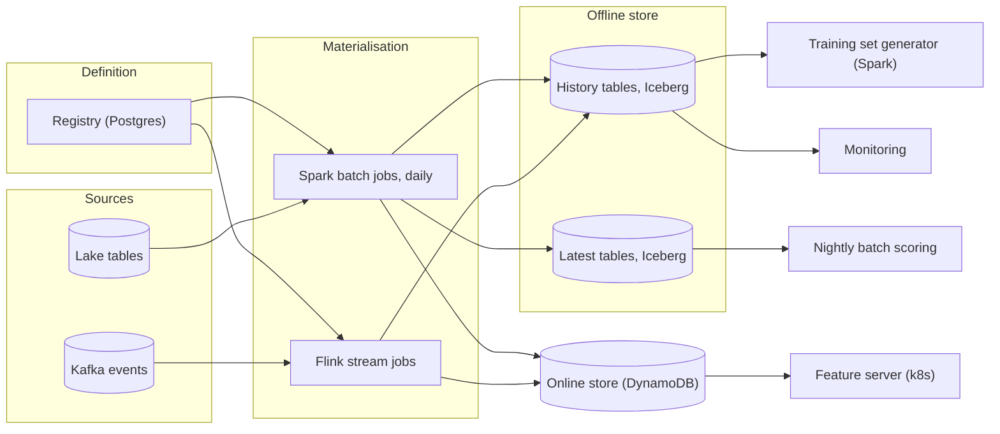
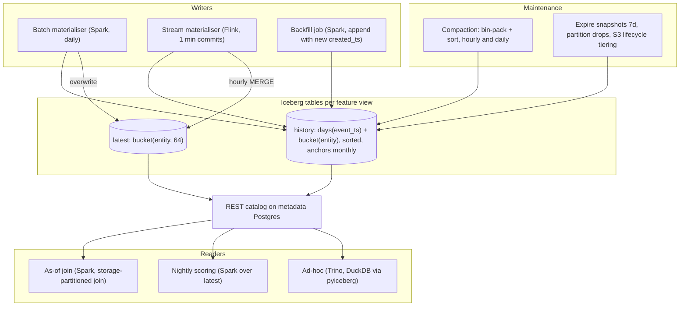

# Feature store — DE 07, the offline store

Assumptions: AWS (S3, EMR or EKS Spark, MSK Kafka, DynamoDB for online, RDS Postgres for metadata). The lake's existing table format is Iceberg; if it is Delta, everything below carries over except partition spec evolution (called out where it matters).

## Requirements

Functional

| # | Requirement | Number |
|---|---|---|
| F1 | Store every feature value with the time it became true and the time it was written | 5,000 features, ~350 feature views, 100M users + 20M items |
| F2 | Point-in-time correct training sets over any window up to 3 years | 1,000 generations/month, typical 10M labels x 200 features x 1 year; p95 100M labels x 3 years |
| F3 | Nightly batch scoring over all users with the latest value of each feature | 100M users, ~300 features per model, 20 models/night, done by 06:00 |
| F4 | Add, widen, deprecate and drop features without rewriting history unless backfilling | ~1,000 schema changes/year (20 percent feature growth) |
| F5 | Backfill a new or corrected feature without disturbing existing training sets | backfill of one view over 1 year in under 1 hour |
| F6 | Any past training set can be regenerated byte-for-byte | 6 months by default, 2 years for regulated models |

Non-functional

| # | Requirement | Number |
|---|---|---|
| N1 | Batch features visible offline by T+1 06:00, streaming features within 5 min of the event | commit interval 1 min |
| N2 | Typical training set in under 15 min wall clock, p95 under 2 hours | scans under 3 TB typical |
| N3 | Storage cost order of magnitude $2k to $5k/month for 3 years of history | not $20k |
| N4 | No small-file collapse: p50 data file 256 to 512 MB, no partition with more than 8 files after compaction | |

## Estimates

Shape of the data. 5,000 features grouped into ~350 feature views (one Iceberg table each): 300 batch views recomputed daily, 50 streaming views fed from Kafka. A row is `(entity_id, event_ts, created_ts, f1..fn)`. Only changed values are written (change log), not a full snapshot per day.

| Quantity | Working | Value |
|---|---|---|
| Batch rows/day | 300 views x 100M entities x 15 percent changed | 4.5B rows, ~25 B/row compressed (14 cells x 1.5 B + 4 B keys) = 112 GB/day |
| Streaming rows/day | 2B events, ~1 view row each, 8 cells | 2B rows, ~16 B/row = 32 GB/day |
| History write rate | 6.5B rows/day | 145 GB/day, 75k rows/s average, 23k rows/s streaming |
| History, 3 years | 145 GB x 1,095 | 160 TB |
| Monthly anchors (full snapshot per view, first of month) | 350 x 100M x ~23 B x 36 months | 30 TB |
| Latest tables | 350 x 100M x ~20 B | 0.7 TB |
| Training set outputs | 1,000/month x 3 GB x 180 days retention | 18 TB |
| Snapshot and compaction overhead | ~10 percent of live | 20 TB |
| Total offline | | ~230 TB |
| Same data as daily full snapshots | 300 x 100M x 25 B x 1,095 | 820 TB, 3.5x worse |
| Training set scan | 15 views x 365 days x 15M rows x 23.5 B + anchors | ~2 TB, 80B rows through the join |
| Training set compute | 200 spot cores, 15 to 30 min | $5 typical, $200 p95, ~$10k/month at 1,000/month |
| Nightly scoring read | 20 models x 100M x 300 features x 1.5 B | 1 TB/night from latest tables |

Storage cost per month, tiered by partition age (S3 list prices):

| Tier | Age | Volume | $/TB | $/month |
|---|---|---|---|---|
| Standard | 0 to 90 days + latest + training sets | 16 + 18 TB | 23 | 780 |
| Standard-IA | 90 days to 1 year | 47 TB | 12.5 | 590 |
| Glacier Instant Retrieval | 1 to 3 years | 124 TB | 4 | 500 |
| Total storage | | 230 TB | | ~$2.2k incl. requests (all-Standard $5.3k; naive layout all-Standard $19.5k) |

Offline total: ~$2k storage + ~$10k training set compute + ~$2k scoring and maintenance = order of $15k/month.

## High-level design

Main flows:

1. Define a feature: a feature view in the registry names entity, source, features with types, cadence, `ttl`, `offline_retention`. Registry applies `ALTER TABLE` to the view's Iceberg tables; the table schema is derived, never hand-edited.
2. Materialise batch: daily Spark job computes the full view for all entities, diffs against `latest`, appends changed rows to `history` with `created_ts = now`, overwrites `latest`, pushes changed rows to the online store. On the first of the month it also copies `latest` into `history` as the anchor.
3. Materialise streaming: Flink computes the view from Kafka, writes to the online store and appends to `history` with 1 min commits; hourly `MERGE INTO latest`.
4. Serve online: feature server reads the online store. Not this lens.
5. Generate a training set: labels `(entity_id, label_ts)` joined as-of against each view's `history` plus anchors, bounded lookback, bucket-aligned join; output written to its own Iceberg table with a manifest.
6. Monitor: null rate, freshness lag (`max(event_ts)` per view vs now), row count per partition, file count per partition, and registry-vs-table schema drift, all from Iceberg metadata tables, no extra scan.

## Deep dive: the offline store

The hard part. One layout must serve two opposite reads: "value of 200 features for 10M (entity, timestamp) pairs across a year" and "latest value of 300 features for all 100M entities tonight", while history stays append-only so training sets are reproducible and backfills are cheap. Storage must stay near 200 TB, not 1 PB.

The obvious approach. One wide Parquet table per view partitioned by date, a full snapshot of all entities written every day. As-of join is trivial (read the label's day). Why it breaks: 820 TB for the batch views alone, 945 GB written per day, and every schema change or backfill rewrites a petabyte. Also it does not exist for streaming views, which produce values at arbitrary times, so teams end up with a second layout anyway.

What I would do instead.

Table format: Iceberg.

| Need | Iceberg | Delta | Hudi |
|---|---|---|---|
| Change bucket count as a view grows, no rewrite | Yes, partition spec evolution | No, partition columns are physical | Partial |
| Add/widen/drop column by column ID | Yes | Yes | Yes |
| Engines: Spark, Flink, Trino, DuckDB, pyiceberg | All first class | Spark first, others lag | Spark, Flink |
| Bucket-aligned join without shuffle | Spark storage-partitioned join | Yes on Databricks | No |
| Row upsert into latest | MERGE, merge-on-read | MERGE, deletion vectors | Best, record index |

Hudi wins only on upserts, which we need for one small table (`latest`). Delta ties except on partition evolution and engine neutrality, and the 200 data scientists will read from laptops. Iceberg.

Physical layout, per feature view, three tables.

| Table | Rows | Partition spec | Sort within file | Written by |
|---|---|---|---|---|
| `history` | one per changed value, bitemporal | `days(event_ts)`, `bucket(entity_id, N)` | `entity_id, event_ts` | batch append daily, streaming append 1 min |
| anchors (rows in `history`, flagged `is_anchor`) | full snapshot, first of month | same as history | same | copy of `latest` |
| `latest` | one per entity | `bucket(entity_id, 64)` | `entity_id` | batch overwrite daily, streaming MERGE hourly |

`N` per view is chosen so a day's partition lands in 256 to 512 MB files: 64 for the big streaming views (32 GB/day), 8 for a typical batch view (370 MB/day), none for views under 200 MB/day. Because bucket count is a partition spec, it grows with the view without rewriting old days. Parquet with zstd, 128 MB row groups, dictionary encoding, bloom filter on `entity_id` for single-entity debugging reads. Hidden partitioning means readers filter on `event_ts` and never on a derived column, so nobody can get the pruning wrong. Every entity type uses the same bucket transform and the same `N` for `latest`, so joins across views are bucket-aligned.

| Layout | Write/day | As-of join read | Latest read | Storage 3y | Verdict |
|---|---|---|---|---|---|
| A. Daily full snapshot, partition by day | 945 GB | 1 day partition per label day, simplest | today's partition | 820 TB | Too expensive, no streaming story |
| B. Change log, day + bucket(entity), sorted | 145 GB | day range with bounded lookback, bucket-aligned | unbounded scan back, bad | 160 TB | Chosen, needs anchors and latest |
| C. Change log, bucket(entity) only | 145 GB | no date pruning, scans 3 years per query | same | 160 TB | Retention is row deletes, not partition drops |
| D. Long format `(entity, feature, ts, value)` | 700 GB | pivot on every read, 5x rows | pivot | 600 TB | Schema-free is not worth 4x |
| E. One table per feature | 145 GB | 200 tables joined per training set | 300 tables | 160 TB + metadata | Catalog and planning fall over |

Why B needs anchors: with change-only rows the last value for an entity may be 2 years back, so a naive as-of join scans unbounded history. The monthly anchor row for every entity bounds the lookback to `max(31 days, view ttl)`. Cost 30 TB and no extra compute, since the batch job already holds the full output as `latest`.

Bitemporal rows, the rule everything rests on. `event_ts` is when the value became true; `created_ts` is when it was written. Rows are never updated or deleted, corrections and backfills are new rows with a later `created_ts`. The as-of join is: for each label `(e, t)` and run time `R`, take the row with max `(event_ts, created_ts)` such that `event_ts <= t` and `created_ts <= R`. Rerun with the same `R` and you get the same rows regardless of what has been backfilled or compacted since. That is the reproducibility mechanism; Iceberg snapshots are not.

Reproducible training sets and time travel. The obvious approach pins an Iceberg snapshot per view per training set. Why it breaks: 1,000 training sets x 15 views = 15k pinned snapshots a month; every pinned snapshot keeps the pre-compaction small files alive, so `expire_snapshots` can delete nothing and storage grows 3 to 5x within a quarter. Instead:

- Snapshots retained 7 days (`expire_snapshots`), used to roll back a bad materialisation (`rollback_to_snapshot`) and to debug a partition, not for reproducibility.
- Reproducibility comes from bitemporal rows plus the manifest written with each training set: label table snapshot ID, every view's snapshot ID and schema ID, feature versions, `R`, join config. The manifest is for audit; the rerun uses `created_ts <= R`.
- The training set itself is written to `training_sets.ts_<id>` (Iceberg, 3 GB typical), retained 180 days. Cheapest reproducibility is not recomputing. Regulated models (fraud, credit) additionally tag snapshots with 2 year retention, ~50 tags/month, a volume expiry can live with.

Schema evolution, all through the registry, never by hand.

| Change | Mechanism | History rewrite | Cost |
|---|---|---|---|
| Add feature to a view | `ALTER TABLE ADD COLUMN`, old rows read null | none | metadata only |
| Add feature with backfill, batch view | compute history, append rows with `created_ts = now` | none, append only | ~140 GB/view-year, under 1 hour |
| Widen type: int to long, float to double, decimal precision up | `ALTER COLUMN TYPE` | none | metadata only |
| Any other type or semantic change | new column `name_v2`, registry deprecates v1 | none | v1 dropped after 90 days with zero readers |
| Rename | forbidden; the name is the contract | | |
| Drop feature | registry proves no model reads it, `DROP COLUMN` | none, bytes reclaimed at next compaction of hot partitions, never for cold | metadata only |
| Grow bucket count | new partition spec | none, old days keep old spec | metadata only; on Delta this is a full rewrite |

A nightly reconciler diffs registry schema against Iceberg schema per table and pages on drift.

Maintenance.

- Compaction: `rewrite_data_files` with bin-pack plus sort on `(entity_id, event_ts)` hourly for the open day of streaming views (skip the current hour to avoid conflicts with Flink's 1/min commits, use partial progress), once after close for every day; ~300 GB/day, ~$300/month. Target 384 MB. `rewrite_manifests` weekly. `rewrite_position_delete_files` nightly on `latest` for streaming views.
- Retention: per view `offline_retention` (default 3 years). Monthly `DELETE FROM history WHERE event_ts < cutoff` is partition-aligned so it drops whole partitions as metadata, then `expire_snapshots` and `remove_orphan_files`. Streaming views downsample to one row per entity per day after 1 year (30x fewer rows in the cold tier), written as a new partition spec on a new table, old table dropped after verification.
- Tiering: S3 lifecycle rules keyed on the `event_ts_day=` path prefix, so `write.object-storage.enabled` (hash prefixes) stays off; day and bucket prefixes already spread request load. Glacier IR reads are transparent to Spark, retrieval $30/TB, a p95 3 year training set retrieves ~4 TB for $120; alert above 10 TB.

Serving both workloads from the same tables.

- As-of join: for each view, prune to `[min(label_ts) - lookback, max(label_ts)]` days and only the requested columns; re-bucket the labels on the fly with the view's transform and run a Spark storage-partitioned join, no shuffle of the feature side; dedupe by max `(event_ts, created_ts)` inside the bucket; then combine views on `(entity_id, label_ts)` smallest first. Views are joined one at a time so the 200-column wide row exists only at the end.
- Nightly scoring: reads `latest` tables only, 5 to 20 views per model, all bucketed `bucket(entity_id, 64)`, so the join is bucket-aligned and the whole read is ~50 GB per model. No history scan ever touches the scoring path.
- Consistency: the daily batch job commits `history` then `latest`. Iceberg has no multi-table transaction, so a reader of `latest` can see one run behind `history` for a few minutes. Accepted; training and scoring never need the same commit.

## Trade-offs

| Decision | Gain | Cost |
|---|---|---|
| Change log plus monthly anchors instead of daily snapshots | 3.5x less storage, streaming and batch share one layout | as-of join needs a lookback window and anchor logic |
| Bitemporal append-only rows | reproducible without pinning snapshots, backfills are appends | every read dedupes on `(event_ts, created_ts)`; a corrected value doubles that row |
| Separate `latest` table | scoring never scans history | a second write path and a few minutes of skew between tables |
| Iceberg over Delta | partition evolution, engine neutrality | if the lake is already Delta, migration or living with bucket rewrites |
| 7 day snapshot retention, manifests for audit | expiry actually reclaims space | true byte-level time travel beyond 7 days only for tagged regulated models |

## Pitfalls

- Pinning a snapshot per training set. Storage triples within a quarter and expiry becomes a no-op. Use bitemporal rows and manifests.
- Change-only history without anchors. A single stale entity forces a 3 year scan and nobody notices until the fraud team's job runs for 9 hours.
- Enabling Iceberg object-store hash prefixes. Breaks prefix lifecycle rules, so nothing tiers and the bill is 2.5x.
- Bucketing small views. 300 views x 8 buckets x 1,095 days of 20 MB files is the small-file problem with extra steps; bucket only above 200 MB/day.
- Streaming views with `created_ts` set from event time instead of write time. A late event silently rewrites the past and leaks into old training sets.

## Open questions for the panel

1. Is the existing lake Iceberg or Delta? If Delta, do we migrate the feature tables or accept full rewrites when a view's bucket count must grow?
2. Which catalog: Glue, or a REST catalog (Polaris, Nessie, Lakekeeper) that gives multi-table commits and branches? Multi-table commits would remove the `history`/`latest` skew.
3. Do fraud and credit models need regulator-grade regeneration beyond 2 years? That sets tag retention and whether the cold tier is Glacier IR or Standard-IA.
4. Can streaming views be downsampled to daily after 1 year, or do fraud models need minute-level history for 3 years (roughly 3x the cold tier)?

## Non-negotiables

1. Bitemporal, append-only history: `event_ts` and `created_ts` on every row, no in-place update or delete of values. Without it no training set is reproducible and every backfill leaks.
2. One table format and one schema owner: Iceberg tables whose schema is derived from the registry, no team-owned Parquet paths, no manual `ALTER TABLE`.
3. A shared partition contract per entity type (`bucket(entity_id, N)` with the same transform on `history` and `latest`) so as-of joins and nightly scoring are shuffle-free; without it the 1,000 training sets a month cost 10x.
