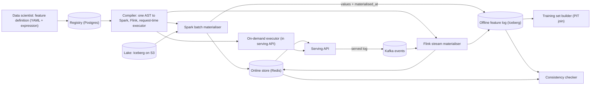
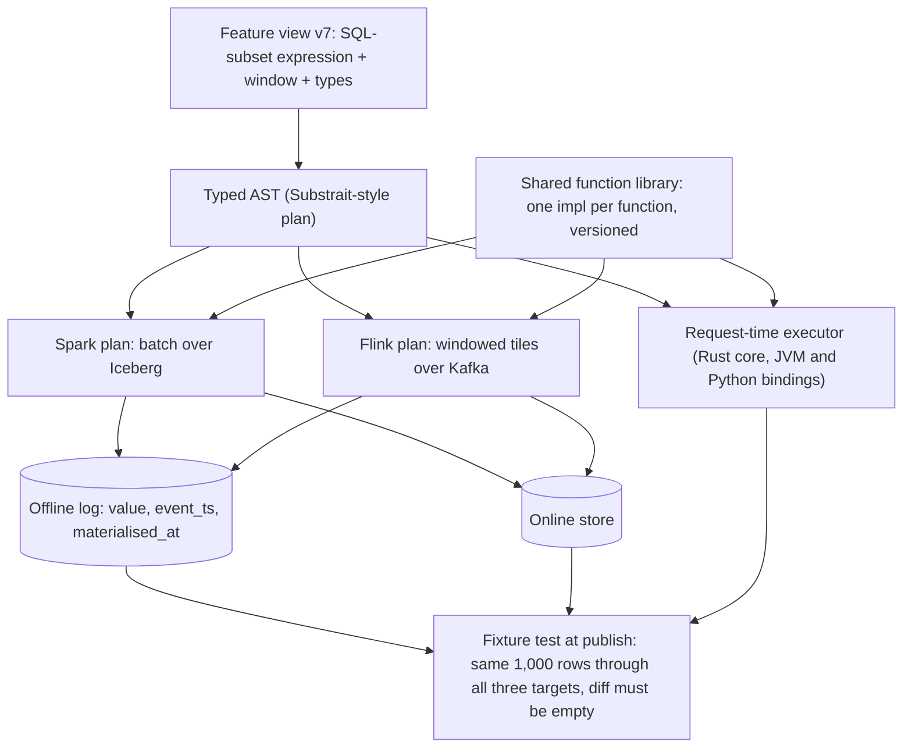
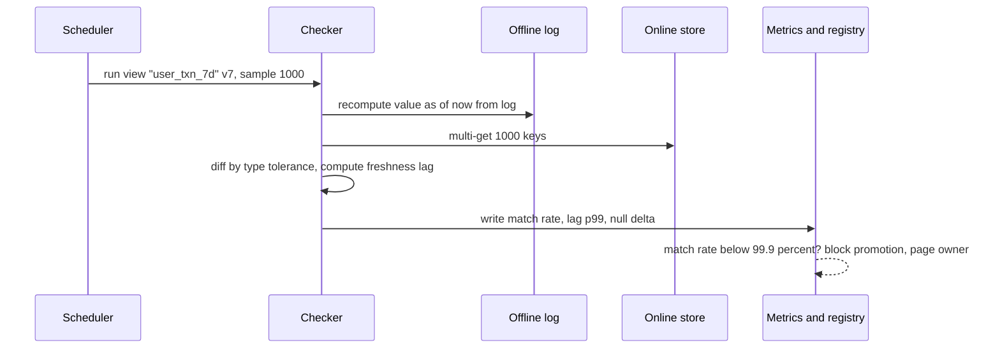

# Feature store — DE 08, training-serving consistency

Assumptions: AWS (S3 + Iceberg, EMR Spark, MSK Kafka, EKS, Aurora Postgres for metadata, ElastiCache Redis for the online store). Flink on EKS for streaming. Python is the data-science language; services are JVM and Python.

## Requirements

Functional

| # | Requirement | Number |
|---|---|---|
| F1 | Register a feature as one declarative definition (entity, source, transformation, window, TTL, owner) | 5,000 features, 6,000 next year |
| F2 | Materialise batch features to offline log and online store from one job | nightly, 100M users, 20M items |
| F3 | Materialise streaming features with the same definition | 2B events/day, 100k events/s peak |
| F4 | Serve feature vectors online, single key and multi-key (ranking) | 200k key lookups/s peak |
| F5 | Generate point-in-time correct training sets over up to 3 years | 1,000/month |
| F6 | Prove that offline and online values agree for every feature view, on every deploy and continuously | 100 percent of views covered |
| F7 | Log which feature values were served with each prediction, so training can use served values | all 60 models |
| F8 | Lineage: feature to models, source columns to features | answer "who uses this" in one query |

Non-functional

| Property | Target |
|---|---|
| Online fetch latency | p99 < 10 ms for fraud (1 entity), p99 < 25 ms for ranking (300 entities) |
| Availability of online store | 99.95 percent |
| Freshness | batch: value visible online within 2 h of source partition landing; stream: p99 < 5 s event to online |
| Skew SLO | 99.9 percent of sampled (entity, feature) pairs match offline vs online within type tolerance, per feature view, per day |
| Training set cost | median 3-year, 50-feature, 10M-row set under 30 min and under 50 USD |
| Reproducibility | any training set regenerable byte-identical from registry version + as-of timestamp |

## Estimates

| Item | Working | Result |
|---|---|---|
| Online storage | 100M users × ~200 online features × 10 B (value + overhead) = 200 GB; 20M items × 1 KB = 20 GB; ×2 replica | ~450 GB Redis |
| Offline feature log | 20 percent of users change per day × 5,000 features × 8 B = 800 GB/day raw, Parquet ×5 = 160 GB/day | ~175 TB over 3 years |
| Raw event retention | 2B/day × 200 B compressed | 400 GB/day, 430 TB over 3 years |
| Served-feature log (keys and versions only, see deep dive) | 200k lookups/s × 60 B | 1 TB/day, 12 TB/day if full values were logged |
| Online reads | 200k key lookups/s, ranking is multi-get of 300 keys in one round trip | ~700 shards-equivalent of Redis capacity, 20 nodes |
| Online writes | batch: 100M rows in 2 h = 14k/s; stream: 100k/s peak after dedup | ~120k writes/s peak |
| Batch compute | nightly Spark ~800 vCPU-h + 1,000 training sets × 40 vCPU-h | ~40k vCPU-h/month, ~20k USD |
| Stream compute | Flink 60 task slots, 4 vCPU each | ~10k USD/month |
| Consistency checks | 5,000 features × 1,000 sampled entities × 96 runs/day = 480M comparisons/day | negligible, < 200 USD/month |
| Total | Redis 20k, S3 12k, Spark 20k, Flink 10k, Kafka 8k, metadata and services 5k | order 75k USD/month |

## High-level design

Main flows

| Flow | Path |
|---|---|
| Define a feature | Author writes a feature view: entity keys, source table or topic, transformation in the expression language, window, TTL, version. Registry validates types, compiles to all three targets, runs the compiled definition against a 1,000-row fixture in every target and diffs. Version is immutable once published. |
| Materialise batch | Scheduler triggers Spark plan for the view when source partition lands. One job writes rows to the offline log with `event_ts` and `materialised_at`, then upserts to Redis. `materialised_at` is stamped when the Redis write is acknowledged. |
| Materialise streaming | Flink plan consumes Kafka, keeps windowed state, emits per-bucket tiles (partial aggregates). Tiles go to Redis (online reads sum tiles plus the open tail) and to the offline log with `materialised_at`. |
| Serve online | Request carries entity keys plus request-time context. API multi-gets Redis, runs on-demand expressions with the same executor, returns vector, emits served-log record (keys, view versions, `served_at`, on-demand inputs and outputs). |
| Generate training set | Builder takes a label table (entity, label_ts) and feature views. Point-in-time join uses `materialised_at <= label_ts`, not `event_ts`. On-demand features are recomputed with the same executor over logged inputs. Output is Iceberg with the registry version pinned. |
| Monitor | Checker samples entities per view every 15 min: recomputes from the offline log, fetches online, diffs. Publishes match rate, freshness lag, null-rate delta. SLO breach pages the feature owner and blocks promotion of new versions of that view. |

## Deep dive: training-serving consistency

The hard part

Skew is not one bug; it is seven independent ways the same feature name can mean two different numbers. Each has to be closed by a mechanism, not by review discipline, because with 5,000 features and 30 teams review discipline has a failure rate that compounds silently. The company's own history is the proof: models are already trained on one thing and served another and nobody noticed.

The obvious approach and why it breaks

Teams write the feature in Spark SQL for training and reimplement it in the serving service. A wiki page says "keep them in sync". It breaks because:

- Two implementations drift on the second change, not the first. Nobody re-reads the Spark job when patching the Java.
- Semantics differ even with identical-looking code: Spark `avg` skips nulls, Java code divides by the full count; Spark `approx_percentile` versus an exact serving computation; `date_trunc` in session timezone versus UTC.
- The training join uses the event timestamp, so training sees a value 90 minutes before serving would have. The model learns a feature that is fresher than any it will ever get in production.
- Nothing measures the gap, so it is discovered by a model that quietly loses 3 points of AUC.

Skew sources and the mechanism that closes each

| # | Source | What goes wrong | Mechanism that closes it |
|---|---|---|---|
| 1 | Different code paths | Two implementations diverge | One definition, one AST, compiled to Spark, Flink and the request-time executor. Hand-written serving transformations are not registrable. |
| 2 | Different data sources | Training reads the warehouse table, serving reads a Kafka-derived cache with different dedup and late-data rules | Offline log is written by the same materialiser that writes online. Training never reads the raw source for a registered feature; it reads the feature log. |
| 3 | Different timestamps | Training joins on event time; serving sees the value only after materialisation | Every row carries `event_ts` and `materialised_at`; PIT join uses `materialised_at`. |
| 4 | Materialisation delay | Batch runs late, online store is stale for 6 hours, training assumed 2 | Delay is data, not an assumption: `materialised_at` records it. Freshness lag is a monitored metric per view with its own SLO. |
| 5 | Type coercion | Spark double, Redis string, Python float32 in the model | Registry types are the only types. Codec is generated from the type; a value round-trips through the offline and online codec in the compile-time fixture test. Int64 is never stored as float. |
| 6 | Null handling | Offline null, online default 0 or missing key | Null is a first-class value in the expression language with SQL three-valued semantics in every target. Missing key online returns null, never a default. Defaults are model-side, declared in the model's feature list, applied identically in training and serving by the same executor. |
| 7 | Timezone and window boundaries | Session-timezone truncation in Spark, UTC in Flink, day windows starting at different hours | Timestamps are epoch millis UTC everywhere; the expression language has no session timezone. Windows are `[start, end)` in UTC, aligned to fixed buckets by the tile scheme. |
| 8 | Aggregate approximation | HyperLogLog offline, exact count online | The expression language exposes one implementation per function (the shared library), so both paths use the same sketch with the same precision parameter. |
| 9 | Request-time inputs | On-demand features depend on values only present in the request | Served log stores on-demand inputs and outputs; training recomputes with the same executor over the logged inputs. |

The shared-definition path

What I would do instead, in order of leverage

1. Restricted expression language, not arbitrary code. A SQL subset (projections, filters, case, arithmetic, string and date functions, windowed aggregates: sum, count, min, max, avg, last, distinct-count sketch). Every function has exactly one implementation in a shared library with a Rust core and JVM and Python bindings. Spark and Flink call it as a UDF where their native function's semantics differ from ours, native otherwise, decided per function once by the platform team, with a fixture proving equivalence. Arbitrary Python UDFs are an escape hatch that requires the on-demand tier below and an explicit skew-tolerance declaration.
2. Tiles for stream aggregates. Flink emits partial aggregates per fixed bucket (1 min, 1 h, 1 day) rather than a final windowed value. Online reads sum the last N tiles plus the open tail; the offline log stores the same tiles and the training builder sums the same N tiles as of `materialised_at`. Both paths derive from the same intermediate data, so late data, dedup, and window alignment are decided once, in Flink.
3. Dual materialisation from one computation. One job, one dataframe, two sinks. The offline sink writes first, the online sink second, and `materialised_at` is the online acknowledgement time written back to the offline row. If the online write fails, the offline row carries `materialised_at = null` and is invisible to the PIT join, because training must not see a value that serving never had.
4. PIT join on `materialised_at`. For each label row, take the latest feature row with `materialised_at <= label_ts` and `event_ts >= label_ts - TTL`. This makes training data exactly as stale as serving was. It also makes backfill honest: a backfilled value gets `materialised_at` of the backfill, so a label from before the backfill sees null.
5. Consistency test on every deploy and every 15 minutes. At publish: fixture through all three targets, diff must be empty, deploy is blocked otherwise. Continuously: sample 1,000 entities per view, recompute from the offline log as of now, fetch online, compare. Tolerance by type: exact for ints, strings, booleans, timestamps; relative 1e-9 for floats produced by the shared library, 1e-6 for floats produced by native Spark and Flink functions. Result per view goes to a `skew_metrics` table.
6. Log what was served. The API emits one record per request: entity keys, feature view versions, `served_at`, and for on-demand features the inputs and outputs. It does not log stored feature values, because they are reconstructible: the offline log plus `materialised_at <= served_at` returns exactly what Redis held. That cuts the log from 12 TB/day to 1 TB/day. A 1 percent sample logs full values, used to verify the reconstruction itself. Models can opt into full logging for a burn-in period.
7. Train on served values where they exist. For a model with 90 days of serving history, the training set builder can use the served log directly, no PIT join, no reconstruction question. This is the strongest guarantee available and the default for retraining of existing models; the PIT join is for new models and new features.

Consistency check flow

Skew as an SLO

| Metric | Definition | SLO | Action on breach |
|---|---|---|---|
| Value match rate | share of sampled (entity, feature) pairs equal within tolerance | 99.9 percent per view per day | page owner, block new versions of the view |
| Freshness lag | `materialised_at - event_ts`, p99 per view | batch < 2 h, stream < 5 s | page platform, training sets built during breach are tagged |
| Null-rate delta | abs(offline null rate - online null rate) | < 0.1 percentage point | page owner |
| Distribution shift | PSI of served values vs training-set values, per model, weekly | < 0.1 | notify model owner, not blocking |
| Reconstruction accuracy | 1 percent full-value sample vs reconstructed from log | 100 percent exact | page platform, this is a bug in the store itself |

Why 99.9 and not 100: native Spark and Flink float summation order is nondeterministic, so exact equality would page constantly for a difference the model cannot see. Everything the shared library computes is held to exact.

## Trade-offs

| Decision | Chosen | Alternative | Cost of the choice |
|---|---|---|---|
| Transformation language | Restricted SQL subset, one shared function library | Arbitrary Python or Spark code | Some features cannot be expressed; teams hit the escape hatch; platform maintains a compiler |
| Stream aggregates | Tiles | Final windowed values in Flink | Online read sums up to ~30 tiles, adds ~1 ms; offline log is larger |
| PIT join timestamp | `materialised_at` | `event_ts` | Training data looks staler and models score slightly worse offline; that is the honest number |
| Served log | Keys and versions, reconstruct values | Full values every request | Reconstruction depends on the log being correct; mitigated by the 1 percent full sample |
| Consistency test tolerance | Per type, exact for shared-library functions | Global epsilon | More rules to maintain; catches real int and null bugs that an epsilon hides |
| Blocking on skew SLO | Blocks new versions of the view only | Blocks serving | Does not stop a bad value being served, but stops it spreading |

## Pitfalls

- Backfills stamped with historical `materialised_at` make training see values that were never online. The stamp must be the real write time.
- Redis TTL expiry deletes a value; the offline log still has it. PIT join must apply the TTL: `event_ts >= label_ts - TTL`.
- Spark session timezone set per cluster silently changes `date_trunc`. The compiler must reject any timezone-dependent function or pin UTC in the generated plan.
- Feature view version pinned in the model but the shared function library upgraded underneath it. Library version is part of the view version; a library bump republishes views.
- Ranking multi-get partial failure: 3 of 300 candidates time out. Return null for those, never a default, and count it in the null-rate metric.
- Consistency checker sampling only hot entities hides skew on cold entities where TTL and batch-only paths dominate. Sample uniformly over the key space, plus a stratum of the last hour's active keys.
- Training on served logs bakes in whatever bug the store had that month. Keep the reconstruction check and keep the PIT join path alive as a cross-check.

## Open questions for the panel

1. Escape hatch policy: allow arbitrary Python on-demand features with a declared skew tolerance, or refuse them and force teams to extend the shared library through the platform team of 8?
2. Is 99.9 percent match the right SLO for fraud, where a 0.1 percent skew concentrated on one segment could be the segment that matters? Should fraud views run at 99.99 with shared-library-only functions?
3. Who owns a skew breach: the feature owner (their definition) or the platform (their materialiser)? The metric cannot tell them apart without a second signal.
4. Served-log reconstruction versus full logging: is 1 TB/day the right trade, or do the 5 highest-value models justify 12 TB/day of full values for auditability?
5. Should training on served logs be the default for retraining, given it cannot produce training data for a feature added after the log started?

## Non-negotiables

1. No feature is servable without a registry definition that compiles to all three targets and passes the publish-time fixture diff. Hand-written serving transformations are not a registered feature.
2. Every point-in-time join uses `materialised_at`, never `event_ts`. A value the online store never held is invisible to training.
3. Served-feature logging is on for every model from day one, at minimum keys, versions and `served_at`, with the continuous consistency check publishing a match rate per view.
