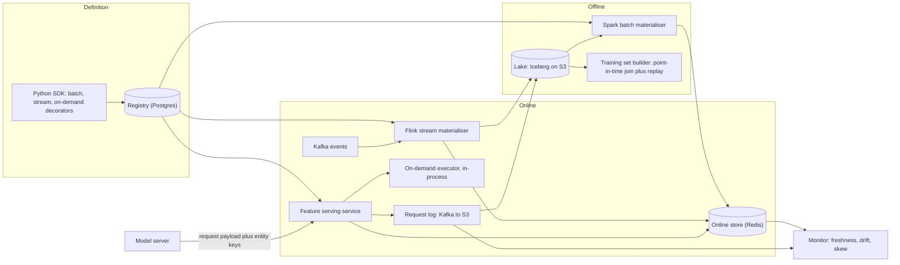

# Feature store — DE 09, on-demand and request-time features

Assumptions: AWS (S3 + Iceberg, EMR Spark, MSK Kafka, EKS, Aurora Postgres for metadata, ElastiCache Redis for the online store). Models are served from a separate model-serving fleet that calls the feature store over gRPC. Python is the lingua franca of the 200 data scientists; the serving path is Go/Java.

## Requirements

Functional

| # | Requirement | Number |
|---|---|---|
| F1 | Define a feature once (batch, stream or on-demand) in a registry; the same definition produces training and serving values | 5,000 features, +20 %/yr |
| F2 | Materialise batch features from the lake to the online store | 100M users, 20M items, daily and hourly cadences |
| F3 | Materialise streaming features from Kafka with sub-minute freshness | 2B events/day, ~23k/s avg, 100k/s peak |
| F4 | Serve online lookups by entity key, single and multi-entity | 200k lookups/s peak |
| F5 | Compute on-demand features from request payload plus stored features, at request time | 10–30 per fraud model, 1–3 per ranking model |
| F6 | Generate point-in-time correct training sets, including on-demand features replayed from logged requests | 1,000/month, up to 3 years of history |
| F7 | Lineage: which model reads which feature, which feature reads which source or request field | full graph |
| F8 | Monitor freshness, null rate, distribution drift and training/serving skew per feature | per feature, per model |

Non-functional

| # | Requirement | Number |
|---|---|---|
| N1 | Fraud feature fetch, stored plus on-demand | p99 < 10 ms end to end; on-demand transforms get at most 3 ms of it |
| N2 | Ranking fetch, 500 candidates | p99 < 50 ms |
| N3 | Online availability | 99.99 %, degrade to defaults rather than fail the request |
| N4 | Streaming freshness | p99 < 30 s event to online store |
| N5 | Training/serving skew on on-demand features | zero by construction: one function, logged inputs, replayed |
| N6 | Backfill 1 feature over 3 years | < 1 day, not weeks |
| N7 | Platform team of 8 owns it | no per-team custom serving code in the hot path |

## Estimates

| Item | Working | Result |
|---|---|---|
| Online store, users | 100M keys x ~1,500 user features x 8 B avg, plus 30 % overhead | ~1.6 TB |
| Online store, items | 20M x ~400 features x 8 B x 1.3 | ~85 GB |
| Online store total, 2 replicas | ~1.7 TB x 2 | ~3.5 TB Redis, ~35 r6g.2xlarge-class nodes |
| Offline store, 3 years | 5,000 features, ~200 GB/day of feature rows (Parquet, compressed) | ~220 TB |
| Raw event retention, 90 days | 2B events x 300 B | ~54 TB |
| Request log for on-demand replay | 200k req/s peak, ~50k/s avg, 1 KB payload after compression 300 B | ~1.3 TB/day, 3 yr ~1.4 PB raw; keep 100 % for 90 days, 10 % sample beyond: ~180 TB |
| Online read rate | 200k lookups/s x ~40 features each | 8M feature values/s, batched to ~200k Redis MGET/s |
| Online write rate | batch 100M rows/day + stream 23k/s avg | ~25k writes/s avg, 300k/s during daily load (rate-limited) |
| On-demand compute | 50k req/s avg x 20 transforms x ~20 us | ~20 CPU-cores of pure transform; 60 cores provisioned |
| Training set generation | 1,000/month, avg 50 features x 10M rows x 1 yr | ~30k Spark core-hours/month |
| Monthly cost | Redis 35 nodes ~$25k; S3 ~$10k; Spark ~$15k; Kafka ~$8k; serving pods ~$10k; request log ~$5k | ~$70–80k/month, order 10^5 USD |

## High-level design



Main flows

| Flow | Steps |
|---|---|
| Define | Data scientist writes a feature view in the SDK, tags it `batch`, `stream` or `on_demand`; CI validates schema, registers it in Postgres with owner, entity, TTL, source or request-field dependencies; on-demand functions are also compiled and pinned by version hash |
| Materialise batch | Spark job per feature view reads Iceberg, writes Parquet feature rows to the offline store with `event_ts`, then rate-limited bulk-loads the latest row per key into Redis |
| Materialise stream | Flink job per feature view consumes Kafka, keeps windowed aggregates in state, writes to Redis and appends to Iceberg every minute for offline parity |
| Serve online | Model server sends entity keys plus the request payload; serving service does one MGET per entity, runs on-demand transforms in-process, returns a feature vector, and asynchronously logs the payload plus fetched stored values |
| Training set | Builder takes an entity/timestamp spine, does an as-of join against offline feature rows, joins the request log by request id for on-demand inputs, and re-executes the pinned transform version |
| Monitor | Freshness per feature from Redis write timestamps; distribution and null rate from the request log sampled at 1 %; skew by recomputing on-demand features offline from the log and diffing against what was served |

## Deep dive: on-demand and request-time features

### The hard part

Some of the most predictive fraud features cannot exist before the request: distance between the device location in the request and the merchant's stored location; seconds since the user's last transaction; this amount divided by the user's 30-day average; whether the shipping address in the payload matches any stored address. Each one mixes a request field with a stored feature. Three things have to hold at once:

1. The transform runs inside a 10 ms p99 budget alongside the Redis fetch.
2. Training reproduces the exact value that was served, which means the request payload and the stored values as fetched must be recoverable for any past request.
3. The 200 data scientists write these transforms in Python, but the platform team of 8 does not want arbitrary Python in the serving hot path.

### The obvious approach and why it breaks

Obvious: the model server pulls stored features from the store, and each team writes the request-time logic in its own model preprocessing code.

| Failure | Why |
|---|---|
| Silent skew | Training code computes `amount / avg_30d` from an offline table; serving computes it from a Redis value refreshed at a different cadence. Nobody notices until the model degrades. |
| No lineage | The registry does not know the model reads `device_lat`; the "which model uses this column" question is back to unanswerable. |
| No replay | The payload is not logged in a joinable form, so training reconstructs it from a different event table with different timestamps. |
| Duplication | Five fraud models implement "distance to merchant" five ways. |

Second obvious approach: precompute everything, streaming the request itself as an event. Breaks because the value depends on this request's payload; you cannot precompute `amount / avg_30d` for an amount you have not seen. Streaming "time since last event" gets stale by exactly the time since the last event.

### What I would do instead

**1. On-demand feature views are first-class registry objects.** Defined in the SDK as a pure function with declared inputs: request fields (schema-typed) and stored feature references. The registry stores the function source, a content hash, the input schema and the output schema. Lineage falls out: model -> on-demand view -> request field and stored feature.

```python
@on_demand(inputs=[Request("amount", float), Request("device_loc", LatLon),
                   Feature("user.avg_amount_30d"), Feature("merchant.loc")])
def txn_risk(req, f):
    return {"amount_ratio": req.amount / max(f["user.avg_amount_30d"], 1.0),
            "dist_km": haversine(req.device_loc, f["merchant.loc"])}
```

**2. Where the transform runs: in the serving service, in-process, from a restricted subset.** Decision table:

| Location | Latency added | Isolation | Language freedom | Verdict |
|---|---|---|---|---|
| Model server preprocessing | 0 ms extra hop, but stored values fetched separately | none, per-team code | full | Rejected: this is the skew machine |
| Serving service, in-process, restricted DSL or pure Python subset | ~0.05–0.5 ms per transform, 1–3 ms for 20 | CPU and time guard per call; no I/O, no imports beyond an allowlist | Python subset, numpy-free arithmetic, geo and time helpers | Chosen |
| Sandboxed executor sidecar (gRPC, WASM or a separate process) | +1–2 ms per hop, 2 hops if chained | strong | full Python | Fallback for the rare heavy transform; opt-in per view, budgeted separately |
| Sandboxed executor, remote service | +3–5 ms | strong | full | Rejected: eats half the budget |

Rule enforced in CI: an on-demand function must pass a static check (no I/O, no imports outside `math`, `datetime`, platform helpers), and a benchmark check (p99 < 200 us on a reference input set). Fails either, it is marked `heavy` and only runs in the sidecar, capped at 3 per model.

The serving service is Go; the Python subset is executed by an embedded interpreter with a hard 1 ms deadline per view and a per-request cap of 3 ms total for all on-demand work. Overrun returns declared defaults and increments a counter; the request never fails on a transform.

**3. Latency budget for a fraud request, p99 10 ms.**

| Stage | Budget |
|---|---|
| Network in, deserialize | 0.5 ms |
| Registry lookup for model's feature list (cached in memory, refreshed every 30 s) | 0.05 ms |
| Redis MGET, user and merchant keys, one pipelined round trip | 3–4 ms |
| On-demand transforms, up to 20 | 3 ms cap |
| Assemble vector, serialize, network out | 0.5 ms |
| Async log enqueue | 0.05 ms, off the critical path |
| Headroom | ~2 ms |

**4. Point-in-time correctness: log the inputs, not the outputs.** Every request is logged with request id, model version, the entity keys, the request payload fields the model declared, the stored feature values as fetched with their Redis write timestamps, and the on-demand view hashes executed. Logging outputs alone is tempting but wrong: if a transform is fixed or a new one is added, you could not backfill it. Logging inputs means the training set builder re-executes the same pinned function against the same inputs and gets the same value, and can execute a new function against old inputs for backfill.

Training set builder for on-demand features: join the spine to the request log by request id (fraud) or by entity plus timestamp with a 1 s tolerance (when the label comes from a different system), then run the transform in Spark using the same Python function. Stored-feature inputs come from the logged as-fetched values, not from an offline as-of join, because the as-of join can disagree with what Redis actually held (late batch load, TTL expiry). The as-of join is still run and diffed against the log, and the diff is the skew metric.

Retention: 100 % of the request log for 90 days, 10 % stratified sample beyond that plus 100 % of any request with a fraud label. That covers 3 years of training for fraud and stays under 200 TB.

**5. Caching expensive on-demand features.** Most transforms are microseconds and are not cached. Two cases are worth it:

| Case | Cache | Key | TTL |
|---|---|---|---|
| Input is expensive to fetch (merchant geo lookup from a slow store) | Promote to a stored feature; it was never really on-demand | n/a | n/a |
| Transform is heavy and inputs repeat (address normalisation, device fingerprint parse) | In-process LRU in the serving pod, 100k entries | hash of the declared inputs | 60 s |
| Same entity scored several times per second (retries, multi-model) | Request-scoped memo within one call; cross-request Redis cache only if p99 measurements justify it | request id plus view hash | request lifetime |

Cache hits are logged as hits with the cached value so replay is still exact.

**6. The decision rule: precompute, stream or on-demand.**

| Question | If yes | Example |
|---|---|---|
| Does the value depend on a field that exists only in the request? | On-demand, no choice | amount ratio, distance to device |
| Does the value change between requests faster than 30 s and matter at that resolution? | Stream, then on-demand for the final delta | count of txns in last 5 min (stream), seconds since last txn (on-demand from a streamed `last_txn_ts`) |
| Does the value change at most hourly and is it expensive? | Batch | 30-day average amount |
| Can the transform run under 200 us on inputs already fetched? | On-demand is fine | any arithmetic on fetched values |
| Is it over 200 us or does it need I/O? | Precompute or stream; if impossible, sidecar with an explicit budget | address geocoding |
| Is it derived only from stored features, no request field? | Precompute it; on-demand here just burns budget and complicates replay | ratio of two batch features |

Written as one line for the SDK docs: compute on demand only what you cannot know before the request; push everything else as far left as freshness allows.

**7. Sequence, fraud scoring with mixed feature types.**

```mermaid
sequenceDiagram
  participant MS as Model server
  participant FS as Feature serving
  participant RG as Registry cache
  participant RD as Online store Redis
  participant OD as On-demand executor
  participant RL as Request log
  MS->>FS: "GetFeatures(model=fraud_v12, user_id, merchant_id, payload{amount, device_loc, ts})"
  FS->>RG: "feature list and on-demand view hashes for fraud_v12"
  RG-->>FS: "batch: avg_amount_30d, home_loc; stream: txn_count_5m, last_txn_ts; on-demand: txn_risk@a1b2"
  FS->>RD: "MGET user:123 merchant:456 (pipelined)"
  RD-->>FS: "values with write timestamps, 3.2 ms"
  FS->>OD: "run txn_risk@a1b2 with payload and fetched values, deadline 1 ms"
  OD-->>FS: "amount_ratio=4.7, dist_km=812, 0.3 ms"
  FS-->>MS: "feature vector, 40 stored plus 2 on-demand, 5.1 ms"
  FS--)RL: "async: request id, payload fields, fetched values with ts, view hashes"
  MS->>MS: "score; label arrives days later keyed by request id"
```

## Trade-offs

| Decision | Gain | Cost |
|---|---|---|
| Transforms run in the serving service, not the model server | one definition, one execution path, lineage | serving service becomes a Python-subset runtime; platform team owns a mini interpreter and its allowlist |
| Restricted Python subset instead of full Python | predictable latency, no I/O surprises | some transforms are rejected and must be re-expressed or pushed to precompute; friction for scientists |
| Log inputs rather than outputs | new transforms backfill against old requests; skew diff is computable | ~1.3 TB/day of logs, retention policy needed |
| Logged as-fetched values are the training truth, not the offline as-of join | matches what the model actually saw | training data inherits online bugs (stale Redis) rather than the ideal value; mitigated by surfacing the diff |
| Default value on transform overrun | request never fails | silent degradation if the counter is not alerted; must be a paged metric |
| 10 % sample beyond 90 days | storage under 200 TB | rare-event models outside fraud may lack replay coverage; they can opt into 100 % per model |

## Pitfalls

- Request timestamp versus server timestamp: "seconds since last event" computed from client `ts` is manipulable and skewed by clock drift. Use the serving server's receive time, log it, and replay from the logged value.
- Redis TTL expiry between fetch and log: log the value as fetched, never re-read at log time.
- A transform reads a stored feature that was not declared: the static check must reject dictionary access by undeclared key, otherwise lineage lies.
- Changing a transform in place: the registry must version by content hash; the model pins a hash; training replays that hash. Editing in place silently changes training data for every model that used it.
- Multi-entity ranking requests: 500 candidates x 3 on-demand transforms x 100 us = 150 ms if run naively. Vectorise: transforms in ranking must accept arrays, or be limited to one per model.
- Request log becoming the de facto event stream: teams will start building batch features from it. Allow it, but through the registry so lineage is intact.
- Float nondeterminism between Go-embedded interpreter and Spark Python: pin the interpreter version in both, test with a golden set nightly.

## Open questions for the panel

1. Restricted Python subset versus a purpose-built expression DSL: the subset keeps scientists happy; the DSL is easier to run in Go and Spark identically. Which do we commit to for year one?
2. Is 3 ms of a 10 ms budget the right cap for on-demand work, or should fraud models that need more buy a separate, slower tier?
3. Should the training truth for stored inputs be the logged as-fetched value (what the model saw) or the offline as-of value (what it should have seen)? I chose logged; a panel with a strong data-quality lens may disagree.
4. Request log retention: 90 days full plus 10 % sample, or full retention with tiered storage at ~3x the cost?
5. Ranking models: do we support on-demand features over candidate arrays at all in v1, or restrict on-demand to single-entity fraud and treat ranking as a v2 problem?

## Non-negotiables

1. Every on-demand transform is a registered, content-hashed function executed by the platform in both serving and training. No request-time feature logic lives in model preprocessing code.
2. The request log captures inputs, not outputs: payload fields, as-fetched stored values with timestamps, view hashes, keyed by request id. Without it point-in-time correctness for on-demand features is unprovable.
3. A hard per-request time cap on on-demand execution with declared defaults on overrun, and an alert on the overrun rate. The feature fetch must never be the reason a payment times out.
