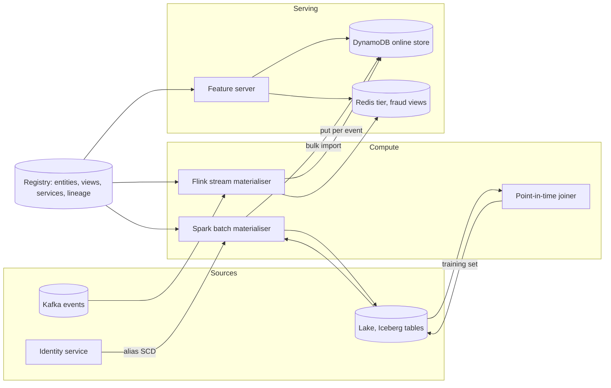
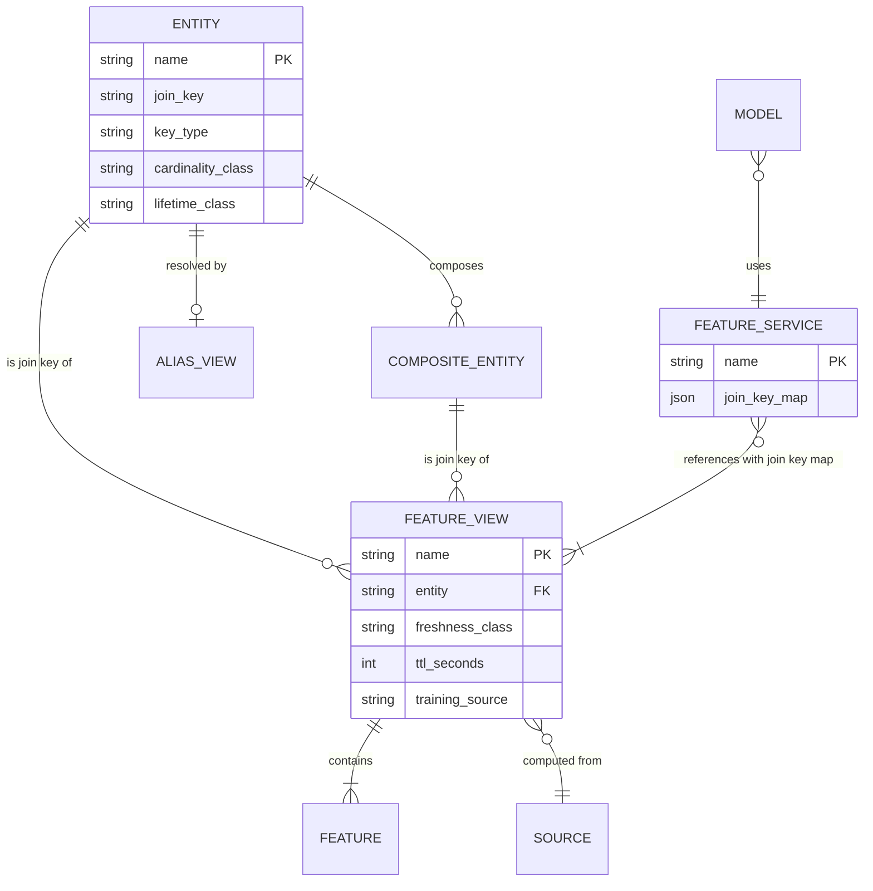
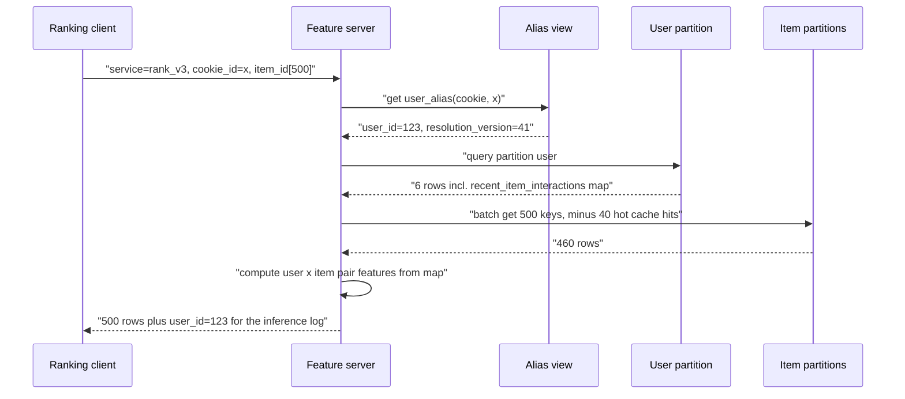

# Feature store — DE 10, the entity model and keys

Assumptions: one cloud (AWS). Managed KV is DynamoDB with a Redis-class in-memory tier (ElastiCache) in front of it for fraud views only. Table format is Iceberg. Identity resolution already exists as an identity service owned by another team; the feature store consumes its output, it does not compute it.

## Requirements

Functional

| # | Requirement | Number |
|---|---|---|
| F1 | Define a feature once; same definition feeds batch, stream and online serving | 5,000 features, +20 %/yr, ~150 feature views |
| F2 | Entities are registry objects; every feature is keyed by exactly one entity or one composite entity | 5 base entities, 2 composites at launch |
| F3 | Online fetch by entity keys for a named feature service | 200k row lookups/s peak, p99 < 10 ms for fraud |
| F4 | Ranking fetch: 1 user + up to 500 candidate items in one call | p99 < 30 ms |
| F5 | Point-in-time correct training set from event log + feature history | 1,000 generations/month, up to 3 years |
| F6 | Alias lookup: external identifier to canonical entity id | email, phone, device fingerprint, cookie |

Non-functional

| # | Requirement | Number |
|---|---|---|
| N1 | Freshness classes | batch 24 h, streaming under 60 s, request-time 0 |
| N2 | Online store must not exceed its budget | under 3 TB resident, under $80k/month |
| N3 | Training/serving skew | 0 features computed by two code paths |

## Estimates

| Quantity | Working | Result |
|---|---|---|
| Feature views | 5,000 features / ~33 per view | ~150 views, ~60 on user, ~30 item, 15 merchant, 15 device, 10 session, 20 composite |
| User online | 100M × ~40 views populated × 300 B per view row (33 × 8 B + key) | 1.2 TB |
| Item online | 20M × 20 views × 300 B | 120 GB |
| Device online | 300M devices × 5 views × 200 B | 300 GB |
| Session online | 200M sessions/day, 30 min TTL, peak 3× average = 12M live × 500 B | 6 GB |
| User × item online | only pairs with an interaction in 90 d: 100M × 30 = 3B keys × 100 B | 300 GB, 3B keys |
| Total online | sum, ×2 for replication | ~4 TB, of which 200 GB in memory (fraud views) |
| Offline history | 100M users × 5 KB/day snapshot, Parquet ~5× compression → 100 GB/day × 3 yr | ~110 TB, ~$2.5k/month S3 |
| Streaming feature writes | 40 % of events touch a streaming view, avg 1.5 rows | ~40k writes/s peak |
| Batch materialisation | 100M users × 40 views in a 2 h window | 220k row writes/s, bulk import path, not the API |
| Online reads | 200k rows/s; ranking is 1 user + 500 items = ~500 rows per request | 400 ranking requests/s = 200k rows/s alone; plan for 400k rows/s |
| Cost order | DynamoDB ~4 TB with on-demand reads ~$40k, ElastiCache 200 GB ~$8k, Spark ~$30k, Kafka/Flink ~$10k, S3 ~$3k | ~$90k/month, of which entity keys are ~40 % of online bytes |

The last line is the point of this lens: at 300 B per row, a 40 B key plus DynamoDB item overhead is 15–40 % of the stored bytes, and for the user × item composite the key is larger than the value.

## High-level design



Main flows

1. Define: an engineer registers an entity (once per company, reviewed by the platform team) then a feature view: entity, source, transformation, freshness class, TTL, owner. The registry rejects a view whose join key is not a registered entity key. Feature services are lists of view references plus a join-key map.
2. Materialise batch: Spark reads the source, writes the daily snapshot to the offline table partitioned by date and bucketed by entity key, then bulk-imports the changed rows into DynamoDB, one item per (view, entity key).
3. Materialise streaming: Flink keys the event stream by entity key, applies the same transformation code (shared library, N3), writes to DynamoDB and, for fraud views, Redis. Also appends to the offline log for point-in-time joins.
4. Serve online: the feature server receives a service name and an entity dict, resolves aliases if the request gave external ids, fans out one batched read per entity type, assembles the row in view order.
5. Training set: the joiner takes a label table (entity keys plus event timestamp), and for each view does an as-of join against the offline snapshot or log using the entity key as of the event time, not the current key.
6. Monitor: per view and entity, row count vs expected cardinality, key miss rate, freshness lag, hot-key top-k sampled in the feature server.

## Deep dive: the entity model and keys

The hard part: an entity is the only thing in the system that cannot be versioned away. Features, views and models come and go; the key they hang off is forever, and every stored byte and every training join is addressed by it.

### The obvious approach and why it breaks

Obvious: `entity = name + join_key column`. Each team picks the identifier that is convenient in its source table: `email` for CRM features, `customer_id` for payments, `device_fingerprint` for fraud, `cookie_id` for web. The store is agnostic and stores whatever it is given.

| Symptom | Root cause | Cost to fix |
|---|---|---|
| Two views on "user" cannot be fetched in one request | keyed by `email` and `customer_id`, no mapping in the store | every caller does its own join, or a re-key of 60 views |
| Fraud model recall drops after an OS release | device fingerprint changed semantics, keys silently rotated | 300 GB of orphaned rows, 6 months of training data wrong |
| Training set leaks the future | user merges applied with the current id, not the id as of event time | regenerate every training set, retrain 60 models |
| Ranking p99 doubles on sale days | 500 items per request hit one shard because item ids are sequential and the partition key is the raw id | live re-partition of 120 GB |
| Online store 3× over budget | user × item composite materialised for every pair with any event, no TTL | delete and re-materialise, models depending on it regress |

Every row of that table is a re-key, and a re-key means re-materialising all views on that entity, regenerating training sets over 3 years, and retraining. The platform team of 8 cannot do that for 30 teams; it is a company-wide migration. So the entity model is where we spend design time up front.

### What I would do instead

Entity as a registry object with these fields, changed only through platform review:

| Field | Meaning | Example (user) |
|---|---|---|
| name | unique | `user` |
| join_key | column name every view and every request uses | `user_id` |
| key_type and format | fixed, validated on write and read | int64 surrogate, never email |
| cardinality class | small (<10M), large (10M–1B), unbounded | large, 100M |
| lifetime class | permanent, long (years), short (minutes to days) | permanent |
| reuse policy | ids may or may not be reused after deletion | never reused |
| resolution | none, or alias table name | `user_alias` |

Rules that fall out:

1. Canonical surrogate ids only. External identifiers (email, phone, cookie, fingerprint) are never join keys. They live in an alias view, `(namespace, external_id) -> canonical_id, resolution_version, valid_from`. The identity service owns the mapping; the store materialises it like any other view so the online path can resolve in one extra read (~1 ms).
2. Resolution is point-in-time. The alias table is a slowly changing dimension with `valid_from` and `valid_to`. The training joiner resolves the alias as of the label timestamp. If users A and B merged last month, a training row from two months ago still sees A's features only. Online, the feature server writes the canonical id it resolved into the inference log, so training later uses the id the model actually saw.
3. Merges do not rewrite features. Rows keyed by the retired id expire by TTL; new events go to the survivor. Views that need the merged history (lifetime spend) are recomputed in the next batch run from the source, which is already resolved by the identity service.
4. Ids are never reused. If the source system reuses ids (SKUs), the registry entity is `item_listing` with a minted surrogate and a `listing_of` link, not `sku`.

### Composite entities

`user_x_item` is registered as a composite of two base entities, key `user_id|item_id` in a fixed order. The registry stores which base entities compose it so a service that references a composite view derives its required entities automatically.

The trap is materialising a composite as if it were a base entity. 100M × 20M is 2e15 potential keys; even the sparse set with any interaction is 3B keys and the key is bigger than the value. Policy:

| Composite shape | Online strategy |
|---|---|
| Both sides large, sparse interactions (user × item) | Collapse onto the low-fan-out side: store on `user` a bounded map `recent_item_interactions` (last 200 items with counts and timestamps). Feature server computes the pair feature at request time for the 500 candidates. 1 read instead of 500, no orphan rows. |
| One side small (user × category, item × country) | Materialise as a composite view, key `user_id|category_id`, TTL 30 days. Cardinality is bounded by the small side. |

The collapsed map feature is a normal feature on `user`, so training uses the same point-in-time snapshot of the map and the same request-time pair computation, which keeps N3.

### How a request names entities

A feature service declares the views it uses; the registry derives the set of entities it needs. The request supplies an entity dict, one list per entity join key, all lists the same length or length one (broadcast).

```
get_online_features(
  service="fraud_v7",
  entities={"user_id": [123], "merchant_id": [88], "device_id": [9001], "session_id": ["s-ab12"]},
  candidates={"item_id": [..500 ids..]}          # ranking only
)
```

When a service uses the same entity twice (payer and payee are both `user`), the service's join-key map says `payee_features: {user_id: payee_user_id}`. The request then carries `payee_user_id` explicitly. This is the one place aliasing of join keys is allowed, and it is declared, not inferred.

### Cardinality, lifetime and storage

| Entity | Cardinality | Lifetime | Online rows | Online bytes | Storage decision |
|---|---|---|---|---|---|
| user | 100M, +15 %/yr | permanent | 4B (40 views) | 1.2 TB | DynamoDB, hash of id; fraud views duplicated into Redis (200 GB) |
| item | 20M, 2M new/month | years, delist after ~1 yr | 400M | 120 GB | DynamoDB; sequential ids are hashed, top 10k hot items cached in the feature server memory for 5 s |
| merchant | 1M | years | 15M | 5 GB | DynamoDB; the 100 largest merchants are hot keys, same server cache |
| device | 300M, churn 30 %/yr | 1–3 yr | 1.5B | 300 GB | DynamoDB, TTL 180 days after last event |
| session | 200M/day | 30 min | 12M live | 6 GB | Redis only, TTL 1 h, never in DynamoDB |
| user × item | 3B interacting pairs | 90 d | 0 as composite | 0 | collapsed onto user as a bounded map (+40 KB per active user, ~400 GB) |
| user × category | 100M × 50 | 30 d | 500M | 50 GB | DynamoDB composite, TTL |

Short-lived, high-cardinality entities are the case where the offline side changes shape. Session features (clicks in session, minutes since session start) are only meaningful for 30 minutes and there are 200M sessions a day; a daily snapshot table of sessions is 6 TB/month of rows nobody will point-in-time join against, because the label arrives inside the session. So session views are request-time and streaming only, and the training source for them is the inference log: the feature server writes the resolved entity keys and the feature values it served. Training for session features reads the log, not a snapshot. This is registered on the view as `training_source: inference_log`, and the joiner refuses to snapshot a view on an entity whose lifetime class is short.

### Feature views group by entity and freshness

A view is one entity, one source, one freshness class, one TTL. The online row is the whole view packed as one item, so a fetch is one read per view per key and the row is written atomically by whichever materialiser owns it. Mixing freshness in a view is rejected by the registry because the daily batch write would overwrite streaming values (or need a read-modify-write per row at 220k rows/s). The user entity therefore has, for example, `user_profile_daily`, `user_txn_stream_60s`, `user_recent_items_daily`, each a separate item under the same partition key so a fraud request reads them in one batched call.

Online key layout: partition key `entity_type#hash(id)`, sort key `view_name#version`. All views for one user are one partition, so a service on one entity is a single query; item hotness is handled by the server cache, not by the store.

### ER diagram



### Online fetch with resolution and collapse



## Trade-offs

| Decision | Chosen | Alternative | Why |
|---|---|---|---|
| Key type | surrogate int64 minted by the owning system | natural keys (email, SKU) | natural keys change meaning; surrogates cost one alias read |
| Resolution | outside the store, materialised as an alias view | store resolves identities | 8 people cannot own an identity graph; point-in-time alias is enough |
| user × item | collapsed map on user | true composite rows | 1 read vs 500, 400 GB vs 300 GB plus 3B keys; loses pairs beyond the last 200 items |
| Session storage | Redis only, training from inference log | snapshot like everything else | 6 TB/month of useless snapshots avoided; training depends on logging being on |
| Partition layout | all views of a key in one partition | one table per view | one query per entity; a very wide user (60 views) is a 20 KB partition, acceptable |

## Pitfalls

- Letting a team register an entity whose join key is a column name in their table rather than a company id. The registry must require an id namespace owner.
- Forgetting the entity's growth: devices grow 30 %/yr with 30 % churn; without a TTL the device table doubles in 3 years with half the rows dead.
- Alias resolution at training time using today's mapping: leaks merges from the future into old rows.
- Treating a session as a user: session features on a user key look fine for a week and then the row explodes to millions of stale values.

## Open questions for the panel

1. Is the identity service able to emit `valid_from`/`valid_to` for alias changes, or do we have to reconstruct SCD history from its change log?
2. Is 200 items in the collapsed `user × item` map enough for ranking, or do some models need pair features over a year of history, which forces a real composite view for those users?
3. Do we accept that session-feature training depends on the inference log being complete, and who owns retention of that log (3 years at 200k rows/s is 20 PB uncompressed)?
4. Payer and payee: a join-key map in the service, or a second registered entity `counterparty` aliasing `user`? The first is simpler; the second gives cleaner lineage.

## Non-negotiables

1. Entities are registered objects with a surrogate key type, an id owner and a lifetime class, and views cannot be created on an unregistered key. Without this every other section of this design is re-done in two years.
2. Alias resolution is point-in-time in training and logged at inference. Without it training sets leak identity merges and the training/serving guarantee is false for any model that uses an external identifier.
3. Composite views on two large entities are not materialised as rows without a platform-approved bound (TTL plus small side or top-k). Without it the online store budget is gone in a quarter.
