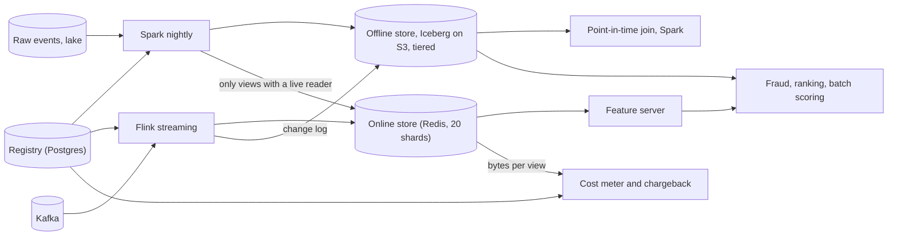
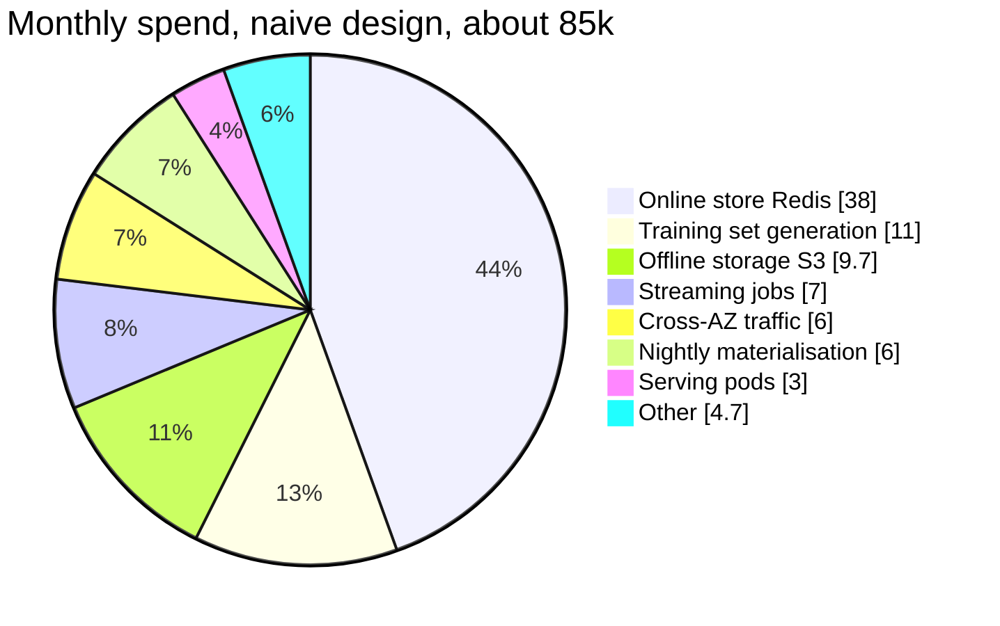

# Feature store — DE 11, storage and cost engineering

Assumptions: AWS us-east-1, on-demand list prices, one region, two AZs. Managed key-value store is ElastiCache Redis (cluster mode); DynamoDB priced as the alternative where it matters. Batch is Spark on EMR spot, streaming is Flink on Kubernetes, offline tables are Iceberg on S3. All figures rounded to two significant digits; the model is meant to be right to a factor of 2, not 10 percent.

## Requirements

Functional:
- One feature definition (registry entry) drives batch, streaming, online serving and point-in-time training joins.
- Online lookup by entity key for a list of feature views; batch scoring reads the offline table directly.
- Training set = entity spine with timestamps, point-in-time joined against N feature views, up to 3 years back.
- Registry answers "which model reads this feature" and "what does this feature cost", per team.

Non-functional, with numbers:

| Requirement | Number |
|---|---|
| Online fetch latency | p99 under 10 ms for up to 5 views, 1 entity; p99 under 25 ms for 300 candidates |
| Online throughput | 200k lookups/s peak, about 3.6M key reads/s after ranking fan-out |
| Batch freshness | features computed on day D available online by 06:00 on D+1 |
| Streaming freshness | under 5 s event-to-online for streaming views |
| Training set generation | p50 under 15 min, p95 under 2 h, 1,000/month |
| Offline retention | 3 years, point-in-time correct at day granularity (hour for streaming views) |
| Cost | monthly bill visible per team; total order of $100k/month, target under $60k with levers |
| Durability | online store is a cache of the offline store; rebuildable in under 8 h |

## Estimates

Online store bytes per entity per feature view (one Redis key per entity per view, value is a packed protobuf):

| Component | Bytes |
|---|---|
| Key: view id 2 + entity id 8 + hash-slot tag | 16 |
| Redis key object and dict entry overhead | 70 |
| Value: 15 features x (1 tag + 8 payload) | 135 |
| Event timestamp + created timestamp | 16 |
| Redis value object overhead, allocator rounding | 20 |
| Total | about 256 B |

Online store size, raw and replicated:

| Entity | Count | Online views | Bytes | Raw |
|---|---|---|---|---|
| Users | 100M | 25 | 256 | 640 GB |
| Items | 20M | 15 | 256 | 77 GB |
| Merchant, device, session | 50M | 5 | 256 | 64 GB |
| Total raw | | | | 780 GB |
| With 1 replica and 25 percent headroom | | | | about 2.0 TB of RAM |

That is 20 primary shards of r7g.4xlarge (105 GB) plus 20 replicas = 40 nodes. Ops check: 3.6M key reads/s over 20 shards is 180k/s per shard, inside what a 16 vCPU Redis 7 node does with io-threads, so memory and ops agree on 20 shards.

Offline store growth (Iceberg, Parquet, zstd, about 80 B per row per view after compression):

| Source | Rows/day | Bytes/row | GB/day |
|---|---|---|---|
| User batch views, daily snapshot, 40 views | 4.0B | 80 | 320 |
| Item batch views, 20 views | 0.4B | 80 | 32 |
| Streaming view change log | 0.5B | 60 | 30 |
| Total | | | about 380 GB/day, 140 TB/year, 420 TB at 3-year steady state before the 20 percent/year feature growth |

Write and read rates: nightly push of 2.5B rows into Redis over 4 h is 175k writes/s; streaming is 23k events/s average, 70k peak; online reads 3.6M keys/s peak. Compute: nightly batch about 4,000 core-hours (20 TB scanned across 300 views at roughly 100 MB/s per core plus shuffles), streaming about 120 vCPU and 500 GB state continuously, training set about 200 core-hours mean.

Monthly cost, naive design (everything materialised online, daily full snapshots, no tiering):

| Line | Arithmetic | $/month |
|---|---|---|
| Online store, Redis | 40 x r7g.4xlarge x $1.31/h x 730 h | 38,000 |
| Feature serving pods | 15 x c6g.2xlarge x $0.27/h x 730 | 3,000 |
| Offline storage, S3 Standard | 420 TB x $23/TB | 9,700 |
| Compaction rewrite | 380 GB/day rewritten 2x, 600 core-hours/day x $0.05 x 30, plus PUTs | 1,200 |
| Nightly materialisation | 4,000 core-hours x $0.05 (spot + EMR fee) x 30 | 6,000 |
| Streaming jobs | 15 x m6g.2xlarge x $0.31/h x 730 = 3,400, plus incremental Kafka 2 TB/day about 3,000, plus checkpoints | 7,000 |
| Training set generation | 1,000 x 200 core-hours x $0.05 = 10,000, plus 30 TB of outputs x $23 | 11,000 |
| Cross-AZ traffic | reads 150 MB/s = 390 TB/month, 2/3 cross-AZ x $0.02/GB = 5,200; replication and writes 40 TB x $0.02 = 800 | 6,000 |
| Feature logging for skew checks, 1 percent sample | 26 TB/month x $23 plus Kafka | 1,000 |
| Registry, metadata DB, monitoring | 2 x db.r6g.large plus Prometheus, Grafana | 1,500 |
| Total | | about 85,000 |

DynamoDB instead of Redis, same shape: storage 780 GB x $0.25 = $200; reads 5.3e11/month at $0.0625 per million eventually consistent = $33,000 on-demand, about $9,500 provisioned; writes are the trap: 2.5B rows/night x 30 = 75B writes x $1.25 per million = $94,000 on-demand, about $13,500 provisioned for a 4 h window. DynamoDB only wins if writes are change-only (lever 1 and 2 below), and its p99 is 5 to 10 ms in-region, which leaves no margin for the fraud budget. Redis it is; DynamoDB for the long-tail views if the fraud path never touches them.

## High-level design

Flows, one line each:
- Define: a feature view is a SQL or Python transform plus entity, schema, TTL, owner team, and online flag; registry stores it and its lineage to models.
- Materialise batch: nightly Spark computes the view, writes the Iceberg partition, then pushes changed rows for online-flagged views to Redis with the registry TTL.
- Materialise streaming: Flink reads Kafka, keeps windowed state (sketches, not sets), writes to Redis on every update and appends a change log to Iceberg every 5 minutes.
- Serve: feature server takes entity keys and view names, issues one MGET per shard, returns a packed row; ranking calls batch 300 keys.
- Training set: Spark as-of join of the spine against daily snapshots, pruned to spine dates; results cached by content hash of (spine, views, timestamps).
- Monitor: freshness lag per view, null rate, served-vs-offline skew on the 1 percent log, and cost per view per team.

## Deep dive: storage and cost engineering

The hard part: the online store costs about $50 per GB-month ($38k / 780 GB), the offline store costs $0.023. A 2,000x price gap means every byte that reaches Redis without a reader is the single most expensive mistake in the system, and the naive design puts every byte there.

The obvious approach: materialise every feature view online for every entity, refresh nightly with a full snapshot, keep every offline partition in S3 Standard forever, count distinct things exactly. It is what the first version of every feature store does because it has no state to get wrong.

Why it breaks, with numbers:
- 45 percent of the 100M users have not been seen in 90 days; they hold 290 GB of Redis and will never be scored online. Fraud scores a request, and a request comes from a live user.
- Of 5,000 features, models in production read about 1,200 online. The registry shows 40 percent of online-flagged views have zero live readers; they exist because someone materialised them for an experiment.
- Full nightly snapshots write 2.5B rows when 15 percent of users changed; 85 percent of the 4 h write window and the cross-AZ replication bytes are wasted. On DynamoDB this alone is $80k/month.
- Exact distinct-count state in Flink: 100M users x 40 count-distinct features x 1.6 KB average set = 6.4 TB of state, 60 nodes instead of 15, about $25k/month for streaming instead of $7k.
- 420 TB in S3 Standard when 90 percent of training reads touch the last 90 days.

What I would do instead, five levers:

| Lever | Arithmetic | Saves/month |
|---|---|---|
| 1. TTL on online rows, 90 days since last event, refreshed on write | users 100M to 55M; Redis raw 780 GB to 490 GB; 40 nodes to 26 | 13,000 |
| 2. Online flag requires a live reader; registry auto-unflags views with 0 model readers for 30 days | user views 25 to 15, item 15 to 10; with lever 1, raw about 300 GB, 16 nodes | 10,000 more, 21,000 total on Redis |
| 3. Change-only online writes, computed as an Iceberg diff of D vs D-1 | 2.5B to 375M writes/night; write window 4 h to 40 min; cross-AZ write bytes 40 TB to 6 TB | 1,500, and makes DynamoDB viable for long-tail views |
| 4. Tier offline: 12 months Standard, older than 12 months keep weekly snapshots in Standard-IA and daily deltas in Glacier IR | 140 TB x $23 + 40 TB x $12.5 + 240 TB x $4 = 3,200 + 500 + 960 = 4,700 vs 9,700 | 5,000 |
| 5. Sketches: HLL++ for distinct counts, Count-Min for top-k, t-digest for percentiles | Flink state 6.4 TB to 0.8 TB; RocksDB on 15 nodes instead of 60 | 18,000 avoided versus exact state |
| 6. AZ-aware reads from the local replica | cross-AZ read bytes 260 TB to about 20 TB | 4,800 |
| 7. Training set cache by content hash, spine-date partition pruning | 1,000 requests, 35 percent are repeats of last week's set with a moved window; 200 to 130 mean core-hours | 4,000 |

Post-lever monthly total: Redis 17,000, serving 3,000, offline 4,700, compaction 1,200, batch 6,000, streaming 7,000, training 7,000, cross-AZ 1,200, logging 1,000, registry 1,500 = about $50,000. Half the naive bill, and the remaining spend is dominated by things that are being read.

Mechanics that make the levers safe:
- TTL is set per row at write time from the view definition; a streaming write refreshes it, so an active user is never evicted. A miss on an evicted user returns the registry default and the server emits a metric; fraud treats "no features" as its own signal, which it already does for new users.
- Auto-unflag never deletes offline data; it stops pushing to Redis. Re-flagging is a registry change plus one backfill of the latest partition, about 20 minutes for a user view.
- Change-only writes need a row hash column in the Iceberg table; the diff is a join on (entity, hash), and a weekly full push guards against drift from missed diffs.
- Tiering only works if the point-in-time join can answer from weekly snapshots plus deltas; the join planner picks snapshot-then-replay for spine dates older than 12 months and the registry marks the view's granularity so the model owner knows they get weekly resolution past a year.
- Sketches change the offline contract: a distinct-count feature is stored as a mergeable sketch in the offline change log and finalised to a number at read time; error is under 2 percent at 12-bit HLL, and the registry records the error bound on the feature.

Where the money goes, naive design:

Chargeback: every feature view carries an owner team. The cost meter runs monthly and attributes:
- Online: bytes held per view (sampled MEMORY USAGE on 10k keys per view, times key count) x $50/GB-month.
- Offline: Iceberg partition bytes per view x tier price.
- Compute: Spark and Flink jobs tagged with view id; core-hours x $0.05 batch, node-hours pro-rata by state bytes for streaming.
- Reads: share of key reads per view from server metrics x the serving pod bill; consumers pay reads, producers pay storage and compute.
- Training sets: core-hours of the join billed to the requesting team.
A team dashboard lists its views with $/month and reader count. A view with $0 of reads and non-zero cost for 30 days gets an email, at 60 days the online flag is removed, offline stays. This is the only mechanism that keeps the 20 percent/year feature growth from becoming 20 percent/year bill growth.

Cost of one training set, shown: spine 20M rows over 60 days, 8 views. Partition pruning reads 60 days x 8 views x 8 GB = 3.8 TB; Spark at 55 core-hours per TB read plus shuffle is 200 core-hours x $0.05 = $10, output 10 GB, retained 90 days for $0.70. A 3-year spine over the same views reads 140 TB from Standard plus 40 TB of weekly snapshots from IA (retrieval $0.01/GB, $400) and costs about $600; the registry shows the estimate before the job runs and requires a team approval above $200.

## Trade-offs

| Decision | Chosen | Cost of the choice |
|---|---|---|
| Redis over DynamoDB for the hot path | Redis, memory-priced, no per-op cost | Pay for RAM whether read or not; capacity is a planning exercise, not autoscaling |
| Per-view keys over one blob per entity | Per-view | 70 B key overhead per view; a 5-view fetch is 5 keys, but a view refresh rewrites 150 B not 4 KB |
| Daily snapshots in offline store over deltas only | Snapshots hot, deltas cold | 6x more bytes for 12 months; point-in-time joins stay one partition read per day |
| Sketches for distinct counts | Sketches | 1 to 2 percent error; exact counts only as a batch feature at day granularity |
| 90-day TTL | 90 days | A returning user gets defaults for one request until the streaming path refills; batch refill next morning |
| Chargeback with auto-unflag | Enforced | Teams will argue about attribution of shared views; split by reader share |

## Pitfalls

- Redis memory fragmentation after mass TTL expiry can leave 30 percent unusable; schedule active defrag and size headroom at 25 percent, not 10.
- Change-only writes silently miss rows if the row hash excludes a column added later; the weekly full push is the backstop, keep it.
- Glacier IR retrieval fees turn a $10 training set into a $600 one; the cost estimate must run before the job, not after.
- Cross-AZ bills hide inside "data transfer" and are attributed to no team; meter them at the feature server and add them to the reader's bill.
- Sketch merges across batch and streaming must use the same precision; a 12-bit and 14-bit HLL do not merge.
- Ranking fan-out of 300 keys per request is 90 percent of key reads; a single new candidate-level view can double the serving bill.

## Open questions for the panel

1. Is 90 days the right online TTL for fraud, where a dormant account waking up is itself a strong signal? A longer TTL costs $150/month per million extra users.
2. Do we need a second region for the online store? It doubles the Redis bill and adds about $400/month of replication; the offline store already survives a region loss.
3. Who pays for a shared view read by 12 models: producer, readers by share, or the platform team as a subsidised commons?
4. Is weekly resolution acceptable for training data older than 12 months, or does some model need daily point-in-time for 3 years, which keeps 280 TB hot for $6k/month?
5. Should the feature log for skew detection be 1 percent sampled or full for fraud only? Full fraud logging is 1.6 TB/day.

## Non-negotiables

1. Every online row has a TTL and every online view has a live reader in the registry; no reader, no bytes in Redis.
2. Every feature view has an owner team and a monthly cost line, computed from meters, not estimates.
3. Training set generation shows its cost before it runs and blocks above a team threshold.
