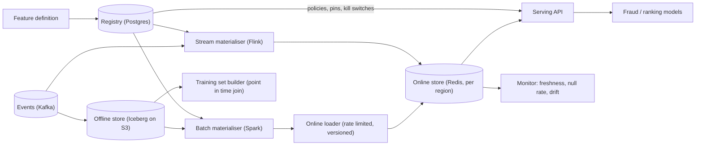
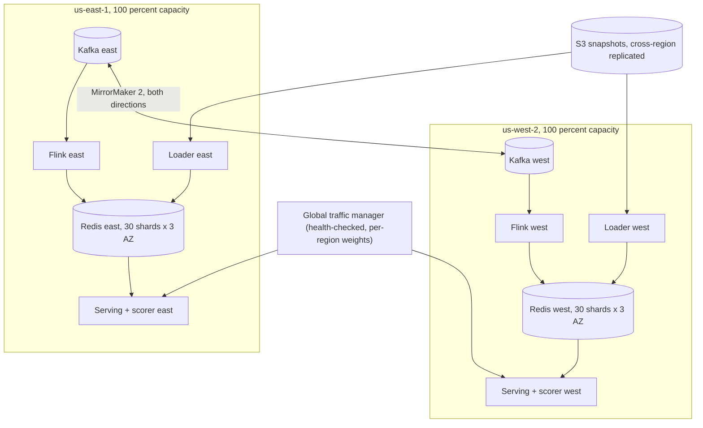
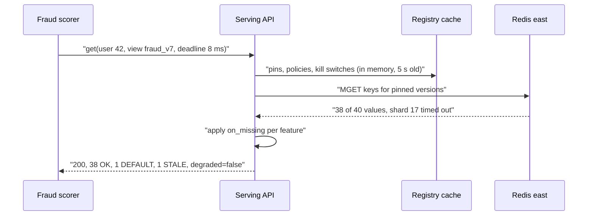

# Feature store — DE 12, availability, multi-region and degraded modes

Assumptions: AWS. Kafka is MSK, the managed key-value store is ElastiCache Redis (cluster mode), the lake is Iceberg on S3, metadata is Postgres. Fraud scoring runs in the same two regions as the store and never reads features across a region boundary.

## Requirements

Functional

| # | Requirement | Number |
|---|---|---|
| F1 | Register a feature once, same definition drives batch, stream and serving | 5,000 features, +20 %/yr, ~6,000 in year 1 |
| F2 | Batch materialise to online store | 100M users + 20M items nightly, done inside a 2 h window |
| F3 | Stream materialise | 2B events/day, feature visible online within 5 s p99 of event time |
| F4 | Online read of N feature views for M entities in one call | fraud: 1 entity, ~40 features; ranking: up to 500 entities, ~10 features each |
| F5 | Point-in-time training set from offline store | 1,000/month, up to 3 years of history |
| F6 | Per-feature serving policy: what to return when the value is missing, stale or the store is down | declared at registration, mandatory |
| F7 | Per-feature kill switch and per-feature-view version pin, changeable without a serving deploy | propagates in 5 s |

Non-functional

| # | Requirement | Number |
|---|---|---|
| N1 | Online read latency | p99 < 10 ms for fraud (1 entity), p99 < 25 ms for 500-entity ranking |
| N2 | Online read throughput | 200k lookups/s global peak; each region alone must carry 200k/s |
| N3 | Online availability, measured as successful responses including degraded ones | 99.99 % per region, 99.995 % global; the serving API returns a usable response even when the store returns nothing |
| N4 | Region loss | serving continues within 60 s, no data rebuild needed; a whole-region cold rebuild of the online store under 45 min |
| N5 | Bulk load isolation | a batch load or backfill may not push read p99 above 10 ms; a bad load is reverted in under 1 min |
| N6 | Bad definition blast radius | a new feature version can affect at most 1 % of serving traffic for its first 15 min |
| N7 | Freshness | batch features 24 h, stream features 5 s p99, kill switch 5 s |

## Estimates

| Item | Working | Result |
|---|---|---|
| Online entities | 100M users + 20M items | 120M |
| Online bytes per entity | ~40 online features, packed binary, ~16 B each + key | ~1 KB |
| Online dataset | 120M × 1 KB | 120 GB per region, 360 GB with 2 replicas per shard |
| Online cluster | 30 shards × 3 nodes (primary + 2 replicas across 3 AZs), 16 GB nodes | 90 nodes/region, ~4 GB used per shard, headroom for a 2× versioned batch load |
| Read rate | 200k lookups/s × ~1 KB; ranking calls fan out to ~500 keys but share the same budget | ~200 MB/s, ~7k ops/s per shard, well under a shard's ~100k ops/s |
| Stream write rate | 2B events/day = 23k/s avg, 70k/s peak; ~1 feature-view update each | 70k writes/s per region at peak |
| Batch write rate | 120 GB in 2 h | 17 MB/s, ~17k writes/s per region, throttled to 20 % of shard capacity |
| Offline store | 100M users × 5,000 features × 8 B ≈ 4 TB/day raw, 4:1 compressed, 3 years | ~1.1 PB, S3 ~$25k/month |
| Training set compute | 1,000/month × ~2 h × 50 nodes × ~$1/node-h | ~$100k/month |
| Online store cost | 90 nodes × ~$150 × 2 regions | ~$27k/month |
| Total | | ~$170k/month, dominated by Spark for training sets, not by the online path |

## High-level design

Main flows

1. Define: a feature is a versioned, immutable record in the registry: entity, source, transform, TTL, freshness SLO, `on_missing` policy, owner. Registration runs schema validation and a dry run against yesterday's data; the dry run's value distribution is stored as the baseline.
2. Materialise batch: Spark computes the feature view from Iceberg, writes the result back to Iceberg (offline truth) and hands a snapshot to the loader. The loader writes into a new version namespace in Redis, then flips a pointer.
3. Materialise streaming: Flink consumes Kafka, computes windowed features, writes to Redis with last-writer-wins by event time, and appends to Iceberg for training parity.
4. Serve online: the API reads the pointer map and policies from a local cache (refreshed every 5 s from the registry), fetches keys from the region-local Redis with the caller's deadline, and returns a value plus a status per feature.
5. Training set: point-in-time join of the label table against Iceberg feature tables using event timestamps; no online store involved.
6. Monitor: per feature, freshness lag, null and default rate, distribution drift against the registration baseline; per region, read p99, error rate, replication lag of the input streams.

## Deep dive: availability, multi-region and degraded modes

The hard part: the fraud scorer is synchronous and its availability is bounded by the feature fetch. Every component in the online path must fail in a way the scorer can act on, and the two regions must not share a failure domain.

The obvious approach: one Redis cluster, replicated cross-region by the store (global datastore), serving API returns 500 when a key is missing or the store is slow. Why it breaks: (a) the replication lag becomes an invisible single failure domain, a stalled replica means the standby region is silently 30 min stale on the day you need it; (b) a bulk load runs in the same keyspace as live reads and a bad backfill needs a re-load to undo; (c) a 500 on one missing feature takes down a score that had 39 good features; (d) the standby is sized for standby and cannot take 200k/s.

What I would do instead.

### Two independent cells, replicate inputs not state

- Each region computes its own online store from the same inputs: the mirrored Kafka topics and the cross-region replicated S3 snapshot. Nothing on the hot path crosses a region. Region loss is a traffic-manager weight change, not a promotion; the surviving region is already warm and already at 100 % capacity.
- Within a region: 3 AZs, each shard has one primary and 2 replicas in different AZs, reads go to replicas as well as primaries. Losing an AZ loses a third of replicas and some primaries; promotion takes 10 to 30 s, during which reads to those shards fall back to policy (below).

### Consistency: what stale means and when it is not fine

| Feature class | Write path | Staleness accepted | Why |
|---|---|---|---|
| Batch profile features (account age, 30-day spend) | nightly loader | up to 48 h (one missed run) | value moves slowly; a missed run is flagged, not fatal |
| Stream aggregates (txns in last 5 min, distinct devices in 1 h) | Flink, event-time LWW | 5 s p99, 60 s hard limit | the second transaction of a burst must see the first; beyond 60 s the feature is worse than its default and is reported STALE |
| Entity attributes from the app (email verified, KYC tier) | CDC through Kafka | 30 s | a wrong tier can flip a decision; app also passes the current tier in the request as an override |
| Cross-region ordering | none | regions may disagree for the mirror lag, ~1 s | a user hitting both regions inside a second is rare and the scorer is idempotent |

Writes carry `event_ts`; the store rejects a write older than the stored one, so a Kafka replay or a mirror re-delivery never moves a value backwards. There is no read-your-writes guarantee; the one place it mattered (KYC tier) is solved by the caller passing the fresh value.

### The serving contract when things are missing or down

Every feature declares one `on_missing` policy at registration; the API never invents a value.

| Policy | Returns | Typical use |
|---|---|---|
| `default(v)` | v, status DEFAULT | counts and rates, default 0; fail open |
| `last_known(max_age)` | last value if younger than max_age, status STALE; else DEFAULT or MISSING | profile features |
| `null` | null, status MISSING | features the model was trained with nulls for |
| `required` | null, status MISSING, and the response is marked `degraded=true` | KYC tier; scorer fails closed on this one |

Response shape: `{values: {...}, status: {feature: OK or STALE or DEFAULT or MISSING or DISABLED}, as_of: {...}, degraded: bool, served_by: region}`. HTTP 200 for any partial result; HTTP 503 only when the API cannot reach any shard for the request's keys, so the scorer's circuit breaker trips on real outages and not on one missing feature. The caller passes a deadline; at deadline the API returns what it has. Fail open or closed is the model owner's decision, made per feature at registration, and enforced by the scorer reading `degraded`.

### Isolating bulk loads and bad backfills

- The loader writes a batch feature view into a new key namespace `fv:{view}:{run_id}:{entity}`, verifies row count and null rate against the offline table, then flips one pointer in the registry. Serving pods pick the pointer up within 5 s. Rollback is the same pointer flip to the previous run_id, under 1 min, no re-load. The previous namespace is kept 24 h then expired.
- The loader is a token bucket per shard at 20 % of measured shard write capacity, and it backs off when the region's read p99 crosses 7 ms. The 2 h window at 17 MB/s leaves 4× slack.
- Stream features are not versioned; a bad Flink deployment is reverted by redeploying the previous job from its savepoint and replaying from Kafka, with the event-time LWW rule preventing old values from overwriting newer ones.

### Region failover and rebuild

- Steady state: both regions take traffic, weights 50/50, each provisioned for 200k/s plus 30 % headroom. Failover is the traffic manager setting one weight to 0 after 3 failed health checks in 30 s. Health check is a synthetic read of 5 canary entities through the full path.
- Cold rebuild of a region's store: load the latest S3 snapshot (120 GB, 30 shards in parallel, ~15 min), then replay the mirrored Kafka topics from the snapshot's recorded offsets (~1 day at 70k writes/s per region takes about 10 min). Target 45 min; drill quarterly.
- A rebuilding region is held at weight 0 until its freshness monitor shows stream lag under 5 s for 5 min.

### Blast radius of a bad feature definition

| Stage | Check | Catches |
|---|---|---|
| Registration | schema, type, TTL, policy present, owner present | malformed definitions |
| Dry run | compute yesterday's values, compare distribution to previous version | logic errors, unit changes |
| Offline only | new version writes to Iceberg for 1 day before any online pin | silent drift |
| Online canary | serving pins the new version for 1 % of pods for 15 min; auto-revert if null rate, DEFAULT rate or latency regress | serving-side breakage |
| Kill switch | per-feature `disabled` flag, serving returns policy default with status DISABLED | anything found after rollout |

A model pins feature view versions; a new feature version is never picked up implicitly. The worst case is therefore one model, 1 % of its traffic, 15 min.

### Failure modes and the behaviour the serving API exhibits

| Failure | Detection | Serving behaviour |
|---|---|---|
| One Redis shard primary dies | replica promotion, 10 to 30 s | features on that shard follow policy; DEFAULT or STALE; `degraded` only if a `required` feature is on it |
| Whole AZ lost | a third of shards promote | same as above for ~30 s, then normal; capacity stays above 200k/s |
| Region lost | health checks fail 3× in 30 s | traffic manager moves 100 % to the other region; other region already warm |
| Kafka mirror stalls | mirror lag alert at 30 s | stream features in the lagging region go STALE past 60 s, batch features unaffected; if lag exceeds 5 min, region weight lowered to 10 % |
| Flink job down | freshness lag on every stream feature | stream features age into STALE, then policy default; batch unaffected |
| Nightly batch missed | run not completed by deadline | previous version stays pinned, features valid up to 48 h, alert to owner |
| Bad backfill loaded | row count or null-rate check fails, or canary alerts | never pinned, or pointer flipped back in under 1 min |
| Registry (Postgres) down | cache refresh fails | pods serve from the last in-memory snapshot; no new pins or kill switches until it returns |
| Serving API pods overloaded | p99 above 10 ms, CPU | load shedding by priority header: fraud first, ranking shed first; ranking callers get 503 and use their own fallback |
| Store completely unreachable in a region | all shards fail | 503 to callers; the scorer's circuit breaker sends traffic to the other region via the traffic manager |
| Bad feature version deployed | canary metrics | auto-revert of the pin within 15 min, at most 1 % of one model's traffic |
| Feature with `required` policy missing | per-request | value null, `degraded=true`; the scorer fails closed by its own rule |

## Trade-offs

| Decision | Chosen | Alternative | Why |
|---|---|---|---|
| Cross-region strategy | replicate inputs, each region builds its own store | Redis global datastore or DynamoDB global tables | no store replication lag on the critical path, rebuild is independent; costs a second Flink and loader |
| Region capacity | 2 regions at 100 % each | 3 regions at 50 % | a third cell is more operations for a team of 8; 2 × 100 % is simpler and one region can be drained at will |
| Partial results | 200 with per-feature status | 500 on any miss | one bad feature must not kill a score; callers decide per feature |
| Batch load versioning | keyspace per run, pointer flip | in-place upsert | rollback in a minute, load isolation; costs 2× memory for batch views |
| Fail open or closed | per feature at registration | global setting | a velocity count and a KYC tier deserve different answers |

## Pitfalls

- Defaults that look like data: a DEFAULT of 0 for "transactions in last 5 min" is indistinguishable from a genuine 0 unless the model reads the status; train models with the status as an input or monitor DEFAULT rate per feature.
- Testing failover once and never again; the rebuild path rots. Quarterly drills with a real region drain.
- Loader and stream writer racing on the same key when a feature is both backfilled and streamed: keep them in different feature views or the event-time LWW rule must apply to both.
- Ranking callers fanning out 500 entities can starve fraud reads on the same shards; the priority header and per-caller quotas must exist from day one.

## Open questions for the panel

1. Should the model registry own the fail-open or fail-closed decision instead of the feature registry, since it is the model that has the loss function?
2. Is 60 s the right hard staleness limit for velocity features, or should the fraud team define it per feature from their own analysis?
3. Do we accept the 2× memory cost of versioned batch views, or version only the top 20 views by traffic?
4. Is a single global traffic manager an acceptable dependency, or should the scorer itself hold both regional endpoints and fail over client-side?
5. Should ranking get its own Redis cluster to remove the noisy-neighbour risk to fraud, at roughly $13k/month per region?

## Non-negotiables

1. Every feature has an `on_missing` policy at registration and the API returns a status per feature; no feature can be served without saying what happens when it is absent.
2. Each region is independently capable of 100 % of peak and builds its own online store from replicated inputs; no cross-region read on the hot path.
3. Batch loads land in a versioned namespace behind a pointer, rate limited against live reads; rollback is a pointer flip, never a re-load.
