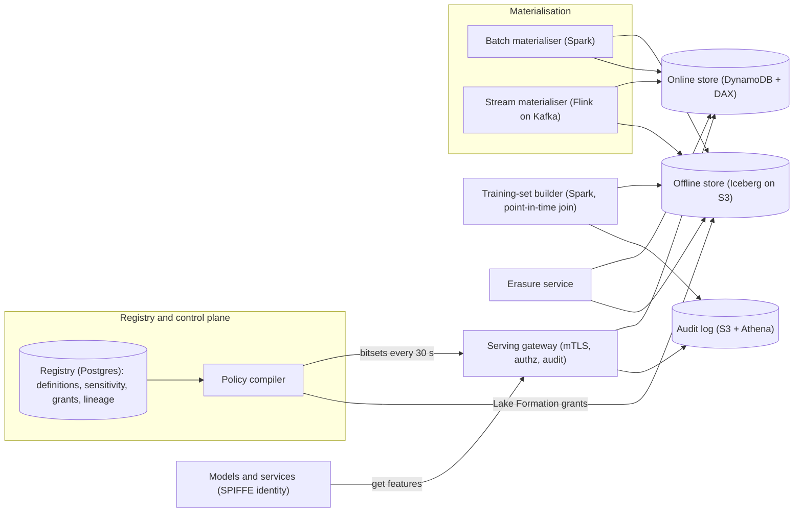
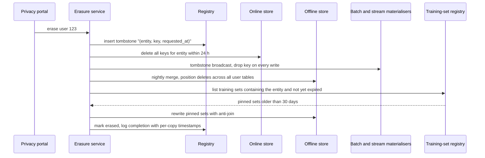
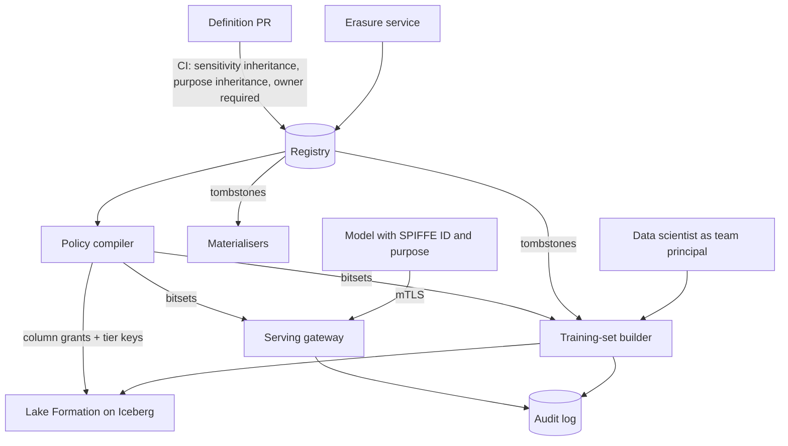

# Feature store — DE 13, governance, security and access control

Assumptions: AWS (S3 + Iceberg lake, EMR Spark, MSK Kafka, EKS, Aurora Postgres for metadata, DynamoDB with DAX for the online store, KMS, Lake Formation). The company operates in the EU and the US, has a credit product and a marketplace, so GDPR erasure and ECOA/FCRA-style restrictions on decision inputs both apply. Erasure requests run at 0.01 percent of users per month, about 10k per month.

## Requirements

Functional

| # | Requirement | Number |
|---|---|---|
| F1 | Define a feature once (name, entity, type, source, transform, owner, sensitivity, allowed purposes) and have batch, stream and serving read that one definition | 5,000 features, +20 percent a year |
| F2 | Materialise batch features to offline and online stores | nightly over 100M users and 20M items |
| F3 | Materialise streaming features from Kafka | 2B events a day, freshness under 1 min |
| F4 | Serve online features by entity key, many views per call | 200k lookups/s peak, up to 200 candidates a request |
| F5 | Generate point-in-time correct training sets from a label table | 1,000 a month, up to 3 years of history |
| F6 | Lineage: source column to feature to feature view to training set to model | answers "which model uses this column" in under 1 s |
| F7 | Governance (my lens): sensitivity tags that propagate through lineage; per-view grants split by offline and online read; service identity for online callers; audit of who read what; erasure across online, offline and generated training sets; purpose restrictions; retention; encryption | all enforced by code, not by review |

Non-functional

| # | Requirement | Number |
|---|---|---|
| N1 | Online fetch p99 | under 10 ms including the authorisation check, which gets under 50 µs of that |
| N2 | Online availability | 99.99 percent; authorisation fails closed but never adds a network hop to the read path |
| N3 | Erasure SLA | value gone from online in 24 h, from offline and platform-held training sets in 30 days, cannot be resurrected by backfill |
| N4 | Audit | every training-set generation and every offline query logged with principal, views and time range; online reads logged per caller, view and minute; entity-level for sensitive views; retained 1 year, 7 for the credit product |
| N5 | Policy propagation | grant or revoke visible at every enforcement point in under 60 s |
| N6 | Encryption | at rest under KMS keys per sensitivity tier, in transit TLS 1.2+ with mTLS between services |

## Estimates

| Quantity | Estimate | Working |
|---|---|---|
| Online storage | 300 GB logical, 1 TB with replication | 100M users x 200 online features x 12 B + 20M items x 100 x 12 B |
| Offline storage | 100 to 200 TB compressed | 10 percent of 100M x 5,000 x 8 B changes a day = 400 GB/day, 3 years, 4:1 Parquet |
| Online writes | 30k/s average, 100k/s peak | 2B events/day into streaming views plus nightly batch loads of 100M rows |
| Online reads | 200k lookups/s, about 10M feature values/s | 50 features per fraud call, 200 candidates x 20 features per ranking call |
| Training-set compute | 1,000 jobs/month, each 2 to 20 Spark-hours | point-in-time join over 3 years, 20 to 50 views |
| Monthly cost | 150 to 250k USD | DynamoDB with DAX 40k, S3 5k, Spark materialisation and training sets 80 to 150k, Kafka and Kubernetes 30k |
| Authorisation check | under 1 µs, in memory | policy compiled to a bitset per principal, refreshed every 30 s |
| Audit volume, aggregated | 1M rows/day | 60 models x 10 views x 1,440 minutes |
| Audit volume, entity level for sensitive views | 100 GB/day, 9 TB for 90 days hot | 10 percent of reads x 60 B, S3 cost about 200 USD/month |
| Erasure load | 330 keys/day, one daily merge across about 300 offline tables | 10k requests/month; Iceberg position deletes, weekly compaction |
| Rewrite of pinned training sets | under 5 percent of sets outlive 30 days, about 50 rewrites/month | each an anti-join and rewrite of 10 to 500 GB |

## High-level design

Main flows

1. Define a feature: a pull request adds a definition file; CI validates schema, requires owner, sensitivity and allowed purposes, derives inherited sensitivity from the input lineage, and blocks if a derived feature would be less sensitive than its inputs without a signed declassification. Merge writes the registry.
2. Materialise batch: nightly Spark reads the definition, computes the view, writes an Iceberg partition, anti-joins the erasure tombstone table, then bulk-loads the online store with a per-view TTL.
3. Materialise streaming: Flink consumes Kafka, computes windowed aggregates from the same definition, writes online with TTL, and appends to the offline log for point-in-time correctness. Tombstones are broadcast state, so an erased key is dropped before the write.
4. Serve online: the caller presents an mTLS SPIFFE identity; the gateway maps it to a principal, checks the principal's bitset against the requested views and the model's registered purpose, reads DynamoDB through DAX, emits an audit record, and returns.
5. Generate a training set: the builder runs as the requesting principal, checks grants and purposes for every view, does the point-in-time join, anti-joins tombstones, writes to the platform-managed bucket with a 30-day expiry, and registers the artifact with its lineage.
6. Monitor: freshness and null-rate per view, policy-refresh age at every gateway, erasure queue age, audit-pipeline lag, denied-request rate per principal.

## Deep dive: governance, security and access control

The hard part

Governance has to hold at seven places that are owned by four different systems: the registry, the lake, the online gateway, the training-set builder, the two materialisers and the audit pipeline. Each has its own idea of identity and its own latency budget. Erasure is the worst case because a feature value exists in five copies (Kafka, online, offline, generated training sets, model artefacts) and any backfill can quietly put it back.

The obvious approach and why it breaks

| Obvious approach | Why it breaks |
|---|---|
| Tag PII on the source table and trust reviewers to tag derived features | With 5,000 features growing 20 percent a year, tags decay within a quarter; a `zip_code_income_bucket` derived from a PII column ships untagged |
| One IAM role per team for both offline and online | Offline needs column-level grants on tables; online needs per-view grants for a service identity that is not a person. Coupling them means every ranking service gets lake read access |
| Authorise online reads by calling an authz service | Adds 1 to 3 ms to a 10 ms budget, and the authz service becomes the availability bottleneck |
| Log every online read at entity level | 17B rows a day, 1.7 TB a day; nobody queries it |
| Erase by deleting the online key and running `DELETE` on the offline tables | Kafka replay or the next backfill re-materialises the value; training sets already copied by teams are untouched |
| Per-user crypto-shredding for erasure | 100M keys, every Parquet scan decrypts row by row, training-set builds slow 10x, and it still does nothing for already-generated plaintext training sets |

What I would do instead

Sensitivity as a registry attribute that lineage propagates. Every feature has `sensitivity` in {PUBLIC, INTERNAL, PII, SENSITIVE_PII} and `restricted_purposes`, a set of decision purposes it may not feed. Every feature view has the max sensitivity of its features. CI computes inherited sensitivity from the declared inputs: a feature's default sensitivity is the max of its inputs; lowering it needs a `declassification` block with two approvers from the data-protection group, and the reason is stored. Purpose restrictions inherit the same way, so a feature derived from a health signal keeps `restricted_purposes: [credit, insurance_pricing]` through three layers of derivation. Nothing here is a process step; it is a CI check that fails the merge.

Grants split by plane. A grant is (principal, feature view, plane in {offline, online}, expiry). Principals are teams for people and SPIFFE IDs for services. The policy compiler turns grants into two things: Lake Formation column-level grants on the Iceberg tables for the offline plane, and a bitset per principal for the online plane. Online grants are only given to service identities, never to people; a data scientist debugging in production goes through a break-glass principal with a 4-hour expiry and entity-level audit.

Service identity and the authorisation path. Services run on EKS with SPIFFE identities issued by the mesh; the gateway terminates mTLS and takes the SPIFFE ID as the principal. The gateway holds the compiled policy in memory and refreshes it every 30 s from the registry; if the refresh has failed for 5 minutes it keeps serving on the stale policy and pages, and a principal not in the policy at all is denied. The check is view id against a bitset, well under 1 µs. Purpose enforcement rides along: each model is registered with a purpose, and the gateway denies a view whose `restricted_purposes` contains the caller's purpose. The same code runs inside the training-set builder, which is the only path to the offline plane for model training.

Audit at two grains. Every online read updates a (principal, view, minute) counter flushed to S3 every minute; that is the "who has been reading what" answer and it is 1M rows a day. Feature views tagged SENSITIVE_PII, any break-glass principal and any entity on the legal-hold list get entity-level records. Every training-set generation and every offline query through the builder is logged with principal, views, time range and the artifact id. Audit records include the policy version that authorised the read, so a later "why was this allowed" has an answer.

Erasure. The erasure service is the one place that knows all five copies.

The tombstone table is the mechanism that makes erasure permanent. Every materialiser and the training-set builder anti-join against it, so a Kafka replay or a 3-year backfill cannot resurrect the value. Kafka retention is 7 days, under the 30-day SLA, so raw events expire on their own; the raw event lake is the source owner's problem and is out of scope, but the registry records which raw tables feed which views so the source owner's erasure job can be checked against ours. Generated training sets live only in the platform bucket with a 30-day lifecycle rule; a team that wants a set longer pins it in the registry, and pinned sets are the ones the erasure job rewrites. Copying a training set out of the bucket is blocked by bucket policy; teams read it in place. Models already trained are not rewritten; that position is recorded in the privacy notice and the DPIA, and it is an open question below.

Retention. Online TTL per view set by the definition, 1 to 30 days, enforced by DynamoDB TTL. Offline partitions expire by Iceberg partition retention, 3 years for INTERNAL and PII, 1 year for SENSITIVE_PII. Training sets 30 days unless pinned, pins expire after 1 year. Audit 1 year, 7 years for principals in the credit purpose.

Encryption. Three KMS customer-managed keys, one per tier: INTERNAL, PII, SENSITIVE_PII. Iceberg tables and DynamoDB tables for a view are encrypted with the key of the view's tier, so a grant needs both the Lake Formation column grant and the key policy, and revoking a key is the emergency stop for a whole tier. Column-level encryption and per-user keys are rejected: they do not help erasure once plaintext training sets exist, and they cost 10x on scans. TLS everywhere; mTLS inside the cluster from the mesh.

Control points

Governance requirements and the mechanism that enforces each

| Requirement | Mechanism | Enforced at | Fails how |
|---|---|---|---|
| PII-derived features are tagged | CI computes inherited sensitivity from lineage; lowering needs signed declassification | Definition merge | Merge blocked |
| Purpose restrictions propagate | `restricted_purposes` inherited as union through lineage | Definition merge | Merge blocked |
| Offline read only with a grant | Lake Formation column grants compiled from registry; tier KMS key policy | Lake query, training-set builder | Query error |
| Online read only with a grant | Per-principal bitset in gateway memory, 30 s refresh | Gateway | 403, no partial response |
| Only services read online | Online grants accept SPIFFE IDs only; people use break-glass with 4 h expiry | Policy compiler | Grant rejected |
| Caller identity is real | mTLS from mesh, SPIFFE ID is the principal | Gateway | Connection refused |
| Feature not used for a prohibited decision | Model registered with purpose; gateway and builder deny views whose restricted purposes include it | Gateway, builder | 403, job fails |
| Who read what | Minute counters for all, entity-level for SENSITIVE_PII, break-glass and legal hold; every training set logged with policy version | Gateway, builder | Pipeline lag alert |
| Erasure across copies | Tombstone table, online delete, nightly offline merge, rewrite of pinned sets, 30-day training-set lifecycle | Erasure service, materialisers, builder | Erasure ticket stays open, page after 25 days |
| Erasure cannot be undone by backfill | Anti-join against tombstones in every write path | Materialisers, builder | Test in CI with a seeded tombstone |
| Training sets do not leak out | Platform bucket only, bucket policy denies cross-account copy, registered artifacts | S3, builder | Copy denied |
| Retention | DynamoDB TTL, Iceberg partition expiry, S3 lifecycle, audit lifecycle | Stores | Age metric per view |
| Encryption | KMS key per tier, TLS, mTLS | Stores, mesh | Unencrypted table creation denied by SCP |

## Trade-offs

| Decision | Chosen | Alternative | Cost of the choice |
|---|---|---|---|
| Authorisation location | In-process bitset in gateway | Central authz service | Up to 30 s of stale policy after revoke |
| Audit grain | Minute counters plus entity-level for sensitive views | Entity-level for everything | Cannot answer "did service X read user Y" for non-sensitive views |
| Erasure of training sets | 30-day lifecycle plus rewrite of pinned sets | Rewrite every set | Teams cannot keep sets longer than 30 days without a pin and a rewrite cost |
| Encryption granularity | KMS key per tier | Per-user keys | No crypto-shredding; erasure depends on the tombstone discipline |
| Sensitivity inheritance | Max of inputs, declassify with two approvers | Manual tagging | Some over-tagging, more declassification requests early on |
| Purpose enforcement | Static tags on features and models | Runtime fairness testing | Proxy features that are not tagged still get through |

## Pitfalls

- Proxy features: `zip_code` is not a protected class but predicts one; tags cannot catch it. Needs a periodic correlation check against protected attributes for models in the credit purpose.
- Stale gateway policy: a revoke that a gateway does not see because the refresh fails silently. The policy-age metric per gateway pod must page at 5 minutes.
- Erasure without tombstones: the first backfill after an erasure re-creates the value. The CI test that seeds a tombstone and asserts the value is absent after a backfill is not optional.
- Break-glass that never expires: an emergency grant becomes permanent. Expiry is in the grant record, not in a calendar reminder.
- Audit logs as PII: the entity-level audit log is itself personal data and must be in the erasure path and the retention policy.
- Registry as a single point of governance failure: a bad migration that drops the sensitivity column would make everything PUBLIC. The default for a missing tag must be SENSITIVE_PII, and the policy compiler must refuse to publish a policy that grants more than the previous version by over 20 percent without a human approval.
- Lake Formation and Iceberg column grants interact badly with schema evolution; a renamed column can lose its grant. The compiler must re-derive grants from the registry on every schema change, not patch them.

## Open questions for the panel

1. Are models trained on a user's data before an erasure request in scope for erasure? If yes, the 30-day training-set lifecycle is not enough and we need model retraining triggers, which changes the cost by an order of magnitude.
2. Should the minute-grain online audit be enough for regulators, or does the credit product need entity-level audit for all views it reads, which is about 10x the audit volume?
3. Who owns declassification approvals, the platform team of 8 or a data-protection group, and what is the target turnaround?
4. Do we accept 30 s of stale policy at the gateway after a revoke, or do we need a push channel that gets it under 5 s?
5. Should purpose restrictions be enforced against the model's declared purpose, or against the calling service's purpose, when one service hosts several models?

## Non-negotiables

1. Sensitivity and purpose inheritance computed in CI from lineage, with a fail-closed default of SENSITIVE_PII for anything untagged. Without it the registry cannot be trusted for any other control.
2. A tombstone table that every write path anti-joins, tested in CI. Without it erasure is a lie that a backfill exposes.
3. Online grants only to service identities over mTLS, checked in-process at the gateway, never by a network call. Without it either the p99 budget or the availability target fails.
