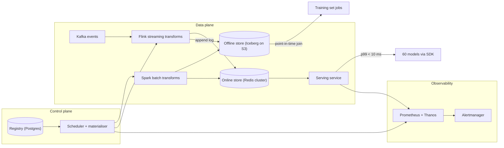
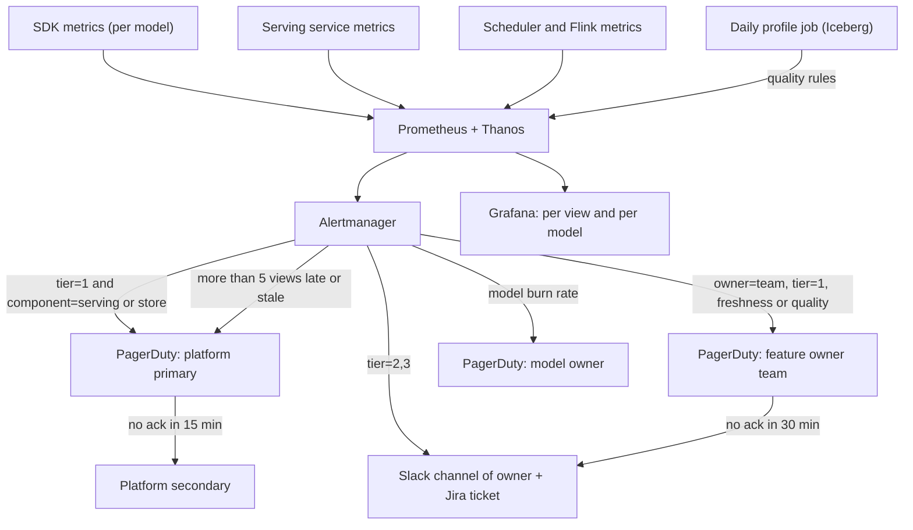

# Feature store — DE 14, operations, SLOs and observability

Assumptions: AWS. Online store is ElastiCache Redis (cluster mode). Offline store is Iceberg on S3. Batch is Spark on EMR, streaming is Flink on Kubernetes reading Kafka. Metrics in Prometheus with Thanos, alerts through Alertmanager to PagerDuty and Slack, traces in OpenTelemetry sampled at 1 percent. Registry is Postgres.

## Requirements

Functional

| # | Requirement | Number |
|---|---|---|
| F1 | Define a feature view once (entity, schema, source, transform, TTL, owner, tier) | 5,000 features, ~500 views, 20 percent growth a year |
| F2 | Materialise batch views to online and offline | nightly over 100M users, 20M items |
| F3 | Materialise streaming views from Kafka | 2B events a day, ~25k events/s average, 100k/s peak |
| F4 | Serve online vectors by entity key | 200k lookups/s peak, 60 models |
| F5 | Point-in-time correct training sets | 1,000 a month, up to 3 years of history |
| F6 | Every feature view emits freshness, volume and null-rate metrics without the owner writing code | 100 percent of views |

Non-functional

| # | Requirement | Number |
|---|---|---|
| N1 | Fraud tier fetch latency | p99 under 10 ms end to end, p99.9 under 25 ms |
| N2 | Online serving availability | 99.95 percent monthly (22 minutes of budget) |
| N3 | Serving has no runtime dependency on registry, offline store or Spark | control plane down for 24 h changes nothing served |
| N4 | Freshness is declared per view and measured, not assumed | every view has `max_staleness` |
| N5 | Operable by 8 people | one primary, one secondary on call; under 5 pages a week steady state |
| N6 | Cost | order of 100k USD a month all in |

## Estimates

| Item | Working | Result |
|---|---|---|
| Online store size | 100M users × 1.5 KB vector + 20M items × 1 KB, ×2 replicas, ×1.3 overhead | ~450 GB RAM, ~600 GB with headroom |
| Online reads | 200k lookups/s peak, average 3 keys per lookup (user, item, pair) | 600k Redis ops/s peak, ~20 shards at 30k ops/s each |
| Online writes | streaming 25k/s average, batch nightly 120M rows in a 2 h window = 17k/s | 50k writes/s peak, well inside cluster capacity |
| Raw events offline | 2B/day × 200 B compressed | 400 GB/day, 440 TB over 3 years |
| Feature tables offline | ~500 views, average 5 GB/day snapshot or delta | 2.5 TB/day, ~60 TB after compaction over 3 years |
| Nightly batch compute | 60 batch views × 100M rows, ~40 Spark node-hours each | 2,400 node-hours a night, ~10k USD a month |
| Training set generation | 1,000 a month, median 20 node-hours, p95 200 | 30k node-hours a month, ~12k USD |
| Monthly cost | Redis 15k, Spark 25k, Flink 8k, S3 and Iceberg 3k, Kafka share 5k, observability 4k, misc 10k | ~70k USD a month |

Freshness targets: streaming views 60 s, batch views 2 h after the upstream partition lands, offline tables available by 06:00 for nightly scoring.

## High-level design

Main flows

| Flow | Path | Operational hook |
|---|---|---|
| Define a feature | PR to a feature repo, CI validates schema, registry row written with `owner`, `tier`, `max_staleness`, `oncall_channel` | Registration is refused without owner and tier. Metrics labels come from these fields. |
| Materialise batch | Scheduler triggers Spark per view when the upstream Iceberg partition lands, writes offline snapshot then bulk-loads Redis with a watermark key per view | Job emits `run_status`, `rows_written`, `watermark_ts`, `duration`. |
| Materialise streaming | Flink job per view group consumes Kafka, writes Redis with `event_ts`, appends to offline log for training | Consumer lag and `watermark_ts` per view per partition. |
| Serve online | SDK calls serving service with entity keys and a feature service name; service does one MGET per entity across Redis shards, fills defaults for misses | Histogram per feature service, per model, miss and stale counters. |
| Training set | Spark job does an as-of join of entity timestamps against offline snapshots and streaming logs | Job duration, rows, skew check against a serving sample. |
| Monitor | Everything pushes to Prometheus with labels `feature_view`, `owner`, `tier`, `model` | Alertmanager routes on `owner` and `tier`. |

## Deep dive: operations, SLOs and observability

### The hard part

The store sits in the fraud request path and is shared by 30 teams who own the data. Almost every incident looks the same from the model's side: "my feature is wrong or slow". The platform team of 8 cannot page itself for every bad upstream column, and the feature owners cannot debug Redis. The system has to tell, mechanically and within a minute, whether the fault is the platform or the feature, and page the right people.

### The obvious approach and why it breaks

Obvious: one dashboard, one alert per component, everything pages the platform on-call. It breaks in three ways. First, cardinality: 5,000 features × per-feature latency histograms × 200 pods is 10M series; Prometheus falls over by month three. Second, the platform team gets paged for a data scientist's nulls at 3 am and starts ignoring pages. Third, "availability" measured at the server hides the failure the fraud team feels, which is the client timeout at 10 ms.

### What I would do instead

Three rules. Measure SLOs where the consumer feels them, in the SDK. Label everything by `feature_view`, never by feature, and roll per-feature metrics into a daily batch profile job. Route every alert on the `owner` label that the registry already knows.

### SLOs

| SLO | Target | Measurement | Window, page condition |
|---|---|---|---|
| Serving availability | 99.95 percent fraud tier, 99.9 other tiers | SDK-side: responses within client deadline and without error, over all calls, per feature service | 30 days rolling. Page at burn rate 14 (2 percent of budget in 1 h). Ticket at burn rate 2 over 6 h. |
| Serving latency, fraud tier | p99 under 10 ms, p99.9 under 25 ms | SDK histogram, end to end, includes network | 5 min windows. Page when p99 over 10 ms for 5 of the last 10 minutes. |
| Freshness, streaming views | 99 percent of served rows fresher than declared `max_staleness` (default 60 s) | serving service compares `event_ts` in the value to now, counts stale per view | 15 min windows. Page owner for tier 1, ticket otherwise. |
| Freshness, batch views | watermark within `max_staleness` (default 2 h) of upstream partition landing | scheduler emits `watermark_ts` per view; alert on `now - watermark_ts` | Page owner for tier 1 views past deadline, platform if more than 5 views are late together. |
| Materialisation success | 99 percent of runs succeed without manual retry | scheduler `run_status` per view | Monthly. Ticket per failure, page owner if tier 1 and retry also fails. |
| Materialisation lateness | 95 percent of runs complete before schedule plus declared SLA | scheduler `duration` and deadline | Monthly, ticket. |
| Training set generation | p50 under 30 min, p95 under 4 h for a 1-year, 10-view set; 98 percent success | job metrics labelled by requesting team | Monthly, ticket only. |
| Train/serve skew | under 0.1 percent of sampled rows differ beyond tolerance | daily job replays 100k served vectors from the offline log and diffs | Daily, ticket to owner. |

The SDK is the measurement point because that is the number the fraud team quotes. Server-side histograms exist too, and the gap between them is the network number.

### Metrics and dashboards

Per feature view dashboard, auto-generated from the registry, one URL pattern:

| Panel | Series |
|---|---|
| Freshness | `feature_view_staleness_seconds` p50, p99 versus `max_staleness` line |
| Materialisation | last run status, duration versus deadline, rows written versus 7-day median |
| Data quality | null rate, distinct count, p1 and p99 of numeric features from the daily profile job, versus 28-day band |

Per consuming model dashboard:

| Panel | Series |
|---|---|
| Availability and latency | SDK histogram and error rate for that model's feature service, burn rate |
| Missing and default-filled | `features_defaulted_total` per view, rate |
| Stale served | `features_stale_total` per view |
| Upstream views | freshness status of each view in the feature service, one row each |

Cardinality budget: labels are `feature_view`, `feature_service`, `model`, `tier`, `owner`, `pod`. No `feature` label and no `entity` label in Prometheus. Per-feature distributions come from the daily Spark profile job written to an Iceberg table and shown in Grafana through a SQL datasource. About 45k active series total, headroom to 500k.

### Alerting topology

Routing rules, in order of match:

| Condition | Route | Why |
|---|---|---|
| Serving availability or latency burn, any tier | platform primary | only the platform can fix Redis, pods or network |
| More than 5 views stale or late in the same 15 min | platform primary | correlated failure is a pipeline, not a feature |
| Single tier 1 view stale, late or failing quality | feature owner on-call | it is their source, their transform |
| Model burn rate, upstream views healthy | model owner | the model's own deadline, batching or contract changed |
| Tier 2 and 3 anything | owner's Slack channel plus ticket | nobody is woken for a churn feature |
| Owner does not ack a tier 1 page in 30 min | owner's Slack channel plus platform Slack, not a page | the platform does not absorb other teams' on-call gaps |

Tier is set at registration. Tier 1 is anything a fraud or real-time ranking feature service reads. The registry recomputes tier when a feature service adds a view, so a churn feature that gets pulled into fraud becomes tier 1 automatically and its owner is told.

### On-call

| Item | Decision |
|---|---|
| Rotation | 8 people, primary and secondary, weekly, so each person is primary about 6 weeks a year |
| What pages | serving SLO burn, fraud latency, correlated materialisation failure, Redis memory over 85 percent, Flink job down for a tier 1 view group |
| What does not page | single feature quality, training set jobs, registry, offline queries, tier 2 and 3 anything |
| Budget | under 5 pages a week; over 10 in a week triggers a reliability sprint before any feature work |
| Fraud path fallback | the fraud SDK is configured with defaults per feature and a 10 ms deadline; on timeout it scores with defaults and increments `features_defaulted_total`, so a platform outage degrades fraud rather than blocking payments. This is agreed with the fraud team in writing. |
| Deploys | serving canaries at 5 percent for 30 min gated on SDK p99 and errors, auto rollback; no reshards or deploys in fraud peak windows |

### Capacity planning

Features grow 20 percent a year, traffic grows with the business, assume 30 percent. Two numbers drive everything: bytes per entity per view, and ops per lookup.

| Resource | Driver | Now | Year 2 | Action threshold |
|---|---|---|---|---|
| Redis memory and ops | entities × views × bytes; lookups/s × keys per lookup | 450 GB, 600k ops/s | 650 GB, 1M ops/s | add shards at 70 percent memory or 60 percent of benchmarked ops, alert at 85 percent |
| Serving pods | lookups/s, CPU bound on serialisation | 40 pods | 60 | autoscale on CPU 50 percent, min 2 per zone |
| Nightly Spark | views × rows | 2,400 node-hours | 3,500 | fail the plan if the nightly window exceeds 4 h |

Quarterly: a load test at 2× current peak against a staging Redis with production-shaped data, and a review of the 20 largest views by bytes because 3 views usually hold half the memory. Every view registers an expected row count and size; a view growing over 50 percent in a month gets a ticket to its owner.

### Runbooks for the five most common incidents

| Incident | First 5 minutes | Likely causes, in order | Fix |
|---|---|---|---|
| 1. Fraud p99 over 10 ms | check SDK versus server histogram gap; check Redis slowlog and one hot shard; check whether a deploy or reshard started | hot key or hot shard from a large view, serving pod GC or rollout, nightly bulk load overlapping peak, network | pause bulk load, roll back deploy, split the hot view's key, add shard |
| 2. Tier 1 view stale | check `watermark_ts` for the view, Flink job status, Kafka lag on its topic, upstream producer rate | producer stopped or changed schema, Flink checkpoint failure, view transform throws on a new value | owner fixes source or transform; platform restarts Flink from checkpoint; serving keeps serving last value and marks stale |
| 3. Nightly batch late | list late views, find the common upstream partition or cluster | upstream table late, Spark cluster capacity, one view's join exploded | rerun the late views only; if upstream late, serving keeps yesterday's values within TTL and offline scoring is told |
| 4. Feature quality alert (null rate or distribution shift) | open the view dashboard, compare to 28-day band, check upstream schema change | source column renamed or type changed, backfill wrote wrong partition, legitimate business change | owner decides: roll back the source, republish the view from the last good snapshot with one command, or accept and reset the band |
| 5. Redis memory over 85 percent | find top views by bytes, check for a view with TTL removed or a backfill that loaded 3 years into online | backfill without TTL, new large view, expired keys not evicting | evict the offending view's keys by prefix, restore TTL, add shard, block the backfill path from writing to online without TTL |

### Platform incident versus bad feature

| Signal | Platform incident | Bad feature |
|---|---|---|
| Scope | many views, many models, one region or shard | one view, the models that read it |
| Serving metrics | latency or error rate up | latency fine, `features_stale_total` or quality rule up for one view |
| Materialisation | many jobs failed or late at once | one job failed, or succeeded with wrong values |
| Who fixes | platform | owner, with platform tooling to republish from snapshot |
| Who is paged | platform primary | owner's on-call if tier 1 |
| Postmortem | platform writes it | owner writes it, platform reviews for tooling gaps |

The rule that makes this mechanical: correlated failure across views is the platform's, isolated failure is the owner's. The "more than 5 views" alert encodes it.

## Trade-offs

| Decision | Alternative | Why this |
|---|---|---|
| SLOs measured in the SDK | server-side only | the fraud team feels client timeouts; server numbers hide network and serialisation |
| Metrics per view, per-feature profiles daily in Iceberg | per-feature Prometheus series | 45k series instead of millions; per-feature drift is a daily question, not a per-second one |
| Owner is paged for their view | platform pages for everything | 8 people cannot own 5,000 features; owners who are paged fix their sources |
| Fraud degrades to defaults on timeout | fail closed | blocking payments is worse than scoring a few transactions with weaker features, and the fraud team agreed |

## Pitfalls

- Freshness measured at write time, not serve time. A view can be materialised on time and still serve stale rows if the bulk load half-finished. Measure `event_ts` at serve.
- Defaults that silently become the norm. If `features_defaulted_total` stays above 1 percent for a model for a day, that is an alert, not a fallback.
- Alerts without an owner. The registry refuses a view without `owner` and `oncall_channel`; this needs to be enforced in CI, not by policy.
- Redis memory from backfills. One backfill that writes three years of history to online with no TTL takes the store down. The online writer path enforces TTL.

## Open questions for the panel

1. Is 99.95 percent for fraud serving enough, or does the fraud team need 99.99 percent, which means multi-region Redis and doubles the cost and on-call load?
2. Should tier 1 feature owners be required to have their own on-call rotation, or does the platform accept the page and hand off? I propose the former as a condition of tier 1 registration.
3. Who owns the skew check tolerance per feature: the model owner, the feature owner, or a platform default of exact match for categoricals and 1e-6 for floats?
4. How long does the online store keep serving a stale tier 1 view before serving nulls instead? I propose 3× `max_staleness`, then defaults.

## Non-negotiables

1. Every feature view registers with `owner`, `tier`, `max_staleness` and `oncall_channel`, enforced in CI. Without this there is no routing and the platform team absorbs every page.
2. Serving SLOs are measured in the SDK, and the fraud SDK has a hard deadline with per-feature defaults agreed with the fraud team. Without this an outage in the store is an outage in payments.
3. Serving has no runtime dependency on the registry, offline store or Spark. If any control-plane component down for a day changes what is served, the design is wrong.
