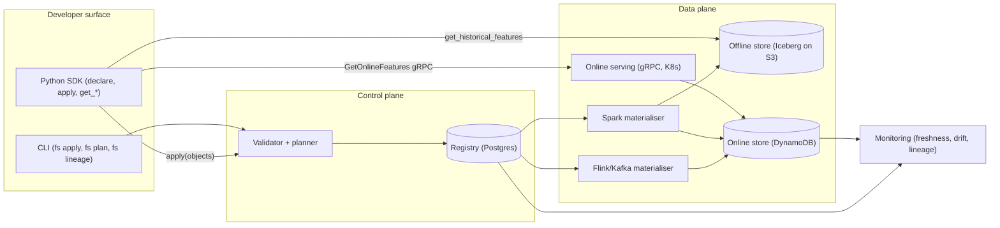
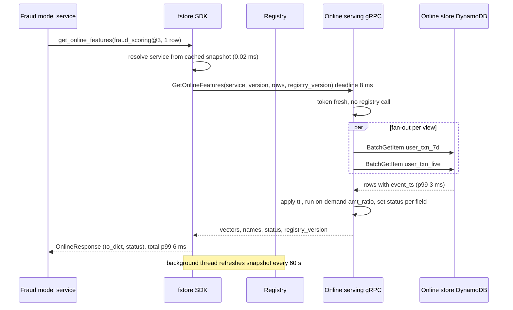

# Feature store — DE 15, API and SDK design

Assumptions: one cloud (AWS), Iceberg on S3, Spark, Kafka, EKS, Postgres for the registry, DynamoDB for the online store. Python 3.10+ SDK is the only first-class developer surface; Java and Go clients speak the wire protocol only.

## Requirements

Functional
| # | Requirement | Number |
|---|---|---|
| F1 | Declare entities, feature views, transformations as Python code, register with one command | 5,000 features, +20 %/yr, 30 teams |
| F2 | Online read of a named feature set for N entity keys | 200k lookups/s peak, 1 to 500 keys per call |
| F3 | Point-in-time historical join from an entity dataframe | 1,000 jobs/month, up to 3 years, 100M rows |
| F4 | Feature service: one name binds the exact feature list a model reads, shared by training and serving | 60 models, 1 service per model version |
| F5 | Lineage query: which services and models read feature X | answer in under 1 s from registry |

Non-functional
| # | Requirement | Number |
|---|---|---|
| N1 | Online fetch p99 | 10 ms end to end from `get_online_features` return, including SDK overhead under 0.5 ms |
| N2 | SDK backward compatibility | any SDK minor works against server minors released in the previous 12 months |
| N3 | Wire protocol compatibility | additive only within a major; two majors served concurrently for 6 months |
| N4 | Registration is atomic and validated | reject type mismatches and dangling refs before anything is written |
| N5 | First hour | a data scientist declares, registers, fetches training data and online values in under 60 minutes without talking to the platform team |
| N6 | Determinism | same feature service version plus same timestamps produce byte-identical training rows |

## Estimates

| Item | Estimate | Basis |
|---|---|---|
| Online store rows | 100M users x 40 views + 20M items x 20 views = 4.4B rows | 1 row per entity per view |
| Online row size | 300 B avg, 1.3 TB total, 2.6 TB with replication | 8 features x 30 B plus key and timestamp |
| Online read QPS | 200k lookups/s, ~40k RPC/s | fraud 1 key per call, ranking 200 to 500 keys per call |
| Offline storage | 2B events/day x 200 B = 400 GB/day raw, 40 GB/day Parquet features, 45 TB for 3 years | 10x compression |
| Historical join | 100M-row entity df x 30 views, 20 minutes on 200 cores | ASOF join per view, partition-pruned |
| Registry | 5,000 features, 500 views, 100 services, 20 MB, 1,000 writes/day | Postgres, cached in SDK |
| Freshness | batch 1 h to 24 h, streaming under 5 s from event to readable | per-view `ttl` and `freshness_sla` |
| Monthly cost | DynamoDB 8k$, S3 1k$, Spark 25k$, serving pods 6k$, registry 0.5k$, about 40k$ | order of magnitude |

## High-level design



Main flows
| Flow | Path | SDK contract |
|---|---|---|
| Define | `fs apply` diffs local objects vs registry, validator checks types and refs, writes a new registry version atomically | `apply()` returns a `Plan`; nothing written on any error |
| Materialise batch | Registry schedule triggers Spark job per view, writes Iceberg partitions then upserts online rows with `event_ts` | `materialize(view, start, end)` for manual runs and backfills |
| Materialise streaming | Flink job reads Kafka topic named in the view source, applies the transformation, writes online store directly and appends to Iceberg hourly | same view object, `source=KafkaSource(...)` |
| Serve online | SDK resolves service to view list from cached registry, one gRPC `GetOnlineFeatures` per call, server fans out one BatchGetItem per view | `get_online_features(service, keys)` |
| Training set | SDK ships entity df to Spark, ASOF join per view on `event_ts <= entity_ts` and `event_ts > entity_ts - ttl` | `get_historical_features(entity_df, service)` returns a lazy job |
| Monitor | Registry knows every view, schedule and service; freshness lag per view, reads per service | `fs lineage feature_x` |

## Deep dive: API and SDK design

### The hard part

Sixty models, thirty teams, and two independent code paths (batch Spark and online gRPC) that must return the same value for the same feature name. Every prior in-house attempt failed on the developer surface, not the storage: teams passed feature lists as string literals in two places, string lists drifted, types were coerced differently by pandas and by the serving code, and nobody could roll an SDK version because the wire format was the Python pickle of a dataclass.

### The obvious approach and why it breaks

Obvious: `get_online_features(feature_refs: list[str], entity_keys: dict)` and `get_historical_features(entity_df, feature_refs: list[str])` with the same string list copy-pasted into the training notebook and the serving code. It breaks three ways.

| Failure | Cause | Seen when |
|---|---|---|
| Silent train/serve skew | training notebook adds a feature, serving code does not | 2 months later, model performs worse in prod, nobody knows why |
| Type drift | pandas reads `int64` with NaN as `float64`; serving returns `null`; model sees `0.0` vs `NaN` | first null in production |
| Unrollable SDK | wire format is the Python object; server and client must upgrade together | every release, 30 teams |

### What I would do instead

Four decisions: a feature service is the only thing a model may read; both read paths take the same `FeatureService` object; the wire protocol is a versioned protobuf independent of the SDK; missing values, types and timestamps are part of the contract, not behaviour.

Declaration:

```python
from fstore import Entity, FeatureView, Field, Source, KafkaSource, FeatureService, on_demand
from fstore.types import Int64, Float32, String
from datetime import timedelta

user = Entity(name="user", join_key="user_id", key_type=String)

user_txn_7d = FeatureView(
    name="user_txn_7d", entities=[user], owner="fraud-team",
    schema=[Field("txn_count_7d", Int64), Field("txn_amount_7d", Float32), Field("last_txn_country", String)],
    source=Source(table="lake.user_txn_agg_7d", timestamp_field="event_ts"),
    ttl=timedelta(days=8),                     # rows older than this read as missing
    freshness_sla=timedelta(hours=2),
)

user_txn_live = FeatureView(
    name="user_txn_live", entities=[user], owner="fraud-team",
    schema=[Field("txn_count_5m", Int64), Field("txn_amount_5m", Float32)],
    source=KafkaSource(topic="txns", timestamp_field="ts", value_format="avro"),
    ttl=timedelta(minutes=10), freshness_sla=timedelta(seconds=5),
)

@on_demand(inputs=[user_txn_7d, user_txn_live], schema=[Field("amt_ratio_5m_7d", Float32)])
def amt_ratio(df):                 # same pandas code runs in the Spark UDF and in the serving pod
    return (df["txn_amount_5m"] / df["txn_amount_7d"].clip(lower=1.0)).rename("amt_ratio_5m_7d")

fraud_v3 = FeatureService(
    name="fraud_scoring", version=3, owner="fraud-team",
    features=[user_txn_7d[["txn_count_7d", "txn_amount_7d"]], user_txn_live, amt_ratio],
)
```

Registration and reads:

```python
from fstore import FeatureStore
store = FeatureStore(registry="https://fs-registry.internal", project="fraud")

plan = store.plan([user, user_txn_7d, user_txn_live, amt_ratio, fraud_v3])   # dry run, prints diff
store.apply(plan)                                                             # atomic; returns registry version

# Training (lazy, runs on Spark; entity_df needs join keys + event_timestamp)
job = store.get_historical_features(
    entity_df=labels_df,                     # pandas, Spark DataFrame, or SQL string
    features=store.get_feature_service("fraud_scoring", version=3),
    timestamp_field="event_timestamp",
)
train_df = job.to_df()                       # or job.to_table("lake.fraud_v3_train_2026_09") or job.to_arrow()

# Online (synchronous, one RPC)
resp = store.get_online_features(
    features=store.get_feature_service("fraud_scoring", version=3),
    entity_rows=[{"user_id": "u123"}, {"user_id": "u456"}],
    full_feature_names=True,                 # "user_txn_7d__txn_count_7d"
)
resp.to_dict()  # {"user_id": [...], "user_txn_7d__txn_count_7d": [12, None], ...}
resp.status     # per key per feature: PRESENT | MISSING | STALE | ERROR
```

Exact contracts:

| Aspect | `get_online_features` | `get_historical_features` |
|---|---|---|
| Features arg | `FeatureService` or `list[str]` of `view:feature` refs; string lists log a deprecation warning in production mode | same; a list of refs is allowed for exploration only |
| Batching | 1 to 500 entity rows per call; above 500 raises; server fans out to online store per view, max 100 keys per BatchGetItem | entity df any size; SDK writes it to a temp Iceberg table if over 10 MB |
| Missing | `None` plus `status=MISSING`; row past `ttl` returns `None` plus `STALE`; never a default value, never a NaN | `null` in the column; row past `ttl` at entity timestamp is `null` |
| Types | fixed per `Field`; `Int64` is `int` or `None`, never float; Arrow types on the wire | Arrow schema identical to online: `Int64` nullable, not `float64` |
| Timestamps | response carries `event_ts` per view for freshness checks | join is `event_ts <= entity_ts AND event_ts > entity_ts - ttl`, latest wins, ties broken by `created_ts` |
| Versioning | `FeatureService(version=n)`; omitted means latest pinned in the registry, not latest created | same object, same version, same feature list |
| Errors | `FeatureNotFound`, `ServiceUnavailable` after 2 retries, per-row `ERROR` status for partial failures; never a partial silent success | job fails whole; no partial output tables |
| Timeout | default 8 ms client budget, configurable; deadline propagated in gRPC metadata | none; job tracked by id |

Feature service versioning: a service version is immutable once applied. Changing the feature list creates version n+1; the model artifact stores `fraud_scoring@3`. The serving code never names features, it names the service and version; the training code names the same thing. Lineage falls out of the registry: `fs lineage user_txn_7d:txn_count_7d` lists services, versions and models registered against them, so "which model uses this column" is one query.

Wire protocol: gRPC with protobuf for the online path, REST/JSON only for the registry and for languages without gRPC. Reasons, in numbers: protobuf encode of a 200-key ranking response is 0.3 ms vs 4 ms JSON; HTTP/2 multiplexing keeps 50 pods from opening 200k connections; deadlines are first-class. The proto is versioned separately from the SDK:

```protobuf
service OnlineServing {
  rpc GetOnlineFeatures(GetOnlineFeaturesRequest) returns (GetOnlineFeaturesResponse);
}
message GetOnlineFeaturesRequest {
  string project = 1;
  oneof features { string feature_service = 2; FeatureRefList refs = 3; }
  int32 feature_service_version = 4;        // 0 = registry-pinned latest
  repeated EntityRow entity_rows = 5;       // max 500
  bool full_feature_names = 6;
  string registry_version = 7;              // client cache token; server answers "stale" if it moved
}
message GetOnlineFeaturesResponse {
  repeated FeatureVector vectors = 1;       // one per entity row, column order = service order
  repeated string feature_names = 2;
  repeated FieldStatus status = 3;          // PRESENT | MISSING | STALE | ERROR, row-major
  string registry_version = 4;
}
```

Compatibility rules: fields are only ever added, never renumbered or removed within a major; unknown fields are ignored by both sides; the server advertises `min_sdk_version` and the SDK refuses to start below it with a clear message; SDK version is sent in gRPC metadata so the platform team can see who is on what before dropping a major.

Client-side: the SDK holds a registry snapshot cached in process, refreshed every 60 s in a background thread, and validated on each call with the `registry_version` token, so a call costs zero registry round trips. One gRPC channel per process with keepalive 30 s, round-robin over a headless K8s service, 2 retries with 2 ms backoff on UNAVAILABLE only, hedged read after 6 ms for the fraud path. No feature-value caching in the SDK by default; a per-view `client_cache_ttl` can be set for item features in ranking (20M items, hot 1 %, 60 s ttl gives 40 % hit rate with negligible staleness risk).



A data scientist's first hour:

| Minute | Action | Command |
|---|---|---|
| 0 to 5 | install, log in, create project scaffold | `pip install fstore`, `fs init churn` creates `features.py` and `fstore.yaml` |
| 5 to 20 | declare an entity and one view over an existing lake table | edit `features.py`; `fs plan` shows validation errors with line numbers |
| 20 to 25 | register | `fs apply`; registry version printed; view appears in the catalog UI |
| 25 to 40 | training set from labels | `store.get_historical_features(labels, [view]).to_df()` in a notebook against 1 % sample |
| 40 to 50 | backfill and read online | `fs materialize user_view --start 2026-08-01`; `store.get_online_features(...)` returns rows |
| 50 to 60 | promote to a service | `FeatureService("churn", version=1, features=[...])`, `fs apply`, and `fs lineage` shows it |

What makes the hour work: `fs plan` fails locally with the exact problem, and `get_historical_features` accepts a pandas df plus a ref list so exploration needs no service yet.

## Trade-offs

| Decision | Chosen | Alternative | Cost of the choice |
|---|---|---|---|
| Model reads only a service | required in production mode | free-form ref lists everywhere | one extra object per model; exploration path keeps ref lists |
| gRPC online | protobuf, HTTP/2 | REST/JSON | non-Python clients need generated stubs; a REST gateway exists for the registry only |
| Missing is `None` plus status | explicit | default values in the view definition | model code must handle `None`; defaults belong in the model, not the store |
| Pandas transformations for on-demand | one code path in Spark UDF and serving pod | Spark-only and re-implemented online | 1 to 2 ms per call for pandas in serving; limit on-demand to arithmetic, no I/O |
| Immutable service versions | yes | mutable feature lists | version churn; mitigated by `fs apply` auto-bumping and pinning |

## Pitfalls

- String feature refs in production code: the exact failure the store exists to fix; production mode warns, then a config flag makes it an error.
- `int` with nulls becoming `float64` in pandas: the SDK returns Arrow-backed nullable types; the most common support ticket if not.
- On-demand transformations that do I/O or import heavy libraries: a 50 ms import in the serving pod. Pure-function lint in `fs plan`, 2 ms budget in CI.
- Changing `ttl` on a view changes what training sees for the same timestamps; `ttl` is part of the view version, not a mutable knob.
- SDK import time: keep `fstore` import under 300 ms; lazy-import pyspark and pandas so a serving pod does not pay for them.

## Open questions for the panel

1. Should on-demand transformations run in the serving pod (one code path, 1 to 2 ms) or be precomputed where possible with the pod as fallback only for entity-crossing features?
2. Do we allow `get_online_features` with a ref list in production at all, or hard-fail from day one and accept migration friction for the 60 existing models?
3. Java and Go serving clients: generated gRPC stubs only, or do we owe them a thin SDK with registry caching and status handling?
4. Who owns the `FeatureService` version bump when a shared upstream view changes schema: the view owner or every downstream service owner?

## Non-negotiables

1. A model in production reads through a versioned, immutable `FeatureService`; training and serving take the same object. Without this the store does not solve train/serve skew.
2. The online wire protocol is versioned independently of the SDK, additive within a major, with SDK version reported in metadata. Without this the platform team of 8 cannot roll releases across 30 teams.
3. Missing and stale values are returned as `None` with a per-field status, with identical nullable types offline and online. Silent defaults or float coercion reintroduce the skew in a form nobody can see.
