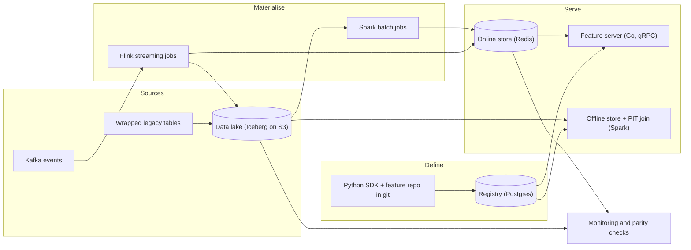
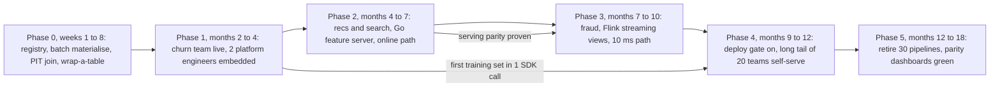
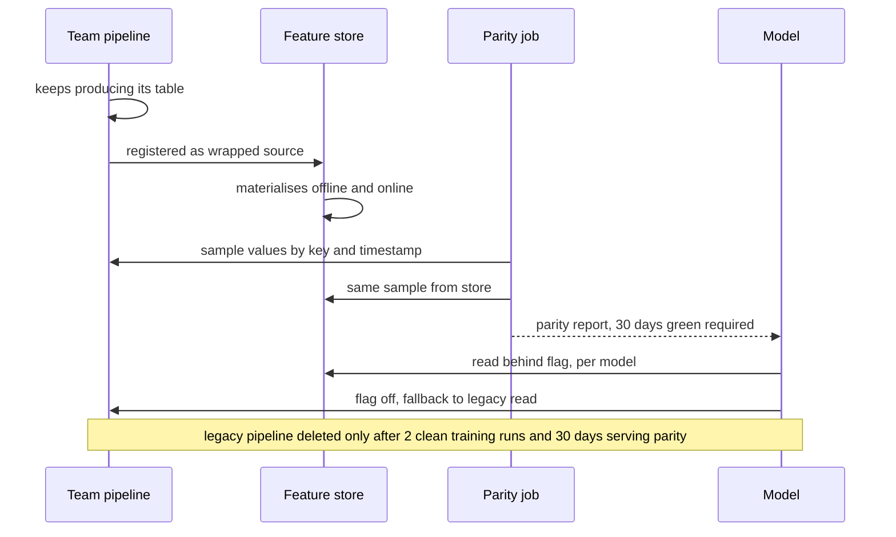

# Feature store — DE 16, adoption, migration and build versus buy

Assumptions: AWS; the table format is Iceberg; the managed key-value store is DynamoDB but we add ElastiCache Redis for the sub-10 ms path; Spark runs on EMR, not Databricks; there is a model registry that gates production deploys. The platform team is 8 engineers with no headcount growth in year one.

## Requirements

Functional

| # | Requirement | Number |
|---|---|---|
| F1 | One feature definition (entity, source, transform, TTL, owner) produces the same value offline and online | 0 tolerated divergence beyond declared float epsilon |
| F2 | Point-in-time correct training sets from a label dataframe | 1,000 generations a month, up to 3 years of history |
| F3 | Batch materialisation to the online store | 100M users nightly, done before 06:00 |
| F4 | Streaming materialisation from Kafka | 2B events a day, feature fresh within 5 s |
| F5 | Online lookup by entity key, multi-entity, multi-view | 200k lookups/s peak, p99 under 10 ms for fraud |
| F6 | Registry answers "which model uses this column" and "who owns this feature" | 100 percent of production models |
| F7 | An existing pipeline's output table can be registered as a source with no rewrite | zero code change to the producer |
| F8 | Monitoring: freshness, null rate, distribution drift, serving parity | per feature view, daily |

Non-functional

| Property | Target |
|---|---|
| Online availability | 99.95 percent, degrade to stale values not errors |
| Training set cost | under 100 USD per generation at median size |
| Time to first feature for a new team | under 1 day with the SDK, under 1 week wrapping an existing table |
| Adoption | 80 percent of production models on the store at 12 months, 100 percent at 18, all 30 ad-hoc pipelines retired |
| Operability | 8 people run it; on-call rotation of 4, under 2 pages a week |

## Estimates

| Item | Working | Result |
|---|---|---|
| Online storage | 100M users x 1,500 served features x 10 B, plus 20M items x 500 x 10 B | 1.6 TB, 3.2 TB with a replica |
| Online reads | 200k lookups x 5 views each | 1M key reads/s peak |
| Online writes | nightly 100M users x 75 views in 4 hours, plus streaming 23k events/s avg, 70k/s peak | 500k key writes/s during the batch window |
| Offline storage | 400 GB/day of feature rows compressed, kept 3 years | 440 TB |
| Training generations | 1,000 a month x 10 TB median scan | 10 PB scanned a month |
| Streaming compute | Flink, 70k events/s peak, 2 to 4 KB state per user | 30 to 40 task slots, 200 GB state |
| Freshness | batch views T+1 by 06:00; streaming views 2 to 5 s | |

Monthly cost order of magnitude: Redis 3.2 TB about 30k USD; S3 440 TB about 10k; Spark for materialisation and training sets 40 to 60k; Flink and Kafka consumers 10k; serving pods and registry under 5k. Roughly 100 to 120k USD a month of infrastructure. The 8-person team costs about 170k USD a month. People cost more than the machines, which is the first fact in the build-versus-buy decision.

## High-level design

Main flows

1. Define: engineer writes a feature view in the repo; CI validates and applies it to the registry; the registry records owner, schema, source, TTL and later every model that reads it.
2. Materialise batch: nightly Spark job per feature view reads the Iceberg source, writes rows to the offline store partitioned by event date, then bulk-loads Redis with a TTL.
3. Materialise streaming: Flink job per streaming view keeps windowed aggregates in state, writes Redis on every update and appends to the offline store every minute so offline sees what online saw.
4. Serve online: model service calls the Go feature server with entity keys and a feature service name; one Redis MGET per entity per view; registry cached in memory.
5. Training set: data scientist passes a dataframe of entity key, event timestamp, label; the SDK runs the point-in-time join on Spark against the offline store and returns Parquet.
6. Monitor: daily job compares a sample of online values to the offline value at the same timestamp; freshness and null-rate checks per view; alerts to the feature owner, not the platform team.

## Deep dive: adoption, migration and build versus buy

The hard part is not serving at 10 ms. The hard part is that 30 teams already have working pipelines, and every one of them has a reason not to touch it this quarter. A feature store with 5,000 registered features and zero models reading them is a very expensive catalogue.

### Build versus buy

The obvious approach is to pick the product with the best feature list. That breaks because the feature list is not the constraint; the constraint is 8 people, of whom at least 3 must spend the year migrating teams, not building infrastructure. Whatever we choose, the migration work is the same size. So the decision is about how much of the remaining 5 people's time the platform itself consumes.

| Criterion | Feast core + our serving | Tecton | Databricks feature engineering | SageMaker Feature Store | From scratch |
|---|---|---|---|---|---|
| Online p99 under 10 ms at 200k/s | Yes with Redis and a Go server we write; Python server too slow | Yes, managed | Yes with online tables, needs Databricks compute | No at this rate; 20 to 30 ms typical, per-read pricing | Yes, in a year |
| Point-in-time join over 3 years | Spark offline store works; we optimise partition pruning ourselves | Yes, mature | Yes | Weak, Athena-based | Ours to write |
| Streaming from Kafka | Push source only; we run Flink | Yes, built in | Structured Streaming | PutRecord API, no aggregation | Ours to write |
| Lineage, "which model uses this column" | Feature services only; we add model-to-service link in the registry | Yes | Via Unity Catalog | Basic | Ours to write |
| Fits Spark, Kafka, K8s, Iceberg, Redis | Yes | Yes on EMR or Databricks | Requires moving batch to Databricks first | Requires SageMaker for training | Yes |
| Team time consumed by the platform itself | 4 to 5 engineers for 6 months, then 2 | 1 to 2 engineers ongoing | 2 engineers plus a Databricks migration | 2 engineers plus SageMaker migration | 8 engineers for 12 months, no migration capacity |
| Licence per year | 0 | 500k to 1M USD at this scale | Platform spend, roughly 300k more | Per-read and per-GB, about 200k | 0 |
| Exit cost | Low, definitions are plain Python and Parquet | High, definitions in Tecton DSL | Medium | High | None |
| Time to first team live | 8 weeks | 6 weeks | 6 weeks if already on Databricks, else 4 months | 8 weeks | 12 months |
| Decisive | Cheapest in people once the first 6 months are paid | Fastest and lowest ongoing burden; costs one engineer's salary in licence | Only if the batch stack is moving anyway | Does not meet F5 | Never |

Decision: build on the Feast core, meaning we keep its definition format, registry protocol, offline and online store layouts and the materialisation CLI, and we replace two pieces: a Go gRPC feature server reading Redis directly, and a Flink streaming materialiser. We write a lineage extension that links model registry entries to feature services. Two conditions make me flip to Tecton: if we cannot hire or keep 4 solid infrastructure engineers, or if the Feast point-in-time join is not under 100 USD per median training set by month 4. I would run a 4-week Tecton proof of concept on the churn team's data in parallel with the Feast build so the flip is cheap.

Scratch is not on the table. A from-scratch store consumes the whole team for a year and by the time it works, the 30 pipelines have become 40.

### Migration order

Which team first is the most important decision in the plan.

| Candidate | Pain today | Reuse of its features | Blast radius if wrong | Needs online | Order |
|---|---|---|---|---|---|
| Churn and LTV (nightly batch, 100M users) | Backfills take weeks; features rebuilt monthly | High; user activity aggregates used by recs and 6 other models | Low; nightly batch, easy rollback | No | 1 |
| Recommendation ranking | Training and serving skew found twice this year | Medium; item features shared with search | Medium | Yes, hundreds of entities, 50 ms budget | 2 |
| Search ranking | Same as recs | Medium | Medium | Yes | 3 |
| Fraud scoring | Skew is a revenue incident | Low; features are fraud-specific | High; p99 10 ms, real money | Yes, streaming | 4 |

Churn first because it has the worst backfill pain, its features are the most reused, and a failed first migration there costs a delayed nightly job, not a revenue incident. Fraud last, not because it matters least but because a public failure on the first migration ends the platform politically. Fraud's requirements still shape the design from day one; they are not deferred, only their cutover is.

### Wrap before rewrite

Rewriting a team's Spark job into store-managed transforms is the obvious approach and it is why teams refuse. Instead, phase 0 ships a "wrap" path: the team registers its existing output table as a batch source. Requirements on the table: an entity key column, an event timestamp column, append-only or a snapshot date partition, and an owner. The store then does point-in-time joins, online materialisation, monitoring and lineage on top of a table the team still produces exactly as before. Rewriting the transform into the store is a later, optional step, and for most batch features it never needs to happen. What wrapping does not give: the streaming path, and a guarantee the transform is the same in training and serving. That guarantee needs the transform inside the store, which is why recs and fraud rewrite and churn does not.

### Coexistence for a year

Rules for the year: both paths run; the parity job compares a 1 percent sample daily; a model cuts over one at a time behind a flag with a legacy fallback; a legacy pipeline is deleted only when every model that read it is on the store and the parity dashboard has been green for 30 days. Nothing is deleted on a promise.

### Incentives that beat bypassing

Carrots first, stick at month 9.

| Incentive | Mechanism | When |
|---|---|---|
| Fastest path to a training set | one SDK call replaces a week of joins; backfill in hours | phase 0 |
| Free operations | registered features get freshness alerts, on-call, backfill and their storage bill paid by platform; ad-hoc features get none | phase 1 |
| White glove | 2 platform engineers embedded in each of the first 3 teams for the duration | phases 1 to 3 |
| Visible credit | registry shows reuse count per feature and owner; used in performance reviews by team leads | phase 2 |
| Deploy gate | model registry refuses a production deploy without a linked feature service; exceptions expire in 90 days | phase 4 |
| Post-mortem question | every skew or data incident review asks "was the feature registered" | phase 4 |

The gate goes on only after 10 teams are live and the self-serve path takes under a day, otherwise it is a mandate to use something that does not work.

### What done looks like

| Metric | Now | 6 months | 12 months | 18 months |
|---|---|---|---|---|
| Production models reading features via the store | 0 of 60 | 15 | 48 | 60 |
| Training sets generated via the store, share of all | 0 | 40 percent | 85 percent | 100 percent |
| Features with more than one consuming model | unknown | 100 | 600 | 1,000 |
| Median backfill time | 2 to 3 weeks | 1 day | 4 hours | 4 hours |
| Time to first feature for a new team | weeks | 3 days | 1 day | 1 day |
| Ad-hoc pipelines still running | 30 | 26 | 12 | 0 |
| Skew incidents per quarter | 6 known | 3 | 1 | 0 |

The first row is the only one on the platform lead's weekly dashboard from week 1. Registered feature count is deliberately not a target; it is the metric that a platform nobody uses looks best on.

### The platform nobody uses

Symptoms: 800 features registered by month 6, 700 by the platform team; models still read legacy tables; teams wrapped tables to satisfy a mandate and never cut over; the store's PIT join is slower than a team's hand-rolled join so they keep theirs. Causes: building the hard serving path first with no users for a year; an SDK that demands a rewrite; a registry that is a form to fill in; a mandate before the product works. The kill criterion: if fewer than 5 teams have a model reading from the store by month 6, the team stops building and every engineer embeds with a team until that number moves.

## Trade-offs

| Choice | Gain | Cost |
|---|---|---|
| Feast core over Tecton | 0 licence, low exit cost, plain Python definitions | 4 to 5 engineers for 6 months; we own serving and streaming |
| Churn first, fraud last | Safe first win, reuse early | Fraud's skew problem persists 10 months longer |
| Wrap before rewrite | Zero-rewrite onboarding, lineage on day one | Wrapped features do not get the training-serving guarantee |
| Coexistence for a year | No big-bang cutover | Double compute and storage for that year, about 30k USD a month |
| Deploy gate at month 9 | Closes the long tail | Friction, exception process, a few angry teams |
| Redis over DynamoDB for online | 10 ms p99 at 200k/s | 30k USD a month and a cluster we operate |

## Pitfalls

- Measuring registered features instead of models served; the catalogue grows while adoption is flat.
- Starting with fraud because it is the loudest; one visible failure and the store is "the thing that broke fraud".
- Wrapping a table with no event timestamp and calling it point-in-time correct; the join silently uses snapshot date and leaks the future.
- Deleting a legacy pipeline on the team's word rather than the parity dashboard.
- Letting the platform team own the features it migrates; ownership must transfer back or the platform team becomes 30 teams' pipeline maintainers.
- Charging teams for online storage in year one; the bill is the fastest way to make them bypass the store.
- Building the on-demand transform path before anyone asks; it is the most requested and least used feature in every store I have seen.

## Open questions for the panel

1. Is a 500k to 1M USD Tecton licence really more expensive than 6 months of 5 engineers, given we cannot hire?
2. Should wrapped sources ever count as "on the store" for the adoption metric, or only features whose transform lives in the store?
3. Who owns a feature when the producing team is dissolved; does it fall to the platform team or to the largest consumer?
4. Does the deploy gate live in the model registry or in CI, and who grants the 90-day exceptions?
5. Should the coexistence year be funded from the platform budget or charged back to teams that are slow to cut over?

## Non-negotiables

1. The wrap-a-table path ships in phase 0. Without a zero-rewrite onboarding, the migration does not start.
2. The weekly metric is models reading from the store, tracked from week 1. Feature counts are not reported as progress.
3. No legacy pipeline is deleted without 30 days of green parity and every consuming model cut over. Coexistence is a rule, not a courtesy.
