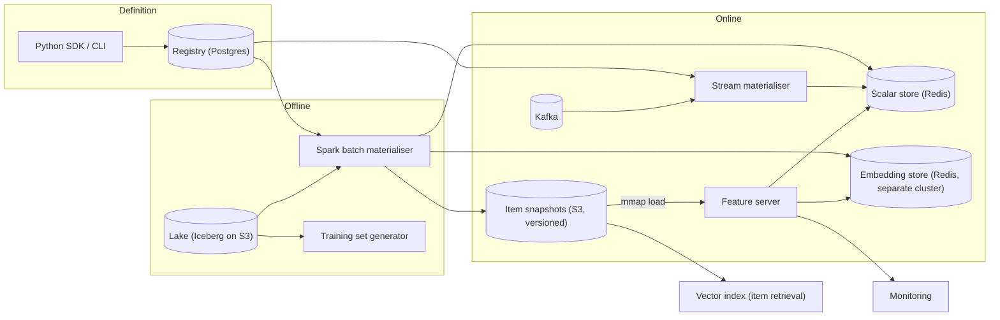
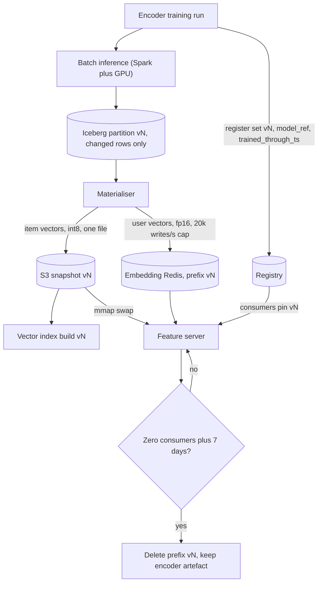
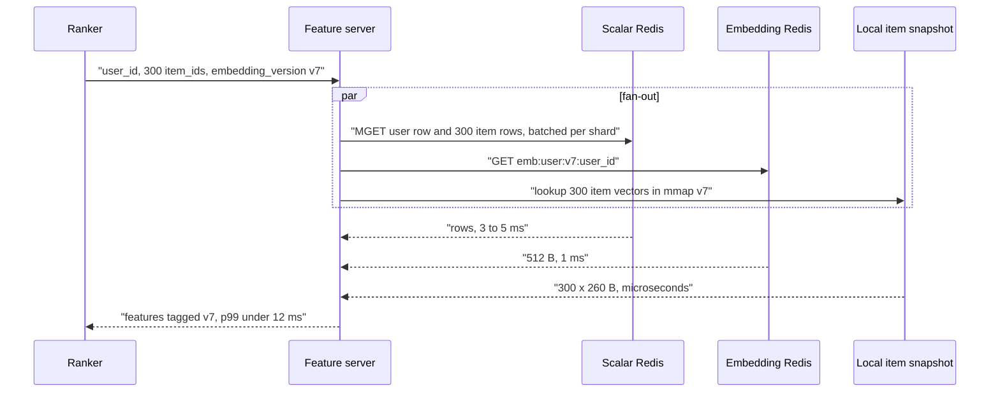

# Feature store — DE 17, embeddings and large-value features

Assumptions: one cloud (AWS). Managed KV is ElastiCache Redis (cluster mode). Lake is Iceberg on S3. Embeddings come from two-tower or sequence encoders owned by the recommendation and fraud teams; the platform does not train them, it stores, versions, and serves what they produce.

## Requirements

Functional

1. Register a feature of type `embedding<dtype, dim>` with the model version that produced it, refresh cadence, distance metric, and whether vectors are L2-normalised.
2. Serve a user or item embedding next to scalar features in one `get_online_features` call; the caller never learns it came from a different store.
3. Versioning: user and item vectors from one encoder run form one *embedding set*; a consumer reads exactly one set version per request, never a mix.
4. Point-in-time correct training sets that include embeddings, with the set version pinned per training run.
5. Publish each item-embedding version to a vector index for candidate retrieval; the feature store does not answer nearest-neighbour queries itself.
6. Lineage: which models consume which embedding set version, so a version can be retired safely.

Non-functional

| Requirement | Number |
|---|---|
| Fraud feature fetch, scalar row plus at most 1 embedding | p99 under 10 ms at 50k rps |
| Ranking fetch, 1 user row plus 300 item candidates with embeddings | p99 under 20 ms at 5k rps |
| Online embedding capacity | 120M vectors, 256 dims, 2 versions live during cutover |
| Refresh | user vectors daily, active users hourly; item vectors hourly |
| Freshness lag, batch refresh to serving | under 2 h |
| Version mismatch within one request | 0, enforced, counted |
| Offline retention of embedding snapshots | 180 days as rows; older by recompute |
| Cost ceiling for embedding serving | under 10 percent of total online store cost |

## Estimates

| Item | Calculation | Result |
|---|---|---|
| Raw vector | 256 x fp32 | 1 KB |
| All entities, fp32 | 120M x 1 KB | 120 GB |
| All entities, fp16 (chosen) | 120M x 512 B | 60 GB |
| Redis footprint, fp16 | 60 GB x 1.5 key overhead x 2 replicas | 180 GB |
| Cutover peak, two versions live | 2 x 180 GB | 360 GB |
| Item snapshot shipped to rankers, int8 | 20M x 260 B | 5.2 GB per version |
| Daily user refresh write volume | 100M x 512 B over a 2 h window | 14k writes/s, 7 MB/s |
| Hourly active-user refresh | 5M x 512 B per hour | 700 writes/s |
| User embedding reads | 1 per ranking or fraud request | 55k reads/s, 28 MB/s |
| Item embedding reads if fetched from Redis | 5k rps x 300 x 512 B | 1.5M reads/s, 770 MB/s — do not do this |
| Offline snapshot, fp16 Parquet | 100M x 512 B per day x 180 days | 9.2 TB, about 210 dollars per month on S3 |
| Recompute for a 3-year backfill | 50M training rows through the pinned encoder on 4 GPUs | about 1 h, under 20 dollars |
| Whole feature store, order of magnitude | online KV 6k, Spark 30k, lake 3k, embeddings 2k, vector index 3k | 40k to 60k dollars per month |

Embeddings are 2 percent of the bill if item vectors stay out of the per-candidate hot path, and roughly 10x that if they do not.

## High-level design

Main flows

- Define: a feature view in Python names entity, source, schema, owner, TTL. Embedding columns declare `dtype`, `dim`, `model_ref`, `metric`, `normalised`. Registry stores it; CI rejects an embedding column without `model_ref`.
- Materialise batch: Spark reads the source table, writes an Iceberg partition keyed by `(feature_view, version, refresh_ts)`, then writes to Redis rate-limited at 20k writes/s. Embedding sets additionally emit an item snapshot file and a "version ready" event.
- Materialise streaming: Flink jobs on Kafka compute scalar aggregates into Redis. Embeddings are not computed in the stream path in v1; an hourly micro-batch over active users covers the freshness need.
- Serve online: feature server fans out in parallel to the scalar cluster, the embedding cluster, and the local item snapshot; assembles one response tagged with the embedding set version.
- Generate a training set: as-of join of labels against Iceberg feature partitions, embedding set version pinned in the request and recorded in the registry lineage.
- Monitor: freshness per view, null rate, distribution drift, and for embeddings: norm, cosine drift between refreshes, snapshot age in rankers, and the version-mismatch counter.

## Deep dive: embeddings and large-value features

The hard part: a vector is 100 to 1,000x larger than a scalar, is refreshed wholesale rather than incrementally, and its meaning is only defined relative to the model that produced it. Every scalar-feature assumption in the store breaks on one of those three.

The obvious approach: treat `user_emb` as one more column in the entity hash in Redis, fetch it with the row, snapshot it daily like everything else.

Why it breaks

| Failure | Mechanism | Number |
|---|---|---|
| Rows get fat | every scalar-only model now reads a 1 KB blob it never uses | user row grows from 2 KB to 3 KB, 50 percent more bytes on every fraud call |
| Per-candidate fetch | 300 candidates x 1 KB per ranking request | 770 MB/s from Redis at 5k rps, p99 well over 20 ms |
| Daily rewrite | 120 GB rewritten inside a Redis cluster that also serves reads | replica sync and fork pressure during the refresh window |
| Offline blow-up | daily snapshot x 3 years | 100M x 1,095 x 1 KB = 110 TB per family |
| Silent version mix | user vector from run v8, item vector from run v7 in the same dot product | ranking degrades with no error anywhere |
| Quantisation skew | serve int8, train fp32 | train-serve skew introduced by the store itself |

What I would do instead

1. Split storage by value shape. Scalars stay in the row-oriented cluster. Embeddings live in a separate Redis cluster, key `emb:{family}:{version}:{entity_id}`, value the raw quantised bytes. Separate cluster means separate sizing, separate eviction, and a refresh window that cannot slow fraud reads.
2. Ship item embeddings, do not fetch them. 20M items at int8 is 5.2 GB. The materialiser writes one immutable Arrow file per version to S3; the feature server and rankers mmap it and swap an atomic pointer on the "version ready" event. Item vector lookup becomes a local memory read; the only network fetch per ranking request is the user row plus one user vector.
3. Fetch user embeddings once per request. One key, 512 B, in the same parallel fan-out as the scalar row. Fraud gets the same treatment for its device embedding: one key, one round trip.
4. Versioning by embedding set. An encoder run produces `{user, item}` vectors under one version id. The registry records `model_ref`, `trained_through_ts`, and `created_ts`. A consuming model records the set version it was trained on; the feature server takes `embedding_version` in the request and returns vectors only from that version, or a typed error. Mixing is impossible by construction because both keys carry the version. Cutover: new version is materialised in full while the old one serves, consumers repoint by config, old version is deleted when lineage shows zero consumers plus 7 days. Capacity is planned for two versions of the largest family.
5. Quantisation as part of the schema, not an operational trick. Storage dtype is declared in the feature view. Training reads the same quantised bytes and dequantises the same way, so there is no skew. PQ and binary codes are allowed only inside the vector index.

| Option | Bytes per vector | Online for 120M, with overhead and 2 replicas | Redis cost per month at about 9 dollars per GB | Item snapshot, 20M | Recall at 100 vs fp32 | Use |
|---|---|---|---|---|---|---|
| fp32, 256 dims | 1,024 | 360 GB | 3,240 | 20 GB | baseline | never, no benefit over fp16 |
| fp16, 256 dims | 512 | 180 GB | 1,620 | 10 GB | within 0.1 percent | default for the store |
| int8 per-vector scale, 256 dims | 260 | 92 GB | 830 | 5.2 GB | 0.3 to 1 percent lower | item snapshots, optionally users |
| fp16, 64 dims via PCA | 128 | 45 GB | 400 | 2.6 GB | 2 to 5 percent lower, model dependent | only if the encoder is retrained at 64 |
| PQ 32 x 8 bit | 32 | 11 GB | 100 | 640 MB | 3 to 8 percent lower | vector index only |
| Binary 256 bit | 32 | 11 GB | 100 | 640 MB | 5 to 10 percent lower | vector index prefilter only |
| fp16 in DynamoDB instead of Redis | 512 | 60 GB, no replicas to size | 15 storage plus about 9,000 for 55k reads/s | n/a | same | loses on read pricing at this rate |

6. Nearest neighbour stays outside. The store answers "vector for id"; the index answers "ids near vector". They need different structures (HNSW is 1.5 to 2x the vector bytes and rebuilt, not updated), different lifecycles, and different failure modes. The store feeds the index: every item snapshot version triggers an index build tagged with the same version; a retrieval request and its ranking request must carry the same tag. That is checked in the feature server and counted as a mismatch if it fails.
7. Point-in-time correctness for embeddings has two clocks, not one.
   - Refresh clock: the as-of join picks the latest snapshot row with `refresh_ts <= label_ts` within the pinned version. Snapshots are written as rows only where the vector changed by more than a cosine threshold of 0.005, so the daily row count is about 50M, not 100M, and as-of semantics still hold.
   - Encoder clock: a vector produced by a model trained on data after `label_ts` leaks the future even if `refresh_ts` is earlier. The generator enforces `trained_through_ts <= label_ts` for the pinned version and fails the run otherwise; teams can override with an explicit `allow_encoder_leakage=True` that is recorded in lineage.
   - Retention: 180 days of snapshot rows. For older windows the generator recomputes vectors by running the pinned encoder over the training rows' input features, which is cheap because only sampled rows are computed, not all entities. The encoder artefact is therefore part of the embedding set and is kept as long as the set is referenced.
8. Refresh and write shaping. Daily full user refresh is 14k writes/s over 2 hours; the delta filter cuts it in half. Writes go through the same rate limiter as scalars, and the embedding cluster gets its own limit so a large family cannot starve a small one. Hourly active-user refresh is 700 writes/s. Item snapshots are hourly and cost nothing on Redis.

Serving path for one ranking request

If the local snapshot is older than two versions or missing, the server falls back to Redis for item vectors and raises a `snapshot_stale` alert; that fallback is the 770 MB/s path and is meant to page someone, not to be normal.

## Trade-offs

| Decision | Gain | Cost |
|---|---|---|
| Separate embedding cluster | isolates refresh load and sizing | one more cluster to run, two fan-outs instead of one |
| Ship item snapshots to servers | removes the largest read stream entirely | 5 GB memory per server process, a load-and-swap mechanism to build |
| fp16 storage default | halves memory at no measurable recall cost | must dequantise in the SDK, both online and offline |
| Two live versions during cutover | zero-downtime version change, no mixing | plan for 2x memory of the largest family |
| Recompute instead of retain beyond 180 days | avoids 110 TB per family | encoder artefact must be preserved and reproducible |
| ANN outside the store | each system stays simple | one more version tag to keep in sync |
| No streaming embeddings in v1 | avoids a GPU-bound stream job | freshness of 1 h for active users, not seconds |

## Pitfalls

- Storing vectors as JSON or float lists in Redis hashes: 3 to 4x the bytes and a parse on every read. Store raw little-endian bytes with dtype in the schema.
- Using the entity hash so that `HGETALL` pulls the vector for every scalar-only caller.
- Materialising a new version by overwriting the old keys in place: consumers see a mix for the whole write window.
- Forgetting the encoder clock: `refresh_ts` looks point-in-time correct while the encoder itself saw the future.
- Quantising for serving only: the store creates the train-serve skew it exists to prevent.
- Letting the vector index become the system of record for embeddings; when it is rebuilt from a different snapshot than the store, retrieval and ranking silently disagree.
- Sizing Redis for one version and discovering the cutover doubles memory at 02:00.

## Open questions for the panel

1. Should hourly active-user refresh be replaced by a true streaming encoder for the recommendation team, at the cost of a GPU stream job and a second write path?
2. Is 180 days of snapshot rows plus recompute acceptable to the churn and LTV teams, whose training windows can reach 3 years?
3. Do we allow more than one embedding family per entity type (say 5 teams with their own user encoders, 5 x 60 GB), or force a shared foundation embedding with per-team heads?
4. Should the feature server own the "version ready" swap for rankers, or should rankers pull snapshots directly from S3 and the server only serve user vectors?
5. Is a 0.005 cosine change threshold for skipping writes a store-level default or a per-family setting owned by the producing team?

## Non-negotiables

1. Every embedding column carries a model reference, a version, and `trained_through_ts`; a request without a pinned version is refused, not defaulted.
2. Item vectors for ranking are never fetched per candidate over the network in the normal path; they are shipped as versioned snapshots.
3. Training reads the same quantised bytes as serving, and the training-set generator enforces the encoder clock as well as the refresh clock.
