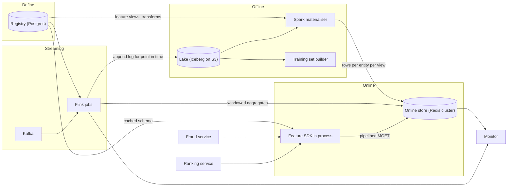
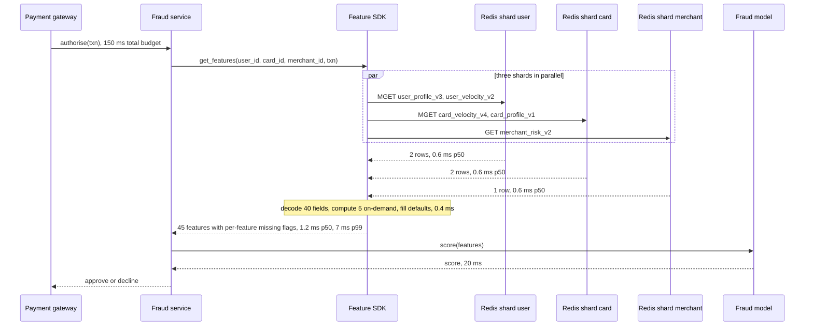
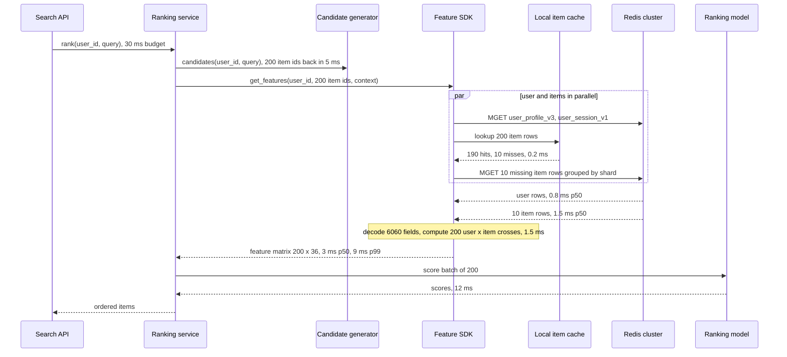

# Feature store — DE 18, the real-time use cases that stress the design

Lens: fraud scoring and recommendation ranking worked end to end. Everything else in this document exists to make those two paths hold at p99. Assumptions: AWS, Redis (ElastiCache cluster mode) as the managed key-value store, Flink on Kubernetes for streaming, Iceberg on S3 as the lake, Postgres as the registry database.

## Requirements

Functional

| # | Requirement | Number |
|---|---|---|
| F1 | Define a feature once (name, entity, source, transform, TTL, owner) and get it in offline and online stores from the same definition | 5,000 features, 6,000 next year |
| F2 | Batch and streaming materialisation into the online store | 100M users, 20M items daily and hourly; 2B events/day, 70k events/s peak from Kafka |
| F3 | Online multi-entity, multi-feature-view fetch with on-demand features computed at request time | fraud: 3 entities, 40 stored + 5 on-demand; ranking: 1 user + 200 items x 30 |
| F4 | Point-in-time correct training sets from a label table with event timestamps | 1,000 per month, up to 3 years back |
| F5 | Monitoring: freshness, null rate, distribution drift per feature, per store | alert within 1 minute of a freshness breach |

Non-functional

| # | Requirement | Number |
|---|---|---|
| N1 | Fraud feature fetch latency, measured inside the fraud service, all 45 features present | p99 <= 10 ms, p50 <= 2 ms |
| N2 | Ranking feature fetch, 200 candidates x 30 + user features | p99 <= 12 ms of the 30 ms request budget, rest is inference |
| N3 | Online read throughput | 200k requests/s, 4M entity-row reads/s after candidate fan-out |
| N4 | Availability of the online read path | 99.99 percent; a store outage must degrade to defaults, not fail the transaction |
| N5 | Streaming feature lag, event ingested to value readable online | p99 <= 2 s for fraud counters, alert at 10 s |
| N6 | Training and serving skew | zero by construction: same transform code, same registry version |

## Estimates

| Item | Working | Result |
|---|---|---|
| Online rows | 100M users x 2 KB, 300M cards x 300 B, 20M items x 500 B, 5M merchants x 1 KB | 305 GB primary, 610 GB with one replica, 8 primaries of r7g.4xlarge plus 8 replicas |
| Online request rate | 150k fraud + 20k ranking + 30k other | 200k requests/s |
| Online entity-row reads | fraud 150k x 3 + ranking 20k x 201 + other 30k x 2 | 4.5M rows/s, 1.8 GB/s at 400 B per row |
| Streaming write rate | 70k events/s peak, 3 windowed features per event | 210k Redis writes/s peak |
| Batch materialisation | 120M entity rows daily, 5,000 features | 240 GB written per day, 4 hours of a 40 node Spark job |
| Offline storage | 2B events/day x 200 B = 400 GB/day raw; features 3 years | 130 TB Parquet, 440 TB raw |
| Monthly cost | Redis 25k, Flink 12k, Spark batch 25k, training sets 40k, lake 12k, metadata and services 6k | about 120k USD |

Freshness per source type: batch daily features are up to 26 hours stale, hourly batch up to 70 minutes, streaming under 2 seconds, on-demand zero.

## High-level design

Main flows

| Flow | Path | Note |
|---|---|---|
| Define | Data scientist writes a feature view in Python, `fs apply` validates and stores it in the registry with a version | Transform is a pure function checked into git; the registry stores its hash |
| Materialise batch | Spark reads the source table, runs the transform, writes one row per entity per feature view to Redis and to the offline feature table | Row is a protobuf blob; the write is one SET per entity, so a partial row is never visible |
| Materialise streaming | Flink consumes Kafka, keeps windowed state, writes the same row layout to Redis and appends value changes to the lake | The lake append is what makes streaming features point-in-time joinable |
| Serve online | SDK resolves feature names to keys from a cached registry snapshot, pipelines MGET by shard, deserialises rows, runs on-demand transforms, fills defaults | No feature server hop for the two hot paths, see deep dive |
| Training set | Builder takes a label table, resolves feature versions as of the label time, does an as-of join per feature view | Same transform hash as serving, or the build fails |

## Deep dive: the real-time use cases that stress the design

### The hard part

Both consumers hold a user-visible action while they wait. Fraud holds a card authorisation and gets 10 ms of the issuer's budget for the fetch; ranking holds a page render, 30 ms total with 10 to 15 ms needed by the model. Neither can retry into a slow store, and a wrong value is not cheap either: a stale fraud counter approves a burst attack, a missing item feature drops the item from the page. The two stress the store in opposite ways. Fraud is few keys, tight tail, second-level freshness. Ranking is many keys per request, so the p99 is the max over many shards, and freshness is a day. One store layout must serve both.

### The obvious approach and why it breaks

| Obvious design | Why it breaks |
|---|---|
| One Redis key per feature per entity, fetch 40 keys | 40 keys across 8 shards means every request touches every shard; p99 becomes the slowest shard's p99.9. Ranking becomes 6,000 keys per request, 120M key reads/s. |
| A feature server microservice in front of Redis | Adds a hop: 1 ms p50, 3 to 4 ms p99 for gRPC plus a second failure domain. That is a third of the fraud budget for zero information. |
| Compute the 10-minute transaction counter with a batch job every 5 minutes | Counter is 0 to 5 minutes stale; a card-testing attack runs 200 transactions in 90 seconds and the counter still reads 0. |
| Fetch all 200 item rows over the network each ranking request | 20k requests/s x 200 rows x 400 B = 1.6 GB/s of Redis egress for values that change once a day. |

### What I would do instead

1. Row-per-entity-per-feature-view storage. Key `{view}:{version}:{entity_id}`, value a protobuf blob of all features in that view plus a write timestamp. Fraud's 40 features live in 5 views over 3 entities, so 5 keys; with hash tags per entity (`{card:123}`) a card's views land on one shard. Three shards touched, not eight.
2. SDK in the consumer's process, direct to Redis, AZ-local replica reads. No feature server in the hot path. A thin gRPC feature server exists for polyglot and low-volume callers only.
3. Streaming windows for fraud counters in Flink, sliding window with 10 s slide, written every slide and on every event over a threshold. Lag SLO 2 s, monitored per key sample.
4. On-demand features are pure functions registered like any other feature, executed by the SDK after the fetch, inputs limited to request payload and fetched rows. No I/O allowed inside them.
5. Item features for ranking go through a local near-cache in the ranking pod, fed by the store, TTL 1 hour against a 24-hour freshness requirement. The store is still the source of truth and the only writer.
6. Hedged reads. If a shard has not answered at the p95 line (fraud 3 ms, ranking 5 ms), issue the same read to the other replica and take the first. Bounds the tail at the cost of 5 percent extra reads.
7. Defaults are part of the feature definition, not the caller. Timeout or miss returns the declared default with a `missing` flag per feature; the model was trained with the same default injected at the same rate.

### Fraud scoring, sequence and budget

| Hop | p50 ms | p99 ms | How it stays inside |
|---|---|---|---|
| Key resolution from registry snapshot in memory | 0.05 | 0.2 | Snapshot refreshed every 30 s in the background, never on the request path |
| Three parallel MGETs, same AZ, 5 keys, 2 KB total | 0.6 | 2.5 | Hash tags put a card's views on one shard; AZ-local replica, since cross-AZ adds 1 ms per round trip |
| Hedge on the slow shard | 0 | 3.0 | Fires only past 3 ms; caps the tail below the shard's own p99.9 |
| Decode 40 fields and run 5 on-demand features | 0.3 | 0.8 | Row is one allocation; on-demand functions are pure, no I/O |
| Total feature fetch | 1.0 | 6.5 | 3.5 ms headroom against the 10 ms SLO |

### Ranking, sequence and budget

| Hop | p50 ms | p99 ms | How it stays inside |
|---|---|---|---|
| User and session rows, 2 keys, 1 shard | 0.8 | 2.5 | Runs in parallel with item lookup |
| Local item cache, 200 lookups | 0.2 | 0.4 | 20M items x 400 B = 8 GB fits in the pod; hot set is far smaller, 2 GB cache gives 95 percent hit rate |
| Remote item rows for misses, 10 keys over at most 8 shards | 1.5 | 4.5 | Grouped by slot, one pipeline per shard, hedged at 5 ms |
| Decode and user x item on-demand crosses | 1.5 | 2.5 | Batched in one loop over a preallocated matrix |
| Total feature fetch, warm | 3 | 9 | Inside the 12 ms allowance, leaves 12 to 15 ms for the model |

The fan-out pattern in one sentence: group keys by Redis slot, one pipelined MGET per shard, all shards in parallel, hedge the stragglers, and make the fan-out small by not asking the network for values that change once a day.

### Feature inventory for both use cases

| Use case | Feature (representative of the group) | Entity | Source type | Freshness needed | Store lag budget |
|---|---|---|---|---|---|
| Fraud | txn_count_10m, txn_amount_sum_10m | card | streaming, Flink sliding window | seconds | 2 s p99 |
| Fraud | txn_count_1h, distinct_merchants_1h | card | streaming, Flink sliding window | tens of seconds | 30 s |
| Fraud | card_age_days, issuer_country | card | batch daily | day | 26 h |
| Fraud | user_avg_txn_30d, user_txn_count_90d | user | batch daily | day | 26 h |
| Fraud | merchant_chargeback_rate_30d, merchant_category | merchant | batch daily | day | 26 h |
| Fraud | merchant_txn_count_10m | merchant | streaming | seconds | 5 s |
| Fraud | amount_over_user_avg_30d | request x user | on-demand | request | 0 |
| Fraud | distance_from_home_km | request x user | on-demand | request | 0 |
| Fraud | hour_of_day_local, is_weekend | request | on-demand | request | 0 |
| Fraud | amount_over_card_sum_10m | request x card | on-demand | request | 0 |
| Ranking | item_popularity_1d, item_ctr_7d, item_price_bucket | item | batch daily | day | 26 h |
| Ranking | item_embedding_64 | item | batch daily | day | 26 h |
| Ranking | user_embedding_64, user_category_affinity | user | batch daily | day | 26 h |
| Ranking | user_session_clicks_30m, user_last_query_category | user | streaming | 30 seconds | 30 s |
| Ranking | user_item_dot, same_category_as_last_click | user x item | on-demand | request | 0 |

Count check: fraud 40 stored across 3 entities in 5 views plus 5 on-demand; ranking 30 per item in 3 views plus 6 user features plus 2 crosses. Monitoring: a sampler reads 10k rows per view per minute and reports age, null rate, and histograms against the view's declared TTL.

### What the feature store guarantees versus what the consumer handles

| Feature store guarantees | Consuming service handles |
|---|---|
| A row is written atomically; a reader never sees half a feature view | Choosing which feature views to request and the request timeout |
| Every row carries its write timestamp; the SDK exposes age per feature | Deciding whether a stale value is usable; fraud rejects card counters older than 10 s, ranking accepts a day |
| Same transform hash in training and serving; a mismatch fails at model registration | Retraining when a feature version changes |
| Declared default per feature, applied identically in training set builds and online | Business fallback when too many features are missing, for example route to manual review |
| Latency SLO per store and per feature view, monitored | End-to-end request budget and what to cut when the budget is blown |
| Batching, slot grouping, hedging, AZ-local routing inside the SDK | Running the SDK in-process and sizing the connection pool |

## Trade-offs

| Decision | Chosen | Alternative | Cost of the choice |
|---|---|---|---|
| SDK direct to Redis versus feature server | Direct for fraud and ranking | gRPC feature server for everyone | Every language needs an SDK; access control lives in Redis ACLs instead of one service |
| Row per view versus key per feature | Row per view | Key per feature | Adding a feature to a view rewrites all rows of that view; fetching 1 feature costs the whole row |
| Local item cache in ranking pods | Yes, 1 hour TTL | Always read the store | Item values can be up to 1 hour older than the store; pod memory plus 8 GB |
| Hedged reads | Yes at p95 | No hedging, bigger cluster | 5 percent extra read load; must be disabled during a shard overload or it amplifies the incident |

## Pitfalls

- Averaging the fan-out. 200k requests/s reads as easy; 4.5M row reads/s and 1.8 GB/s is the real number. Size Redis on rows and bytes, not requests.
- Registry lookup on the request path. One synchronous Postgres call per request kills the fraud budget; snapshot in memory, refreshed off-path.
- Streaming counters that reset on Flink restart. Checkpoint state to S3 and restore; a fresh job starting from zero makes every card look clean for 10 minutes.
- Timestamp choice for point-in-time joins. Use event time for streaming features, not the Redis write time, or training data leaks the future by the lag.

## Open questions for the panel

1. Should ranking's item near-cache be a platform feature or the ranking team's private concern? It makes the store cheaper but puts platform code in 30 teams' pods.
2. Is a 2 s lag SLO for fraud counters worth the Flink operational cost, or do we accept 30 s and let the fraud service keep its own last-60-seconds counter in process?
3. Multi-region: active-active Redis with cross-region replication lag breaks the 2 s counter SLO for cards that transact in two regions. Do fraud counters get pinned to a home region per card?

## Non-negotiables

1. No synchronous hop other than the store itself on the fraud path: registry in memory, on-demand functions without I/O, no feature server. Without this the 10 ms budget is not achievable at p99.
2. Atomic per-entity feature view rows with a write timestamp, so a reader never sees a mixed-version or half-written row and can always tell how old a value is.
3. Declared defaults and transform hashes in the registry, enforced at model registration, so training and serving cannot silently disagree on either a value or a missing value.
