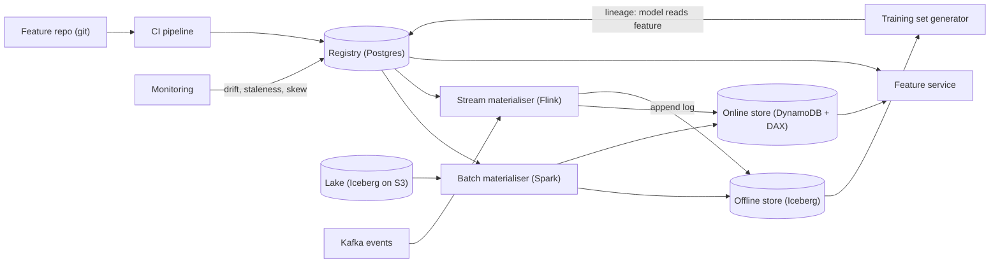
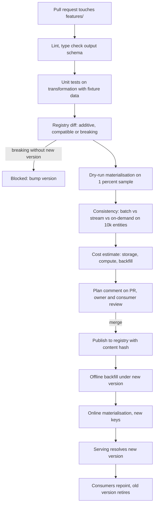
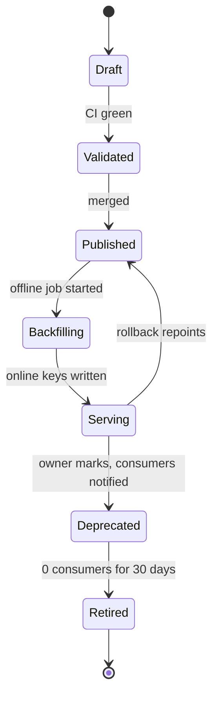

# Feature store — DE 19, the feature lifecycle, testing and CI/CD

Assumptions: AWS. Lake is Iceberg on S3, Spark on EMR for batch, Flink on Kubernetes for streaming, Kafka (MSK), Postgres for registry metadata, DynamoDB with DAX for the online store. Feature definitions live in one git repository (`features/`), Python, owned per directory through CODEOWNERS. The registry database is a projection of what is merged to `main`, never edited by hand.

## Requirements

Functional

| # | Requirement | Number |
|---|---|---|
| F1 | A feature definition is a code artefact: entity, source, transformation, output schema, TTL, owner, freshness. | 5,000 features, about 300 feature views (10 to 20 features each) |
| F2 | One definition produces the same value in batch, stream and serving. | offline/online disagreement rate under 0.1 percent of sampled rows |
| F3 | Every change goes through a pull request with automated checks; nothing reaches the registry outside CI. | 100 percent of definitions traceable to a merged commit |
| F4 | The registry classifies each change as additive, compatible or breaking, and blocks breaking changes that are not a new version. | 0 silent semantic changes |
| F5 | Deploy order is enforced: registry, offline, online, serving, consumers. | same commit hash across all four |
| F6 | Backfill on change is automatic within a cost cap; the owning team is charged. | cap 500 USD per PR without approval |
| F7 | Deprecation is gated on consumers; a feature read by a production model cannot be deleted. | 30-day grace, 0 forced removals |
| F8 | Rollback of a definition takes minutes, not a re-backfill. | under 15 minutes to previous version serving |

Non-functional

| # | Requirement | Number |
|---|---|---|
| N1 | CI wall time per PR | p50 under 10 minutes, p95 under 25 |
| N2 | CI cost per PR | under 5 USD median |
| N3 | Registry availability (serving reads it) | 99.95 percent, cached in the feature service with 60 s TTL |
| N4 | Lineage freshness (which model reads which feature) | under 1 hour lag |
| N5 | Backfill of a new daily feature view over 90 days | under 4 hours |

## Estimates

| Quantity | Estimate | Basis |
|---|---|---|
| Definition PRs | 40 per working day, 900 per month | 1,000 new features a year plus 3 changes per feature per year |
| CI dry run input | 1 percent of 7 days of events: 140M events, 14 GB | 2B events/day, 100 bytes each |
| CI dry run compute | 5 minutes on 20 Spark executors, about 2 USD | 14 GB scan plus join to a 1M-entity sample |
| Consistency check | 10k entities, batch path vs replayed stream path, 1 minute | fixed sample set per entity type |
| Monthly CI cost | about 5k USD | 900 PRs times 5 USD, plus reruns |
| Full 3-year backfill, view reading 5 percent of topics | 11 TB scan, 100 to 200 USD, 2 to 3 hours | 2.2T events times 100 B times 0.05 |
| Full 3-year backfill, view reading all events | 220 TB scan, 2 to 4k USD, needs approval | same, times 20 |
| Online store | 100M users times average 400 populated features times 8 B: about 320 GB per version, 1 TB with two versions live and items | DynamoDB storage about 300 USD per month; the cost is reads, not bytes |
| Offline store | about 150 TB Parquet compressed, change-only rows | 4k USD per month at 0.023 USD/GB |
| Online writes | 2B events/day drive about 25k feature-row writes per second average, 100k at peak | stream aggregations collapse many events into one row |
| Online reads | 200k lookups/s peak, each 1 to 3 key reads | DAX serves the hot 10 percent |
| Freshness | stream features 1 to 5 s, batch features 1 to 24 h | Flink checkpoint interval and nightly schedule |
| Whole platform | 150k to 250k USD per month | streaming compute dominates, then training-set scans, then online reads |

## High-level design

Main flows

1. Define: engineer writes a `FeatureView` in Python (entity, source, transformation function, output schema, TTL, freshness, owner), opens a PR. CI runs the checks in the deep dive and posts a plan. Merge publishes the definition, content hash and version to the registry.
2. Materialise batch: nightly Spark job reads the registry, computes every batch view on the lake, writes change-only rows to the offline store keyed by `(entity, event_time, view, version)` and upserts the latest row into the online store.
3. Materialise streaming: Flink jobs are generated per view from the same transformation function, read Kafka, keep windowed state, write to the online store and append the same rows to the offline store so training sees what serving saw.
4. Serve online: feature service takes `(entity ids, feature refs with versions)`, resolves refs through a cached registry snapshot, batch-gets from DAX/DynamoDB, applies on-demand transformations, returns a vector.
5. Training set: generator takes a label dataframe `(entity, timestamp, label)` and feature refs, does a point-in-time join against the offline store, records `(model, feature ref, version, commit)` in the registry as lineage.
6. Monitor: per feature version, staleness, null rate, distribution drift, and a daily offline-vs-online sample comparison; results attach to the registry entry and to the PR check history.

## Deep dive: the feature lifecycle, testing and CI/CD

The hard part: a feature is one line of code but three deployables (a Spark job, a Flink job, a serving lookup) and a data asset with up to 3 years of history and a dozen readers. Changing the code without changing the history, or changing the history without telling the readers, is exactly the silent disagreement the store exists to remove.

The obvious approach: a registry UI or API where you edit the definition and press save; the platform recomputes. Why it breaks: no review, no test of the transformation before it touches 100M rows, no record of what the value meant last month, and the in-place overwrite makes training sets generated before the change unreproducible. Every team that has done this ends up with features whose meaning depends on the date.

What I would do: definitions are code, versions are immutable, the registry is a compiler output, and the pipeline from PR to serving is one ordered flow.

### Pipeline from pull request to serving

What each stage does and what fails it

| Stage | Runs | Fails when | Time |
|---|---|---|---|
| Lint and types | `mypy`, declared output schema checked against the function's return annotation, name and entity conventions | schema missing, type unknown to the online store encoder, name collision | 30 s |
| Unit tests | `pytest` on the transformation with fixture Parquet in `features/<view>/fixtures/`, golden output committed | any golden row differs; author must update golden in the same PR, which shows in the diff | 1 min |
| Registry diff | compare the new definition with `main` and classify per the table below | breaking change under the same version | 10 s |
| Dry run | real Spark job, real source tables, 1 percent entity sample, last 7 days, writes to a scratch prefix | job error, null rate above 20 percent, output outside declared range, row count off by more than 3x from the previous version | 5 min |
| Consistency | same 10k entities computed by the batch path, by a Flink job replaying the same Kafka window, and by the on-demand path if defined; compare within tolerance (exact for ints, 1e-6 for floats, exact for categoricals) | disagreement above 0.1 percent of rows | 1 to 2 min |
| Cost estimate | rows per day times bytes times retention, plus stream state, plus backfill scan size from Iceberg metadata; posted in USD per month and one-off | above 500 USD backfill or 2k USD per month without a `cost-approved` label from the platform team | 5 s |
| Plan comment | terraform-style: what is created, changed, versioned; list of consumers from lineage with owners tagged | none, informational; consumers get 2 working days to object on a breaking change | |

The dry run and consistency stages are the ones that catch what code review cannot: a timezone bug that appears only on real data, a window that Flink computes over event time and Spark over processing time. They cost 2 to 3 USD per PR; that is cheaper than one bad backfill.

### What is a breaking change and how the registry blocks it

Rule: if any row that a consumer has already read could take a different value or type, it is breaking. A breaking change must be published as `feature:vN+1`; the same name at the same version can only change in ways that leave every historical and future value identical.

| Change | Class | Required checks | Migration path | Who pays |
|---|---|---|---|---|
| New feature or new view | additive | all stages | backfill default 90 days, then serve | owner team |
| Add a feature to an existing view | additive | all stages, dry run on whole view | backfill new column only, existing columns untouched | owner team |
| Owner, description, tags | metadata | lint | registry update, no data movement | none |
| Longer TTL, longer offline retention | compatible | cost estimate | apply forward, no backfill | owner team |
| Change source table or topic, same semantics | compatible if consistency passes | dry run on both sources over the same window, disagreement 0 rows | swap source forward, keep history | owner team |
| Batch to streaming for the same logic | compatible if consistency passes | batch vs stream on 10k entities | stream takes over forward, offline history stays batch rows | owner team |
| Bug fix in the transformation | breaking | all stages, new version | backfill vN+1, consumers retrain, vN retires after grace | owner team |
| Aggregation window, filter, or formula | breaking | all stages, new version | same | owner team |
| Output type or nullability | breaking | all stages, new version | same, feature service refuses to coerce | owner team |
| Entity key or event timestamp column | breaking | all stages, new version | new view, old view deprecated | owner team |
| Shorter TTL | breaking | consumer list review | new version; training sets with longer horizons break | owner team |
| Rename | breaking | lineage check | alias entry pointing at the same version for 90 days, then removal | none |
| Deprecate | lifecycle | consumers must be 0 production models or have an approved migration ticket | see below | none |
| Delete | lifecycle | 0 consumers, deprecated for 30 days | offline archive, online keys expire by TTL | none |

The registry enforces this with a state machine per `(name, version)`: a published version's content hash is immutable. The registry diff stage computes the class from the AST and declared schema, not from a manual field in the PR, so it cannot be bypassed by claiming a change is compatible. Anything the classifier cannot prove compatible is breaking.

### Deploy order and why

Order is registry, offline, online, serving, consumers. Reversing any pair produces a window where a reader sees a definition with no data or data with no definition.

1. Registry publish: the version is visible but marked `Published`, not `Serving`; the feature service refuses refs in that state, so nobody can read it early.
2. Offline backfill: Spark job for `vN+1` writes under the new version key. Old rows untouched. Default window 90 days; the PR can request up to 3 years within the cost cap.
3. Online materialisation: batch job upserts latest values under `(entity, view, vN+1)`. For streaming views, the new Flink job starts from the Kafka offset matching the backfill boundary, so there is no gap and no double counting; it runs alongside the old job.
4. Serving: registry flips `vN+1` to `Serving`. The feature service picks it up within 60 s. Consumers that pinned `vN` keep getting `vN`.
5. Consumers: models reference `feature:vN` explicitly in their training spec; the plan comment lists them. They retrain on `vN+1` on their own schedule inside the grace window. A ref without a version resolves to the latest `Serving` version at training time and is pinned into the model's lineage record, so serving uses the version the model trained on.

Online keys carry the version, so two versions coexist with one extra 320 GB of storage, which is the price of never overwriting.

### Backfill on change and who pays

- Automatic for every new version, sized by the cost estimate. Below 500 USD it runs on merge; above, it waits for a `cost-approved` label.
- Charged to the owning team through a cost-allocation tag on the Spark job. Consumers that need history beyond the default 90 days open a request; they pay for the extra window.
- Backfill writes are idempotent: partitioned by `(view, version, day)`, each day overwritten atomically by Iceberg commit, so a failed job reruns without duplicates.
- The stream materialiser for a new version starts from the offset that matches the last backfilled day, recorded in the registry, so batch history and stream tail meet with no seam.

### Deprecating a feature that models still read

1. Owner sets `deprecated` in the definition, PR runs lineage check, plan comment lists every model, owner and last training date.
2. Registry keeps serving; training-set generation logs a warning naming the replacement.
3. After 30 days, training-set generation refuses the feature unless the model has an approved exception; serving continues, because breaking a production model is worse than keeping a column.
4. When lineage shows 0 production models for 30 days, materialisation stops, online keys expire by TTL, offline partitions move to archive tier and stay reproducible for 3 years.
5. A model that never retrains can keep a deprecated feature indefinitely; the cost shows up on the model's owner in the monthly report, which is the only pressure that works.

### Rollback

- Definition: `git revert`, merge, registry sets `vN+1` back to `Published` and `vN` back to `Serving`. Feature service repoints within 60 s. `vN` online values are still there because they were never overwritten; if `vN` materialisation was stopped, its values are at most one TTL stale, which the staleness monitor reports.
- Streaming: the previous Flink job image is redeployed from the last savepoint. State schema is part of the content hash, so a version whose state is incompatible cannot restore from the other version's savepoint; it starts from the backfill boundary instead.
- Offline: nothing to roll back; `vN+1` partitions stay, unreferenced, and are cleaned by the retire step.
- Consumers that already retrained on `vN+1` stay pinned to it, so a rollback does not silently change a model's inputs; their owner decides.

## Trade-offs

| Decision | Chosen | Alternative | Why |
|---|---|---|---|
| Source of truth | git, registry is derived | registry UI as source of truth | review, history, revert, CODEOWNERS for free; a UI can still exist as read-only |
| Versioning | immutable `name:vN`, coexistence | overwrite in place with a changelog | reproducible training sets; costs one extra copy of online data during migration |
| Breaking-change detection | classifier on AST plus schema, conservative | author declares the class | authors are optimistic; false breaks cost a version bump, false compatibles cost a silent skew |
| CI dry run | real Spark on 1 percent sample every PR | unit tests only | 2 USD per PR against real-data bugs that unit fixtures never contain |
| Default backfill | 90 days, more on request | always full 3 years | 90 percent of models train on under 90 days; full backfills cost 100 to 4k USD |
| Deprecation | grace and cost pressure, never forced removal | hard delete after N days | a broken production model costs more than a stale column |
| One monorepo | yes | per-team repos | cross-team discovery and one CI pipeline; the cost is CODEOWNERS discipline and a 40-PR-per-day queue |

## Pitfalls

- Golden-file tests that authors regenerate blindly. Mitigation: the golden diff is rendered in the PR and reviewed like code.
- The consistency check passing on a sample that lacks late events. Mitigation: the 10k-entity sample is chosen to include entities with events near window edges and out-of-order arrivals.
- Unversioned refs in model code that resolve differently at training and serving. Mitigation: the training-set generator pins the resolved version into lineage, and the feature service reads the pin from the model's serving config.
- Two versions of a streaming job doubling Kafka consumption and Flink state during migration. Budget for it; cap coexisting versions at two per view.
- CI queue at 40 PRs a day with 10-minute dry runs. Mitigation: dry runs only for views whose code or fixtures changed; metadata-only PRs skip to lint.
- Backfill boundary off by one day between batch and stream, producing a gap or a double count. Mitigation: the boundary offset is written to the registry by the batch job and read by the Flink job, never typed by hand.
- Lineage from training-set generation misses models trained outside the platform. Mitigation: the feature service logs the refs it serves per model id; serving lineage is the one that gates deprecation.

## Open questions for the panel

1. Should the breaking-change classifier be allowed to prove compatibility for formula changes through the consistency check alone (0 disagreeing rows on 10k entities), or is any formula edit breaking by rule? I lean toward by rule; the panel may want the cheaper path.
2. Do we allow consumers to pin a feature at a commit hash rather than a version, for exact reproduction of an audit-relevant model? It complicates retirement.
3. Who owns the cost of a backfill that a consumer requests beyond the default window when the feature owner is another team: the consumer, or split?
4. Is a 30-day grace for deprecation right for models that retrain quarterly, or do we need per-model retrain cadence in the registry?
5. Should on-demand transformations (computed in the feature service at request time) go through the same dry-run stage, given they run in the serving process with a 10 ms budget?

## Non-negotiables

1. A published `(name, version)` is immutable. No path, human or automated, changes its transformation, schema or history in place. Without this, training sets are not reproducible and the store has not solved the problem it exists for.
2. Every PR that changes a transformation runs a real materialisation on a real-data sample and a batch-versus-stream consistency check before merge. Unit tests alone do not catch skew.
3. Deprecation and deletion are gated on serving lineage from the feature service, not on a self-reported consumer list. A feature that a production model reads cannot be removed by anyone.
