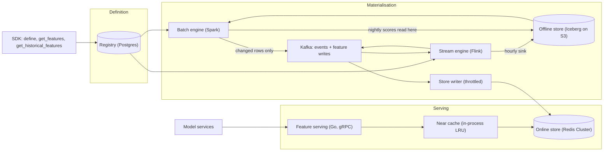
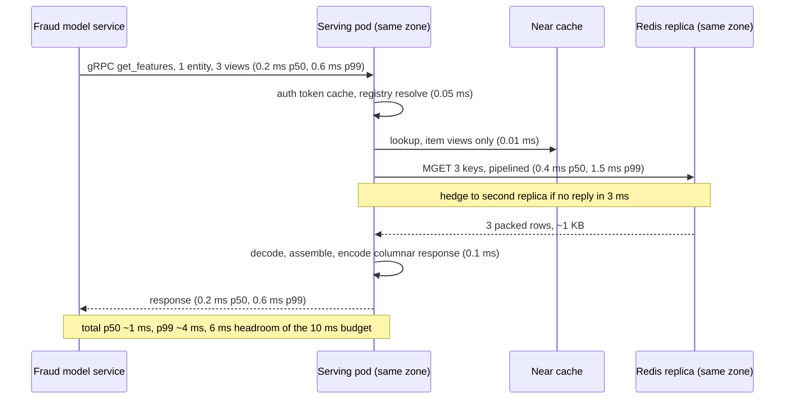
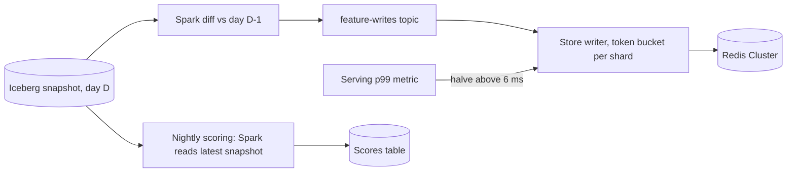

# Feature store — DE 20, scale and performance engineering

Assumptions: AWS. Online store is Redis Cluster (ElastiCache, 12 primaries, one replica per zone, three zones). Serving service is Go + gRPC on Kubernetes. Offline store is Parquet on S3 with Iceberg. The 200k lookups/s is 200k entity rows per second, not 200k RPCs: 20k fraud requests × 1 entity plus 600 ranking requests × 300 candidates.

## Requirements

Functional
- One feature definition (SQL or Python transformation plus entity, TTL, freshness class) produces the same value in batch, stream, online, and training paths.
- Online `get_features(feature_service, entity_keys[])` for 1 to 500 entities per call.
- Offline `get_historical_features(entity_df, features, as_of)` for point-in-time correct training sets, and `get_latest_features` for nightly batch scoring.
- Registry: lineage from column to model, search, ownership, versioning.

Non-functional, with numbers

| Requirement | Number |
|---|---|
| Fraud fetch latency | p99 < 10 ms end to end, 1 entity, ~60 features |
| Ranking fetch latency | p99 < 20 ms, 300 entities, ~40 features each |
| Online throughput | 200k entity rows/s peak, 3× headroom before scale-out |
| Freshness | streaming features < 5 s event to readable; batch features < 6 h after day close |
| Availability | 99.95 percent for online reads; degrade to defaults, never block scoring |
| Bulk load | 120M rows nightly with no p99 regression above 1 ms |
| Batch scoring | 100M users scored nightly, zero reads against the online store |
| Training sets | 1,000/month, 3 years history, each < 1 hour wall clock |

## Estimates

| Quantity | Arithmetic | Result |
|---|---|---|
| Entity rows read/s | 20k × 1 + 600 × 300 | 200k rows/s |
| Store keys read/s | fraud 3 views, ranking 2 views: 20k×3 + 180k×2 | 420k keys/s |
| Packed row size | ~40 features × (8 B value + 1 B presence bit) + 16 B header | ~350 B |
| Store read bandwidth | 420k × 350 B | 150 MB/s, 1.2 Gbit/s |
| Streaming writes | 2B events/day = 23k/s avg, 3× peak, 1.5 keys/event | 100k writes/s peak |
| Nightly bulk writes | 120M rows, changed-only ~25M, over 2 h | 3.5k writes/s |
| Online memory | (100M × 3 + 20M × 2) rows × 350 B × 1.5 Redis overhead | 180 GB, 360 GB with replicas |
| Offline daily snapshot | 120M rows × 350 B, Parquet 3:1 | 15 GB/day |
| Offline 3 years | 15 GB × 1,100 days + raw events 400 GB/day × 1,100 × 0.3 | 150 TB |
| Serving CPU | 200k rows × 15 µs decode+encode = 3 core-s/s; ×4 for gRPC, GC, headroom | 12 cores, 12 pods × 1 core |
| Batch materialisation | 300 feature views, ~2,000 executor-hours/day | ~$6k/month |
| Training set generation | 1,000 × 50 executor-hours | ~$8k/month |
| Online store | 360 GB RAM across r7g nodes plus replicas | ~$12k/month |
| Total | store + Spark + Flink + Kafka + S3 + serving | $35k to $45k/month |

## High-level design

Main flows
1. Define: engineer registers a feature view (entity, transformation, freshness class, TTL, `max_staleness`) via the SDK; the registry validates the schema and assigns a row layout version.
2. Materialise batch: Spark runs the transformation over the lake, writes the day's snapshot to Iceberg, diffs against yesterday, publishes changed rows to the `feature-writes` topic.
3. Materialise streaming: Flink consumes events, keeps windowed aggregates in RocksDB state, emits row updates to `feature-writes`, and sinks hourly Parquet to the lake so offline has the same values.
4. Serve online: the store writer consumes `feature-writes` at a throttled rate into Redis; serving pods read via near cache then Redis.
5. Training set: Spark point-in-time join of the entity dataframe against Iceberg snapshots; never touches Redis.
6. Monitor: per feature view p99, cache hit rate, hot-key top-k, shard CPU, replication lag, freshness lag, writer throttle rate.

## Deep dive: scale and performance engineering

The hard part: 10 ms p99 with 200k rows/s, while 100M rows are loaded underneath it every night and one item can be read 17k times a second.

The obvious approach: one key per feature, JSON values, `GET` per key, a thread per request, and a Spark job that `SET`s 100M rows at full speed at 02:00. It breaks four ways: 60 features × 20k/s = 1.2M `GET`s/s just for fraud; JSON decode of 60 values costs 30 µs and allocates 60 objects, so GC eats the tail; every ranking request fans out to every shard so p99 becomes the slowest of 12; and the bulk load doubles shard CPU and replication lag during the load, which pushes p99 to 30 ms for two hours.

### Data layout: one key per entity per feature view

- Key `{user:123}:v17` with the entity in the hash tag, so all views of one entity land on the same slot. A fraud request is one `MGET` of 3 keys, one round trip.
- Value is a fixed-layout binary row: 16 B header (layout version, write timestamp, feature count), a presence bitmap, then fixed-width values in registry order. Variable-length values (strings, embeddings) go at the tail with offsets. Decoding is pointer arithmetic, no allocation.
- Layout version in the header lets the serving pod read rows written by yesterday's schema during a rollout.

| Row format | Bytes for 40 features | Decode cost | Allocations |
|---|---|---|---|
| JSON map | ~1,500 | 30 µs | 60+ |
| Protobuf map<string, Value> | ~600 | 10 µs | 40+ |
| Fixed-layout binary | ~350 | < 1 µs | 0 |

### Serving hot path with latency at each hop

p99 budget for fraud, one entity

| Hop | p50 ms | p99 ms | Note |
|---|---|---|---|
| Client to serving pod | 0.2 | 0.6 | Topology-aware routing keeps it in-zone; cross-zone adds 1 ms |
| gRPC decode, auth | 0.05 | 0.2 | Token validated from a 60 s cache |
| Registry resolve | 0.01 | 0.01 | In-memory snapshot refreshed every 30 s |
| Redis MGET | 0.4 | 1.5 | Same-zone replica, `READONLY` |
| Decode and assemble | 0.05 | 0.15 | Fixed layout |
| Encode response | 0.03 | 0.1 | Columnar proto |
| Serving to client | 0.2 | 0.6 | |
| GC and scheduling jitter | 0 | 1.0 | Go GC sub-ms with GOMEMLIMIT; no CPU limit on the pod |
| Total | ~1.0 | ~4.2 | 5.8 ms left for one hedged retry |

Ranking, 300 entities: keys spread over 12 shards, so the client groups by shard and sends 12 pipelines in parallel. p99 of the max of 12 is roughly the single-shard p99.9, about 3 ms. Decoding 600 rows at under 1 µs each is 0.6 ms. The response is columnar (feature → array of 300 values), 110 KB, encoded in 0.5 ms; a per-entity map would be 4× bigger and 300× the allocations. Ranking p99 lands at 7 to 8 ms against a 20 ms target.

### Connection and thread model

- One Go process per pod, one goroutine per request, no thread-per-request and no request queue in front of the store.
- Redis client with 8 connections per cluster node and auto-pipelining: commands issued within a 50 µs window on the same connection go out as one write. 12 nodes × 3 zones × 8 = 288 connections per pod, 12 pods, under 4k connections cluster-wide, well under Redis limits.
- Client-side gRPC load balancing over a headless service, zone-affine, so the L7 proxy hop is removed from the hot path.
- Per-request deadline propagated to the store call; the request budget is 8 ms so the model service never waits past its own 10 ms.
- Pods run with CPU requests equal to limits or no limits; cgroup throttling is the most common silent 20 ms tail.

### Where tail latency comes from

| Source | Effect | Mitigation |
|---|---|---|
| Redis fork for RDB or AOF rewrite | 5 to 50 ms stall on that node | Snapshot only on one replica per shard; primaries and serving replicas never fork |
| Hot key or hot shard | One shard at 100 percent CPU | Near cache, top-k sketch alarm, replica reads spread load 3× |
| Cross-zone hop | +1 ms per hop | Zone-affine client and replica selection |
| Fan-out max-of-N | p99 becomes p99.9 | Hedged reads after 3 ms; per-shard pipelines in parallel |
| GC pause | 1 to 10 ms in JVM; sub-ms in Go | Zero-allocation row decode, GOMEMLIMIT, heap under 1 GB |
| Slot migration during reshard | +2 ms redirects | Reshard in off-peak window, client refreshes slot map |
| Bulk load | Shard CPU and replication lag | Throttled writer, see below |
| TTL expiry storm | Spike when a day's rows expire together | Jitter TTL by ±10 percent |
| Connection churn | TLS handshake 5 ms | Long-lived pools, keepalive |

### Hot entities

A viral item read a million times a minute is 17k reads/s of one key. One Redis shard does about 150k pipelined reads/s, so one hot item is fine, but a ranking candidate set concentrates the top 1 percent of items in most requests, and ten hot items on one shard is a hot shard.

- In-process LRU per serving pod, 128 MB, keyed by store key. Only feature views whose registry `max_staleness` is ≥ 60 s are cacheable; item content and popularity views qualify, user velocity counts for fraud do not.
- TTL equals the view's `max_staleness`; staleness is bounded by definition, not by hope. Singleflight per key so one miss triggers one store read.
- Expected: the top 200k items cover about 80 percent of item reads and fit in 70 MB. Item keys drop from 360k/s to 72k/s at the store; total store load falls to about 130k keys/s.
- Each pod samples key frequency with a space-saving top-k sketch and exports the top 50; an alarm fires when one key exceeds 5 percent of a pod's reads.
- Replica reads give 3× on any single key without cache; with cache, a hot key costs the store 12 reads per TTL window.
- Redis 6 client-side tracking with invalidation push is the upgrade path if 60 s staleness turns out too coarse for some item view.

### Bulk-loading 120M rows nightly without denting p99

1. Spark writes the snapshot to Iceberg first, then diffs against yesterday's snapshot and publishes only changed rows to `feature-writes`. Typically 20 percent of users change daily, so 25M rows, not 120M.
2. One store writer path for batch and stream: a consumer group on `feature-writes`, partitions aligned to Redis slots, `MSET` pipelines of 200 rows.
3. Token bucket per shard, initial 5k writes/s per shard (about 15 percent of shard capacity), so 25M rows land in about 40 minutes over 12 shards.
4. Feedback loop: the writer reads the serving p99 metric every 10 s; above 6 ms it halves the rate, below 4 ms it grows 20 percent. Streaming updates hold a reserved 30 percent of the bucket so bulk never starves them.
5. Row TTL set to 2× the batch period with jitter, so a missed run degrades to stale rather than empty and expiries do not spike.
6. Idempotent writes keyed by write timestamp in the header: a replay of the topic never regresses a streaming update with an older batch value.

### Nightly batch scoring without the online store

- `get_latest_features(entity_df, features)` is the point-in-time join with `as_of = now`, resolved against the newest Iceberg snapshot of each batch view and the latest hourly sink of each streaming view. Same retrieval library as training sets, so there is one code path for offline reads.
- 100M users × 60 features × 8 B is 48 GB scanned as Parquet; 50 executors finish in about 15 minutes, about $20 per run.
- The scorer writes to a scores table; a separate feature view can publish scores to the online store through the same throttled writer.
- Streaming features are up to one hour stale in this path; churn and LTV tolerate it, and the registry freshness class makes that explicit.
- The online store has no scan API exposed to batch jobs at all; a `SCAN` of 300M keys would take an hour and hold shard CPU the whole time.

## Trade-offs

| Decision | Chosen | Alternative | Why |
|---|---|---|---|
| Online store | Redis Cluster in memory | DynamoDB | DynamoDB p99 is 5 to 10 ms, which is the whole budget; Redis is 1.5 ms and 4× cheaper at 420k reads/s |
| Row format | Fixed-layout binary | Protobuf map | 10× decode cost and allocation; the layout version header covers schema evolution |
| Row granularity | One key per entity per view | One key per feature | 30× fewer keys per request; cost is rewriting a 350 B row for a 1-feature update |
| Hot key absorption | Per-pod LRU with declared staleness | Redis replicas only | Replicas give 3×; cache gives 100× and bounds staleness by definition |
| Bulk load | Throttled writer with p99 feedback | Direct Spark to Redis | Direct load doubled shard CPU and pushed p99 to 30 ms in every system I have seen |
| Serving language | Go | JVM | Sub-ms GC without tuning; JVM with ZGC works but the ops cost is on an 8-person team |
| Batch scoring source | Iceberg snapshot | Online store scan | Offline read is 15 minutes and $20; a store scan is an hour of degraded p99 |

## Pitfalls

- Averaging latency across fraud and ranking hides that ranking fan-out drives the tail; report p99 per feature service.
- Kubernetes CPU limits throttle in 100 ms windows and produce 20 ms tails that no metric on Redis explains.
- Redis `MGET` across slots fails in cluster mode; the client must group by slot, and a client that does not silently serialises 300 round trips.
- Fixed-layout rows rot if the registry does not own the layout version; two writers with different layouts corrupt reads.
- The near cache is a correctness bug for any view without a declared `max_staleness`; make the field mandatory.
- Nightly TTL expiry of 100M rows at the same second is a self-inflicted outage.
- Point-in-time joins for training and `get_latest_features` for scoring must be the same function or training and batch serving skew reappears.

## Open questions for the panel

1. Is 60 s staleness acceptable for item popularity features in ranking, or does the ranking team need client-side tracking invalidation from day one?
2. Do we commit to one key per entity per view, accepting that a single streaming feature update rewrites the whole 350 B row, or split hot streaming features into their own view?
3. Redis multi-AZ with replica reads costs 3× memory; is the 1 ms cross-zone hop cheap enough to run one replica set and accept it for two of three zones?
4. Who owns the p99 feedback loop for the bulk writer: the platform team via a metric, or the model owners via a per-service SLO?
5. Should scores from nightly batch models be written to the online store at all, or served from a separate low-QPS table so they never compete for shard CPU?

## Non-negotiables

1. Row-level packed layout with a registry-owned layout version and one key per entity per view; per-feature keys or JSON values make the 10 ms budget unreachable.
2. One throttled store writer for batch and streaming with a p99 feedback loop; no job writes to Redis directly.
3. Batch scoring and training reads come only from the offline store; the online store exposes no scan to batch jobs.
