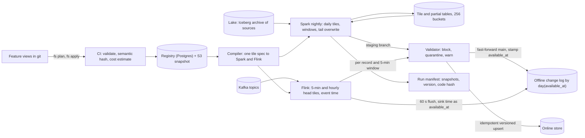
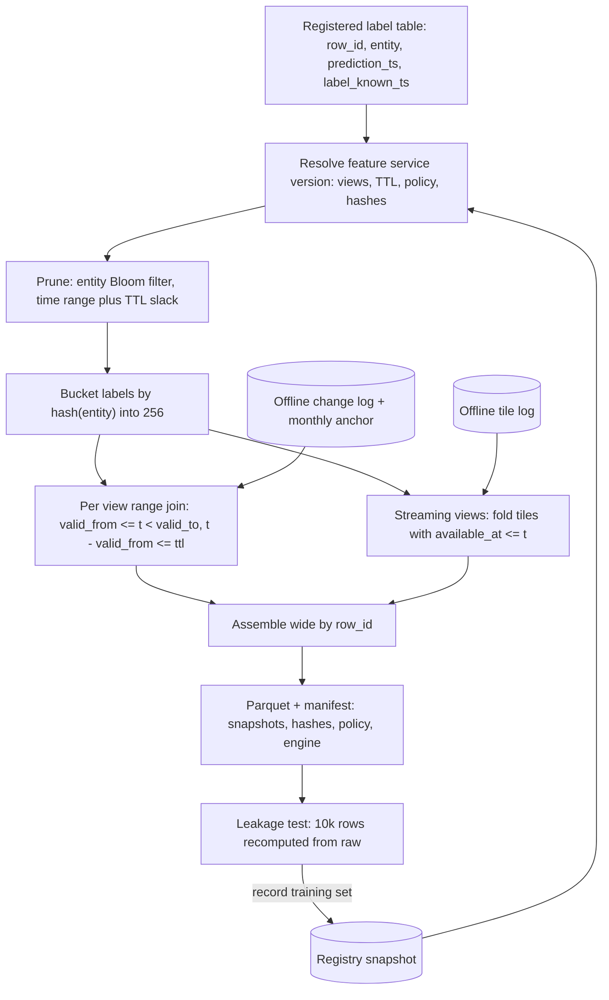

# Area A: definitions and computation — lead review

Scope: how a feature is declared, versioned and registered; how the definition becomes batch and streaming jobs; what the offline store looks like and how a training set is joined against it; what gate sits between a writer and a reader. Inputs: DE 01 to DE 05. Cloud assumption shared by all five: AWS, Iceberg on S3, Spark, Kafka, Kubernetes, Postgres, a Redis-class KV.

## Engineers

- **DE 01, registry.** Definition-as-code, CI as the only writer, SHA-256 semantic hash over value-affecting fields; a feature name has one meaning forever, a breaking change is a new name. Most important contribution: the registry is what executes, not a description of something else, and it is never on the hot path (S3 snapshot polled every 60 s).
- **DE 02, batch.** Feature groups keyed by (entity, source, grain); daily partials read raw once per night; invertible windows as running state; everything a pure function of (source snapshots, as_of_date); partition overwrite plus manifest. Most important contribution: the shared partial layer, 800x cheaper than one job per feature (66 USD per night versus 50k).
- **DE 03, streaming.** Mergeable event-time tiles (5 min, 1 h, 1 d) folded at read; Flink owns only the last 24 h, batch overwrites everything older; idempotent versioned upserts instead of two-phase commit; one definition compiled to both engines with a daily parity diff. Most important contribution: tiles are the one primitive that bounds state at 100M entities and is backfillable.
- **DE 04, point-in-time.** Join on `available_at` (online commit ack), never `event_time`; change log plus monthly anchor plus `valid_from/valid_to` intervals; 256 entity buckets shared with label tables; manifest pins Iceberg snapshots, versions and join engine. Most important contribution: the materialisation-delay leak worked example (r2 not r3) and the rule that fixes it.
- **DE 05, quality.** Validator is a library inside the writer; Iceberg staging branch fast-forwarded on pass; three outcomes only (block, quarantine, warn); thresholds auto-derived weekly from passing days; 0.1 percent served-value log recomputed offline nightly. Most important contribution: the skew mismatch rate as the direct measurement of the store's core promise.

## Consensus

- One definition, declared once in code, is the only thing batch, streaming, serving and training execute; the registry (Postgres) is the system of record and nothing runs from a side document.
- Event time everywhere; no wall clock, no processing time, no `now()` in a definition, because batch cannot reproduce anything else.
- A value-affecting change never silently changes an existing feature; versions are append-only.
- Features are materialised in groups sharing entity, source and cadence, not one job per feature.
- Every materialised partition and every training set has a manifest pinning source snapshots, definition versions and code, so reruns are byte-identical.
- The registry is never on the online read path; serving works with the registry down.
- TTL and the as-of rule are one registry field read by both serving and the join engine.
- Train/serve parity is measured, not assumed: a daily comparison with a numeric threshold of 0.1 percent mismatched entities.
- Offline store is Iceberg on S3 with pinned snapshots; backfill over 3 years must come from the lake archive, not from Kafka.
- Every feature has a named owner (and a tier) in the registry, and alerts go to that owner.
- Backfill of a changed definition must complete in hours, not weeks, and must never be visible half-done.
- Sessionisation, arbitrary Python and anything not decomposable into mergeable partials belongs in a source transform, not in a feature view.
- Lineage from source column to feature to training set to deployed model is populated as a side effect of normal operation, never by a crawler.

## Disagreements and resolutions

### Unit of scheduling: view versus group versus feature

DE 01 proposes the feature view (shared entity, source, transformation, TTL; 5 to 30 features; about 600 views) as the unit of materialisation and the feature service as the unit of serving and training. DE 02 proposes the feature group keyed by (entity, source table, grain), about 350 jobs, because one Spark job then reads a source partition once. DE 04 assumes about 300 groups; DE 05 assumes 500 views of 10 features. Nobody proposes per-feature scheduling but DE 02 notes the blast-radius cost of grouping.

**Resolution:** one object, called a feature view, keyed by (entity, source, grain, TTL), 5 to 30 features, target about 400 views: 350 batch (40 sources times the distinct grain and TTL combinations), 40 streaming over 12 topics (DE 03's 300 sub-minute features), 10 on-demand. This is DE 02's grouping key with DE 01's size rule and DE 01's name. Blast radius is handled by per-feature null-tolerant evaluation inside the view and per-feature quarantine (DE 05), so one bad expression withholds one feature, not the view. The feature service stays the unit of serving and training. 400 is chosen over 600 because views wider than 30 re-materialise too much and narrower than 5 multiply source scans.

### Aggregation primitive and how batch and streaming share a definition

DE 02: daily partials (count, sum, sum of squares, min, max, HLL, last, first) per (source, entity, day), windows built by invertible running state or by merging N partials. DE 03: tumbling tiles at 5 min, 1 h and 1 d, windows folded at read time, sketches for distinct and percentile. Both reject rescanning raw per window; the two differ on grain and on where the fold happens.

**Resolution:** a daily partial and a daily tile are the same row; there is one tile table per view with grain in {5m, 1h, 1d}. Batch-only views produce daily tiles and fold them nightly into a stored window value (DE 02's strategy table: invertible windows read 3 partitions, non-invertible merge N, sketches for distinct, percentile and top-k). Streaming views produce 5-minute and hourly tiles in Flink for the head (last 24 h) and daily tiles from Spark for the tail; their windows are folded at read. Sketch payloads: HLL precision 10, DDSketch 1 percent, hourly tiles only, capped at 20 sketch features per entity. Same UTC-epoch-aligned tile boundaries, same dedupe key and value expression in both engines, tested against one golden dataset in CI.

### Who owns which time range

DE 03: Flink owns the last 24 h, Spark nightly recomputes closed tiles from the lake and overwrites them, so after 24 h every value is batch-produced. DE 02: batch owns as_of_date D-1 with a 3-day lookback for late data. DE 04: streaming writes online first and appends offline every 60 s with its own `available_at`.

**Resolution:** streaming owns tiles younger than 24 h; nightly Spark owns everything older and overwrites the closed head tiles with lake-derived values, applying a 3-day lookback for both partials and tiles. Late events inside the 1 h grace are merged by Flink and re-emitted; later ones go to a dropped-late topic and are fixed by the nightly overwrite. The offline store keeps both the streaming emission (with its real `available_at`) and the batch correction as separate rows, because training must see what serving saw at t, not the corrected value.

### The join timestamp and where it is stamped

DE 01 joins on the source `event_ts` with TTL. DE 02 joins on `as_of_date` with carry-forward. DE 03 folds tiles whose start is in [t - window, t), precision one tile. DE 04 joins on `available_at`, the instant the value became readable online, and shows that `event_time` leaks by exactly the materialisation delay (2 h 15 in the example, several AUC points on a velocity feature). DE 05 measures freshness from `event_timestamp`.

**Resolution:** `available_at`, DE 04's rule, on every offline row, batch and streaming. Stamping: for batch the online export job writes the partition to the Iceberg staging branch with `available_at` null, upserts to the online store, then fills `available_at` with the export commit ack time per bucket at fast-forward (one value per bucket, minute precision, exact or conservative, never a lie from a late job). For views that are never served online, `available_at` is the offline commit time. For streaming, `available_at` is the sink write time of each tile emission, carried into the offline tile log on the 60 s flush; a late merge after tile close appends a new row with its own `available_at`. `event_time` stays on every row for analysis and freshness. Tile precision for the fold is 5 min plus sink latency and the skew job measures the residual error.

### Offline layout

DE 01: change-only Parquet, 45 TB over 3 years. DE 02: as_of_date partitions of changed rows, 1,024 entity buckets, 165 TB of feature tables plus 110 TB of partials. DE 03: tile tables, 2 TB per day compressed, 60 TB per month. DE 04: change log partitioned by `day(available_at)`, 256 buckets, monthly snapshot anchors, nightly `valid_to` fill, 250 TB. DE 05: daily snapshots, 200 TB.

**Resolution:** DE 04's layout. Per view: change log partitioned by `day(available_at)`, bucketed `bucket(256, entity_id)`, files sorted by (entity_id, available_at), `valid_to` filled nightly over the last 2 days, one monthly anchor snapshot per view so the range join is bounded to 31 days. Tile and partial tables use the same 256 buckets so the window pass and the join are bucket-local; 256 rather than 1,024 because at 20M changed rows per view per day, 1,024 buckets gives 1 MB files and 256 gives 4 MB, and the label side must be bucketed identically, so fewer buckets is cheaper for callers. Daily snapshots are rejected (20x storage, still needs `available_at`). DE 03's 2 TB per day of 5-minute tiles would be 2.1 PB over 3 years, more than raw, so: 5-minute tiles kept 90 days (180 TB), hourly tiles 1 year (60 TB), daily tiles for 3 years (they are the partials, 110 TB). Total for the store about 550 TB, 12 to 14k USD per month; the 1.1 PB raw archive (22k USD per month) is a lake cost, owned by Platform.

### Validation placement

DE 05: validator library inside the writer, Iceberg staging branch per run, fast-forward on pass, inline per-record checks plus 5-minute windowed checks in Flink. DE 02: write the partition, then a row-count and null-rate check, quarantine the partition and block downstream on failure. DE 03: a daily parity diff after the fact. DE 04: a 10k-row leakage test per training set.

**Resolution:** DE 05's gate, because a post-write check means a reader may already have consumed the partition. Batch: branch `staging-<run_id>`, validate, fast-forward `main`, then export online; a failed branch is DE 02's quarantine, kept 7 days. Budget 10 percent of job time, measured at 2 min on 20 cores per 10 GB partition. Streaming: schema, range and timestamp checks per record (50 us), null rate and cardinality per 5-minute window, view paused on failure; nothing reaches the online store without passing. DE 03's parity diff and DE 04's leakage test run nightly and write to the same quality status table. Auto-derived thresholds come from the trailing 28 passing days by weekday slot; tier-1 views must declare thresholds explicitly.

### Registry exposure on the hot path

DE 01: the serving API reads a 2 MB gzipped JSON snapshot from S3 every 60 s, never the database. DE 03: jobs read the registry at start and on Kafka change events. DE 05: a quarantine verdict must reach the server so it can serve the registered default with a `stale` flag, which implies a live signal.

**Resolution:** no synchronous registry call from serving or from a running job. The snapshot carries definitions plus the live quality row per feature version; `registry.changes` on Kafka is the push signal for materialisers. Quarantine verdicts land in the snapshot within one rewrite (seconds) and reach pods within 60 s, which fits the 1-minute streaming and 5-minute batch detection targets. A registry outage delays changes and verdicts; it never affects a lookup.

### Versioning rules

DE 01: metadata and additive changes bump the view version in place; a value-affecting change to an existing name is rejected, the author creates `name_v2` with `supersedes=` and deprecates the old one. DE 02: a changed definition is group v2, backfilled to its own table, pointer swapped when validated, v1 retained 30 days. DE 04: feature id is `name@version`, a new version is a new column, the old one keeps materialising until no live manifest references it. DE 05: threshold changes are registry versions.

**Resolution:** DE 01's naming rule with DE 02's backfill mechanics. Names are immutable in meaning, enforced by the semantic hash (fields: entity, source and timestamp column, transformation, aggregation, dtype, TTL; not schedule, SLA, owner, thresholds). A breaking change is a new name with `supersedes`, materialised to its own table and backfilled while the old name keeps serving; a model migrates by publishing a new feature service version. Manifests record name plus semantic hash, which gives DE 04's provenance without two live values under one name in the online store. Metadata changes, including thresholds, bump the view version without changing the hash.

### Backfill semantics for history before a feature existed

DE 03 backfills 3 years of tiles so a new streaming feature has training data on day one. DE 04 points out that serving returned null before launch, so a backfilled value is a leak, and offers two policies: synthetic `available_at` with a flag, or strict nulls before `first_served_at`. DE 02 adds that the first N-1 days of an N-day window are warm-up and should not be trained on. DE 01 only requires that the training set manifest says which happened.

**Resolution:** backfill always, because a feature without history is a feature nobody trains on. Default policy is synthetic: `available_at = event_time + p95 pipeline latency` for the view, `backfilled = true` on the row, warm-up partitions excluded. Strict policy is opt-in per training set and nulls anything before `first_served_at`, which the registry records from the first online export. The policy name is in the manifest, so a model trained on synthetic history is identifiable when its offline metrics beat online.

### Late data: lookback, grace and reprocess thresholds

DE 02: recompute partials for D-1, D-2, D-3 every night, close a partition at 99.5 percent of the 28-day same-weekday median or at D+3, reprocess a day only if late volume after close exceeds 0.5 percent. DE 03: 1 h grace in Flink, dropped-late topic after that, nightly batch fixes the tile. DE 04: late events update the offline log with their true `available_at` so the join reproduces what serving saw.

**Resolution:** all three, layered by age. Under 1 h late: Flink merges and re-emits. Under 3 days late: absorbed by the nightly lookback for free (3 x 25 GB per source). Over 3 days late: accepted and reported below 0.5 percent of a day's volume, targeted reprocess above it, and every partial rewrite emits a revision event so the window partitions that contain it are patched. In every case the corrected row is a new offline row with a new `available_at`; the old row stays so past training sets still reproduce.

### Where the numbers conflicted

| Quantity | DE 01 | DE 02 | DE 03 | DE 04 | DE 05 | Chosen | Why |
|---|---|---|---|---|---|---|---|
| Materialisation units | 600 views | 350 groups | 40 streaming views | 300 groups | 500 views | 400 views | 40 sources times grain and TTL variants, plus DE 03's streaming count |
| Streaming features | 20 jobs | | 300 features, 12 topics | | 150 views | 300 features, 40 views | DE 03 derived it from fraud need; DE 05 assumed a ratio |
| Nightly batch compute | 300 node-hours | 1,650 core-hours, 66 USD | | 2,000 core-hours, 4k USD per month | | 1,650 core-hours, 2 to 4k USD per month | DE 02 costed it stage by stage; range covers spot versus on-demand |
| Offline storage, store only | 45 TB | 275 TB | 2.1 PB of 5-min tiles | 250 TB | 200 TB | 550 TB, 12 to 14k USD per month | DE 04 layout plus tiered tile retention; DE 01 omitted partials, DE 05 assumed snapshots |
| Raw archive | 1 TB Kafka only | 1.1 PB | 2 TB per day | | | 1.1 PB, Platform budget | Needed for any backfill, not a store cost |
| Training set 50M x 300 | 30 node-hours | | | 16 min, 8 USD | | 16 min, 8 USD | DE 04 costed each step; requires bucketed labels |
| Entity buckets | | 1,024 | | 256 | | 256 | Label side must match; 4 MB files at 20M changed rows per view |
| Streaming freshness | 60 s SLA | | p95 30 s, p99 60 s | p99 5 s | 2 min default | p95 30 s, p99 60 s | Watermark delay alone is 30 s; 5 s is not reproducible by batch |
| Parity and skew threshold | | | 0.1 percent entities | 0.1 percent pairs | 0.1 percent numeric, 0.01 percent categorical | 0.1 percent numeric at 1e-6, 0.01 percent categorical | DE 05 is the most specific and matches the others |

### Streaming engine

DE 01 assumes Spark Structured Streaming; DE 03, 04 and 05 assume Flink.

**Resolution:** Flink. Per-partition watermarks with idle timeout, RocksDB state with TTL and 30 s checkpoints are what the tile design needs; the cost is a second engine for a team of 8, which the chair should weigh.

## Open questions, answered

**DE 01 Q1, pinning an older feature service version.** Allowed for training and for lineage, not for two live online serialisations. The online store holds the latest per view; an older service version resolves to the same names and hashes because names never change meaning, so pinning is free unless a feature was superseded, in which case the model must migrate before the sunset date.

**DE 01 Q2, on-demand features.** Same registry object with `source=request`, transformation pinned by image digest, no aggregation, no materialisation. They enter the training set by recomputing from logged request inputs, and the served-value log covers their skew. Serving-side execution cost is Serving and consistency's call.

**DE 01 Q3, who approves a breaking change.** There is no breaking change to approve, only a new name; the feature owner merges it. Deprecation of the old name requires a registry-generated review from every team with a deployed model in lineage, and retirement is blocked until lineage is empty.

**DE 01 Q4, PII enforcement.** Owned by Adoption and evolution; the registry supports it with a tag and a per-service approval record.

**DE 02 Q1, daily or hourly grain.** Daily for batch-only views; anything under 24 h freshness is a streaming view with hourly and 5-minute tiles. Hourly partials for all 350 batch views would be 24x the rows for a freshness gain nobody asked for.

**DE 02 Q2, late-data revision of a trained-on partition.** Record and notify, never retrain automatically. The manifest pins the old snapshot so the set is still reproducible; the registry marks the partition revised with the delta row count and the model owner decides.

**DE 02 Q3, chargeback for backfills.** Platform owns the answer; our input is that a backfill is about 400 USD per view and the compiler shows the estimate before merge, with platform approval above 200 core-hours.

**DE 02 Q4, Python UDFs in batch.** Not inside a view. Allowed only in a registered source transform stage with a declared cost and a deterministic-function attestation; views consume its output table. This keeps the partial layer and the cost model intact.

**DE 03 Q1, 5-minute tile precision for fraud training.** 5 minutes by default. Features that declare `tile=1m` get 1-minute tiles for the last hour only (12x rows for one hour, not 5x everywhere), and the manifest records tile precision per feature.

**DE 03 Q2, serving merges tiles or Flink pre-merges.** Serving merges for streaming views (64 additions per feature); batch views are pre-folded nightly. Whether 64 additions per feature fits the 10 ms budget is Serving and consistency's call.

**DE 03 Q3, archive every topic.** Platform decides the 2 TB per day; our requirement is that any topic a registered feature reads is archived from the day the feature registers, or the feature cannot be backfilled and is rejected.

**DE 03 Q4, 3 percent error on distinct counts.** Acceptable for model features. Rule features that need exactness declare `exact=true`, get a 24 h maximum window, and are computed from a bounded key set in state; the registry rejects exact distinct over longer windows.

**DE 03 Q5, on-call for a team-defined Flink job.** Owner in the registry is paged for data verdicts; platform is paged for job health. Platform area owns the staffing model.

**DE 04 Q1, backfill policy.** Synthetic `available_at = event_time + p95 pipeline latency` with `backfilled=true` as the default; strict mode nulls anything before `first_served_at` and is opt-in. The policy is in the manifest and the first N-1 days of a window are excluded as warm-up.

**DE 04 Q2, 256 buckets.** Fixed at 256 for 3 years; re-bucket to 1,024 when entities pass 400M, a one-week job done once per view.

**DE 04 Q3, label tables.** Registered and bucketed first. The 5-minute step removes a 2.5 TB shuffle per run and forces `row_id`, `prediction_ts` and `label_known_ts` to exist, which is where most leakage bugs are caught.

**DE 04 Q4, 60 s offline append for streaming.** Acceptable. A training set over the last hour is a debugging tool, not a training tool; teams that need it read the online store through the served-value log, which is sampled.

**DE 04 Q5, who pays for pinned snapshots.** Platform; our requirement is only that a production model's snapshots are exempt from expiry until the model retires.

**DE 05 Q1, quarantine-and-default versus error for tier-1.** Serving and consistency owns the response shape; our requirement is that the verdict and the `stale` flag are in the snapshot so either behaviour is possible per tier.

**DE 05 Q2, 0.1 percent sampling on low-traffic features.** Not day one. Add a per-view floor of 100 logged responses per day when the first low-traffic item feature shows an empty skew row; the served-value log format already carries the view id.

**DE 05 Q3, threshold ownership.** The defining team owns the one blocking threshold; consumers get per-consumer warn thresholds. A consumer that needs stricter blocking registers a derived feature under its own name.

**DE 05 Q4, skew blocks training sets.** Yes, after 3 consecutive days above 0.1 percent, with a signed override recorded in the manifest. Warn-only would make the mismatch rate a dashboard nobody reads.

**DE 05 Q5, distributional checks on the online store itself.** Not needed; the served-value sample is a read of the online store, and the freshness probe already samples 1,000 entities per view.

## Non-negotiables for this area

1. The registry is the only source any job, serving path or training set executes from, resolved by name and version.
2. A feature name is immutable in meaning; the semantic hash enforces it, not review discipline.
3. Every batch definition is a pure function of (source snapshots, as_of_date); the compiler rejects non-deterministic functions.
4. Every materialised partition is written by partition overwrite with a manifest of source snapshot ids, definition version and code hash.
5. One mergeable tile and partial layer is the only aggregation primitive; raw is read once per night per source and no window rescans raw.
6. Every streaming feature has event time, an explicit watermark and a grace period.
7. One definition compiles to both engines, with a daily parity diff at 0.1 percent.
8. Every offline row carries `available_at` from the online commit and the training join uses it.
9. One TTL and one as-of policy per feature live in the registry and are read by both serving and the join engine.
10. Every training set and deployed model is recorded with pinned snapshots and semantic hashes; deployment without the record is blocked in CI.
11. Nothing writes to the offline or online store except through the validator; a blocked batch is never readable.
12. Served-value logging with nightly offline recompute exists from day one.
13. Every feature has an owner and a tier, and alerts route to that owner.

## Recommended design for this area

A feature view is declared in Python, one file per view under `features/<team>/`, keyed by (entity, source, grain, TTL) with 5 to 30 features. CI runs `fs plan`, which validates the definition, computes the semantic hash per feature, estimates cost, and classifies the diff as metadata, additive or breaking; breaking is rejected unless it is a new name with `supersedes`. On merge `fs apply` inserts an append-only version row into Postgres, rewrites the 2 MB snapshot on S3 and publishes to `registry.changes`. About 400 views, 350 batch, 40 streaming, 10 on-demand.

The compiler turns each view into a tile spec (function, value expression, dedupe key, tile grain, windows, lateness) and emits a Spark job and, for streaming views, a Flink job from that one spec. Nightly Spark reads each closed source partition once with a 3-day lookback and writes daily tiles for every view on that source, then folds windows: invertible aggregates as running state over 3 partitions, others as a merge of N tiles, sketches where the function is not decomposable. Flink keys by entity, aggregates 5-minute tiles in RocksDB with event-time watermarks (max event time minus 30 s, idle timeout 60 s, grace 1 h), rolls them hourly, and upserts head tiles with the tile watermark as version; state is about 150 GB for 300 features. Spark overwrites every tile older than 24 h the next night, so the store converges to batch values.

Every write goes through the validator: batch to an Iceberg staging branch, fast-forwarded on pass and exported to the online store, with `available_at` stamped from the export commit ack; streaming per record and per 5-minute window, flushed to the offline tile log every 60 s with the sink write time. The offline store per view is a change log partitioned by `day(available_at)`, 256 entity buckets, `valid_to` filled nightly, one monthly anchor. Nightly cost about 1,650 core-hours, 2k USD per month at spot; a 3-year backfill of one view about 10k core-hours, 400 USD, 3 h.

A training set resolves a feature service version to views, TTLs and policy from the registry, prunes 2 years of change log by an entity Bloom filter and time range, range-joins per view inside each bucket on `valid_from <= t < valid_to` and `t - valid_from <= ttl`, folds streaming tiles with `available_at <= t`, assembles wide by `row_id`, and writes Parquet plus a manifest pinning label and view snapshots, semantic hashes, policy and engine version. 50M rows by 300 features runs in about 16 min for about 8 USD; a 10k-row leakage test recomputes from raw before the manifest is recorded.

Quality: thresholds live in the registry next to the definition, auto-derived weekly from passing days; nightly jobs compute day-over-day PSI, serving-versus-training-snapshot PSI, the parity diff and the skew recompute of the 0.1 percent served-value log, all writing to one quality status table that the snapshot carries to serving.

| Choice | Value |
|---|---|
| Registry store and write path | Postgres, JSON definition column, append-only versions; git plus CI service account is the only writer; S3 snapshot rewritten on apply, polled every 60 s |
| Versioning rule | Name immutable in meaning; SHA-256 semantic hash over entity, source, timestamp column, transformation, aggregation, dtype, TTL; breaking change is a new name with `supersedes`; metadata bumps version only |
| Scheduling unit | Feature view keyed by (entity, source, grain, TTL), 5 to 30 features, about 400 views; feature service for serving and training |
| Aggregation primitive | Mergeable UTC-aligned tiles at 5 min, 1 h, 1 d; invertible running state for sum-class windows; HLL p10, DDSketch 1 percent, SpaceSaving k=20 for the rest |
| Batch and streaming time ownership | Flink owns tiles younger than 24 h; nightly Spark overwrites everything older with a 3-day lookback; grace 1 h, dropped-late topic fixed nightly |
| Join timestamp | `available_at`: batch from the online export commit ack per bucket at branch fast-forward, streaming from the sink write time per tile emission; `event_time` kept alongside |
| Offline layout | Per view change log partitioned by `day(available_at)`, `bucket(256, entity_id)`, sorted (entity_id, available_at), nightly `valid_to` fill, monthly anchors; 5-min tiles 90 d, hourly 1 y, daily 3 y; about 550 TB |
| Validation gate | Validator library in the writer; Iceberg staging branch per batch run, fast-forward on pass; per-record and 5-min window checks in Flink; outcomes block, quarantine, warn; under 10 percent of job time |
| Drift and skew checks | Nightly PSI 0.2 day-over-day and 0.25 versus training snapshot on stored 100-bin histograms; parity diff of recomputed head tiles at 0.1 percent; skew recompute of 0.1 percent served-value log at 0.1 percent mismatch, 3 days blocks training sets |

Freshness and cost this design commits to:

| Path | Freshness | Cost per month |
|---|---|---|
| Batch view, daily | as-of D-1 ready by 06:00, `available_at` within 5 h of midnight | 2 to 4k USD compute, 350 views |
| Streaming view, head | p95 30 s, p99 60 s event to online; offline log 60 s behind | 12k USD Flink, 32 task managers |
| Streaming view, tail | converges to batch value within 24 h plus 3-day lookback | inside the nightly batch |
| Backfill, one view, 3 years | 3 h on 3,000 cores | 400 USD per view, 200 core-hours needs approval |
| Training set, 50M x 300, 2 years | 16 min, 40 percent served from the manifest cache | 8 USD per run, 8k USD for 1,000 |
| Validation, drift, skew | batch gate under 10 percent of job time; reports by 08:00 | about 12k USD, under 10 percent of platform |
| Offline store | 3 years hot, snapshots pinned while a model is live | 12 to 14k USD S3, 550 TB |

## What the chair needs to decide

1. **Online row layout and store.** DE 01 and DE 05 assume Redis, DE 03 MemoryDB, DE 04 DynamoDB. Our design needs a hash per entity with a field per tile and a version field for idempotent upserts, and it needs the export commit ack as the `available_at` source; the choice is Serving and consistency's, but it must keep those two properties.
2. **Who folds streaming tiles.** Serving merging 64 tiles per feature inside a 10 ms p99 at 200k lookups per second, versus Flink writing a pre-merged value and doubling the 20k to 60k writes per second. Computation prefers serving merges; Serving must confirm the budget.
3. **Two engines for a team of 8.** Spark plus Flink is the right computation answer; whether Platform can run and be on call for 40 team-defined Flink jobs, and who is paged for job health versus data verdicts, is a staffing decision.
4. **Archive every Kafka topic to Iceberg.** 2 TB per day, 1.1 PB and about 22k USD per month over 3 years, which is more than the feature store's own storage. Without it, any feature on an unarchived topic cannot be backfilled and we reject it at registration.
5. **Failure semantics for tier-1 fraud.** Quarantine-and-serve-default with a `stale` flag versus returning an error so the model declines, and whether a 3-day skew breach automatically blocks training sets. Both are governance choices that cut across Serving and Adoption; computation only guarantees the verdict is available in the snapshot.
