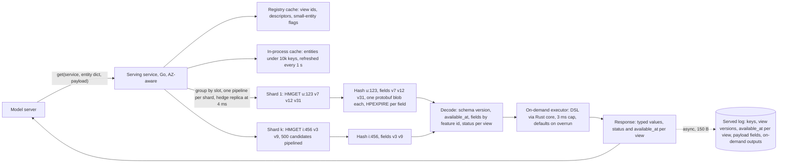
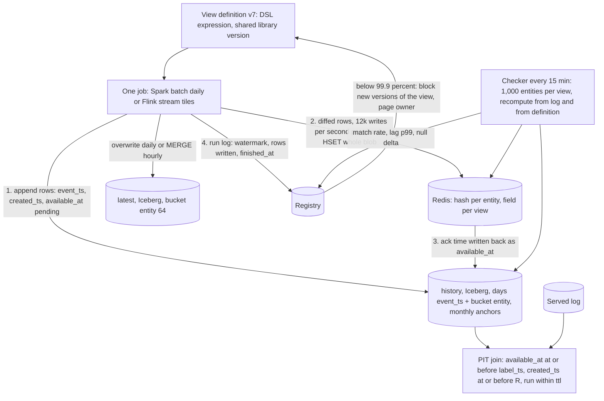

# Area B: serving and consistency — lead review

Scope: online store, offline store, training-serving consistency, on-demand features, entity model. Inputs: engineers 06 to 10. Cloud assumed AWS throughout; the lake table format is assumed Iceberg (07's caveat about Delta stands).

## Engineers

- **06, online store.** Lens: Redis as the serving tier. Contribution: layout C (one hash per entity, one field per view, whole-blob replace, per-field TTL with jitter) plus the per-shard rate-limited diff writer; the read API returns a status and a timestamp per view, never a silent default.
- **07, offline store.** Lens: Iceberg history and latest tables. Contribution: change-log rows with monthly anchors instead of daily snapshots (230 TB, not 820 TB), bitemporal `created_ts <= R` as the reproducibility mechanism instead of pinned snapshots, and the shared `bucket(entity_id, N)` contract that makes joins shuffle-free.
- **08, consistency.** Lens: skew as nine named mechanisms, not review discipline. Contribution: one AST compiled to Spark, Flink and the request-time executor; the point-in-time join on the online-availability timestamp; the 15-minute sampled consistency checker with per-type tolerances and a 99.9 percent match SLO that blocks promotion.
- **09, on-demand.** Lens: request-time features inside the 10 ms budget. Contribution: on-demand views as content-hashed registry objects run in-process in the serving service under a 3 ms cap, and "log the inputs, not the outputs" so training replays the pinned function.
- **10, entities.** Lens: keys are the one thing you cannot version away. Contribution: surrogate int64 keys only, point-in-time alias resolution, and the composite rule (collapse user x item onto a bounded map on the user; materialise a composite only when one side is small).

## Consensus

- One definition, one code path: a feature is not registrable if its serving computation is hand-written anywhere outside the platform executor.
- One writer per feature view, and the online row for a view is replaced whole, never patched field by field.
- A view is one entity, one source, one freshness class, one TTL; the registry rejects mixed-freshness views.
- Every served value carries its own timestamp and status; a missing key returns null with a status, and defaults live model-side.
- The online store is a rebuildable cache, not the source of truth; the offline store plus a Kafka replay reconstructs it.
- Training data comes from the feature log written by the same materialiser that wrote online, never from the raw source.
- Point-in-time joins must reflect what serving could actually have returned, including materialisation delay and TTL expiry.
- Every request is logged with the entity keys as resolved, the view versions and the request-time inputs, from day one, for every model.
- Skew is measured continuously as a metric per view, with an SLO that gates promotion.
- Entities are registered objects with a surrogate key; external identifiers are aliases, resolved as of the label time in training.

## Disagreements and resolutions

### 1. Online key layout

- 06: one Redis HASH per entity (`u:<id>`, `i:<id>`), field = view id, value = protobuf view blob, listpack-encoded, `HPEXPIRE` per field; 1 HMGET returns exactly the views asked for. Rejected one key per (view, entity) with hash tags (layout B, 240 GB of key overhead) and one blob per entity (layout D, 10x read amplification, 30 writers contending).
- 10: one DynamoDB item per (view, entity) under partition key `entity_type#hash(id)`, sort key `view_name#version`; all views of a key in one partition, one query per entity.
- 08 and 09: "one multi-get per entity", layout unspecified.

**Resolution:** layout C from 06. 10's partition layout is the same logical shape (all views of an entity co-located, each view written atomically by its owner) on the wrong store. Concretely: key `<entity_prefix>:<int64 id>`, field = immutable view id, value = protobuf blob with a 4 B schema version and 8 B `available_at` header; `hash-max-listpack-entries 64`, `hash-max-listpack-value 4096`; registry caps online views per entity type at 64 and blob size at 4 KB. Composites and small-cardinality entities follow the rules in 7 below.

### 2. The store and the fallback trigger

- 06: Redis cluster (Valkey 8 or Redis 7.4 for field TTLs), 24 shards, one replica, no AOF, RDB on replicas only, ~615 GB data, 1.6 TB provisioned, ~$18k/month; ScyllaDB as fallback above ~5 TB. DynamoDB rejected on p99 (5 to 10 ms), the 100-key `BatchGetItem` cap, and bulk-load throttling.
- 07 and 10: DynamoDB as the main store with a Redis tier for fraud views only (10: ~4 TB, ~$48k/month for the two).
- 08: Redis, 450 GB. 09: Redis, 3.5 TB with two replicas, 35 nodes, ~$25k.
- The sizes disagree by 8x because the inputs disagree: 06 counts ~2,500 online features at ~6 B encoded; 09 counts 1,500 user features at 8 B raw plus 30 percent; 10 counts 40 views x 300 B with DynamoDB item overhead. Two stores for one entity (10's split) means two writers, two TTL semantics and two consistency checks for the same view.

**Resolution:** one online store, Redis or Valkey in cluster mode as 06 specified, all online views including sessions. Size: 06's number, ~615 GB data, 1.25 TB with one replica, provision 1.6 TB, ~$18k/month. Enforcement: the registry keeps an online-bytes budget per entity type (user 6 KB, item 4 KB, device 1 KB) and refuses `online=true` on a view that would exceed it; half of the 5,000 features stay offline-only. Fallback trigger: when provisioned RAM would exceed 5 TB or the monthly Redis bill exceeds $50k, batch-only views not read by a p99-under-10-ms model move to a ScyllaDB Cloud tier behind the same serving API; nothing else changes. DynamoDB is not used for features.

### 3. The point-in-time timestamp and where it is stamped

- 07: bitemporal rows `(event_ts, created_ts)`; join takes max `(event_ts, created_ts)` with `event_ts <= t` and `created_ts <= R`. Reproducible, but training sees a value at its event time, before serving could have.
- 08: every row carries `materialised_at`, stamped when the online write is acknowledged and written back to the offline row; join uses `materialised_at <= t` and `event_ts >= t - ttl`; a failed online write leaves it null and invisible. Honest about delay, but a brand-new feature gets zero training history, which kills 07's F5 (backfill a view over a year in under an hour) as a product.
- 09: for on-demand inputs the training truth is the value as fetched at serving time, not any join.
- 10: join on the entity key as of the label time, resolved through the alias SCD.

**Resolution:** three timestamps on every offline history row: `event_ts` (when the value became true), `available_at` (when serving could first return it: the online write ack for online views, the offline commit for offline-only views; null if the online write failed), `created_ts` (when the row was written offline, monotonic, never historical). The join for label `(e, t)` with run time `R`: rows with `available_at <= t`, `created_ts <= R`, and a successful materialisation run of that view recorded in the registry run log inside `[t - ttl, t]` (this mirrors online TTL expiry without needing an offline row per TTL refresh); pick max `(available_at, created_ts)`. Backfills come in two declared kinds: `correction` gets `available_at = now` (08's rule: the old value was what serving had); `bootstrap` for a view with no prior online history gets `available_at = event_ts + declared_lag` where `declared_lag` is the view's freshness SLO (2 h batch, 5 s stream), and the row is flagged `is_backfill`, the training-set manifest records it, and the view's first 30 days online run the consistency check at the fraud tolerance. Anchors (07) are copies of `latest` with their original timestamps, so they bound the scan without changing values.

### 4. Snapshot anchors and lookback bounds

- 07: change-only rows, monthly anchor row per entity (30 TB), lookback `max(31 days, ttl)`; without anchors one stale entity forces a 3-year scan.
- 08: lookback is the TTL, `event_ts >= label_ts - ttl`, because Redis expiry deletes what the log still has.
- 06: batch TTL is 3 x interval. With diff-based writes that means an unchanged field expires after 3 days, because only changed rows get their `HPEXPIRE` refreshed; 06's weekly full rewrite is described as a diff-bug guard, not as the TTL refresh it actually is.

**Resolution:** keep 07's monthly anchors and a 31-day scan window; the TTL condition is applied by the run-log rule in 3, not by scanning further back. Batch views: TTL = 2 x the full-rewrite period = 14 days, daily diff write of changed rows, weekly full rewrite that refreshes every field's TTL and guards the diff; a stopped pipeline surfaces in under a day through `now - watermark > interval`, and callers wanting a tighter rule use the per-view `available_at` in the response. Streaming views: TTL = window length, default 24 h. Anchor cost stays 30 TB; a training set never scans more than 31 days of history per label day plus the anchor partition.

### 5. Transformation language

- 08: a restricted SQL subset (projection, filter, case, arithmetic, string and date functions, windowed aggregates, one sketch) compiled from one typed AST to Spark, Flink and a request-time executor with a Rust core; every function has one implementation in a shared library; arbitrary Python is an escape hatch with a declared skew tolerance.
- 09: a restricted Python subset (no I/O, allowlisted imports, p99 under 200 us) run by an embedded interpreter inside the Go serving service, with a sidecar for heavy transforms; keeps the 200 scientists in their language.
- 10: "shared library" without a language.

**Resolution:** 08's SQL-subset expression language and shared function library for batch, stream and on-demand alike; on-demand views in year one are expressions over declared request fields and stored features, using library functions (`haversine`, `seconds_between`, `safe_div`, map lookup) that the platform adds on request. The Go serving service executes them through the Rust core, so there is no Python interpreter in the hot path and no second semantics to fixture-test. 09's Python path survives only as the `heavy` sidecar: content-hashed, no I/O, pinned interpreter version replayed by the same Python in Spark, capped at 3 per model and 2 ms, with a declared skew tolerance. Reason: 8 people cannot own a compiler and an embedded Python subset; the DSL is the one that runs identically in three engines.

### 6. Where on-demand transforms execute and their budget

- 09: in-process in the serving service, 1 ms per view, 3 ms per request, defaults on overrun, sidecar for heavy views, 200 us static benchmark gate; model-server preprocessing rejected as "the skew machine".
- 08: request-time executor in the serving API, budget unstated.
- 06: fraud read path measured at 4.1 ms p99, leaving ~6 ms for everything else.
- 10: pair features computed in the feature server from the collapsed map.
- Ranking p99 targets range from 15 ms (06, 200 candidates) to 50 ms (09, 500 candidates); 08 says 25 ms at 300, 10 says 30 ms at 500.

**Resolution:** in-process in the serving service, 09's budget: 3 ms per request, 1 ms per view, declared defaults plus a paged overrun counter (page at 0.1 percent of requests). Fraud end-to-end p99 target stays 10 ms with ~2 ms headroom (06's 4.1 ms fetch + 3 ms on-demand + 0.5 ms assembly). Ranking: 25 ms p99 at 500 candidates; on-demand views on ranking must be vectorised over the candidate array and limited to one per model in v1. Small-cardinality entities (under 10k keys) are served from the in-process cache refreshed every second, which removes ~60k reads/s from Redis.

### 7. Composite entities

- 10: register composites of base entities in fixed key order; collapse user x item onto a bounded map on `user` (last 200 items, ~40 KB per active user, ~400 GB) and compute the pair feature at request time; materialise a true composite only when one side is small (user x category, 500M keys, 50 GB).
- 06: hashes are keyed by entity, no composite story; 500M composite keys would cost ~40 GB of Redis key overhead alone.
- 07: same bucket transform on every entity type, which a two-id key does not fit without a rule for which side buckets.

**Resolution:** 10's policy, tightened for layout C. No composite keys online in v1. Both composite shapes collapse onto the large-side base entity as one view field holding a bounded map blob: user x item is `recent_item_interactions` (top 200, 90-day TTL, capped at 40 KB and counted in the user's 6 KB budget as an explicit exception approved per view); user x category is a 50-entry map blob (~1.5 KB) on the user hash, TTL 30 days. The pair feature is a map-lookup expression in the DSL, so training runs the identical lookup against the offline copy of the map. Offline, composite views are still real Iceberg tables keyed by both ids for analysis, bucketed on the large side. The registry refuses a composite whose small side exceeds 1,000 or whose top-k exceeds 200 without platform approval.

### 8. Reproducibility: manifests versus snapshot pins

- 07: no per-training-set snapshot pins (15k pins a month makes expiry a no-op and triples storage within a quarter); reproducibility is `created_ts <= R` plus a manifest (label snapshot id, view snapshot and schema ids, feature versions, `R`, join config); outputs retained 180 days; regulated models tag snapshots for 2 years.
- 08: registry version plus as-of timestamp, output written with the registry version pinned; library version is part of the view version.
- 09: on-demand functions pinned by content hash, replayed from the request log; editing in place is forbidden.

**Resolution:** 07's mechanism with 09's hash added: the manifest carries `R`, registry version, every view version, every on-demand view content hash, the shared-library version, and the served-log range used. Iceberg snapshots expire after 7 days; regulated models (fraud, credit) tag monthly for 2 years. The training-set output is itself retained 180 days, because not recomputing is the cheapest reproduction.

### 9. Training truth for stored inputs and the served log

- 08: log keys, view versions and `served_at` only (1 TB/day), reconstruct values from the offline log, verify with a 1 percent full-value sample; full logging is 12 TB/day.
- 09: log the as-fetched values with their timestamps (1.3 TB/day) and make them the training truth, because reconstruction can disagree with what Redis held (late load, expiry).
- 10: session views train only from the inference log; the joiner refuses to snapshot a short-lifetime entity.

**Resolution:** log per request: request id, resolved entity keys, view ids and versions, the `available_at` and status of every view as fetched, declared payload fields, on-demand view hashes and outputs, `served_at`, server receive time. About 150 B per record, ~650 GB/day at 50k/s average. With the per-view `available_at` logged, reconstruction from history is exact by construction (the row with that `available_at`, or null when the logged status was `VIEW_MISSING`), so 09's objection is closed without logging values. Full values are logged for a 1 percent uniform sample, for every view on a short-lifetime entity (session), and for any model in its first 30 days. Retention: 100 percent for 90 days, then 10 percent stratified plus 100 percent of requests that later receive a fraud label, 3 years.

### 10. Skew SLO and freshness numbers

- 08: 99.9 percent match per view per day, 1e-9 relative for shared-library floats, 1e-6 for native engine floats; asks whether fraud needs 99.99.
- Stream freshness: 06 p99 under 5 s, 09 under 30 s, 10 under 60 s.
- Batch freshness: 06 within 60 min of job finish, 08 within 2 h of source landing, 10 24 h.

**Resolution:** 99.9 percent default; views read by fraud models are restricted to shared-library functions and held at 99.99 percent with exact equality. Stream freshness p99 under 5 s event to online (fraud needs it and the Flink path delivers it); batch visible online within 2 h of the source partition landing. These two numbers are also the default `declared_lag` values used in resolution 3.

### 11. Conflicting estimates

| Quantity | 06 | 07 | 08 | 09 | 10 | Chosen | Why |
|---|---|---|---|---|---|---|---|
| Online data, primary copy | 615 GB | n/a | 225 GB | 1.7 TB | 2 TB | 615 GB, provision 1.6 TB | only 06 encodes values and counts only `online=true` features; 08 undercounts items, 09 and 10 use raw bytes |
| Online store cost per month | $18k | n/a | $20k | $25k | $48k | $18k | follows the size choice; $48k assumed two stores |
| Offline history, 3 years | 200 TB | 230 TB | 175 TB | 220 TB | 110 TB | 230 TB | 07 is the only worked estimate that includes anchors, outputs and compaction overhead |
| Offline storage cost per month | $4k | $2.2k | $12k | $10k | $2.5k | $2.2k tiered, $5.3k all-Standard | 07 priced the tiering; 08 and 09 priced raw event retention, which is Platform's line |
| Training set generation per month | $5k | $10k | $20k | ~$15k | n/a | $10k | 07's $5 typical and $200 p95 at 1,000 sets; 08 assumed 40 vCPU-h per set with no anchors |
| Fraud fetch p99 | 10 ms, fetch 4.1 | n/a | 10 ms | 10 ms incl. 3 ms on-demand | 10 ms | 10 ms end to end, fetch 4.1 + on-demand 3 + assembly 0.5 | the brief's number; the split is 06's measurement plus 09's cap |
| Ranking fetch p99 | 15 ms at 200 | n/a | 25 ms at 300 | 50 ms at 500 | 30 ms at 500 | 25 ms at 500 | 06's 8.3 ms at 200 scales to ~15 ms at 500 with one vectorised on-demand view; 25 leaves headroom |
| Served log volume | n/a | n/a | 1 TB/day | 1.3 TB/day | 20 PB/3 yr raw | ~650 GB/day | 150 B per record at 50k/s average; values only for the 1 percent sample |
| Area cost per month | | | | | | ~$35k: Redis 18, offline storage 2 to 5, training sets 10, serving pods 3, checker under 1 | stores and training-set generation only; Spark, Flink, Kafka and raw retention are Platform's total |

## Open questions, answered

**06.1 Direct Redis SDK for fraud to save ~1 ms.** No. The serving service is where status semantics, hedged reads, the small-entity cache and the served log live; a direct client loses all four and puts credentials in 30 teams. The 4.1 ms p99 fetch leaves enough headroom.

**06.2 $18k/month RAM as online features grow 20 percent a year.** Acceptable for 3 years (about $31k at year three) under the per-entity byte budget from resolution 2. The ScyllaDB tier is the release valve, triggered at 5 TB or $50k, not before.

**06.3 Second region for online reads.** Single region, three AZs, cold standby rebuilt from the offline store and Kafka in under 4 h, tested quarterly. A second live region doubles the bill for an availability gain the 99.99 percent target does not require. Platform owns the DR drill.

**06.4 Sub-second streaming updates for hot entities.** Keep the 1 s debounce. The only sub-second signal anyone named is "seconds since last event", which is an on-demand transform over a streamed `last_event_ts`, so it is exact regardless of debounce.

**06.5 Who owns the weekly full rewrite.** Platform, as part of the materialiser, because it is also the TTL refresh (resolution 4); a view owner cannot opt out of it.

**07.1 Iceberg or Delta.** Design assumes Iceberg. If the lake is Delta, feature tables are created as Iceberg in the same catalog and the raw sources stay Delta; the alternative is a full rewrite every time a bucket count grows. Pointer: Platform confirms the lake format.

**07.2 Catalog.** REST catalog (Lakekeeper or Polaris) on the metadata Postgres, for multi-table commits that remove the `history`/`latest` skew and for ad-hoc engines. Pointer: Platform owns the final catalog choice.

**07.3 Regulator-grade regeneration beyond 2 years.** Design for 2 years of tagged snapshots on regulated models and Glacier IR for the cold tier; extending to 3 years is a retention config, not a design change. Pointer: Adoption and evolution to confirm with legal.

**07.4 Downsample streaming views after 1 year.** Yes, to one row per entity per day, except views read by fraud models, which keep minute-level history for 3 years (~3x that view's cold tier, well under $1k/month).

**08.1 Escape hatch policy.** Resolution 5: the DSL plus shared library is the path; Python exists only as the heavy sidecar with a content hash, a cap of 3 per model, and a declared skew tolerance. The platform commits to a one-week SLA on library function requests so the hatch stays rare.

**08.2 99.9 versus 99.99 for fraud.** 99.99 for fraud-read views with shared-library-only functions (resolution 10). Fraud should also stratify the checker sample by merchant category so a segment-concentrated skew shows up.

**08.3 Who owns a skew breach.** The checker emits a second signal: it recomputes the view offline from the definition and compares to the offline log. Log matches recompute but not online is a platform materialiser bug; log does not match recompute is a definition or source bug owned by the view owner.

**08.4 Served-log reconstruction versus full logging.** Resolution 9: keys, versions and per-view timestamps for everyone, full values for the 1 percent sample, short-lifetime entities and new models for 30 days. A model can opt into full logging; the 5 highest-value models at 12 TB/day are a budget decision for the chair.

**08.5 Training on served logs as the retraining default.** Yes for models with 90 days of serving history, with the point-in-time join run alongside on a 5 percent sample and diffed; a new feature added after the log began trains through the join with `bootstrap` backfill semantics (resolution 3).

**09.1 Python subset versus DSL.** DSL (resolution 5). Scientists get a Python SDK that builds the expression, not a Python runtime in the serving path.

**09.2 3 ms cap.** Yes for v1. A fraud model needing more buys the sidecar tier, which has its own 2 ms budget and counts against the same 10 ms.

**09.3 Logged as-fetched versus as-of join as training truth.** Logged, but reconstructed exactly from the logged `available_at` rather than stored (resolution 9). The as-of join stays alive as the cross-check and as the only path for new features.

**09.4 Request log retention.** 90 days full, then 10 percent stratified plus 100 percent of fraud-labelled requests, for 3 years. Full retention at ~3x cost is not justified until a non-fraud model shows a replay-coverage gap.

**09.5 On-demand over candidate arrays in v1.** Yes, one vectorised on-demand view per ranking model, because 10's collapsed composite map depends on it; more than one is v2.

**10.1 Identity service emits valid_from/valid_to.** Assume no and reconstruct the SCD from its change log in the alias materialiser; if it does, the materialiser is a pass-through. Pointer: Definitions and computation, which owns the alias view definition.

**10.2 Is 200 items enough for the collapsed map.** Yes for v1 with a 90-day window. A model that needs pair features over a year registers an offline-only composite view for training and a stream view for the online delta; that request goes through platform approval.

**10.3 Session training from the inference log.** Yes; the log is complete by construction because it is written by the same request that served. Retention is resolution 9, owned by platform; 20 PB is the uncompressed 3-year figure at 100 percent, the actual plan is under 200 TB.

**10.4 Payer and payee.** Join-key map in the feature service. A second registered entity aliasing `user` would double every user view's online bytes for lineage that the service's declared map already provides.

## Non-negotiables for this area

1. One writer per feature view; the online view blob is replaced whole, never patched.
2. The read API returns a status and `available_at` per view; the SDK never substitutes a default.
3. The online store is rebuildable from the offline store plus Kafka in under 4 h, tested quarterly.
4. Every offline history row carries `event_ts`, `available_at` and `created_ts`; rows are append-only, corrections are new rows.
5. Every point-in-time join uses `available_at` and `created_ts <= R`; a value serving never had is invisible to training, and bootstrap backfills are flagged in the manifest.
6. Iceberg tables whose schema is derived from the registry, with one `bucket(entity_id, N)` contract per entity type across `history` and `latest`.
7. No feature is servable without a registry definition that compiles to Spark, Flink and the request-time executor and passes the publish-time fixture diff.
8. Every on-demand transform is a registered, content-hashed definition executed by the platform in serving and training; no feature logic in model preprocessing.
9. The served log captures inputs (keys, view versions, per-view timestamps, payload fields, on-demand hashes) for every model from day one.
10. On-demand execution has a hard per-request cap with declared defaults and a paged overrun rate.
11. The continuous consistency check publishes a match rate per view, and a breach blocks new versions of that view.
12. Entities are registered objects with a surrogate key, an id owner and a lifetime class; alias resolution is point-in-time in training and logged at inference.
13. Composite views on two large entities are never materialised as rows without a platform-approved bound.

## Recommended design for this area

The serving tier is one Redis or Valkey cluster in cluster mode, 24 shards, one replica each, no AOF, RDB on replicas only, provisioned at 1.6 TB for ~615 GB of data. Every entity is one hash keyed by its surrogate int64 id; every online view is one field holding a protobuf blob (feature id = field number, proto3 optional, 4 B schema version and 8 B `available_at` header). A fraud request is one pipelined HMGET per touched shard; a ranking request is 500 HMGETs pipelined per shard plus one user hash whose `recent_item_interactions` map supplies pair features through a DSL map lookup. Small-cardinality entities live in the serving service's memory. The service is Go, AZ-aware, hedges to the replica at 4 ms, and returns typed values with a status and `available_at` per view. On-demand views run in-process through the Rust core of the shared function library under a 3 ms cap. Each request writes a ~150 B served-log record asynchronously.

Materialisation is one job per view with two sinks. Spark or Flink appends rows to the view's Iceberg `history` table (`days(event_ts)`, `bucket(entity_id, N)`, sorted, zstd), overwrites or merges `latest`, then pushes changed rows to Redis through a per-shard token bucket at 12k writes/s per shard, and writes the online ack time back as `available_at`. The run log in the registry records watermark, rows written and finish time. Batch views are diffed daily and fully rewritten weekly, which is also their TTL refresh (TTL 14 days). Stream views write tiles per fixed bucket, debounced to one write per entity per second, with TTL equal to the window.

Training-set generation prunes each view's history to a 31-day window per label day, uses the monthly anchor to bound the scan, runs a storage-partitioned join on the shared bucket transform, and selects the row with max `(available_at, created_ts)` subject to `available_at <= label_ts`, `created_ts <= R` and a successful run of the view within `[label_ts - ttl, label_ts]`. Models with 90 days of serving history retrain from the served log, with stored values reconstructed exactly from the logged per-view `available_at`. The manifest records `R`, registry and library versions, view versions and on-demand hashes; Iceberg snapshots expire after 7 days except 2-year tags on regulated models.

The checker samples 1,000 entities per view every 15 minutes (uniform over the key space plus a stratum of the last hour's active keys), recomputes from the log, fetches online, diffs by type tolerance, and writes match rate, lag p99 and null delta to the registry. Below SLO, new versions of the view are blocked and the owner is paged; a second recompute-from-definition signal separates materialiser bugs from definition bugs.

| Choice | Value |
|---|---|
| Online store and layout | Redis 7.4 or Valkey 8 cluster, 24 shards, 1 replica, no AOF; one hash per entity, field per view id, 64 views per entity max |
| Value encoding | protobuf per view version, feature id = field number, proto3 optional, 4 B schema version + 8 B `available_at` header, 4 KB max |
| TTL policy | per-field `HPEXPIRE` with 10 percent jitter; batch views 14 days with weekly full rewrite; stream views = window, default 24 h; sessions 1 h |
| Offline table format and layout | Iceberg per view: `history` on `days(event_ts)` + `bucket(entity_id, N)` sorted by entity and time, monthly anchors, `latest` on `bucket(entity_id, 64)`; zstd, 384 MB targets |
| Join timestamp | `available_at` (online ack, or offline commit for offline-only views) with `created_ts <= R`; bootstrap backfills at `event_ts + declared_lag`, corrections at now |
| Lookback bound | 31 days of history per label day via monthly anchors; TTL applied through the registry run log |
| Transformation language and executor | restricted SQL-subset DSL, one typed AST, shared function library with Rust core; Spark, Flink and Go serving service via bindings |
| On-demand placement and budget | in-process in the serving service, 1 ms per view, 3 ms per request, 200 us benchmark gate; heavy Python sidecar capped at 3 per model and 2 ms |
| Entity key rule | surrogate int64 minted by the owning system, never reused; externals resolved through a point-in-time alias view, resolved id logged at inference |
| Composite policy | no composite keys online in v1; collapse onto the large-side entity as a bounded map blob (top 200 or small side under 1,000); offline composite tables for analysis |
| Consistency check cadence and tolerances | every 15 min, 1,000 entities per view; exact for ints, strings, bools, timestamps; 1e-9 shared-library floats, 1e-6 native floats; 99.9 percent per view per day, 99.99 percent for fraud views; publish-time fixture diff must be empty |
| Reproducibility mechanism | bitemporal `created_ts <= R` plus manifest (R, registry, library and view versions, on-demand hashes, served-log range); snapshots expire at 7 days; 2-year tags for regulated models; outputs kept 180 days |

## What the chair needs to decide

1. **Ownership of the DSL and shared function library.** Resolution 5 assumes Definitions and computation builds the compiler and Rust library and that the serving service consumes it through bindings; if that area chooses restricted Python instead, resolutions 5, 6 and 9 change and the serving service needs an embedded interpreter.
2. **Lake table format and catalog.** Iceberg with a REST catalog is assumed for partition evolution and multi-table commits; a Delta lake or Glue-only catalog is Platform's call and forces bucket-count rewrites and the `history`/`latest` skew back in.
3. **Served-log budget.** The area chose ~650 GB/day at keys plus timestamps with a 1 percent full-value sample; whether the five highest-value models justify 12 TB/day of full values, and who pays for 3-year retention, is a cost decision across Platform and Adoption.
4. **Fraud freshness SLO at 5 s p99 versus 30 to 60 s.** Serving designs to 5 s; if Definitions and computation cannot commit the Flink path to it for the 50 streaming views, the `declared_lag` used for bootstrap backfills and the fraud consistency tolerance both loosen.
5. **The ScyllaDB fallback tier.** Whether Platform will operate a second online store at all when the 5 TB or $50k trigger fires, or whether the answer is a harder per-entity byte cap enforced on teams by Adoption and evolution.
