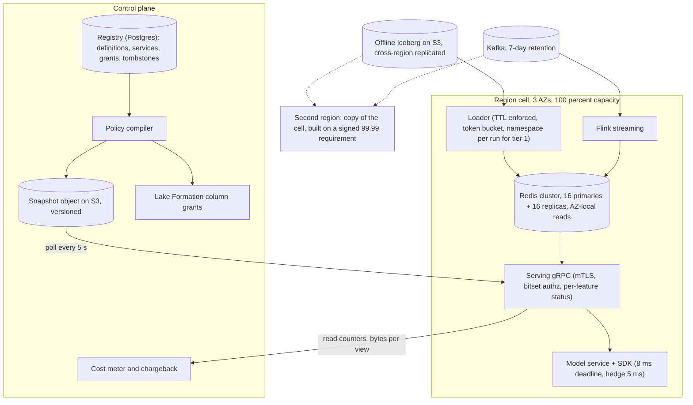

# Area C: platform — lead review

Scope: cost, availability, governance, operations, API and SDK. Five write-ups (DE 11 to 15) read in full. Where they disagree I pick one answer and give the number that decided it.

## Engineers

- DE 11, storage and cost: priced every byte; showed Redis is 2,000x the price of S3 per GB-month and that the naive design puts every byte in Redis. Contribution: the seven levers that take $85k to $50k a month, and chargeback from meters.
- DE 12, availability: designed for the fraud scorer being synchronous. Contribution: the per-feature `on_missing` policy, per-feature status on the wire, and versioned bulk loads behind a pointer flip.
- DE 13, governance: seven enforcement points owned by four systems. Contribution: sensitivity and purpose inheritance in CI, grants split by plane, in-process bitset authz, and the tombstone table that makes erasure survive a backfill.
- DE 14, operations: a platform team of 8 cannot page itself for 5,000 features. Contribution: SLOs measured in the SDK, alert routing on the registry's `owner` and `tier` labels, and the "correlated failure is the platform's, isolated failure is the owner's" rule.
- DE 15, API and SDK: every prior in-house store failed on the developer surface. Contribution: the immutable versioned `FeatureService` as the only thing a model reads, and a protobuf wire protocol versioned independently of the SDK.

## Consensus

- One registry definition drives batch, streaming, serving and the point-in-time join; the definition carries owner, TTL and freshness.
- Serving must not depend on the registry, offline store or Spark at request time; pods serve from an in-memory snapshot and keep serving if the control plane is down.
- A missing or stale value is reported with a per-feature status; the API returns 200 with partial results, and 503 only when it cannot reach the store at all.
- The fraud fetch has a hard client deadline inside 10 ms and the fraud team has agreed, in writing, what happens at the deadline.
- Every feature view has an owner team, and alerts, dashboards and cost lines are keyed on that owner.
- The online store is a cache of the offline store: every online row has a TTL, and the store is rebuildable from S3 plus Kafka replay.
- Batch loads must not push read p99 above 10 ms; the loader is rate limited against live reads.
- Authorisation on the online path is in-process, never a network hop; identity is the service, not a person.
- Erasure needs a tombstone that every write path anti-joins, because Kafka replay or backfill otherwise resurrects the value.
- Training-set generation is a logged, costed, deterministic job keyed on a versioned feature service.

## Disagreements and resolutions

### Missing-value contract: registry defaults versus None plus status

DE 12 proposes a per-feature `on_missing` policy at registration (`default(v)`, `last_known(max_age)`, `null`, `required`) and the API applies it, returning `0` with status DEFAULT for a velocity count. DE 14 and DE 11 assume the same: the SDK or registry holds a default per feature and fills it on timeout or after a TTL eviction. DE 15 says the store never invents a value: `None` plus status (PRESENT, MISSING, STALE, ERROR), identical nullable Arrow types offline and online, and defaults belong to the model. DE 12's own pitfall list concedes the problem: a DEFAULT of 0 for "transactions in last 5 min" is indistinguishable from a real 0 unless the model reads the status, and the offline join returns null for the same row, which is exactly the train/serve skew the store exists to remove.

**Resolution:** the wire carries `None` plus a status per feature (OK, STALE, MISSING, DISABLED, ERROR) plus `as_of` per view, and the offline join returns null in the same cases. Substitution happens in one place only: the `FeatureService` (model-owned, versioned with the model) may declare `default` and `required` per feature; the SDK applies defaults when `fill_defaults=True` and increments `features_defaulted_total`, and the server sets `degraded=true` when any `required` feature is not OK. This keeps DE 12's `required` semantics and DE 14's fraud fallback, but the value that gets filled is in the model's own versioned definition, so training can fill the same value from the same object.

| Status | Value on the wire | Offline join returns | When |
|---|---|---|---|
| OK | value | value | row present, younger than `freshness_sla` |
| STALE | value | value | older than `freshness_sla`, younger than 3x `max_staleness` |
| MISSING | None | null | no row, row past 3x `max_staleness` (DE 14's number), or shard miss |
| DISABLED | None | null | kill switch on the feature |
| ERROR | None | not applicable | transform threw in the serving pod |

The `default` in the feature service applies to MISSING, DISABLED and ERROR only, never to STALE, so a stale count is still the real count.

### Where SLOs are measured: SDK versus server

DE 14: measure in the SDK, because the fraud team quotes the client-side timeout and server histograms hide network and serialisation. DE 12 and DE 13 define availability at the API, with DE 12 counting degraded responses as successes. DE 15 puts the p99 at `get_online_features` return, which is the SDK number.

| Engineer | Availability target | Measured at | Counts degraded as success |
|---|---|---|---|
| DE 12 | 99.99 per region, 99.995 global | API | yes |
| DE 13 | 99.99 | gateway | not stated |
| DE 14 | 99.95 fraud, 99.9 other | SDK | yes, within deadline |
| DE 15 | not stated; p99 10 ms at SDK return | SDK | not stated |

**Resolution:** the SLO is SDK-side, per feature service: a call succeeds if it returns a usable response (any status, `degraded` allowed) within the client deadline. Server-side histograms exist and the gap between them is the network number, which is the first thing runbook 1 checks. Java and Go clients that use raw gRPC stubs are measured server-side until they carry the thin SDK (see open questions); the first non-Python fraud-tier caller is the trigger to build that SDK. Targets: 99.95 percent monthly for the fraud tier and 99.9 percent for others, p99 under 10 ms and p99.9 under 25 ms for one-entity fraud calls, p99 under 25 ms for 500-entity ranking calls.

### Region topology and the cost model

DE 12 wants two regions at 100 percent capacity each, 90 Redis nodes per region, mirrored Kafka, each region building its own store; 99.99 percent per region, 99.995 percent global. DE 11 prices one region and lands at $50k a month after levers, notes a second region doubles the Redis bill, and asks whether it is needed. DE 14 sets 99.95 percent, says a second region doubles cost and on-call load for a team of 8, and asks the fraud team to justify 99.99. The five cost totals disagree by 6x: DE 15 $40k, DE 11 $50k after levers, DE 14 $70k, DE 11 naive $85k, DE 12 $170k, DE 13 $150k to $250k. DE 12's $100k of training-set Spark assumes 2 h on 50 nodes per set; DE 11's 200 core-hours mean is 1/5 of that and matches DE 14's 20 node-hour median. DE 13's $150k assumes DynamoDB with DAX plus $80k to $150k of Spark.

| Engineer | Monthly total | Regions | Online store | Training-set Spark line | Why it differs |
|---|---|---|---|---|---|
| DE 15 | $40k | 1 | DynamoDB $8k | $25k all Spark | no streaming line, no cross-AZ line |
| DE 11 | $50k after levers, $85k naive | 1 | Redis $17k | $7k | line-by-line, TTL and reader levers applied |
| DE 14 | $70k | 1 | Redis $15k | $12k | $10k misc, $4k observability |
| DE 12 | $170k | 2 | Redis $27k | $100k | 2 h on 50 nodes per set, 5x DE 11's mean |
| DE 13 | $150k to $250k | 1 | DynamoDB and DAX $40k | $80k to $150k | DAX plus unpriced Spark range |

**Resolution:** one region, three AZs, one replica per shard with primary and replica in different AZs, AZ-local reads, from day one. Adopt DE 11's cost model as the base because it is the only one with line-by-line arithmetic, and set a ceiling of $60k a month with $50k as the expected post-lever figure. Adopt DE 12's cell shape (replicate inputs, not state; no cross-region read; the region builds its own store from S3 snapshots plus Kafka replay) so a second region is a copy, not a redesign, and drill the 45-minute region rebuild quarterly. The second region costs about $25k a month (Redis 17k plus a second Flink and loader 7k plus mirroring) and buys the step from 99.95 to 99.99; it is built when the fraud team signs the 99.99 requirement and funds it. Online store engine: Redis for anything a fraud or ranking service reads (DE 11's numbers: DynamoDB p99 5 to 10 ms in-region leaves no margin, and full nightly pushes cost $94k a month on-demand); DynamoDB permitted for long-tail views with change-only writes that no tier 1 service reads.

### Registry snapshot cadence and what serving depends on

DE 12 refreshes pins, policies and kill switches every 5 s. DE 13 refreshes authz bitsets every 30 s, keeps serving stale policy and pages at 5 minutes, and requires grant or revoke visibility in 60 s. DE 15 refreshes the SDK's registry snapshot every 60 s and sends a `registry_version` token per call. DE 14 requires that the control plane being down for 24 h changes nothing served.

**Resolution:** the registry publishes one compiled snapshot object (pins, kill switches, policy bitsets, feature service definitions, view metadata, about 20 MB) to object storage on every change, versioned; serving pods poll its version every 5 s and load it on change, never query Postgres. 200 pods polling every 5 s is 40 requests a second. Kill switches, pins and revokes all propagate in 5 s, which satisfies DE 13's 60 s requirement with margin. If the snapshot cannot be fetched the pod keeps serving from memory indefinitely and the `policy_age_seconds` metric pages the platform at 5 minutes. The SDK refreshes every 60 s and sends its `registry_version`; the server always uses its own snapshot and returns its version, and the SDK refreshes early on mismatch. A principal absent from the snapshot is denied.

### Fail-open versus fail-closed: unknown principals, and fraud

DE 13: an unknown principal or an unauthorised view is a 403 for the whole request, no partial response; the registry treats untagged features as SENSITIVE_PII. DE 14: fraud degrades to defaults on timeout, agreed with the fraud team. DE 12: fail open or closed is set per feature at registration by the feature owner, and asks whether the model registry should own it instead because it holds the loss function.

**Resolution:** two separate axes with two separate answers. Authorisation is fail-closed without exception: unknown principal, missing grant, or purpose conflict is a 403 for the whole request, and this never depends on the caller. Data availability is fail-open at the store: 200 with statuses. The fail-closed decision for a missing value belongs to the model, expressed as `required` on the feature in its `FeatureService`, because the feature owner does not know the loss function of the twelve models reading the view. Fraud's default is open with defaults, agreed in writing per DE 14, with `required` set on KYC tier and similar entity attributes so `degraded=true` fails that score closed. `features_defaulted_total` above 1 percent for a model for a day pages the model owner.

### Chargeback mechanics

DE 11: producer pays storage and compute, readers pay reads by share, and a view with $0 of reads for 60 days loses its online flag; asks who pays for a view read by 12 models. DE 14 keys everything on `owner` but says nothing about money. DE 13 has no cost mechanism.

**Resolution:** readers pay for what their reads keep alive. Online bytes and materialisation compute of a view are split across its readers in proportion to key reads; offline storage and the offline compute of the view go to the producer; training-set compute goes to the requesting team; cross-AZ transfer is metered at the server and added to the reader's bill. The platform subsidises only the registry, monitoring and audit pipeline (about $2.5k a month). This answers "12 models": each pays its share, and a view nobody reads costs its producer only the offline line, which is what makes the 60-day auto-unflag uncontroversial. Every number comes from meters (sampled MEMORY USAGE, Iceberg partition bytes, tagged core-hours, server read counters), not estimates.

### Wire protocol, deadlines and batch caps

DE 15: gRPC and protobuf, 8 ms default client deadline, 2 retries with 2 ms backoff on UNAVAILABLE, hedged read at 6 ms, 500 entity rows per call. DE 12: 8 ms deadline in the sequence, 500-entity ranking. DE 14: 10 ms fraud deadline. DE 11: 300 candidates at p99 25 ms; DE 13: 200 candidates. Two retries plus a hedge inside 8 ms is arithmetically impossible if the first attempt runs to the deadline.

**Resolution:** gRPC with protobuf for the online path, REST for the registry only; protobuf encodes a 200-key response in 0.3 ms against 4 ms for JSON. Fraud tier: 8 ms client deadline propagated in metadata, one hedged read at 5 ms, retry only on an immediate UNAVAILABLE (connection refused, never a timeout), which leaves 2 ms for the model service's own overhead inside the 10 ms end-to-end SLO. Ranking tier: 25 ms deadline, up to 500 entity rows per call, above 500 the SDK raises, server fans out at most 100 keys per store call. Additive-only proto within a major, two majors served concurrently for 6 months, SDK version in metadata.

### Versioned bulk loads versus change-only writes

DE 12 loads each batch view into a new key namespace per run and flips a pointer; rollback is a pointer flip in under a minute, at the cost of 2x memory for batch views, and asks whether to version only the top 20. DE 11's lever 3 writes only changed rows (2.5B to 375M rows a night, write window 4 h to 40 min), which requires upserting into the existing keys and cannot coexist with a fresh namespace per run.

**Resolution:** tier 1 batch views (anything a fraud or real-time ranking service reads, about 20 views) get the versioned namespace with a full write and a pointer flip, previous namespace kept 2 h, not 24 h, which caps the overhead at 2x of the tier 1 batch footprint for 2 h a day. All other batch views use change-only upserts with event-time last-writer-wins and a weekly full push as the drift backstop; rollback for those is a re-push of the previous Iceberg partition, about 20 minutes. Both paths run through one loader with a token bucket at 20 percent of shard write capacity that backs off when read p99 crosses 7 ms, and the loader refuses any write without a TTL.

## Open questions, answered

DE 11, cost:

1. 90-day online TTL for fraud. Keep 90 days as the platform default and let the fraud team declare a longer TTL on their views, paying $150 a month per extra million users. A dormant account waking up returns MISSING on the first request, which the fraud model can treat as a signal by reading the status, and the streaming path refills within 5 s.
2. Second region. Not on day one; the cell is designed so a second region is a copy. Built when the fraud team signs a 99.99 percent requirement and funds about $25k a month.
3. Shared view read by 12 models. Readers pay by share of key reads for online bytes and compute; producer pays offline storage. See chargeback resolution.
4. Weekly resolution past 12 months. Accept as the default and mark the granularity on the view so the training job shows it before running. A model that needs daily point-in-time for 3 years declares it and pays the $6k a month hot-tier line through chargeback. Point-in-time join semantics belong to Definitions and computation.
5. Feature log sampling. 1 percent for all tiers plus full logging for feature services with a `required` feature, which is roughly the fraud services; 1.6 TB a day for fraud at $23 a TB-month is under $1.2k a month for 30 days retained, and it is the only way to replay a disputed decision.

DE 12, availability:

1. Model registry owning fail-open or closed. Yes: `required` lives on the feature in the `FeatureService`, which is the model's versioned object. The feature registry keeps only freshness thresholds.
2. 60 s hard staleness for velocity features. Platform default is 3x the view's `max_staleness`; a 5 s view goes MISSING at 15 s, closer to the spirit of DE 12's number than a flat 60 s. The fraud team may override per view.
3. 2x memory of versioned batch views. Version tier 1 views only, with the previous namespace kept 2 h. See the bulk-load resolution.
4. Global traffic manager dependency. Moot with one region. When a second region exists, the scorer holds both endpoints and fails over client-side after the SDK's circuit breaker trips; the traffic manager only shifts weights for planned drains.
5. Separate Redis cluster for ranking. Not yet. The priority header and per-caller quotas exist from day one; if ranking fan-out pushes fraud p99 above 7 ms twice in a quarter, split at about $8k a month (post-lever sizing, not DE 12's $13k).

DE 13, governance:

1. Models trained before an erasure request. Out of scope for the store; record the position in the DPIA and give legal the lineage query "which models trained on sets containing this entity" so retraining can be triggered by policy. A retraining trigger is an order of magnitude more cost and needs a legal decision, not a platform one.
2. Minute-grain audit for the credit product. Entity-level for every view read by a service with the credit purpose, about 10x audit volume for a subset; at 100 GB a day for the sensitive tier today the credit addition is under $2k a month of S3. Cheap insurance against the regulator question.
3. Declassification approvals. A data-protection group, not the platform team of 8; two approvers, 5 business day target, and the CI check blocks the merge until then. The platform owns the mechanism, not the judgement.
4. 30 s stale policy after revoke. Resolved to 5 s by the snapshot poll; no push channel needed.
5. Purpose enforced against model or service. Against the model's declared purpose, carried in the request as the `FeatureService` (one service per model version), with the calling SPIFFE identity checked for the grant. A host serving several models presents each model's service name; the bitset check is per (principal, service).

DE 14, operations:

1. 99.95 versus 99.99 for fraud. 99.95 percent single-region, SDK-measured, with degraded responses counting as success. 99.99 is available at about $25k a month and a second on-call load; the fraud team decides with the bill in front of them.
2. Tier 1 owners must have on-call. Yes, a condition of tier 1 registration, enforced by requiring `oncall_channel` to resolve to a PagerDuty schedule, not a Slack channel. The platform never absorbs another team's page.
3. Skew tolerance ownership. Platform default of exact match for integers and categoricals and 1e-6 relative for floats; the feature owner may loosen per feature with a reason in the definition. The skew job itself belongs to Serving and consistency.
4. How long to serve stale before nulls. 3x `max_staleness`, then MISSING. Adopted as the platform default.

DE 15, API and SDK:

1. On-demand transforms in the serving pod. Owned by Definitions and computation; the platform constraint is a 2 ms CI budget and a pure-function lint, which DE 15 already has.
2. Ref lists in production. Warn from day one, hard-fail after the 60 existing models have migrated or 6 months, whichever is first; the migration is owned by Adoption and evolution.
3. Java and Go clients. Generated stubs plus a 300-line thin client that handles deadline, hedging, status decoding and SDK-version metadata; no registry caching, since the server resolves the service name. Built when the first non-Python tier 1 caller appears.
4. Who bumps the service version on an upstream schema change. Owned by Adoption and evolution; the platform position is that a view schema change is a new view version and every downstream service owner bumps explicitly, with `fs plan` listing the affected services.

## Non-negotiables for this area

1. A model in production reads through an immutable, versioned `FeatureService`; training and serving take the same object.
2. The wire returns `None` plus a per-feature status and identical nullable types offline and online; the store never fabricates a value.
3. Every feature carries a `required` or default decision in its feature service, and the API sets `degraded` from it; no feature is served without saying what happens when it is absent.
4. Serving has no runtime dependency on the registry, offline store or Spark; a control plane down for 24 h changes nothing served.
5. Every online row has a TTL, and every online view has a live reader in the registry; no reader, no bytes in Redis.
6. Every feature view registers with `owner`, `tier`, `max_staleness` and `oncall_channel`, enforced in CI, and carries a monthly cost line computed from meters.
7. Serving SLOs are measured in the SDK, and the fraud SDK has a hard 8 ms deadline with a fallback agreed with the fraud team in writing.
8. Batch loads land behind a rate-limited loader that refuses writes without a TTL; tier 1 views load into a versioned namespace behind a pointer.
9. Sensitivity and purpose inheritance are computed in CI from lineage, with a fail-closed default of SENSITIVE_PII for anything untagged.
10. A tombstone table that every write path anti-joins, tested in CI with a seeded tombstone and a backfill.
11. Online grants go only to service identities over mTLS, checked in-process from the snapshot, never by a network call.
12. Training-set generation shows its cost before it runs and blocks above the team threshold.
13. The online wire protocol is versioned independently of the SDK, additive within a major, with the SDK version reported in metadata.

## Recommended design for this area

The platform is one region, three AZs, with a control plane that publishes and a data plane that never calls it. The registry in Postgres is the source of truth for definitions, feature services, grants, sensitivity, tombstones and cost attribution. On every change the policy compiler writes one versioned snapshot object of about 20 MB to S3; serving pods poll its version every 5 s and load it into memory. Kill switches, version pins and revokes therefore propagate in 5 s, and if the registry is down for a day nothing served changes. The same compiler writes Lake Formation column grants for the offline plane, so the two access planes are derived from one grant table but enforced by different systems: in-process bitsets keyed on SPIFFE identity for online, column grants for offline, people only on the offline plane or through a 4-hour break-glass principal.

The online store is Redis cluster mode, about 16 primaries and 16 replicas after the cost levers, spread over three AZs with AZ-local reads. Every row has a TTL (90-day default, refreshed on streaming writes) and every online view must have a live reader; the registry unflags a view after 60 days without reads and stops pushing bytes, leaving offline data intact. Tier 1 batch views load into a namespace per run behind a pointer; the rest use change-only upserts. The loader is the only path to Redis for batch data and refuses writes without a TTL.

The request contract is one gRPC call per lookup: a feature service name and version, up to 500 entity rows, a deadline in metadata. The server resolves the service from its snapshot, checks the caller's bitset against every view and the model's purpose (403 for the whole request on any failure), fans out to Redis with the caller's deadline, and returns values, a status per feature, `as_of` per view and `degraded`. The store never substitutes a value; the SDK fills defaults declared in the feature service when asked, and counts every fill. Fraud calls carry an 8 ms deadline with a hedge at 5 ms; at the deadline the scorer gets what exists.

Operations run on labels the registry already knows: `feature_view`, `feature_service`, `model`, `tier`, `owner`, about 45k Prometheus series. The platform is paged for serving burn, correlated materialisation failure (more than 5 views), Redis memory over 85 percent, and policy snapshot age over 5 minutes; a single bad view pages its owner if tier 1 and files a ticket otherwise.

Governance runs in CI and in the write paths: inherited sensitivity and purposes block a merge; the tombstone table is anti-joined by both materialisers and the training-set builder; training sets live 30 days unless pinned, and pinned sets are rewritten on erasure. Audit is minute-grain for everything and entity-level for SENSITIVE_PII, break-glass, legal hold and the credit purpose.

Cost is $50k a month expected, $60k ceiling, attributed by meters to readers and producers, with a second region as a priced option at about $25k.



```mermaid
sequenceDiagram
  participant M as Fraud model
  participant S as SDK
  participant G as Serving gRPC
  participant P as Snapshot in memory
  participant R as Redis
  M->>S: "get_online_features(fraud_scoring@3, 1 row)"
  S->>G: "GetOnlineFeatures, deadline 8 ms, registry_version, SPIFFE mTLS"
  G->>P: "resolve service, check bitset and purpose, pins, kill switches"
  alt principal unknown or view not granted
    G-->>S: "403, whole request, no partial data"
  else authorised
    G->>R: "MGET pinned keys, AZ-local replica"
    R-->>G: "38 of 40 values, one shard timed out"
    G->>G: "status per feature: OK, STALE past freshness_sla, MISSING past 3x max_staleness or shard miss, DISABLED if killed"
    G-->>S: "200, values or None, status, as_of, degraded = any required feature not OK"
  end
  S->>S: "hedge at 5 ms if no reply; at 8 ms return what exists"
  S->>S: "fill_defaults from the service definition, count features_defaulted_total"
  S-->>M: "response with status and degraded; model fails closed only on degraded"
```

Degraded modes the sequence diagram summarises, one line each:

| Failure | Detection | Serving behaviour |
|---|---|---|
| One shard primary lost | replica promotion 10 to 30 s | features on that shard MISSING for 30 s; `degraded` only if one is `required` |
| AZ lost | a third of shards promote | same for 30 s; capacity stays above 200k/s on the remaining two AZs |
| Registry or snapshot unreachable | `policy_age_seconds` | serve from memory indefinitely; page platform at 5 minutes; no new pins, grants or kill switches |
| Flink down or Kafka lag | freshness at serve time | streaming features STALE past `freshness_sla`, MISSING past 3x `max_staleness`; batch unaffected |
| Nightly batch missed | watermark past deadline | previous namespace or rows stay, valid inside TTL; owner paged if tier 1 |
| Bad backfill | row count, null rate, canary | never pointed to, or pointer flipped back in under 1 minute; non-tier-1 re-push in 20 minutes |
| Serving pods overloaded | SDK p99, CPU | shed ranking first by priority header; fraud last |
| Store unreachable | all shards fail | 503; fraud SDK returns defaults at 8 ms and counts them; alert at 1 percent defaulted for a day |

| Choice | Value |
|---|---|
| Monthly cost target | $60k ceiling, $50k expected, one region; levers: 90-day TTL, live-reader flag with 60-day auto-unflag, change-only writes for non-tier-1 views, offline tiering at 12 months, sketches for distinct counts, AZ-local reads, training-set cache by content hash |
| Region topology | One region, 3 AZs, primary and replica in different AZs; cell replicates inputs not state; second region is a copy at about $25k a month, built on a signed 99.99 requirement |
| Online store engine | Redis cluster mode for anything a tier 1 service reads; DynamoDB allowed for long-tail views with change-only writes |
| Missing-value contract | Wire returns None plus status (OK, STALE, MISSING, DISABLED, ERROR) and as_of; defaults and `required` declared per feature in the FeatureService and applied by the SDK; STALE past freshness_sla, MISSING past 3x max_staleness |
| SLOs and where measured | SDK-side: fraud tier 99.95 percent monthly, p99 under 10 ms, p99.9 under 25 ms; ranking 99.9 percent, p99 under 25 ms for 500 rows; streaming freshness 99 percent of served rows within max_staleness measured at serve time; batch online by 06:00 D+1 |
| Alert routing | Platform primary: serving burn rate 14, fraud p99 over 10 ms for 5 of 10 minutes, more than 5 views late or stale, Redis memory over 85 percent, snapshot age over 5 minutes; tier 1 view failure pages the owner's PagerDuty schedule; tier 2 and 3 to owner Slack plus ticket; under 5 pages a week |
| Access control planes | Online: SPIFFE mTLS, in-process bitset from the 5 s snapshot, service identities only, unknown principal 403; offline: Lake Formation column grants compiled from the same grant table; break-glass 4 h with entity-level audit |
| Erasure mechanism | Tombstone table in the registry; online delete in 24 h; nightly Iceberg position-delete merge; anti-join in both materialisers and the training-set builder; 30-day training-set lifecycle, pinned sets rewritten; done in 30 days, page at 25 |
| Wire protocol | gRPC and protobuf, additive within a major, two majors for 6 months, SDK version in metadata; REST for the registry only |
| SDK deadline and batch cap | Fraud 8 ms deadline, hedge at 5 ms, retry only on immediate UNAVAILABLE; ranking 25 ms; 500 entity rows per call, 100 keys per store call |
| Chargeback | Readers pay online bytes, materialisation compute and reads by share of key reads; producer pays offline storage; requester pays training sets, shown before run, approval above $200; all from meters |

## What the chair needs to decide

1. Whether the fraud team's availability requirement is 99.95 or 99.99 percent. This is a $25k a month and a second on-call load; I recommend 99.95 single-region and have designed the cell so the second region is a copy, but the number must come from fraud with the bill attached.
2. Whether defaults live only in the FeatureService (my resolution) or whether Definitions and computation want a registry-level default for on-demand transforms whose inputs are missing. If the transform can see a None input it needs a rule, and that rule must be identical in the Spark UDF and the serving pod.
3. Whether the online store is Redis for the whole hot path or whether Serving and consistency want DynamoDB for ranking's item features. My cost position is Redis; if serving picks DynamoDB for any tier 1 path the cost model changes by $10k to $30k a month depending on write pattern.
4. The migration deadline for the 60 existing models to move from string ref lists to versioned feature services, which gates the hard-fail in the SDK. Adoption and evolution owns the schedule; the platform needs a date to put in the SDK.
5. Whether models trained before an erasure request are in scope for erasure. This is a legal decision that changes the cost of governance by an order of magnitude if the answer is yes, and the platform can only provide the lineage query to support it.
