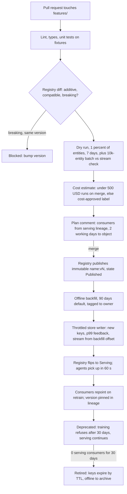
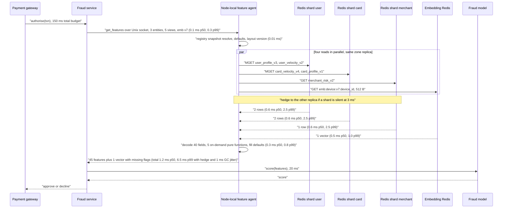

# Area D: adoption and evolution — lead review

Scope: build versus buy and migration (16), embeddings (17), the two real-time paths (18), the feature lifecycle (19), scale engineering (20). Where the five disagree I pick one answer and give the number that decided it.

## Engineers

- **16, adoption and build versus buy.** People cost more than machines (170k USD a month of salary against 100 to 120k of infrastructure); contributed the Feast-core decision with two trip-wires, the churn-first migration order, and "models reading from the store" as the only weekly metric.
- **17, embeddings.** A vector is 100 to 1,000x a scalar and only means something relative to its encoder; contributed the embedding-set version pinned per request, item vectors shipped as versioned snapshots instead of fetched (770 MB/s avoided), and the two-clock point-in-time rule.
- **18, real-time use cases.** Fraud holds a card authorisation and ranking holds a page render; contributed the per-hop fraud budget (1.0 ms p50, 6.5 ms p99, 3.5 ms headroom) and the rule that defaults and transform hashes live in the definition, not the caller.
- **19, lifecycle and CI.** A feature is one line of code but three deployables and a data asset with a dozen readers; contributed the PR-to-serving pipeline with a real-data dry run per PR (2 USD), the breaking-change classifier, and immutable `(name, version)`.
- **20, scale.** 10 ms p99 under 200k rows/s while 100M rows load underneath; contributed the fixed-layout binary row (under 1 µs decode, 0 allocations), the throttled store writer with a p99 feedback loop, and the near cache bounded by a declared `max_staleness`.

## Consensus

- One definition in Python, in git, compiled into the registry; the registry is never hand-edited.
- Online rows are one key per entity per feature view with the entity in the Redis hash tag, so a fraud request touches 3 shards and never 8.
- Redis Cluster in memory is the online store for the 10 ms path; DynamoDB's 5 to 10 ms p99 is the whole budget (19 assumed DynamoDB but built a store-agnostic lifecycle, so nothing in 19 changes).
- Streaming views append their value changes to the lake so training sees what serving saw, keyed on event time not write time.
- Every row carries a write timestamp and every feature a declared default; a store outage degrades to defaults, never to a failed transaction.
- Batch scoring and training read only the offline store; the online store exposes no scan.
- Versions are immutable and two versions coexist online during any migration; nothing is overwritten in place, whether a feature, an embedding set, or a legacy pipeline.
- Lineage that gates anything comes from what the serving path actually served, not from a self-reported consumer list.
- Adoption is measured in production models reading from the store, not registered features.

## Disagreements and resolutions

### Feature server on the hot path, or the SDK reads Redis directly

16 and 20 put a Go gRPC feature server in front of Redis; 20 budgets the hop at 0.4 ms p50 and 1.2 ms p99 round trip in-zone and lands fraud at 4.2 ms p99. 18 says no server on the fraud path: the hop is 3 to 4 ms p99 in practice plus a second failure domain, "a third of the budget for zero information", and puts a Python SDK in the consumer process. 18's cost is that slot grouping, hedging, fixed-layout decode, the near cache and version pinning get reimplemented per language, and access control moves into Redis ACLs.

| Option | Hop p99 | Implementations of decode, hedge, cache, pinning | Failure domains on the path | Proposed by |
|---|---|---|---|---|
| Central Go server, zone-affine | 1.2 ms round trip | 1 | store plus server fleet | 16, 20 |
| SDK direct to Redis | 0 | one per language, 3 expected | store | 18 |
| Node-local agent over Unix socket | 0.3 ms | 1 | store plus local process | this review |

**Resolution:** one Go binary, two deployment modes. On the fraud and ranking node pools it runs as a node-local agent (DaemonSet) reached over a Unix socket: 0.1 ms p50, 0.3 ms p99, no network hop, no second network failure domain, and a crashed agent degrades to declared defaults like any store outage. For the other 28 teams it runs as a zone-affine Deployment behind gRPC. This keeps 18's latency argument and 20's single implementation; the price is one extra deployment mode and 128 MB to 5 GB of node memory on two node pools. A thin SDK-direct path is not built; if the agent's measured p99 inside the fraud service exceeds 6 ms at the phase 3 load test, the chair reopens this.

### Hot-entity cache: where it lives and what bounds staleness

18 puts an 8 GB item near-cache in the ranking pod with a 1 hour TTL chosen against a 24 hour freshness need, 95 percent hit on 2 GB. 20 puts a 128 MB LRU in the serving pod, TTL equal to the view's registry `max_staleness`, cacheable only when that is 60 s or more, 80 percent of item reads from 70 MB. 17 sidesteps the cache for item vectors by shipping a 5.2 GB immutable snapshot.

| Proposal | Where | Size | TTL rule | Hit rate claimed |
|---|---|---|---|---|
| 18 | ranking pod | 2 to 8 GB | 1 h chosen by consumer against 24 h need | 95 percent on 2 GB |
| 20 | serving pod | 128 MB | equals view `max_staleness`, minimum 60 s | 80 percent on 70 MB |
| 17, embeddings only | server mmap | 5.2 GB per version | immutable per version | 100 percent |

**Resolution:** the cache lives in the node-local agent (previous resolution), so it is platform code on two node pools, not in 30 teams' pods. The staleness rule is 20's: TTL equals the view's `max_staleness`, the field is mandatory in the registry, and a view without it is not cacheable; the consumer never chooses a TTL because the owner declared the bound. Size 512 MB per ranking node, which holds about 1.4M item rows at 350 B, more than the 200k that cover 80 percent of reads. Scalar item rows are cached, not shipped; only embeddings are shipped, because a scalar row miss costs 1.5 ms and an embedding fan-out costs 770 MB/s.

### Feast core versus custom serving and streaming

16 keeps the Feast definition format, registry protocol, offline layout and materialisation CLI and replaces the online server and the streaming materialiser. 18, 19 and 20 each describe a piece that Feast does not have: a fixed-layout row and throttled writer (20), a git-compiled registry with a breaking-change classifier and per-PR dry run (19), an in-process fan-out with hedging (18). Taken together that is most of the serving and CI surface.

**Resolution:** Feast core, defined narrowly as the Python definition format, the batch-source wrap path, the offline store layout and the point-in-time join. Replaced: online row layout and store writer (20), serving binary (agent), Flink materialiser (16), CI pipeline and lineage extension (19). Trip-wires stay as 16 wrote them: flip to Tecton if we cannot keep 4 infrastructure engineers, or if the median training set is over 100 USD at month 4; a 4 week Tecton proof of concept on churn data runs in parallel. Added trip-wire: if the replaced list grows past those five pieces, we are building from scratch and the chair hears about it.

### Fraud first or last

16 migrates churn first, recs and search second, fraud fourth at months 7 to 10, because a public failure on the first migration ends the platform and churn has the most reused features and the worst backfill pain. 18 and 20 design from fraud outward; 18 notes fraud's skew is a revenue incident and its counters cannot wait for a 5 minute batch.

**Resolution:** 16's order for cutover, 18's order for engineering. The 10 ms path is built in phase 2 for recs and load-tested with fraud-shaped synthetic traffic (150k rps, 3 entities, 5 views) from month 5; fraud runs shadow reads against the store from month 6 so parity and latency numbers exist before the month 7 cutover starts. Cost accepted from 16: fraud's skew persists up to 10 months longer, which is cheaper than a first-migration failure on real money.

### Embeddings: separate cluster and shipped item snapshots, or in the row

17 puts embeddings in a separate Redis cluster keyed `emb:{family}:{version}:{entity}` and ships item vectors as an immutable per-version Arrow file (5.2 GB at int8) that servers mmap. 20 puts variable-length values including embeddings at the tail of the fixed-layout row. 18 lists `item_embedding_64` as an ordinary batch item feature.

**Resolution:** 17's design, with no size exception. A column typed `embedding` never lives in the scalar row, whatever its dimension, because the version has to be in the key for pinning to be enforceable and because a 256-dim fp16 vector would grow the fraud row from 2 KB to 2.5 KB for callers that never read it. User and device vectors: one GET from the embedding cluster in the same fan-out. Item vectors: shipped snapshot, swapped by the node-local agent on the "version ready" event; the Redis fallback for item vectors is an alert, not a mode. fp16 is the store default, int8 for item snapshots, and training reads the same bytes.

### Backfill default, cap, and who pays

19: default 90 days, automatic below 500 USD per PR, owner team charged through a cost tag, consumers pay for history beyond 90 days. 16: charging teams for storage in year one is the fastest way to make them bypass the store; the coexistence year costs about 30k USD a month. 17: 180 days of embedding snapshot rows and recompute beyond, under 20 USD for a 3-year window.

**Resolution:** 19's mechanics, 16's billing. Default 90 days, automatic run under 500 USD, `cost-approved` label above; every job carries the owning team's cost tag from day one so the bill is visible, but the platform budget pays through month 12 and chargeback starts at month 13. Consumer-requested history beyond 90 days is tagged to the consumer on the same schedule. Embedding snapshots keep 17's 180 days plus recompute.

### Deprecation: forced or not

19: 30-day grace, then training-set generation refuses the feature, serving never stops for a production model, retirement only at 0 consumers for 30 days. 17: delete an embedding version at 0 consumers plus 7 days. 16: delete a legacy pipeline only after 30 days of green parity and every consumer cut over, and a deploy gate at month 9 with 90-day exceptions.

**Resolution:** never force a production model off a feature; 19's rule stands and the monthly cost report to the model owner is the pressure. Embedding versions keep 17's 7-day rule after zero serving-lineage consumers, because each version is 180 GB and capacity is planned for two. The deploy gate is enforced at the model registry, since a model can be deployed without a CI run but not without a registry entry; it turns on only after 10 teams are live and self-serve onboarding is under a day.

### Key layout and row format

18 and 20 both want one key per entity per view with the entity in the hash tag; 18 encodes the value as a protobuf blob, 20 as a fixed-layout binary row with a registry-owned layout version (350 B, under 1 µs, 0 allocations against 600 B, 10 µs, 40 allocations). 20's own open question is whether a hot streaming feature should rewrite a whole row.

**Resolution:** one key per entity per view, fixed-layout binary, layout version owned by the registry. Streaming views and batch views are always separate views by rule, so a Flink writer and a Spark writer never share a row; at 210k writes/s peak that is 75 MB/s of 350 B rewrites, which is not a problem, and it removes the seam question.

### Whose numbers

| Number | 16 | 17 | 18 | 19 | 20 | Chosen |
|---|---|---|---|---|---|---|
| Monthly infrastructure, USD | 100 to 120k | 40 to 60k | 120k | 150 to 250k | 35 to 45k | 100 to 120k year one, 60 to 80k after |
| Peak online row reads per second | 1M keys | n/a | 4.5M rows | 200k to 600k keys | 200k rows, 420k keys | 4.5M rows |
| Online memory with replicas | 3.2 TB | 180 GB embeddings | 610 GB | 1 TB | 360 GB | 610 GB scalar plus 360 GB embeddings |
| Streaming lag SLO | 5 s | n/a | 2 s p99 fraud | 1 to 5 s | under 5 s | 2 s fraud velocity, 5 s others |
| Training set scans | 10 PB a month, 40 to 60k | 30k Spark | 40k | n/a | 8k | 40k, the 10 PB figure |

20's total omits training-set scans, which 16 and 18 put at 40k a month on their own, and 19's range assumes DynamoDB read pricing. **Resolution:** size the online store on 18's 4.5M rows/s and 1.8 GB/s, since the brief's "hundreds of candidates per request" makes the request reading conservative; budget 100 to 120k USD a month in year one including 30k of coexistence, 60 to 80k after. Streaming lag: 2 s p99 for the fraud card and merchant velocity views only, 5 s for every other streaming view.

## Open questions, answered

**16.1 Is a 500k to 1M Tecton licence cheaper than 6 months of 5 engineers?** In salary alone they are close: 5 engineers for 6 months is about 500k. The licence is recurring and the exit cost is a DSL rewrite, so Feast core wins at year 2 if the trip-wires hold; the 4-week Tecton proof of concept on churn keeps the flip cheap if they do not.

**16.2 Do wrapped sources count as "on the store"?** Yes for the models-reading metric, because a wrapped table gets point-in-time joins, lineage and monitoring. Report a second column, "transform in store", so the training-serving guarantee is not overstated; the 18-month target is 60 models on the store and at least the 4 online ones with transforms inside.

**16.3 Who owns a feature when the producing team dissolves?** The largest consuming model's team, assigned by lineage and recorded in CODEOWNERS within 30 days; the platform team holds it for those 30 days only. The platform team owning features it did not write is the failure mode 16 names.

**16.4 Deploy gate in the model registry or CI, who grants exceptions?** Model registry, because deploys can bypass CI but not the registry. Exceptions are granted by the platform lead, expire in 90 days, and are listed on the weekly dashboard.

**16.5 Who funds the coexistence year?** Platform budget, about 30k USD a month for 12 months. Chargeback from month 13 to teams still running a legacy pipeline that has been green on parity for 30 days.

**17.1 Streaming encoder for recs instead of hourly refresh?** Not in year one. The hourly active-user micro-batch is 700 writes/s and no GPU stream job; the ranking team's own session features (30 s streaming) carry the intra-hour signal.

**17.2 Is 180 days plus recompute acceptable for 3-year churn windows?** Yes: recompute over sampled training rows through the pinned encoder is about 1 hour and under 20 USD for 50M rows, against 110 TB per family to keep rows. The encoder artefact is part of the embedding set and retained while the set is referenced.

**17.3 Multiple embedding families per entity type?** Allow up to 3 user families in year one, each at 180 GB with two versions live; a fourth needs the chair. A shared foundation embedding is the right end state but forcing it before the store has users is the "platform nobody uses" pattern.

**17.4 Who owns the snapshot swap?** The node-local agent, so rankers never touch S3 and the version tag on retrieval and ranking is checked in one place.

**17.5 Is the 0.005 cosine skip threshold a default or per-family?** Store default, overridable per family in the definition and therefore reviewed in the PR; the daily row count it produces is posted in the cost estimate stage.

**18.1 Is the item near-cache platform or ranking team code?** Platform, in the node-local agent, not in the ranking pod. The staleness bound comes from the view's `max_staleness`, so the ranking team's only decision is which views to request.

**18.2 2 s lag SLO or 30 s with an in-process counter?** 2 s p99 for the card and merchant velocity views only, with checkpointed Flink state. An in-process counter in the fraud service is a second unregistered feature computation, which is the skew the store exists to remove.

**18.3 Multi-region and card home regions.** Serving and consistency owns this.

**19.1 Can the consistency check prove a formula change compatible?** Definitions and computation owns the classifier; my area's input is that a false compatible costs a silent skew and a false break costs a version bump, so by rule.

**19.2 Pin at commit hash rather than version?** Definitions and computation owns this.

**19.3 Who pays for consumer-requested history beyond 90 days?** The consumer, tagged from day one, billed from month 13.

**19.4 Is 30 days grace right for quarterly retraining?** Keep 30 days for the training-set refusal, and record retrain cadence per model in the registry so the plan comment shows when each consumer will actually see the new version; serving is never cut, so the grace only governs new training runs.

**19.5 Do on-demand transforms go through the dry run?** Yes, the same 10k-entity consistency stage plus a latency assertion under 0.5 ms per call; Serving and consistency owns the runtime limits.

**20.1 Is 60 s staleness fine for item popularity?** Yes; the view owner sets `max_staleness` and popularity views will declare 60 s to 1 h. Redis client-side tracking is the upgrade path if a ranking view needs under 60 s.

**20.2 One key per entity per view even when a streaming update rewrites the row?** Yes; streaming views are separate views by rule (resolution above).

**20.3 Multi-AZ replica memory.** Serving and consistency owns this; my sizing assumes 3 zones and 360 GB.

**20.4 Who owns the p99 feedback loop for the bulk writer?** Platform, via the metric, with the threshold pair (halve above 6 ms, grow below 4 ms) held in the registry so model owners can read it. Platform owns the run book.

**20.5 Nightly scores in the online store?** Serving and consistency owns it; my recommendation is a separate low-QPS view through the same throttled writer.

## Non-negotiables for this area

1. The wrap-a-table path ships in phase 0; without zero-rewrite onboarding the migration does not start.
2. The weekly metric from week 1 is production models reading from the store; feature counts are never reported as progress.
3. No legacy pipeline, feature version or embedding version is removed without serving lineage showing zero consumers and the stated grace (30 days for pipelines and features, 7 for embedding versions).
4. A published `(name, version)` is immutable; every PR that changes a transformation runs a real-data dry run and a batch-versus-stream consistency check before merge.
5. Every embedding column carries `model_ref`, version and `trained_through_ts`; a request without a pinned version is refused, and item vectors are never fetched per candidate in the normal path.
6. No synchronous network hop other than the store on the fraud path; registry snapshot in memory, on-demand functions without I/O.
7. One key per entity per view, fixed-layout binary with a registry-owned layout version and write timestamp; a reader never sees a half-written or mixed-version row.
8. One throttled store writer for batch and streaming with a p99 feedback loop; no job writes to Redis directly.
9. Batch scoring and training read only the offline store; the online store exposes no scan.
10. Declared defaults and transform hashes are in the registry and enforced at model registration, so training and serving cannot disagree on a value or a missing value.

## Recommended design for this area

Build on the Feast core narrowly: Python definitions in one git repo, the batch-source wrap path, the Iceberg offline layout and the point-in-time join. Around it we own five pieces: a git-compiled registry with a breaking-change classifier and a per-PR real-data dry run; a Flink materialiser; a throttled store writer that is the only Redis writer; a fixed-layout row; and one Go serving binary that runs as a node-local agent on the fraud and ranking pools and as a zone-affine Deployment for everyone else. Tecton is the fallback, kept cheap by a 4-week proof of concept on churn data and two trip-wires.

The lifecycle is one ordered flow. A PR touching `features/` runs lint, unit tests, the registry diff, a 1 percent dry run over 7 days, a 10k-entity batch-versus-stream consistency check and a cost estimate, then posts a plan comment listing consumers from serving lineage. Merge publishes an immutable `(name, version)`; a 90-day backfill runs automatically under 500 USD; the store writer materialises the new version under new keys at a rate the serving p99 governs; the registry flips the version to Serving; consumers repoint on their own schedule. Deprecation refuses new training runs after 30 days and never cuts serving; retirement follows 30 days of zero serving-lineage consumers. Costs are tagged to owners from day one and billed to the platform until month 13.

Serving is one key per entity per view in a fixed-layout row with the entity in the hash tag. The agent groups keys by slot, pipelines one MGET per shard in parallel to the same-zone replica, hedges at 3 ms, decodes without allocation, runs pure on-demand functions and fills declared defaults with a missing flag. Views with a declared `max_staleness` of 60 s or more are cached in the agent's LRU with TTL equal to that bound. Embeddings live in a separate Redis cluster keyed by family and version; item vectors are shipped as int8 per-version snapshots the agent mmaps and swaps atomically, so a 300-candidate ranking request makes one network fetch for the user row and one for the user vector.

Migration goes churn, recs, search, fraud. The 10 ms path is built for recs in phase 2 and load-tested with fraud-shaped traffic from month 5; fraud shadow-reads from month 6 and cuts over between months 7 and 10 behind a flag with a legacy fallback. Both paths run for a year with a daily 1 percent parity sample; the deploy gate turns on at month 9 once 10 teams are live. If fewer than 5 teams have a model reading from the store at month 6, building stops and every engineer embeds with a team.

| Phase | Window | Ships | Exit criterion |
|---|---|---|---|
| 0 | weeks 1 to 8 | registry from git, batch materialise, PIT join, wrap-a-table, CI lint and unit stages | churn team generates one training set in one SDK call |
| 1 | months 2 to 4 | churn live, 2 platform engineers embedded, dry run and consistency CI stages | 2 clean nightly training runs; median backfill under 1 day |
| 2 | months 4 to 7 | recs and search, agent, fixed-layout row, store writer, near cache, embedding cluster and item snapshots | ranking p99 under 12 ms measured in the ranker; fraud-shaped load test at 150k rps under 6.5 ms p99 |
| 3 | months 7 to 10 | fraud with Flink velocity views, shadow reads from month 6, cutover behind a flag | 30 days parity green; 2 s p99 lag on velocity views; zero skew incidents in the cutover quarter |
| 4 | months 9 to 12 | deploy gate in the model registry, self-serve onboarding | 10 teams live before the gate; time to first feature under 1 day |
| 5 | months 12 to 18 | retire 30 pipelines, chargeback on | 60 of 60 models on the store; 0 ad-hoc pipelines |

| Hop | p50 ms | p99 ms | Why it holds |
|---|---|---|---|
| Fraud service to agent, Unix socket | 0.1 | 0.3 | same node, no TLS, no proxy |
| Registry resolve, defaults, layout version | 0.01 | 0.01 | in-memory snapshot refreshed every 30 s off-path |
| 3 scalar MGETs plus 1 embedding GET, parallel, same-zone replica | 0.6 | 2.5 | hash tag per entity, one shard per entity, AZ-local |
| Hedge on a silent shard | 0 | 3.0 | fires past 3 ms, caps the tail at the second replica's p99 |
| Decode 40 fields, 5 on-demand functions, defaults | 0.3 | 0.8 | fixed layout, zero allocation, no I/O in on-demand code |
| Go GC and scheduler jitter | 0 | 1.0 | GOMEMLIMIT, heap under 1 GB, no cgroup CPU limit |
| Total feature fetch | 1.2 | 6.5 | 3.5 ms headroom against the 10 ms SLO |

| Choice | Value |
|---|---|
| Build versus buy | Feast core (definitions, wrap path, offline layout, PIT join); we own registry CI, Flink, store writer, row layout, serving agent. Trip-wires: fewer than 4 infrastructure engineers, or median training set over 100 USD at month 4, or a sixth replaced piece; 4-week Tecton PoC on churn in parallel |
| Migration order and phases | P0 weeks 1 to 8 registry, batch, PIT join, wrap; P1 months 2 to 4 churn; P2 months 4 to 7 recs and search plus the 10 ms path load-tested with fraud traffic; P3 months 7 to 10 fraud with Flink, shadow reads from month 6; P4 months 9 to 12 deploy gate and long tail; P5 months 12 to 18 retire 30 pipelines |
| Hot-path topology | One Go binary; node-local agent over Unix socket on fraud and ranking pools (0.3 ms p99 hop); zone-affine gRPC Deployment for all other callers; no SDK-direct Redis path |
| Hot-entity cache rule | LRU in the agent, 512 MB on ranking nodes, 128 MB elsewhere; cacheable only if the view declares `max_staleness` of 60 s or more; TTL equals `max_staleness`; singleflight per key; top-k alarm at 5 percent of a pod's reads |
| Embedding storage and versioning | Separate Redis cluster, key `emb:{family}:{version}:{entity}`, fp16 raw bytes; item vectors int8 per-version Arrow snapshot on S3, mmapped and swapped by the agent; set version pinned per request or refused; two versions live during cutover; old version deleted at zero consumers plus 7 days; 180 days of snapshot rows, recompute beyond; up to 3 user families |
| Backfill default and cap | 90 days; automatic under 500 USD per PR, `cost-approved` label above; idempotent by (view, version, day); stream starts at the recorded backfill offset; tagged to owner from day one, platform pays through month 12, chargeback from month 13 |
| Deprecation rule | 30-day grace then training-set generation refuses; serving never forced off a production model; retire at 0 serving-lineage consumers for 30 days; legacy pipelines deleted only after 30 days green parity and all consumers cut over; deploy gate in the model registry from month 9 with 90-day exceptions |
| Key layout | One key per entity per view, entity in the hash tag, fixed-layout binary row with registry-owned layout version and write timestamp; streaming and batch views never share a row |
| Streaming lag SLO | 2 s p99 for fraud card and merchant velocity views, 5 s for all other streaming views; Flink state checkpointed to S3 |
| Adoption metrics and targets | Models reading from the store: 15 at 6 months, 48 at 12, 60 at 18; training sets via the store 40, 85, 100 percent; ad-hoc pipelines 26, 12, 0; median backfill 1 day at 6 months, 4 hours at 12; skew incidents per quarter 3, 1, 0; kill criterion: under 5 teams live at month 6 |
| Cost order of magnitude | 100 to 120k USD a month in year one including 30k coexistence; 60 to 80k after; sized on 4.5M row reads/s and 1.8 GB/s |

## What the chair needs to decide

1. **Node-local agent versus a central feature server versus SDK-direct.** My resolution is the agent; Serving and consistency owns the hedging, replica and multi-zone rules that the agent implements, and Platform owns the DaemonSet, so both must agree before phase 2.
2. **Redis Cluster with 3-zone replicas at 360 GB, or one replica set and a 1 ms cross-zone hop for two zones.** I sized for 3 zones; 20.3 and 18.3 belong to Serving and consistency and change the cost line by a factor of about 1.5.
3. **The registry owns the row layout version and the `max_staleness` field, both mandatory.** Definitions and computation owns the registry schema; without those two fields the fixed-layout row and the near cache are correctness bugs.
4. **Year-one money: about 30k USD a month of coexistence plus backfills billed to the platform budget until month 13.** This is a finance decision Platform must carry; without it 16's adoption plan and 19's cost tags pull in opposite directions.
5. **Whether 200k lookups per second means requests or entity rows.** I sized on requests (4.5M rows/s); if the chair reads it as rows, the store is 20x over-sized and the cost line drops.
