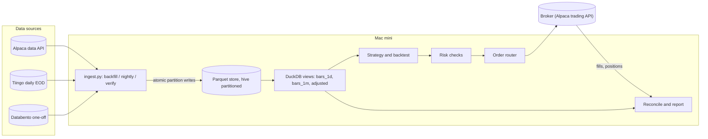
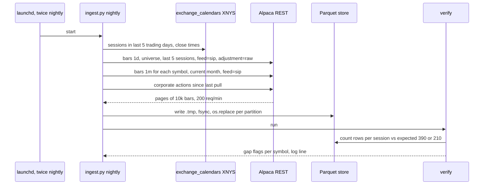

# Mini quant system — DE 01, market data ingestion

Assumptions: US retail account at Alpaca (commission-free, paper trading, free data tier bundled). Universe is 10 to 30 liquid US ETFs and large caps (SPY, QQQ, IWM, TLT, GLD, sector ETFs). Primary timeframe is daily bars; minute bars are stored for execution analysis and a possible intraday strategy later. Prices and plan limits below are as of my last check and must be re-verified on signup; vendors change tiers yearly.

## Requirements

Functional

| # | Requirement | Number |
|---|---|---|
| F1 | Daily OHLCV bars for the universe, unadjusted, plus a corporate actions table | 30 symbols, 20+ years where available |
| F2 | Minute bars for the universe, regular session, consolidated (SIP) where the tier allows | 30 symbols, 8+ years |
| F3 | Nightly incremental pull after close, safe to rerun any number of times | by 20:30 ET every trading day |
| F4 | One-command backfill from empty disk | finishes in under 2 hours |
| F5 | Gap report: missing sessions or minutes versus the exchange calendar | run after every pull, before signals |
| F6 | Read API for the strategy: DuckDB views over the store, adjusted-at-read | one SQL view per bar size |

Non-functional

| # | Requirement | Number |
|---|---|---|
| N1 | Cost of data | $0 per month steady state; one-off backfill under $20 |
| N2 | Storage | under 5 GB for 10 years of minute bars for the universe |
| N3 | Correctness over freshness | a signal never runs on a partition the gap check flagged |
| N4 | Restartable | kill -9 at any point leaves no half-written partition |
| N5 | Timezone | every timestamp stored as UTC; session date is a separate column in America/New_York |
| N6 | Unattended | runs from launchd, logs to a file, one summary line per run; failure is visible next morning, not silent |

## Estimates

Volumes (Parquet, zstd, measured on similar data at roughly 20 bytes per minute row, 40 per daily row)

| Dataset | Rows | Size |
|---|---|---|
| 1 symbol, 1 year, 1m regular hours | 390 bars x 252 days = 98k | ~2 MB |
| 30 symbols, 10 years, 1m | 29M | ~600 MB (extended hours x2.5, ~1.5 GB) |
| 30 symbols, 25 years, daily | 190k | ~8 MB |
| Whole US market daily, 8,000 symbols x 20 years | 40M | ~1.6 GB, optional |
| Corporate actions, universe | a few thousand | < 1 MB |

Request rates on Alpaca Basic (200 req/min, 10,000 bars per page, multi-symbol per call)

- Backfill 1m: 29M bars / 10,000 per page = 2,900 pages = 15 minutes at the rate limit. Daily backfill: 20 pages.
- Nightly: universe daily bars = 1 call; last 5 sessions of 1m = 30 x 5 x 390 = 58k bars = 6 pages. Under 10 seconds.
- Corporate actions: 1 call per night.

Costs per month

| Item | Monthly |
|---|---|
| Alpaca Basic data (comes with the account) | $0 |
| Tiingo free tier for long daily history and cross-check | $0 |
| Databento one-off backfill of 1m bars pre-2016 or for cross-check | $0 to $10 one-off (free $125 signup credit covers it) |
| Mac mini power, ~10 W idle | ~$1 |
| Total steady state | ~$1 |

Edge versus fees, honest version: 20 to 40 trades per month at about $1,000 notional each. Alpaca commission $0; SEC and FINRA fees under $0.05 per round trip at this size; SPY spread 1 cent on $600 is 0.2 bp; total friction roughly $2 to $5 per month. A daily-bar ETF strategy with a real edge might make 3 to 8 percent per year on $2,000, i.e. $60 to $160 per year. A $29 per month data plan is $348 per year, which is 2 to 6 times the plausible edge. Conclusion for this lens: paid real-time data is not justified by the account size. Design for free data and daily bars; treat intraday as delayed-only research.

## High-level design



Main flows

1. Data in: launchd fires `ingest.py nightly` at 16:35 and 20:05 ET. It re-pulls the last 5 sessions of daily and 1m bars and the corporate actions feed, rewrites the affected partitions atomically, then runs `verify`.
2. Signal: strategy queries DuckDB views only. The view joins raw bars to corporate actions and adjusts at read time. If `verify` wrote a flag file for any symbol in the universe, the signal step skips that symbol.
3. Order out: separate process, covered by other lenses; it reads the same store for reference prices.
4. Reconcile: nightly, broker fills versus the 1m bars that were live at fill time, to measure slippage.
5. Report: one line per run in `ingest_log.csv` plus a morning summary.

## Deep dive: market data ingestion

### Source comparison, US equities and ETFs

| Source | Cost | Latency on free tier | Bars available | Rate limits | History depth | Verdict |
|---|---|---|---|---|---|---|
| Alpaca Market Data Basic | $0 with account; Algo Trader Plus $99/mo for real-time SIP | Real-time stream is IEX only (~2-3% of volume); historical REST with `feed=sip` allowed once data is 15 min old | 1m, 5m, 1h, 1d; trades and quotes; corporate actions endpoint | 200 req/min, 10k bars/page, multi-symbol calls; 1 websocket, 30 symbols | Since 2016 | Primary. Full consolidated bars for daily and end-of-day 1m, for free |
| Tiingo free | $0; Power ~$30/mo | EOD daily; IEX intraday endpoint | 1d adjusted with split and dividend factors; IEX-only intraday | 50 req/hr, 1,000 req/day, 500 unique symbols/month | Daily 30+ years | Secondary. Long daily history and an independent cross-check of closes |
| Polygon.io (Massive) | Free; Starter $29/mo; Developer $79/mo | Free: EOD, delayed; Starter: 15 min delayed | Aggregates any size, splits, dividends; trades on Developer | Free: 5 req/min; paid: unlimited | Free: 2 years; Starter 5 yrs; Developer 10 yrs | Skip on this budget. Best upgrade path if a paid tier is ever justified |
| Databento | Pay per GB, $125 signup credit; live subscriptions priced per month | Historical only in this design | OHLCV-1s/1m/1d, trades, MBO; Nasdaq feed | Generous; batch downloads | XNAS.ITCH since 2018; consolidated-ish equity bundles since 2023 | One-off backfill and audit of 1m bars; a few dollars for the universe |
| Alpha Vantage | Free 25 req/day; $49.99/mo | Delayed | 1m with 20+ years via month parameter | 25 req/day free is the blocker: universe backfill would take months | 20+ years intraday | Skip |
| yfinance | $0, no key, unofficial scraper | 15 min delayed | 1d full history adjusted; 1m only last 30 days, 7 days per call | Unpublished, changes without notice; ToS grey area | Daily decades | Sanity checks in a notebook only, never in the pipeline |
| Broker feeds (IBKR, Schwab) | IBKR US bundle ~$1.50 to $4.50/mo, needs funded account; Schwab free with account | Real-time | Snapshots and bars | Pacing limits, session-based auth | Limited | Not needed unless the broker changes |

What "free" actually gives you: consolidated daily bars for any US listing, complete minute bars once the session is 15 minutes old, and a real-time stream that shows a small slice of the tape. That is enough for daily strategies and for after-the-fact execution analysis. It is not enough for an intraday strategy that reacts within 15 minutes to consolidated prices, and nobody sells that for less than the account's plausible annual return.

### The hard part

Not volume. The hard parts are (1) making the store correct under reruns, crashes and vendor corrections, (2) telling a real gap from a closed market or an illiquid minute, and (3) never letting adjusted prices leak into storage.

### The obvious approach and why it breaks

Obvious: a SQLite table `bars(symbol, ts, o, h, l, c, v)` with `INSERT OR REPLACE`, a cron job that fetches "since the last timestamp I have", and the vendor's `adjustment=all` flag so prices are already split-adjusted.

Why it breaks:

- "Since last timestamp" is a cursor. A crash after fetching page 3 of 10 leaves a partial day; the next run sees a max timestamp inside the day and starts after it, so the earlier minutes of that day are never refetched. Vendors also correct late prints for hours after close; a cursor never sees corrections.
- Adjusted bars stored on disk are wrong the day after any split or dividend in the universe. SPY pays quarterly; that is four silent rewrites per year per symbol, and the store now disagrees with what was pulled last month. Backtest results drift for reasons nobody can explain.
- SQLite is fine for size but is row-oriented; a 30M-row scan for a backtest takes tens of seconds versus under a second from Parquet in DuckDB.
- cron on macOS does not fire while the machine sleeps, and a naive ET schedule written in local time breaks twice a year on DST.

### What I would do instead

Storage: Parquet as the system of record, DuckDB as the query engine, no database server. Layout:

```
data/bars_1m/symbol=SPY/ym=2025-09.parquet      one file per symbol-month, ~8k rows
data/bars_1d/symbol=SPY.parquet                  one file per symbol, all history
data/corp_actions.parquet                        whole table, rewritten each night
data/flags/SPY.gap                               present only while SPY fails verify
ingest_log.csv                                   append-only, one line per partition write
```

Schema, bars_1m: `symbol VARCHAR, ts TIMESTAMPTZ (UTC, bar open), open DOUBLE, high DOUBLE, low DOUBLE, close DOUBLE, volume BIGINT, vwap DOUBLE, trade_count INT, session_date DATE (ET), source VARCHAR`. bars_1d: same minus ts, keyed on session_date. corp_actions: `symbol, ex_date, kind ('split'|'cash_div'), ratio DOUBLE, amount DOUBLE, source, fetched_at`. Prices stored unadjusted, always.

Idempotency by construction: the unit of work is a whole partition. `fetch(symbol, ym)` pulls the entire month from the vendor, writes `…/ym=2025-09.parquet.tmp`, fsyncs, then `os.replace` onto the final name. Rename is atomic on APFS. There is no cursor and no upsert; running the same job twice produces the same bytes. Restart after kill -9: the `.tmp` is deleted on startup, the partition is simply redone. The nightly job rewrites the current month (and the previous month during the first 5 sessions of a new month) so vendor corrections are picked up for free.

Backfill: iterate `(symbol, ym)` over the universe and the date range, skip any partition whose file exists and whose row count matches the calendar expectation (see gaps), else fetch. Rate limiting is one line: `time.sleep(60/200)` after each request, plus retry on HTTP 429 honoring `Retry-After`, max 5 attempts with exponential backoff, then log and move to the next partition. A failed partition is simply absent and gets picked up next run.



Gaps, three kinds, handled differently:

| Kind | Detect | Action |
|---|---|---|
| Market closed: holiday, half day (13:00 ET close), unscheduled halt | `exchange_calendars` XNYS gives sessions and close times; do not hand-maintain holidays | Expected minute count per session is 390, or 210 on half days; no gap |
| No trade in a minute for a thin symbol | Vendor omits the bar; liquid ETFs never do | For the universe (all liquid), any missing minute in a session is a data error; tolerate up to 2 per day, else refetch the day, else flag |
| Vendor missing or late data | Row count below expectation after refetch; daily close differs from Tiingo close by more than 0.1 percent | Write `data/flags/SYM.gap`; strategy skips the symbol; morning summary lists it |

Never forward-fill in storage. Filling is a strategy decision and belongs in the read query.

Timezones: vendors return UTC (Alpaca RFC 3339 Z, Polygon epoch ms, Databento nanoseconds). Store as-is in UTC. Compute `session_date` once at write time by converting to America/New_York: 13:30Z is the 09:30 opening bar in summer, but in January the opening bar is 14:30Z and a 13:30Z bar is pre-market, so a naive UTC-offset rule is wrong for half the year. Daily bars from Alpaca come stamped 04:00Z or 05:00Z depending on DST; throw the time away, keep the DATE. Schedule launchd in local time on a Mac whose system timezone is set to America/New_York, and `sudo pmset -a sleep 0` so it never sleeps. The script rechecks with the calendar that today was a session, so a launchd fire on a holiday is a no-op.

Adjustments at read time: a DuckDB view computes a cumulative factor per symbol from `corp_actions` ordered by `ex_date` descending and multiplies price columns for rows before each ex-date. Backtests select the view; execution code selects raw. When a new split lands, only `corp_actions.parquet` changes and every adjusted number updates consistently.

Cross-check: nightly, compare Alpaca daily close against Tiingo adjusted close divided by Tiingo's cumulative adjustment factor. Disagreement beyond 0.1 percent flags the symbol. This is the one place a second free source earns its keep: it catches a bad vendor day before money moves.

Real-time, honest scope: the free IEX websocket is used for one thing only, a heartbeat that the market is open and prices are moving, feeding the kill-switch lens. Signals never read it, because IEX bars are a 2 to 3 percent sample of consolidated volume and their VWAP is not the market's VWAP.

Code footprint: one Python file, three subcommands, dependencies `alpaca-py` (already needed for the broker), `pyarrow`, `duckdb`, `exchange_calendars`. Under 300 lines. No orchestrator, no queue, no Docker.

## Trade-offs

| Decision | Chose | Rejected | Why |
|---|---|---|---|
| Store | Parquet files plus DuckDB reader | Single DuckDB or SQLite database | Whole-file replace is the idempotency mechanism; Parquet is vendor-stable and readable by anything; single-writer database file plus an upsert path is more code with more failure modes |
| Partition size | symbol-month for 1m | symbol-day or symbol-year | Month is ~8k rows, one page from the vendor, cheap to rewrite nightly; day is 2,500 files per symbol-decade; year makes corrections rewrite 100k rows |
| Adjustment | Raw on disk, adjust in view | Store adjusted | Adjusted data is a function of the date you asked, not of the market |
| Primary source | Alpaca free | Polygon Starter $29/mo | Cost is larger than the expected edge; Alpaca gives consolidated bars after 15 minutes anyway |
| Gap policy | Flag and skip symbol | Fill or fail whole run | One bad symbol should not stop trading the other 29; silent fill hides vendor errors |
| Scheduler | launchd | cron, APScheduler in a long-lived process | launchd survives reboots and handles sleep; a long-lived process is one more thing to babysit |

## Pitfalls

- Alpaca free tier real-time versus historical is the single most misunderstood point: the stream is IEX-only, but historical REST with `feed=sip` is complete once 15 minutes old. Build to the second fact, not the first.
- Extended-hours bars: Alpaca returns 04:00 to 20:00 ET by default for 1m. Decide up front; store regular hours only, or the gap arithmetic and VWAP are wrong. I store regular hours; if extended hours are needed later, they are a separate partition tree.
- Half days: 13:00 ET closes on the day after Thanksgiving, sometimes Christmas Eve and July 3. Hardcoding 390 bars flags them all as gaps.
- Symbol changes and delistings: FB became META; a partition tree keyed on today's ticker silently loses history. Keep the vendor's symbol as-is and add a `symbol_map.csv` when a rename happens; this bites once every few years.
- DuckDB file format has changed between major releases in the past; Parquet has not. Another reason for Parquet as the record.
- The `.tmp` plus rename trick only works within one filesystem; do not put `data/` on an external drive mounted differently from the temp path.
- Vendor plan changes: Alpha Vantage cut its free tier from 500 to 25 calls per day; Polygon rebranded and re-tiered. Re-read the plan page before relying on any number in the table above.
- Do not run backfill and nightly concurrently against the same partition; a `flock` on `data/.lock` is one line and prevents two writers racing on a rename.

## Open questions for the panel

1. Regular hours only, or extended hours too? It doubles storage and changes every gap rule; the execution lens should say whether pre-market prices matter for order timing.
2. Is the strategy lens content with 15-minute-delayed consolidated data for any intraday work, or does it need a real-time SIP feed that costs more than the account earns?
3. Universe size: fixed 30 symbols, or whole-market daily bars (1.6 GB, one extra nightly call per 1,000 symbols) so screens can be run? Whole-market makes survivorship bias handling a real task.
4. Who owns corporate actions correctness: this lens (data) or the backtest lens (consumer)? I propose data owns the table, backtest owns the adjustment view.
5. Should the cross-check source be Tiingo (free, rate-limited) or a one-off Databento pull (paid, complete)? Free daily cross-check seems enough; I would like a challenge.

## Non-negotiables

1. Prices are stored unadjusted with a separate corporate actions table; adjustment happens only in read-time views. I block any design that writes adjusted bars to disk.
2. Every partition write is whole-file and atomic (temp file, fsync, rename); no cursors, no upserts. Rerunning any job any number of times is safe.
3. A gap check against the exchange calendar runs after every pull, and the signal step cannot read a flagged symbol. Data that failed verification never reaches an order.
