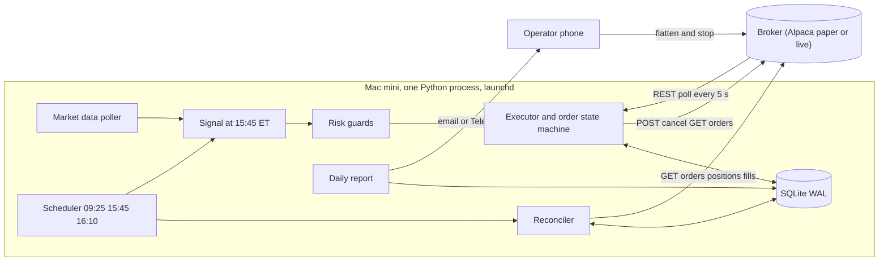
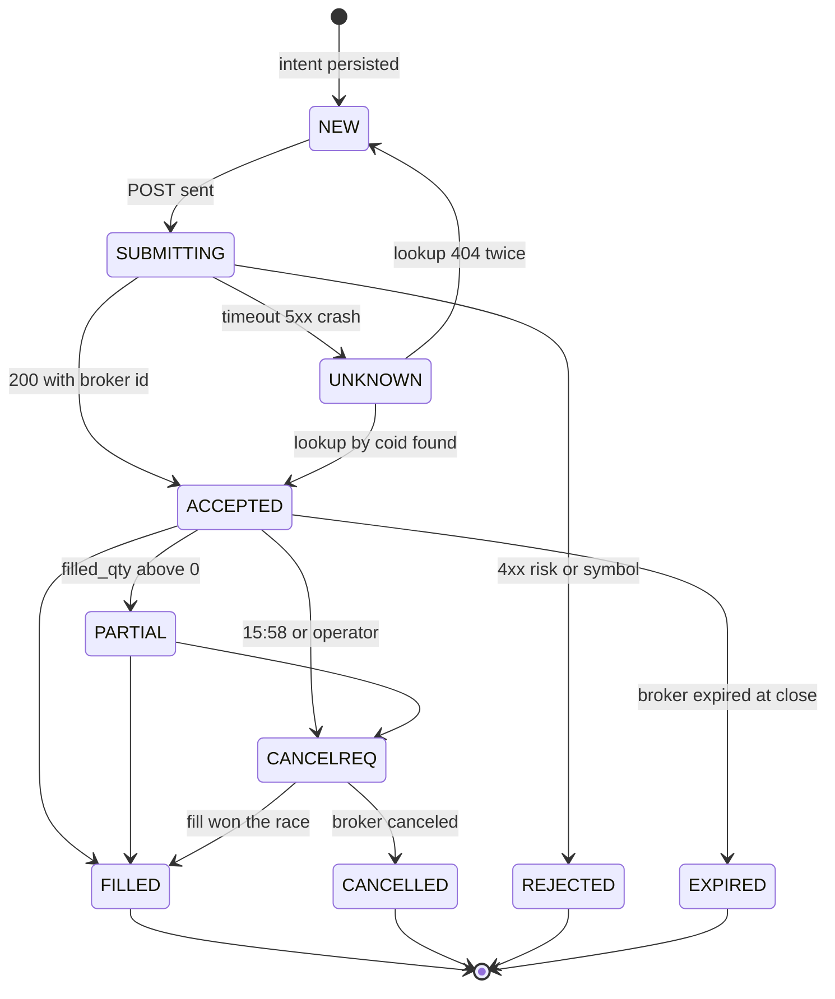
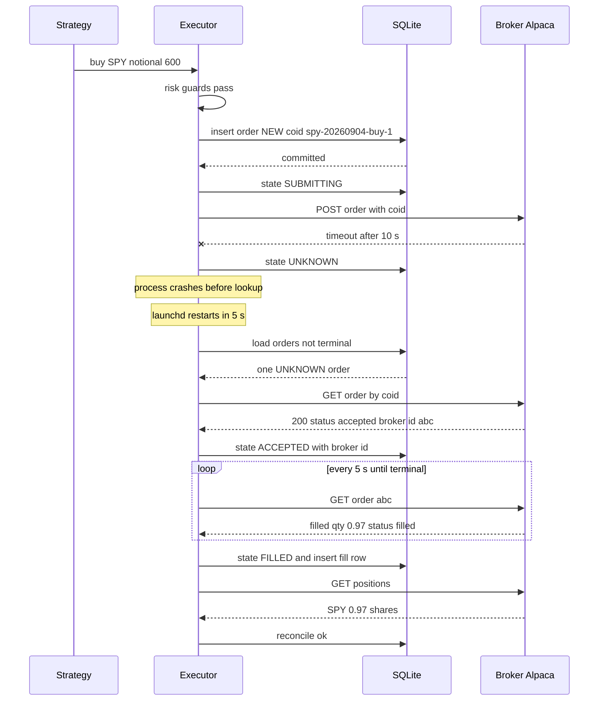

# Mini quant system — DE 02, broker integration and execution

Lens: broker integration and order execution. Assumptions: US retail, one operator, one Mac mini, $2,000, daily-timeframe signals on 3 to 5 liquid US ETFs and large caps, every position closed or re-decided once per day. Intraday is discussed where the broker rules bite.

## Requirements

Functional

| # | Requirement | Number |
|---|---|---|
| F1 | Submit, cancel and query equity orders through a broker API from a Python process on the Mac mini | 1 broker, 1 account, 1 process |
| F2 | Run the identical code against paper and live accounts, switched by one config value | 0 code differences |
| F3 | Every order carries a client order id generated before the HTTP call; a retry can never create a second order | 0 duplicate orders, ever |
| F4 | Local order and position state reconciled against the broker at startup, every 5 min while orders are open, and at 16:10 ET | 3 reconcile triggers |
| F5 | Operator can flatten everything and stop the bot from a phone in under 60 s, without the Mac mini | broker dashboard plus 1 curl |
| F6 | Fractional or notional orders so $2,000 can hold 3 to 5 names priced up to $600 | notional min $1 |

Non-functional

| # | Requirement | Number |
|---|---|---|
| N1 | Order intent durably written before the network call; survives process crash and power loss | fsync before send |
| N2 | An order in an ambiguous state is resolved by reconciliation, never by guessing | UNKNOWN resolved within 1 reconcile cycle or bot halts |
| N3 | Hard local risk guards before every submit: max notional per order, max gross exposure, max orders per day, day-trade counter | $700, $2,000, 10, 3 per 5 days |
| N4 | Broker outage or 3 consecutive 5xx or timeouts stops new orders; existing DAY orders expire at close on their own | circuit opens after 3 failures, no GTC orders |
| N5 | Unattended for 1 trading day; a missed day costs nothing but a missed signal | recovery at next 09:25 ET start |

## Estimates

| Item | Estimate | Basis |
|---|---|---|
| Orders per day | 0 to 5, mean 1 | 3 to 5 names, rebalanced daily, most days no change |
| Orders per year | 150 to 400 | 250 trading days |
| Broker API calls per day | about 300 | 1 submit per order, poll every 5 s while open, 3 reconciles at 4 calls each, 1 account check per 5 min |
| Peak calls per minute | 15 | polling 5 open orders; Alpaca limit is 200 per min |
| Order and fill rows per year | under 2,000 | SQLite, under 5 MB per year |
| Commission | $0 | Alpaca, Schwab, IBKR Lite |
| Regulatory fees per $1,000 sold | about $0.03 | SEC fee $27.80 per $1M sold plus FINRA TAF $0.000166 per share |
| Spread plus slippage per $1,000 traded | $0.10 SPY, $0.50 to $2 for a single stock | 1 bp to 20 bp half-spread, marketable limit |
| Trading cost per year | $30 to $150 | 300 orders at $1,000 mean size |
| Broker and data cost per month | $0 to $9 | Alpaca free IEX data, $9 for SIP feed if intraday |
| Honest edge | $0 to $100 per year, likely negative in year 1 | 2% to 5% annual excess on $2,000 minus costs above |

Execution cost is the same order of magnitude as any plausible edge. That makes order type and fill quality my lens's main lever on P&L, more than latency or broker choice.

## High-level design

Main flows

1. Data in: daily bars pulled 15:40 ET from the broker's data API into SQLite. No websocket; a 5-name daily strategy does not need one.
2. Signal: strategy produces target weights; executor diffs against reconciled positions to produce order intents.
3. Order out: each intent gets a deterministic client order id, is written to SQLite, then submitted. Polled every 5 s until terminal or 15:58 cancel.
4. Reconcile: startup, every 5 min while orders are open, and 16:10 ET. Broker is the truth for fills and positions; local is the truth for intent.
5. Report: 16:15 ET message with fills, positions, cash, P&L, reconcile result, and any UNKNOWN or halted state.

## Deep dive: broker integration and order execution

### Broker choice for a $2,000 automated account

| Broker | API shape | Paper | Fractional | Rate limit | Unattended fit | Verdict |
|---|---|---|---|---|---|---|
| Alpaca | REST plus websocket, API key, no session | Yes, same API, separate host | Yes, notional or qty, market and limit DAY | 200 req per min | Best: keys never expire, no GUI, no 2FA in the loop | Pick |
| Interactive Brokers TWS API | Socket to TWS or IB Gateway running locally | Yes, separate login | Yes, must enable | 50 msg per s | Poor: Gateway needs GUI login, weekly 2FA, daily restart; IBC automates it but that is a second system to babysit | Later, if you need options or non-US |
| Interactive Brokers Client Portal API | REST through a local Java gateway | Yes | Yes | about 10 req per s | Poor: session expires, needs keepalive and browser login | No |
| Schwab Trader API | REST, OAuth | No | No via API | 120 req per min | Medium: refresh token expires every 7 days, manual re-auth | No paper, so no |
| Tradier | REST, token | Sandbox with delayed data | No | 120 req per min | Good | Fallback if Alpaca fails |
| Robinhood, Webull, Public | Crypto-only or thin, unofficial or new APIs | Weak | Yes | Varies | Poor | No |

Alpaca facts that shape the design: $0 commission; account default is margin, PDT rule applies under $25,000 so at most 3 day trades in 5 business days, and the API returns `daytrade_count` and rejects a fourth; fractional orders must be DAY time in force; order statuses include `new`, `accepted`, `pending_new`, `partially_filled`, `filled`, `canceled`, `expired`, `rejected`, `done_for_day`, `pending_cancel`, `replaced`, `held`; `client_order_id` is unique per account and a duplicate submit returns HTTP 422; orders can be fetched by `client_order_id`; there is a cancel-all and a close-all-positions endpoint; extended hours need limit orders. Outages happen, several per year, usually minutes, sometimes an hour at the open; status.alpaca.markets is the source.

A cash account avoids PDT but adds T+1 settlement and good-faith-violation accounting. For a daily strategy either works; margin account with a local day-trade counter is simpler to reason about, and Alpaca's own PDT protection is a second guard.

### The hard part

Not latency. The hard part is that the network and the process both fail at the worst moment, and money moves anyway. Three cases:

1. Submit times out. Did the broker get it? If you retry, you may buy twice. If you do not, you may be flat when you think you are long.
2. Process crashes or the Mac mini reboots with orders open. On restart, what is true?
3. Broker says one thing, local database says another: a fill you never saw, a position you never opened, an order you cancelled that filled first.

### The obvious approach and why it breaks

Obvious: call `submit_order`, take the returned order id, store it, poll until filled; on error, retry. It breaks because the id only exists after the response, so a timeout leaves nothing to look up; retry with a fresh request creates a second order; and a crash between response and database write loses the id entirely. Then people add "cancel everything on restart", which cancels the order but not the fill that happened 200 ms before the cancel, and the position drifts from the book.

### What I would do instead

1. Deterministic client order id. `coid = "{strategy}-{symbol}-{yyyymmdd}-{side}-{seq}"`, at most 48 chars. Same intent, same id, forever. Not a UUID: a UUID generated after a crash is a new id and defeats the point.
2. Write-ahead intent. Insert the order row with state NEW and the coid, commit with SQLite WAL and synchronous FULL, then send. The row is the only thing that has to survive.
3. Never retry a submit blind. On timeout or 5xx, state becomes UNKNOWN and the only allowed next action is `GET order by client_order_id`. 200 means it exists, adopt the broker id and status. 404 after two lookups 5 s apart means it never arrived, and only then resubmit with the same coid. A 422 duplicate is treated as success and resolved by the same lookup.
4. Cancel is also a state, not an event. CANCEL_REQUESTED until the broker reports `canceled`, `filled` or `partially_filled` then `canceled`. A cancel that races a fill is normal; the fill wins and the reconciler books it.
5. Marketable limit DAY orders only. Limit at last ask plus 10 bp for buys, bid minus 10 bp for sells. Caps slippage in a fast market, still fills in one poll on SPY. Never market, never GTC, so nothing outlives the process by more than one session. Skip an order if quoted spread exceeds 20 bp.
6. Fractional only where needed. Whole shares if price under $300, otherwise notional order rounded to the dollar. Same state machine, the broker reports `filled_qty` as a decimal.
7. Reconcile with a disposition table, not code paths written on the day of the incident.

State machine, local states in caps:

Every transition is a single SQLite UPDATE with a `WHERE state = <expected>` clause, so a stale poller and the reconciler cannot both apply a transition. Terminal states are never overwritten; a later broker message that disagrees with a terminal state is logged as a discrepancy, not applied.

Order life with a failure and recovery:

If the lookup had returned 404 twice, the executor resubmits the same body and the same coid, so a broker that in fact had the order buried in a queue answers 422 duplicate, which is handled as found.

### Reconciliation

Runs at 09:25 ET before any signal, every 5 min while any order is non-terminal, and 16:10 ET. Pulls all orders since the last reconcile, all positions, and fill activities. Disposition:

| Local | Broker | Action |
|---|---|---|
| ACCEPTED or PARTIAL | filled or canceled or expired | Apply broker status, book fills at broker price and qty |
| UNKNOWN | found by coid | Adopt broker id and status |
| UNKNOWN | not found, 2 lookups | Back to NEW, resubmit once, then REJECTED with alert |
| FILLED | broker order missing | Alert, halt new orders; never happened in paper so treat as a bug |
| Position qty differs from sum of local fills | any | Overwrite local position from broker, log the delta, alert if abs delta over $50 |
| Broker position with no local order in 5 days | any | Alert, do not auto-flatten; operator decides |
| Broker open order with no local row | any | Cancel it, alert; the bot did not place it |
| Cash from broker differs from local by over $5 | any | Overwrite local, alert |

Two rules keep this small: the broker's positions and fills are always accepted as truth for quantities and money, and no reconcile action ever creates a new order. Divergence that the table cannot classify halts new orders and sends one message; DAY orders already out expire at close by themselves.

### Outages and the circuit breaker

Three consecutive timeouts or 5xx open the circuit for 2 min, then one probe call. While open: no submits, reconciler keeps trying at 30 s. At 15:58 with the circuit open, the bot cannot cancel, so the DAY limit orders either fill at a price we chose or expire at 16:00. That is the acceptable failure. GTC or market orders would make it unacceptable, which is why they are banned.

Mac mini or ISP failure: launchd `KeepAlive` restarts the process; a free external heartbeat ping every 5 min alerts the phone if the Mac mini goes silent. From the phone, the Alpaca dashboard closes positions and cancels orders without the bot. One curl to `DELETE /v2/orders` then `DELETE /v2/positions` is written on a card next to the Mac mini.

### Paper to live

Same code, two config values: base URL and key pair. Paper fills are simulated at the quote, so paper slippage is optimistic; the report shows fill price versus the arrival midpoint so the operator sees the real cost after going live. Minimum 20 trading days on paper with zero UNKNOWN residues and zero reconcile deltas before the live keys exist on the machine. Live keys are read-only until the day-trade counter and notional guards are proven in paper against a deliberately broken strategy that tries to overspend.

## Trade-offs

| Choice | Chosen | Alternative | Why |
|---|---|---|---|
| Broker | Alpaca | IBKR | IBKR needs a GUI gateway and periodic 2FA, wrong for unattended on one machine; revisit for options or non-US |
| Fill notification | REST poll 5 s | Websocket trade updates | 15 calls per min is 8% of the limit; websocket adds reconnect logic and a second source of state to reconcile |
| Order type | Marketable limit DAY | Market | Bounded worst-case price during a spike; costs an occasional non-fill |
| Order id | Deterministic string | UUID or broker id | Survives crash before response; makes resubmission safe |
| Reconcile posture | Broker is truth, halt on unexplained | Auto-flatten on divergence | Auto-flatten converts a bookkeeping bug into a realized loss |
| Account type | Margin with PDT counter | Cash | Avoids settlement accounting; 3 day trades per 5 days is enough for a daily strategy |
| State store | SQLite WAL | Postgres, files | One file, one process, transactions; nothing else justified at 2,000 rows per year |

## Pitfalls

- Retrying a submit after a timeout without a lookup. This is the single most common way small bots double-buy.
- Cancelling on restart and assuming flat. The fill that beat the cancel is the position you do not know about.
- Fractional shares and the position diff: 0.97 versus 1.0 is a real delta; compare with a tolerance of $1 notional, not exact quantity.
- PDT: a sell of a position bought the same day is a day trade. Enforce locally with `daytrade_count` from the account endpoint before any sell, or Alpaca rejects and the book diverges.
- Extended hours: an order sent at 16:01 with default parameters is rejected; the scheduler must be in America/New_York and check the broker calendar endpoint for half days.
- Corporate actions: a split changes quantity overnight; the 09:25 reconcile overwrites local from broker, which is why it runs before the signal.
- Rate limit is per account, so a second script reading positions for a dashboard shares the 200 per min budget.
- Paper fills are too kind; measure live slippage from day 1 and compare to the paper assumption.

## Open questions for the panel

1. Intraday timeframe: with PDT limiting 3 round trips per 5 days, is intraday viable at all on $2,000, or should the panel fix the timeframe to daily now?
2. Halt policy: on unexplained divergence I halt new orders and alert but do not flatten. Does the risk lens want auto-flatten above some threshold, say a position over 50% of equity that local state cannot explain?
3. Data source: is the free IEX feed acceptable for signals and for the marketable limit price, or does the marketable limit need the SIP feed at $9 per month?
4. Second broker: is a Tradier fallback worth the reconciliation complexity, or is "no trading during an Alpaca outage" acceptable given daily signals?
5. Should paper and live ever run on the same machine with the live keys present, or is live a separate user account on the Mac mini with its own keychain?

## Non-negotiables

1. Client order id generated and persisted before the HTTP call, and no submit retry without a lookup by that id first.
2. Reconciliation against broker orders, positions and fills at startup and end of day, with an explicit disposition for every mismatch and a halt for anything unclassified.
3. DAY time in force on every order and no market orders, so an outage or a dead process cannot leave a live instruction that the system is not watching.
