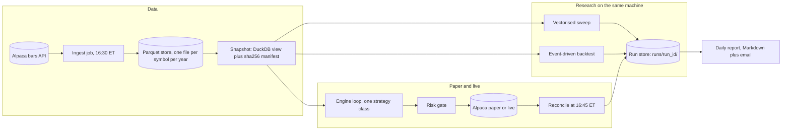
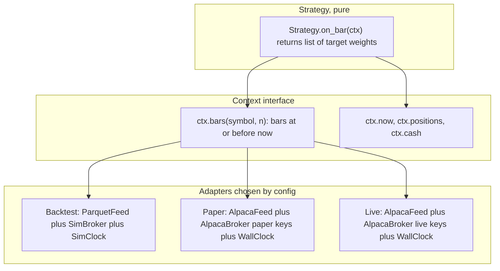
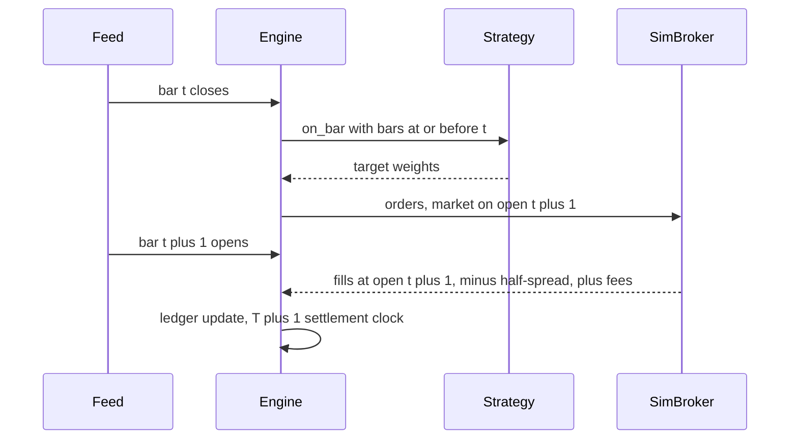

# Mini quant system — DE 03, strategy research and backtesting

Assumptions: US retail cash account at Alpaca (no PDT rule in a cash account, but T+1 settlement means capital cycles at most every other day). Daily bars are the primary timeframe; 1-minute bars are stored for a small universe but strategies act once a day at the close. Universe is fixed in advance: 20 liquid ETFs and large caps, 100 symbols kept in the data store for research. Python 3.12, Polars, NumPy, DuckDB, Parquet on the Mac mini's SSD. No cloud.

## Requirements

Functional

| # | Requirement | Number |
|---|---|---|
| F1 | Backtest any strategy over daily bars for the research universe | 100 symbols, 10 years, 252k bars |
| F2 | Same strategy object runs in backtest, paper and live with zero code change | 1 strategy class, 3 adapters, config switch |
| F3 | Vectorised research mode for parameter sweeps and event-driven mode for validation | both, with an agreement test between them |
| F4 | Walk-forward evaluation with an untouched holdout | 7 rolling OOS folds plus 2-year holdout |
| F5 | Cost model with fees, half-spread slippage and settlement constraints | default 5 bps per side, sensitivity at 10 and 20 |
| F6 | Every run reproducible from its run record | data hash, code version, params, seed, lockfile hash |

Non-functional

| # | Requirement | Target |
|---|---|---|
| N1 | Vectorised single backtest, 252k bars | under 100 ms |
| N2 | Event-driven single backtest, 252k bars | under 5 s |
| N3 | 500-config sweep, vectorised, 8 cores | under 60 s |
| N4 | Walk-forward, event-driven, 7 folds | under 60 s |
| N5 | Backtest result identical bit for bit on rerun of the same run record | 100 percent |
| N6 | Backtest and paper adapter produce the same orders on the same replayed day | 0 order diffs on a 20-day replay |
| N7 | Research never touches live keys or the live order path | separate config files, live keys absent from research env |

## Estimates

| Item | Estimate | Working |
|---|---|---|
| Daily bars, 100 symbols, 10 years | 252k rows, 10 MB raw, 3 MB Parquet | 100 x 252 x 10, 5 float64 fields |
| 1-minute bars, 20 symbols, 2 years | 3.9M rows, about 200 MB Parquet | 20 x 504 x 390 |
| Backfill API calls | 100 to 300, once | Alpaca free tier 200 req/min, done in 2 minutes |
| Daily update | 1 batch call per day at 16:30 ET | fits any free tier |
| Trades per year, daily strategy, 20-name universe | 250 to 500 | 1 to 2 rebalances per day |
| Monthly cost | under $15 | data free (Alpaca IEX, yfinance for research cross-check), commissions 0, power about $3, optional $9 SIP feed later |
| Round-trip cost per trade | about 10 bps plus regulatory fees on sells | half-spread 1 bp on SPY, 5 to 10 bps on mid-caps, SEC fee 0.0000278 x value, FINRA TAF 0.000166 per share |
| Annual cost drag | about 2 percent, $40 | 20x annual turnover x 10 bps |
| Honest gross edge, good retail daily strategy | 3 to 8 percent per year | $60 to $160 on $2,000 |
| Net expected P&L | $20 to $120 per year | the product is the knowledge, not the money |

The last three rows are the point. A 2 percent cost drag eats a third of a plausible edge, so the backtest's cost model is not a detail; a backtest with zero costs will show an edge that does not exist.

## High-level design

Main flows

1. Data in: ingest pulls the day's bars, appends to Parquet, rewrites the snapshot manifest (file list plus sha256 plus max timestamp). The snapshot hash is what a run record points to.
2. Signal: the strategy's `on_bar(ctx)` is called once per trading day after the close with a context that only exposes bars with timestamp at or before now. Same function in all three modes.
3. Order out: orders are next-day market-on-open by default. Backtest fills them from the next bar's open; paper and live submit them to Alpaca at 09:25 ET.
4. Reconcile: after the close, positions and cash from the broker are compared to the engine's own ledger. Any diff halts the next day's trading and pages the operator by email.
5. Report: one Markdown page per day with equity, trades, cost paid, and the backtest-versus-live tracking error for the running strategy.

## Deep dive: strategy research and backtesting engine

### The hard part

Not speed. The hard part is that a backtest is a machine for producing convincing lies, and the person reading it is the same person who wrote the strategy and wants it to work. Every design choice below exists to make a specific lie mechanically impossible or at least visible.

### The obvious approach and why it breaks

The obvious approach is a pandas DataFrame with `signal = ma20 > ma50`, `returns = close.pct_change() * signal`, and a plot. It breaks four ways:

| Lie | Mechanism | What it costs |
|---|---|---|
| Same-bar fill | Signal computed at close t, return earned from close t-1 to close t | Fabricates one bar of lookahead; on daily momentum it can double the Sharpe |
| Zero cost | No spread, no fee, no settlement | Hides the 2 percent drag from Estimates |
| Infinite cash and fractional everything | No position limit, no round lots, no T+1 | Shows 20 simultaneous positions on a $2,000 account |
| Survivorship | Universe is "current S&P 500" or "ETFs I know" | Only names that survived to today are tested; dead names never lose money |

### Vectorised versus event-driven: when each lies

| Property | Vectorised | Event-driven |
|---|---|---|
| Speed, 252k bars | 50 ms | 2 to 5 s |
| Lookahead risk | High, one `shift(1)` in the wrong place | Low, the feed physically cannot show the future |
| Cash, settlement, position limits | Not modelled without effort | Natural |
| Stops and intraday fills from daily bars | Cannot | Can, but is guessing the intraday path |
| Good for | Sweeps, feature research, sanity | Validation, walk-forward, and it is the paper and live engine |

The vectorised engine lies by omission; the event-driven engine lies by false precision (a stop "filled" at a price the daily bar never printed in that order). Use both and make them check each other: the agreement test runs the same strategy through both, with next-open fills and the same cost model, and fails CI if total return differs by more than 1 percent absolute or trade count by more than 5 percent. When they disagree, the vectorised one is nearly always the one that is wrong, and the disagreement is usually a lookahead.

### One code path, three adapters

Rules that make this real rather than a slide:

- The strategy returns target weights, not orders. The engine turns weights into orders using cash, settlement, lot rules and the risk gate. That keeps sizing logic out of the strategy and identical across modes.
- The strategy module cannot import `datetime`, `requests`, `alpaca` or `polars`. A lint rule enforces it. The only way to see data is `ctx.bars`, and `ctx.bars` is a view sliced at `now`.
- `SimClock` advances only when the engine says so. `WallClock` is the OS clock. The engine loop is one function: `for now in clock: ctx = build(now); weights = strategy.on_bar(ctx); broker.rebalance(weights)`. It is the same function in all three modes.
- Replay test (N6): take 20 real days of paper trading, rebuild the snapshot as of each day, run the backtest adapter over those days, diff the orders. Zero diffs or the build is red. This is the test that catches "works in backtest, does something else live".

### Lookahead and survivorship, mechanically

- Timing: signal at close of t, fill at open of t plus 1. The sequence below is the only fill timing the engine supports by default; anything else is a named, logged option.
- Data-level lookahead: adjusted closes are fine for returns but wrong for share counts and price levels, so the store keeps raw OHLCV plus a separate adjustment-factor series and the engine applies adjustments as of `now`. Corporate actions that arrive later cannot leak backwards.
- Indicator truncation test: for a random sample of 50 timestamps, compute every indicator on `data[:t]` and on the full array; the value at t must be equal. This catches centred rolling windows and accidental full-series normalisation, the two most common lookahead bugs.
- Survivorship: the universe file is point-in-time. For ETFs the effect is small and stated as an assumption. For single stocks the store keeps delisted names with their last prints and a delisting return of minus 100 percent unless a better one is known; if a delisted-symbol source is not available, single-stock backtests are labelled "survivor-only" in the run record and cannot graduate.

### Fill, slippage and fee model

| Component | Default | Notes |
|---|---|---|
| Fill price | next bar open | never the signal bar's close |
| Slippage | 5 bps per side, per-symbol override from measured spread | measured from the 1-minute data at 09:30 to 09:35 |
| Fees | SEC 0.0000278 x sell value, FINRA TAF 0.000166 per share sold, commission 0 | Alpaca pass-through |
| Settlement | T plus 1, cash account | unsettled cash cannot be reused; the ledger tracks it |
| Sensitivity | rerun at 10 and 20 bps automatically | a strategy whose edge dies at 10 bps did not have one |

### Walk-forward and out-of-sample discipline

- Split: 10 years. Years 1 to 8 are the walk-forward set: train on 3 years, test on the next 1, roll by 1 year, giving 5 OOS folds. Years 9 and 10 are the holdout, opened once per strategy family, ever. Opening it a second time is recorded in the run store and is a graduation blocker.
- Parameter budget: at most 3 free parameters per strategy. Each sweep records how many configurations it tried; the report shows the deflated Sharpe that accounts for that count. A Sharpe of 1.5 from the best of 500 configs is not a Sharpe of 1.5.
- Graduation to paper: OOS Sharpe above 0.5 in at least 4 of 5 folds, OOS-to-IS Sharpe ratio above 0.5, survives the 10 bps cost rerun, max drawdown under 20 percent, trade count above 100 in the OOS set so the estimate is not three lucky trades.
- Graduation to live: 60 trading days of paper with tracking error to the backtest replay under 1 percent per month, and at most 2 reconcile halts in that period.

### Speed on a Mac mini and how to get there

| Step | Effect on 252k-bar event-driven run |
|---|---|
| Baseline: pandas row iteration, per-bar DataFrame slice | about 250 s |
| Load once into dense arrays, shape T x N per field, master calendar, NaN for gaps | 40 s |
| Loop over T equals 2,520 days, one event per day carrying a vector of 100 symbols, not 252k events | 3 s |
| Precompute indicators vectorised over the full array, protected by the truncation test | 1.5 s |
| No pandas, no logging, no allocation inside the loop; append to preallocated arrays | 0.8 s |
| Sweeps: multiprocessing over parameter sets across 8 cores, not over symbols | 500 configs in 40 s vectorised |

The step that matters is the third one. The event is "the day closed", not "a bar arrived for symbol k"; the strategy is handed all 100 symbols at once. Numba is on the shelf and stays there until a profile says otherwise. Each step above is the smallest change that hits the target; nothing else is built.

### Reproducibility record

Each run writes `runs/<run_id>/record.json`, `equity.parquet`, `trades.parquet`, and the store indexes `record.json` into a DuckDB table so runs are queryable. `run_id` is the sha256 of the record's inputs, so an identical rerun overwrites the same directory and a different result on the same `run_id` is a bug.

| Field | Why |
|---|---|
| `data_snapshot_hash` | sha256 of the manifest: file list, per-file sha256, max timestamp |
| `universe_hash` | the point-in-time universe file |
| `git_commit`, `git_dirty` | a dirty tree is allowed for research, blocks graduation |
| `params` | full dict, including defaults, not just the ones changed |
| `cost_model_version` | slippage and fee parameters are code, so they get a version |
| `seed` | for anything stochastic: tie-breaks, bootstraps, random universes |
| `lockfile_hash` | Python and library versions; NumPy changed rounding across versions before |
| `engine_mode` | vectorised or event-driven, and fill timing |
| `sweep_size` | number of configurations tried in the same session, for deflated Sharpe |
| `holdout_opened` | boolean, permanent once true for the strategy family |
| `metrics` | Sharpe, drawdown, turnover, cost paid, trade count, OOS per fold |

## Trade-offs

| Decision | Chosen | Alternative | Why |
|---|---|---|---|
| Engine | Own engine, about 600 lines | Backtrader, vectorbt, Zipline | Same-engine-for-live is the whole point; frameworks do backtest well and live badly, or vice versa |
| Storage | Parquet plus DuckDB | Postgres, TimescaleDB | 10 MB of data does not need a server; snapshot hashing is trivial on files |
| Fill timing | Next open only by default | Configurable | Every extra fill option is a new way to lie; options are added when a strategy needs them and are logged |
| Sweeps | Vectorised, agreement-tested | Event-driven everywhere | 50x faster, and the agreement test bounds the error |
| Holdout | 2 years, opened once | Repeated OOS | The only OOS you have not looked at is the one you have not looked at |

## Pitfalls

- Adjusted close used for share counts: buys 3x the shares across a split. Keep raw plus factors.
- `rolling(center=True)` or a whole-series z-score in an indicator: silent lookahead. Truncation test catches it.
- Timezone: bars stamped UTC, strategy thinks in ET; the "close" bar becomes tomorrow. All timestamps stored UTC, displayed ET, and the calendar comes from the exchange, not from the data.
- Backtest ignores T plus 1: shows daily churn a cash account cannot do. Ledger tracks unsettled cash.
- Opening the holdout twice, "just to check". Recorded, permanent, blocks graduation.
- Paper fills at Alpaca are optimistic (filled at the quote, no slippage). Tracking error in paper understates live; the 5 bps model stays on in paper reporting.

## Open questions for the panel

1. Is the T plus 1 cash-account constraint acceptable, or does the operator want a margin account and the PDT day-trade counter modelled in the engine instead?
2. Single stocks need a delisted-symbol source for honest survivorship; is a $30 per month data subscription in budget, or is the universe ETFs only for year one?
3. Should the risk gate live inside the engine loop, shared by all three adapters, or be a separate process in front of the broker? I lean inside, so the backtest sees the same rejections as live.
4. Is 1 percent per month tracking error between paper and backtest replay the right graduation bar, or too loose for a daily strategy with 20 names?
5. Who reviews a graduation decision when there is one operator? A written checklist filled in and committed is the minimum; is that enough?

## Non-negotiables

1. One engine loop for backtest, paper and live, with the 20-day replay test producing zero order diffs. Without this, the backtest describes a different system than the one trading.
2. Next-open fills and a non-zero cost model on by default, with the 10 bps sensitivity rerun. A zero-cost, same-bar backtest is not a backtest.
3. Every run has a record with data snapshot hash, code version, full parameters, seed and sweep size, and an identical rerun reproduces it bit for bit. A number you cannot reproduce is not a result.
