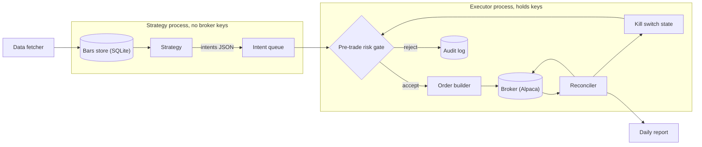
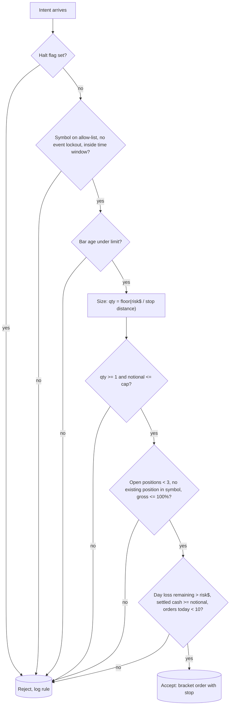
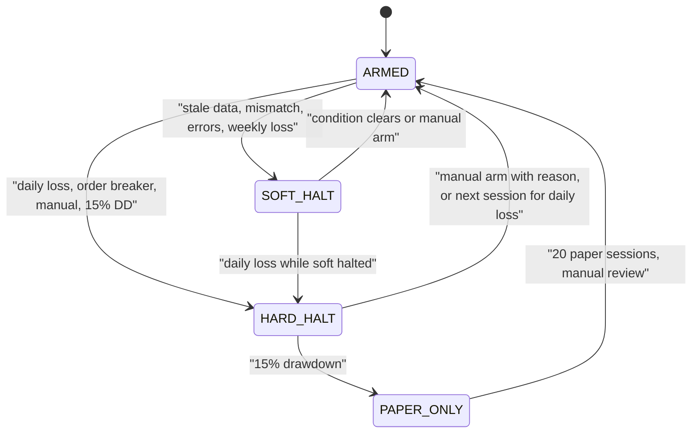

# Mini quant system — DE 04, risk management

Assumptions: Alpaca, US equities and ETFs only, cash account (no margin, no shorts, no options), long-only daily-bar strategy with at most one intraday check, 3 to 5 liquid ETFs priced under $200 so one share is a sane lot for a $2,000 book. Python on the Mac mini, SQLite for state. Risk numbers below are stated in dollars against the $2,000 starting equity and scale with current equity.

## Requirements

Functional

| # | Requirement | Number |
|---|---|---|
| F1 | Every order passes one pre-trade gate; the strategy cannot reach the broker | 100% of orders, zero exceptions |
| F2 | Every entry carries a broker-side stop (bracket order) | stop at 2 x ATR(14), attached at submit |
| F3 | Daily loss limit halts trading for the day | 2% of start-of-day equity, $40 |
| F4 | Drawdown budget from high-water mark halts live trading | 15%, $300, tiered de-risking from 5% |
| F5 | Reconcile broker state against local ledger | every 5 min in market hours plus 09:25 and 16:05 ET |
| F6 | Kill switches: daily loss, reconciliation mismatch, stale data, repeated errors, order-count breaker, manual | all persist across restarts, manual re-arm only |
| F7 | Symbol allow-list and event lockout | 5 symbols max; no entries on FOMC, CPI, NFP days, first 5 and last 10 min |

Non-functional

| # | Requirement | Number |
|---|---|---|
| N1 | Gate latency | under 50 ms, single process, no network call except the broker snapshot already cached |
| N2 | Gate decisions are auditable | every accept and reject written to SQLite with the rule that fired |
| N3 | Halt survives crash and reboot | halt flag in SQLite, checked before any order |
| N4 | Unattended for one trading day | broker-side stops protect open positions if the Mac dies |
| N5 | Strategy code has no broker credentials | keys live only in the executor process |

## Estimates

| Item | Estimate | Working |
|---|---|---|
| Trades | 2 to 6 per week, 100 to 300 round trips per year | 3 to 5 symbols, daily signals, average hold 3 to 10 days |
| Orders to broker | under 20 per day including stops and cancels | 6 entries max, each with a bracket leg |
| Broker API calls | about 150 per day | reconciliation 78 polls plus orders; Alpaca limit is 200 per minute |
| Data | 5 symbols x 390 x 252 = 490k one-minute rows per year, about 50 MB | SQLite or parquet, trivial on a 512 GB SSD |
| Risk per trade | 1% = $20 | fixed fractional, halved in drawdown tiers |
| Typical position | $500 to $800, 1 to 3 shares of a $200 ETF | $20 risk over a 2.5% to 4% stop distance |
| Max simultaneous exposure | 100% of equity, 3 positions | cash account, no leverage possible |
| Costs per month | $0 commissions, about $1 to $3 regulatory fees, $2 electricity, $0 data on the free IEX feed | SIP feed at $99 per month is 5% of the account per month, rejected |
| Spread cost | about 0.5 to 2 bp per side on SPY-class ETFs | $0.01 spread on $600 |
| Honest edge | 5 to 15 bp per round trip after costs if the strategy works, 0 if not | 200 trades x 10 bp x $700 = $140 per year, 7% |
| Drawdown budget in dollars | $300 hard stop, $100 first de-risk tier | 15% and 5% of $2,000 |

The honest number: a 7% expected return on $2,000 is $140, which is under the cost of one bad bug. The risk layer exists because the downside of a bug is the whole $2,000 and the upside of the strategy is $140. That asymmetry sets every limit below.

## High-level design

Main flows

1. Data in: fetcher pulls daily and one-minute bars for the allow-list after close and every minute in market hours, stamps `received_at`, writes to SQLite.
2. Signal: strategy reads bars, emits intents `{symbol, side, risk_fraction, stop_price, reason, ts}`. It never emits a share quantity; sizing belongs to the gate.
3. Order out: gate runs the checks in the deep dive, computes quantity, submits a bracket order (entry plus stop, plus optional take-profit).
4. Reconcile: every 5 min the reconciler pulls positions, open orders and equity from the broker and diffs against the ledger. The broker is truth.
5. Report: 16:10 ET summary to Telegram: equity, day P&L, open positions, rejects by rule, kill switch state, drawdown from high-water mark.

The two processes run under different macOS users via launchd. The strategy user cannot read the executor's Keychain item. That is what makes "cannot bypass" true rather than a convention.

## Deep dive: risk management

### The hard part

The strategy is the least trusted code in the system. It is the code the operator changes most often, backtests least honestly, and is most likely to have a sign error. The hard part is building a layer that assumes the strategy is wrong and bounds the damage without knowing how it is wrong.

### The obvious approach and why it breaks

Obvious: put `if qty * price > MAX_NOTIONAL: return` inside the strategy, keep a `daily_pnl` variable in memory, and read positions from the local ledger.

It breaks four ways. A refactor deletes the check and nothing notices. The in-memory P&L resets on every crash, so the limit re-arms itself. The local ledger drifts from the broker after a partial fill or a manual trade in the app, and the check limits a position that does not exist. And a strategy with the broker client imported can always call `submit_order` directly, so the check is advisory.

### What I would do instead

Separate the layers by process and credential, make the broker the source of truth, persist every halt, and attach every stop to the order so it lives at the broker.

Pre-trade gate, in order. Each check short-circuits with a named reject reason.

Limits table, all stored in one `limits` table in SQLite and read at gate time, never as constants in code:

| Limit | Value at $2,000 | Rule | Why this number |
|---|---|---|---|
| Risk per trade | 1%, $20 | `risk$ = equity x tier_fraction` | 20 consecutive losers cost 18%, still inside the budget |
| Stop distance | 2 x ATR(14) | from the intent, gate recomputes and rejects if the strategy's stop is tighter than 1 x ATR | tighter stops get hit by noise and blow up the trade count |
| Max notional per order | 40%, $800 | `qty x price <= 0.4 x equity` | bounds a single-name gap; also the fat-finger cap |
| Max open positions | 3 | count from broker snapshot | 3 x 40% already exceeds cash, so gross cap binds first |
| Gross exposure | 100% | cash account, enforced by broker too | no leverage, by construction |
| Max daily loss | 2%, $40 | `equity_now < equity_sod x 0.98` triggers hard halt | two full-risk losers plus slippage |
| Max weekly loss | 4%, $80 | rolling 5 sessions, soft halt | catches a regime the daily limit slices thin |
| Drawdown budget | 15% from HWM, $300 | daily close equity vs HWM | see tiers below |
| Orders per day | 10 | counter in SQLite | expected max is 6; 10 means a loop |
| Symbol allow-list | 5 ETFs, price under $200, avg volume over 5M | YAML file, edited by hand | granularity: 1 share must be under 10% of equity |
| Event lockout | FOMC, CPI, NFP dates, single-name earnings | YAML calendar, refreshed monthly by hand | gaps on those days exceed the stop distance |
| Time window | no entries 09:30 to 09:35 or 15:50 to 16:00 ET | clock check | opening and closing auction noise |
| Bar staleness | daily: no bar by 16:30 ET skips next day; intraday: over 3 min | `now - received_at` | stale price means the stop distance is fiction |

Position sizing for $2,000

| Method | Formula | Size on SPY-class ETF, ATR 1.2% | Verdict |
|---|---|---|---|
| Fixed dollars | $500 per trade | $500 | ignores volatility; same size on TLT and on a 3x fund |
| Fixed fractional | `qty = floor(0.01 x equity / stop_dist)` | $20 / (2.4% x $180) = 4 shares, $720 | chosen. Scales down automatically as equity falls |
| Volatility target | `notional = equity x target_vol / realized_vol` | 10% target, 15% realized = $1,330 | good in theory, exceeds notional cap here; the ATR stop already vol-scales |
| Full Kelly | `f = p - (1-p)/b` | p 0.52, b 1.1 gives f = 8.4%, $168 risk per trade | wrong, see below |
| Quarter Kelly | `f / 4` | 2.1%, $42 risk | defensible upper bound; I still pick 1% |

Why full Kelly is wrong here. First, the edge is not known. With 100 trades the 95% interval on a 52% win rate is 42% to 62%; the low end makes Kelly negative, meaning do not trade. Kelly is only optimal for the true `p`, and the estimate error at this sample size is larger than the edge. Second, full Kelly has a 50% chance of a 50% drawdown before doubling; on $2,000 that is $1,000 lost with the strategy working as designed, and the operator will not stay in the game to see the recovery. Third, granularity: 8.4% risk over a 2.4% stop is $7,000 of notional, 3.5x the account, impossible in a cash account. The gate's notional cap would reject it, which is the point of having the cap outside the sizing function. Fixed fractional at 1% is roughly one-eighth Kelly under the optimistic estimate and zero-to-negative Kelly under the pessimistic one, which is the right place to be while the edge is unproven.

Drawdown budget and what happens when it is hit

| Drawdown from HWM | Tier | Risk per trade | Max positions | Other |
|---|---|---|---|---|
| 0 to 5% | normal | 1% | 3 | |
| 5 to 10% | caution | 0.75% | 3 | report flags it daily |
| 10 to 15% | reduced | 0.5% | 2 | no new symbols added |
| 15% or more | hard stop | 0 | 0 | flatten at next open, halt live, paper only for 20 sessions |

HWM is the max daily close equity, including deposits netted out. Recovery from the hard stop is a manual decision, not a timer: the operator reviews the trade log, and live resumes only after 20 paper sessions with positive expectancy and a written note in the audit log saying why. If the strategy hits 15% twice, the honest read is that it has no edge at this sample size and the budget is not renewed.

Kill switches

| Trigger | Detection | Action | Re-arm |
|---|---|---|---|
| Daily loss 2% | reconciler compares broker equity to `equity_sod` | hard halt: cancel opens, flatten, set flag | automatic next session, logged |
| Weekly loss 4% | rolling 5-session P&L | soft halt: no new entries, stops stay | manual |
| Reconciliation mismatch | broker positions or open orders differ from ledger for 2 consecutive polls | soft halt, alert; do not flatten, the unknown position may be mid-fill | manual after ledger corrected |
| Stale data | bar age over limit | soft halt for that symbol | automatic when fresh bar arrives |
| Repeated errors | 3 consecutive order rejects or 5 API errors in 10 min | soft halt | manual |
| Order-count breaker | over 10 orders in a day | hard halt | manual |
| Manual | `riskctl halt` or Telegram `/halt` | hard halt | manual `riskctl arm --reason` |
| Deadman | healthchecks.io ping missed for 10 min | alert operator; broker stops already protect | n/a |

Soft halt keeps stops live and allows exits. Hard halt flattens. The flag is a row in SQLite with `state, reason, set_at, set_by`; the gate reads it first, so a restart cannot re-arm anything.

Enforcement as a layer the strategy cannot bypass

1. Process and user separation: strategy runs as user `quant-strat`, executor as `quant-exec`. Alpaca keys are a Keychain item owned by `quant-exec`. The strategy can only write intents to a directory the executor polls.
2. Intents carry no quantity. The gate sizes. A strategy that wants to go big can only say so through `risk_fraction`, which the gate clamps to the tier value.
3. Broker-side constraints as the outer wall: cash account means no leverage, no shorts, no options, regardless of any bug in my code. Every entry is a bracket order so the stop lives at Alpaca, not on the Mac.
4. Reconciler uses broker numbers for every limit: equity, positions, open orders. The local ledger is a cache for diffing, never an input to a limit.
5. Limits are data, changed with `riskctl set --reason`, and every change is a logged row. Raising a limit in the middle of a losing day is the classic failure; the log makes it visible in the next report.
6. One integration test that must pass before deploy: a strategy that emits 50 intents at `risk_fraction 1.0` for a symbol not on the allow-list produces zero broker calls and 50 reject rows.

## Trade-offs

| Decision | Chosen | Alternative | Cost of the choice |
|---|---|---|---|
| Account type | cash | margin at 1x | T+1 settlement means the gate must track settled cash; margin would allow shorts but brings the PDT rule under $25k |
| Stop location | broker-side bracket | software stop on the Mac | bracket orders need whole shares on Alpaca, so sizing is coarse; worth it for surviving a dead Mac |
| Mismatch response | soft halt, no flatten | flatten everything | an auto-flatten on a false mismatch pays the spread twice for nothing; a real unknown position sits for the minutes until the operator answers |
| Daily loss re-arm | automatic next session | manual | fewer operator touches; risk that a bad regime burns 2% per day for a week, which the weekly limit catches |
| Limits in SQLite | data | constants in code | one more table to maintain; changes become auditable |
| Two OS users | real isolation | one process with a code convention | launchd setup costs an hour once |

## Pitfalls

- Sizing on unadjusted prices after a dividend or split: ATR spikes, stop distance is wrong for a day. Use adjusted bars for ATR and the raw price for notional.
- Counting unrealized P&L in the daily limit is right, but a wide intraday spread on the IEX feed can print a fake 2% loss and trigger a flatten. Use the broker's `equity`, which marks at NBBO, not the feed's last trade.
- Bracket stop fills on a gap through the stop at a much worse price; the 1% risk is a target, not a bound. The notional cap is the real bound, which is why it stays at 40%.
- `equity_sod` taken before a deposit settles makes every day look like a gain. Net deposits and withdrawals out of both `equity_sod` and HWM.
- Event calendar goes stale because it is edited by hand. The report prints the calendar's last-updated date; over 35 days old is a soft halt.
- Timezones: everything in ET internally, the Mac is set to local time. One `datetime.now()` without a zone in the time-window check is a full trading day of accidental lockout, or none.
- Rejects are silent by default. If the strategy is rejected 100% of the time for a week, that is a bug. The daily report counts rejects by rule and flags any rule over 50%.

## Open questions for the panel

1. Should the reconciliation mismatch flatten after N minutes without an operator response, or stay soft-halted indefinitely? I lean stay, because stops are live, but the panel may want a 30-minute ceiling.
2. Fractional shares would fix sizing granularity but lose bracket orders on Alpaca. Is a fractional market entry plus a separate stop order an acceptable two-step, given the window between them?
3. Is a 15% drawdown budget too generous for a first strategy? A 10% budget gives $200 of tuition and a faster, cheaper answer to "is there an edge".
4. Does anyone want the weekly 4% limit at all, or is it redundant with the drawdown tiers? It exists to catch a slow bleed the tiers see too late.
5. Where does the strategy lens want the vol estimate to come from: the same ATR the gate uses, or its own? Two estimates that disagree is a source of rejects nobody can explain.

## Non-negotiables

1. The strategy process has no broker credentials and emits no quantities. If the gate can be imported around, there is no gate.
2. Every entry is a bracket order with a broker-side stop. The Mac dying must not be a risk event.
3. Halt state and limits live in SQLite, survive restart, and every change is logged with a reason. A limit that resets on crash or can be raised silently is not a limit.
