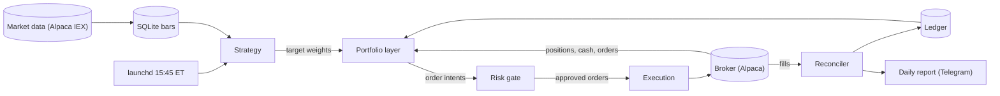
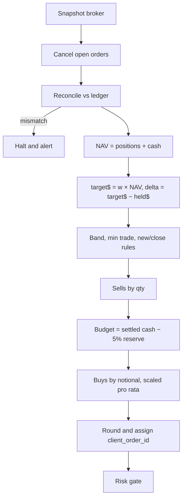
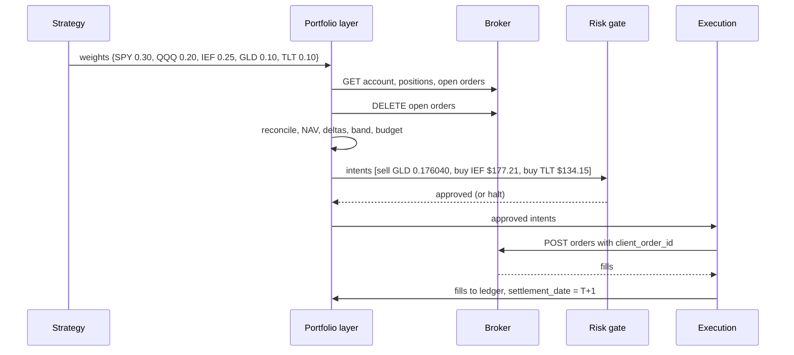

# Mini quant system — DE 05, portfolio construction under $2,000

Lens: what a $2,000 account can actually hold, and the layer that turns target weights into orders without tripping settlement rules.

Assumptions: US retail account at Alpaca (commission-free, fractional/notional orders, REST API, free IEX data). Daily timeframe, one order run per trading day. Long-only ETFs. Settlement is T+1 (since 2024-05-28). Everything below transfers to IBKR or Robinhood with the footnotes in Pitfalls.

## Requirements

Functional:

| # | Requirement | Number |
|---|---|---|
| F1 | Accept target weights from the strategy | ≤ 8 symbols, each 0 ≤ w ≤ 0.40, sum ≤ 0.95 |
| F2 | Translate weights to orders once per day at a fixed time | run at 15:45 ET, complete in < 60 s |
| F3 | Never spend unsettled cash, never same-day round-trip, never short | enforced in code, tested |
| F4 | Idempotent run | re-running after a crash produces zero duplicate orders |
| F5 | Reconcile local ledger vs broker before and after trading | halt if any position differs by > $1 or 0.001 sh |
| F6 | Report | one daily message: NAV, weights vs target, orders, fees, drift |

Non-functional:

| # | Requirement | Number |
|---|---|---|
| N1 | Unattended for one trading day; missed run = no trades | fail closed |
| N2 | Tracking error to target, per position | ≤ 5 percentage points of NAV between runs |
| N3 | Rebalancing cost | < 0.1% NAV per month (< $2) |
| N4 | Minimum viable position | ≥ $100, so a $10 minimum trade is ≤ 10% of the position |
| N5 | Cash buffer | 5% of NAV to absorb quote-to-fill drift and fees |

## Estimates

| Item | Estimate |
|---|---|
| Universe | 5 to 6 ETFs (e.g. SPY, QQQ, IEF, TLT, GLD) plus cash |
| Position size | $2,000 × 0.95 / 5 ≈ $380 each; a 1% move is $3.80 |
| Data | 6 symbols × 1 daily bar = ~1,500 rows/yr, < 1 MB. If 1-min bars: 6 × 390 × 252 ≈ 590k rows/yr ≈ 50 MB |
| API calls | ~15 per run (account, positions, orders, 6 quotes, ≤ 6 orders), ~300/mo |
| Orders | ~1.2/day with a 20% band → ~25/mo, ~300/yr |
| Broker cost | $0 commission. Reg fees on sells: SEC Section 31 ($0 to $28 per $1M) + FINRA TAF (~$0.0002/sh) ≈ < $0.05/mo |
| Spread cost | ETF half-spread 0.5 to 2 bps × turnover ~40% NAV/mo × $2,000 ≈ $0.10 to $0.40/mo |
| Infra | Mac mini ~7 W idle → ~5 kWh/mo ≈ $1. Data free tier. Total < $2/mo |
| Honest edge | Daily ETF rotation: 0 to 3%/yr excess after costs = $0 to $60/yr. At 15% vol, detecting a 3%/yr edge at 2σ needs ~25 years of live data. Live trading will show you whether the strategy is *broken*, not whether it is *good* |

The cost line matters for the lens: at $2,000 fees are cents. Instrument count is bounded by position-size arithmetic and settlement rules, not by fees.

## High-level design

Main flows:

1. Data in: after close, pull daily bars for the universe into SQLite. Missing bar → run aborts, no trades.
2. Signal: strategy reads bars, emits `{symbol: weight}` with sum ≤ 0.95. It knows nothing about dollars, shares, or settlement.
3. Order out: portfolio layer snapshots the broker, cancels stale open orders, computes deltas, applies band and rounding, sequences sells then buys, budgets against settled cash, emits intents. Risk gate checks caps and kill switch. Execution submits with deterministic `client_order_id`.
4. Reconcile: after fills (or at 16:05 ET), compare broker positions and cash to the ledger. Mismatch → halt flag, no trading until a human clears it.
5. Report: one message with NAV, weight drift, orders, fees, and any halt.

## Deep dive: portfolio construction under $2,000

### The hard part

$2,000 is small enough that three things a large fund ignores become the design: share-price granularity, minimum position economics, and settlement rules written for retail accounts. The obvious approach — compute `shares = floor(weight × NAV / price)` and send market orders — fails on all three.

### What a $2,000 account can hold

Whole-share rounding at a $400 slot:

| Price | Shares | Actual $ | Error vs $400 |
|---|---|---|---|
| $50 | 8 | $400 | 0% |
| $150 | 2 | $300 | −25% |
| $250 | 1 | $250 | −37.5% |
| $560 (SPY) | 0 | $0 | −100%, position impossible |

With fractional/notional orders (Alpaca: $1 minimum, notional to $0.01, qty to 9 dp) the error is $0.005 / $2,000 = 0.03 bp. So fractional is what makes the account constructible at all. Without it the universe shrinks to low-priced share classes (SPLG ~$70 instead of SPY, QQQM ~$200 instead of QQQ) and rounding still costs 10 to 25% per position.

Instrument count versus what breaks:

| Positions | $ each | What breaks |
|---|---|---|
| 1 | $1,900 | Single-instrument risk; no diversification to speak of |
| 3 to 5 | $380 to $633 | Sweet spot: a $10 minimum trade is < 3% of a position, band rebalancing works |
| 8 | $238 | Still fine; operator can no longer explain every holding |
| 10 | $190 | 1% move = $1.90; strategy noise dominates; minimum trade is 5% of position |
| 20 | $95 | Below N4; band and minimum-trade rules collide, positions either never rebalance or churn |

Rule: `max_positions = floor(NAV × 0.95 / $200)`, capped at 8. At $2,000 that is 9 → 8; after a drawdown to $1,200 it is 5. The portfolio layer publishes this number; the strategy must respect it.

### Cash, settlement, and the account type

| Rule | Cash account | Margin account (< $25k equity) |
|---|---|---|
| Settlement | T+1 | T+1 |
| Buy with unsettled proceeds | Allowed, but selling that position before the funds settle = good-faith violation (GFV). 3 GFVs in 12 months → 90 days settled-cash-only | Allowed |
| Same-day round trip | Not a "day trade" for PDT, but GFV/free-riding risk | Counts toward PDT: 4 in 5 business days → flagged, closing-only |
| Margin interest | None | Charged if borrowed |
| Alpaca default | Margin, 2× buying power at ≥ $2,000 equity | Same; at < $2,000 equity Reg T removes margin, account behaves as cash |

Note the $2,000 threshold: the account starts *exactly* on the line where broker behaviour changes. A $60 drawdown flips margin off. The only sane design is to ignore the broker's buying power entirely and run cash-account semantics in software regardless of account type:

1. Spend settled cash only. Today's sell proceeds are spent tomorrow.
2. Zero same-day round trips. A symbol sold today cannot be bought today and vice versa (the run sequences sells then buys, so this is a symbol-level exclusion).
3. One run per day.

With these three, GFV, free-riding and PDT are structurally impossible, not just unlikely. Settled cash: Alpaca does not expose it directly for margin accounts, so the ledger tracks it: `settled = cash − Σ sell proceeds with settlement_date > today`. Reconcile checks the total against the broker's `cash`.

### Rebalancing cadence

| Cadence | Orders/mo (5 positions) | Turnover/mo | Spread cost/mo at 5 bps | Max tracking error |
|---|---|---|---|---|
| Daily, no band | ~100 | ~150% | $1.50 | ~0 |
| Daily, 20% relative band | ~25 | ~40% | $0.40 | 20% of target weight (4 pp on a 20% weight) |
| Weekly, 20% band | ~8 | ~30% | $0.30 | band plus a week of drift |
| Monthly | ~5 | ~25% | $0.25 | large; a daily strategy is pointless at this cadence |

Choice: daily with a band. Trade a symbol only if `|delta$| ≥ max($10, 0.20 × target$)`; always open a new position if `target$ ≥ $25`; always close fully if target is 0. Costs are cents either way; the band is there to cut order count (fewer things to reconcile, fewer partial fills) and to keep tracking error inside N2 by construction.

### Translation pipeline

Rounding rules: sells by quantity, rounded *down* to 6 dp and capped at held quantity (you cannot sell what you do not hold); full closes use the broker's close-position call with exact held qty so no dust remains. Buys by notional to $0.01 (spend exactly the dollars). `client_order_id = sha1(run_date, symbol, side)[:16]`; the broker rejects a duplicate id, so a re-run cannot double-order.

### Worked example

Account at 15:45 ET. Settled cash $412.30, no unsettled cash, no open orders.

| Symbol | Held qty | Price | Held $ | Target w | Target $ | Delta $ | Band = max($10, 20% target) | Action |
|---|---|---|---|---|---|---|---|---|
| SPY | 1.234567 | 560.00 | 691.36 | 0.30 | 605.60 | −85.76 | 121.12 | skip, inside band |
| QQQ | 0.900000 | 480.00 | 432.00 | 0.20 | 403.73 | −28.27 | 80.75 | skip |
| IEF | 2.500000 | 95.20 | 238.00 | 0.25 | 504.67 | +266.67 | 100.93 | buy |
| GLD | 1.000000 | 245.00 | 245.00 | 0.10 | 201.87 | −43.13 | 40.37 | sell |
| TLT | 0 | 90.00 | 0 | 0.10 | 201.87 | +201.87 | new ≥ $25 | buy |
| Cash | | | 412.30 | 0.05 | 100.93 | | | reserve |

NAV = 1,606.36 + 412.30 = $2,018.66.

Sells first: GLD qty = 43.13 / 245.00 = 0.176040 (rounded down) → sell 0.176040 sh ≈ $43.13. Proceeds settle tomorrow; not spent today.

Buy budget = settled cash − reserve = 412.30 − 100.93 = $311.37. Buys wanted = 266.67 + 201.87 = $468.54 > budget, so scale by 311.37 / 468.54 = 0.6645:

| Order | Side | Type | Amount | client_order_id |
|---|---|---|---|---|
| 1 | sell | qty, market, DAY | GLD 0.176040 sh | sha1("2026-09-04","GLD","sell") |
| 2 | buy | notional, market, DAY | IEF $177.21 | sha1("2026-09-04","IEF","buy") |
| 3 | buy | notional, market, DAY | TLT $134.15 | sha1("2026-09-04","TLT","buy") |

Fees on this run: SEC + TAF on the $43 sell ≈ $0.001; spread on ~$355 of ETF trades ≈ $0.02. Total ≈ $0.02, i.e. 0.1 bp of NAV.

After fills: cash ≈ 412.30 − 311.36 + 43.13 (pending) = $144.07 (7.1%). IEF at $415.21 = 20.6% vs 25% target. Tomorrow's run: IEF delta 89.46 < band 100.93 → skip; TLT delta 67.72 > band 40.37 → buy $67.72 from the now-settled cash. IEF stays 4.4 pp under target, inside N2. That is the band working: targets are approached, not hit.

Same example on a whole-share broker: GLD sell rounds to 0 (skip), IEF buys 1 sh ($95.20, 46% short), TLT buys 1 sh, SPY could never have been held at a $400 slot. The weights the strategy asked for are unreachable.

### Where the layer sits

Strategy → weights → portfolio layer → intents → risk gate → execution. The portfolio layer owns dollars, shares, settlement and idempotency. The risk gate owns caps (max weight 40%, gross ≤ 95%, daily loss ≥ 3% NAV → halt, order notional ≤ NAV, price within 2% of last quote) and the kill switch. The split matters because the risk gate must be able to reject an intent without knowing why it was generated, and the portfolio layer must not be the thing that decides whether trading is allowed at all.

## Trade-offs

| Decision | Chosen | Alternative | Why |
|---|---|---|---|
| Fractional vs whole shares | Fractional/notional | Whole shares, low-priced share classes | Whole shares give 25 to 100% weight error per position at $400 slots |
| Account semantics | Cash semantics in software | Use margin buying power | $2,000 sits on the margin threshold; PDT and GFV become impossible with cash rules |
| Cadence | Daily with 20% band | Daily full rebalance | Same cost order of magnitude; band cuts orders 4× and bounds tracking error |
| Sell orders | By qty | By notional | Notional sells can overshoot held qty by rounding and leave dust |
| Buy orders | By notional | By qty | Spends exactly the budget; qty buys overspend when price moves |
| Order type | Market, DAY, 15:45 ET | Limit | Fractional limit orders are DAY-only and may not fill; on ETFs market impact is < 2 bps |
| Budget overflow | Scale buys pro rata | Fill largest delta first | Pro rata keeps relative weights; largest-first starves small positions |

## Pitfalls

- Fractional orders at Alpaca are regular-hours only; a run that slips past 16:00 ET will be rejected. Fail closed, do not queue.
- A notional buy fills at a slightly different price; store filled qty from the fill, never the computed qty.
- Dust: 0.000001 sh positions from rounding. Always close with the broker's close-position call, not a computed qty.
- Open orders from a crashed previous run. Cancel all at the start of every run; they are DAY orders, but the broker may still hold them intraday.
- Corporate actions (splits, ETF distributions) change qty and cash overnight. Reconcile from the broker before computing anything; the ledger is a check, not the source of truth for holdings.
- Alpaca's day-trade counter includes fractional orders. The symbol-level same-day exclusion prevents it, but the reconciler should still read `daytrade_count` and halt if it is ever > 0.
- Equity dropping below $2,000 changes broker behaviour (margin off). The cash-semantics design makes this a no-op, but the report should show it.
- IBKR: cash accounts are explicit and fractional is supported, but fractional orders are non-marketable-limit unfriendly; Schwab fractional is S&P 500 only; Robinhood API is newer and rate-limited. Re-check the fee and fractional tables before switching.

## Open questions for the panel

1. Should the account be opened as an explicit cash account so the broker enforces the rules too, or is software enforcement plus reconciliation enough? Belt and braces costs nothing but restricts a later move to intraday.
2. Is the 20% relative band the portfolio layer's constant, or should the strategy own it because it knows how fast its signal changes?
3. When NAV shrinks and `max_positions` drops, who decides which position to drop: the strategy (re-rank) or the portfolio layer (smallest weight)?
4. ETFs only, or allow single stocks? At $380 a position a single stock is noise; a universe cap by ADV and spread seems necessary.
5. Should the risk gate scale gross exposure *before* banding (so the band sees final targets) or after (so a gate cut always trades)? I have it before.

## Non-negotiables

1. Fractional/notional orders at the broker with a minimum notional ≤ $5. Without it the account cannot honestly hold more than three positions and the weight the strategy asked for is fiction.
2. Settled-cash-only, no same-day round trip, one run per day, enforced in the portfolio layer with a test that fails if any of the three is removed. Not a convention, not a comment.
3. Idempotent runs: cancel open orders, reconcile before trading, deterministic `client_order_id`. A crash between "submit IEF" and "submit TLT" must not produce two IEF orders tomorrow.
